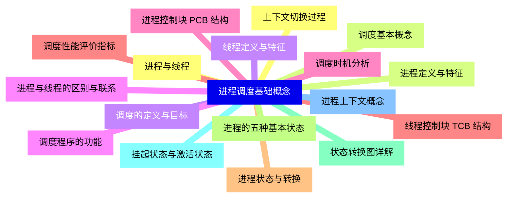
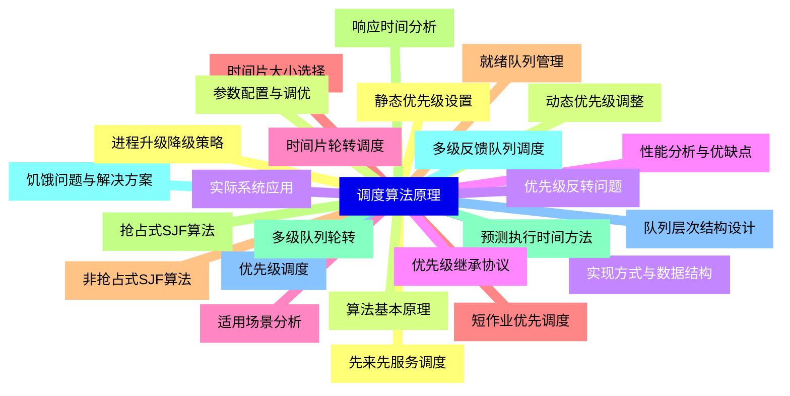
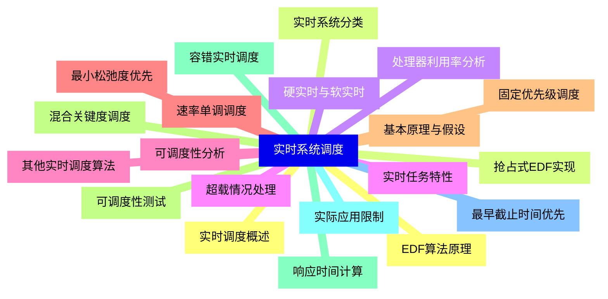
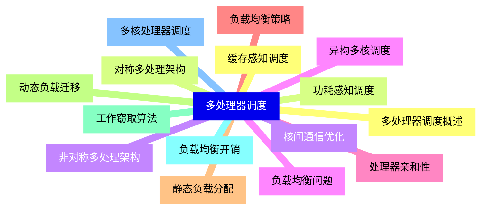
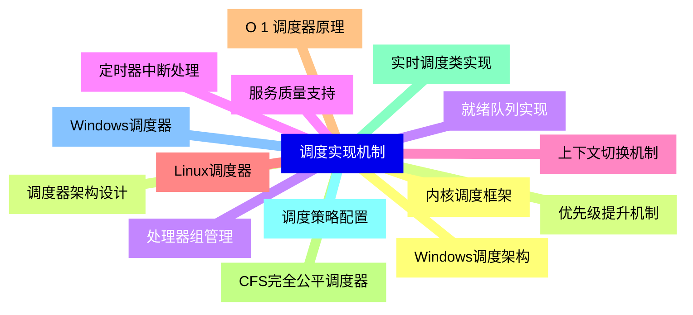
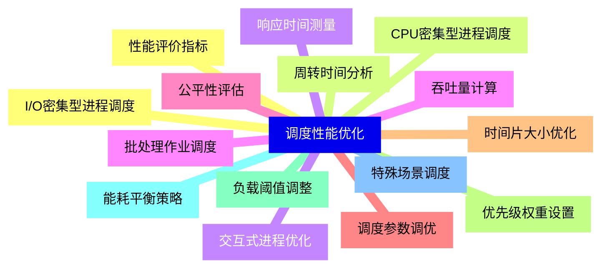
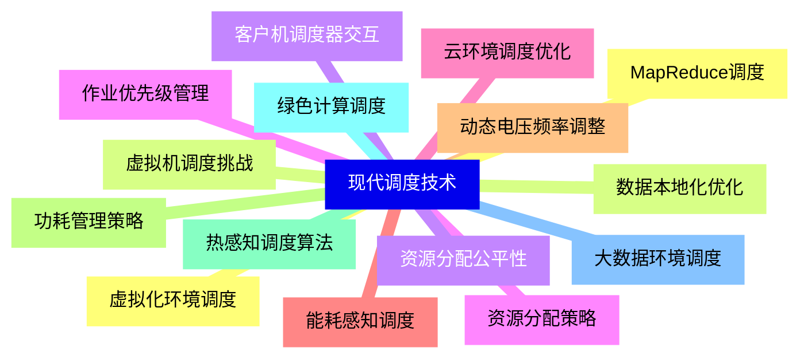
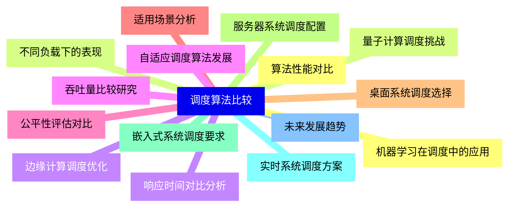


### 1 [进程调度基础概念](#1)
#### 1.1 [进程与线程](#1)
#### 1.2 [进程定义与特征](#1)
#### 1.3 [线程定义与特征](#1)
#### 1.4 [进程与线程的区别与联系](#1)
#### 1.5 [进程控制块 PCB 结构](#1)
#### 1.6 [线程控制块 TCB 结构](#1)
#### 1.7 [进程状态与转换](#1)
#### 1.8 [进程的五种基本状态](#1)
#### 1.9 [状态转换图详解](#1)
#### 1.10 [挂起状态与激活状态](#1)
#### 1.11 [进程上下文概念](#1)
#### 1.12 [上下文切换过程](#1)
#### 1.13 [调度基本概念](#1)
#### 1.14 [调度的定义与目标](#1)
#### 1.15 [调度程序的功能](#1)
#### 1.16 [调度时机分析](#1)
#### 1.17 [调度性能评价指标](#1)
### 2 [调度算法原理](#2)
#### 2.1 [先来先服务调度](#2)
#### 2.2 [算法基本原理](#2)
#### 2.3 [实现方式与数据结构](#2)
#### 2.4 [性能分析与优缺点](#2)
#### 2.5 [适用场景分析](#2)
#### 2.6 [短作业优先调度](#2)
#### 2.7 [非抢占式SJF算法](#2)
#### 2.8 [抢占式SJF算法](#2)
#### 2.9 [预测执行时间方法](#2)
#### 2.10 [饥饿问题与解决方案](#2)
#### 2.11 [优先级调度](#2)
#### 2.12 [静态优先级设置](#2)
#### 2.13 [动态优先级调整](#2)
#### 2.14 [优先级反转问题](#2)
#### 2.15 [优先级继承协议](#2)
#### 2.16 [时间片轮转调度](#2)
#### 2.17 [时间片大小选择](#2)
#### 2.18 [就绪队列管理](#2)
#### 2.19 [响应时间分析](#2)
#### 2.20 [多级队列轮转](#2)
#### 2.21 [多级反馈队列调度](#2)
#### 2.22 [队列层次结构设计](#2)
#### 2.23 [进程升级降级策略](#2)
#### 2.24 [参数配置与调优](#2)
#### 2.25 [实际系统应用](#2)
### 3 [实时系统调度](#3)
#### 3.1 [实时调度概述](#3)
#### 3.2 [实时系统分类](#3)
#### 3.3 [硬实时与软实时](#3)
#### 3.4 [实时任务特性](#3)
#### 3.5 [可调度性分析](#3)
#### 3.6 [速率单调调度](#3)
#### 3.7 [基本原理与假设](#3)
#### 3.8 [可调度性测试](#3)
#### 3.9 [响应时间计算](#3)
#### 3.10 [实际应用限制](#3)
#### 3.11 [最早截止时间优先](#3)
#### 3.12 [EDF算法原理](#3)
#### 3.13 [抢占式EDF实现](#3)
#### 3.14 [处理器利用率分析](#3)
#### 3.15 [超载情况处理](#3)
#### 3.16 [其他实时调度算法](#3)
#### 3.17 [最小松弛度优先](#3)
#### 3.18 [固定优先级调度](#3)
#### 3.19 [混合关键度调度](#3)
#### 3.20 [容错实时调度](#3)
### 4 [多处理器调度](#4)
#### 4.1 [多处理器调度概述](#4)
#### 4.2 [对称多处理架构](#4)
#### 4.3 [非对称多处理架构](#4)
#### 4.4 [负载均衡问题](#4)
#### 4.5 [处理器亲和性](#4)
#### 4.6 [负载均衡策略](#4)
#### 4.7 [静态负载分配](#4)
#### 4.8 [动态负载迁移](#4)
#### 4.9 [工作窃取算法](#4)
#### 4.10 [负载均衡开销](#4)
#### 4.11 [多核处理器调度](#4)
#### 4.12 [缓存感知调度](#4)
#### 4.13 [功耗感知调度](#4)
#### 4.14 [核间通信优化](#4)
#### 4.15 [异构多核调度](#4)
### 5 [调度实现机制](#5)
#### 5.1 [内核调度框架](#5)
#### 5.2 [调度器架构设计](#5)
#### 5.3 [就绪队列实现](#5)
#### 5.4 [定时器中断处理](#5)
#### 5.5 [上下文切换机制](#5)
#### 5.6 [Linux调度器](#5)
#### 5.7 [O 1 调度器原理](#5)
#### 5.8 [CFS完全公平调度器](#5)
#### 5.9 [实时调度类实现](#5)
#### 5.10 [调度策略配置](#5)
#### 5.11 [Windows调度器](#5)
#### 5.12 [Windows调度架构](#5)
#### 5.13 [优先级提升机制](#5)
#### 5.14 [处理器组管理](#5)
#### 5.15 [服务质量支持](#5)
### 6 [调度性能优化](#6)
#### 6.1 [性能评价指标](#6)
#### 6.2 [周转时间分析](#6)
#### 6.3 [响应时间测量](#6)
#### 6.4 [吞吐量计算](#6)
#### 6.5 [公平性评估](#6)
#### 6.6 [调度参数调优](#6)
#### 6.7 [时间片大小优化](#6)
#### 6.8 [优先级权重设置](#6)
#### 6.9 [负载阈值调整](#6)
#### 6.10 [能耗平衡策略](#6)
#### 6.11 [特殊场景调度](#6)
#### 6.12 [I/O密集型进程调度](#6)
#### 6.13 [CPU密集型进程调度](#6)
#### 6.14 [交互式进程优化](#6)
#### 6.15 [批处理作业调度](#6)
### 7 [现代调度技术](#7)
#### 7.1 [虚拟化环境调度](#7)
#### 7.2 [虚拟机调度挑战](#7)
#### 7.3 [客户机调度器交互](#7)
#### 7.4 [资源分配策略](#7)
#### 7.5 [云环境调度优化](#7)
#### 7.6 [能耗感知调度](#7)
#### 7.7 [动态电压频率调整](#7)
#### 7.8 [功耗管理策略](#7)
#### 7.9 [热感知调度算法](#7)
#### 7.10 [绿色计算调度](#7)
#### 7.11 [大数据环境调度](#7)
#### 7.12 [MapReduce调度](#7)
#### 7.13 [数据本地化优化](#7)
#### 7.14 [资源分配公平性](#7)
#### 7.15 [作业优先级管理](#7)
### 8 [调度算法比较](#8)
#### 8.1 [算法性能对比](#8)
#### 8.2 [不同负载下的表现](#8)
#### 8.3 [响应时间对比分析](#8)
#### 8.4 [吞吐量比较研究](#8)
#### 8.5 [公平性评估对比](#8)
#### 8.6 [适用场景分析](#8)
#### 8.7 [桌面系统调度选择](#8)
#### 8.8 [服务器系统调度配置](#8)
#### 8.9 [嵌入式系统调度要求](#8)
#### 8.10 [实时系统调度方案](#8)
#### 8.11 [未来发展趋势](#8)
#### 8.12 [机器学习在调度中的应用](#8)
#### 8.13 [量子计算调度挑战](#8)
#### 8.14 [边缘计算调度优化](#8)
#### 8.15 [自适应调度算法发展](#8)




### 1 进程调度基础概念

---
### 1 进程调度基础概念
___
#### 1.1 进程与线程
___
#### 1.2 进程定义与特征
___
#### 1.3 线程定义与特征
___
#### 1.4 进程与线程的区别与联系
___
#### 1.5 进程控制块 PCB 结构
___
#### 1.6 线程控制块 TCB 结构
___
#### 1.7 进程状态与转换
___
#### 1.8 进程的五种基本状态
___
#### 1.9 状态转换图详解
___
#### 1.10 挂起状态与激活状态
___
#### 1.11 进程上下文概念
___
#### 1.12 上下文切换过程
___
#### 1.13 调度基本概念
___
#### 1.14 调度的定义与目标
___
#### 1.15 调度程序的功能
___
#### 1.16 调度时机分析
___
#### 1.17 调度性能评价指标
### 2 调度算法原理

---
### 2 调度算法原理
___
#### 2.1 先来先服务调度
___
#### 2.2 算法基本原理
___
#### 2.3 实现方式与数据结构
___
#### 2.4 性能分析与优缺点
___
#### 2.5 适用场景分析
___
#### 2.6 短作业优先调度
___
#### 2.7 非抢占式SJF算法
___
#### 2.8 抢占式SJF算法
___
#### 2.9 预测执行时间方法
___
#### 2.10 饥饿问题与解决方案
___
#### 2.11 优先级调度
___
#### 2.12 静态优先级设置
___
#### 2.13 动态优先级调整
___
#### 2.14 优先级反转问题
___
#### 2.15 优先级继承协议
___
#### 2.16 时间片轮转调度
___
#### 2.17 时间片大小选择
___
#### 2.18 就绪队列管理
___
#### 2.19 响应时间分析
___
#### 2.20 多级队列轮转
___
#### 2.21 多级反馈队列调度
___
#### 2.22 队列层次结构设计
___
#### 2.23 进程升级降级策略
___
#### 2.24 参数配置与调优
___
#### 2.25 实际系统应用
### 3 实时系统调度

---
### 3 实时系统调度
___
#### 3.1 实时调度概述
___
#### 3.2 实时系统分类
___
#### 3.3 硬实时与软实时
___
#### 3.4 实时任务特性
___
#### 3.5 可调度性分析
___
#### 3.6 速率单调调度
___
#### 3.7 基本原理与假设
___
#### 3.8 可调度性测试
___
#### 3.9 响应时间计算
___
#### 3.10 实际应用限制
___
#### 3.11 最早截止时间优先
___
#### 3.12 EDF算法原理
___
#### 3.13 抢占式EDF实现
___
#### 3.14 处理器利用率分析
___
#### 3.15 超载情况处理
___
#### 3.16 其他实时调度算法
___
#### 3.17 最小松弛度优先
___
#### 3.18 固定优先级调度
___
#### 3.19 混合关键度调度
___
#### 3.20 容错实时调度
### 4 多处理器调度

---
### 4 多处理器调度
___
#### 4.1 多处理器调度概述
___
#### 4.2 对称多处理架构
___
#### 4.3 非对称多处理架构
___
#### 4.4 负载均衡问题
___
#### 4.5 处理器亲和性
___
#### 4.6 负载均衡策略
___
#### 4.7 静态负载分配
___
#### 4.8 动态负载迁移
___
#### 4.9 工作窃取算法
___
#### 4.10 负载均衡开销
___
#### 4.11 多核处理器调度
___
#### 4.12 缓存感知调度
___
#### 4.13 功耗感知调度
___
#### 4.14 核间通信优化
___
#### 4.15 异构多核调度
### 5 调度实现机制

---
### 5 调度实现机制
___
#### 5.1 内核调度框架
___
#### 5.2 调度器架构设计
___
#### 5.3 就绪队列实现
___
#### 5.4 定时器中断处理
___
#### 5.5 上下文切换机制
___
#### 5.6 Linux调度器
___
#### 5.7 O 1 调度器原理
___
#### 5.8 CFS完全公平调度器
___
#### 5.9 实时调度类实现
___
#### 5.10 调度策略配置
___
#### 5.11 Windows调度器
___
#### 5.12 Windows调度架构
___
#### 5.13 优先级提升机制
___
#### 5.14 处理器组管理
___
#### 5.15 服务质量支持
### 6 调度性能优化

---
### 6 调度性能优化
___
#### 6.1 性能评价指标
___
#### 6.2 周转时间分析
___
#### 6.3 响应时间测量
___
#### 6.4 吞吐量计算
___
#### 6.5 公平性评估
___
#### 6.6 调度参数调优
___
#### 6.7 时间片大小优化
___
#### 6.8 优先级权重设置
___
#### 6.9 负载阈值调整
___
#### 6.10 能耗平衡策略
___
#### 6.11 特殊场景调度
___
#### 6.12 I/O密集型进程调度
___
#### 6.13 CPU密集型进程调度
___
#### 6.14 交互式进程优化
___
#### 6.15 批处理作业调度
### 7 现代调度技术

---
### 7 现代调度技术
___
#### 7.1 虚拟化环境调度
___
#### 7.2 虚拟机调度挑战
___
#### 7.3 客户机调度器交互
___
#### 7.4 资源分配策略
___
#### 7.5 云环境调度优化
___
#### 7.6 能耗感知调度
___
#### 7.7 动态电压频率调整
___
#### 7.8 功耗管理策略
___
#### 7.9 热感知调度算法
___
#### 7.10 绿色计算调度
___
#### 7.11 大数据环境调度
___
#### 7.12 MapReduce调度
___
#### 7.13 数据本地化优化
___
#### 7.14 资源分配公平性
___
#### 7.15 作业优先级管理
### 8 调度算法比较

---
### 8 调度算法比较
___
#### 8.1 算法性能对比
___
#### 8.2 不同负载下的表现
___
#### 8.3 响应时间对比分析
___
#### 8.4 吞吐量比较研究
___
#### 8.5 公平性评估对比
___
#### 8.6 适用场景分析
___
#### 8.7 桌面系统调度选择
___
#### 8.8 服务器系统调度配置
___
#### 8.9 嵌入式系统调度要求
___
#### 8.10 实时系统调度方案
___
#### 8.11 未来发展趋势
___
#### 8.12 机器学习在调度中的应用
___
#### 8.13 量子计算调度挑战
___
#### 8.14 边缘计算调度优化
___
#### 8.15 自适应调度算法发展


### 1 进程调度基础概念{#1}

{}

<--->
{}
{}
{}
{}
{}
{}
{}
{}
{}
{}
{}
{}
{}
{}
{}
{}
{}
{}
{}
{}
{}
{}
{}
{}
{}
{}
{}
{}
{}
{}
{}
{}
{}
{}
{}

### 2 调度算法原理{#2}

{}
{}
{}
{}
{}
{}
{}
{}
{}
{}
{}
{}
{}
{}
{}
{}
{}
{}
{}
{}
{}
{}
{}
{}
{}
{}
{}
{}
{}
{}
{}
{}
{}
{}
{}
{}
{}
{}
{}
{}
{}
{}
{}
{}
{}
{}
{}
{}
{}
{}
{}
<--->

{}

### 3 实时系统调度{#3}

{}

<--->
{}
{}
{}
{}
{}
{}
{}
{}
{}
{}
{}
{}
{}
{}
{}
{}
{}
{}
{}
{}
{}
{}
{}
{}
{}
{}
{}
{}
{}
{}
{}
{}
{}
{}
{}
{}
{}
{}
{}
{}
{}

### 4 多处理器调度{#4}

{}
{}
{}
{}
{}
{}
{}
{}
{}
{}
{}
{}
{}
{}
{}
{}
{}
{}
{}
{}
{}
{}
{}
{}
{}
{}
{}
{}
{}
{}
{}
<--->

{}

### 5 调度实现机制{#5}

{}

<--->
{}
{}
{}
{}
{}
{}
{}
{}
{}
{}
{}
{}
{}
{}
{}
{}
{}
{}
{}
{}
{}
{}
{}
{}
{}
{}
{}
{}
{}
{}
{}

### 6 调度性能优化{#6}

{}
{}
{}
{}
{}
{}
{}
{}
{}
{}
{}
{}
{}
{}
{}
{}
{}
{}
{}
{}
{}
{}
{}
{}
{}
{}
{}
{}
{}
{}
{}
<--->

{}

### 7 现代调度技术{#7}

{}

<--->
{}
{}
{}
{}
{}
{}
{}
{}
{}
{}
{}
{}
{}
{}
{}
{}
{}
{}
{}
{}
{}
{}
{}
{}
{}
{}
{}
{}
{}
{}
{}

### 8 调度算法比较{#8}

{}
{}
{}
{}
{}
{}
{}
{}
{}
{}
{}
{}
{}
{}
{}
{}
{}
{}
{}
{}
{}
{}
{}
{}
{}
{}
{}
{}
{}
{}
{}
<--->

{}
