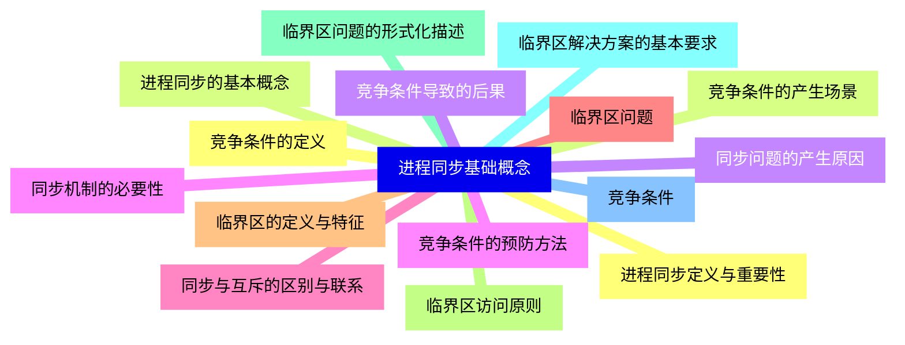
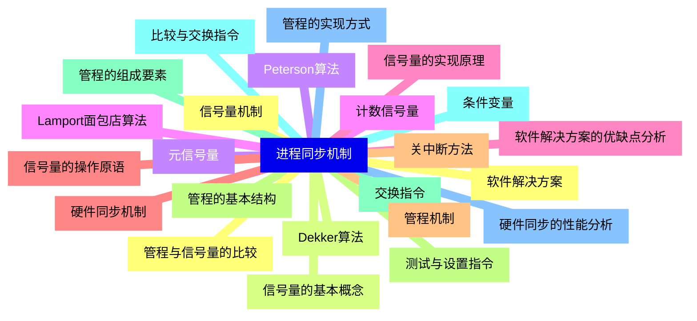
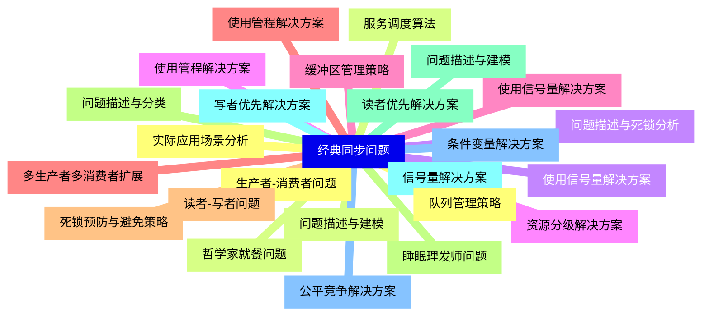
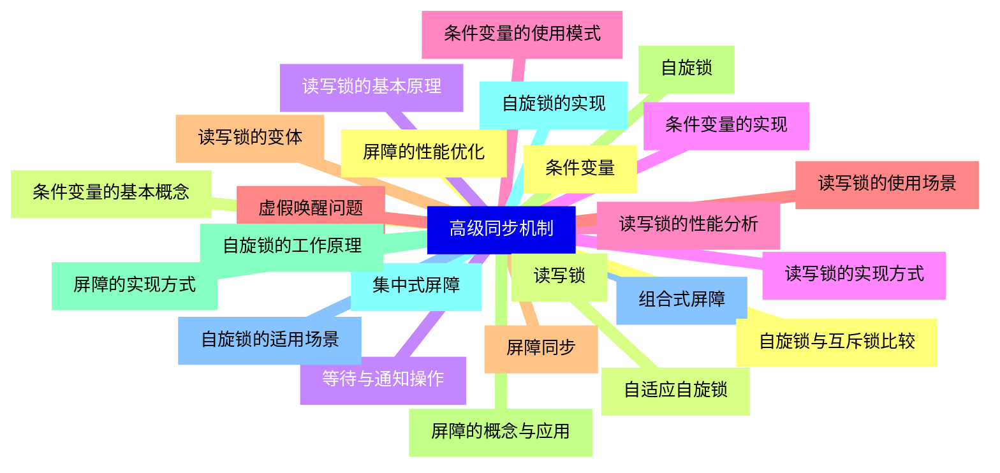
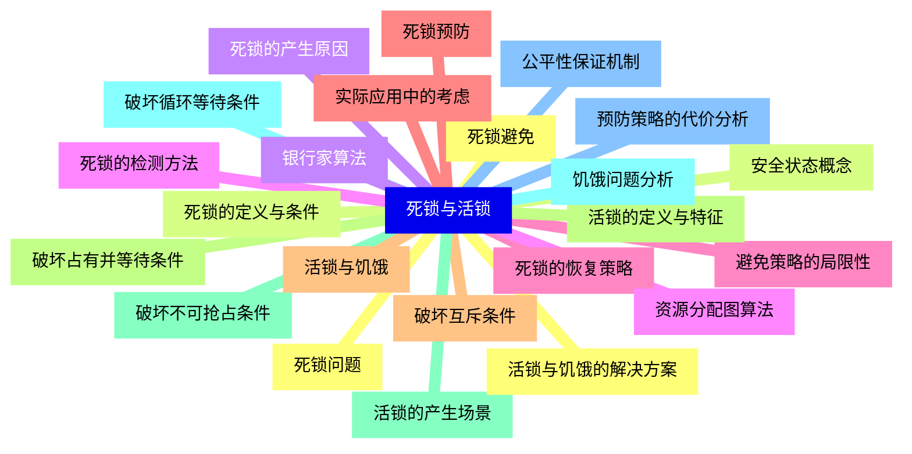
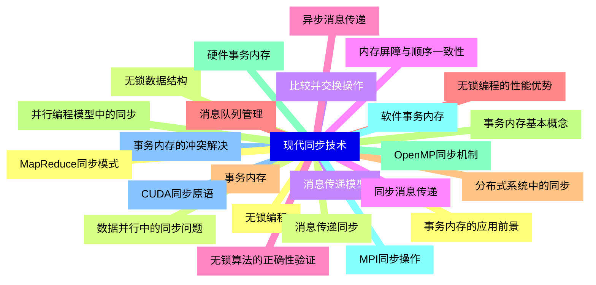
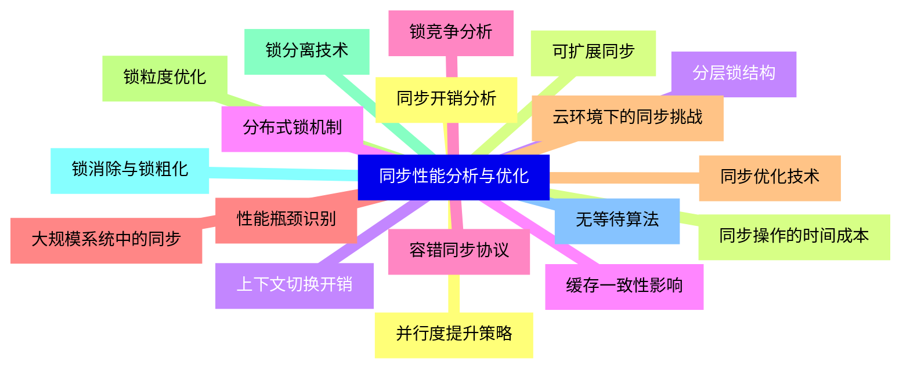


### 1 [进程同步基础概念](#1)
#### 1.1 [进程同步定义与重要性](#1)
#### 1.2 [进程同步的基本概念](#1)
#### 1.3 [同步问题的产生原因](#1)
#### 1.4 [同步机制的必要性](#1)
#### 1.5 [同步与互斥的区别与联系](#1)
#### 1.6 [临界区问题](#1)
#### 1.7 [临界区的定义与特征](#1)
#### 1.8 [临界区访问原则](#1)
#### 1.9 [临界区问题的形式化描述](#1)
#### 1.10 [临界区解决方案的基本要求](#1)
#### 1.11 [竞争条件](#1)
#### 1.12 [竞争条件的定义](#1)
#### 1.13 [竞争条件的产生场景](#1)
#### 1.14 [竞争条件导致的后果](#1)
#### 1.15 [竞争条件的预防方法](#1)
### 2 [进程同步机制](#2)
#### 2.1 [软件解决方案](#2)
#### 2.2 [Dekker算法](#2)
#### 2.3 [Peterson算法](#2)
#### 2.4 [Lamport面包店算法](#2)
#### 2.5 [软件解决方案的优缺点分析](#2)
#### 2.6 [硬件同步机制](#2)
#### 2.7 [关中断方法](#2)
#### 2.8 [测试与设置指令](#2)
#### 2.9 [交换指令](#2)
#### 2.10 [比较与交换指令](#2)
#### 2.11 [硬件同步的性能分析](#2)
#### 2.12 [信号量机制](#2)
#### 2.13 [信号量的基本概念](#2)
#### 2.14 [元信号量](#2)
#### 2.15 [计数信号量](#2)
#### 2.16 [信号量的实现原理](#2)
#### 2.17 [信号量的操作原语](#2)
#### 2.18 [管程机制](#2)
#### 2.19 [管程的基本结构](#2)
#### 2.20 [管程的组成要素](#2)
#### 2.21 [条件变量](#2)
#### 2.22 [管程的实现方式](#2)
#### 2.23 [管程与信号量的比较](#2)
### 3 [经典同步问题](#3)
#### 3.1 [生产者-消费者问题](#3)
#### 3.2 [问题描述与建模](#3)
#### 3.3 [使用信号量解决方案](#3)
#### 3.4 [使用管程解决方案](#3)
#### 3.5 [缓冲区管理策略](#3)
#### 3.6 [多生产者多消费者扩展](#3)
#### 3.7 [读者-写者问题](#3)
#### 3.8 [问题描述与分类](#3)
#### 3.9 [读者优先解决方案](#3)
#### 3.10 [写者优先解决方案](#3)
#### 3.11 [公平竞争解决方案](#3)
#### 3.12 [实际应用场景分析](#3)
#### 3.13 [哲学家就餐问题](#3)
#### 3.14 [问题描述与死锁分析](#3)
#### 3.15 [资源分级解决方案](#3)
#### 3.16 [使用信号量解决方案](#3)
#### 3.17 [使用管程解决方案](#3)
#### 3.18 [死锁预防与避免策略](#3)
#### 3.19 [睡眠理发师问题](#3)
#### 3.20 [问题描述与建模](#3)
#### 3.21 [信号量解决方案](#3)
#### 3.22 [条件变量解决方案](#3)
#### 3.23 [队列管理策略](#3)
#### 3.24 [服务调度算法](#3)
### 4 [高级同步机制](#4)
#### 4.1 [条件变量](#4)
#### 4.2 [条件变量的基本概念](#4)
#### 4.3 [等待与通知操作](#4)
#### 4.4 [条件变量的实现](#4)
#### 4.5 [条件变量的使用模式](#4)
#### 4.6 [虚假唤醒问题](#4)
#### 4.7 [屏障同步](#4)
#### 4.8 [屏障的概念与应用](#4)
#### 4.9 [屏障的实现方式](#4)
#### 4.10 [集中式屏障](#4)
#### 4.11 [组合式屏障](#4)
#### 4.12 [屏障的性能优化](#4)
#### 4.13 [读写锁](#4)
#### 4.14 [读写锁的基本原理](#4)
#### 4.15 [读写锁的实现方式](#4)
#### 4.16 [读写锁的性能分析](#4)
#### 4.17 [读写锁的使用场景](#4)
#### 4.18 [读写锁的变体](#4)
#### 4.19 [自旋锁](#4)
#### 4.20 [自旋锁的工作原理](#4)
#### 4.21 [自旋锁的实现](#4)
#### 4.22 [自旋锁的适用场景](#4)
#### 4.23 [自旋锁与互斥锁比较](#4)
#### 4.24 [自适应自旋锁](#4)
### 5 [死锁与活锁](#5)
#### 5.1 [死锁问题](#5)
#### 5.2 [死锁的定义与条件](#5)
#### 5.3 [死锁的产生原因](#5)
#### 5.4 [死锁的检测方法](#5)
#### 5.5 [死锁的恢复策略](#5)
#### 5.6 [死锁预防](#5)
#### 5.7 [破坏互斥条件](#5)
#### 5.8 [破坏占有并等待条件](#5)
#### 5.9 [破坏不可抢占条件](#5)
#### 5.10 [破坏循环等待条件](#5)
#### 5.11 [预防策略的代价分析](#5)
#### 5.12 [死锁避免](#5)
#### 5.13 [安全状态概念](#5)
#### 5.14 [银行家算法](#5)
#### 5.15 [资源分配图算法](#5)
#### 5.16 [避免策略的局限性](#5)
#### 5.17 [实际应用中的考虑](#5)
#### 5.18 [活锁与饥饿](#5)
#### 5.19 [活锁的定义与特征](#5)
#### 5.20 [活锁的产生场景](#5)
#### 5.21 [饥饿问题分析](#5)
#### 5.22 [公平性保证机制](#5)
#### 5.23 [活锁与饥饿的解决方案](#5)
### 6 [现代同步技术](#6)
#### 6.1 [无锁编程](#6)
#### 6.2 [无锁数据结构](#6)
#### 6.3 [比较并交换操作](#6)
#### 6.4 [内存屏障与顺序一致性](#6)
#### 6.5 [无锁算法的正确性验证](#6)
#### 6.6 [无锁编程的性能优势](#6)
#### 6.7 [事务内存](#6)
#### 6.8 [事务内存基本概念](#6)
#### 6.9 [硬件事务内存](#6)
#### 6.10 [软件事务内存](#6)
#### 6.11 [事务内存的冲突解决](#6)
#### 6.12 [事务内存的应用前景](#6)
#### 6.13 [消息传递同步](#6)
#### 6.14 [消息传递模型](#6)
#### 6.15 [同步消息传递](#6)
#### 6.16 [异步消息传递](#6)
#### 6.17 [消息队列管理](#6)
#### 6.18 [分布式系统中的同步](#6)
#### 6.19 [并行编程模型中的同步](#6)
#### 6.20 [OpenMP同步机制](#6)
#### 6.21 [MPI同步操作](#6)
#### 6.22 [CUDA同步原语](#6)
#### 6.23 [MapReduce同步模式](#6)
#### 6.24 [数据并行中的同步问题](#6)
### 7 [同步性能分析与优化](#7)
#### 7.1 [同步开销分析](#7)
#### 7.2 [同步操作的时间成本](#7)
#### 7.3 [上下文切换开销](#7)
#### 7.4 [缓存一致性影响](#7)
#### 7.5 [锁竞争分析](#7)
#### 7.6 [性能瓶颈识别](#7)
#### 7.7 [同步优化技术](#7)
#### 7.8 [锁粒度优化](#7)
#### 7.9 [锁分离技术](#7)
#### 7.10 [锁消除与锁粗化](#7)
#### 7.11 [无等待算法](#7)
#### 7.12 [并行度提升策略](#7)
#### 7.13 [可扩展同步](#7)
#### 7.14 [分层锁结构](#7)
#### 7.15 [分布式锁机制](#7)
#### 7.16 [容错同步协议](#7)
#### 7.17 [大规模系统中的同步](#7)
#### 7.18 [云环境下的同步挑战](#7)




### 1 进程同步基础概念

---
### 1 进程同步基础概念
___
#### 1.1 进程同步定义与重要性
___
#### 1.2 进程同步的基本概念
___
#### 1.3 同步问题的产生原因
___
#### 1.4 同步机制的必要性
___
#### 1.5 同步与互斥的区别与联系
___
#### 1.6 临界区问题
___
#### 1.7 临界区的定义与特征
___
#### 1.8 临界区访问原则
___
#### 1.9 临界区问题的形式化描述
___
#### 1.10 临界区解决方案的基本要求
___
#### 1.11 竞争条件
___
#### 1.12 竞争条件的定义
___
#### 1.13 竞争条件的产生场景
___
#### 1.14 竞争条件导致的后果
___
#### 1.15 竞争条件的预防方法
### 2 进程同步机制

---
### 2 进程同步机制
___
#### 2.1 软件解决方案
___
#### 2.2 Dekker算法
___
#### 2.3 Peterson算法
___
#### 2.4 Lamport面包店算法
___
#### 2.5 软件解决方案的优缺点分析
___
#### 2.6 硬件同步机制
___
#### 2.7 关中断方法
___
#### 2.8 测试与设置指令
___
#### 2.9 交换指令
___
#### 2.10 比较与交换指令
___
#### 2.11 硬件同步的性能分析
___
#### 2.12 信号量机制
___
#### 2.13 信号量的基本概念
___
#### 2.14 元信号量
___
#### 2.15 计数信号量
___
#### 2.16 信号量的实现原理
___
#### 2.17 信号量的操作原语
___
#### 2.18 管程机制
___
#### 2.19 管程的基本结构
___
#### 2.20 管程的组成要素
___
#### 2.21 条件变量
___
#### 2.22 管程的实现方式
___
#### 2.23 管程与信号量的比较
### 3 经典同步问题

---
### 3 经典同步问题
___
#### 3.1 生产者-消费者问题
___
#### 3.2 问题描述与建模
___
#### 3.3 使用信号量解决方案
___
#### 3.4 使用管程解决方案
___
#### 3.5 缓冲区管理策略
___
#### 3.6 多生产者多消费者扩展
___
#### 3.7 读者-写者问题
___
#### 3.8 问题描述与分类
___
#### 3.9 读者优先解决方案
___
#### 3.10 写者优先解决方案
___
#### 3.11 公平竞争解决方案
___
#### 3.12 实际应用场景分析
___
#### 3.13 哲学家就餐问题
___
#### 3.14 问题描述与死锁分析
___
#### 3.15 资源分级解决方案
___
#### 3.16 使用信号量解决方案
___
#### 3.17 使用管程解决方案
___
#### 3.18 死锁预防与避免策略
___
#### 3.19 睡眠理发师问题
___
#### 3.20 问题描述与建模
___
#### 3.21 信号量解决方案
___
#### 3.22 条件变量解决方案
___
#### 3.23 队列管理策略
___
#### 3.24 服务调度算法
### 4 高级同步机制

---
### 4 高级同步机制
___
#### 4.1 条件变量
___
#### 4.2 条件变量的基本概念
___
#### 4.3 等待与通知操作
___
#### 4.4 条件变量的实现
___
#### 4.5 条件变量的使用模式
___
#### 4.6 虚假唤醒问题
___
#### 4.7 屏障同步
___
#### 4.8 屏障的概念与应用
___
#### 4.9 屏障的实现方式
___
#### 4.10 集中式屏障
___
#### 4.11 组合式屏障
___
#### 4.12 屏障的性能优化
___
#### 4.13 读写锁
___
#### 4.14 读写锁的基本原理
___
#### 4.15 读写锁的实现方式
___
#### 4.16 读写锁的性能分析
___
#### 4.17 读写锁的使用场景
___
#### 4.18 读写锁的变体
___
#### 4.19 自旋锁
___
#### 4.20 自旋锁的工作原理
___
#### 4.21 自旋锁的实现
___
#### 4.22 自旋锁的适用场景
___
#### 4.23 自旋锁与互斥锁比较
___
#### 4.24 自适应自旋锁
### 5 死锁与活锁

---
### 5 死锁与活锁
___
#### 5.1 死锁问题
___
#### 5.2 死锁的定义与条件
___
#### 5.3 死锁的产生原因
___
#### 5.4 死锁的检测方法
___
#### 5.5 死锁的恢复策略
___
#### 5.6 死锁预防
___
#### 5.7 破坏互斥条件
___
#### 5.8 破坏占有并等待条件
___
#### 5.9 破坏不可抢占条件
___
#### 5.10 破坏循环等待条件
___
#### 5.11 预防策略的代价分析
___
#### 5.12 死锁避免
___
#### 5.13 安全状态概念
___
#### 5.14 银行家算法
___
#### 5.15 资源分配图算法
___
#### 5.16 避免策略的局限性
___
#### 5.17 实际应用中的考虑
___
#### 5.18 活锁与饥饿
___
#### 5.19 活锁的定义与特征
___
#### 5.20 活锁的产生场景
___
#### 5.21 饥饿问题分析
___
#### 5.22 公平性保证机制
___
#### 5.23 活锁与饥饿的解决方案
### 6 现代同步技术

---
### 6 现代同步技术
___
#### 6.1 无锁编程
___
#### 6.2 无锁数据结构
___
#### 6.3 比较并交换操作
___
#### 6.4 内存屏障与顺序一致性
___
#### 6.5 无锁算法的正确性验证
___
#### 6.6 无锁编程的性能优势
___
#### 6.7 事务内存
___
#### 6.8 事务内存基本概念
___
#### 6.9 硬件事务内存
___
#### 6.10 软件事务内存
___
#### 6.11 事务内存的冲突解决
___
#### 6.12 事务内存的应用前景
___
#### 6.13 消息传递同步
___
#### 6.14 消息传递模型
___
#### 6.15 同步消息传递
___
#### 6.16 异步消息传递
___
#### 6.17 消息队列管理
___
#### 6.18 分布式系统中的同步
___
#### 6.19 并行编程模型中的同步
___
#### 6.20 OpenMP同步机制
___
#### 6.21 MPI同步操作
___
#### 6.22 CUDA同步原语
___
#### 6.23 MapReduce同步模式
___
#### 6.24 数据并行中的同步问题
### 7 同步性能分析与优化

---
### 7 同步性能分析与优化
___
#### 7.1 同步开销分析
___
#### 7.2 同步操作的时间成本
___
#### 7.3 上下文切换开销
___
#### 7.4 缓存一致性影响
___
#### 7.5 锁竞争分析
___
#### 7.6 性能瓶颈识别
___
#### 7.7 同步优化技术
___
#### 7.8 锁粒度优化
___
#### 7.9 锁分离技术
___
#### 7.10 锁消除与锁粗化
___
#### 7.11 无等待算法
___
#### 7.12 并行度提升策略
___
#### 7.13 可扩展同步
___
#### 7.14 分层锁结构
___
#### 7.15 分布式锁机制
___
#### 7.16 容错同步协议
___
#### 7.17 大规模系统中的同步
___
#### 7.18 云环境下的同步挑战


### 1 进程同步基础概念{#1}

{}

<--->
{}
{}
{}
{}
{}
{}
{}
{}
{}
{}
{}
{}
{}
{}
{}
{}
{}
{}
{}
{}
{}
{}
{}
{}
{}
{}
{}
{}
{}
{}
{}

### 2 进程同步机制{#2}

{}
{}
{}
{}
{}
{}
{}
{}
{}
{}
{}
{}
{}
{}
{}
{}
{}
{}
{}
{}
{}
{}
{}
{}
{}
{}
{}
{}
{}
{}
{}
{}
{}
{}
{}
{}
{}
{}
{}
{}
{}
{}
{}
{}
{}
{}
{}
<--->

{}

### 3 经典同步问题{#3}

{}

<--->
{}
{}
{}
{}
{}
{}
{}
{}
{}
{}
{}
{}
{}
{}
{}
{}
{}
{}
{}
{}
{}
{}
{}
{}
{}
{}
{}
{}
{}
{}
{}
{}
{}
{}
{}
{}
{}
{}
{}
{}
{}
{}
{}
{}
{}
{}
{}
{}
{}

### 4 高级同步机制{#4}

{}
{}
{}
{}
{}
{}
{}
{}
{}
{}
{}
{}
{}
{}
{}
{}
{}
{}
{}
{}
{}
{}
{}
{}
{}
{}
{}
{}
{}
{}
{}
{}
{}
{}
{}
{}
{}
{}
{}
{}
{}
{}
{}
{}
{}
{}
{}
{}
{}
<--->

{}

### 5 死锁与活锁{#5}

{}

<--->
{}
{}
{}
{}
{}
{}
{}
{}
{}
{}
{}
{}
{}
{}
{}
{}
{}
{}
{}
{}
{}
{}
{}
{}
{}
{}
{}
{}
{}
{}
{}
{}
{}
{}
{}
{}
{}
{}
{}
{}
{}
{}
{}
{}
{}
{}
{}

### 6 现代同步技术{#6}

{}
{}
{}
{}
{}
{}
{}
{}
{}
{}
{}
{}
{}
{}
{}
{}
{}
{}
{}
{}
{}
{}
{}
{}
{}
{}
{}
{}
{}
{}
{}
{}
{}
{}
{}
{}
{}
{}
{}
{}
{}
{}
{}
{}
{}
{}
{}
{}
{}
<--->

{}

### 7 同步性能分析与优化{#7}

{}

<--->
{}
{}
{}
{}
{}
{}
{}
{}
{}
{}
{}
{}
{}
{}
{}
{}
{}
{}
{}
{}
{}
{}
{}
{}
{}
{}
{}
{}
{}
{}
{}
{}
{}
{}
{}
{}
{}
