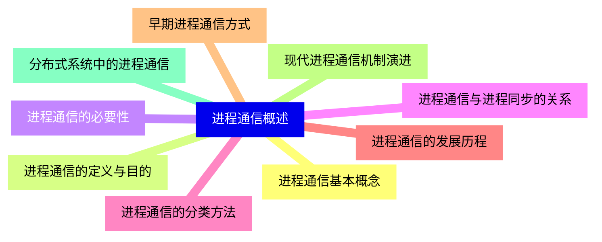
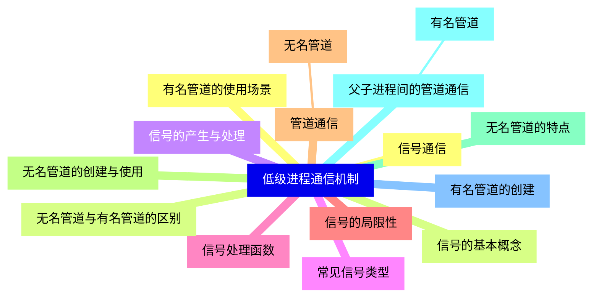
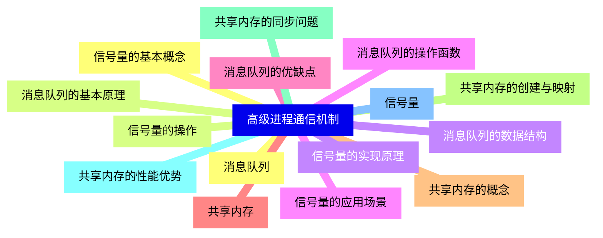
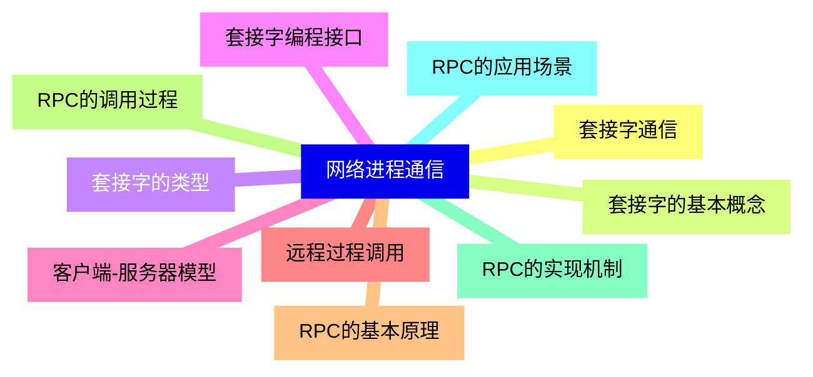
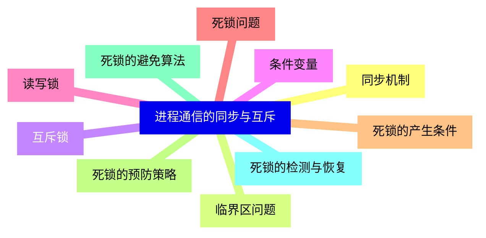
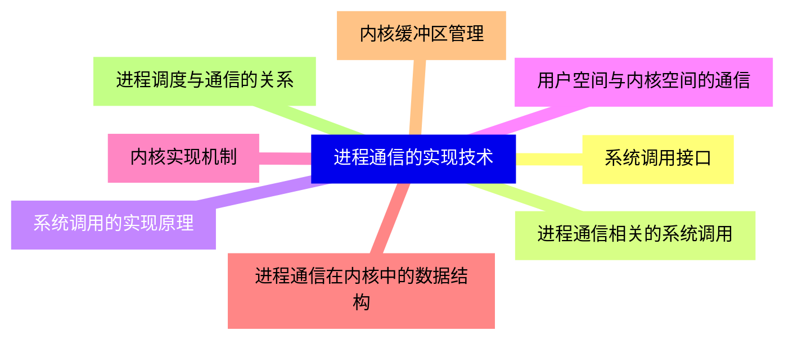
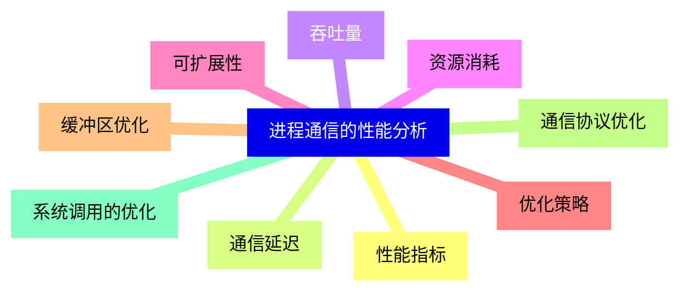
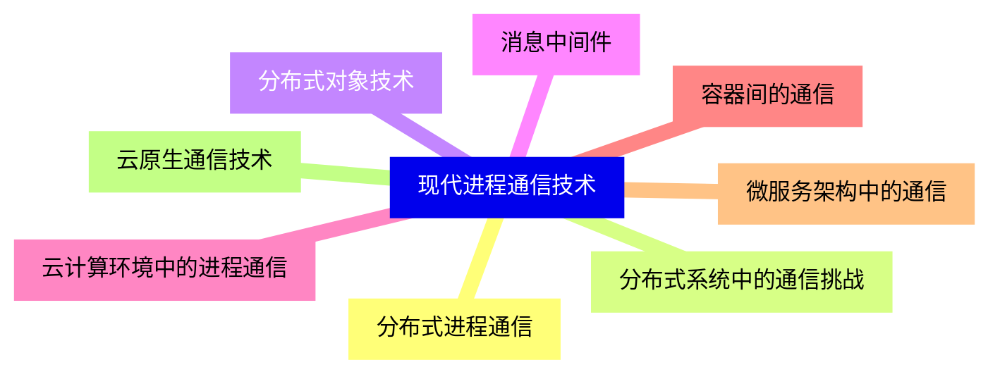
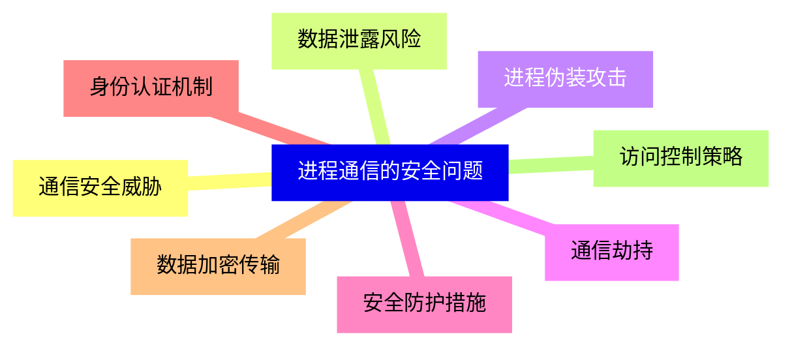
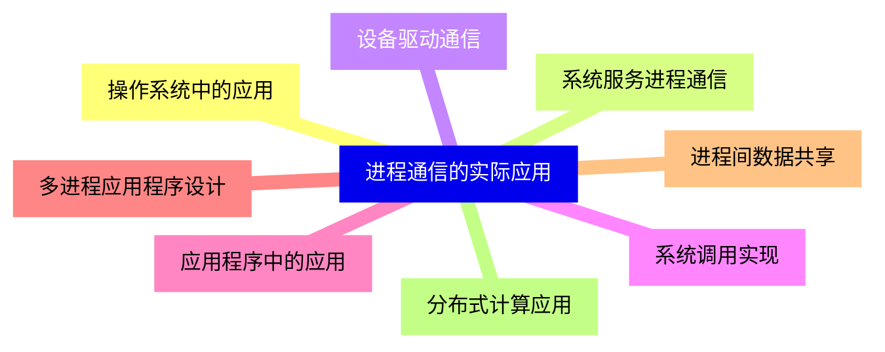


### 1 [进程通信概述](#1)
#### 1.1 [进程通信基本概念](#1)
#### 1.2 [进程通信的定义与目的](#1)
#### 1.3 [进程通信的必要性](#1)
#### 1.4 [进程通信与进程同步的关系](#1)
#### 1.5 [进程通信的分类方法](#1)
#### 1.6 [进程通信的发展历程](#1)
#### 1.7 [早期进程通信方式](#1)
#### 1.8 [现代进程通信机制演进](#1)
#### 1.9 [分布式系统中的进程通信](#1)
### 2 [低级进程通信机制](#2)
#### 2.1 [信号通信](#2)
#### 2.2 [信号的基本概念](#2)
#### 2.3 [信号的产生与处理](#2)
#### 2.4 [常见信号类型](#2)
#### 2.5 [信号处理函数](#2)
#### 2.6 [信号的局限性](#2)
#### 2.7 [管道通信](#2)
##### 2.7.1 [无名管道](#2)
#### 2.8 [无名管道的创建与使用](#2)
#### 2.9 [无名管道的特点](#2)
#### 2.10 [父子进程间的管道通信](#2)
##### 2.10.1 [有名管道](#2)
#### 2.11 [有名管道的创建](#2)
#### 2.12 [有名管道的使用场景](#2)
#### 2.13 [无名管道与有名管道的区别](#2)
### 3 [高级进程通信机制](#3)
#### 3.1 [消息队列](#3)
#### 3.2 [消息队列的基本原理](#3)
#### 3.3 [消息队列的数据结构](#3)
#### 3.4 [消息队列的操作函数](#3)
#### 3.5 [消息队列的优缺点](#3)
#### 3.6 [共享内存](#3)
#### 3.7 [共享内存的概念](#3)
#### 3.8 [共享内存的创建与映射](#3)
#### 3.9 [共享内存的同步问题](#3)
#### 3.10 [共享内存的性能优势](#3)
#### 3.11 [信号量](#3)
#### 3.12 [信号量的基本概念](#3)
#### 3.13 [信号量的操作](#3)
#### 3.14 [信号量的实现原理](#3)
#### 3.15 [信号量的应用场景](#3)
### 4 [网络进程通信](#4)
#### 4.1 [套接字通信](#4)
#### 4.2 [套接字的基本概念](#4)
#### 4.3 [套接字的类型](#4)
#### 4.4 [套接字编程接口](#4)
#### 4.5 [客户端-服务器模型](#4)
#### 4.6 [远程过程调用](#4)
#### 4.7 [RPC的基本原理](#4)
#### 4.8 [RPC的调用过程](#4)
#### 4.9 [RPC的实现机制](#4)
#### 4.10 [RPC的应用场景](#4)
### 5 [进程通信的同步与互斥](#5)
#### 5.1 [同步机制](#5)
#### 5.2 [临界区问题](#5)
#### 5.3 [互斥锁](#5)
#### 5.4 [条件变量](#5)
#### 5.5 [读写锁](#5)
#### 5.6 [死锁问题](#5)
#### 5.7 [死锁的产生条件](#5)
#### 5.8 [死锁的预防策略](#5)
#### 5.9 [死锁的避免算法](#5)
#### 5.10 [死锁的检测与恢复](#5)
### 6 [进程通信的实现技术](#6)
#### 6.1 [系统调用接口](#6)
#### 6.2 [进程通信相关的系统调用](#6)
#### 6.3 [系统调用的实现原理](#6)
#### 6.4 [用户空间与内核空间的通信](#6)
#### 6.5 [内核实现机制](#6)
#### 6.6 [进程通信在内核中的数据结构](#6)
#### 6.7 [内核缓冲区管理](#6)
#### 6.8 [进程调度与通信的关系](#6)
### 7 [进程通信的性能分析](#7)
#### 7.1 [性能指标](#7)
#### 7.2 [通信延迟](#7)
#### 7.3 [吞吐量](#7)
#### 7.4 [资源消耗](#7)
#### 7.5 [可扩展性](#7)
#### 7.6 [优化策略](#7)
#### 7.7 [缓冲区优化](#7)
#### 7.8 [通信协议优化](#7)
#### 7.9 [系统调用的优化](#7)
### 8 [现代进程通信技术](#8)
#### 8.1 [分布式进程通信](#8)
#### 8.2 [分布式系统中的通信挑战](#8)
#### 8.3 [分布式对象技术](#8)
#### 8.4 [消息中间件](#8)
#### 8.5 [云计算环境中的进程通信](#8)
#### 8.6 [容器间的通信](#8)
#### 8.7 [微服务架构中的通信](#8)
#### 8.8 [云原生通信技术](#8)
### 9 [进程通信的安全问题](#9)
#### 9.1 [通信安全威胁](#9)
#### 9.2 [数据泄露风险](#9)
#### 9.3 [进程伪装攻击](#9)
#### 9.4 [通信劫持](#9)
#### 9.5 [安全防护措施](#9)
#### 9.6 [身份认证机制](#9)
#### 9.7 [数据加密传输](#9)
#### 9.8 [访问控制策略](#9)
### 10 [进程通信的实际应用](#10)
#### 10.1 [操作系统中的应用](#10)
#### 10.2 [系统服务进程通信](#10)
#### 10.3 [设备驱动通信](#10)
#### 10.4 [系统调用实现](#10)
#### 10.5 [应用程序中的应用](#10)
#### 10.6 [多进程应用程序设计](#10)
#### 10.7 [进程间数据共享](#10)
#### 10.8 [分布式计算应用](#10)




### 1 进程通信概述

---
### 1 进程通信概述
___
#### 1.1 进程通信基本概念
___
#### 1.2 进程通信的定义与目的
___
#### 1.3 进程通信的必要性
___
#### 1.4 进程通信与进程同步的关系
___
#### 1.5 进程通信的分类方法
___
#### 1.6 进程通信的发展历程
___
#### 1.7 早期进程通信方式
___
#### 1.8 现代进程通信机制演进
___
#### 1.9 分布式系统中的进程通信
### 2 低级进程通信机制

---
### 2 低级进程通信机制
___
#### 2.1 信号通信
___
#### 2.2 信号的基本概念
___
#### 2.3 信号的产生与处理
___
#### 2.4 常见信号类型
___
#### 2.5 信号处理函数
___
#### 2.6 信号的局限性
___
#### 2.7 管道通信
___
##### 2.7.1 无名管道
___
#### 2.8 无名管道的创建与使用
___
#### 2.9 无名管道的特点
___
#### 2.10 父子进程间的管道通信
___
##### 2.10.1 有名管道
___
#### 2.11 有名管道的创建
___
#### 2.12 有名管道的使用场景
___
#### 2.13 无名管道与有名管道的区别
### 3 高级进程通信机制

---
### 3 高级进程通信机制
___
#### 3.1 消息队列
___
#### 3.2 消息队列的基本原理
___
#### 3.3 消息队列的数据结构
___
#### 3.4 消息队列的操作函数
___
#### 3.5 消息队列的优缺点
___
#### 3.6 共享内存
___
#### 3.7 共享内存的概念
___
#### 3.8 共享内存的创建与映射
___
#### 3.9 共享内存的同步问题
___
#### 3.10 共享内存的性能优势
___
#### 3.11 信号量
___
#### 3.12 信号量的基本概念
___
#### 3.13 信号量的操作
___
#### 3.14 信号量的实现原理
___
#### 3.15 信号量的应用场景
### 4 网络进程通信

---
### 4 网络进程通信
___
#### 4.1 套接字通信
___
#### 4.2 套接字的基本概念
___
#### 4.3 套接字的类型
___
#### 4.4 套接字编程接口
___
#### 4.5 客户端-服务器模型
___
#### 4.6 远程过程调用
___
#### 4.7 RPC的基本原理
___
#### 4.8 RPC的调用过程
___
#### 4.9 RPC的实现机制
___
#### 4.10 RPC的应用场景
### 5 进程通信的同步与互斥

---
### 5 进程通信的同步与互斥
___
#### 5.1 同步机制
___
#### 5.2 临界区问题
___
#### 5.3 互斥锁
___
#### 5.4 条件变量
___
#### 5.5 读写锁
___
#### 5.6 死锁问题
___
#### 5.7 死锁的产生条件
___
#### 5.8 死锁的预防策略
___
#### 5.9 死锁的避免算法
___
#### 5.10 死锁的检测与恢复
### 6 进程通信的实现技术

---
### 6 进程通信的实现技术
___
#### 6.1 系统调用接口
___
#### 6.2 进程通信相关的系统调用
___
#### 6.3 系统调用的实现原理
___
#### 6.4 用户空间与内核空间的通信
___
#### 6.5 内核实现机制
___
#### 6.6 进程通信在内核中的数据结构
___
#### 6.7 内核缓冲区管理
___
#### 6.8 进程调度与通信的关系
### 7 进程通信的性能分析

---
### 7 进程通信的性能分析
___
#### 7.1 性能指标
___
#### 7.2 通信延迟
___
#### 7.3 吞吐量
___
#### 7.4 资源消耗
___
#### 7.5 可扩展性
___
#### 7.6 优化策略
___
#### 7.7 缓冲区优化
___
#### 7.8 通信协议优化
___
#### 7.9 系统调用的优化
### 8 现代进程通信技术

---
### 8 现代进程通信技术
___
#### 8.1 分布式进程通信
___
#### 8.2 分布式系统中的通信挑战
___
#### 8.3 分布式对象技术
___
#### 8.4 消息中间件
___
#### 8.5 云计算环境中的进程通信
___
#### 8.6 容器间的通信
___
#### 8.7 微服务架构中的通信
___
#### 8.8 云原生通信技术
### 9 进程通信的安全问题

---
### 9 进程通信的安全问题
___
#### 9.1 通信安全威胁
___
#### 9.2 数据泄露风险
___
#### 9.3 进程伪装攻击
___
#### 9.4 通信劫持
___
#### 9.5 安全防护措施
___
#### 9.6 身份认证机制
___
#### 9.7 数据加密传输
___
#### 9.8 访问控制策略
### 10 进程通信的实际应用

---
### 10 进程通信的实际应用
___
#### 10.1 操作系统中的应用
___
#### 10.2 系统服务进程通信
___
#### 10.3 设备驱动通信
___
#### 10.4 系统调用实现
___
#### 10.5 应用程序中的应用
___
#### 10.6 多进程应用程序设计
___
#### 10.7 进程间数据共享
___
#### 10.8 分布式计算应用


### 1 进程通信概述{#1}

{}

<--->
{}
{}
{}
{}
{}
{}
{}
{}
{}
{}
{}
{}
{}
{}
{}
{}
{}
{}
{}

### 2 低级进程通信机制{#2}

{}
{}
{}
{}
{}
{}
{}
{}
{}
{}
{}
{}
{}
{}
{}
{}
{}
{}
{}
{}
{}
{}
{}
{}
{}
{}
{}
{}
{}
{}
{}
<--->

{}

### 3 高级进程通信机制{#3}

{}

<--->
{}
{}
{}
{}
{}
{}
{}
{}
{}
{}
{}
{}
{}
{}
{}
{}
{}
{}
{}
{}
{}
{}
{}
{}
{}
{}
{}
{}
{}
{}
{}

### 4 网络进程通信{#4}

{}
{}
{}
{}
{}
{}
{}
{}
{}
{}
{}
{}
{}
{}
{}
{}
{}
{}
{}
{}
{}
<--->

{}

### 5 进程通信的同步与互斥{#5}

{}

<--->
{}
{}
{}
{}
{}
{}
{}
{}
{}
{}
{}
{}
{}
{}
{}
{}
{}
{}
{}
{}
{}

### 6 进程通信的实现技术{#6}

{}
{}
{}
{}
{}
{}
{}
{}
{}
{}
{}
{}
{}
{}
{}
{}
{}
<--->

{}

### 7 进程通信的性能分析{#7}

{}

<--->
{}
{}
{}
{}
{}
{}
{}
{}
{}
{}
{}
{}
{}
{}
{}
{}
{}
{}
{}

### 8 现代进程通信技术{#8}

{}
{}
{}
{}
{}
{}
{}
{}
{}
{}
{}
{}
{}
{}
{}
{}
{}
<--->

{}

### 9 进程通信的安全问题{#9}

{}

<--->
{}
{}
{}
{}
{}
{}
{}
{}
{}
{}
{}
{}
{}
{}
{}
{}
{}

### 10 进程通信的实际应用{#10}

{}
{}
{}
{}
{}
{}
{}
{}
{}
{}
{}
{}
{}
{}
{}
{}
{}
<--->

{}
