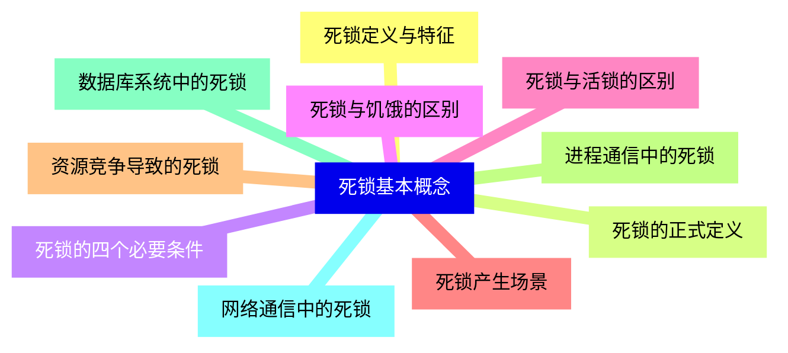
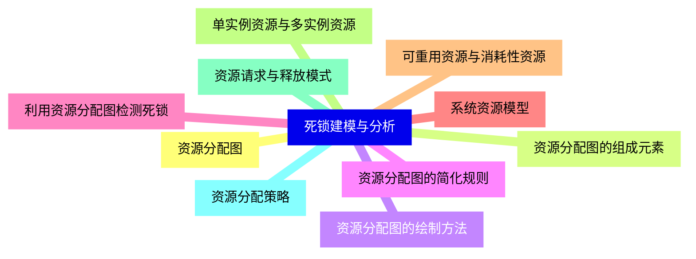
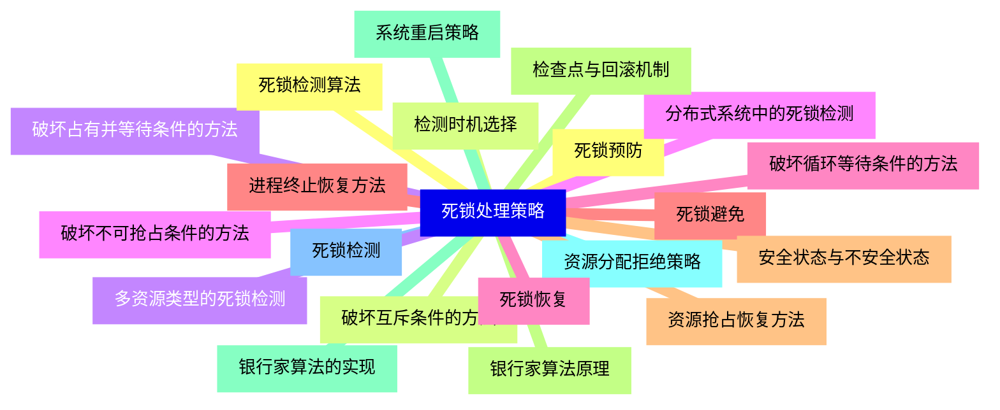
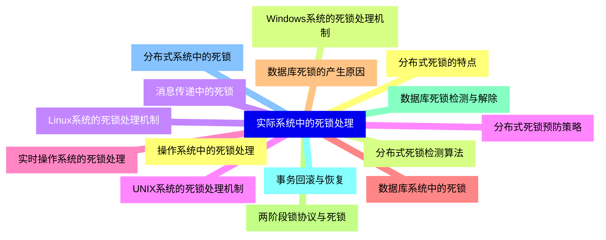
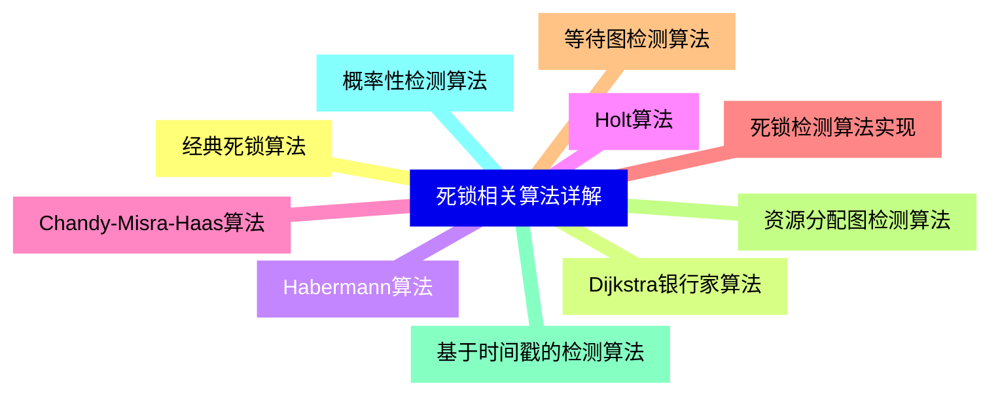
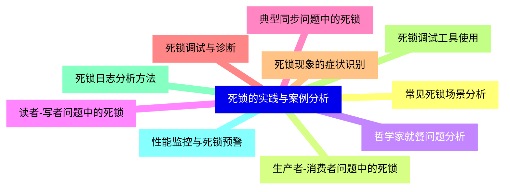
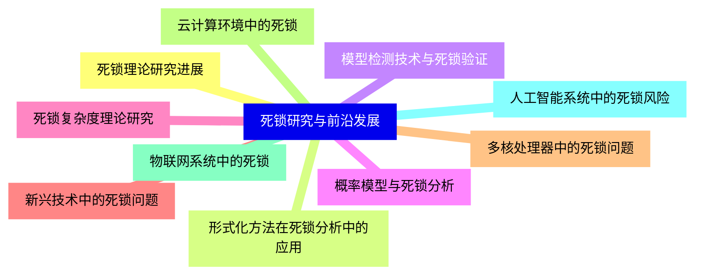


### 1 [死锁基本概念](#1)
#### 1.1 [死锁定义与特征](#1)
#### 1.2 [死锁的正式定义](#1)
#### 1.3 [死锁的四个必要条件](#1)
#### 1.4 [死锁与饥饿的区别](#1)
#### 1.5 [死锁与活锁的区别](#1)
#### 1.6 [死锁产生场景](#1)
#### 1.7 [资源竞争导致的死锁](#1)
#### 1.8 [进程通信中的死锁](#1)
#### 1.9 [数据库系统中的死锁](#1)
#### 1.10 [网络通信中的死锁](#1)
### 2 [死锁建模与分析](#2)
#### 2.1 [资源分配图](#2)
#### 2.2 [资源分配图的组成元素](#2)
#### 2.3 [资源分配图的绘制方法](#2)
#### 2.4 [资源分配图的简化规则](#2)
#### 2.5 [利用资源分配图检测死锁](#2)
#### 2.6 [系统资源模型](#2)
#### 2.7 [可重用资源与消耗性资源](#2)
#### 2.8 [单实例资源与多实例资源](#2)
#### 2.9 [资源请求与释放模式](#2)
#### 2.10 [资源分配策略](#2)
### 3 [死锁处理策略](#3)
#### 3.1 [死锁预防](#3)
#### 3.2 [破坏互斥条件的方法](#3)
#### 3.3 [破坏占有并等待条件的方法](#3)
#### 3.4 [破坏不可抢占条件的方法](#3)
#### 3.5 [破坏循环等待条件的方法](#3)
#### 3.6 [死锁避免](#3)
#### 3.7 [安全状态与不安全状态](#3)
#### 3.8 [银行家算法原理](#3)
#### 3.9 [银行家算法的实现](#3)
#### 3.10 [资源分配拒绝策略](#3)
#### 3.11 [死锁检测](#3)
#### 3.12 [死锁检测算法](#3)
#### 3.13 [检测时机选择](#3)
#### 3.14 [多资源类型的死锁检测](#3)
#### 3.15 [分布式系统中的死锁检测](#3)
#### 3.16 [死锁恢复](#3)
#### 3.17 [进程终止恢复方法](#3)
#### 3.18 [资源抢占恢复方法](#3)
#### 3.19 [检查点与回滚机制](#3)
#### 3.20 [系统重启策略](#3)
### 4 [实际系统中的死锁处理](#4)
#### 4.1 [操作系统中的死锁处理](#4)
#### 4.2 [Windows系统的死锁处理机制](#4)
#### 4.3 [Linux系统的死锁处理机制](#4)
#### 4.4 [UNIX系统的死锁处理机制](#4)
#### 4.5 [实时操作系统的死锁处理](#4)
#### 4.6 [数据库系统中的死锁](#4)
#### 4.7 [数据库死锁的产生原因](#4)
#### 4.8 [两阶段锁协议与死锁](#4)
#### 4.9 [数据库死锁检测与解除](#4)
#### 4.10 [事务回滚与恢复](#4)
#### 4.11 [分布式系统中的死锁](#4)
#### 4.12 [分布式死锁的特点](#4)
#### 4.13 [分布式死锁检测算法](#4)
#### 4.14 [消息传递中的死锁](#4)
#### 4.15 [分布式死锁预防策略](#4)
### 5 [死锁相关算法详解](#5)
#### 5.1 [经典死锁算法](#5)
#### 5.2 [Dijkstra银行家算法](#5)
#### 5.3 [Habermann算法](#5)
#### 5.4 [Holt算法](#5)
#### 5.5 [Chandy-Misra-Haas算法](#5)
#### 5.6 [死锁检测算法实现](#5)
#### 5.7 [等待图检测算法](#5)
#### 5.8 [资源分配图检测算法](#5)
#### 5.9 [基于时间戳的检测算法](#5)
#### 5.10 [概率性检测算法](#5)
### 6 [死锁的实践与案例分析](#6)
#### 6.1 [常见死锁场景分析](#6)
#### 6.2 [生产者-消费者问题中的死锁](#6)
#### 6.3 [哲学家就餐问题分析](#6)
#### 6.4 [读者-写者问题中的死锁](#6)
#### 6.5 [典型同步问题中的死锁](#6)
#### 6.6 [死锁调试与诊断](#6)
#### 6.7 [死锁现象的症状识别](#6)
#### 6.8 [死锁调试工具使用](#6)
#### 6.9 [死锁日志分析方法](#6)
#### 6.10 [性能监控与死锁预警](#6)
### 7 [死锁研究与前沿发展](#7)
#### 7.1 [死锁理论研究进展](#7)
#### 7.2 [形式化方法在死锁分析中的应用](#7)
#### 7.3 [模型检测技术与死锁验证](#7)
#### 7.4 [概率模型与死锁分析](#7)
#### 7.5 [死锁复杂度理论研究](#7)
#### 7.6 [新兴技术中的死锁问题](#7)
#### 7.7 [多核处理器中的死锁问题](#7)
#### 7.8 [云计算环境中的死锁](#7)
#### 7.9 [物联网系统中的死锁](#7)
#### 7.10 [人工智能系统中的死锁风险](#7)




### 1 死锁基本概念

---
### 1 死锁基本概念
___
#### 1.1 死锁定义与特征
___
#### 1.2 死锁的正式定义
___
#### 1.3 死锁的四个必要条件
___
#### 1.4 死锁与饥饿的区别
___
#### 1.5 死锁与活锁的区别
___
#### 1.6 死锁产生场景
___
#### 1.7 资源竞争导致的死锁
___
#### 1.8 进程通信中的死锁
___
#### 1.9 数据库系统中的死锁
___
#### 1.10 网络通信中的死锁
### 2 死锁建模与分析

---
### 2 死锁建模与分析
___
#### 2.1 资源分配图
___
#### 2.2 资源分配图的组成元素
___
#### 2.3 资源分配图的绘制方法
___
#### 2.4 资源分配图的简化规则
___
#### 2.5 利用资源分配图检测死锁
___
#### 2.6 系统资源模型
___
#### 2.7 可重用资源与消耗性资源
___
#### 2.8 单实例资源与多实例资源
___
#### 2.9 资源请求与释放模式
___
#### 2.10 资源分配策略
### 3 死锁处理策略

---
### 3 死锁处理策略
___
#### 3.1 死锁预防
___
#### 3.2 破坏互斥条件的方法
___
#### 3.3 破坏占有并等待条件的方法
___
#### 3.4 破坏不可抢占条件的方法
___
#### 3.5 破坏循环等待条件的方法
___
#### 3.6 死锁避免
___
#### 3.7 安全状态与不安全状态
___
#### 3.8 银行家算法原理
___
#### 3.9 银行家算法的实现
___
#### 3.10 资源分配拒绝策略
___
#### 3.11 死锁检测
___
#### 3.12 死锁检测算法
___
#### 3.13 检测时机选择
___
#### 3.14 多资源类型的死锁检测
___
#### 3.15 分布式系统中的死锁检测
___
#### 3.16 死锁恢复
___
#### 3.17 进程终止恢复方法
___
#### 3.18 资源抢占恢复方法
___
#### 3.19 检查点与回滚机制
___
#### 3.20 系统重启策略
### 4 实际系统中的死锁处理

---
### 4 实际系统中的死锁处理
___
#### 4.1 操作系统中的死锁处理
___
#### 4.2 Windows系统的死锁处理机制
___
#### 4.3 Linux系统的死锁处理机制
___
#### 4.4 UNIX系统的死锁处理机制
___
#### 4.5 实时操作系统的死锁处理
___
#### 4.6 数据库系统中的死锁
___
#### 4.7 数据库死锁的产生原因
___
#### 4.8 两阶段锁协议与死锁
___
#### 4.9 数据库死锁检测与解除
___
#### 4.10 事务回滚与恢复
___
#### 4.11 分布式系统中的死锁
___
#### 4.12 分布式死锁的特点
___
#### 4.13 分布式死锁检测算法
___
#### 4.14 消息传递中的死锁
___
#### 4.15 分布式死锁预防策略
### 5 死锁相关算法详解

---
### 5 死锁相关算法详解
___
#### 5.1 经典死锁算法
___
#### 5.2 Dijkstra银行家算法
___
#### 5.3 Habermann算法
___
#### 5.4 Holt算法
___
#### 5.5 Chandy-Misra-Haas算法
___
#### 5.6 死锁检测算法实现
___
#### 5.7 等待图检测算法
___
#### 5.8 资源分配图检测算法
___
#### 5.9 基于时间戳的检测算法
___
#### 5.10 概率性检测算法
### 6 死锁的实践与案例分析

---
### 6 死锁的实践与案例分析
___
#### 6.1 常见死锁场景分析
___
#### 6.2 生产者-消费者问题中的死锁
___
#### 6.3 哲学家就餐问题分析
___
#### 6.4 读者-写者问题中的死锁
___
#### 6.5 典型同步问题中的死锁
___
#### 6.6 死锁调试与诊断
___
#### 6.7 死锁现象的症状识别
___
#### 6.8 死锁调试工具使用
___
#### 6.9 死锁日志分析方法
___
#### 6.10 性能监控与死锁预警
### 7 死锁研究与前沿发展

---
### 7 死锁研究与前沿发展
___
#### 7.1 死锁理论研究进展
___
#### 7.2 形式化方法在死锁分析中的应用
___
#### 7.3 模型检测技术与死锁验证
___
#### 7.4 概率模型与死锁分析
___
#### 7.5 死锁复杂度理论研究
___
#### 7.6 新兴技术中的死锁问题
___
#### 7.7 多核处理器中的死锁问题
___
#### 7.8 云计算环境中的死锁
___
#### 7.9 物联网系统中的死锁
___
#### 7.10 人工智能系统中的死锁风险


### 1 死锁基本概念{#1}

{}

<--->
{}
{}
{}
{}
{}
{}
{}
{}
{}
{}
{}
{}
{}
{}
{}
{}
{}
{}
{}
{}
{}

### 2 死锁建模与分析{#2}

{}
{}
{}
{}
{}
{}
{}
{}
{}
{}
{}
{}
{}
{}
{}
{}
{}
{}
{}
{}
{}
<--->

{}

### 3 死锁处理策略{#3}

{}

<--->
{}
{}
{}
{}
{}
{}
{}
{}
{}
{}
{}
{}
{}
{}
{}
{}
{}
{}
{}
{}
{}
{}
{}
{}
{}
{}
{}
{}
{}
{}
{}
{}
{}
{}
{}
{}
{}
{}
{}
{}
{}

### 4 实际系统中的死锁处理{#4}

{}
{}
{}
{}
{}
{}
{}
{}
{}
{}
{}
{}
{}
{}
{}
{}
{}
{}
{}
{}
{}
{}
{}
{}
{}
{}
{}
{}
{}
{}
{}
<--->

{}

### 5 死锁相关算法详解{#5}

{}

<--->
{}
{}
{}
{}
{}
{}
{}
{}
{}
{}
{}
{}
{}
{}
{}
{}
{}
{}
{}
{}
{}

### 6 死锁的实践与案例分析{#6}

{}
{}
{}
{}
{}
{}
{}
{}
{}
{}
{}
{}
{}
{}
{}
{}
{}
{}
{}
{}
{}
<--->

{}

### 7 死锁研究与前沿发展{#7}

{}

<--->
{}
{}
{}
{}
{}
{}
{}
{}
{}
{}
{}
{}
{}
{}
{}
{}
{}
{}
{}
{}
{}
