
### 1 [线程基本概念](#1)
#### 1.1 [线程定义与特征](#1)
#### 1.2 [线程的定义](#1)
#### 1.3 [线程的基本特征](#1)
#### 1.4 [线程与进程的关系](#1)
#### 1.5 [线程的组成要素](#1)
#### 1.6 [线程的优势与局限性](#1)
#### 1.7 [线程的优势](#1)
#### 1.8 [线程的局限性](#1)
#### 1.9 [适用场景分析](#1)
### 2 [线程实现机制](#2)
#### 2.1 [用户级线程](#2)
#### 2.2 [用户级线程实现原理](#2)
#### 2.3 [用户级线程调度机制](#2)
#### 2.4 [用户级线程的优缺点](#2)
#### 2.5 [内核级线程](#2)
#### 2.6 [内核级线程实现原理](#2)
#### 2.7 [内核级线程调度机制](#2)
#### 2.8 [内核级线程的优缺点](#2)
#### 2.9 [混合线程模型](#2)
#### 2.10 [混合线程模型原理](#2)
#### 2.11 [混合线程调度策略](#2)
#### 2.12 [混合线程模型应用实例](#2)
### 3 [线程状态与生命周期](#3)
#### 3.1 [线程状态转换](#3)
#### 3.2 [线程的基本状态](#3)
#### 3.3 [状态转换条件](#3)
#### 3.4 [状态转换图](#3)
#### 3.5 [线程创建与终止](#3)
#### 3.6 [线程创建过程](#3)
#### 3.7 [线程终止方式](#3)
#### 3.8 [线程资源回收](#3)
#### 3.9 [线程阻塞与唤醒](#3)
#### 3.10 [阻塞原因分析](#3)
#### 3.11 [唤醒机制](#3)
#### 3.12 [阻塞-唤醒实现原理](#3)
### 4 [线程调度](#4)
#### 4.1 [调度策略](#4)
#### 4.2 [先来先服务调度](#4)
#### 4.3 [时间片轮转调度](#4)
#### 4.4 [优先级调度](#4)
#### 4.5 [多级反馈队列调度](#4)
#### 4.6 [调度算法实现](#4)
#### 4.7 [调度器设计](#4)
#### 4.8 [上下文切换机制](#4)
#### 4.9 [调度性能指标](#4)
#### 4.10 [实时线程调度](#4)
#### 4.11 [实时调度需求](#4)
#### 4.12 [实时调度算法](#4)
#### 4.13 [截止期调度策略](#4)
### 5 [线程同步](#5)
#### 5.1 [同步基本概念](#5)
#### 5.2 [临界区问题](#5)
#### 5.3 [竞态条件](#5)
#### 5.4 [同步原语](#5)
#### 5.5 [互斥机制](#5)
#### 5.6 [互斥锁](#5)
#### 5.7 [信号量](#5)
#### 5.8 [管程](#5)
#### 5.9 [读写锁](#5)
#### 5.10 [条件变量](#5)
#### 5.11 [条件变量原理](#5)
#### 5.12 [条件变量使用](#5)
#### 5.13 [条件变量实现](#5)
### 6 [线程通信](#6)
#### 6.1 [共享内存通信](#6)
#### 6.2 [共享内存原理](#6)
#### 6.3 [共享内存实现](#6)
#### 6.4 [共享内存同步问题](#6)
#### 6.5 [消息传递](#6)
#### 6.6 [消息队列](#6)
#### 6.7 [管道通信](#6)
#### 6.8 [套接字通信](#6)
#### 6.9 [其他通信机制](#6)
#### 6.10 [事件驱动](#6)
#### 6.11 [回调机制](#6)
#### 6.12 [异步通信](#6)
### 7 [线程安全](#7)
#### 7.1 [线程安全问题](#7)
#### 7.2 [数据竞争](#7)
#### 7.3 [死锁问题](#7)
#### 7.4 [活锁问题](#7)
#### 7.5 [饥饿问题](#7)
#### 7.6 [线程安全编程](#7)
#### 7.7 [可重入函数](#7)
#### 7.8 [线程局部存储](#7)
#### 7.9 [原子操作](#7)
#### 7.10 [内存屏障](#7)
#### 7.11 [死锁处理](#7)
#### 7.12 [死锁预防](#7)
#### 7.13 [死锁避免](#7)
#### 7.14 [死锁检测](#7)
#### 7.15 [死锁恢复](#7)
### 8 [多线程编程模型](#8)
#### 8.1 [线程池模型](#8)
#### 8.2 [线程池原理](#8)
#### 8.3 [线程池实现](#8)
#### 8.4 [线程池优化](#8)
#### 8.5 [生产者-消费者模型](#8)
#### 8.6 [模型原理](#8)
#### 8.7 [实现方式](#8)
#### 8.8 [应用场景](#8)
#### 8.9 [主从模型](#8)
#### 8.10 [主从模型原理](#8)
#### 8.11 [任务分配策略](#8)
#### 8.12 [负载均衡](#8)
### 9 [现代操作系统线程实现](#9)
#### 9.1 [Windows线程机制](#9)
#### 9.2 [Windows线程模型](#9)
#### 9.3 [Windows线程API](#9)
#### 9.4 [Windows线程调度](#9)
#### 9.5 [Linux线程机制](#9)
#### 9.6 [Linux线程模型](#9)
#### 9.7 [pthread库使用](#9)
#### 9.8 [Linux线程调度](#9)
#### 9.9 [其他系统线程实现](#9)
#### 9.10 [macOS线程机制](#9)
#### 9.11 [Android线程机制](#9)
#### 9.12 [嵌入式系统线程实现](#9)
### 10 [线程性能优化](#10)
#### 10.1 [性能分析工具](#10)
#### 10.2 [线程性能监控](#10)
#### 10.3 [性能瓶颈分析](#10)
#### 10.4 [调优策略](#10)
#### 10.5 [并发性能优化](#10)
#### 10.6 [锁优化技术](#10)
#### 10.7 [无锁编程](#10)
#### 10.8 [缓存友好设计](#10)
#### 10.9 [资源管理优化](#10)
#### 10.10 [线程数量优化](#10)
#### 10.11 [内存使用优化](#10)
#### 10.12 [I/O性能优化](#10)
### 11 [线程调试与测试](#11)
#### 11.1 [线程调试技术](#11)
#### 11.2 [线程调试工具](#11)
#### 11.3 [常见调试问题](#11)
#### 11.4 [调试技巧](#11)
#### 11.5 [线程测试方法](#11)
#### 11.6 [单元测试](#11)
#### 11.7 [集成测试](#11)
#### 11.8 [压力测试](#11)
#### 11.9 [竞态条件测试](#11)
#### 11.10 [线程安全测试](#11)
#### 11.11 [死锁检测](#11)
#### 11.12 [数据竞争检测](#11)
#### 11.13 [内存泄漏检测](#11)
### 12 [线程发展趋势](#12)
#### 12.1 [新型线程模型](#12)
#### 12.2 [协程技术](#12)
#### 12.3 [纤程技术](#12)
#### 12.4 [异步编程模型](#12)
#### 12.5 [多核环境线程优化](#12)
#### 12.6 [多核调度策略](#12)
#### 12.7 [核间通信优化](#12)
#### 12.8 [能效优化](#12)
#### 12.9 [分布式线程技术](#12)
#### 12.10 [分布式线程模型](#12)
#### 12.11 [跨节点线程通信](#12)
#### 12.12 [容错机制](#12)




### 1 线程基本概念

---
### 1 线程基本概念
___
#### 1.1 线程定义与特征
___
#### 1.2 线程的定义
___
#### 1.3 线程的基本特征
___
#### 1.4 线程与进程的关系
___
#### 1.5 线程的组成要素
___
#### 1.6 线程的优势与局限性
___
#### 1.7 线程的优势
___
#### 1.8 线程的局限性
___
#### 1.9 适用场景分析
### 2 线程实现机制

---
### 2 线程实现机制
___
#### 2.1 用户级线程
___
#### 2.2 用户级线程实现原理
___
#### 2.3 用户级线程调度机制
___
#### 2.4 用户级线程的优缺点
___
#### 2.5 内核级线程
___
#### 2.6 内核级线程实现原理
___
#### 2.7 内核级线程调度机制
___
#### 2.8 内核级线程的优缺点
___
#### 2.9 混合线程模型
___
#### 2.10 混合线程模型原理
___
#### 2.11 混合线程调度策略
___
#### 2.12 混合线程模型应用实例
### 3 线程状态与生命周期

---
### 3 线程状态与生命周期
___
#### 3.1 线程状态转换
___
#### 3.2 线程的基本状态
___
#### 3.3 状态转换条件
___
#### 3.4 状态转换图
___
#### 3.5 线程创建与终止
___
#### 3.6 线程创建过程
___
#### 3.7 线程终止方式
___
#### 3.8 线程资源回收
___
#### 3.9 线程阻塞与唤醒
___
#### 3.10 阻塞原因分析
___
#### 3.11 唤醒机制
___
#### 3.12 阻塞-唤醒实现原理
### 4 线程调度

---
### 4 线程调度
___
#### 4.1 调度策略
___
#### 4.2 先来先服务调度
___
#### 4.3 时间片轮转调度
___
#### 4.4 优先级调度
___
#### 4.5 多级反馈队列调度
___
#### 4.6 调度算法实现
___
#### 4.7 调度器设计
___
#### 4.8 上下文切换机制
___
#### 4.9 调度性能指标
___
#### 4.10 实时线程调度
___
#### 4.11 实时调度需求
___
#### 4.12 实时调度算法
___
#### 4.13 截止期调度策略
### 5 线程同步

---
### 5 线程同步
___
#### 5.1 同步基本概念
___
#### 5.2 临界区问题
___
#### 5.3 竞态条件
___
#### 5.4 同步原语
___
#### 5.5 互斥机制
___
#### 5.6 互斥锁
___
#### 5.7 信号量
___
#### 5.8 管程
___
#### 5.9 读写锁
___
#### 5.10 条件变量
___
#### 5.11 条件变量原理
___
#### 5.12 条件变量使用
___
#### 5.13 条件变量实现
### 6 线程通信

---
### 6 线程通信
___
#### 6.1 共享内存通信
___
#### 6.2 共享内存原理
___
#### 6.3 共享内存实现
___
#### 6.4 共享内存同步问题
___
#### 6.5 消息传递
___
#### 6.6 消息队列
___
#### 6.7 管道通信
___
#### 6.8 套接字通信
___
#### 6.9 其他通信机制
___
#### 6.10 事件驱动
___
#### 6.11 回调机制
___
#### 6.12 异步通信
### 7 线程安全

---
### 7 线程安全
___
#### 7.1 线程安全问题
___
#### 7.2 数据竞争
___
#### 7.3 死锁问题
___
#### 7.4 活锁问题
___
#### 7.5 饥饿问题
___
#### 7.6 线程安全编程
___
#### 7.7 可重入函数
___
#### 7.8 线程局部存储
___
#### 7.9 原子操作
___
#### 7.10 内存屏障
___
#### 7.11 死锁处理
___
#### 7.12 死锁预防
___
#### 7.13 死锁避免
___
#### 7.14 死锁检测
___
#### 7.15 死锁恢复
### 8 多线程编程模型

---
### 8 多线程编程模型
___
#### 8.1 线程池模型
___
#### 8.2 线程池原理
___
#### 8.3 线程池实现
___
#### 8.4 线程池优化
___
#### 8.5 生产者-消费者模型
___
#### 8.6 模型原理
___
#### 8.7 实现方式
___
#### 8.8 应用场景
___
#### 8.9 主从模型
___
#### 8.10 主从模型原理
___
#### 8.11 任务分配策略
___
#### 8.12 负载均衡
### 9 现代操作系统线程实现

---
### 9 现代操作系统线程实现
___
#### 9.1 Windows线程机制
___
#### 9.2 Windows线程模型
___
#### 9.3 Windows线程API
___
#### 9.4 Windows线程调度
___
#### 9.5 Linux线程机制
___
#### 9.6 Linux线程模型
___
#### 9.7 pthread库使用
___
#### 9.8 Linux线程调度
___
#### 9.9 其他系统线程实现
___
#### 9.10 macOS线程机制
___
#### 9.11 Android线程机制
___
#### 9.12 嵌入式系统线程实现
### 10 线程性能优化

---
### 10 线程性能优化
___
#### 10.1 性能分析工具
___
#### 10.2 线程性能监控
___
#### 10.3 性能瓶颈分析
___
#### 10.4 调优策略
___
#### 10.5 并发性能优化
___
#### 10.6 锁优化技术
___
#### 10.7 无锁编程
___
#### 10.8 缓存友好设计
___
#### 10.9 资源管理优化
___
#### 10.10 线程数量优化
___
#### 10.11 内存使用优化
___
#### 10.12 I/O性能优化
### 11 线程调试与测试

---
### 11 线程调试与测试
___
#### 11.1 线程调试技术
___
#### 11.2 线程调试工具
___
#### 11.3 常见调试问题
___
#### 11.4 调试技巧
___
#### 11.5 线程测试方法
___
#### 11.6 单元测试
___
#### 11.7 集成测试
___
#### 11.8 压力测试
___
#### 11.9 竞态条件测试
___
#### 11.10 线程安全测试
___
#### 11.11 死锁检测
___
#### 11.12 数据竞争检测
___
#### 11.13 内存泄漏检测
### 12 线程发展趋势

---
### 12 线程发展趋势
___
#### 12.1 新型线程模型
___
#### 12.2 协程技术
___
#### 12.3 纤程技术
___
#### 12.4 异步编程模型
___
#### 12.5 多核环境线程优化
___
#### 12.6 多核调度策略
___
#### 12.7 核间通信优化
___
#### 12.8 能效优化
___
#### 12.9 分布式线程技术
___
#### 12.10 分布式线程模型
___
#### 12.11 跨节点线程通信
___
#### 12.12 容错机制


### 1 线程基本概念{#1}

{}
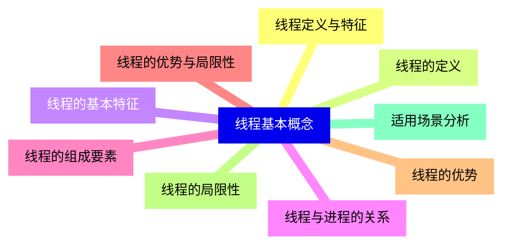

<--->
{}
{}
{}
{}
{}
{}
{}
{}
{}
{}
{}
{}
{}
{}
{}
{}
{}
{}
{}

### 2 线程实现机制{#2}

{}
{}
{}
{}
{}
{}
{}
{}
{}
{}
{}
{}
{}
{}
{}
{}
{}
{}
{}
{}
{}
{}
{}
{}
{}
<--->
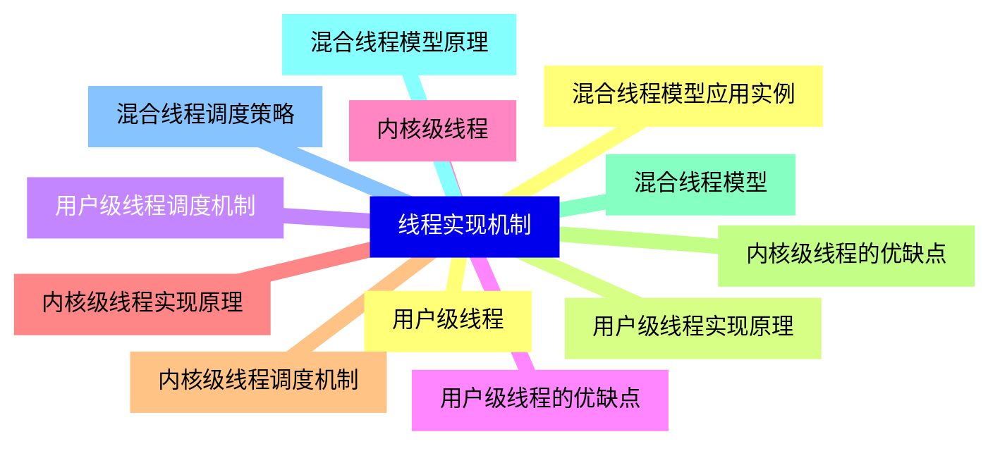

{}

### 3 线程状态与生命周期{#3}

{}
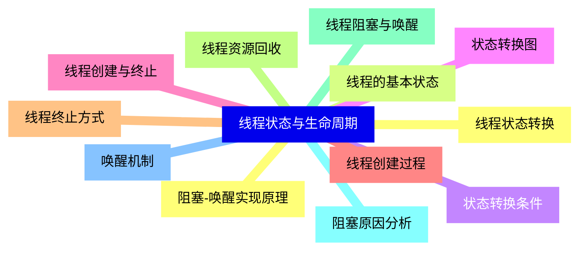

<--->
{}
{}
{}
{}
{}
{}
{}
{}
{}
{}
{}
{}
{}
{}
{}
{}
{}
{}
{}
{}
{}
{}
{}
{}
{}

### 4 线程调度{#4}

{}
{}
{}
{}
{}
{}
{}
{}
{}
{}
{}
{}
{}
{}
{}
{}
{}
{}
{}
{}
{}
{}
{}
{}
{}
{}
{}
<--->
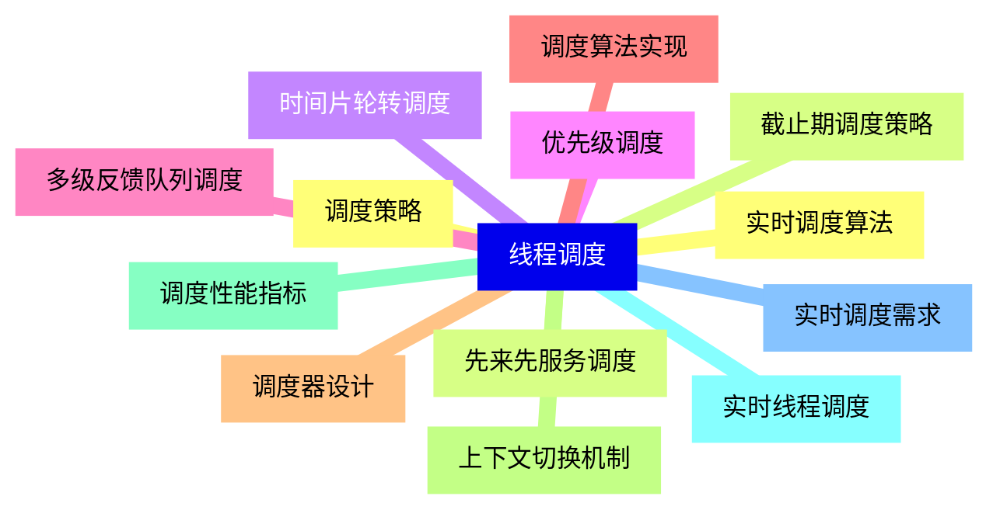

{}

### 5 线程同步{#5}

{}
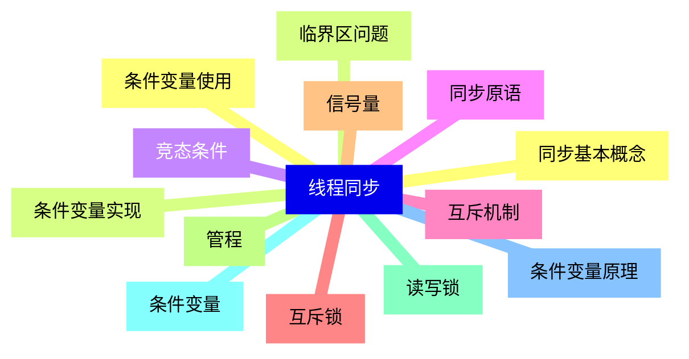

<--->
{}
{}
{}
{}
{}
{}
{}
{}
{}
{}
{}
{}
{}
{}
{}
{}
{}
{}
{}
{}
{}
{}
{}
{}
{}
{}
{}

### 6 线程通信{#6}

{}
{}
{}
{}
{}
{}
{}
{}
{}
{}
{}
{}
{}
{}
{}
{}
{}
{}
{}
{}
{}
{}
{}
{}
{}
<--->
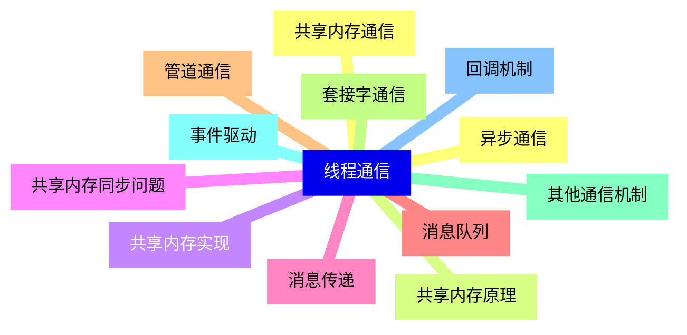

{}

### 7 线程安全{#7}

{}
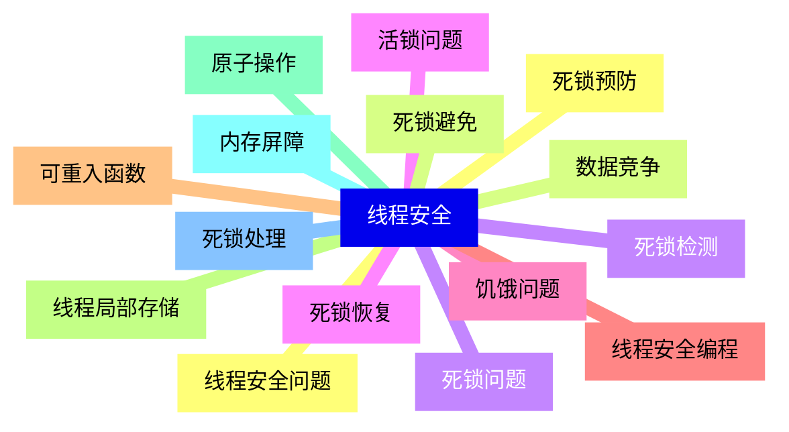

<--->
{}
{}
{}
{}
{}
{}
{}
{}
{}
{}
{}
{}
{}
{}
{}
{}
{}
{}
{}
{}
{}
{}
{}
{}
{}
{}
{}
{}
{}
{}
{}

### 8 多线程编程模型{#8}

{}
{}
{}
{}
{}
{}
{}
{}
{}
{}
{}
{}
{}
{}
{}
{}
{}
{}
{}
{}
{}
{}
{}
{}
{}
<--->
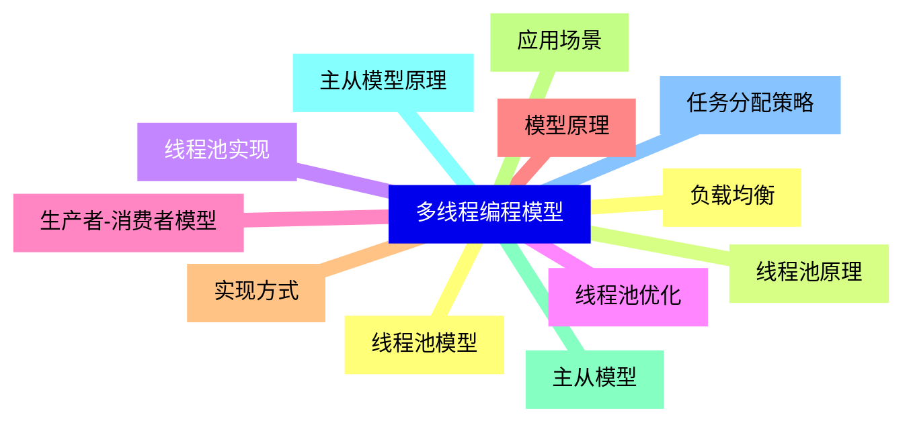

{}

### 9 现代操作系统线程实现{#9}

{}
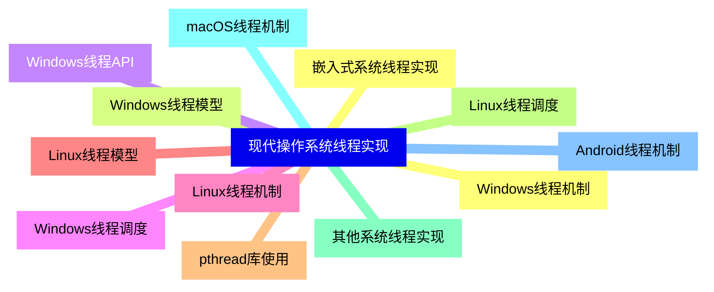

<--->
{}
{}
{}
{}
{}
{}
{}
{}
{}
{}
{}
{}
{}
{}
{}
{}
{}
{}
{}
{}
{}
{}
{}
{}
{}

### 10 线程性能优化{#10}

{}
{}
{}
{}
{}
{}
{}
{}
{}
{}
{}
{}
{}
{}
{}
{}
{}
{}
{}
{}
{}
{}
{}
{}
{}
<--->
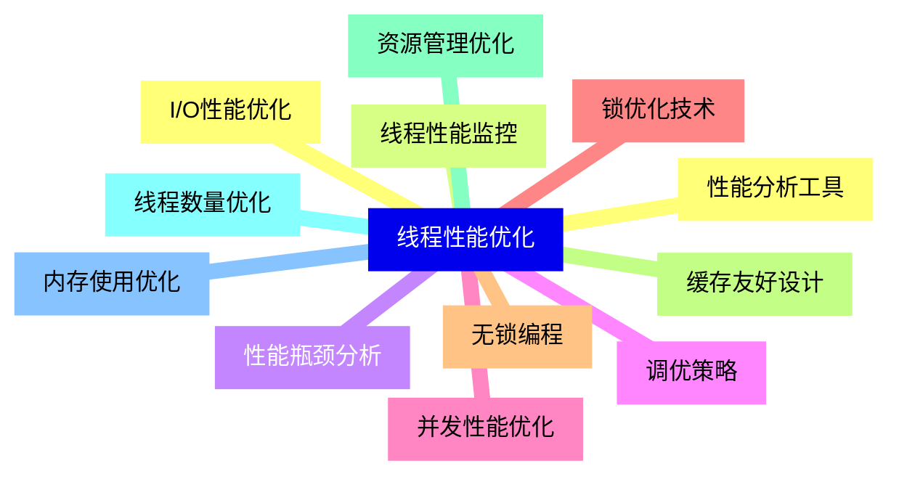

{}

### 11 线程调试与测试{#11}

{}
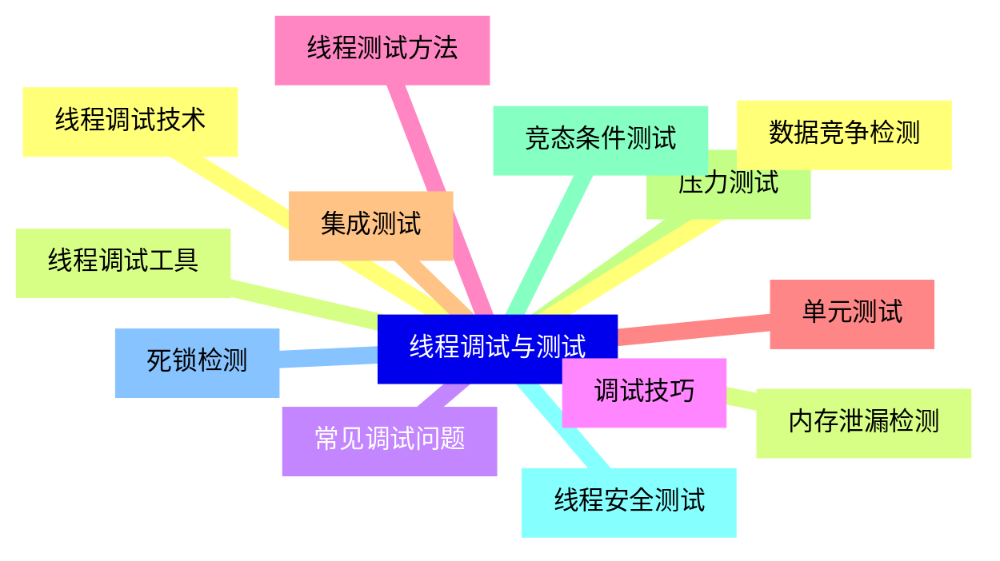

<--->
{}
{}
{}
{}
{}
{}
{}
{}
{}
{}
{}
{}
{}
{}
{}
{}
{}
{}
{}
{}
{}
{}
{}
{}
{}
{}
{}

### 12 线程发展趋势{#12}

{}
{}
{}
{}
{}
{}
{}
{}
{}
{}
{}
{}
{}
{}
{}
{}
{}
{}
{}
{}
{}
{}
{}
{}
{}
<--->
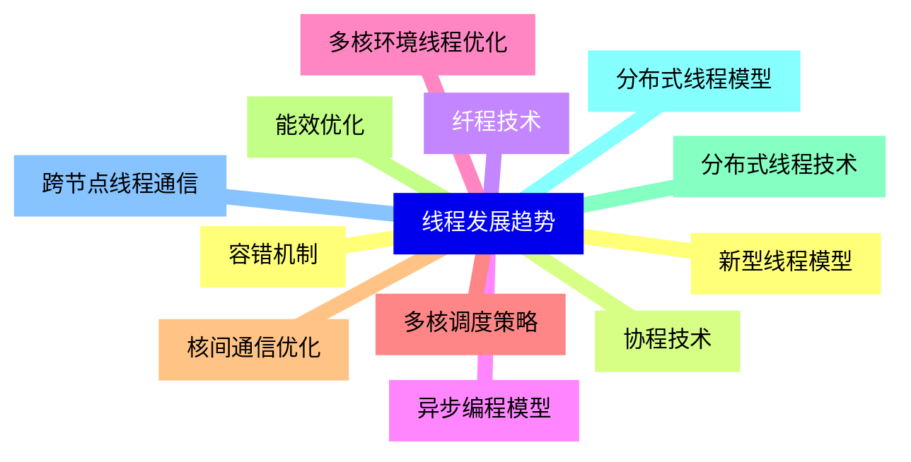

{}
