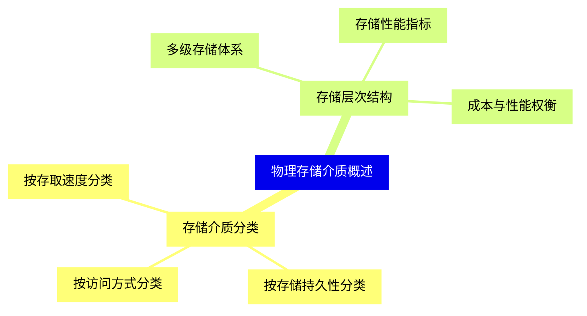
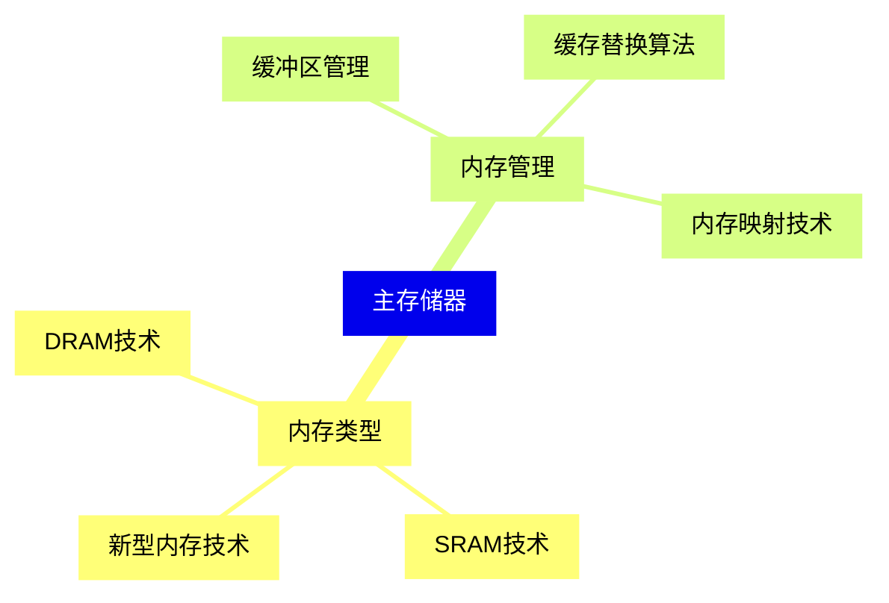
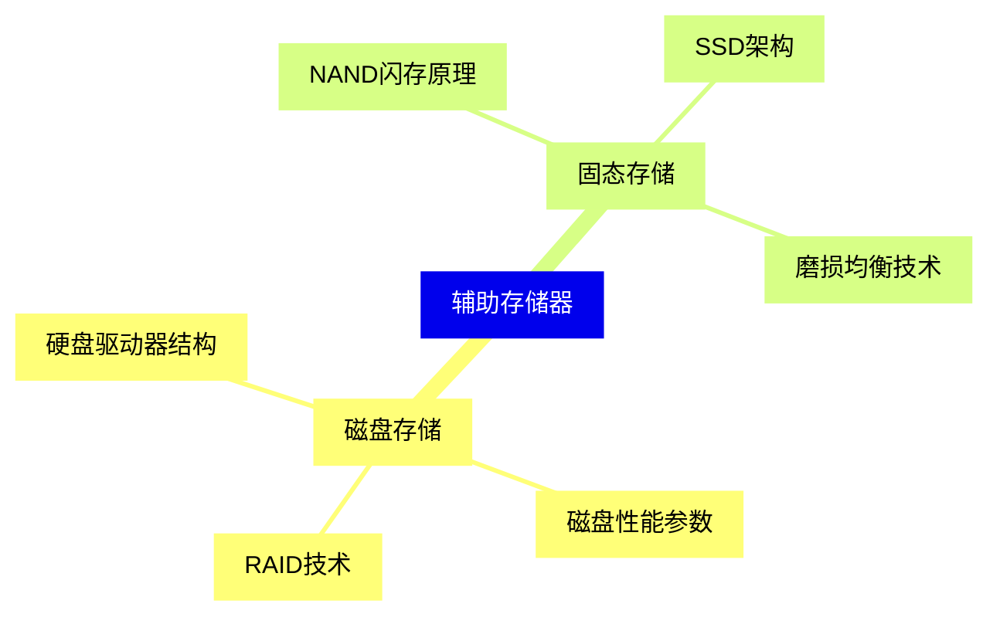
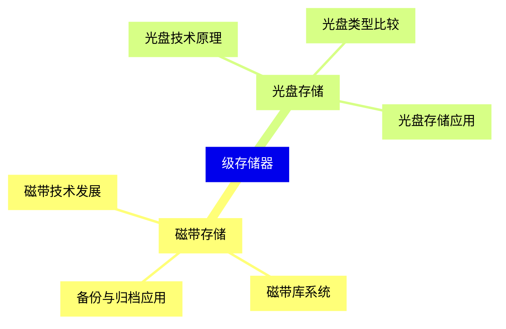
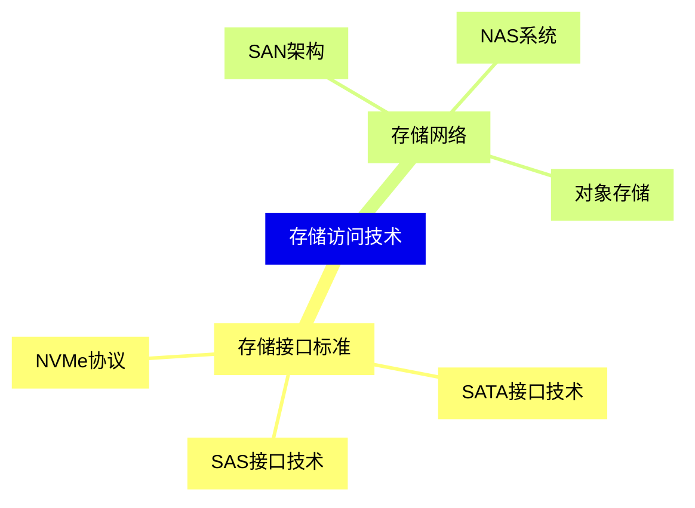
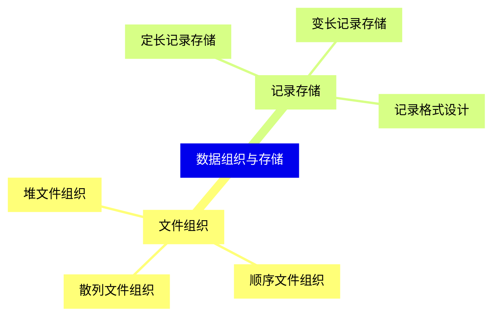
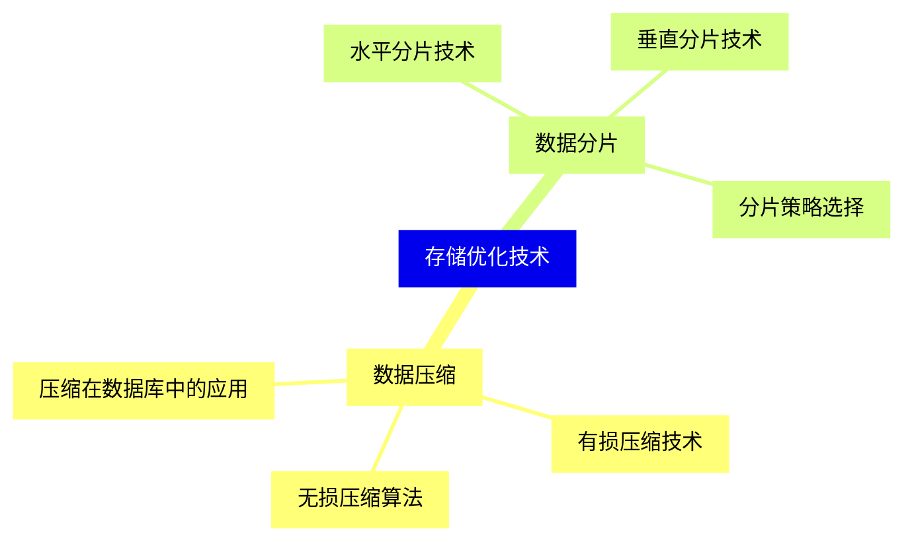
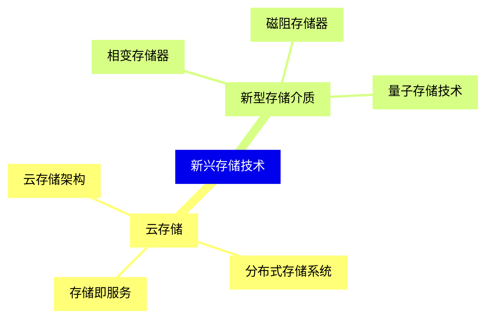
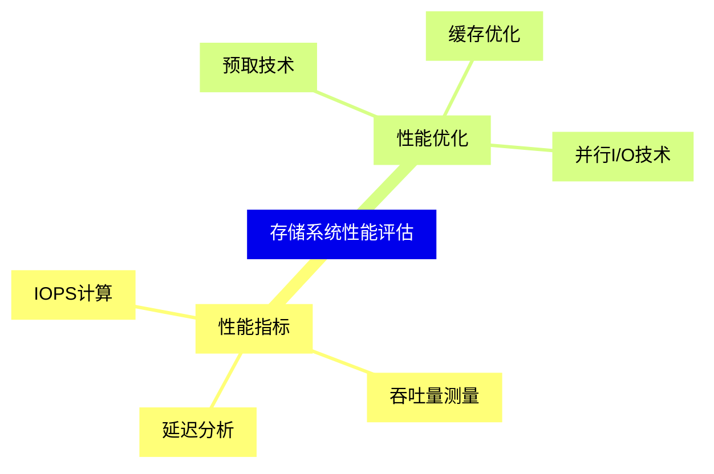
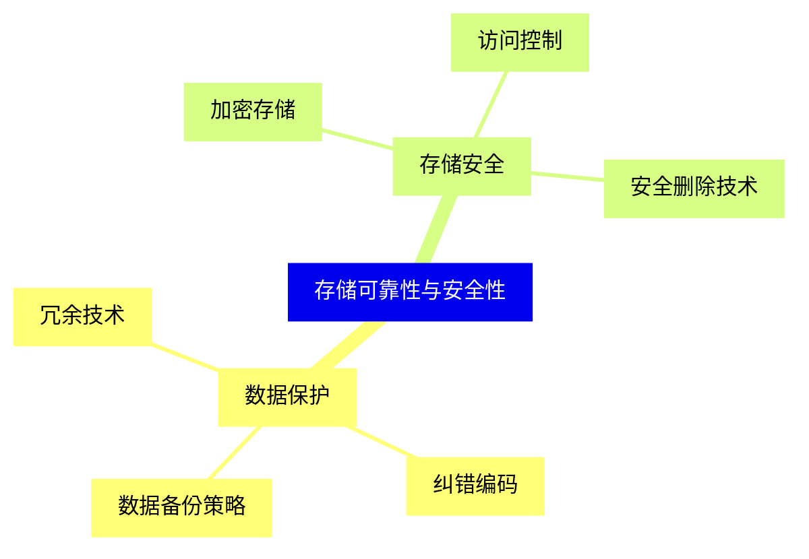


### 1 [物理存储介质概述](#1)
#### 1.1 [存储介质分类](#1)
##### 1.1.1 [按存取速度分类](#1)
##### 1.1.2 [按存储持久性分类](#1)
##### 1.1.3 [按访问方式分类](#1)
#### 1.2 [存储层次结构](#1)
##### 1.2.1 [多级存储体系](#1)
##### 1.2.2 [存储性能指标](#1)
##### 1.2.3 [成本与性能权衡](#1)
### 2 [主存储器](#2)
#### 2.1 [内存类型](#2)
##### 2.1.1 [DRAM技术](#2)
##### 2.1.2 [SRAM技术](#2)
##### 2.1.3 [新型内存技术](#2)
#### 2.2 [内存管理](#2)
##### 2.2.1 [缓冲区管理](#2)
##### 2.2.2 [缓存替换算法](#2)
##### 2.2.3 [内存映射技术](#2)
### 3 [辅助存储器](#3)
#### 3.1 [磁盘存储](#3)
##### 3.1.1 [硬盘驱动器结构](#3)
##### 3.1.2 [磁盘性能参数](#3)
##### 3.1.3 [RAID技术](#3)
#### 3.2 [固态存储](#3)
##### 3.2.1 [NAND闪存原理](#3)
##### 3.2.2 [SSD架构](#3)
##### 3.2.3 [磨损均衡技术](#3)
### 4 [级存储器](#4)
#### 4.1 [磁带存储](#4)
##### 4.1.1 [磁带技术发展](#4)
##### 4.1.2 [磁带库系统](#4)
##### 4.1.3 [备份与归档应用](#4)
#### 4.2 [光盘存储](#4)
##### 4.2.1 [光盘技术原理](#4)
##### 4.2.2 [光盘类型比较](#4)
##### 4.2.3 [光盘存储应用](#4)
### 5 [存储访问技术](#5)
#### 5.1 [存储接口标准](#5)
##### 5.1.1 [SATA接口技术](#5)
##### 5.1.2 [SAS接口技术](#5)
##### 5.1.3 [NVMe协议](#5)
#### 5.2 [存储网络](#5)
##### 5.2.1 [SAN架构](#5)
##### 5.2.2 [NAS系统](#5)
##### 5.2.3 [对象存储](#5)
### 6 [数据组织与存储](#6)
#### 6.1 [文件组织](#6)
##### 6.1.1 [堆文件组织](#6)
##### 6.1.2 [顺序文件组织](#6)
##### 6.1.3 [散列文件组织](#6)
#### 6.2 [记录存储](#6)
##### 6.2.1 [定长记录存储](#6)
##### 6.2.2 [变长记录存储](#6)
##### 6.2.3 [记录格式设计](#6)
### 7 [存储优化技术](#7)
#### 7.1 [数据压缩](#7)
##### 7.1.1 [无损压缩算法](#7)
##### 7.1.2 [有损压缩技术](#7)
##### 7.1.3 [压缩在数据库中的应用](#7)
#### 7.2 [数据分片](#7)
##### 7.2.1 [水平分片技术](#7)
##### 7.2.2 [垂直分片技术](#7)
##### 7.2.3 [分片策略选择](#7)
### 8 [新兴存储技术](#8)
#### 8.1 [云存储](#8)
##### 8.1.1 [云存储架构](#8)
##### 8.1.2 [分布式存储系统](#8)
##### 8.1.3 [存储即服务](#8)
#### 8.2 [新型存储介质](#8)
##### 8.2.1 [相变存储器](#8)
##### 8.2.2 [磁阻存储器](#8)
##### 8.2.3 [量子存储技术](#8)
### 9 [存储系统性能评估](#9)
#### 9.1 [性能指标](#9)
##### 9.1.1 [IOPS计算](#9)
##### 9.1.2 [吞吐量测量](#9)
##### 9.1.3 [延迟分析](#9)
#### 9.2 [性能优化](#9)
##### 9.2.1 [预取技术](#9)
##### 9.2.2 [缓存优化](#9)
##### 9.2.3 [并行I/O技术](#9)
### 10 [存储可靠性与安全性](#10)
#### 10.1 [数据保护](#10)
##### 10.1.1 [冗余技术](#10)
##### 10.1.2 [纠错编码](#10)
##### 10.1.3 [数据备份策略](#10)
#### 10.2 [存储安全](#10)
##### 10.2.1 [加密存储](#10)
##### 10.2.2 [访问控制](#10)
##### 10.2.3 [安全删除技术](#10)




### 1 物理存储介质概述

---
### 1 物理存储介质概述
___
#### 1.1 存储介质分类
___
##### 1.1.1 按存取速度分类
___
##### 1.1.2 按存储持久性分类
___
##### 1.1.3 按访问方式分类
___
#### 1.2 存储层次结构
___
##### 1.2.1 多级存储体系
___
##### 1.2.2 存储性能指标
___
##### 1.2.3 成本与性能权衡
### 2 主存储器

---
### 2 主存储器
___
#### 2.1 内存类型
___
##### 2.1.1 DRAM技术
___
##### 2.1.2 SRAM技术
___
##### 2.1.3 新型内存技术
___
#### 2.2 内存管理
___
##### 2.2.1 缓冲区管理
___
##### 2.2.2 缓存替换算法
___
##### 2.2.3 内存映射技术
### 3 辅助存储器

---
### 3 辅助存储器
___
#### 3.1 磁盘存储
___
##### 3.1.1 硬盘驱动器结构
___
##### 3.1.2 磁盘性能参数
___
##### 3.1.3 RAID技术
___
#### 3.2 固态存储
___
##### 3.2.1 NAND闪存原理
___
##### 3.2.2 SSD架构
___
##### 3.2.3 磨损均衡技术
### 4 级存储器

---
### 4 级存储器
___
#### 4.1 磁带存储
___
##### 4.1.1 磁带技术发展
___
##### 4.1.2 磁带库系统
___
##### 4.1.3 备份与归档应用
___
#### 4.2 光盘存储
___
##### 4.2.1 光盘技术原理
___
##### 4.2.2 光盘类型比较
___
##### 4.2.3 光盘存储应用
### 5 存储访问技术

---
### 5 存储访问技术
___
#### 5.1 存储接口标准
___
##### 5.1.1 SATA接口技术
___
##### 5.1.2 SAS接口技术
___
##### 5.1.3 NVMe协议
___
#### 5.2 存储网络
___
##### 5.2.1 SAN架构
___
##### 5.2.2 NAS系统
___
##### 5.2.3 对象存储
### 6 数据组织与存储

---
### 6 数据组织与存储
___
#### 6.1 文件组织
___
##### 6.1.1 堆文件组织
___
##### 6.1.2 顺序文件组织
___
##### 6.1.3 散列文件组织
___
#### 6.2 记录存储
___
##### 6.2.1 定长记录存储
___
##### 6.2.2 变长记录存储
___
##### 6.2.3 记录格式设计
### 7 存储优化技术

---
### 7 存储优化技术
___
#### 7.1 数据压缩
___
##### 7.1.1 无损压缩算法
___
##### 7.1.2 有损压缩技术
___
##### 7.1.3 压缩在数据库中的应用
___
#### 7.2 数据分片
___
##### 7.2.1 水平分片技术
___
##### 7.2.2 垂直分片技术
___
##### 7.2.3 分片策略选择
### 8 新兴存储技术

---
### 8 新兴存储技术
___
#### 8.1 云存储
___
##### 8.1.1 云存储架构
___
##### 8.1.2 分布式存储系统
___
##### 8.1.3 存储即服务
___
#### 8.2 新型存储介质
___
##### 8.2.1 相变存储器
___
##### 8.2.2 磁阻存储器
___
##### 8.2.3 量子存储技术
### 9 存储系统性能评估

---
### 9 存储系统性能评估
___
#### 9.1 性能指标
___
##### 9.1.1 IOPS计算
___
##### 9.1.2 吞吐量测量
___
##### 9.1.3 延迟分析
___
#### 9.2 性能优化
___
##### 9.2.1 预取技术
___
##### 9.2.2 缓存优化
___
##### 9.2.3 并行I/O技术
### 10 存储可靠性与安全性

---
### 10 存储可靠性与安全性
___
#### 10.1 数据保护
___
##### 10.1.1 冗余技术
___
##### 10.1.2 纠错编码
___
##### 10.1.3 数据备份策略
___
#### 10.2 存储安全
___
##### 10.2.1 加密存储
___
##### 10.2.2 访问控制
___
##### 10.2.3 安全删除技术


### 1 物理存储介质概述{#1}

{}

<--->
{}
{}
{}
{}
{}
{}
{}
{}
{}
{}
{}
{}
{}
{}
{}
{}
{}

### 2 主存储器{#2}

{}
{}
{}
{}
{}
{}
{}
{}
{}
{}
{}
{}
{}
{}
{}
{}
{}
<--->

{}

### 3 辅助存储器{#3}

{}

<--->
{}
{}
{}
{}
{}
{}
{}
{}
{}
{}
{}
{}
{}
{}
{}
{}
{}

### 4 级存储器{#4}

{}
{}
{}
{}
{}
{}
{}
{}
{}
{}
{}
{}
{}
{}
{}
{}
{}
<--->

{}

### 5 存储访问技术{#5}

{}

<--->
{}
{}
{}
{}
{}
{}
{}
{}
{}
{}
{}
{}
{}
{}
{}
{}
{}

### 6 数据组织与存储{#6}

{}
{}
{}
{}
{}
{}
{}
{}
{}
{}
{}
{}
{}
{}
{}
{}
{}
<--->

{}

### 7 存储优化技术{#7}

{}

<--->
{}
{}
{}
{}
{}
{}
{}
{}
{}
{}
{}
{}
{}
{}
{}
{}
{}

### 8 新兴存储技术{#8}

{}
{}
{}
{}
{}
{}
{}
{}
{}
{}
{}
{}
{}
{}
{}
{}
{}
<--->

{}

### 9 存储系统性能评估{#9}

{}

<--->
{}
{}
{}
{}
{}
{}
{}
{}
{}
{}
{}
{}
{}
{}
{}
{}
{}

### 10 存储可靠性与安全性{#10}

{}
{}
{}
{}
{}
{}
{}
{}
{}
{}
{}
{}
{}
{}
{}
{}
{}
<--->

{}
