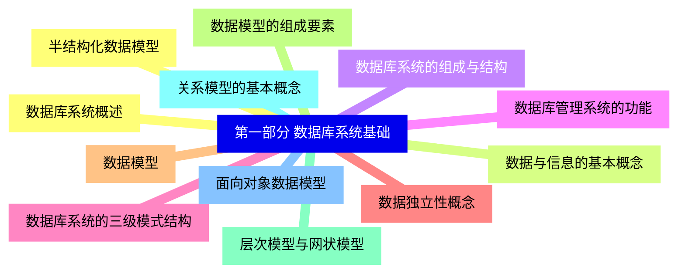
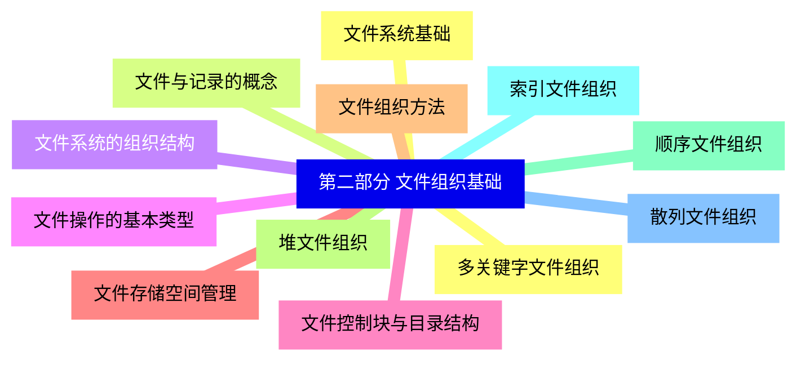
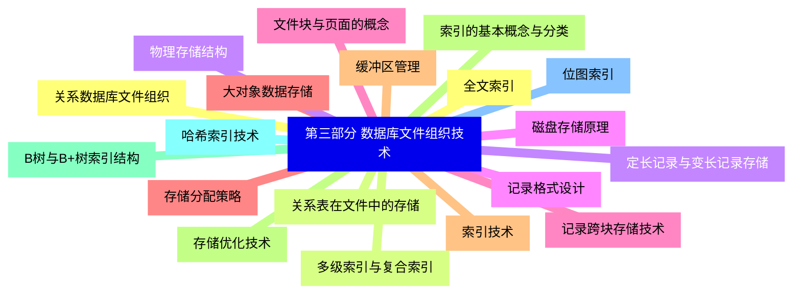
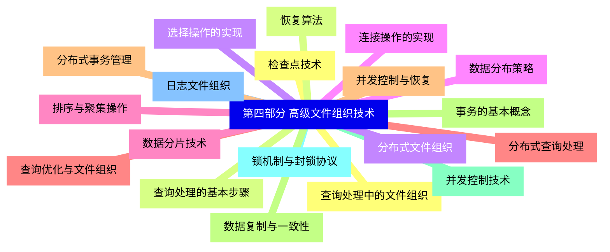
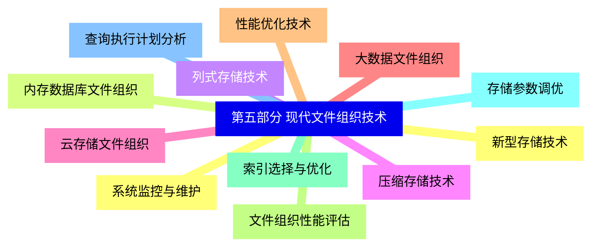


### 1 [第一部分 数据库系统基础](#1)
#### 1.1 [数据库系统概述](#1)
#### 1.2 [数据与信息的基本概念](#1)
#### 1.3 [数据库系统的组成与结构](#1)
#### 1.4 [数据库管理系统的功能](#1)
#### 1.5 [数据库系统的三级模式结构](#1)
#### 1.6 [数据独立性概念](#1)
#### 1.7 [数据模型](#1)
#### 1.8 [数据模型的组成要素](#1)
#### 1.9 [层次模型与网状模型](#1)
#### 1.10 [关系模型的基本概念](#1)
#### 1.11 [面向对象数据模型](#1)
#### 1.12 [半结构化数据模型](#1)
### 2 [第二部分 文件组织基础](#2)
#### 2.1 [文件系统基础](#2)
#### 2.2 [文件与记录的概念](#2)
#### 2.3 [文件系统的组织结构](#2)
#### 2.4 [文件操作的基本类型](#2)
#### 2.5 [文件控制块与目录结构](#2)
#### 2.6 [文件存储空间管理](#2)
#### 2.7 [文件组织方法](#2)
#### 2.8 [堆文件组织](#2)
#### 2.9 [顺序文件组织](#2)
#### 2.10 [索引文件组织](#2)
#### 2.11 [散列文件组织](#2)
#### 2.12 [多关键字文件组织](#2)
### 3 [第三部分 数据库文件组织技术](#3)
#### 3.1 [关系数据库文件组织](#3)
#### 3.2 [关系表在文件中的存储](#3)
#### 3.3 [定长记录与变长记录存储](#3)
#### 3.4 [记录格式设计](#3)
#### 3.5 [记录跨块存储技术](#3)
#### 3.6 [大对象数据存储](#3)
#### 3.7 [索引技术](#3)
#### 3.8 [索引的基本概念与分类](#3)
#### 3.9 [B树与B+树索引结构](#3)
#### 3.10 [哈希索引技术](#3)
#### 3.11 [位图索引](#3)
#### 3.12 [全文索引](#3)
#### 3.13 [多级索引与复合索引](#3)
#### 3.14 [物理存储结构](#3)
#### 3.15 [磁盘存储原理](#3)
#### 3.16 [文件块与页面的概念](#3)
#### 3.17 [存储分配策略](#3)
#### 3.18 [缓冲区管理](#3)
#### 3.19 [存储优化技术](#3)
### 4 [第四部分 高级文件组织技术](#4)
#### 4.1 [查询处理中的文件组织](#4)
#### 4.2 [查询处理的基本步骤](#4)
#### 4.3 [选择操作的实现](#4)
#### 4.4 [连接操作的实现](#4)
#### 4.5 [排序与聚集操作](#4)
#### 4.6 [查询优化与文件组织](#4)
#### 4.7 [并发控制与恢复](#4)
#### 4.8 [事务的基本概念](#4)
#### 4.9 [并发控制技术](#4)
#### 4.10 [锁机制与封锁协议](#4)
#### 4.11 [日志文件组织](#4)
#### 4.12 [检查点技术](#4)
#### 4.13 [恢复算法](#4)
#### 4.14 [分布式文件组织](#4)
#### 4.15 [数据分布策略](#4)
#### 4.16 [数据分片技术](#4)
#### 4.17 [分布式查询处理](#4)
#### 4.18 [分布式事务管理](#4)
#### 4.19 [数据复制与一致性](#4)
### 5 [第五部分 现代文件组织技术](#5)
#### 5.1 [新型存储技术](#5)
#### 5.2 [内存数据库文件组织](#5)
#### 5.3 [列式存储技术](#5)
#### 5.4 [压缩存储技术](#5)
#### 5.5 [云存储文件组织](#5)
#### 5.6 [大数据文件组织](#5)
#### 5.7 [性能优化技术](#5)
#### 5.8 [文件组织性能评估](#5)
#### 5.9 [索引选择与优化](#5)
#### 5.10 [存储参数调优](#5)
#### 5.11 [查询执行计划分析](#5)
#### 5.12 [系统监控与维护](#5)




### 1 第一部分 数据库系统基础

---
### 1 第一部分 数据库系统基础
___
#### 1.1 数据库系统概述
___
#### 1.2 数据与信息的基本概念
___
#### 1.3 数据库系统的组成与结构
___
#### 1.4 数据库管理系统的功能
___
#### 1.5 数据库系统的三级模式结构
___
#### 1.6 数据独立性概念
___
#### 1.7 数据模型
___
#### 1.8 数据模型的组成要素
___
#### 1.9 层次模型与网状模型
___
#### 1.10 关系模型的基本概念
___
#### 1.11 面向对象数据模型
___
#### 1.12 半结构化数据模型
### 2 第二部分 文件组织基础

---
### 2 第二部分 文件组织基础
___
#### 2.1 文件系统基础
___
#### 2.2 文件与记录的概念
___
#### 2.3 文件系统的组织结构
___
#### 2.4 文件操作的基本类型
___
#### 2.5 文件控制块与目录结构
___
#### 2.6 文件存储空间管理
___
#### 2.7 文件组织方法
___
#### 2.8 堆文件组织
___
#### 2.9 顺序文件组织
___
#### 2.10 索引文件组织
___
#### 2.11 散列文件组织
___
#### 2.12 多关键字文件组织
### 3 第三部分 数据库文件组织技术

---
### 3 第三部分 数据库文件组织技术
___
#### 3.1 关系数据库文件组织
___
#### 3.2 关系表在文件中的存储
___
#### 3.3 定长记录与变长记录存储
___
#### 3.4 记录格式设计
___
#### 3.5 记录跨块存储技术
___
#### 3.6 大对象数据存储
___
#### 3.7 索引技术
___
#### 3.8 索引的基本概念与分类
___
#### 3.9 B树与B+树索引结构
___
#### 3.10 哈希索引技术
___
#### 3.11 位图索引
___
#### 3.12 全文索引
___
#### 3.13 多级索引与复合索引
___
#### 3.14 物理存储结构
___
#### 3.15 磁盘存储原理
___
#### 3.16 文件块与页面的概念
___
#### 3.17 存储分配策略
___
#### 3.18 缓冲区管理
___
#### 3.19 存储优化技术
### 4 第四部分 高级文件组织技术

---
### 4 第四部分 高级文件组织技术
___
#### 4.1 查询处理中的文件组织
___
#### 4.2 查询处理的基本步骤
___
#### 4.3 选择操作的实现
___
#### 4.4 连接操作的实现
___
#### 4.5 排序与聚集操作
___
#### 4.6 查询优化与文件组织
___
#### 4.7 并发控制与恢复
___
#### 4.8 事务的基本概念
___
#### 4.9 并发控制技术
___
#### 4.10 锁机制与封锁协议
___
#### 4.11 日志文件组织
___
#### 4.12 检查点技术
___
#### 4.13 恢复算法
___
#### 4.14 分布式文件组织
___
#### 4.15 数据分布策略
___
#### 4.16 数据分片技术
___
#### 4.17 分布式查询处理
___
#### 4.18 分布式事务管理
___
#### 4.19 数据复制与一致性
### 5 第五部分 现代文件组织技术

---
### 5 第五部分 现代文件组织技术
___
#### 5.1 新型存储技术
___
#### 5.2 内存数据库文件组织
___
#### 5.3 列式存储技术
___
#### 5.4 压缩存储技术
___
#### 5.5 云存储文件组织
___
#### 5.6 大数据文件组织
___
#### 5.7 性能优化技术
___
#### 5.8 文件组织性能评估
___
#### 5.9 索引选择与优化
___
#### 5.10 存储参数调优
___
#### 5.11 查询执行计划分析
___
#### 5.12 系统监控与维护


### 1 第一部分 数据库系统基础{#1}

{}

<--->
{}
{}
{}
{}
{}
{}
{}
{}
{}
{}
{}
{}
{}
{}
{}
{}
{}
{}
{}
{}
{}
{}
{}
{}
{}

### 2 第二部分 文件组织基础{#2}

{}
{}
{}
{}
{}
{}
{}
{}
{}
{}
{}
{}
{}
{}
{}
{}
{}
{}
{}
{}
{}
{}
{}
{}
{}
<--->

{}

### 3 第三部分 数据库文件组织技术{#3}

{}

<--->
{}
{}
{}
{}
{}
{}
{}
{}
{}
{}
{}
{}
{}
{}
{}
{}
{}
{}
{}
{}
{}
{}
{}
{}
{}
{}
{}
{}
{}
{}
{}
{}
{}
{}
{}
{}
{}
{}
{}

### 4 第四部分 高级文件组织技术{#4}

{}
{}
{}
{}
{}
{}
{}
{}
{}
{}
{}
{}
{}
{}
{}
{}
{}
{}
{}
{}
{}
{}
{}
{}
{}
{}
{}
{}
{}
{}
{}
{}
{}
{}
{}
{}
{}
{}
{}
<--->

{}

### 5 第五部分 现代文件组织技术{#5}

{}

<--->
{}
{}
{}
{}
{}
{}
{}
{}
{}
{}
{}
{}
{}
{}
{}
{}
{}
{}
{}
{}
{}
{}
{}
{}
{}
