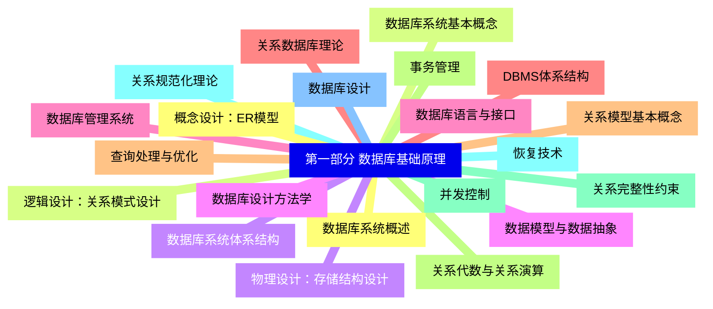
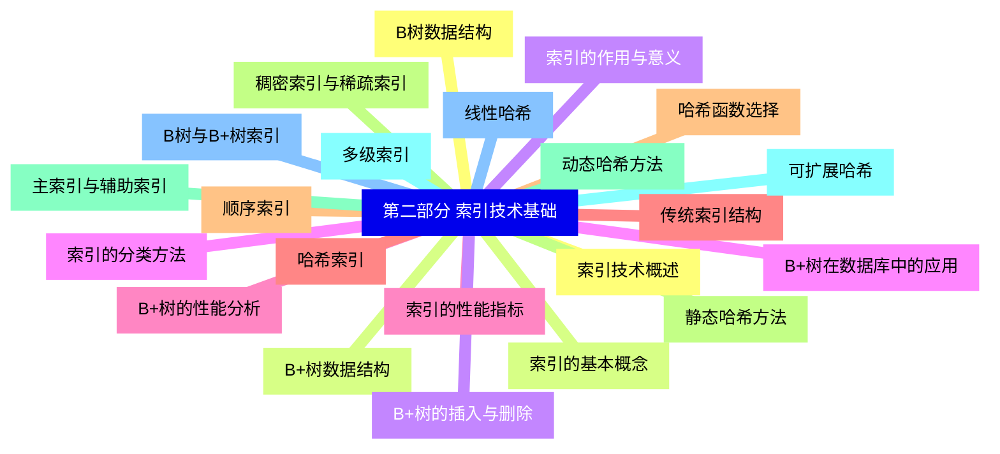
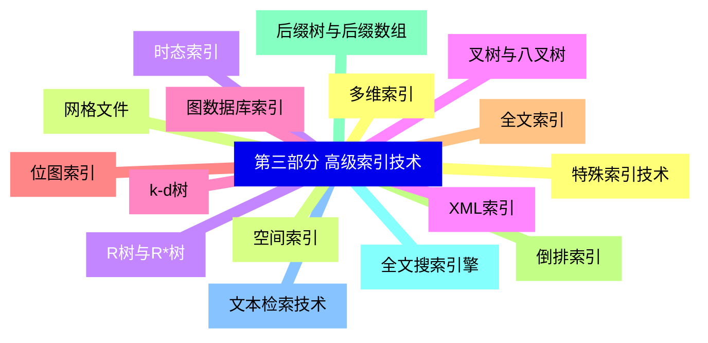
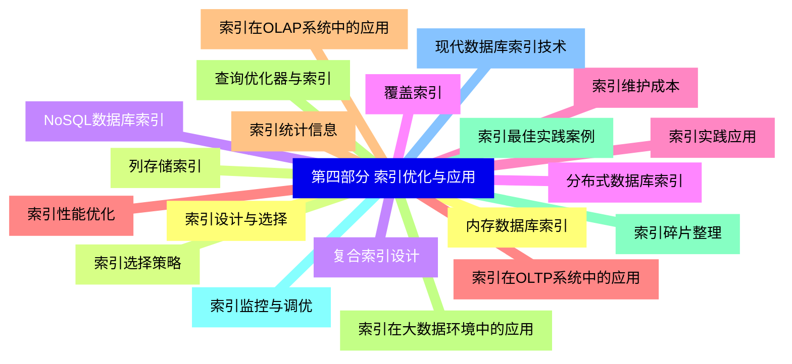


### 1 [第一部分 数据库基础原理](#1)
#### 1.1 [数据库系统概述](#1)
#### 1.2 [数据库系统基本概念](#1)
#### 1.3 [数据库系统体系结构](#1)
#### 1.4 [数据模型与数据抽象](#1)
#### 1.5 [数据库语言与接口](#1)
#### 1.6 [关系数据库理论](#1)
#### 1.7 [关系模型基本概念](#1)
#### 1.8 [关系代数与关系演算](#1)
#### 1.9 [关系完整性约束](#1)
#### 1.10 [关系规范化理论](#1)
#### 1.11 [数据库设计](#1)
#### 1.12 [概念设计：ER模型](#1)
#### 1.13 [逻辑设计：关系模式设计](#1)
#### 1.14 [物理设计：存储结构设计](#1)
#### 1.15 [数据库设计方法学](#1)
#### 1.16 [数据库管理系统](#1)
#### 1.17 [DBMS体系结构](#1)
#### 1.18 [查询处理与优化](#1)
#### 1.19 [事务管理](#1)
#### 1.20 [并发控制](#1)
#### 1.21 [恢复技术](#1)
### 2 [第二部分 索引技术基础](#2)
#### 2.1 [索引技术概述](#2)
#### 2.2 [索引的基本概念](#2)
#### 2.3 [索引的作用与意义](#2)
#### 2.4 [索引的分类方法](#2)
#### 2.5 [索引的性能指标](#2)
#### 2.6 [传统索引结构](#2)
#### 2.7 [顺序索引](#2)
#### 2.8 [稠密索引与稀疏索引](#2)
#### 2.9 [主索引与辅助索引](#2)
#### 2.10 [多级索引](#2)
#### 2.11 [B树与B+树索引](#2)
#### 2.12 [B树数据结构](#2)
#### 2.13 [B+树数据结构](#2)
#### 2.14 [B+树的插入与删除](#2)
#### 2.15 [B+树在数据库中的应用](#2)
#### 2.16 [B+树的性能分析](#2)
#### 2.17 [哈希索引](#2)
#### 2.18 [哈希函数选择](#2)
#### 2.19 [静态哈希方法](#2)
#### 2.20 [动态哈希方法](#2)
#### 2.21 [可扩展哈希](#2)
#### 2.22 [线性哈希](#2)
### 3 [第三部分 高级索引技术](#3)
#### 3.1 [多维索引](#3)
#### 3.2 [网格文件](#3)
#### 3.3 [R树与R*树](#3)
#### 3.4 [叉树与八叉树](#3)
#### 3.5 [k-d树](#3)
#### 3.6 [位图索引](#3)
#### 3.7 [全文索引](#3)
#### 3.8 [倒排索引](#3)
#### 3.9 [后缀树与后缀数组](#3)
#### 3.10 [全文搜索引擎](#3)
#### 3.11 [文本检索技术](#3)
#### 3.12 [特殊索引技术](#3)
#### 3.13 [空间索引](#3)
#### 3.14 [时态索引](#3)
#### 3.15 [XML索引](#3)
#### 3.16 [图数据库索引](#3)
### 4 [第四部分 索引优化与应用](#4)
#### 4.1 [索引设计与选择](#4)
#### 4.2 [索引选择策略](#4)
#### 4.3 [复合索引设计](#4)
#### 4.4 [覆盖索引](#4)
#### 4.5 [索引维护成本](#4)
#### 4.6 [索引性能优化](#4)
#### 4.7 [索引统计信息](#4)
#### 4.8 [查询优化器与索引](#4)
#### 4.9 [索引碎片整理](#4)
#### 4.10 [索引监控与调优](#4)
#### 4.11 [现代数据库索引技术](#4)
#### 4.12 [内存数据库索引](#4)
#### 4.13 [列存储索引](#4)
#### 4.14 [NoSQL数据库索引](#4)
#### 4.15 [分布式数据库索引](#4)
#### 4.16 [索引实践应用](#4)
#### 4.17 [索引在OLTP系统中的应用](#4)
#### 4.18 [索引在OLAP系统中的应用](#4)
#### 4.19 [索引在大数据环境中的应用](#4)
#### 4.20 [索引最佳实践案例](#4)




### 1 第一部分 数据库基础原理

---
### 1 第一部分 数据库基础原理
___
#### 1.1 数据库系统概述
___
#### 1.2 数据库系统基本概念
___
#### 1.3 数据库系统体系结构
___
#### 1.4 数据模型与数据抽象
___
#### 1.5 数据库语言与接口
___
#### 1.6 关系数据库理论
___
#### 1.7 关系模型基本概念
___
#### 1.8 关系代数与关系演算
___
#### 1.9 关系完整性约束
___
#### 1.10 关系规范化理论
___
#### 1.11 数据库设计
___
#### 1.12 概念设计：ER模型
___
#### 1.13 逻辑设计：关系模式设计
___
#### 1.14 物理设计：存储结构设计
___
#### 1.15 数据库设计方法学
___
#### 1.16 数据库管理系统
___
#### 1.17 DBMS体系结构
___
#### 1.18 查询处理与优化
___
#### 1.19 事务管理
___
#### 1.20 并发控制
___
#### 1.21 恢复技术
### 2 第二部分 索引技术基础

---
### 2 第二部分 索引技术基础
___
#### 2.1 索引技术概述
___
#### 2.2 索引的基本概念
___
#### 2.3 索引的作用与意义
___
#### 2.4 索引的分类方法
___
#### 2.5 索引的性能指标
___
#### 2.6 传统索引结构
___
#### 2.7 顺序索引
___
#### 2.8 稠密索引与稀疏索引
___
#### 2.9 主索引与辅助索引
___
#### 2.10 多级索引
___
#### 2.11 B树与B+树索引
___
#### 2.12 B树数据结构
___
#### 2.13 B+树数据结构
___
#### 2.14 B+树的插入与删除
___
#### 2.15 B+树在数据库中的应用
___
#### 2.16 B+树的性能分析
___
#### 2.17 哈希索引
___
#### 2.18 哈希函数选择
___
#### 2.19 静态哈希方法
___
#### 2.20 动态哈希方法
___
#### 2.21 可扩展哈希
___
#### 2.22 线性哈希
### 3 第三部分 高级索引技术

---
### 3 第三部分 高级索引技术
___
#### 3.1 多维索引
___
#### 3.2 网格文件
___
#### 3.3 R树与R*树
___
#### 3.4 叉树与八叉树
___
#### 3.5 k-d树
___
#### 3.6 位图索引
___
#### 3.7 全文索引
___
#### 3.8 倒排索引
___
#### 3.9 后缀树与后缀数组
___
#### 3.10 全文搜索引擎
___
#### 3.11 文本检索技术
___
#### 3.12 特殊索引技术
___
#### 3.13 空间索引
___
#### 3.14 时态索引
___
#### 3.15 XML索引
___
#### 3.16 图数据库索引
### 4 第四部分 索引优化与应用

---
### 4 第四部分 索引优化与应用
___
#### 4.1 索引设计与选择
___
#### 4.2 索引选择策略
___
#### 4.3 复合索引设计
___
#### 4.4 覆盖索引
___
#### 4.5 索引维护成本
___
#### 4.6 索引性能优化
___
#### 4.7 索引统计信息
___
#### 4.8 查询优化器与索引
___
#### 4.9 索引碎片整理
___
#### 4.10 索引监控与调优
___
#### 4.11 现代数据库索引技术
___
#### 4.12 内存数据库索引
___
#### 4.13 列存储索引
___
#### 4.14 NoSQL数据库索引
___
#### 4.15 分布式数据库索引
___
#### 4.16 索引实践应用
___
#### 4.17 索引在OLTP系统中的应用
___
#### 4.18 索引在OLAP系统中的应用
___
#### 4.19 索引在大数据环境中的应用
___
#### 4.20 索引最佳实践案例


### 1 第一部分 数据库基础原理{#1}

{}

<--->
{}
{}
{}
{}
{}
{}
{}
{}
{}
{}
{}
{}
{}
{}
{}
{}
{}
{}
{}
{}
{}
{}
{}
{}
{}
{}
{}
{}
{}
{}
{}
{}
{}
{}
{}
{}
{}
{}
{}
{}
{}
{}
{}

### 2 第二部分 索引技术基础{#2}

{}
{}
{}
{}
{}
{}
{}
{}
{}
{}
{}
{}
{}
{}
{}
{}
{}
{}
{}
{}
{}
{}
{}
{}
{}
{}
{}
{}
{}
{}
{}
{}
{}
{}
{}
{}
{}
{}
{}
{}
{}
{}
{}
{}
{}
<--->

{}

### 3 第三部分 高级索引技术{#3}

{}

<--->
{}
{}
{}
{}
{}
{}
{}
{}
{}
{}
{}
{}
{}
{}
{}
{}
{}
{}
{}
{}
{}
{}
{}
{}
{}
{}
{}
{}
{}
{}
{}
{}
{}

### 4 第四部分 索引优化与应用{#4}

{}
{}
{}
{}
{}
{}
{}
{}
{}
{}
{}
{}
{}
{}
{}
{}
{}
{}
{}
{}
{}
{}
{}
{}
{}
{}
{}
{}
{}
{}
{}
{}
{}
{}
{}
{}
{}
{}
{}
{}
{}
<--->

{}
