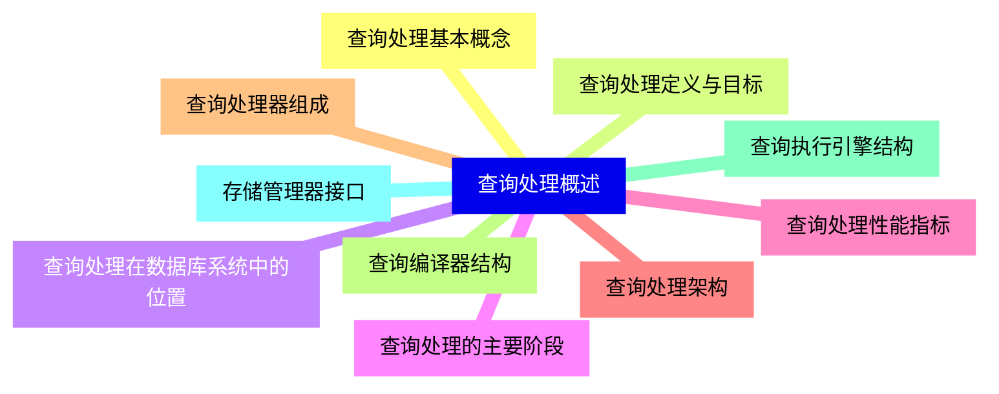
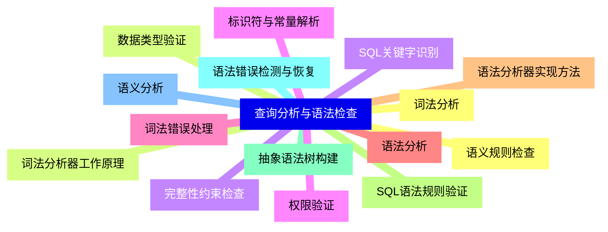
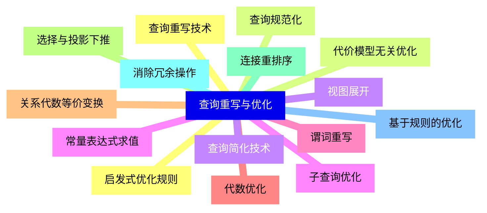
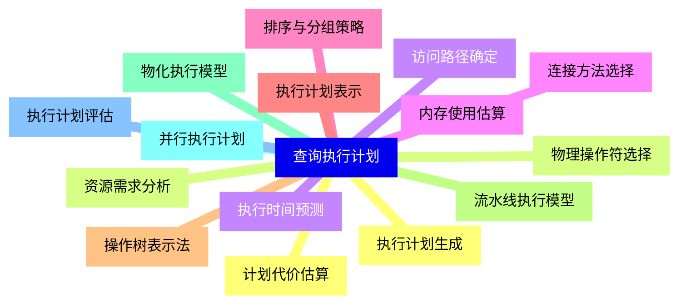
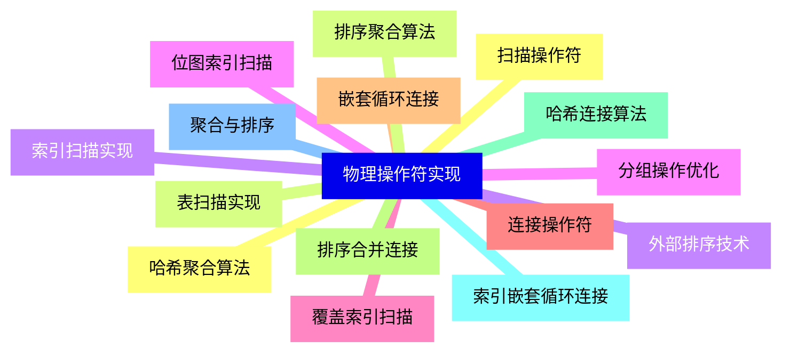
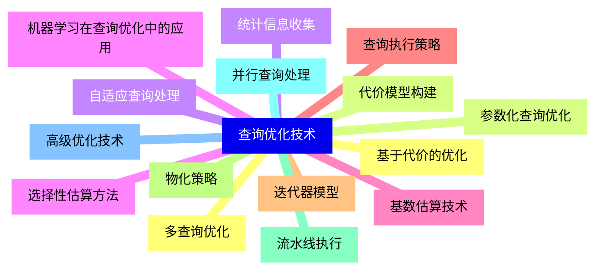
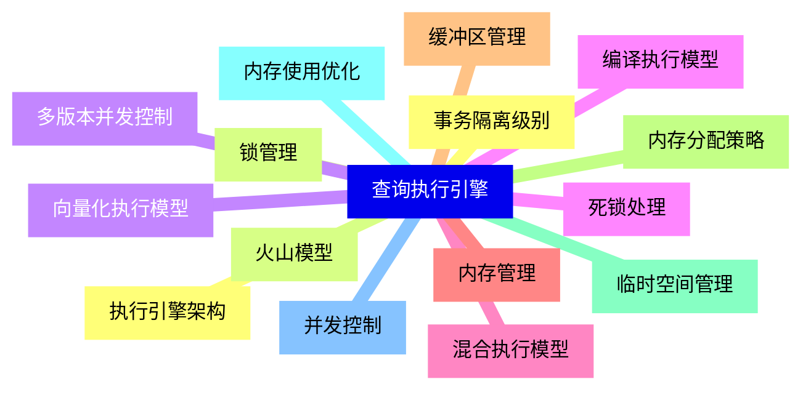
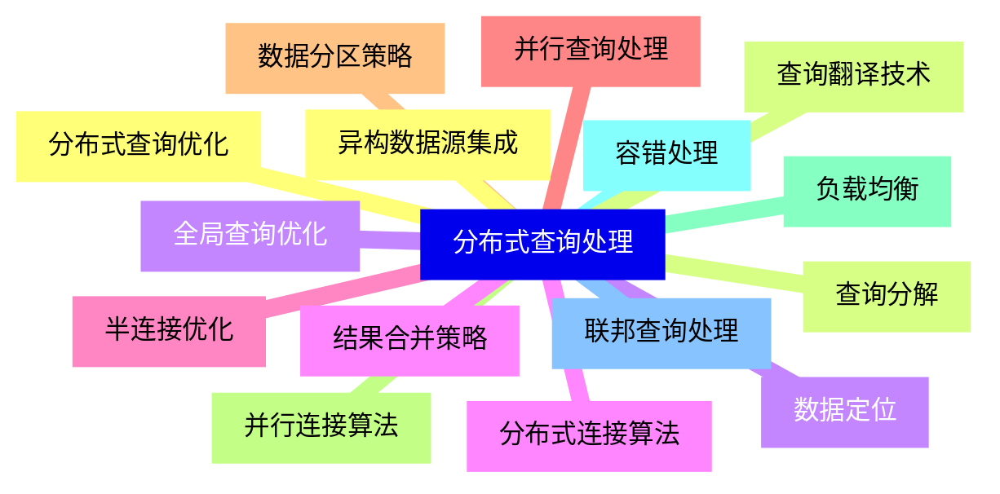
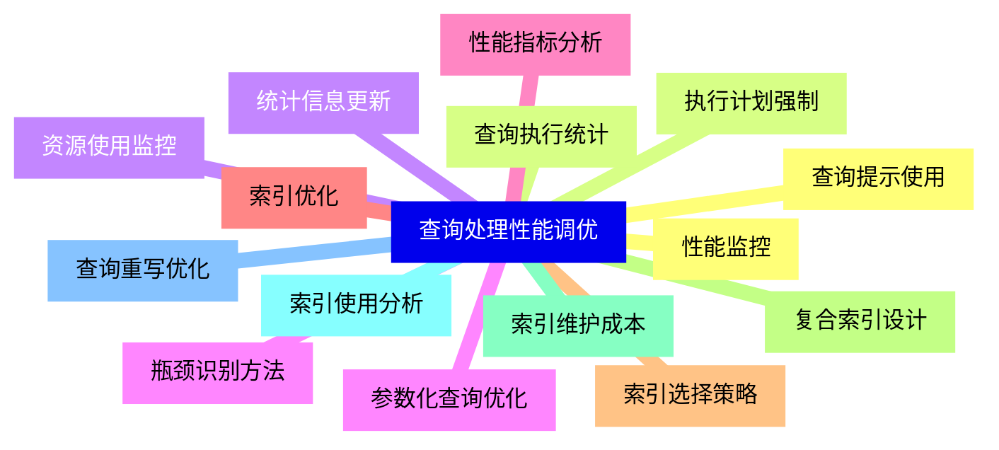
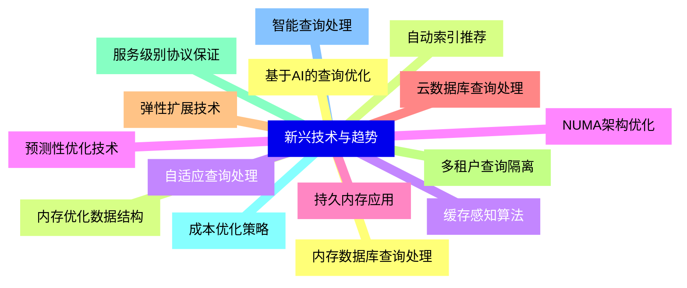


### 1 [查询处理概述](#1)
#### 1.1 [查询处理基本概念](#1)
#### 1.2 [查询处理定义与目标](#1)
#### 1.3 [查询处理在数据库系统中的位置](#1)
#### 1.4 [查询处理的主要阶段](#1)
#### 1.5 [查询处理性能指标](#1)
#### 1.6 [查询处理架构](#1)
#### 1.7 [查询处理器组成](#1)
#### 1.8 [查询编译器结构](#1)
#### 1.9 [查询执行引擎结构](#1)
#### 1.10 [存储管理器接口](#1)
### 2 [查询分析与语法检查](#2)
#### 2.1 [词法分析](#2)
#### 2.2 [词法分析器工作原理](#2)
#### 2.3 [SQL关键字识别](#2)
#### 2.4 [标识符与常量解析](#2)
#### 2.5 [词法错误处理](#2)
#### 2.6 [语法分析](#2)
#### 2.7 [语法分析器实现方法](#2)
#### 2.8 [SQL语法规则验证](#2)
#### 2.9 [抽象语法树构建](#2)
#### 2.10 [语法错误检测与恢复](#2)
#### 2.11 [语义分析](#2)
#### 2.12 [语义规则检查](#2)
#### 2.13 [数据类型验证](#2)
#### 2.14 [完整性约束检查](#2)
#### 2.15 [权限验证](#2)
### 3 [查询重写与优化](#3)
#### 3.1 [查询重写技术](#3)
#### 3.2 [查询规范化](#3)
#### 3.3 [视图展开](#3)
#### 3.4 [子查询优化](#3)
#### 3.5 [谓词重写](#3)
#### 3.6 [代数优化](#3)
#### 3.7 [关系代数等价变换](#3)
#### 3.8 [选择与投影下推](#3)
#### 3.9 [连接重排序](#3)
#### 3.10 [消除冗余操作](#3)
#### 3.11 [基于规则的优化](#3)
#### 3.12 [启发式优化规则](#3)
#### 3.13 [代价模型无关优化](#3)
#### 3.14 [查询简化技术](#3)
#### 3.15 [常量表达式求值](#3)
### 4 [查询执行计划](#4)
#### 4.1 [执行计划生成](#4)
#### 4.2 [物理操作符选择](#4)
#### 4.3 [访问路径确定](#4)
#### 4.4 [连接方法选择](#4)
#### 4.5 [排序与分组策略](#4)
#### 4.6 [执行计划表示](#4)
#### 4.7 [操作树表示法](#4)
#### 4.8 [流水线执行模型](#4)
#### 4.9 [物化执行模型](#4)
#### 4.10 [并行执行计划](#4)
#### 4.11 [执行计划评估](#4)
#### 4.12 [计划代价估算](#4)
#### 4.13 [资源需求分析](#4)
#### 4.14 [执行时间预测](#4)
#### 4.15 [内存使用估算](#4)
### 5 [物理操作符实现](#5)
#### 5.1 [扫描操作符](#5)
#### 5.2 [表扫描实现](#5)
#### 5.3 [索引扫描实现](#5)
#### 5.4 [位图索引扫描](#5)
#### 5.5 [覆盖索引扫描](#5)
#### 5.6 [连接操作符](#5)
#### 5.7 [嵌套循环连接](#5)
#### 5.8 [排序合并连接](#5)
#### 5.9 [哈希连接算法](#5)
#### 5.10 [索引嵌套循环连接](#5)
#### 5.11 [聚合与排序](#5)
#### 5.12 [哈希聚合算法](#5)
#### 5.13 [排序聚合算法](#5)
#### 5.14 [外部排序技术](#5)
#### 5.15 [分组操作优化](#5)
### 6 [查询优化技术](#6)
#### 6.1 [基于代价的优化](#6)
#### 6.2 [代价模型构建](#6)
#### 6.3 [统计信息收集](#6)
#### 6.4 [选择性估算方法](#6)
#### 6.5 [基数估算技术](#6)
#### 6.6 [查询执行策略](#6)
#### 6.7 [迭代器模型](#6)
#### 6.8 [物化策略](#6)
#### 6.9 [流水线执行](#6)
#### 6.10 [并行查询处理](#6)
#### 6.11 [高级优化技术](#6)
#### 6.12 [多查询优化](#6)
#### 6.13 [参数化查询优化](#6)
#### 6.14 [自适应查询处理](#6)
#### 6.15 [机器学习在查询优化中的应用](#6)
### 7 [查询执行引擎](#7)
#### 7.1 [执行引擎架构](#7)
#### 7.2 [火山模型](#7)
#### 7.3 [向量化执行模型](#7)
#### 7.4 [编译执行模型](#7)
#### 7.5 [混合执行模型](#7)
#### 7.6 [内存管理](#7)
#### 7.7 [缓冲区管理](#7)
#### 7.8 [内存分配策略](#7)
#### 7.9 [临时空间管理](#7)
#### 7.10 [内存使用优化](#7)
#### 7.11 [并发控制](#7)
#### 7.12 [事务隔离级别](#7)
#### 7.13 [锁管理](#7)
#### 7.14 [多版本并发控制](#7)
#### 7.15 [死锁处理](#7)
### 8 [分布式查询处理](#8)
#### 8.1 [分布式查询优化](#8)
#### 8.2 [查询分解](#8)
#### 8.3 [数据定位](#8)
#### 8.4 [分布式连接算法](#8)
#### 8.5 [半连接优化](#8)
#### 8.6 [并行查询处理](#8)
#### 8.7 [数据分区策略](#8)
#### 8.8 [并行连接算法](#8)
#### 8.9 [负载均衡](#8)
#### 8.10 [容错处理](#8)
#### 8.11 [联邦查询处理](#8)
#### 8.12 [异构数据源集成](#8)
#### 8.13 [查询翻译技术](#8)
#### 8.14 [全局查询优化](#8)
#### 8.15 [结果合并策略](#8)
### 9 [查询处理性能调优](#9)
#### 9.1 [性能监控](#9)
#### 9.2 [查询执行统计](#9)
#### 9.3 [资源使用监控](#9)
#### 9.4 [瓶颈识别方法](#9)
#### 9.5 [性能指标分析](#9)
#### 9.6 [索引优化](#9)
#### 9.7 [索引选择策略](#9)
#### 9.8 [复合索引设计](#9)
#### 9.9 [索引维护成本](#9)
#### 9.10 [索引使用分析](#9)
#### 9.11 [查询重写优化](#9)
#### 9.12 [查询提示使用](#9)
#### 9.13 [执行计划强制](#9)
#### 9.14 [统计信息更新](#9)
#### 9.15 [参数化查询优化](#9)
### 10 [新兴技术与趋势](#10)
#### 10.1 [内存数据库查询处理](#10)
#### 10.2 [内存优化数据结构](#10)
#### 10.3 [缓存感知算法](#10)
#### 10.4 [NUMA架构优化](#10)
#### 10.5 [持久内存应用](#10)
#### 10.6 [云数据库查询处理](#10)
#### 10.7 [弹性扩展技术](#10)
#### 10.8 [多租户查询隔离](#10)
#### 10.9 [服务级别协议保证](#10)
#### 10.10 [成本优化策略](#10)
#### 10.11 [智能查询处理](#10)
#### 10.12 [基于AI的查询优化](#10)
#### 10.13 [自动索引推荐](#10)
#### 10.14 [自适应查询处理](#10)
#### 10.15 [预测性优化技术](#10)




### 1 查询处理概述

---
### 1 查询处理概述
___
#### 1.1 查询处理基本概念
___
#### 1.2 查询处理定义与目标
___
#### 1.3 查询处理在数据库系统中的位置
___
#### 1.4 查询处理的主要阶段
___
#### 1.5 查询处理性能指标
___
#### 1.6 查询处理架构
___
#### 1.7 查询处理器组成
___
#### 1.8 查询编译器结构
___
#### 1.9 查询执行引擎结构
___
#### 1.10 存储管理器接口
### 2 查询分析与语法检查

---
### 2 查询分析与语法检查
___
#### 2.1 词法分析
___
#### 2.2 词法分析器工作原理
___
#### 2.3 SQL关键字识别
___
#### 2.4 标识符与常量解析
___
#### 2.5 词法错误处理
___
#### 2.6 语法分析
___
#### 2.7 语法分析器实现方法
___
#### 2.8 SQL语法规则验证
___
#### 2.9 抽象语法树构建
___
#### 2.10 语法错误检测与恢复
___
#### 2.11 语义分析
___
#### 2.12 语义规则检查
___
#### 2.13 数据类型验证
___
#### 2.14 完整性约束检查
___
#### 2.15 权限验证
### 3 查询重写与优化

---
### 3 查询重写与优化
___
#### 3.1 查询重写技术
___
#### 3.2 查询规范化
___
#### 3.3 视图展开
___
#### 3.4 子查询优化
___
#### 3.5 谓词重写
___
#### 3.6 代数优化
___
#### 3.7 关系代数等价变换
___
#### 3.8 选择与投影下推
___
#### 3.9 连接重排序
___
#### 3.10 消除冗余操作
___
#### 3.11 基于规则的优化
___
#### 3.12 启发式优化规则
___
#### 3.13 代价模型无关优化
___
#### 3.14 查询简化技术
___
#### 3.15 常量表达式求值
### 4 查询执行计划

---
### 4 查询执行计划
___
#### 4.1 执行计划生成
___
#### 4.2 物理操作符选择
___
#### 4.3 访问路径确定
___
#### 4.4 连接方法选择
___
#### 4.5 排序与分组策略
___
#### 4.6 执行计划表示
___
#### 4.7 操作树表示法
___
#### 4.8 流水线执行模型
___
#### 4.9 物化执行模型
___
#### 4.10 并行执行计划
___
#### 4.11 执行计划评估
___
#### 4.12 计划代价估算
___
#### 4.13 资源需求分析
___
#### 4.14 执行时间预测
___
#### 4.15 内存使用估算
### 5 物理操作符实现

---
### 5 物理操作符实现
___
#### 5.1 扫描操作符
___
#### 5.2 表扫描实现
___
#### 5.3 索引扫描实现
___
#### 5.4 位图索引扫描
___
#### 5.5 覆盖索引扫描
___
#### 5.6 连接操作符
___
#### 5.7 嵌套循环连接
___
#### 5.8 排序合并连接
___
#### 5.9 哈希连接算法
___
#### 5.10 索引嵌套循环连接
___
#### 5.11 聚合与排序
___
#### 5.12 哈希聚合算法
___
#### 5.13 排序聚合算法
___
#### 5.14 外部排序技术
___
#### 5.15 分组操作优化
### 6 查询优化技术

---
### 6 查询优化技术
___
#### 6.1 基于代价的优化
___
#### 6.2 代价模型构建
___
#### 6.3 统计信息收集
___
#### 6.4 选择性估算方法
___
#### 6.5 基数估算技术
___
#### 6.6 查询执行策略
___
#### 6.7 迭代器模型
___
#### 6.8 物化策略
___
#### 6.9 流水线执行
___
#### 6.10 并行查询处理
___
#### 6.11 高级优化技术
___
#### 6.12 多查询优化
___
#### 6.13 参数化查询优化
___
#### 6.14 自适应查询处理
___
#### 6.15 机器学习在查询优化中的应用
### 7 查询执行引擎

---
### 7 查询执行引擎
___
#### 7.1 执行引擎架构
___
#### 7.2 火山模型
___
#### 7.3 向量化执行模型
___
#### 7.4 编译执行模型
___
#### 7.5 混合执行模型
___
#### 7.6 内存管理
___
#### 7.7 缓冲区管理
___
#### 7.8 内存分配策略
___
#### 7.9 临时空间管理
___
#### 7.10 内存使用优化
___
#### 7.11 并发控制
___
#### 7.12 事务隔离级别
___
#### 7.13 锁管理
___
#### 7.14 多版本并发控制
___
#### 7.15 死锁处理
### 8 分布式查询处理

---
### 8 分布式查询处理
___
#### 8.1 分布式查询优化
___
#### 8.2 查询分解
___
#### 8.3 数据定位
___
#### 8.4 分布式连接算法
___
#### 8.5 半连接优化
___
#### 8.6 并行查询处理
___
#### 8.7 数据分区策略
___
#### 8.8 并行连接算法
___
#### 8.9 负载均衡
___
#### 8.10 容错处理
___
#### 8.11 联邦查询处理
___
#### 8.12 异构数据源集成
___
#### 8.13 查询翻译技术
___
#### 8.14 全局查询优化
___
#### 8.15 结果合并策略
### 9 查询处理性能调优

---
### 9 查询处理性能调优
___
#### 9.1 性能监控
___
#### 9.2 查询执行统计
___
#### 9.3 资源使用监控
___
#### 9.4 瓶颈识别方法
___
#### 9.5 性能指标分析
___
#### 9.6 索引优化
___
#### 9.7 索引选择策略
___
#### 9.8 复合索引设计
___
#### 9.9 索引维护成本
___
#### 9.10 索引使用分析
___
#### 9.11 查询重写优化
___
#### 9.12 查询提示使用
___
#### 9.13 执行计划强制
___
#### 9.14 统计信息更新
___
#### 9.15 参数化查询优化
### 10 新兴技术与趋势

---
### 10 新兴技术与趋势
___
#### 10.1 内存数据库查询处理
___
#### 10.2 内存优化数据结构
___
#### 10.3 缓存感知算法
___
#### 10.4 NUMA架构优化
___
#### 10.5 持久内存应用
___
#### 10.6 云数据库查询处理
___
#### 10.7 弹性扩展技术
___
#### 10.8 多租户查询隔离
___
#### 10.9 服务级别协议保证
___
#### 10.10 成本优化策略
___
#### 10.11 智能查询处理
___
#### 10.12 基于AI的查询优化
___
#### 10.13 自动索引推荐
___
#### 10.14 自适应查询处理
___
#### 10.15 预测性优化技术


### 1 查询处理概述{#1}

{}

<--->
{}
{}
{}
{}
{}
{}
{}
{}
{}
{}
{}
{}
{}
{}
{}
{}
{}
{}
{}
{}
{}

### 2 查询分析与语法检查{#2}

{}
{}
{}
{}
{}
{}
{}
{}
{}
{}
{}
{}
{}
{}
{}
{}
{}
{}
{}
{}
{}
{}
{}
{}
{}
{}
{}
{}
{}
{}
{}
<--->

{}

### 3 查询重写与优化{#3}

{}

<--->
{}
{}
{}
{}
{}
{}
{}
{}
{}
{}
{}
{}
{}
{}
{}
{}
{}
{}
{}
{}
{}
{}
{}
{}
{}
{}
{}
{}
{}
{}
{}

### 4 查询执行计划{#4}

{}
{}
{}
{}
{}
{}
{}
{}
{}
{}
{}
{}
{}
{}
{}
{}
{}
{}
{}
{}
{}
{}
{}
{}
{}
{}
{}
{}
{}
{}
{}
<--->

{}

### 5 物理操作符实现{#5}

{}

<--->
{}
{}
{}
{}
{}
{}
{}
{}
{}
{}
{}
{}
{}
{}
{}
{}
{}
{}
{}
{}
{}
{}
{}
{}
{}
{}
{}
{}
{}
{}
{}

### 6 查询优化技术{#6}

{}
{}
{}
{}
{}
{}
{}
{}
{}
{}
{}
{}
{}
{}
{}
{}
{}
{}
{}
{}
{}
{}
{}
{}
{}
{}
{}
{}
{}
{}
{}
<--->

{}

### 7 查询执行引擎{#7}

{}

<--->
{}
{}
{}
{}
{}
{}
{}
{}
{}
{}
{}
{}
{}
{}
{}
{}
{}
{}
{}
{}
{}
{}
{}
{}
{}
{}
{}
{}
{}
{}
{}

### 8 分布式查询处理{#8}

{}
{}
{}
{}
{}
{}
{}
{}
{}
{}
{}
{}
{}
{}
{}
{}
{}
{}
{}
{}
{}
{}
{}
{}
{}
{}
{}
{}
{}
{}
{}
<--->

{}

### 9 查询处理性能调优{#9}

{}

<--->
{}
{}
{}
{}
{}
{}
{}
{}
{}
{}
{}
{}
{}
{}
{}
{}
{}
{}
{}
{}
{}
{}
{}
{}
{}
{}
{}
{}
{}
{}
{}

### 10 新兴技术与趋势{#10}

{}
{}
{}
{}
{}
{}
{}
{}
{}
{}
{}
{}
{}
{}
{}
{}
{}
{}
{}
{}
{}
{}
{}
{}
{}
{}
{}
{}
{}
{}
{}
<--->

{}
