
### 1 [查询优化概述](#1)
#### 1.1 [查询优化基本概念](#1)
##### 1.1.1 [查询优化的定义与目标](#1)
##### 1.1.2 [查询优化在数据库系统中的重要性](#1)
##### 1.1.3 [查询优化的发展历程](#1)
#### 1.2 [查询处理过程](#1)
##### 1.2.1 [查询解析与语法分析](#1)
##### 1.2.2 [查询重写与规范化](#1)
##### 1.2.3 [查询执行计划生成](#1)
#### 1.3 [查询优化器架构](#1)
##### 1.3.1 [基于规则的优化器 RBO](#1)
##### 1.3.2 [基于代价的优化器 CBO](#1)
##### 1.3.3 [混合优化器架构](#1)
### 2 [关系代数与查询表示](#2)
#### 2.1 [关系代数基础](#2)
##### 2.1.1 [基本关系运算](#2)
##### 2.1.2 [扩展关系运算](#2)
##### 2.1.3 [关系代数等价变换规则](#2)
#### 2.2 [查询树表示](#2)
##### 2.2.1 [语法分析树](#2)
##### 2.2.2 [关系代数树](#2)
##### 2.2.3 [查询执行树](#2)
#### 2.3 [查询重写技术](#2)
##### 2.3.1 [选择下推](#2)
##### 2.3.2 [投影下推](#2)
##### 2.3.3 [连接重排序](#2)
### 3 [查询代价模型](#3)
#### 3.1 [代价模型基础](#3)
##### 3.1.1 [磁盘I/O代价](#3)
##### 3.1.2 [CPU处理代价](#3)
##### 3.1.3 [内存使用代价](#3)
#### 3.2 [统计信息收集](#3)
##### 3.2.1 [基数估计](#3)
##### 3.2.2 [选择率计算](#3)
##### 3.2.3 [直方图统计](#3)
#### 3.3 [代价估算方法](#3)
##### 3.3.1 [单表操作代价估算](#3)
##### 3.3.2 [连接操作代价估算](#3)
##### 3.3.3 [复杂查询代价估算](#3)
### 4 [物理操作符优化](#4)
#### 4.1 [扫描操作优化](#4)
##### 4.1.1 [全表扫描](#4)
##### 4.1.2 [索引扫描](#4)
##### 4.1.3 [范围扫描](#4)
#### 4.2 [连接操作优化](#4)
##### 4.2.1 [嵌套循环连接](#4)
##### 4.2.2 [排序合并连接](#4)
##### 4.2.3 [哈希连接](#4)
#### 4.3 [排序与分组优化](#4)
##### 4.3.1 [外部排序算法](#4)
##### 4.3.2 [哈希分组算法](#4)
##### 4.3.3 [排序分组算法](#4)
### 5 [查询执行计划](#5)
#### 5.1 [执行计划生成](#5)
##### 5.1.1 [动态规划算法](#5)
##### 5.1.2 [贪心算法](#5)
##### 5.1.3 [遗传算法](#5)
#### 5.2 [执行计划选择](#5)
##### 5.2.1 [多表连接顺序选择](#5)
##### 5.2.2 [连接方法选择](#5)
##### 5.2.3 [访问路径选择](#5)
#### 5.3 [执行计划评估](#5)
##### 5.3.1 [计划质量评估指标](#5)
##### 5.3.2 [计划执行效率分析](#5)
##### 5.3.3 [计划优化空间分析](#5)
### 6 [索引优化技术](#6)
#### 6.1 [索引基础](#6)
##### 6.1.1 [B+树索引](#6)
##### 6.1.2 [哈希索引](#6)
##### 6.1.3 [位图索引](#6)
#### 6.2 [索引选择策略](#6)
##### 6.2.1 [单列索引选择](#6)
##### 6.2.2 [复合索引选择](#6)
##### 6.2.3 [覆盖索引优化](#6)
#### 6.3 [索引维护优化](#6)
##### 6.3.1 [索引创建策略](#6)
##### 6.3.2 [索引重建与重组](#6)
##### 6.3.3 [索引统计信息更新](#6)
### 7 [高级查询优化技术](#7)
#### 7.1 [子查询优化](#7)
##### 7.1.1 [子查询展开](#7)
##### 7.1.2 [相关子查询优化](#7)
##### 7.1.3 [存在性查询优化](#7)
#### 7.2 [视图优化](#7)
##### 7.2.1 [视图物化](#7)
##### 7.2.2 [视图合并](#7)
##### 7.2.3 [视图重写](#7)
#### 7.3 [并行查询优化](#7)
##### 7.3.1 [查询并行化原理](#7)
##### 7.3.2 [数据分区策略](#7)
##### 7.3.3 [并行执行计划](#7)
### 8 [分布式查询优化](#8)
#### 8.1 [分布式查询处理](#8)
##### 8.1.1 [数据分布策略](#8)
##### 8.1.2 [查询分解技术](#8)
##### 8.1.3 [结果合并策略](#8)
#### 8.2 [分布式连接优化](#8)
##### 8.2.1 [半连接优化](#8)
##### 8.2.2 [广播连接](#8)
##### 8.2.3 [重分布连接](#8)
#### 8.3 [分布式查询代价模型](#8)
##### 8.3.1 [网络传输代价](#8)
##### 8.3.2 [节点处理代价](#8)
##### 8.3.3 [负载均衡考虑](#8)
### 9 [实时查询优化](#9)
#### 9.1 [实时查询特性](#9)
##### 9.1.1 [响应时间要求](#9)
##### 9.1.2 [资源约束条件](#9)
##### 9.1.3 [服务质量保证](#9)
#### 9.2 [近似查询处理](#9)
##### 9.2.1 [采样技术](#9)
##### 9.2.2 [概要数据结构](#9)
##### 9.2.3 [近似结果评估](#9)
#### 9.3 [自适应查询优化](#9)
##### 9.3.1 [运行时优化](#9)
##### 9.3.2 [执行计划调整](#9)
##### 9.3.3 [反馈机制](#9)
### 10 [优化器实现与调优](#10)
#### 10.1 [优化器参数配置](#10)
##### 10.1.1 [内存参数设置](#10)
##### 10.1.2 [并行度设置](#10)
##### 10.1.3 [统计信息参数](#10)
#### 10.2 [查询性能分析](#10)
##### 10.2.1 [执行计划解读](#10)
##### 10.2.2 [性能瓶颈识别](#10)
##### 10.2.3 [优化建议生成](#10)
#### 10.3 [系统级优化](#10)
##### 10.3.1 [数据库配置优化](#10)
##### 10.3.2 [硬件资源配置](#10)
##### 10.3.3 [操作系统优化](#10)
### 11 [新兴优化技术](#11)
#### 11.1 [机器学习在查询优化中的应用](#11)
##### 11.1.1 [基于学习的代价估计](#11)
##### 11.1.2 [智能索引推荐](#11)
##### 11.1.3 [自适应优化策略](#11)
#### 11.2 [内存数据库优化](#11)
##### 11.2.1 [内存访问模式优化](#11)
##### 11.2.2 [缓存友好算法](#11)
##### 11.2.3 [内存数据布局](#11)
#### 11.3 [云数据库优化](#11)
##### 11.3.1 [弹性资源分配](#11)
##### 11.3.2 [多租户优化](#11)
##### 11.3.3 [跨区域查询优化](#11)




### 1 查询优化概述

---
### 1 查询优化概述
___
#### 1.1 查询优化基本概念
___
##### 1.1.1 查询优化的定义与目标
___
##### 1.1.2 查询优化在数据库系统中的重要性
___
##### 1.1.3 查询优化的发展历程
___
#### 1.2 查询处理过程
___
##### 1.2.1 查询解析与语法分析
___
##### 1.2.2 查询重写与规范化
___
##### 1.2.3 查询执行计划生成
___
#### 1.3 查询优化器架构
___
##### 1.3.1 基于规则的优化器 RBO
___
##### 1.3.2 基于代价的优化器 CBO
___
##### 1.3.3 混合优化器架构
### 2 关系代数与查询表示

---
### 2 关系代数与查询表示
___
#### 2.1 关系代数基础
___
##### 2.1.1 基本关系运算
___
##### 2.1.2 扩展关系运算
___
##### 2.1.3 关系代数等价变换规则
___
#### 2.2 查询树表示
___
##### 2.2.1 语法分析树
___
##### 2.2.2 关系代数树
___
##### 2.2.3 查询执行树
___
#### 2.3 查询重写技术
___
##### 2.3.1 选择下推
___
##### 2.3.2 投影下推
___
##### 2.3.3 连接重排序
### 3 查询代价模型

---
### 3 查询代价模型
___
#### 3.1 代价模型基础
___
##### 3.1.1 磁盘I/O代价
___
##### 3.1.2 CPU处理代价
___
##### 3.1.3 内存使用代价
___
#### 3.2 统计信息收集
___
##### 3.2.1 基数估计
___
##### 3.2.2 选择率计算
___
##### 3.2.3 直方图统计
___
#### 3.3 代价估算方法
___
##### 3.3.1 单表操作代价估算
___
##### 3.3.2 连接操作代价估算
___
##### 3.3.3 复杂查询代价估算
### 4 物理操作符优化

---
### 4 物理操作符优化
___
#### 4.1 扫描操作优化
___
##### 4.1.1 全表扫描
___
##### 4.1.2 索引扫描
___
##### 4.1.3 范围扫描
___
#### 4.2 连接操作优化
___
##### 4.2.1 嵌套循环连接
___
##### 4.2.2 排序合并连接
___
##### 4.2.3 哈希连接
___
#### 4.3 排序与分组优化
___
##### 4.3.1 外部排序算法
___
##### 4.3.2 哈希分组算法
___
##### 4.3.3 排序分组算法
### 5 查询执行计划

---
### 5 查询执行计划
___
#### 5.1 执行计划生成
___
##### 5.1.1 动态规划算法
___
##### 5.1.2 贪心算法
___
##### 5.1.3 遗传算法
___
#### 5.2 执行计划选择
___
##### 5.2.1 多表连接顺序选择
___
##### 5.2.2 连接方法选择
___
##### 5.2.3 访问路径选择
___
#### 5.3 执行计划评估
___
##### 5.3.1 计划质量评估指标
___
##### 5.3.2 计划执行效率分析
___
##### 5.3.3 计划优化空间分析
### 6 索引优化技术

---
### 6 索引优化技术
___
#### 6.1 索引基础
___
##### 6.1.1 B+树索引
___
##### 6.1.2 哈希索引
___
##### 6.1.3 位图索引
___
#### 6.2 索引选择策略
___
##### 6.2.1 单列索引选择
___
##### 6.2.2 复合索引选择
___
##### 6.2.3 覆盖索引优化
___
#### 6.3 索引维护优化
___
##### 6.3.1 索引创建策略
___
##### 6.3.2 索引重建与重组
___
##### 6.3.3 索引统计信息更新
### 7 高级查询优化技术

---
### 7 高级查询优化技术
___
#### 7.1 子查询优化
___
##### 7.1.1 子查询展开
___
##### 7.1.2 相关子查询优化
___
##### 7.1.3 存在性查询优化
___
#### 7.2 视图优化
___
##### 7.2.1 视图物化
___
##### 7.2.2 视图合并
___
##### 7.2.3 视图重写
___
#### 7.3 并行查询优化
___
##### 7.3.1 查询并行化原理
___
##### 7.3.2 数据分区策略
___
##### 7.3.3 并行执行计划
### 8 分布式查询优化

---
### 8 分布式查询优化
___
#### 8.1 分布式查询处理
___
##### 8.1.1 数据分布策略
___
##### 8.1.2 查询分解技术
___
##### 8.1.3 结果合并策略
___
#### 8.2 分布式连接优化
___
##### 8.2.1 半连接优化
___
##### 8.2.2 广播连接
___
##### 8.2.3 重分布连接
___
#### 8.3 分布式查询代价模型
___
##### 8.3.1 网络传输代价
___
##### 8.3.2 节点处理代价
___
##### 8.3.3 负载均衡考虑
### 9 实时查询优化

---
### 9 实时查询优化
___
#### 9.1 实时查询特性
___
##### 9.1.1 响应时间要求
___
##### 9.1.2 资源约束条件
___
##### 9.1.3 服务质量保证
___
#### 9.2 近似查询处理
___
##### 9.2.1 采样技术
___
##### 9.2.2 概要数据结构
___
##### 9.2.3 近似结果评估
___
#### 9.3 自适应查询优化
___
##### 9.3.1 运行时优化
___
##### 9.3.2 执行计划调整
___
##### 9.3.3 反馈机制
### 10 优化器实现与调优

---
### 10 优化器实现与调优
___
#### 10.1 优化器参数配置
___
##### 10.1.1 内存参数设置
___
##### 10.1.2 并行度设置
___
##### 10.1.3 统计信息参数
___
#### 10.2 查询性能分析
___
##### 10.2.1 执行计划解读
___
##### 10.2.2 性能瓶颈识别
___
##### 10.2.3 优化建议生成
___
#### 10.3 系统级优化
___
##### 10.3.1 数据库配置优化
___
##### 10.3.2 硬件资源配置
___
##### 10.3.3 操作系统优化
### 11 新兴优化技术

---
### 11 新兴优化技术
___
#### 11.1 机器学习在查询优化中的应用
___
##### 11.1.1 基于学习的代价估计
___
##### 11.1.2 智能索引推荐
___
##### 11.1.3 自适应优化策略
___
#### 11.2 内存数据库优化
___
##### 11.2.1 内存访问模式优化
___
##### 11.2.2 缓存友好算法
___
##### 11.2.3 内存数据布局
___
#### 11.3 云数据库优化
___
##### 11.3.1 弹性资源分配
___
##### 11.3.2 多租户优化
___
##### 11.3.3 跨区域查询优化


### 1 查询优化概述{#1}

{}
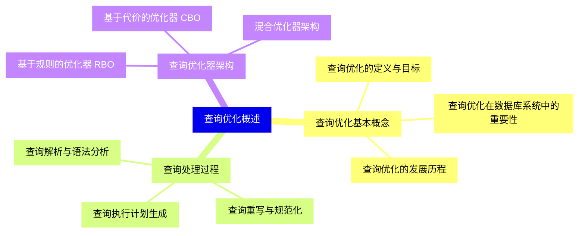

<--->
{}
{}
{}
{}
{}
{}
{}
{}
{}
{}
{}
{}
{}
{}
{}
{}
{}
{}
{}
{}
{}
{}
{}
{}
{}

### 2 关系代数与查询表示{#2}

{}
{}
{}
{}
{}
{}
{}
{}
{}
{}
{}
{}
{}
{}
{}
{}
{}
{}
{}
{}
{}
{}
{}
{}
{}
<--->
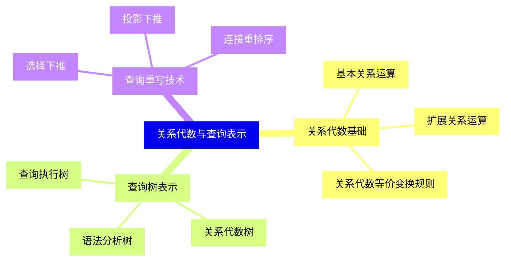

{}

### 3 查询代价模型{#3}

{}
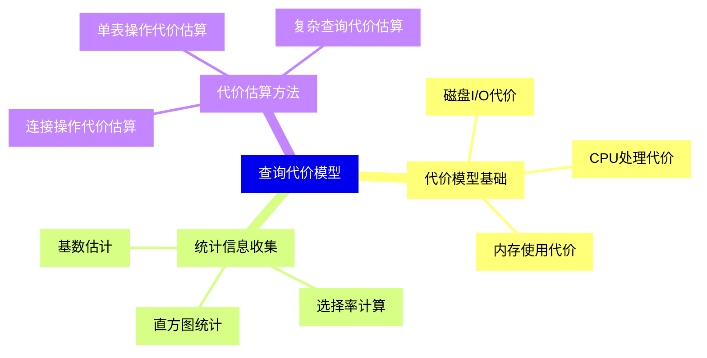

<--->
{}
{}
{}
{}
{}
{}
{}
{}
{}
{}
{}
{}
{}
{}
{}
{}
{}
{}
{}
{}
{}
{}
{}
{}
{}

### 4 物理操作符优化{#4}

{}
{}
{}
{}
{}
{}
{}
{}
{}
{}
{}
{}
{}
{}
{}
{}
{}
{}
{}
{}
{}
{}
{}
{}
{}
<--->
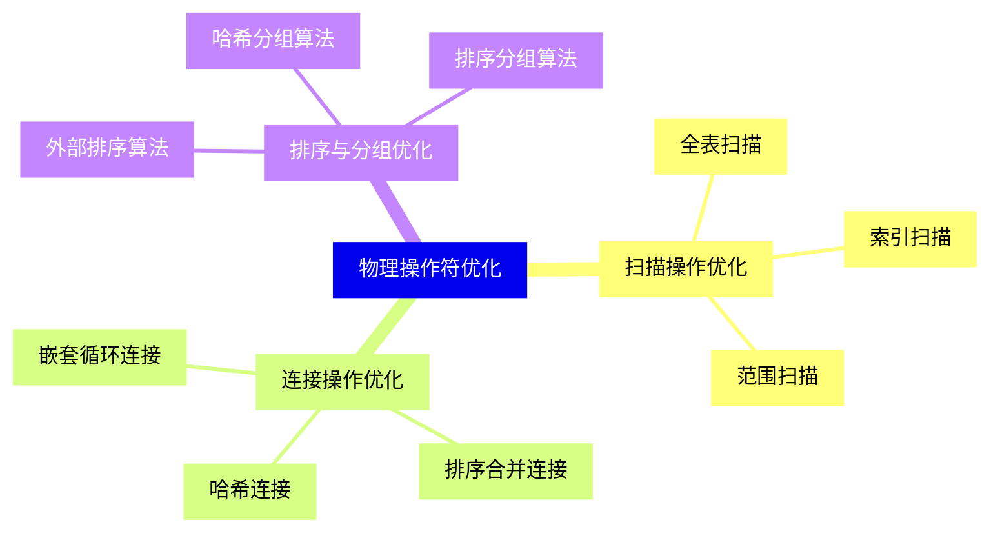

{}

### 5 查询执行计划{#5}

{}
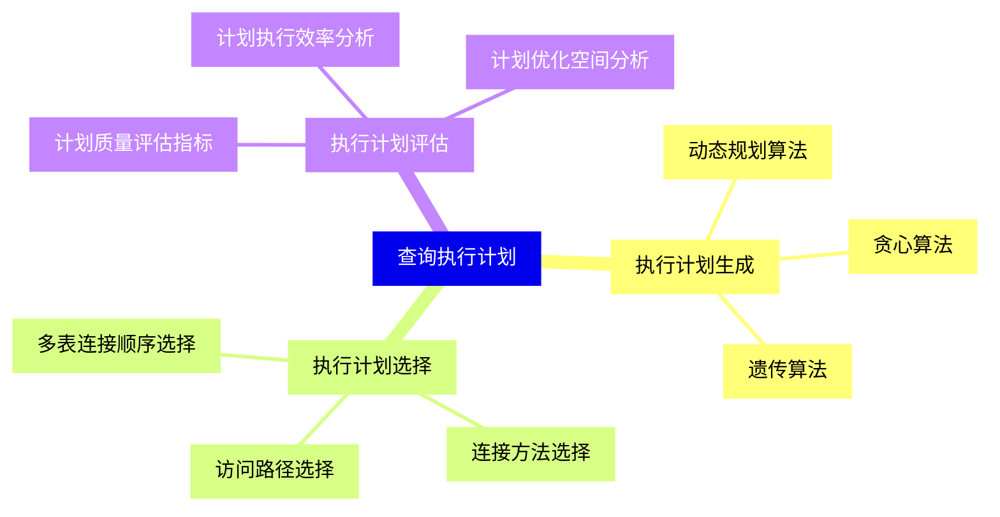

<--->
{}
{}
{}
{}
{}
{}
{}
{}
{}
{}
{}
{}
{}
{}
{}
{}
{}
{}
{}
{}
{}
{}
{}
{}
{}

### 6 索引优化技术{#6}

{}
{}
{}
{}
{}
{}
{}
{}
{}
{}
{}
{}
{}
{}
{}
{}
{}
{}
{}
{}
{}
{}
{}
{}
{}
<--->
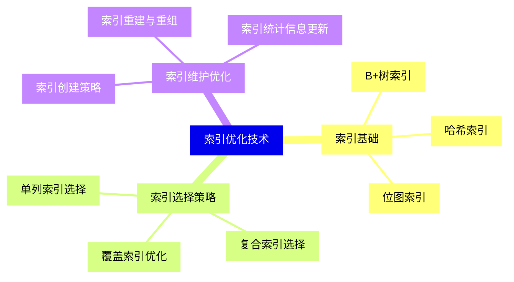

{}

### 7 高级查询优化技术{#7}

{}
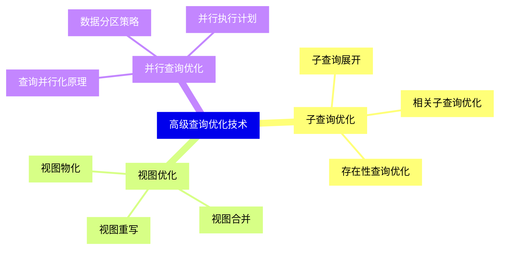

<--->
{}
{}
{}
{}
{}
{}
{}
{}
{}
{}
{}
{}
{}
{}
{}
{}
{}
{}
{}
{}
{}
{}
{}
{}
{}

### 8 分布式查询优化{#8}

{}
{}
{}
{}
{}
{}
{}
{}
{}
{}
{}
{}
{}
{}
{}
{}
{}
{}
{}
{}
{}
{}
{}
{}
{}
<--->
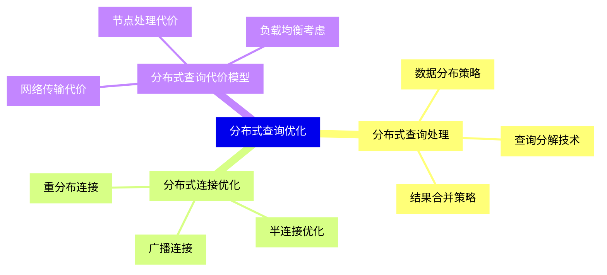

{}

### 9 实时查询优化{#9}

{}
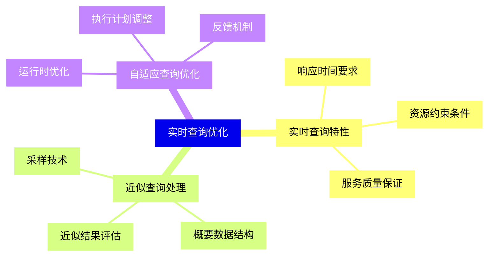

<--->
{}
{}
{}
{}
{}
{}
{}
{}
{}
{}
{}
{}
{}
{}
{}
{}
{}
{}
{}
{}
{}
{}
{}
{}
{}

### 10 优化器实现与调优{#10}

{}
{}
{}
{}
{}
{}
{}
{}
{}
{}
{}
{}
{}
{}
{}
{}
{}
{}
{}
{}
{}
{}
{}
{}
{}
<--->
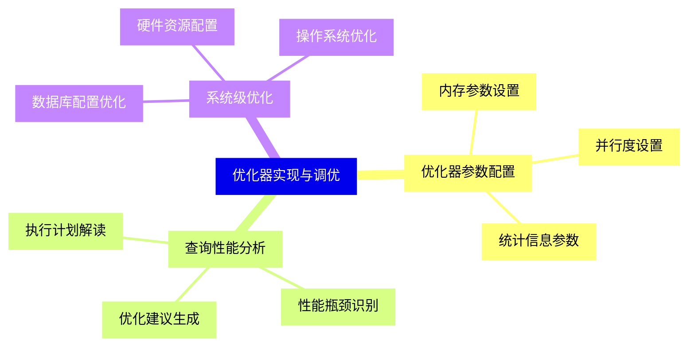

{}

### 11 新兴优化技术{#11}

{}
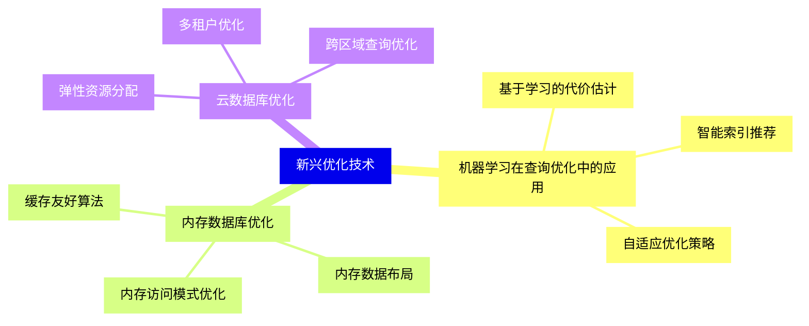

<--->
{}
{}
{}
{}
{}
{}
{}
{}
{}
{}
{}
{}
{}
{}
{}
{}
{}
{}
{}
{}
{}
{}
{}
{}
{}
