
### 1 [查询处理概述](#1)
#### 1.1 [查询处理流程](#1)
#### 1.2 [查询解析与语法分析](#1)
#### 1.3 [查询重写与优化](#1)
#### 1.4 [查询执行与结果返回](#1)
#### 1.5 [查询执行模型](#1)
#### 1.6 [迭代器模型](#1)
#### 1.7 [物化模型](#1)
#### 1.8 [向量化执行模型](#1)
### 2 [基本查询操作算法](#2)
#### 2.1 [选择操作算法](#2)
#### 2.2 [线性扫描算法](#2)
#### 2.3 [分查找算法](#2)
#### 2.4 [基于索引的选择算法](#2)
#### 2.5 [投影操作算法](#2)
#### 2.6 [简单投影算法](#2)
#### 2.7 [重复消除算法](#2)
#### 2.8 [基于排序的投影算法](#2)
#### 2.9 [集合操作算法](#2)
#### 2.10 [并集算法](#2)
#### 2.11 [交集算法](#2)
#### 2.12 [差集算法](#2)
### 3 [连接操作算法](#3)
#### 3.1 [嵌套循环连接](#3)
#### 3.2 [简单嵌套循环连接](#3)
#### 3.3 [块嵌套循环连接](#3)
#### 3.4 [索引嵌套循环连接](#3)
#### 3.5 [排序合并连接](#3)
#### 3.6 [外部排序算法](#3)
#### 3.7 [合并阶段算法](#3)
#### 3.8 [优化策略](#3)
#### 3.9 [哈希连接](#3)
#### 3.10 [简单哈希连接](#3)
#### 3.11 [混合哈希连接](#3)
#### 3.12 [分区哈希连接](#3)
#### 3.13 [其他连接算法](#3)
#### 3.14 [半连接算法](#3)
#### 3.15 [反连接算法](#3)
#### 3.16 [外连接算法](#3)
### 4 [聚合操作算法](#4)
#### 4.1 [标量聚合算法](#4)
#### 4.2 [流式聚合算法](#4)
#### 4.3 [哈希聚合算法](#4)
#### 4.4 [分组聚合算法](#4)
#### 4.5 [排序分组聚合](#4)
#### 4.6 [哈希分组聚合](#4)
#### 4.7 [混合分组聚合](#4)
### 5 [排序与分组算法](#5)
#### 5.1 [外部排序算法](#5)
#### 5.2 [多路归并排序](#5)
#### 5.3 [替换选择排序](#5)
#### 5.4 [优化合并策略](#5)
#### 5.5 [分组算法](#5)
#### 5.6 [基于排序的分组](#5)
#### 5.7 [基于哈希的分组](#5)
#### 5.8 [混合分组方法](#5)
### 6 [查询优化技术](#6)
#### 6.1 [代价估算](#6)
#### 6.2 [选择率估算](#6)
#### 6.3 [连接代价估算](#6)
#### 6.4 [统计信息收集](#6)
#### 6.5 [执行计划选择](#6)
#### 6.6 [动态规划算法](#6)
#### 6.7 [贪心算法](#6)
#### 6.8 [遗传算法应用](#6)
### 7 [并行查询执行](#7)
#### 7.1 [并行架构](#7)
#### 7.2 [共享内存架构](#7)
#### 7.3 [共享磁盘架构](#7)
#### 7.4 [无共享架构](#7)
#### 7.5 [并行算法](#7)
#### 7.6 [并行排序算法](#7)
#### 7.7 [并行连接算法](#7)
#### 7.8 [并行聚合算法](#7)
### 8 [分布式查询执行](#8)
#### 8.1 [数据分布策略](#8)
#### 8.2 [水平分区](#8)
#### 8.3 [垂直分区](#8)
#### 8.4 [混合分区](#8)
#### 8.5 [分布式连接算法](#8)
#### 8.6 [半连接优化](#8)
#### 8.7 [广播连接](#8)
#### 8.8 [重分区连接](#8)
### 9 [内存数据库查询执行](#9)
#### 9.1 [内存优化算法](#9)
#### 9.2 [缓存敏感算法](#9)
#### 9.3 [预取优化技术](#9)
#### 9.4 [向量化执行](#9)
#### 9.5 [列式存储执行](#9)
#### 9.6 [列扫描优化](#9)
#### 9.7 [延迟物化](#9)
#### 9.8 [向量化处理](#9)
### 10 [高级查询执行技术](#10)
#### 10.1 [流水线执行](#10)
#### 10.2 [操作符流水线](#10)
#### 10.3 [数据流执行模型](#10)
#### 10.4 [资源调度策略](#10)
#### 10.5 [自适应查询执行](#10)
#### 10.6 [运行时优化](#10)
#### 10.7 [中间结果物化](#10)
#### 10.8 [执行计划调整](#10)
### 11 [新兴查询执行技术](#11)
#### 11.1 [机器学习优化](#11)
#### 11.2 [基于学习的代价估算](#11)
#### 11.3 [自动调优技术](#11)
#### 11.4 [智能索引选择](#11)
#### 11.5 [硬件加速技术](#11)
#### 11.6 [GPU加速查询](#11)
#### 11.7 [FPGA加速处理](#11)
#### 11.8 [专用查询处理器](#11)




### 1 查询处理概述

---
### 1 查询处理概述
___
#### 1.1 查询处理流程
___
#### 1.2 查询解析与语法分析
___
#### 1.3 查询重写与优化
___
#### 1.4 查询执行与结果返回
___
#### 1.5 查询执行模型
___
#### 1.6 迭代器模型
___
#### 1.7 物化模型
___
#### 1.8 向量化执行模型
### 2 基本查询操作算法

---
### 2 基本查询操作算法
___
#### 2.1 选择操作算法
___
#### 2.2 线性扫描算法
___
#### 2.3 分查找算法
___
#### 2.4 基于索引的选择算法
___
#### 2.5 投影操作算法
___
#### 2.6 简单投影算法
___
#### 2.7 重复消除算法
___
#### 2.8 基于排序的投影算法
___
#### 2.9 集合操作算法
___
#### 2.10 并集算法
___
#### 2.11 交集算法
___
#### 2.12 差集算法
### 3 连接操作算法

---
### 3 连接操作算法
___
#### 3.1 嵌套循环连接
___
#### 3.2 简单嵌套循环连接
___
#### 3.3 块嵌套循环连接
___
#### 3.4 索引嵌套循环连接
___
#### 3.5 排序合并连接
___
#### 3.6 外部排序算法
___
#### 3.7 合并阶段算法
___
#### 3.8 优化策略
___
#### 3.9 哈希连接
___
#### 3.10 简单哈希连接
___
#### 3.11 混合哈希连接
___
#### 3.12 分区哈希连接
___
#### 3.13 其他连接算法
___
#### 3.14 半连接算法
___
#### 3.15 反连接算法
___
#### 3.16 外连接算法
### 4 聚合操作算法

---
### 4 聚合操作算法
___
#### 4.1 标量聚合算法
___
#### 4.2 流式聚合算法
___
#### 4.3 哈希聚合算法
___
#### 4.4 分组聚合算法
___
#### 4.5 排序分组聚合
___
#### 4.6 哈希分组聚合
___
#### 4.7 混合分组聚合
### 5 排序与分组算法

---
### 5 排序与分组算法
___
#### 5.1 外部排序算法
___
#### 5.2 多路归并排序
___
#### 5.3 替换选择排序
___
#### 5.4 优化合并策略
___
#### 5.5 分组算法
___
#### 5.6 基于排序的分组
___
#### 5.7 基于哈希的分组
___
#### 5.8 混合分组方法
### 6 查询优化技术

---
### 6 查询优化技术
___
#### 6.1 代价估算
___
#### 6.2 选择率估算
___
#### 6.3 连接代价估算
___
#### 6.4 统计信息收集
___
#### 6.5 执行计划选择
___
#### 6.6 动态规划算法
___
#### 6.7 贪心算法
___
#### 6.8 遗传算法应用
### 7 并行查询执行

---
### 7 并行查询执行
___
#### 7.1 并行架构
___
#### 7.2 共享内存架构
___
#### 7.3 共享磁盘架构
___
#### 7.4 无共享架构
___
#### 7.5 并行算法
___
#### 7.6 并行排序算法
___
#### 7.7 并行连接算法
___
#### 7.8 并行聚合算法
### 8 分布式查询执行

---
### 8 分布式查询执行
___
#### 8.1 数据分布策略
___
#### 8.2 水平分区
___
#### 8.3 垂直分区
___
#### 8.4 混合分区
___
#### 8.5 分布式连接算法
___
#### 8.6 半连接优化
___
#### 8.7 广播连接
___
#### 8.8 重分区连接
### 9 内存数据库查询执行

---
### 9 内存数据库查询执行
___
#### 9.1 内存优化算法
___
#### 9.2 缓存敏感算法
___
#### 9.3 预取优化技术
___
#### 9.4 向量化执行
___
#### 9.5 列式存储执行
___
#### 9.6 列扫描优化
___
#### 9.7 延迟物化
___
#### 9.8 向量化处理
### 10 高级查询执行技术

---
### 10 高级查询执行技术
___
#### 10.1 流水线执行
___
#### 10.2 操作符流水线
___
#### 10.3 数据流执行模型
___
#### 10.4 资源调度策略
___
#### 10.5 自适应查询执行
___
#### 10.6 运行时优化
___
#### 10.7 中间结果物化
___
#### 10.8 执行计划调整
### 11 新兴查询执行技术

---
### 11 新兴查询执行技术
___
#### 11.1 机器学习优化
___
#### 11.2 基于学习的代价估算
___
#### 11.3 自动调优技术
___
#### 11.4 智能索引选择
___
#### 11.5 硬件加速技术
___
#### 11.6 GPU加速查询
___
#### 11.7 FPGA加速处理
___
#### 11.8 专用查询处理器


### 1 查询处理概述{#1}

{}
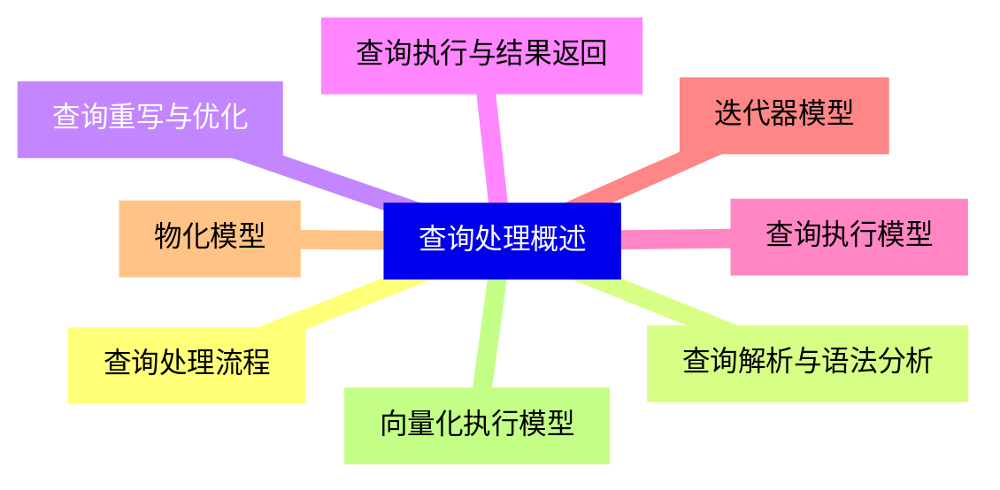

<--->
{}
{}
{}
{}
{}
{}
{}
{}
{}
{}
{}
{}
{}
{}
{}
{}
{}

### 2 基本查询操作算法{#2}

{}
{}
{}
{}
{}
{}
{}
{}
{}
{}
{}
{}
{}
{}
{}
{}
{}
{}
{}
{}
{}
{}
{}
{}
{}
<--->
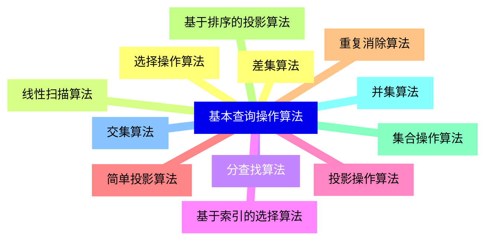

{}

### 3 连接操作算法{#3}

{}
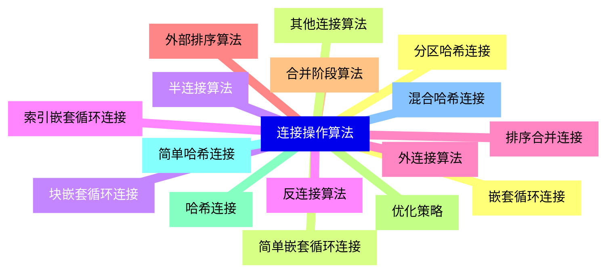

<--->
{}
{}
{}
{}
{}
{}
{}
{}
{}
{}
{}
{}
{}
{}
{}
{}
{}
{}
{}
{}
{}
{}
{}
{}
{}
{}
{}
{}
{}
{}
{}
{}
{}

### 4 聚合操作算法{#4}

{}
{}
{}
{}
{}
{}
{}
{}
{}
{}
{}
{}
{}
{}
{}
<--->
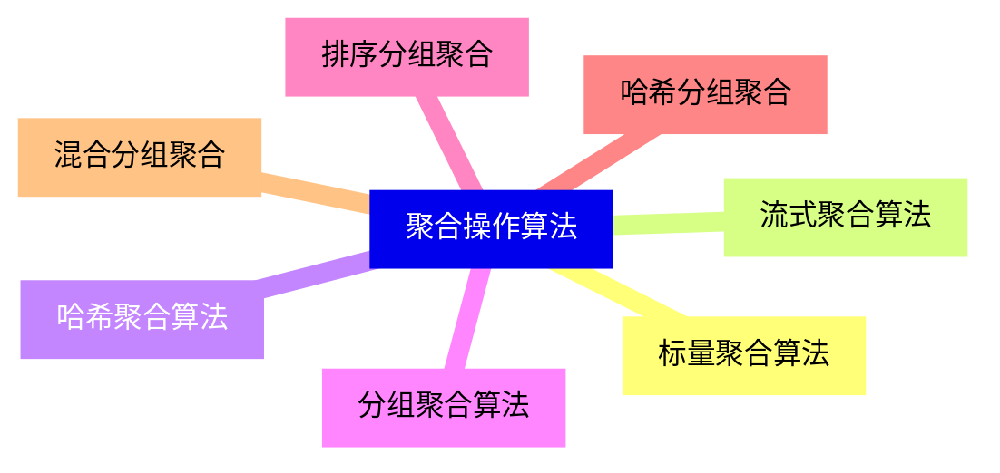

{}

### 5 排序与分组算法{#5}

{}
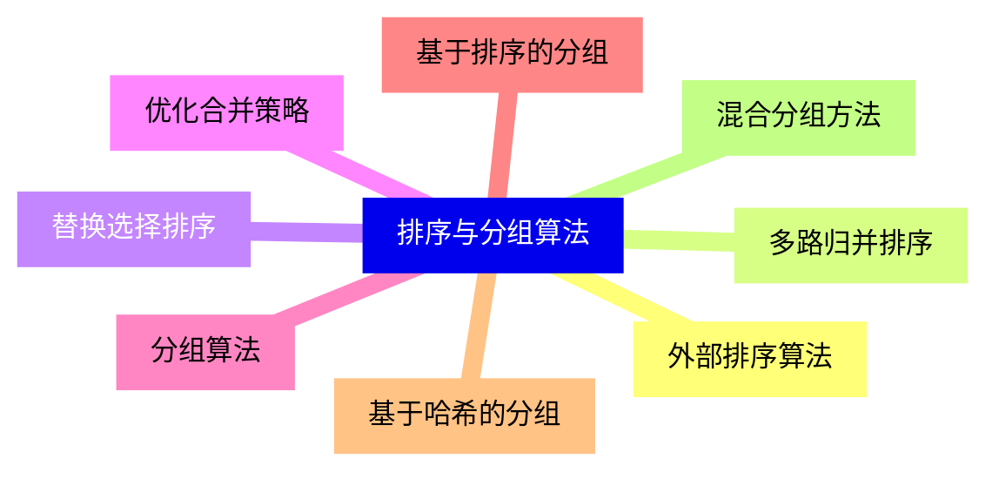

<--->
{}
{}
{}
{}
{}
{}
{}
{}
{}
{}
{}
{}
{}
{}
{}
{}
{}

### 6 查询优化技术{#6}

{}
{}
{}
{}
{}
{}
{}
{}
{}
{}
{}
{}
{}
{}
{}
{}
{}
<--->
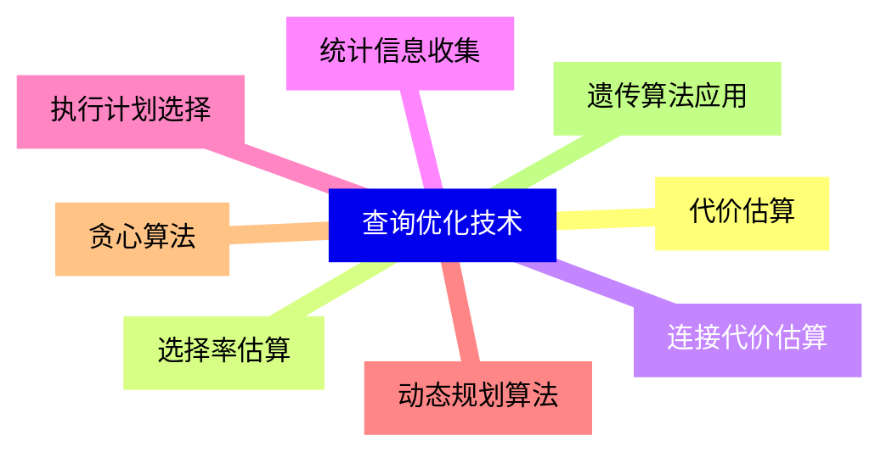

{}

### 7 并行查询执行{#7}

{}
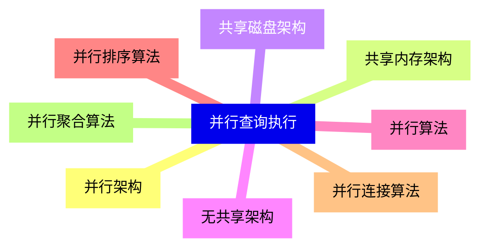

<--->
{}
{}
{}
{}
{}
{}
{}
{}
{}
{}
{}
{}
{}
{}
{}
{}
{}

### 8 分布式查询执行{#8}

{}
{}
{}
{}
{}
{}
{}
{}
{}
{}
{}
{}
{}
{}
{}
{}
{}
<--->
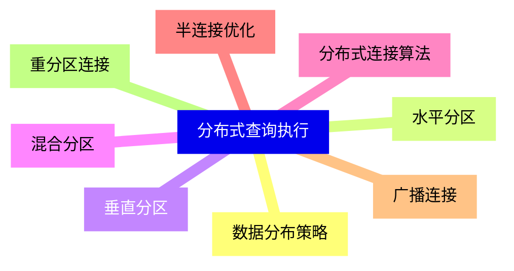

{}

### 9 内存数据库查询执行{#9}

{}
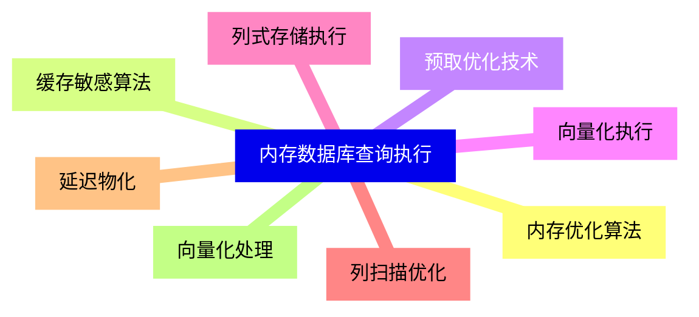

<--->
{}
{}
{}
{}
{}
{}
{}
{}
{}
{}
{}
{}
{}
{}
{}
{}
{}

### 10 高级查询执行技术{#10}

{}
{}
{}
{}
{}
{}
{}
{}
{}
{}
{}
{}
{}
{}
{}
{}
{}
<--->
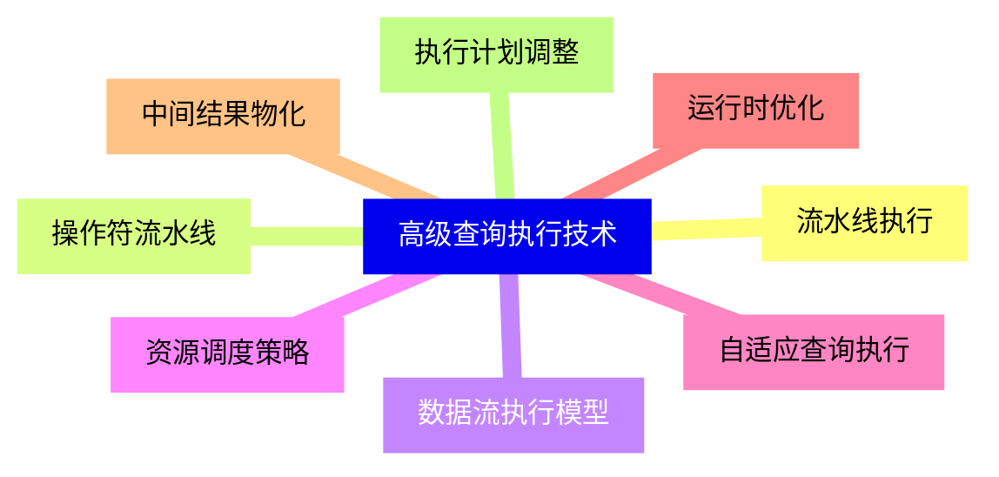

{}

### 11 新兴查询执行技术{#11}

{}
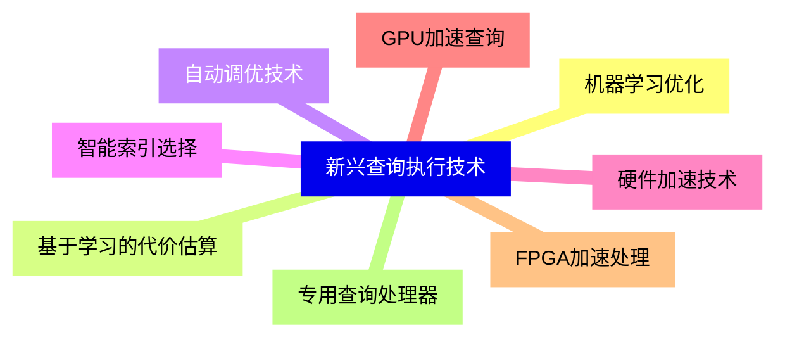

<--->
{}
{}
{}
{}
{}
{}
{}
{}
{}
{}
{}
{}
{}
{}
{}
{}
{}
