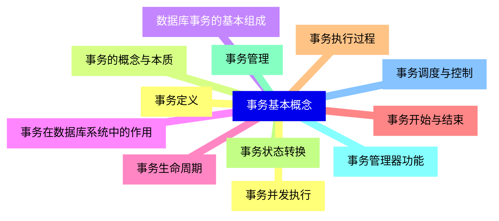
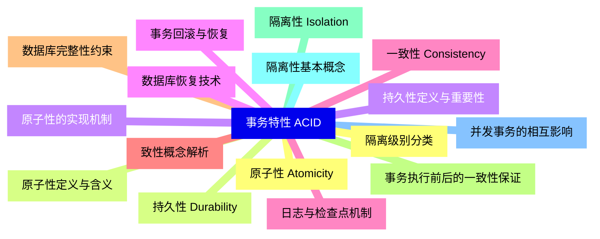
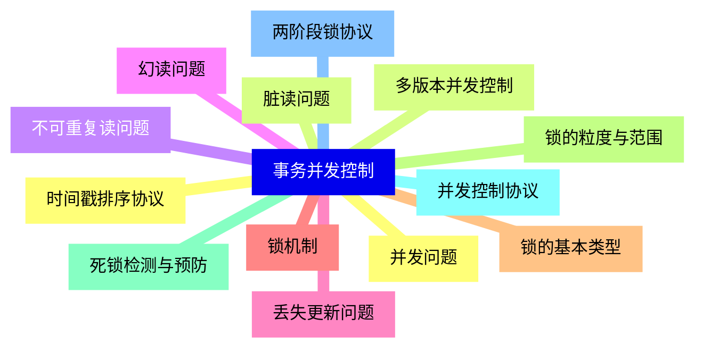
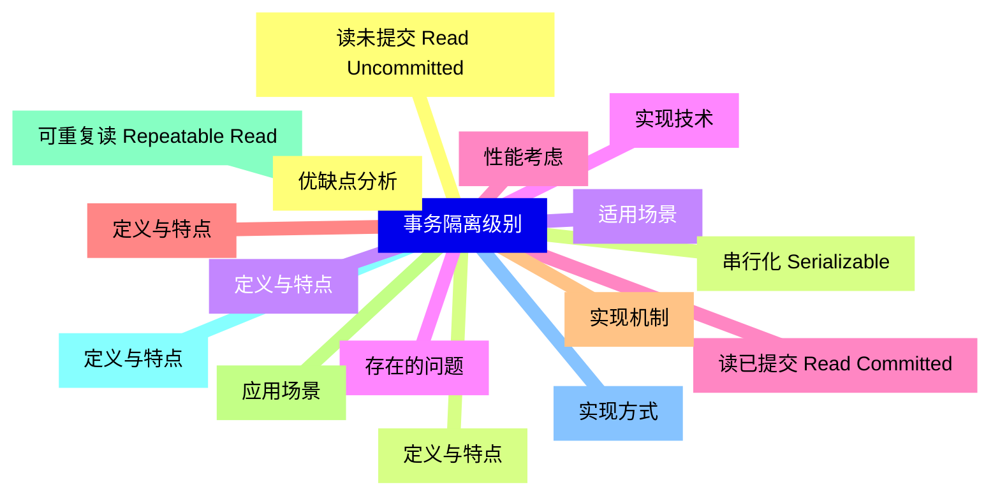
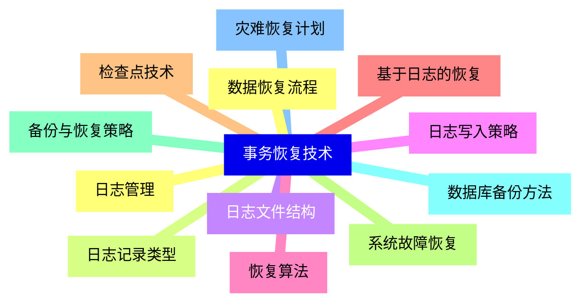
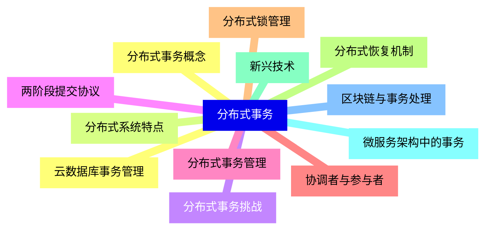
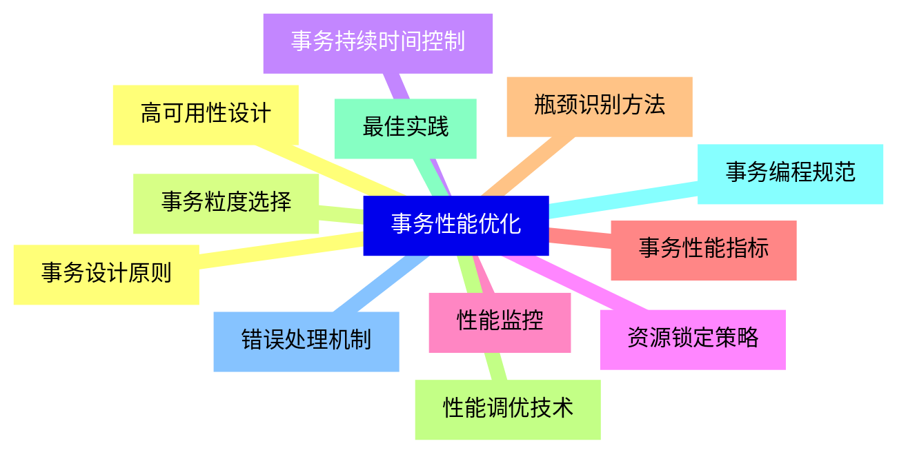


### 1 [事务基本概念](#1)
#### 1.1 [事务定义](#1)
#### 1.2 [事务的概念与本质](#1)
#### 1.3 [数据库事务的基本组成](#1)
#### 1.4 [事务在数据库系统中的作用](#1)
#### 1.5 [事务生命周期](#1)
#### 1.6 [事务开始与结束](#1)
#### 1.7 [事务执行过程](#1)
#### 1.8 [事务状态转换](#1)
#### 1.9 [事务管理](#1)
#### 1.10 [事务管理器功能](#1)
#### 1.11 [事务调度与控制](#1)
#### 1.12 [事务并发执行](#1)
### 2 [事务特性 ACID](#2)
#### 2.1 [原子性 Atomicity](#2)
#### 2.2 [原子性定义与含义](#2)
#### 2.3 [原子性的实现机制](#2)
#### 2.4 [事务回滚与恢复](#2)
#### 2.5 [一致性 Consistency](#2)
#### 2.6 [致性概念解析](#2)
#### 2.7 [数据库完整性约束](#2)
#### 2.8 [事务执行前后的一致性保证](#2)
#### 2.9 [隔离性 Isolation](#2)
#### 2.10 [隔离性基本概念](#2)
#### 2.11 [并发事务的相互影响](#2)
#### 2.12 [隔离级别分类](#2)
#### 2.13 [持久性 Durability](#2)
#### 2.14 [持久性定义与重要性](#2)
#### 2.15 [数据库恢复技术](#2)
#### 2.16 [日志与检查点机制](#2)
### 3 [事务并发控制](#3)
#### 3.1 [并发问题](#3)
#### 3.2 [脏读问题](#3)
#### 3.3 [不可重复读问题](#3)
#### 3.4 [幻读问题](#3)
#### 3.5 [丢失更新问题](#3)
#### 3.6 [锁机制](#3)
#### 3.7 [锁的基本类型](#3)
#### 3.8 [锁的粒度与范围](#3)
#### 3.9 [死锁检测与预防](#3)
#### 3.10 [并发控制协议](#3)
#### 3.11 [两阶段锁协议](#3)
#### 3.12 [时间戳排序协议](#3)
#### 3.13 [多版本并发控制](#3)
### 4 [事务隔离级别](#4)
#### 4.1 [读未提交 Read Uncommitted](#4)
#### 4.2 [定义与特点](#4)
#### 4.3 [适用场景](#4)
#### 4.4 [存在的问题](#4)
#### 4.5 [读已提交 Read Committed](#4)
#### 4.6 [定义与特点](#4)
#### 4.7 [实现机制](#4)
#### 4.8 [应用场景](#4)
#### 4.9 [可重复读 Repeatable Read](#4)
#### 4.10 [定义与特点](#4)
#### 4.11 [实现方式](#4)
#### 4.12 [优缺点分析](#4)
#### 4.13 [串行化 Serializable](#4)
#### 4.14 [定义与特点](#4)
#### 4.15 [实现技术](#4)
#### 4.16 [性能考虑](#4)
### 5 [事务恢复技术](#5)
#### 5.1 [日志管理](#5)
#### 5.2 [日志记录类型](#5)
#### 5.3 [日志文件结构](#5)
#### 5.4 [日志写入策略](#5)
#### 5.5 [恢复算法](#5)
#### 5.6 [基于日志的恢复](#5)
#### 5.7 [检查点技术](#5)
#### 5.8 [系统故障恢复](#5)
#### 5.9 [备份与恢复策略](#5)
#### 5.10 [数据库备份方法](#5)
#### 5.11 [灾难恢复计划](#5)
#### 5.12 [数据恢复流程](#5)
### 6 [分布式事务](#6)
#### 6.1 [分布式事务概念](#6)
#### 6.2 [分布式系统特点](#6)
#### 6.3 [分布式事务挑战](#6)
#### 6.4 [两阶段提交协议](#6)
#### 6.5 [分布式事务管理](#6)
#### 6.6 [协调者与参与者](#6)
#### 6.7 [分布式锁管理](#6)
#### 6.8 [分布式恢复机制](#6)
#### 6.9 [新兴技术](#6)
#### 6.10 [微服务架构中的事务](#6)
#### 6.11 [区块链与事务处理](#6)
#### 6.12 [云数据库事务管理](#6)
### 7 [事务性能优化](#7)
#### 7.1 [事务设计原则](#7)
#### 7.2 [事务粒度选择](#7)
#### 7.3 [事务持续时间控制](#7)
#### 7.4 [资源锁定策略](#7)
#### 7.5 [性能监控](#7)
#### 7.6 [事务性能指标](#7)
#### 7.7 [瓶颈识别方法](#7)
#### 7.8 [性能调优技术](#7)
#### 7.9 [最佳实践](#7)
#### 7.10 [事务编程规范](#7)
#### 7.11 [错误处理机制](#7)
#### 7.12 [高可用性设计](#7)




### 1 事务基本概念

---
### 1 事务基本概念
___
#### 1.1 事务定义
___
#### 1.2 事务的概念与本质
___
#### 1.3 数据库事务的基本组成
___
#### 1.4 事务在数据库系统中的作用
___
#### 1.5 事务生命周期
___
#### 1.6 事务开始与结束
___
#### 1.7 事务执行过程
___
#### 1.8 事务状态转换
___
#### 1.9 事务管理
___
#### 1.10 事务管理器功能
___
#### 1.11 事务调度与控制
___
#### 1.12 事务并发执行
### 2 事务特性 ACID

---
### 2 事务特性 ACID
___
#### 2.1 原子性 Atomicity
___
#### 2.2 原子性定义与含义
___
#### 2.3 原子性的实现机制
___
#### 2.4 事务回滚与恢复
___
#### 2.5 一致性 Consistency
___
#### 2.6 致性概念解析
___
#### 2.7 数据库完整性约束
___
#### 2.8 事务执行前后的一致性保证
___
#### 2.9 隔离性 Isolation
___
#### 2.10 隔离性基本概念
___
#### 2.11 并发事务的相互影响
___
#### 2.12 隔离级别分类
___
#### 2.13 持久性 Durability
___
#### 2.14 持久性定义与重要性
___
#### 2.15 数据库恢复技术
___
#### 2.16 日志与检查点机制
### 3 事务并发控制

---
### 3 事务并发控制
___
#### 3.1 并发问题
___
#### 3.2 脏读问题
___
#### 3.3 不可重复读问题
___
#### 3.4 幻读问题
___
#### 3.5 丢失更新问题
___
#### 3.6 锁机制
___
#### 3.7 锁的基本类型
___
#### 3.8 锁的粒度与范围
___
#### 3.9 死锁检测与预防
___
#### 3.10 并发控制协议
___
#### 3.11 两阶段锁协议
___
#### 3.12 时间戳排序协议
___
#### 3.13 多版本并发控制
### 4 事务隔离级别

---
### 4 事务隔离级别
___
#### 4.1 读未提交 Read Uncommitted
___
#### 4.2 定义与特点
___
#### 4.3 适用场景
___
#### 4.4 存在的问题
___
#### 4.5 读已提交 Read Committed
___
#### 4.6 定义与特点
___
#### 4.7 实现机制
___
#### 4.8 应用场景
___
#### 4.9 可重复读 Repeatable Read
___
#### 4.10 定义与特点
___
#### 4.11 实现方式
___
#### 4.12 优缺点分析
___
#### 4.13 串行化 Serializable
___
#### 4.14 定义与特点
___
#### 4.15 实现技术
___
#### 4.16 性能考虑
### 5 事务恢复技术

---
### 5 事务恢复技术
___
#### 5.1 日志管理
___
#### 5.2 日志记录类型
___
#### 5.3 日志文件结构
___
#### 5.4 日志写入策略
___
#### 5.5 恢复算法
___
#### 5.6 基于日志的恢复
___
#### 5.7 检查点技术
___
#### 5.8 系统故障恢复
___
#### 5.9 备份与恢复策略
___
#### 5.10 数据库备份方法
___
#### 5.11 灾难恢复计划
___
#### 5.12 数据恢复流程
### 6 分布式事务

---
### 6 分布式事务
___
#### 6.1 分布式事务概念
___
#### 6.2 分布式系统特点
___
#### 6.3 分布式事务挑战
___
#### 6.4 两阶段提交协议
___
#### 6.5 分布式事务管理
___
#### 6.6 协调者与参与者
___
#### 6.7 分布式锁管理
___
#### 6.8 分布式恢复机制
___
#### 6.9 新兴技术
___
#### 6.10 微服务架构中的事务
___
#### 6.11 区块链与事务处理
___
#### 6.12 云数据库事务管理
### 7 事务性能优化

---
### 7 事务性能优化
___
#### 7.1 事务设计原则
___
#### 7.2 事务粒度选择
___
#### 7.3 事务持续时间控制
___
#### 7.4 资源锁定策略
___
#### 7.5 性能监控
___
#### 7.6 事务性能指标
___
#### 7.7 瓶颈识别方法
___
#### 7.8 性能调优技术
___
#### 7.9 最佳实践
___
#### 7.10 事务编程规范
___
#### 7.11 错误处理机制
___
#### 7.12 高可用性设计


### 1 事务基本概念{#1}

{}

<--->
{}
{}
{}
{}
{}
{}
{}
{}
{}
{}
{}
{}
{}
{}
{}
{}
{}
{}
{}
{}
{}
{}
{}
{}
{}

### 2 事务特性 ACID{#2}

{}
{}
{}
{}
{}
{}
{}
{}
{}
{}
{}
{}
{}
{}
{}
{}
{}
{}
{}
{}
{}
{}
{}
{}
{}
{}
{}
{}
{}
{}
{}
{}
{}
<--->

{}

### 3 事务并发控制{#3}

{}

<--->
{}
{}
{}
{}
{}
{}
{}
{}
{}
{}
{}
{}
{}
{}
{}
{}
{}
{}
{}
{}
{}
{}
{}
{}
{}
{}
{}

### 4 事务隔离级别{#4}

{}
{}
{}
{}
{}
{}
{}
{}
{}
{}
{}
{}
{}
{}
{}
{}
{}
{}
{}
{}
{}
{}
{}
{}
{}
{}
{}
{}
{}
{}
{}
{}
{}
<--->

{}

### 5 事务恢复技术{#5}

{}

<--->
{}
{}
{}
{}
{}
{}
{}
{}
{}
{}
{}
{}
{}
{}
{}
{}
{}
{}
{}
{}
{}
{}
{}
{}
{}

### 6 分布式事务{#6}

{}
{}
{}
{}
{}
{}
{}
{}
{}
{}
{}
{}
{}
{}
{}
{}
{}
{}
{}
{}
{}
{}
{}
{}
{}
<--->

{}

### 7 事务性能优化{#7}

{}

<--->
{}
{}
{}
{}
{}
{}
{}
{}
{}
{}
{}
{}
{}
{}
{}
{}
{}
{}
{}
{}
{}
{}
{}
{}
{}
