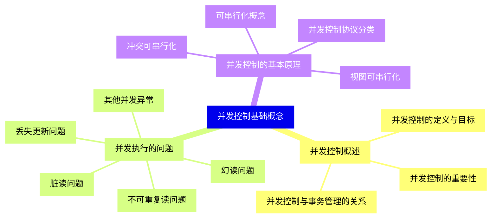
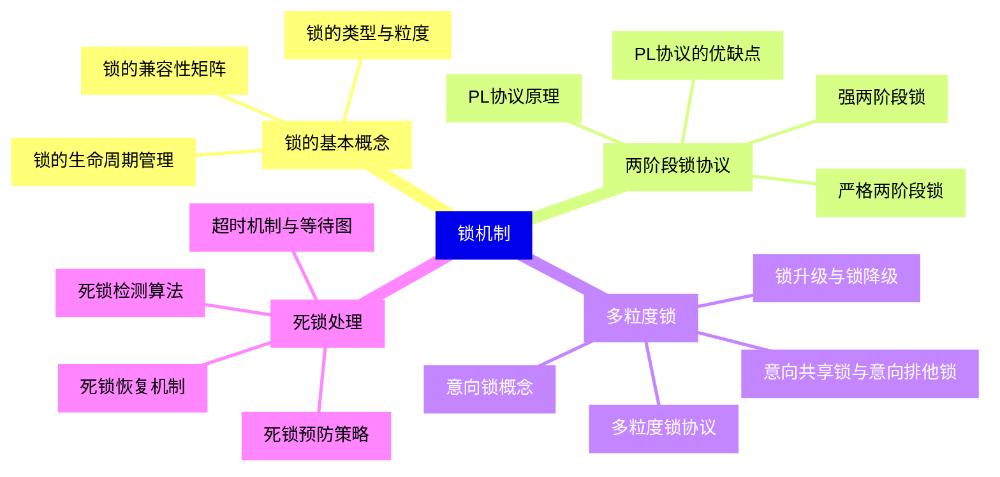
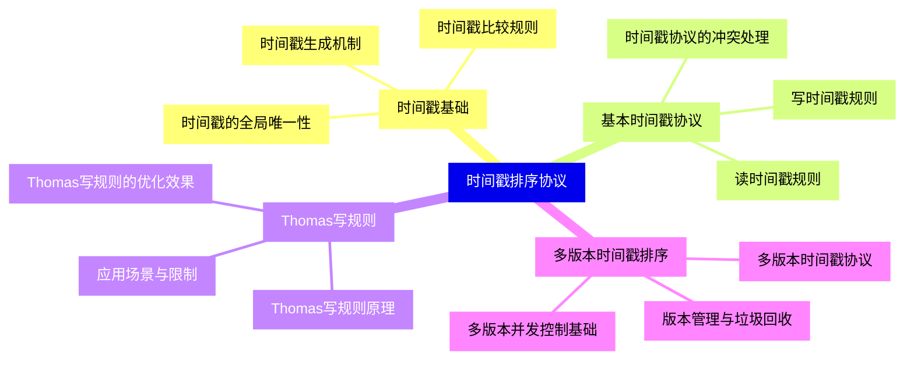
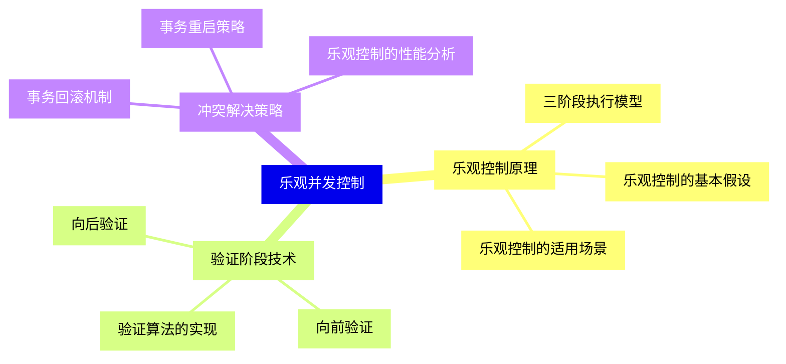
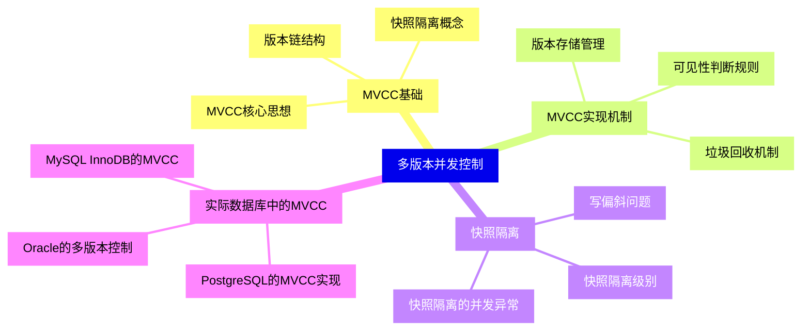
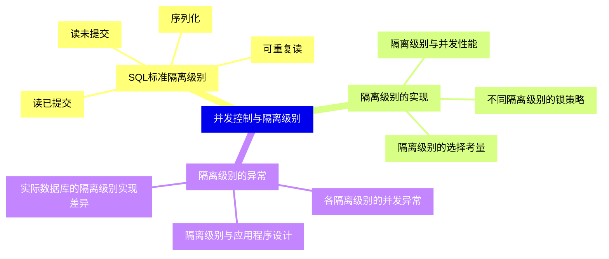
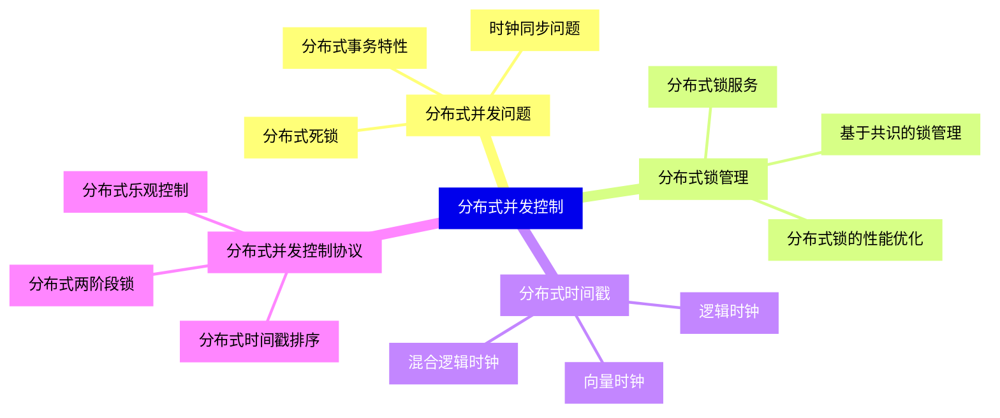
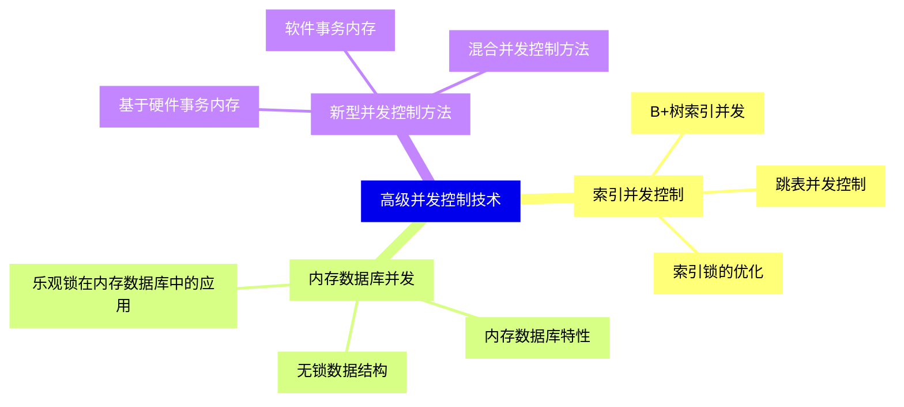
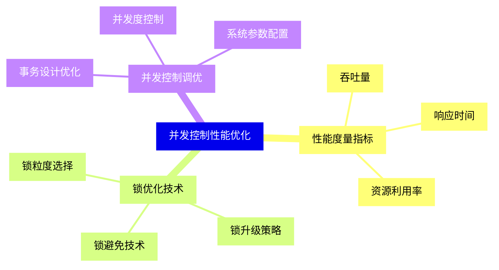
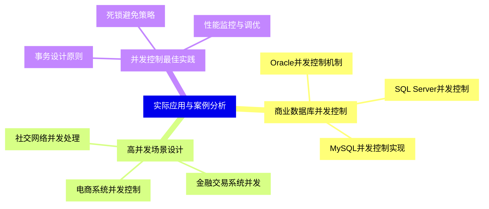


### 1 [并发控制基础概念](#1)
#### 1.1 [并发控制概述](#1)
##### 1.1.1 [并发控制的定义与目标](#1)
##### 1.1.2 [并发控制的重要性](#1)
##### 1.1.3 [并发控制与事务管理的关系](#1)
#### 1.2 [并发执行的问题](#1)
##### 1.2.1 [丢失更新问题](#1)
##### 1.2.2 [脏读问题](#1)
##### 1.2.3 [不可重复读问题](#1)
##### 1.2.4 [幻读问题](#1)
##### 1.2.5 [其他并发异常](#1)
#### 1.3 [并发控制的基本原理](#1)
##### 1.3.1 [可串行化概念](#1)
##### 1.3.2 [冲突可串行化](#1)
##### 1.3.3 [视图可串行化](#1)
##### 1.3.4 [并发控制协议分类](#1)
### 2 [锁机制](#2)
#### 2.1 [锁的基本概念](#2)
##### 2.1.1 [锁的类型与粒度](#2)
##### 2.1.2 [锁的兼容性矩阵](#2)
##### 2.1.3 [锁的生命周期管理](#2)
#### 2.2 [两阶段锁协议](#2)
##### 2.2.1 [PL协议原理](#2)
##### 2.2.2 [严格两阶段锁](#2)
##### 2.2.3 [强两阶段锁](#2)
##### 2.2.4 [PL协议的优缺点](#2)
#### 2.3 [多粒度锁](#2)
##### 2.3.1 [意向锁概念](#2)
##### 2.3.2 [意向共享锁与意向排他锁](#2)
##### 2.3.3 [多粒度锁协议](#2)
##### 2.3.4 [锁升级与锁降级](#2)
#### 2.4 [死锁处理](#2)
##### 2.4.1 [死锁预防策略](#2)
##### 2.4.2 [死锁检测算法](#2)
##### 2.4.3 [死锁恢复机制](#2)
##### 2.4.4 [超时机制与等待图](#2)
### 3 [时间戳排序协议](#3)
#### 3.1 [时间戳基础](#3)
##### 3.1.1 [时间戳生成机制](#3)
##### 3.1.2 [时间戳比较规则](#3)
##### 3.1.3 [时间戳的全局唯一性](#3)
#### 3.2 [基本时间戳协议](#3)
##### 3.2.1 [读时间戳规则](#3)
##### 3.2.2 [写时间戳规则](#3)
##### 3.2.3 [时间戳协议的冲突处理](#3)
#### 3.3 [Thomas写规则](#3)
##### 3.3.1 [Thomas写规则原理](#3)
##### 3.3.2 [Thomas写规则的优化效果](#3)
##### 3.3.3 [应用场景与限制](#3)
#### 3.4 [多版本时间戳排序](#3)
##### 3.4.1 [多版本并发控制基础](#3)
##### 3.4.2 [多版本时间戳协议](#3)
##### 3.4.3 [版本管理与垃圾回收](#3)
### 4 [乐观并发控制](#4)
#### 4.1 [乐观控制原理](#4)
##### 4.1.1 [乐观控制的基本假设](#4)
##### 4.1.2 [三阶段执行模型](#4)
##### 4.1.3 [乐观控制的适用场景](#4)
#### 4.2 [验证阶段技术](#4)
##### 4.2.1 [向后验证](#4)
##### 4.2.2 [向前验证](#4)
##### 4.2.3 [验证算法的实现](#4)
#### 4.3 [冲突解决策略](#4)
##### 4.3.1 [事务回滚机制](#4)
##### 4.3.2 [事务重启策略](#4)
##### 4.3.3 [乐观控制的性能分析](#4)
### 5 [多版本并发控制](#5)
#### 5.1 [MVCC基础](#5)
##### 5.1.1 [MVCC核心思想](#5)
##### 5.1.2 [版本链结构](#5)
##### 5.1.3 [快照隔离概念](#5)
#### 5.2 [MVCC实现机制](#5)
##### 5.2.1 [版本存储管理](#5)
##### 5.2.2 [可见性判断规则](#5)
##### 5.2.3 [垃圾回收机制](#5)
#### 5.3 [快照隔离](#5)
##### 5.3.1 [快照隔离级别](#5)
##### 5.3.2 [写偏斜问题](#5)
##### 5.3.3 [快照隔离的并发异常](#5)
#### 5.4 [实际数据库中的MVCC](#5)
##### 5.4.1 [PostgreSQL的MVCC实现](#5)
##### 5.4.2 [MySQL InnoDB的MVCC](#5)
##### 5.4.3 [Oracle的多版本控制](#5)
### 6 [并发控制与隔离级别](#6)
#### 6.1 [SQL标准隔离级别](#6)
##### 6.1.1 [读未提交](#6)
##### 6.1.2 [读已提交](#6)
##### 6.1.3 [可重复读](#6)
##### 6.1.4 [序列化](#6)
#### 6.2 [隔离级别的实现](#6)
##### 6.2.1 [不同隔离级别的锁策略](#6)
##### 6.2.2 [隔离级别与并发性能](#6)
##### 6.2.3 [隔离级别的选择考量](#6)
#### 6.3 [隔离级别的异常](#6)
##### 6.3.1 [各隔离级别的并发异常](#6)
##### 6.3.2 [隔离级别与应用程序设计](#6)
##### 6.3.3 [实际数据库的隔离级别实现差异](#6)
### 7 [分布式并发控制](#7)
#### 7.1 [分布式并发问题](#7)
##### 7.1.1 [分布式事务特性](#7)
##### 7.1.2 [分布式死锁](#7)
##### 7.1.3 [时钟同步问题](#7)
#### 7.2 [分布式锁管理](#7)
##### 7.2.1 [分布式锁服务](#7)
##### 7.2.2 [基于共识的锁管理](#7)
##### 7.2.3 [分布式锁的性能优化](#7)
#### 7.3 [分布式时间戳](#7)
##### 7.3.1 [逻辑时钟](#7)
##### 7.3.2 [向量时钟](#7)
##### 7.3.3 [混合逻辑时钟](#7)
#### 7.4 [分布式并发控制协议](#7)
##### 7.4.1 [分布式两阶段锁](#7)
##### 7.4.2 [分布式时间戳排序](#7)
##### 7.4.3 [分布式乐观控制](#7)
### 8 [高级并发控制技术](#8)
#### 8.1 [索引并发控制](#8)
##### 8.1.1 [B+树索引并发](#8)
##### 8.1.2 [跳表并发控制](#8)
##### 8.1.3 [索引锁的优化](#8)
#### 8.2 [内存数据库并发](#8)
##### 8.2.1 [内存数据库特性](#8)
##### 8.2.2 [无锁数据结构](#8)
##### 8.2.3 [乐观锁在内存数据库中的应用](#8)
#### 8.3 [新型并发控制方法](#8)
##### 8.3.1 [基于硬件事务内存](#8)
##### 8.3.2 [软件事务内存](#8)
##### 8.3.3 [混合并发控制方法](#8)
### 9 [并发控制性能优化](#9)
#### 9.1 [性能度量指标](#9)
##### 9.1.1 [吞吐量](#9)
##### 9.1.2 [响应时间](#9)
##### 9.1.3 [资源利用率](#9)
#### 9.2 [锁优化技术](#9)
##### 9.2.1 [锁粒度选择](#9)
##### 9.2.2 [锁升级策略](#9)
##### 9.2.3 [锁避免技术](#9)
#### 9.3 [并发控制调优](#9)
##### 9.3.1 [事务设计优化](#9)
##### 9.3.2 [并发度控制](#9)
##### 9.3.3 [系统参数配置](#9)
### 10 [实际应用与案例分析](#10)
#### 10.1 [商业数据库并发控制](#10)
##### 10.1.1 [Oracle并发控制机制](#10)
##### 10.1.2 [SQL Server并发控制](#10)
##### 10.1.3 [MySQL并发控制实现](#10)
#### 10.2 [高并发场景设计](#10)
##### 10.2.1 [电商系统并发控制](#10)
##### 10.2.2 [金融交易系统并发](#10)
##### 10.2.3 [社交网络并发处理](#10)
#### 10.3 [并发控制最佳实践](#10)
##### 10.3.1 [事务设计原则](#10)
##### 10.3.2 [死锁避免策略](#10)
##### 10.3.3 [性能监控与调优](#10)




### 1 并发控制基础概念

---
### 1 并发控制基础概念
___
#### 1.1 并发控制概述
___
##### 1.1.1 并发控制的定义与目标
___
##### 1.1.2 并发控制的重要性
___
##### 1.1.3 并发控制与事务管理的关系
___
#### 1.2 并发执行的问题
___
##### 1.2.1 丢失更新问题
___
##### 1.2.2 脏读问题
___
##### 1.2.3 不可重复读问题
___
##### 1.2.4 幻读问题
___
##### 1.2.5 其他并发异常
___
#### 1.3 并发控制的基本原理
___
##### 1.3.1 可串行化概念
___
##### 1.3.2 冲突可串行化
___
##### 1.3.3 视图可串行化
___
##### 1.3.4 并发控制协议分类
### 2 锁机制

---
### 2 锁机制
___
#### 2.1 锁的基本概念
___
##### 2.1.1 锁的类型与粒度
___
##### 2.1.2 锁的兼容性矩阵
___
##### 2.1.3 锁的生命周期管理
___
#### 2.2 两阶段锁协议
___
##### 2.2.1 PL协议原理
___
##### 2.2.2 严格两阶段锁
___
##### 2.2.3 强两阶段锁
___
##### 2.2.4 PL协议的优缺点
___
#### 2.3 多粒度锁
___
##### 2.3.1 意向锁概念
___
##### 2.3.2 意向共享锁与意向排他锁
___
##### 2.3.3 多粒度锁协议
___
##### 2.3.4 锁升级与锁降级
___
#### 2.4 死锁处理
___
##### 2.4.1 死锁预防策略
___
##### 2.4.2 死锁检测算法
___
##### 2.4.3 死锁恢复机制
___
##### 2.4.4 超时机制与等待图
### 3 时间戳排序协议

---
### 3 时间戳排序协议
___
#### 3.1 时间戳基础
___
##### 3.1.1 时间戳生成机制
___
##### 3.1.2 时间戳比较规则
___
##### 3.1.3 时间戳的全局唯一性
___
#### 3.2 基本时间戳协议
___
##### 3.2.1 读时间戳规则
___
##### 3.2.2 写时间戳规则
___
##### 3.2.3 时间戳协议的冲突处理
___
#### 3.3 Thomas写规则
___
##### 3.3.1 Thomas写规则原理
___
##### 3.3.2 Thomas写规则的优化效果
___
##### 3.3.3 应用场景与限制
___
#### 3.4 多版本时间戳排序
___
##### 3.4.1 多版本并发控制基础
___
##### 3.4.2 多版本时间戳协议
___
##### 3.4.3 版本管理与垃圾回收
### 4 乐观并发控制

---
### 4 乐观并发控制
___
#### 4.1 乐观控制原理
___
##### 4.1.1 乐观控制的基本假设
___
##### 4.1.2 三阶段执行模型
___
##### 4.1.3 乐观控制的适用场景
___
#### 4.2 验证阶段技术
___
##### 4.2.1 向后验证
___
##### 4.2.2 向前验证
___
##### 4.2.3 验证算法的实现
___
#### 4.3 冲突解决策略
___
##### 4.3.1 事务回滚机制
___
##### 4.3.2 事务重启策略
___
##### 4.3.3 乐观控制的性能分析
### 5 多版本并发控制

---
### 5 多版本并发控制
___
#### 5.1 MVCC基础
___
##### 5.1.1 MVCC核心思想
___
##### 5.1.2 版本链结构
___
##### 5.1.3 快照隔离概念
___
#### 5.2 MVCC实现机制
___
##### 5.2.1 版本存储管理
___
##### 5.2.2 可见性判断规则
___
##### 5.2.3 垃圾回收机制
___
#### 5.3 快照隔离
___
##### 5.3.1 快照隔离级别
___
##### 5.3.2 写偏斜问题
___
##### 5.3.3 快照隔离的并发异常
___
#### 5.4 实际数据库中的MVCC
___
##### 5.4.1 PostgreSQL的MVCC实现
___
##### 5.4.2 MySQL InnoDB的MVCC
___
##### 5.4.3 Oracle的多版本控制
### 6 并发控制与隔离级别

---
### 6 并发控制与隔离级别
___
#### 6.1 SQL标准隔离级别
___
##### 6.1.1 读未提交
___
##### 6.1.2 读已提交
___
##### 6.1.3 可重复读
___
##### 6.1.4 序列化
___
#### 6.2 隔离级别的实现
___
##### 6.2.1 不同隔离级别的锁策略
___
##### 6.2.2 隔离级别与并发性能
___
##### 6.2.3 隔离级别的选择考量
___
#### 6.3 隔离级别的异常
___
##### 6.3.1 各隔离级别的并发异常
___
##### 6.3.2 隔离级别与应用程序设计
___
##### 6.3.3 实际数据库的隔离级别实现差异
### 7 分布式并发控制

---
### 7 分布式并发控制
___
#### 7.1 分布式并发问题
___
##### 7.1.1 分布式事务特性
___
##### 7.1.2 分布式死锁
___
##### 7.1.3 时钟同步问题
___
#### 7.2 分布式锁管理
___
##### 7.2.1 分布式锁服务
___
##### 7.2.2 基于共识的锁管理
___
##### 7.2.3 分布式锁的性能优化
___
#### 7.3 分布式时间戳
___
##### 7.3.1 逻辑时钟
___
##### 7.3.2 向量时钟
___
##### 7.3.3 混合逻辑时钟
___
#### 7.4 分布式并发控制协议
___
##### 7.4.1 分布式两阶段锁
___
##### 7.4.2 分布式时间戳排序
___
##### 7.4.3 分布式乐观控制
### 8 高级并发控制技术

---
### 8 高级并发控制技术
___
#### 8.1 索引并发控制
___
##### 8.1.1 B+树索引并发
___
##### 8.1.2 跳表并发控制
___
##### 8.1.3 索引锁的优化
___
#### 8.2 内存数据库并发
___
##### 8.2.1 内存数据库特性
___
##### 8.2.2 无锁数据结构
___
##### 8.2.3 乐观锁在内存数据库中的应用
___
#### 8.3 新型并发控制方法
___
##### 8.3.1 基于硬件事务内存
___
##### 8.3.2 软件事务内存
___
##### 8.3.3 混合并发控制方法
### 9 并发控制性能优化

---
### 9 并发控制性能优化
___
#### 9.1 性能度量指标
___
##### 9.1.1 吞吐量
___
##### 9.1.2 响应时间
___
##### 9.1.3 资源利用率
___
#### 9.2 锁优化技术
___
##### 9.2.1 锁粒度选择
___
##### 9.2.2 锁升级策略
___
##### 9.2.3 锁避免技术
___
#### 9.3 并发控制调优
___
##### 9.3.1 事务设计优化
___
##### 9.3.2 并发度控制
___
##### 9.3.3 系统参数配置
### 10 实际应用与案例分析

---
### 10 实际应用与案例分析
___
#### 10.1 商业数据库并发控制
___
##### 10.1.1 Oracle并发控制机制
___
##### 10.1.2 SQL Server并发控制
___
##### 10.1.3 MySQL并发控制实现
___
#### 10.2 高并发场景设计
___
##### 10.2.1 电商系统并发控制
___
##### 10.2.2 金融交易系统并发
___
##### 10.2.3 社交网络并发处理
___
#### 10.3 并发控制最佳实践
___
##### 10.3.1 事务设计原则
___
##### 10.3.2 死锁避免策略
___
##### 10.3.3 性能监控与调优


### 1 并发控制基础概念{#1}

{}

<--->
{}
{}
{}
{}
{}
{}
{}
{}
{}
{}
{}
{}
{}
{}
{}
{}
{}
{}
{}
{}
{}
{}
{}
{}
{}
{}
{}
{}
{}
{}
{}

### 2 锁机制{#2}

{}
{}
{}
{}
{}
{}
{}
{}
{}
{}
{}
{}
{}
{}
{}
{}
{}
{}
{}
{}
{}
{}
{}
{}
{}
{}
{}
{}
{}
{}
{}
{}
{}
{}
{}
{}
{}
{}
{}
<--->

{}

### 3 时间戳排序协议{#3}

{}

<--->
{}
{}
{}
{}
{}
{}
{}
{}
{}
{}
{}
{}
{}
{}
{}
{}
{}
{}
{}
{}
{}
{}
{}
{}
{}
{}
{}
{}
{}
{}
{}
{}
{}

### 4 乐观并发控制{#4}

{}
{}
{}
{}
{}
{}
{}
{}
{}
{}
{}
{}
{}
{}
{}
{}
{}
{}
{}
{}
{}
{}
{}
{}
{}
<--->

{}

### 5 多版本并发控制{#5}

{}

<--->
{}
{}
{}
{}
{}
{}
{}
{}
{}
{}
{}
{}
{}
{}
{}
{}
{}
{}
{}
{}
{}
{}
{}
{}
{}
{}
{}
{}
{}
{}
{}
{}
{}

### 6 并发控制与隔离级别{#6}

{}
{}
{}
{}
{}
{}
{}
{}
{}
{}
{}
{}
{}
{}
{}
{}
{}
{}
{}
{}
{}
{}
{}
{}
{}
{}
{}
<--->

{}

### 7 分布式并发控制{#7}

{}

<--->
{}
{}
{}
{}
{}
{}
{}
{}
{}
{}
{}
{}
{}
{}
{}
{}
{}
{}
{}
{}
{}
{}
{}
{}
{}
{}
{}
{}
{}
{}
{}
{}
{}

### 8 高级并发控制技术{#8}

{}
{}
{}
{}
{}
{}
{}
{}
{}
{}
{}
{}
{}
{}
{}
{}
{}
{}
{}
{}
{}
{}
{}
{}
{}
<--->

{}

### 9 并发控制性能优化{#9}

{}

<--->
{}
{}
{}
{}
{}
{}
{}
{}
{}
{}
{}
{}
{}
{}
{}
{}
{}
{}
{}
{}
{}
{}
{}
{}
{}

### 10 实际应用与案例分析{#10}

{}
{}
{}
{}
{}
{}
{}
{}
{}
{}
{}
{}
{}
{}
{}
{}
{}
{}
{}
{}
{}
{}
{}
{}
{}
<--->

{}
