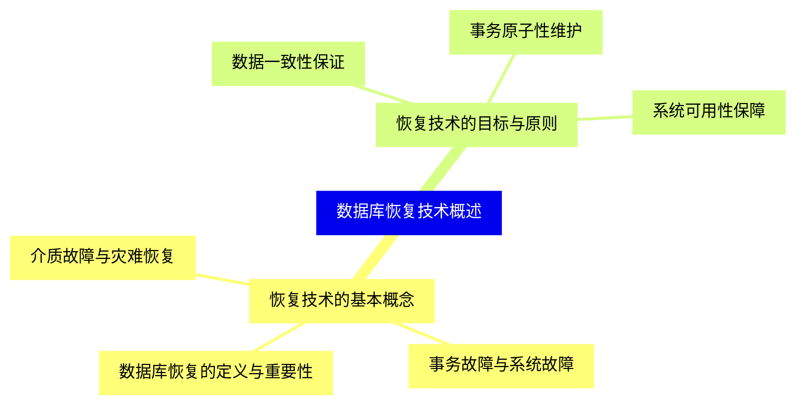
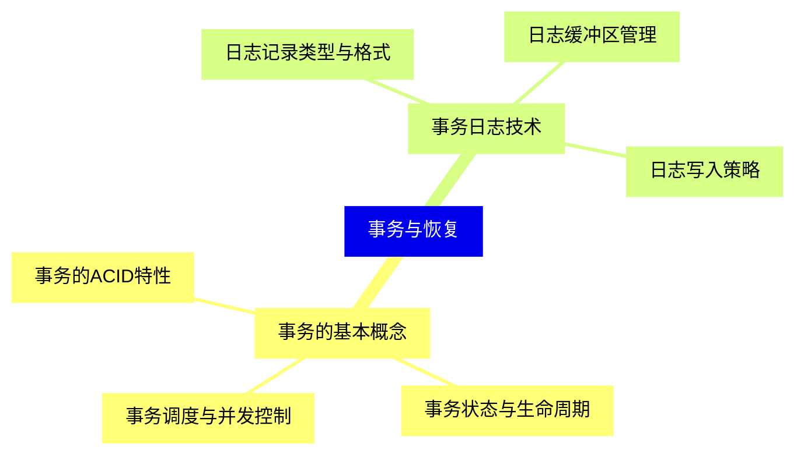
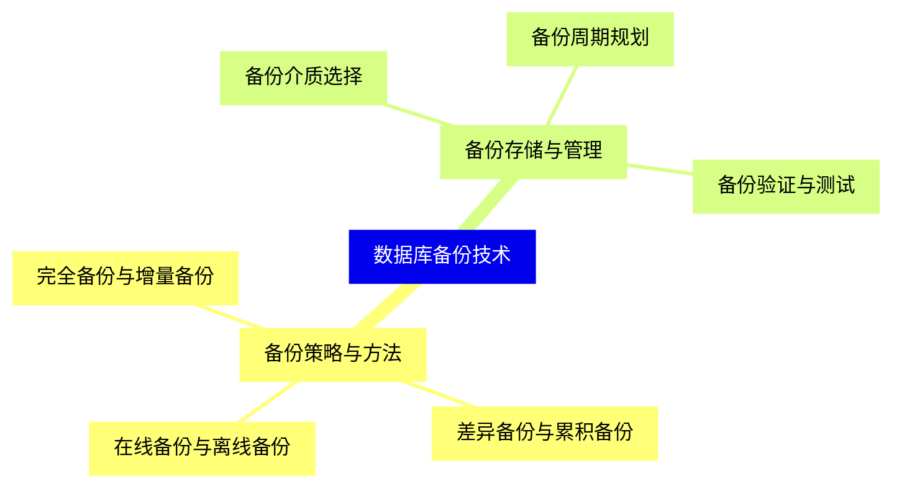
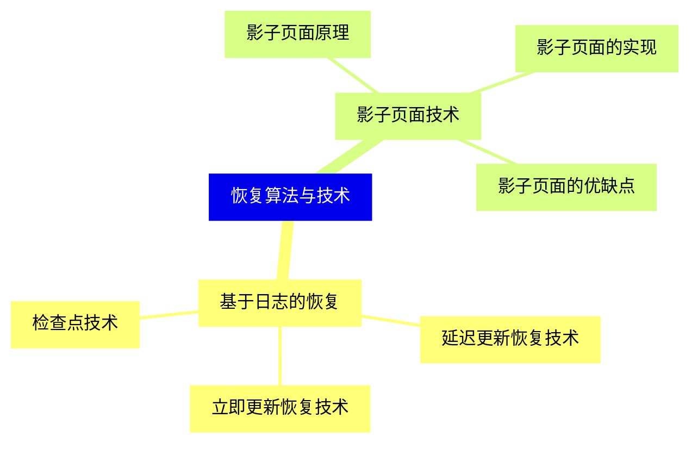
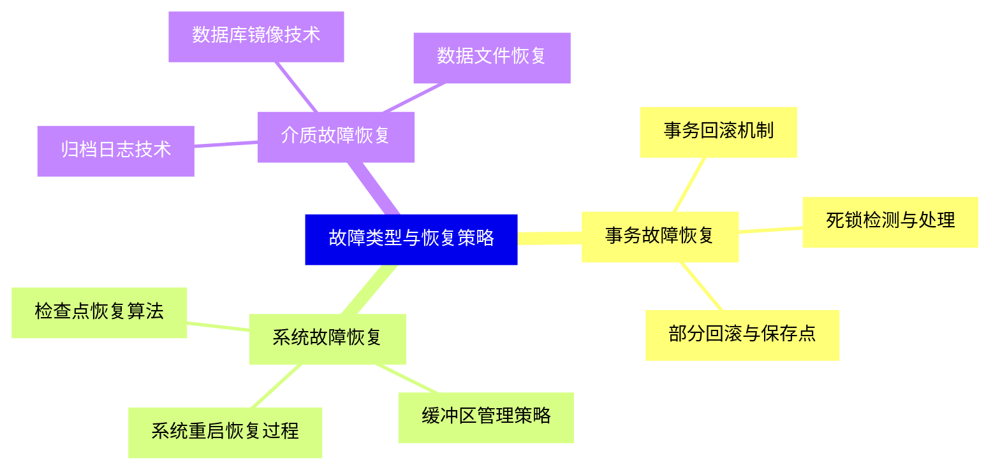
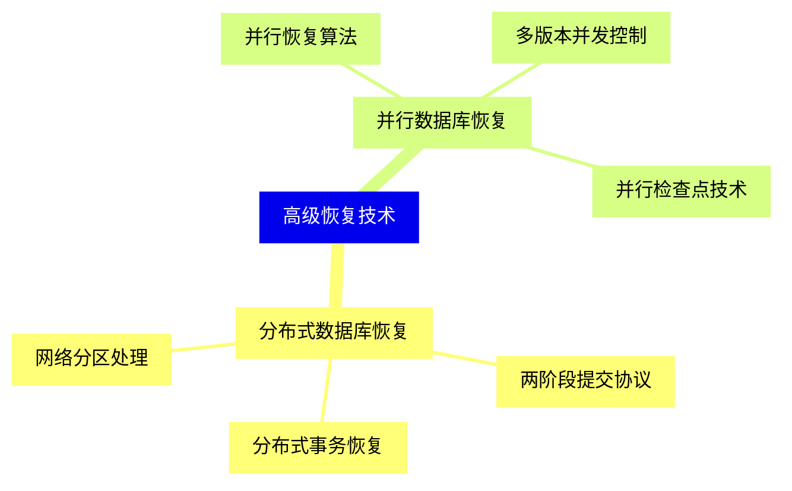
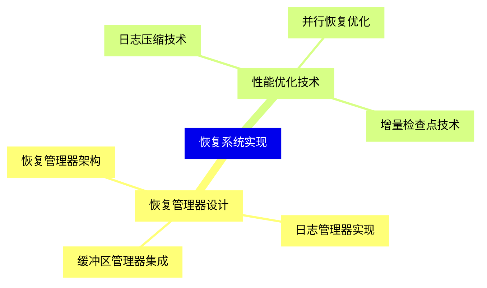
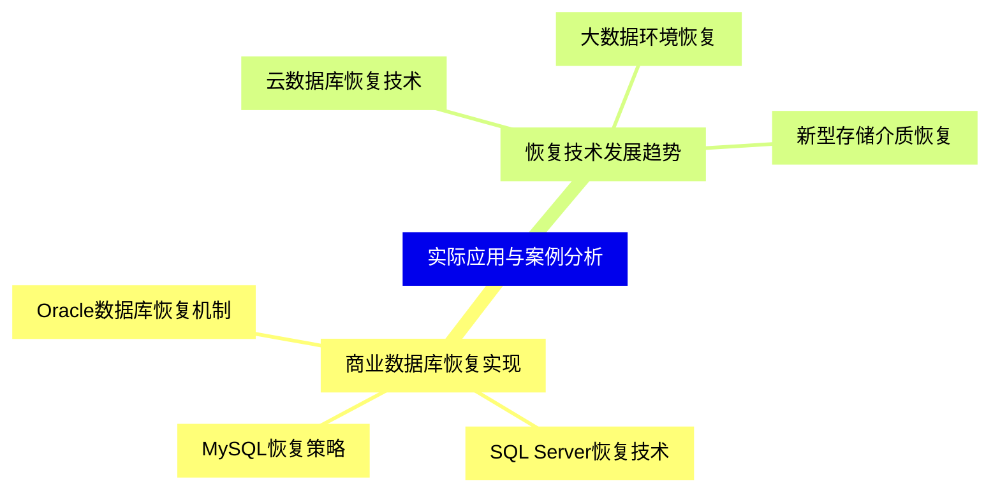


### 1 [数据库恢复技术概述](#1)
#### 1.1 [恢复技术的基本概念](#1)
##### 1.1.1 [数据库恢复的定义与重要性](#1)
##### 1.1.2 [事务故障与系统故障](#1)
##### 1.1.3 [介质故障与灾难恢复](#1)
#### 1.2 [恢复技术的目标与原则](#1)
##### 1.2.1 [数据一致性保证](#1)
##### 1.2.2 [事务原子性维护](#1)
##### 1.2.3 [系统可用性保障](#1)
### 2 [事务与恢复](#2)
#### 2.1 [事务的基本概念](#2)
##### 2.1.1 [事务的ACID特性](#2)
##### 2.1.2 [事务状态与生命周期](#2)
##### 2.1.3 [事务调度与并发控制](#2)
#### 2.2 [事务日志技术](#2)
##### 2.2.1 [日志记录类型与格式](#2)
##### 2.2.2 [日志缓冲区管理](#2)
##### 2.2.3 [日志写入策略](#2)
### 3 [数据库备份技术](#3)
#### 3.1 [备份策略与方法](#3)
##### 3.1.1 [完全备份与增量备份](#3)
##### 3.1.2 [差异备份与累积备份](#3)
##### 3.1.3 [在线备份与离线备份](#3)
#### 3.2 [备份存储与管理](#3)
##### 3.2.1 [备份介质选择](#3)
##### 3.2.2 [备份周期规划](#3)
##### 3.2.3 [备份验证与测试](#3)
### 4 [恢复算法与技术](#4)
#### 4.1 [基于日志的恢复](#4)
##### 4.1.1 [延迟更新恢复技术](#4)
##### 4.1.2 [立即更新恢复技术](#4)
##### 4.1.3 [检查点技术](#4)
#### 4.2 [影子页面技术](#4)
##### 4.2.1 [影子页面原理](#4)
##### 4.2.2 [影子页面的实现](#4)
##### 4.2.3 [影子页面的优缺点](#4)
### 5 [故障类型与恢复策略](#5)
#### 5.1 [事务故障恢复](#5)
##### 5.1.1 [事务回滚机制](#5)
##### 5.1.2 [死锁检测与处理](#5)
##### 5.1.3 [部分回滚与保存点](#5)
#### 5.2 [系统故障恢复](#5)
##### 5.2.1 [系统重启恢复过程](#5)
##### 5.2.2 [缓冲区管理策略](#5)
##### 5.2.3 [检查点恢复算法](#5)
#### 5.3 [介质故障恢复](#5)
##### 5.3.1 [归档日志技术](#5)
##### 5.3.2 [数据库镜像技术](#5)
##### 5.3.3 [数据文件恢复](#5)
### 6 [高级恢复技术](#6)
#### 6.1 [分布式数据库恢复](#6)
##### 6.1.1 [两阶段提交协议](#6)
##### 6.1.2 [分布式事务恢复](#6)
##### 6.1.3 [网络分区处理](#6)
#### 6.2 [并行数据库恢复](#6)
##### 6.2.1 [并行恢复算法](#6)
##### 6.2.2 [多版本并发控制](#6)
##### 6.2.3 [并行检查点技术](#6)
### 7 [恢复系统实现](#7)
#### 7.1 [恢复管理器设计](#7)
##### 7.1.1 [恢复管理器架构](#7)
##### 7.1.2 [日志管理器实现](#7)
##### 7.1.3 [缓冲区管理器集成](#7)
#### 7.2 [性能优化技术](#7)
##### 7.2.1 [日志压缩技术](#7)
##### 7.2.2 [并行恢复优化](#7)
##### 7.2.3 [增量检查点技术](#7)
### 8 [实际应用与案例分析](#8)
#### 8.1 [商业数据库恢复实现](#8)
##### 8.1.1 [Oracle数据库恢复机制](#8)
##### 8.1.2 [SQL Server恢复技术](#8)
##### 8.1.3 [MySQL恢复策略](#8)
#### 8.2 [恢复技术发展趋势](#8)
##### 8.2.1 [云数据库恢复技术](#8)
##### 8.2.2 [大数据环境恢复](#8)
##### 8.2.3 [新型存储介质恢复](#8)




### 1 数据库恢复技术概述

---
### 1 数据库恢复技术概述
___
#### 1.1 恢复技术的基本概念
___
##### 1.1.1 数据库恢复的定义与重要性
___
##### 1.1.2 事务故障与系统故障
___
##### 1.1.3 介质故障与灾难恢复
___
#### 1.2 恢复技术的目标与原则
___
##### 1.2.1 数据一致性保证
___
##### 1.2.2 事务原子性维护
___
##### 1.2.3 系统可用性保障
### 2 事务与恢复

---
### 2 事务与恢复
___
#### 2.1 事务的基本概念
___
##### 2.1.1 事务的ACID特性
___
##### 2.1.2 事务状态与生命周期
___
##### 2.1.3 事务调度与并发控制
___
#### 2.2 事务日志技术
___
##### 2.2.1 日志记录类型与格式
___
##### 2.2.2 日志缓冲区管理
___
##### 2.2.3 日志写入策略
### 3 数据库备份技术

---
### 3 数据库备份技术
___
#### 3.1 备份策略与方法
___
##### 3.1.1 完全备份与增量备份
___
##### 3.1.2 差异备份与累积备份
___
##### 3.1.3 在线备份与离线备份
___
#### 3.2 备份存储与管理
___
##### 3.2.1 备份介质选择
___
##### 3.2.2 备份周期规划
___
##### 3.2.3 备份验证与测试
### 4 恢复算法与技术

---
### 4 恢复算法与技术
___
#### 4.1 基于日志的恢复
___
##### 4.1.1 延迟更新恢复技术
___
##### 4.1.2 立即更新恢复技术
___
##### 4.1.3 检查点技术
___
#### 4.2 影子页面技术
___
##### 4.2.1 影子页面原理
___
##### 4.2.2 影子页面的实现
___
##### 4.2.3 影子页面的优缺点
### 5 故障类型与恢复策略

---
### 5 故障类型与恢复策略
___
#### 5.1 事务故障恢复
___
##### 5.1.1 事务回滚机制
___
##### 5.1.2 死锁检测与处理
___
##### 5.1.3 部分回滚与保存点
___
#### 5.2 系统故障恢复
___
##### 5.2.1 系统重启恢复过程
___
##### 5.2.2 缓冲区管理策略
___
##### 5.2.3 检查点恢复算法
___
#### 5.3 介质故障恢复
___
##### 5.3.1 归档日志技术
___
##### 5.3.2 数据库镜像技术
___
##### 5.3.3 数据文件恢复
### 6 高级恢复技术

---
### 6 高级恢复技术
___
#### 6.1 分布式数据库恢复
___
##### 6.1.1 两阶段提交协议
___
##### 6.1.2 分布式事务恢复
___
##### 6.1.3 网络分区处理
___
#### 6.2 并行数据库恢复
___
##### 6.2.1 并行恢复算法
___
##### 6.2.2 多版本并发控制
___
##### 6.2.3 并行检查点技术
### 7 恢复系统实现

---
### 7 恢复系统实现
___
#### 7.1 恢复管理器设计
___
##### 7.1.1 恢复管理器架构
___
##### 7.1.2 日志管理器实现
___
##### 7.1.3 缓冲区管理器集成
___
#### 7.2 性能优化技术
___
##### 7.2.1 日志压缩技术
___
##### 7.2.2 并行恢复优化
___
##### 7.2.3 增量检查点技术
### 8 实际应用与案例分析

---
### 8 实际应用与案例分析
___
#### 8.1 商业数据库恢复实现
___
##### 8.1.1 Oracle数据库恢复机制
___
##### 8.1.2 SQL Server恢复技术
___
##### 8.1.3 MySQL恢复策略
___
#### 8.2 恢复技术发展趋势
___
##### 8.2.1 云数据库恢复技术
___
##### 8.2.2 大数据环境恢复
___
##### 8.2.3 新型存储介质恢复


### 1 数据库恢复技术概述{#1}

{}

<--->
{}
{}
{}
{}
{}
{}
{}
{}
{}
{}
{}
{}
{}
{}
{}
{}
{}

### 2 事务与恢复{#2}

{}
{}
{}
{}
{}
{}
{}
{}
{}
{}
{}
{}
{}
{}
{}
{}
{}
<--->

{}

### 3 数据库备份技术{#3}

{}

<--->
{}
{}
{}
{}
{}
{}
{}
{}
{}
{}
{}
{}
{}
{}
{}
{}
{}

### 4 恢复算法与技术{#4}

{}
{}
{}
{}
{}
{}
{}
{}
{}
{}
{}
{}
{}
{}
{}
{}
{}
<--->

{}

### 5 故障类型与恢复策略{#5}

{}

<--->
{}
{}
{}
{}
{}
{}
{}
{}
{}
{}
{}
{}
{}
{}
{}
{}
{}
{}
{}
{}
{}
{}
{}
{}
{}

### 6 高级恢复技术{#6}

{}
{}
{}
{}
{}
{}
{}
{}
{}
{}
{}
{}
{}
{}
{}
{}
{}
<--->

{}

### 7 恢复系统实现{#7}

{}

<--->
{}
{}
{}
{}
{}
{}
{}
{}
{}
{}
{}
{}
{}
{}
{}
{}
{}

### 8 实际应用与案例分析{#8}

{}
{}
{}
{}
{}
{}
{}
{}
{}
{}
{}
{}
{}
{}
{}
{}
{}
<--->

{}
