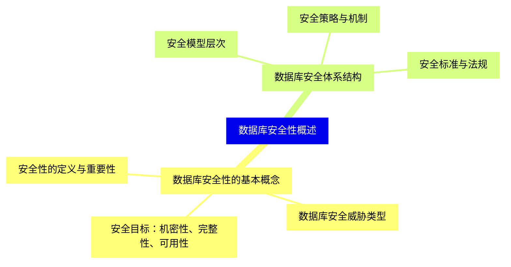
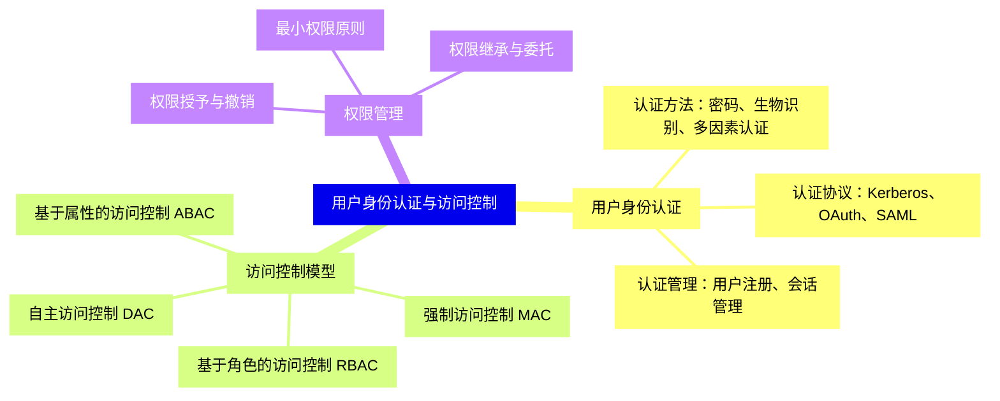
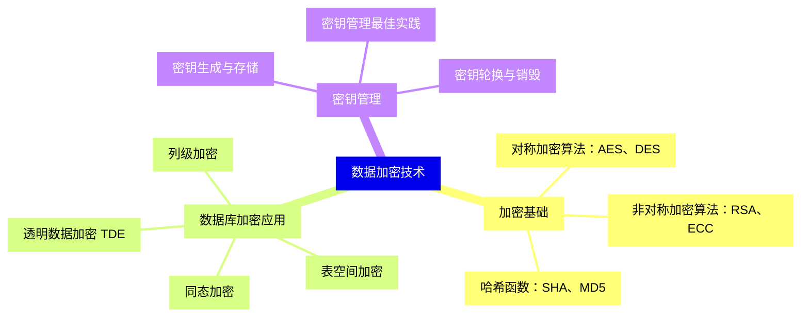
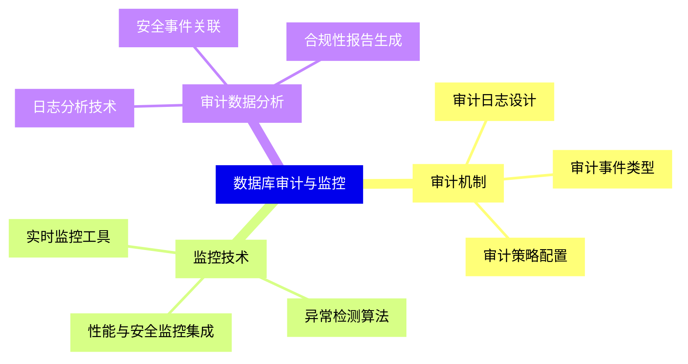
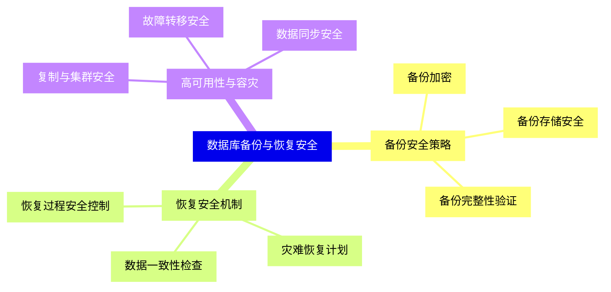
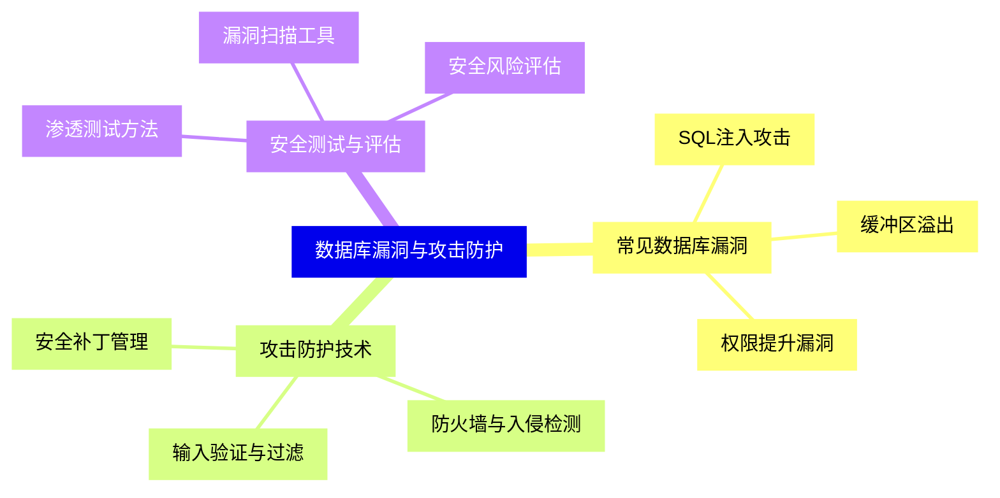
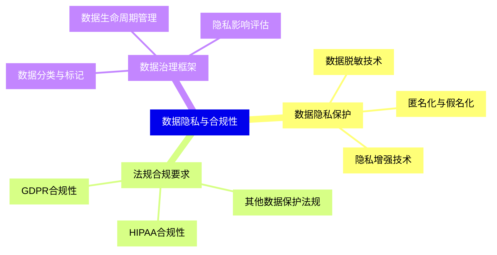
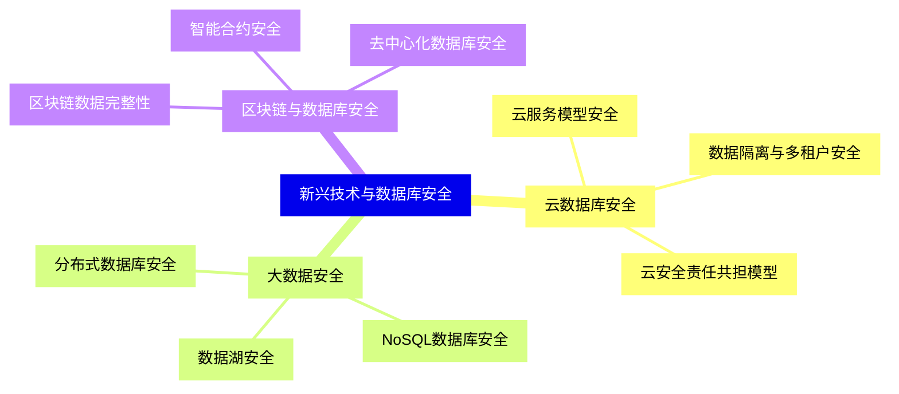
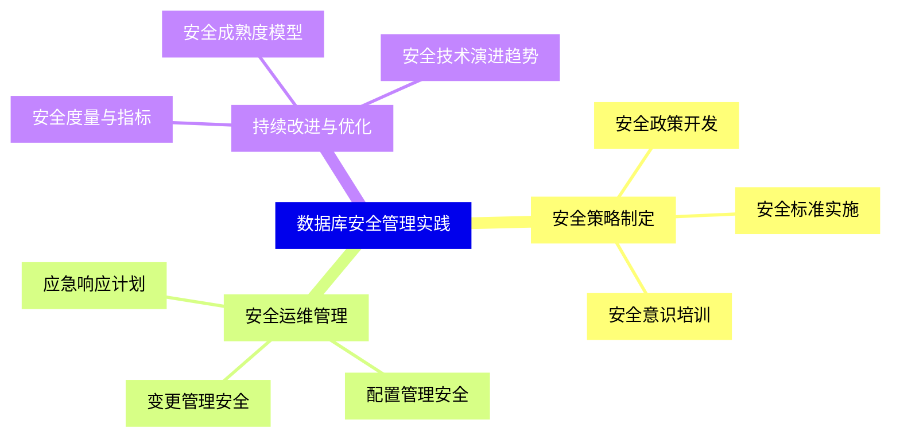


### 1 [数据库安全性概述](#1)
#### 1.1 [数据库安全性的基本概念](#1)
##### 1.1.1 [安全性的定义与重要性](#1)
##### 1.1.2 [数据库安全威胁类型](#1)
##### 1.1.3 [安全目标：机密性、完整性、可用性](#1)
#### 1.2 [数据库安全体系结构](#1)
##### 1.2.1 [安全模型层次](#1)
##### 1.2.2 [安全策略与机制](#1)
##### 1.2.3 [安全标准与法规](#1)
### 2 [用户身份认证与访问控制](#2)
#### 2.1 [用户身份认证](#2)
##### 2.1.1 [认证方法：密码、生物识别、多因素认证](#2)
##### 2.1.2 [认证协议：Kerberos、OAuth、SAML](#2)
##### 2.1.3 [认证管理：用户注册、会话管理](#2)
#### 2.2 [访问控制模型](#2)
##### 2.2.1 [自主访问控制 DAC](#2)
##### 2.2.2 [强制访问控制 MAC](#2)
##### 2.2.3 [基于角色的访问控制 RBAC](#2)
##### 2.2.4 [基于属性的访问控制 ABAC](#2)
#### 2.3 [权限管理](#2)
##### 2.3.1 [权限授予与撤销](#2)
##### 2.3.2 [权限继承与委托](#2)
##### 2.3.3 [最小权限原则](#2)
### 3 [数据加密技术](#3)
#### 3.1 [加密基础](#3)
##### 3.1.1 [对称加密算法：AES、DES](#3)
##### 3.1.2 [非对称加密算法：RSA、ECC](#3)
##### 3.1.3 [哈希函数：SHA、MD5](#3)
#### 3.2 [数据库加密应用](#3)
##### 3.2.1 [列级加密](#3)
##### 3.2.2 [表空间加密](#3)
##### 3.2.3 [透明数据加密 TDE](#3)
##### 3.2.4 [同态加密](#3)
#### 3.3 [密钥管理](#3)
##### 3.3.1 [密钥生成与存储](#3)
##### 3.3.2 [密钥轮换与销毁](#3)
##### 3.3.3 [密钥管理最佳实践](#3)
### 4 [数据库审计与监控](#4)
#### 4.1 [审计机制](#4)
##### 4.1.1 [审计日志设计](#4)
##### 4.1.2 [审计事件类型](#4)
##### 4.1.3 [审计策略配置](#4)
#### 4.2 [监控技术](#4)
##### 4.2.1 [实时监控工具](#4)
##### 4.2.2 [异常检测算法](#4)
##### 4.2.3 [性能与安全监控集成](#4)
#### 4.3 [审计数据分析](#4)
##### 4.3.1 [日志分析技术](#4)
##### 4.3.2 [安全事件关联](#4)
##### 4.3.3 [合规性报告生成](#4)
### 5 [数据库备份与恢复安全](#5)
#### 5.1 [备份安全策略](#5)
##### 5.1.1 [备份加密](#5)
##### 5.1.2 [备份存储安全](#5)
##### 5.1.3 [备份完整性验证](#5)
#### 5.2 [恢复安全机制](#5)
##### 5.2.1 [恢复过程安全控制](#5)
##### 5.2.2 [灾难恢复计划](#5)
##### 5.2.3 [数据一致性检查](#5)
#### 5.3 [高可用性与容灾](#5)
##### 5.3.1 [复制与集群安全](#5)
##### 5.3.2 [故障转移安全](#5)
##### 5.3.3 [数据同步安全](#5)
### 6 [数据库漏洞与攻击防护](#6)
#### 6.1 [常见数据库漏洞](#6)
##### 6.1.1 [SQL注入攻击](#6)
##### 6.1.2 [缓冲区溢出](#6)
##### 6.1.3 [权限提升漏洞](#6)
#### 6.2 [攻击防护技术](#6)
##### 6.2.1 [输入验证与过滤](#6)
##### 6.2.2 [防火墙与入侵检测](#6)
##### 6.2.3 [安全补丁管理](#6)
#### 6.3 [安全测试与评估](#6)
##### 6.3.1 [渗透测试方法](#6)
##### 6.3.2 [漏洞扫描工具](#6)
##### 6.3.3 [安全风险评估](#6)
### 7 [数据隐私与合规性](#7)
#### 7.1 [数据隐私保护](#7)
##### 7.1.1 [数据脱敏技术](#7)
##### 7.1.2 [匿名化与假名化](#7)
##### 7.1.3 [隐私增强技术](#7)
#### 7.2 [法规合规要求](#7)
##### 7.2.1 [GDPR合规性](#7)
##### 7.2.2 [HIPAA合规性](#7)
##### 7.2.3 [其他数据保护法规](#7)
#### 7.3 [数据治理框架](#7)
##### 7.3.1 [数据分类与标记](#7)
##### 7.3.2 [数据生命周期管理](#7)
##### 7.3.3 [隐私影响评估](#7)
### 8 [新兴技术与数据库安全](#8)
#### 8.1 [云数据库安全](#8)
##### 8.1.1 [云服务模型安全](#8)
##### 8.1.2 [数据隔离与多租户安全](#8)
##### 8.1.3 [云安全责任共担模型](#8)
#### 8.2 [大数据安全](#8)
##### 8.2.1 [分布式数据库安全](#8)
##### 8.2.2 [NoSQL数据库安全](#8)
##### 8.2.3 [数据湖安全](#8)
#### 8.3 [区块链与数据库安全](#8)
##### 8.3.1 [区块链数据完整性](#8)
##### 8.3.2 [智能合约安全](#8)
##### 8.3.3 [去中心化数据库安全](#8)
### 9 [数据库安全管理实践](#9)
#### 9.1 [安全策略制定](#9)
##### 9.1.1 [安全政策开发](#9)
##### 9.1.2 [安全标准实施](#9)
##### 9.1.3 [安全意识培训](#9)
#### 9.2 [安全运维管理](#9)
##### 9.2.1 [变更管理安全](#9)
##### 9.2.2 [配置管理安全](#9)
##### 9.2.3 [应急响应计划](#9)
#### 9.3 [持续改进与优化](#9)
##### 9.3.1 [安全度量与指标](#9)
##### 9.3.2 [安全成熟度模型](#9)
##### 9.3.3 [安全技术演进趋势](#9)




### 1 数据库安全性概述

---
### 1 数据库安全性概述
___
#### 1.1 数据库安全性的基本概念
___
##### 1.1.1 安全性的定义与重要性
___
##### 1.1.2 数据库安全威胁类型
___
##### 1.1.3 安全目标：机密性、完整性、可用性
___
#### 1.2 数据库安全体系结构
___
##### 1.2.1 安全模型层次
___
##### 1.2.2 安全策略与机制
___
##### 1.2.3 安全标准与法规
### 2 用户身份认证与访问控制

---
### 2 用户身份认证与访问控制
___
#### 2.1 用户身份认证
___
##### 2.1.1 认证方法：密码、生物识别、多因素认证
___
##### 2.1.2 认证协议：Kerberos、OAuth、SAML
___
##### 2.1.3 认证管理：用户注册、会话管理
___
#### 2.2 访问控制模型
___
##### 2.2.1 自主访问控制 DAC
___
##### 2.2.2 强制访问控制 MAC
___
##### 2.2.3 基于角色的访问控制 RBAC
___
##### 2.2.4 基于属性的访问控制 ABAC
___
#### 2.3 权限管理
___
##### 2.3.1 权限授予与撤销
___
##### 2.3.2 权限继承与委托
___
##### 2.3.3 最小权限原则
### 3 数据加密技术

---
### 3 数据加密技术
___
#### 3.1 加密基础
___
##### 3.1.1 对称加密算法：AES、DES
___
##### 3.1.2 非对称加密算法：RSA、ECC
___
##### 3.1.3 哈希函数：SHA、MD5
___
#### 3.2 数据库加密应用
___
##### 3.2.1 列级加密
___
##### 3.2.2 表空间加密
___
##### 3.2.3 透明数据加密 TDE
___
##### 3.2.4 同态加密
___
#### 3.3 密钥管理
___
##### 3.3.1 密钥生成与存储
___
##### 3.3.2 密钥轮换与销毁
___
##### 3.3.3 密钥管理最佳实践
### 4 数据库审计与监控

---
### 4 数据库审计与监控
___
#### 4.1 审计机制
___
##### 4.1.1 审计日志设计
___
##### 4.1.2 审计事件类型
___
##### 4.1.3 审计策略配置
___
#### 4.2 监控技术
___
##### 4.2.1 实时监控工具
___
##### 4.2.2 异常检测算法
___
##### 4.2.3 性能与安全监控集成
___
#### 4.3 审计数据分析
___
##### 4.3.1 日志分析技术
___
##### 4.3.2 安全事件关联
___
##### 4.3.3 合规性报告生成
### 5 数据库备份与恢复安全

---
### 5 数据库备份与恢复安全
___
#### 5.1 备份安全策略
___
##### 5.1.1 备份加密
___
##### 5.1.2 备份存储安全
___
##### 5.1.3 备份完整性验证
___
#### 5.2 恢复安全机制
___
##### 5.2.1 恢复过程安全控制
___
##### 5.2.2 灾难恢复计划
___
##### 5.2.3 数据一致性检查
___
#### 5.3 高可用性与容灾
___
##### 5.3.1 复制与集群安全
___
##### 5.3.2 故障转移安全
___
##### 5.3.3 数据同步安全
### 6 数据库漏洞与攻击防护

---
### 6 数据库漏洞与攻击防护
___
#### 6.1 常见数据库漏洞
___
##### 6.1.1 SQL注入攻击
___
##### 6.1.2 缓冲区溢出
___
##### 6.1.3 权限提升漏洞
___
#### 6.2 攻击防护技术
___
##### 6.2.1 输入验证与过滤
___
##### 6.2.2 防火墙与入侵检测
___
##### 6.2.3 安全补丁管理
___
#### 6.3 安全测试与评估
___
##### 6.3.1 渗透测试方法
___
##### 6.3.2 漏洞扫描工具
___
##### 6.3.3 安全风险评估
### 7 数据隐私与合规性

---
### 7 数据隐私与合规性
___
#### 7.1 数据隐私保护
___
##### 7.1.1 数据脱敏技术
___
##### 7.1.2 匿名化与假名化
___
##### 7.1.3 隐私增强技术
___
#### 7.2 法规合规要求
___
##### 7.2.1 GDPR合规性
___
##### 7.2.2 HIPAA合规性
___
##### 7.2.3 其他数据保护法规
___
#### 7.3 数据治理框架
___
##### 7.3.1 数据分类与标记
___
##### 7.3.2 数据生命周期管理
___
##### 7.3.3 隐私影响评估
### 8 新兴技术与数据库安全

---
### 8 新兴技术与数据库安全
___
#### 8.1 云数据库安全
___
##### 8.1.1 云服务模型安全
___
##### 8.1.2 数据隔离与多租户安全
___
##### 8.1.3 云安全责任共担模型
___
#### 8.2 大数据安全
___
##### 8.2.1 分布式数据库安全
___
##### 8.2.2 NoSQL数据库安全
___
##### 8.2.3 数据湖安全
___
#### 8.3 区块链与数据库安全
___
##### 8.3.1 区块链数据完整性
___
##### 8.3.2 智能合约安全
___
##### 8.3.3 去中心化数据库安全
### 9 数据库安全管理实践

---
### 9 数据库安全管理实践
___
#### 9.1 安全策略制定
___
##### 9.1.1 安全政策开发
___
##### 9.1.2 安全标准实施
___
##### 9.1.3 安全意识培训
___
#### 9.2 安全运维管理
___
##### 9.2.1 变更管理安全
___
##### 9.2.2 配置管理安全
___
##### 9.2.3 应急响应计划
___
#### 9.3 持续改进与优化
___
##### 9.3.1 安全度量与指标
___
##### 9.3.2 安全成熟度模型
___
##### 9.3.3 安全技术演进趋势


### 1 数据库安全性概述{#1}

{}

<--->
{}
{}
{}
{}
{}
{}
{}
{}
{}
{}
{}
{}
{}
{}
{}
{}
{}

### 2 用户身份认证与访问控制{#2}

{}
{}
{}
{}
{}
{}
{}
{}
{}
{}
{}
{}
{}
{}
{}
{}
{}
{}
{}
{}
{}
{}
{}
{}
{}
{}
{}
<--->

{}

### 3 数据加密技术{#3}

{}

<--->
{}
{}
{}
{}
{}
{}
{}
{}
{}
{}
{}
{}
{}
{}
{}
{}
{}
{}
{}
{}
{}
{}
{}
{}
{}
{}
{}

### 4 数据库审计与监控{#4}

{}
{}
{}
{}
{}
{}
{}
{}
{}
{}
{}
{}
{}
{}
{}
{}
{}
{}
{}
{}
{}
{}
{}
{}
{}
<--->

{}

### 5 数据库备份与恢复安全{#5}

{}

<--->
{}
{}
{}
{}
{}
{}
{}
{}
{}
{}
{}
{}
{}
{}
{}
{}
{}
{}
{}
{}
{}
{}
{}
{}
{}

### 6 数据库漏洞与攻击防护{#6}

{}
{}
{}
{}
{}
{}
{}
{}
{}
{}
{}
{}
{}
{}
{}
{}
{}
{}
{}
{}
{}
{}
{}
{}
{}
<--->

{}

### 7 数据隐私与合规性{#7}

{}

<--->
{}
{}
{}
{}
{}
{}
{}
{}
{}
{}
{}
{}
{}
{}
{}
{}
{}
{}
{}
{}
{}
{}
{}
{}
{}

### 8 新兴技术与数据库安全{#8}

{}
{}
{}
{}
{}
{}
{}
{}
{}
{}
{}
{}
{}
{}
{}
{}
{}
{}
{}
{}
{}
{}
{}
{}
{}
<--->

{}

### 9 数据库安全管理实践{#9}

{}

<--->
{}
{}
{}
{}
{}
{}
{}
{}
{}
{}
{}
{}
{}
{}
{}
{}
{}
{}
{}
{}
{}
{}
{}
{}
{}
