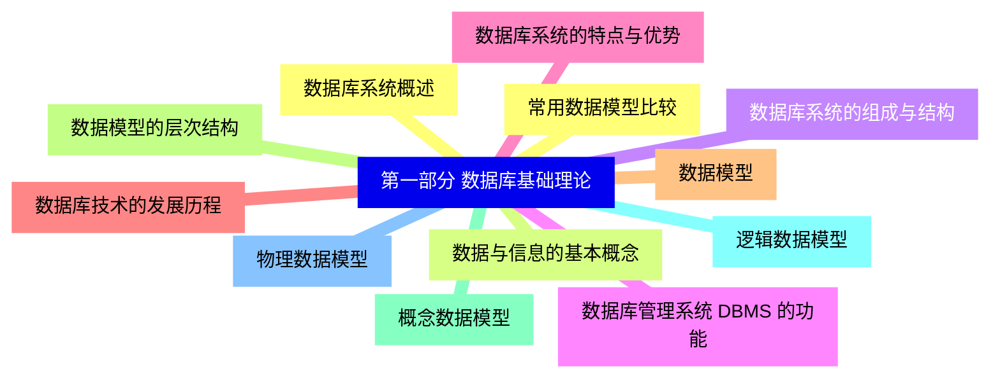
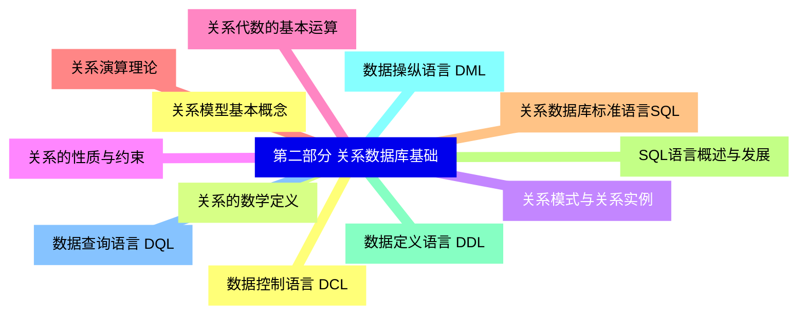
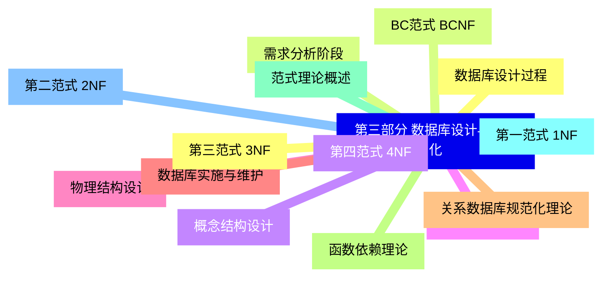
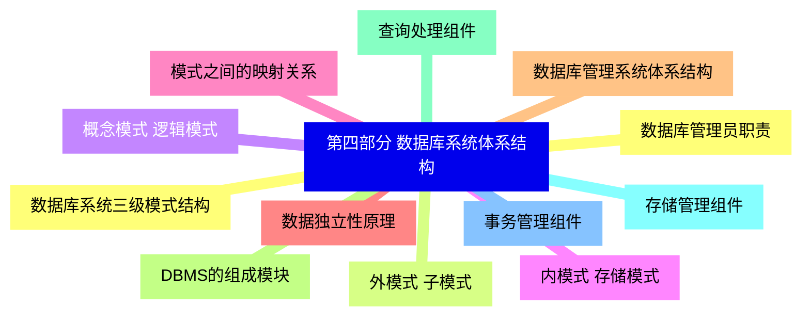
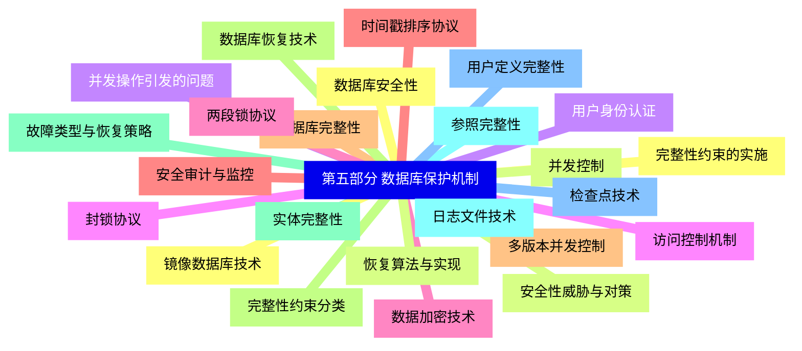
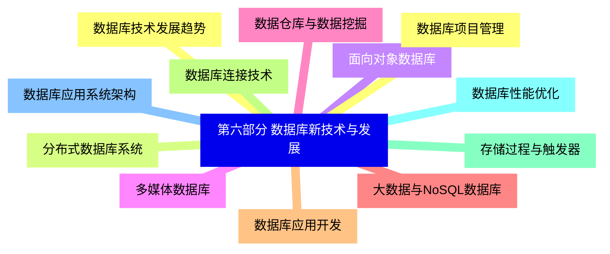


### 1 [第一部分 数据库基础理论](#1)
#### 1.1 [数据库系统概述](#1)
#### 1.2 [数据与信息的基本概念](#1)
#### 1.3 [数据库系统的组成与结构](#1)
#### 1.4 [数据库管理系统 DBMS 的功能](#1)
#### 1.5 [数据库系统的特点与优势](#1)
#### 1.6 [数据库技术的发展历程](#1)
#### 1.7 [数据模型](#1)
#### 1.8 [数据模型的层次结构](#1)
#### 1.9 [概念数据模型](#1)
#### 1.10 [逻辑数据模型](#1)
#### 1.11 [物理数据模型](#1)
#### 1.12 [常用数据模型比较](#1)
### 2 [第二部分 关系数据库基础](#2)
#### 2.1 [关系模型基本概念](#2)
#### 2.2 [关系的数学定义](#2)
#### 2.3 [关系模式与关系实例](#2)
#### 2.4 [关系的性质与约束](#2)
#### 2.5 [关系代数的基本运算](#2)
#### 2.6 [关系演算理论](#2)
#### 2.7 [关系数据库标准语言SQL](#2)
#### 2.8 [SQL语言概述与发展](#2)
#### 2.9 [数据定义语言 DDL](#2)
#### 2.10 [数据操纵语言 DML](#2)
#### 2.11 [数据查询语言 DQL](#2)
#### 2.12 [数据控制语言 DCL](#2)
### 3 [第三部分 数据库设计与规范化](#3)
#### 3.1 [数据库设计过程](#3)
#### 3.2 [需求分析阶段](#3)
#### 3.3 [概念结构设计](#3)
#### 3.4 [逻辑结构设计](#3)
#### 3.5 [物理结构设计](#3)
#### 3.6 [数据库实施与维护](#3)
#### 3.7 [关系数据库规范化理论](#3)
#### 3.8 [函数依赖理论](#3)
#### 3.9 [范式理论概述](#3)
#### 3.10 [第一范式 1NF](#3)
#### 3.11 [第二范式 2NF](#3)
#### 3.12 [第三范式 3NF](#3)
#### 3.13 [BC范式 BCNF](#3)
#### 3.14 [第四范式 4NF](#3)
### 4 [第四部分 数据库系统体系结构](#4)
#### 4.1 [数据库系统三级模式结构](#4)
#### 4.2 [外模式 子模式](#4)
#### 4.3 [概念模式 逻辑模式](#4)
#### 4.4 [内模式 存储模式](#4)
#### 4.5 [模式之间的映射关系](#4)
#### 4.6 [数据独立性原理](#4)
#### 4.7 [数据库管理系统体系结构](#4)
#### 4.8 [DBMS的组成模块](#4)
#### 4.9 [查询处理组件](#4)
#### 4.10 [存储管理组件](#4)
#### 4.11 [事务管理组件](#4)
#### 4.12 [数据库管理员职责](#4)
### 5 [第五部分 数据库保护机制](#5)
#### 5.1 [数据库安全性](#5)
#### 5.2 [安全性威胁与对策](#5)
#### 5.3 [用户身份认证](#5)
#### 5.4 [访问控制机制](#5)
#### 5.5 [数据加密技术](#5)
#### 5.6 [安全审计与监控](#5)
#### 5.7 [数据库完整性](#5)
#### 5.8 [完整性约束分类](#5)
#### 5.9 [实体完整性](#5)
#### 5.10 [参照完整性](#5)
#### 5.11 [用户定义完整性](#5)
#### 5.12 [完整性约束的实施](#5)
#### 5.13 [并发控制](#5)
#### 5.14 [并发操作引发的问题](#5)
#### 5.15 [封锁协议](#5)
#### 5.16 [两段锁协议](#5)
#### 5.17 [时间戳排序协议](#5)
#### 5.18 [多版本并发控制](#5)
#### 5.19 [数据库恢复技术](#5)
#### 5.20 [故障类型与恢复策略](#5)
#### 5.21 [日志文件技术](#5)
#### 5.22 [检查点技术](#5)
#### 5.23 [镜像数据库技术](#5)
#### 5.24 [恢复算法与实现](#5)
### 6 [第六部分 数据库新技术与发展](#6)
#### 6.1 [数据库技术发展趋势](#6)
#### 6.2 [分布式数据库系统](#6)
#### 6.3 [面向对象数据库](#6)
#### 6.4 [多媒体数据库](#6)
#### 6.5 [数据仓库与数据挖掘](#6)
#### 6.6 [大数据与NoSQL数据库](#6)
#### 6.7 [数据库应用开发](#6)
#### 6.8 [数据库连接技术](#6)
#### 6.9 [存储过程与触发器](#6)
#### 6.10 [数据库性能优化](#6)
#### 6.11 [数据库应用系统架构](#6)
#### 6.12 [数据库项目管理](#6)




### 1 第一部分 数据库基础理论

---
### 1 第一部分 数据库基础理论
___
#### 1.1 数据库系统概述
___
#### 1.2 数据与信息的基本概念
___
#### 1.3 数据库系统的组成与结构
___
#### 1.4 数据库管理系统 DBMS 的功能
___
#### 1.5 数据库系统的特点与优势
___
#### 1.6 数据库技术的发展历程
___
#### 1.7 数据模型
___
#### 1.8 数据模型的层次结构
___
#### 1.9 概念数据模型
___
#### 1.10 逻辑数据模型
___
#### 1.11 物理数据模型
___
#### 1.12 常用数据模型比较
### 2 第二部分 关系数据库基础

---
### 2 第二部分 关系数据库基础
___
#### 2.1 关系模型基本概念
___
#### 2.2 关系的数学定义
___
#### 2.3 关系模式与关系实例
___
#### 2.4 关系的性质与约束
___
#### 2.5 关系代数的基本运算
___
#### 2.6 关系演算理论
___
#### 2.7 关系数据库标准语言SQL
___
#### 2.8 SQL语言概述与发展
___
#### 2.9 数据定义语言 DDL
___
#### 2.10 数据操纵语言 DML
___
#### 2.11 数据查询语言 DQL
___
#### 2.12 数据控制语言 DCL
### 3 第三部分 数据库设计与规范化

---
### 3 第三部分 数据库设计与规范化
___
#### 3.1 数据库设计过程
___
#### 3.2 需求分析阶段
___
#### 3.3 概念结构设计
___
#### 3.4 逻辑结构设计
___
#### 3.5 物理结构设计
___
#### 3.6 数据库实施与维护
___
#### 3.7 关系数据库规范化理论
___
#### 3.8 函数依赖理论
___
#### 3.9 范式理论概述
___
#### 3.10 第一范式 1NF
___
#### 3.11 第二范式 2NF
___
#### 3.12 第三范式 3NF
___
#### 3.13 BC范式 BCNF
___
#### 3.14 第四范式 4NF
### 4 第四部分 数据库系统体系结构

---
### 4 第四部分 数据库系统体系结构
___
#### 4.1 数据库系统三级模式结构
___
#### 4.2 外模式 子模式
___
#### 4.3 概念模式 逻辑模式
___
#### 4.4 内模式 存储模式
___
#### 4.5 模式之间的映射关系
___
#### 4.6 数据独立性原理
___
#### 4.7 数据库管理系统体系结构
___
#### 4.8 DBMS的组成模块
___
#### 4.9 查询处理组件
___
#### 4.10 存储管理组件
___
#### 4.11 事务管理组件
___
#### 4.12 数据库管理员职责
### 5 第五部分 数据库保护机制

---
### 5 第五部分 数据库保护机制
___
#### 5.1 数据库安全性
___
#### 5.2 安全性威胁与对策
___
#### 5.3 用户身份认证
___
#### 5.4 访问控制机制
___
#### 5.5 数据加密技术
___
#### 5.6 安全审计与监控
___
#### 5.7 数据库完整性
___
#### 5.8 完整性约束分类
___
#### 5.9 实体完整性
___
#### 5.10 参照完整性
___
#### 5.11 用户定义完整性
___
#### 5.12 完整性约束的实施
___
#### 5.13 并发控制
___
#### 5.14 并发操作引发的问题
___
#### 5.15 封锁协议
___
#### 5.16 两段锁协议
___
#### 5.17 时间戳排序协议
___
#### 5.18 多版本并发控制
___
#### 5.19 数据库恢复技术
___
#### 5.20 故障类型与恢复策略
___
#### 5.21 日志文件技术
___
#### 5.22 检查点技术
___
#### 5.23 镜像数据库技术
___
#### 5.24 恢复算法与实现
### 6 第六部分 数据库新技术与发展

---
### 6 第六部分 数据库新技术与发展
___
#### 6.1 数据库技术发展趋势
___
#### 6.2 分布式数据库系统
___
#### 6.3 面向对象数据库
___
#### 6.4 多媒体数据库
___
#### 6.5 数据仓库与数据挖掘
___
#### 6.6 大数据与NoSQL数据库
___
#### 6.7 数据库应用开发
___
#### 6.8 数据库连接技术
___
#### 6.9 存储过程与触发器
___
#### 6.10 数据库性能优化
___
#### 6.11 数据库应用系统架构
___
#### 6.12 数据库项目管理


### 1 第一部分 数据库基础理论{#1}

{}

<--->
{}
{}
{}
{}
{}
{}
{}
{}
{}
{}
{}
{}
{}
{}
{}
{}
{}
{}
{}
{}
{}
{}
{}
{}
{}

### 2 第二部分 关系数据库基础{#2}

{}
{}
{}
{}
{}
{}
{}
{}
{}
{}
{}
{}
{}
{}
{}
{}
{}
{}
{}
{}
{}
{}
{}
{}
{}
<--->

{}

### 3 第三部分 数据库设计与规范化{#3}

{}

<--->
{}
{}
{}
{}
{}
{}
{}
{}
{}
{}
{}
{}
{}
{}
{}
{}
{}
{}
{}
{}
{}
{}
{}
{}
{}
{}
{}
{}
{}

### 4 第四部分 数据库系统体系结构{#4}

{}
{}
{}
{}
{}
{}
{}
{}
{}
{}
{}
{}
{}
{}
{}
{}
{}
{}
{}
{}
{}
{}
{}
{}
{}
<--->

{}

### 5 第五部分 数据库保护机制{#5}

{}

<--->
{}
{}
{}
{}
{}
{}
{}
{}
{}
{}
{}
{}
{}
{}
{}
{}
{}
{}
{}
{}
{}
{}
{}
{}
{}
{}
{}
{}
{}
{}
{}
{}
{}
{}
{}
{}
{}
{}
{}
{}
{}
{}
{}
{}
{}
{}
{}
{}
{}

### 6 第六部分 数据库新技术与发展{#6}

{}
{}
{}
{}
{}
{}
{}
{}
{}
{}
{}
{}
{}
{}
{}
{}
{}
{}
{}
{}
{}
{}
{}
{}
{}
<--->

{}
