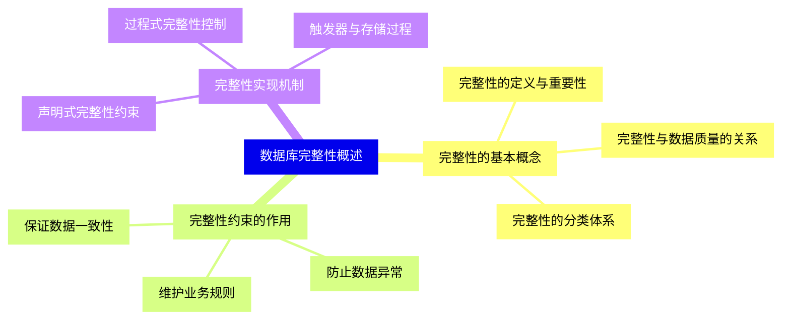
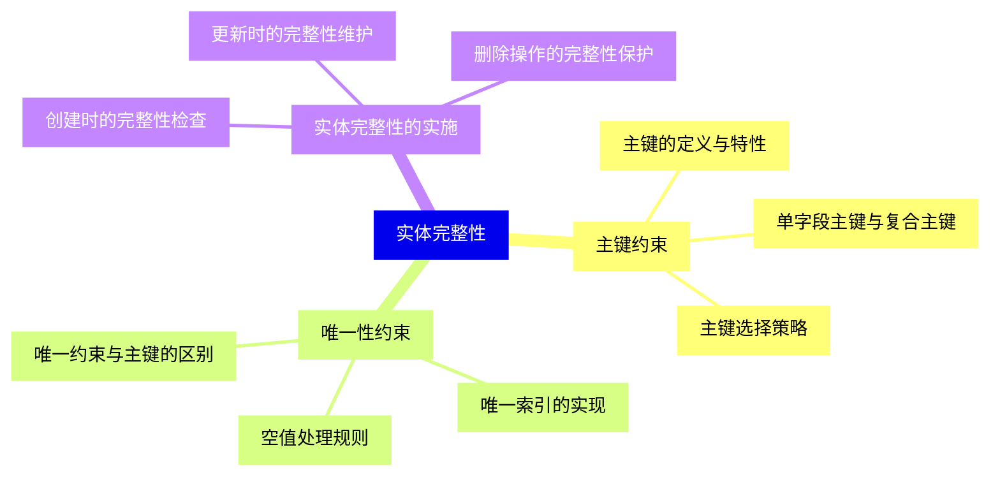
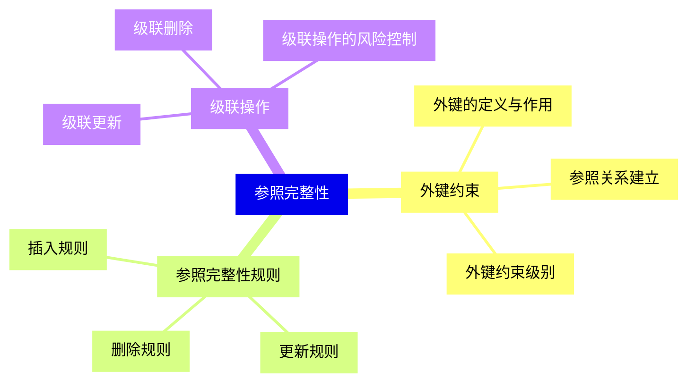
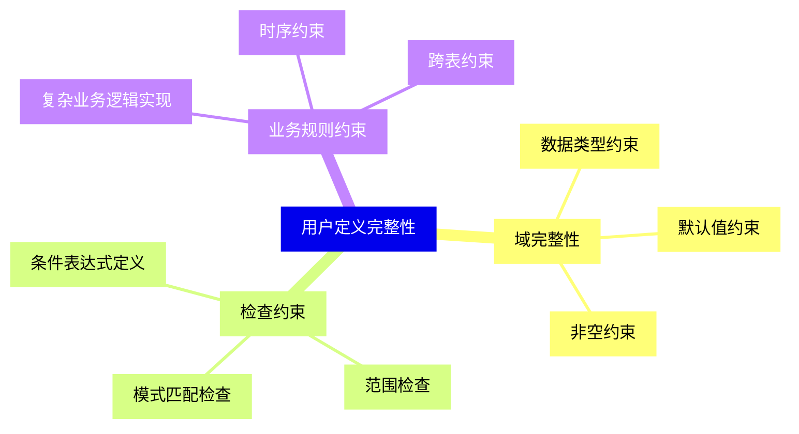
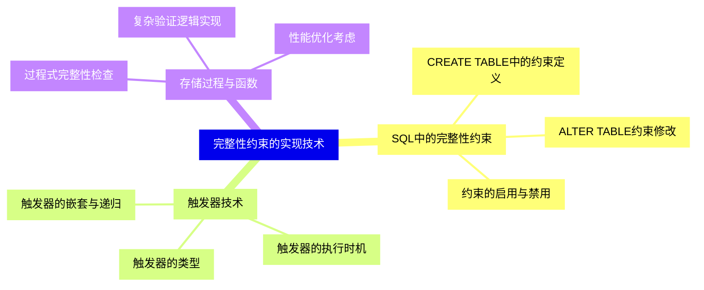
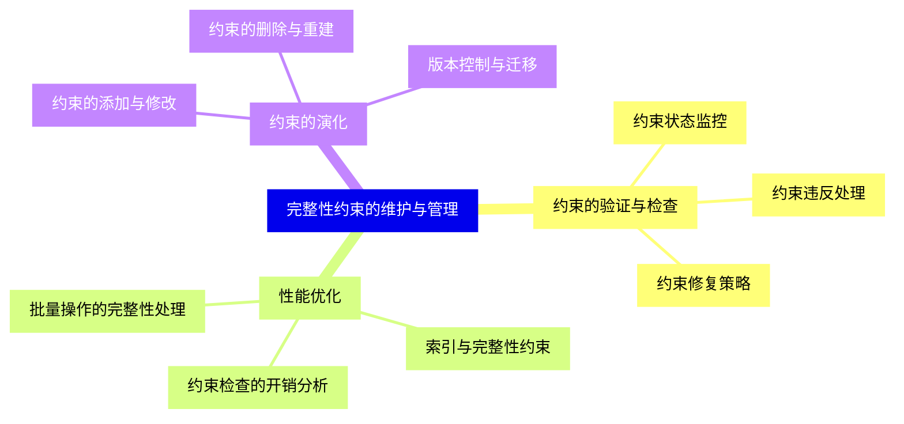
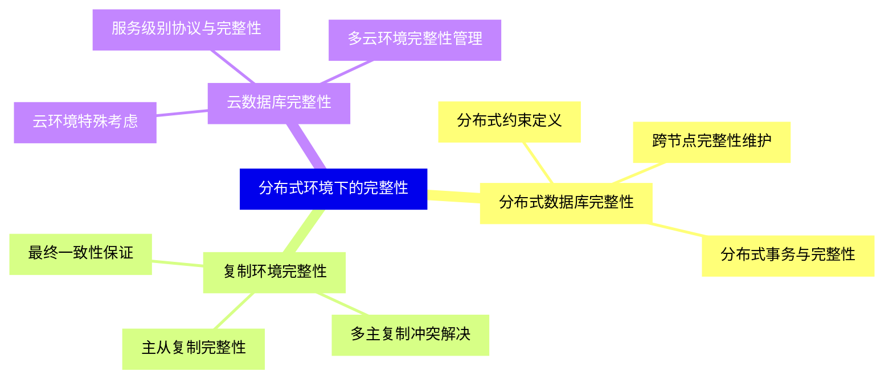
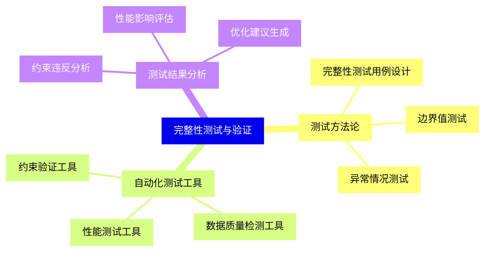
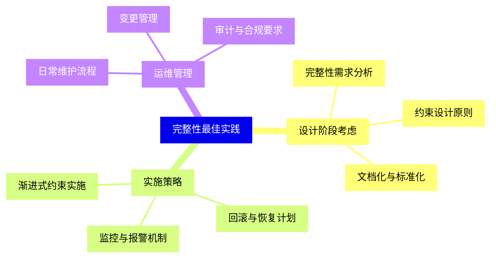


### 1 [数据库完整性概述](#1)
#### 1.1 [完整性的基本概念](#1)
##### 1.1.1 [完整性的定义与重要性](#1)
##### 1.1.2 [完整性与数据质量的关系](#1)
##### 1.1.3 [完整性的分类体系](#1)
#### 1.2 [完整性约束的作用](#1)
##### 1.2.1 [保证数据一致性](#1)
##### 1.2.2 [防止数据异常](#1)
##### 1.2.3 [维护业务规则](#1)
#### 1.3 [完整性实现机制](#1)
##### 1.3.1 [声明式完整性约束](#1)
##### 1.3.2 [过程式完整性控制](#1)
##### 1.3.3 [触发器与存储过程](#1)
### 2 [实体完整性](#2)
#### 2.1 [主键约束](#2)
##### 2.1.1 [主键的定义与特性](#2)
##### 2.1.2 [单字段主键与复合主键](#2)
##### 2.1.3 [主键选择策略](#2)
#### 2.2 [唯一性约束](#2)
##### 2.2.1 [唯一约束与主键的区别](#2)
##### 2.2.2 [唯一索引的实现](#2)
##### 2.2.3 [空值处理规则](#2)
#### 2.3 [实体完整性的实施](#2)
##### 2.3.1 [创建时的完整性检查](#2)
##### 2.3.2 [更新时的完整性维护](#2)
##### 2.3.3 [删除操作的完整性保护](#2)
### 3 [参照完整性](#3)
#### 3.1 [外键约束](#3)
##### 3.1.1 [外键的定义与作用](#3)
##### 3.1.2 [参照关系建立](#3)
##### 3.1.3 [外键约束级别](#3)
#### 3.2 [参照完整性规则](#3)
##### 3.2.1 [插入规则](#3)
##### 3.2.2 [更新规则](#3)
##### 3.2.3 [删除规则](#3)
#### 3.3 [级联操作](#3)
##### 3.3.1 [级联更新](#3)
##### 3.3.2 [级联删除](#3)
##### 3.3.3 [级联操作的风险控制](#3)
### 4 [用户定义完整性](#4)
#### 4.1 [域完整性](#4)
##### 4.1.1 [数据类型约束](#4)
##### 4.1.2 [默认值约束](#4)
##### 4.1.3 [非空约束](#4)
#### 4.2 [检查约束](#4)
##### 4.2.1 [条件表达式定义](#4)
##### 4.2.2 [范围检查](#4)
##### 4.2.3 [模式匹配检查](#4)
#### 4.3 [业务规则约束](#4)
##### 4.3.1 [复杂业务逻辑实现](#4)
##### 4.3.2 [跨表约束](#4)
##### 4.3.3 [时序约束](#4)
### 5 [完整性约束的实现技术](#5)
#### 5.1 [SQL中的完整性约束](#5)
##### 5.1.1 [CREATE TABLE中的约束定义](#5)
##### 5.1.2 [ALTER TABLE约束修改](#5)
##### 5.1.3 [约束的启用与禁用](#5)
#### 5.2 [触发器技术](#5)
##### 5.2.1 [触发器的类型](#5)
##### 5.2.2 [触发器的执行时机](#5)
##### 5.2.3 [触发器的嵌套与递归](#5)
#### 5.3 [存储过程与函数](#5)
##### 5.3.1 [过程式完整性检查](#5)
##### 5.3.2 [复杂验证逻辑实现](#5)
##### 5.3.3 [性能优化考虑](#5)
### 6 [完整性约束的维护与管理](#6)
#### 6.1 [约束的验证与检查](#6)
##### 6.1.1 [约束状态监控](#6)
##### 6.1.2 [约束违反处理](#6)
##### 6.1.3 [约束修复策略](#6)
#### 6.2 [性能优化](#6)
##### 6.2.1 [约束检查的开销分析](#6)
##### 6.2.2 [索引与完整性约束](#6)
##### 6.2.3 [批量操作的完整性处理](#6)
#### 6.3 [约束的演化](#6)
##### 6.3.1 [约束的添加与修改](#6)
##### 6.3.2 [约束的删除与重建](#6)
##### 6.3.3 [版本控制与迁移](#6)
### 7 [分布式环境下的完整性](#7)
#### 7.1 [分布式数据库完整性](#7)
##### 7.1.1 [分布式约束定义](#7)
##### 7.1.2 [跨节点完整性维护](#7)
##### 7.1.3 [分布式事务与完整性](#7)
#### 7.2 [复制环境完整性](#7)
##### 7.2.1 [主从复制完整性](#7)
##### 7.2.2 [多主复制冲突解决](#7)
##### 7.2.3 [最终一致性保证](#7)
#### 7.3 [云数据库完整性](#7)
##### 7.3.1 [云环境特殊考虑](#7)
##### 7.3.2 [服务级别协议与完整性](#7)
##### 7.3.3 [多云环境完整性管理](#7)
### 8 [完整性测试与验证](#8)
#### 8.1 [测试方法论](#8)
##### 8.1.1 [完整性测试用例设计](#8)
##### 8.1.2 [边界值测试](#8)
##### 8.1.3 [异常情况测试](#8)
#### 8.2 [自动化测试工具](#8)
##### 8.2.1 [约束验证工具](#8)
##### 8.2.2 [数据质量检测工具](#8)
##### 8.2.3 [性能测试工具](#8)
#### 8.3 [测试结果分析](#8)
##### 8.3.1 [约束违反分析](#8)
##### 8.3.2 [性能影响评估](#8)
##### 8.3.3 [优化建议生成](#8)
### 9 [完整性最佳实践](#9)
#### 9.1 [设计阶段考虑](#9)
##### 9.1.1 [完整性需求分析](#9)
##### 9.1.2 [约束设计原则](#9)
##### 9.1.3 [文档化与标准化](#9)
#### 9.2 [实施策略](#9)
##### 9.2.1 [渐进式约束实施](#9)
##### 9.2.2 [回滚与恢复计划](#9)
##### 9.2.3 [监控与报警机制](#9)
#### 9.3 [运维管理](#9)
##### 9.3.1 [日常维护流程](#9)
##### 9.3.2 [变更管理](#9)
##### 9.3.3 [审计与合规要求](#9)




### 1 数据库完整性概述

---
### 1 数据库完整性概述
___
#### 1.1 完整性的基本概念
___
##### 1.1.1 完整性的定义与重要性
___
##### 1.1.2 完整性与数据质量的关系
___
##### 1.1.3 完整性的分类体系
___
#### 1.2 完整性约束的作用
___
##### 1.2.1 保证数据一致性
___
##### 1.2.2 防止数据异常
___
##### 1.2.3 维护业务规则
___
#### 1.3 完整性实现机制
___
##### 1.3.1 声明式完整性约束
___
##### 1.3.2 过程式完整性控制
___
##### 1.3.3 触发器与存储过程
### 2 实体完整性

---
### 2 实体完整性
___
#### 2.1 主键约束
___
##### 2.1.1 主键的定义与特性
___
##### 2.1.2 单字段主键与复合主键
___
##### 2.1.3 主键选择策略
___
#### 2.2 唯一性约束
___
##### 2.2.1 唯一约束与主键的区别
___
##### 2.2.2 唯一索引的实现
___
##### 2.2.3 空值处理规则
___
#### 2.3 实体完整性的实施
___
##### 2.3.1 创建时的完整性检查
___
##### 2.3.2 更新时的完整性维护
___
##### 2.3.3 删除操作的完整性保护
### 3 参照完整性

---
### 3 参照完整性
___
#### 3.1 外键约束
___
##### 3.1.1 外键的定义与作用
___
##### 3.1.2 参照关系建立
___
##### 3.1.3 外键约束级别
___
#### 3.2 参照完整性规则
___
##### 3.2.1 插入规则
___
##### 3.2.2 更新规则
___
##### 3.2.3 删除规则
___
#### 3.3 级联操作
___
##### 3.3.1 级联更新
___
##### 3.3.2 级联删除
___
##### 3.3.3 级联操作的风险控制
### 4 用户定义完整性

---
### 4 用户定义完整性
___
#### 4.1 域完整性
___
##### 4.1.1 数据类型约束
___
##### 4.1.2 默认值约束
___
##### 4.1.3 非空约束
___
#### 4.2 检查约束
___
##### 4.2.1 条件表达式定义
___
##### 4.2.2 范围检查
___
##### 4.2.3 模式匹配检查
___
#### 4.3 业务规则约束
___
##### 4.3.1 复杂业务逻辑实现
___
##### 4.3.2 跨表约束
___
##### 4.3.3 时序约束
### 5 完整性约束的实现技术

---
### 5 完整性约束的实现技术
___
#### 5.1 SQL中的完整性约束
___
##### 5.1.1 CREATE TABLE中的约束定义
___
##### 5.1.2 ALTER TABLE约束修改
___
##### 5.1.3 约束的启用与禁用
___
#### 5.2 触发器技术
___
##### 5.2.1 触发器的类型
___
##### 5.2.2 触发器的执行时机
___
##### 5.2.3 触发器的嵌套与递归
___
#### 5.3 存储过程与函数
___
##### 5.3.1 过程式完整性检查
___
##### 5.3.2 复杂验证逻辑实现
___
##### 5.3.3 性能优化考虑
### 6 完整性约束的维护与管理

---
### 6 完整性约束的维护与管理
___
#### 6.1 约束的验证与检查
___
##### 6.1.1 约束状态监控
___
##### 6.1.2 约束违反处理
___
##### 6.1.3 约束修复策略
___
#### 6.2 性能优化
___
##### 6.2.1 约束检查的开销分析
___
##### 6.2.2 索引与完整性约束
___
##### 6.2.3 批量操作的完整性处理
___
#### 6.3 约束的演化
___
##### 6.3.1 约束的添加与修改
___
##### 6.3.2 约束的删除与重建
___
##### 6.3.3 版本控制与迁移
### 7 分布式环境下的完整性

---
### 7 分布式环境下的完整性
___
#### 7.1 分布式数据库完整性
___
##### 7.1.1 分布式约束定义
___
##### 7.1.2 跨节点完整性维护
___
##### 7.1.3 分布式事务与完整性
___
#### 7.2 复制环境完整性
___
##### 7.2.1 主从复制完整性
___
##### 7.2.2 多主复制冲突解决
___
##### 7.2.3 最终一致性保证
___
#### 7.3 云数据库完整性
___
##### 7.3.1 云环境特殊考虑
___
##### 7.3.2 服务级别协议与完整性
___
##### 7.3.3 多云环境完整性管理
### 8 完整性测试与验证

---
### 8 完整性测试与验证
___
#### 8.1 测试方法论
___
##### 8.1.1 完整性测试用例设计
___
##### 8.1.2 边界值测试
___
##### 8.1.3 异常情况测试
___
#### 8.2 自动化测试工具
___
##### 8.2.1 约束验证工具
___
##### 8.2.2 数据质量检测工具
___
##### 8.2.3 性能测试工具
___
#### 8.3 测试结果分析
___
##### 8.3.1 约束违反分析
___
##### 8.3.2 性能影响评估
___
##### 8.3.3 优化建议生成
### 9 完整性最佳实践

---
### 9 完整性最佳实践
___
#### 9.1 设计阶段考虑
___
##### 9.1.1 完整性需求分析
___
##### 9.1.2 约束设计原则
___
##### 9.1.3 文档化与标准化
___
#### 9.2 实施策略
___
##### 9.2.1 渐进式约束实施
___
##### 9.2.2 回滚与恢复计划
___
##### 9.2.3 监控与报警机制
___
#### 9.3 运维管理
___
##### 9.3.1 日常维护流程
___
##### 9.3.2 变更管理
___
##### 9.3.3 审计与合规要求


### 1 数据库完整性概述{#1}

{}

<--->
{}
{}
{}
{}
{}
{}
{}
{}
{}
{}
{}
{}
{}
{}
{}
{}
{}
{}
{}
{}
{}
{}
{}
{}
{}

### 2 实体完整性{#2}

{}
{}
{}
{}
{}
{}
{}
{}
{}
{}
{}
{}
{}
{}
{}
{}
{}
{}
{}
{}
{}
{}
{}
{}
{}
<--->

{}

### 3 参照完整性{#3}

{}

<--->
{}
{}
{}
{}
{}
{}
{}
{}
{}
{}
{}
{}
{}
{}
{}
{}
{}
{}
{}
{}
{}
{}
{}
{}
{}

### 4 用户定义完整性{#4}

{}
{}
{}
{}
{}
{}
{}
{}
{}
{}
{}
{}
{}
{}
{}
{}
{}
{}
{}
{}
{}
{}
{}
{}
{}
<--->

{}

### 5 完整性约束的实现技术{#5}

{}

<--->
{}
{}
{}
{}
{}
{}
{}
{}
{}
{}
{}
{}
{}
{}
{}
{}
{}
{}
{}
{}
{}
{}
{}
{}
{}

### 6 完整性约束的维护与管理{#6}

{}
{}
{}
{}
{}
{}
{}
{}
{}
{}
{}
{}
{}
{}
{}
{}
{}
{}
{}
{}
{}
{}
{}
{}
{}
<--->

{}

### 7 分布式环境下的完整性{#7}

{}

<--->
{}
{}
{}
{}
{}
{}
{}
{}
{}
{}
{}
{}
{}
{}
{}
{}
{}
{}
{}
{}
{}
{}
{}
{}
{}

### 8 完整性测试与验证{#8}

{}
{}
{}
{}
{}
{}
{}
{}
{}
{}
{}
{}
{}
{}
{}
{}
{}
{}
{}
{}
{}
{}
{}
{}
{}
<--->

{}

### 9 完整性最佳实践{#9}

{}

<--->
{}
{}
{}
{}
{}
{}
{}
{}
{}
{}
{}
{}
{}
{}
{}
{}
{}
{}
{}
{}
{}
{}
{}
{}
{}
