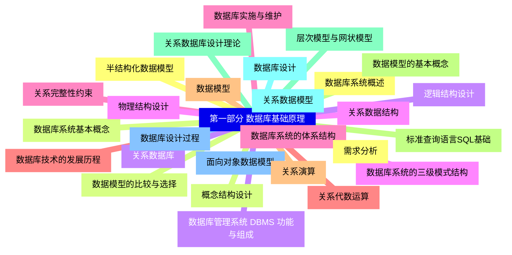
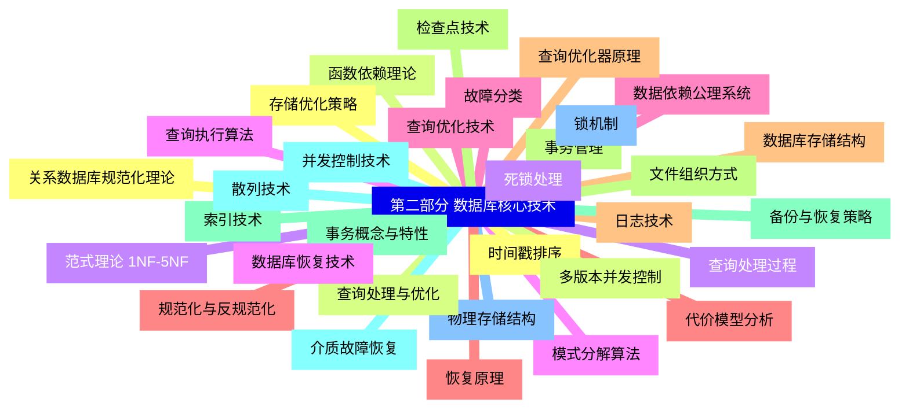
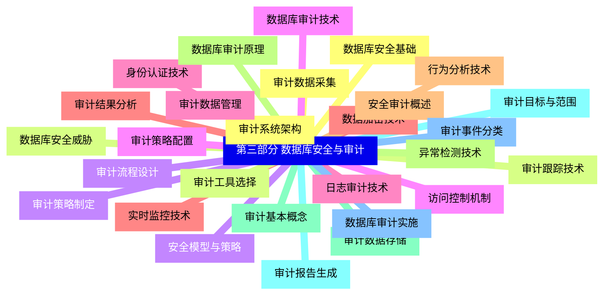
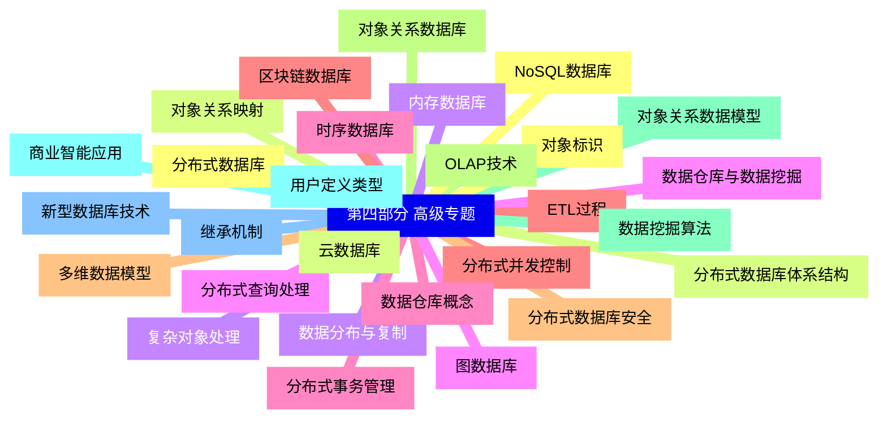
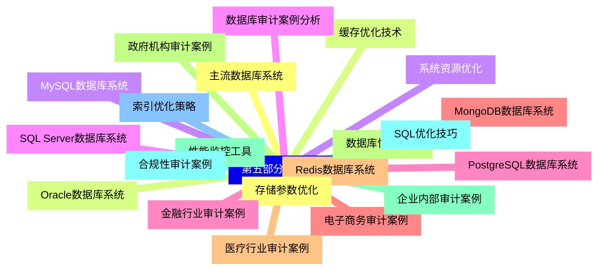


### 1 [第一部分 数据库基础原理](#1)
#### 1.1 [数据库系统概述](#1)
#### 1.2 [数据库系统基本概念](#1)
#### 1.3 [数据库管理系统 DBMS 功能与组成](#1)
#### 1.4 [数据库系统的三级模式结构](#1)
#### 1.5 [数据库系统的体系结构](#1)
#### 1.6 [数据库技术的发展历程](#1)
#### 1.7 [数据模型](#1)
#### 1.8 [数据模型的基本概念](#1)
#### 1.9 [层次模型与网状模型](#1)
#### 1.10 [关系数据模型](#1)
#### 1.11 [面向对象数据模型](#1)
#### 1.12 [半结构化数据模型](#1)
#### 1.13 [数据模型的比较与选择](#1)
#### 1.14 [关系数据库](#1)
#### 1.15 [关系数据结构](#1)
#### 1.16 [关系完整性约束](#1)
#### 1.17 [关系代数运算](#1)
#### 1.18 [关系演算](#1)
#### 1.19 [标准查询语言SQL基础](#1)
#### 1.20 [关系数据库设计理论](#1)
#### 1.21 [数据库设计](#1)
#### 1.22 [数据库设计过程](#1)
#### 1.23 [需求分析](#1)
#### 1.24 [概念结构设计](#1)
#### 1.25 [逻辑结构设计](#1)
#### 1.26 [物理结构设计](#1)
#### 1.27 [数据库实施与维护](#1)
### 2 [第二部分 数据库核心技术](#2)
#### 2.1 [关系数据库规范化理论](#2)
#### 2.2 [函数依赖理论](#2)
#### 2.3 [范式理论 1NF-5NF](#2)
#### 2.4 [模式分解算法](#2)
#### 2.5 [数据依赖公理系统](#2)
#### 2.6 [规范化与反规范化](#2)
#### 2.7 [数据库存储结构](#2)
#### 2.8 [文件组织方式](#2)
#### 2.9 [索引技术](#2)
#### 2.10 [散列技术](#2)
#### 2.11 [物理存储结构](#2)
#### 2.12 [存储优化策略](#2)
#### 2.13 [查询处理与优化](#2)
#### 2.14 [查询处理过程](#2)
#### 2.15 [查询执行算法](#2)
#### 2.16 [查询优化技术](#2)
#### 2.17 [代价模型分析](#2)
#### 2.18 [查询优化器原理](#2)
#### 2.19 [事务管理](#2)
#### 2.20 [事务概念与特性](#2)
#### 2.21 [并发控制技术](#2)
#### 2.22 [锁机制](#2)
#### 2.23 [时间戳排序](#2)
#### 2.24 [多版本并发控制](#2)
#### 2.25 [死锁处理](#2)
#### 2.26 [数据库恢复技术](#2)
#### 2.27 [故障分类](#2)
#### 2.28 [恢复原理](#2)
#### 2.29 [日志技术](#2)
#### 2.30 [检查点技术](#2)
#### 2.31 [备份与恢复策略](#2)
#### 2.32 [介质故障恢复](#2)
### 3 [第三部分 数据库安全与审计](#3)
#### 3.1 [数据库安全基础](#3)
#### 3.2 [数据库安全威胁](#3)
#### 3.3 [安全模型与策略](#3)
#### 3.4 [访问控制机制](#3)
#### 3.5 [身份认证技术](#3)
#### 3.6 [数据加密技术](#3)
#### 3.7 [安全审计概述](#3)
#### 3.8 [数据库审计原理](#3)
#### 3.9 [审计基本概念](#3)
#### 3.10 [审计目标与范围](#3)
#### 3.11 [审计事件分类](#3)
#### 3.12 [审计数据采集](#3)
#### 3.13 [审计跟踪技术](#3)
#### 3.14 [审计策略制定](#3)
#### 3.15 [数据库审计技术](#3)
#### 3.16 [日志审计技术](#3)
#### 3.17 [实时监控技术](#3)
#### 3.18 [行为分析技术](#3)
#### 3.19 [异常检测技术](#3)
#### 3.20 [审计数据存储](#3)
#### 3.21 [审计报告生成](#3)
#### 3.22 [数据库审计实施](#3)
#### 3.23 [审计系统架构](#3)
#### 3.24 [审计工具选择](#3)
#### 3.25 [审计流程设计](#3)
#### 3.26 [审计策略配置](#3)
#### 3.27 [审计数据管理](#3)
#### 3.28 [审计结果分析](#3)
### 4 [第四部分 高级专题](#4)
#### 4.1 [分布式数据库](#4)
#### 4.2 [分布式数据库体系结构](#4)
#### 4.3 [数据分布与复制](#4)
#### 4.4 [分布式查询处理](#4)
#### 4.5 [分布式事务管理](#4)
#### 4.6 [分布式并发控制](#4)
#### 4.7 [分布式数据库安全](#4)
#### 4.8 [对象关系数据库](#4)
#### 4.9 [对象关系数据模型](#4)
#### 4.10 [用户定义类型](#4)
#### 4.11 [继承机制](#4)
#### 4.12 [对象标识](#4)
#### 4.13 [对象关系映射](#4)
#### 4.14 [复杂对象处理](#4)
#### 4.15 [数据仓库与数据挖掘](#4)
#### 4.16 [数据仓库概念](#4)
#### 4.17 [ETL过程](#4)
#### 4.18 [多维数据模型](#4)
#### 4.19 [OLAP技术](#4)
#### 4.20 [数据挖掘算法](#4)
#### 4.21 [商业智能应用](#4)
#### 4.22 [新型数据库技术](#4)
#### 4.23 [NoSQL数据库](#4)
#### 4.24 [云数据库](#4)
#### 4.25 [内存数据库](#4)
#### 4.26 [图数据库](#4)
#### 4.27 [时序数据库](#4)
#### 4.28 [区块链数据库](#4)
### 5 [第五部分 实践应用](#5)
#### 5.1 [主流数据库系统](#5)
#### 5.2 [Oracle数据库系统](#5)
#### 5.3 [MySQL数据库系统](#5)
#### 5.4 [SQL Server数据库系统](#5)
#### 5.5 [PostgreSQL数据库系统](#5)
#### 5.6 [MongoDB数据库系统](#5)
#### 5.7 [Redis数据库系统](#5)
#### 5.8 [数据库性能调优](#5)
#### 5.9 [性能监控工具](#5)
#### 5.10 [SQL优化技巧](#5)
#### 5.11 [索引优化策略](#5)
#### 5.12 [存储参数优化](#5)
#### 5.13 [缓存优化技术](#5)
#### 5.14 [系统资源优化](#5)
#### 5.15 [数据库审计案例分析](#5)
#### 5.16 [金融行业审计案例](#5)
#### 5.17 [电子商务审计案例](#5)
#### 5.18 [医疗行业审计案例](#5)
#### 5.19 [政府机构审计案例](#5)
#### 5.20 [企业内部审计案例](#5)
#### 5.21 [合规性审计案例](#5)




### 1 第一部分 数据库基础原理

---
### 1 第一部分 数据库基础原理
___
#### 1.1 数据库系统概述
___
#### 1.2 数据库系统基本概念
___
#### 1.3 数据库管理系统 DBMS 功能与组成
___
#### 1.4 数据库系统的三级模式结构
___
#### 1.5 数据库系统的体系结构
___
#### 1.6 数据库技术的发展历程
___
#### 1.7 数据模型
___
#### 1.8 数据模型的基本概念
___
#### 1.9 层次模型与网状模型
___
#### 1.10 关系数据模型
___
#### 1.11 面向对象数据模型
___
#### 1.12 半结构化数据模型
___
#### 1.13 数据模型的比较与选择
___
#### 1.14 关系数据库
___
#### 1.15 关系数据结构
___
#### 1.16 关系完整性约束
___
#### 1.17 关系代数运算
___
#### 1.18 关系演算
___
#### 1.19 标准查询语言SQL基础
___
#### 1.20 关系数据库设计理论
___
#### 1.21 数据库设计
___
#### 1.22 数据库设计过程
___
#### 1.23 需求分析
___
#### 1.24 概念结构设计
___
#### 1.25 逻辑结构设计
___
#### 1.26 物理结构设计
___
#### 1.27 数据库实施与维护
### 2 第二部分 数据库核心技术

---
### 2 第二部分 数据库核心技术
___
#### 2.1 关系数据库规范化理论
___
#### 2.2 函数依赖理论
___
#### 2.3 范式理论 1NF-5NF
___
#### 2.4 模式分解算法
___
#### 2.5 数据依赖公理系统
___
#### 2.6 规范化与反规范化
___
#### 2.7 数据库存储结构
___
#### 2.8 文件组织方式
___
#### 2.9 索引技术
___
#### 2.10 散列技术
___
#### 2.11 物理存储结构
___
#### 2.12 存储优化策略
___
#### 2.13 查询处理与优化
___
#### 2.14 查询处理过程
___
#### 2.15 查询执行算法
___
#### 2.16 查询优化技术
___
#### 2.17 代价模型分析
___
#### 2.18 查询优化器原理
___
#### 2.19 事务管理
___
#### 2.20 事务概念与特性
___
#### 2.21 并发控制技术
___
#### 2.22 锁机制
___
#### 2.23 时间戳排序
___
#### 2.24 多版本并发控制
___
#### 2.25 死锁处理
___
#### 2.26 数据库恢复技术
___
#### 2.27 故障分类
___
#### 2.28 恢复原理
___
#### 2.29 日志技术
___
#### 2.30 检查点技术
___
#### 2.31 备份与恢复策略
___
#### 2.32 介质故障恢复
### 3 第三部分 数据库安全与审计

---
### 3 第三部分 数据库安全与审计
___
#### 3.1 数据库安全基础
___
#### 3.2 数据库安全威胁
___
#### 3.3 安全模型与策略
___
#### 3.4 访问控制机制
___
#### 3.5 身份认证技术
___
#### 3.6 数据加密技术
___
#### 3.7 安全审计概述
___
#### 3.8 数据库审计原理
___
#### 3.9 审计基本概念
___
#### 3.10 审计目标与范围
___
#### 3.11 审计事件分类
___
#### 3.12 审计数据采集
___
#### 3.13 审计跟踪技术
___
#### 3.14 审计策略制定
___
#### 3.15 数据库审计技术
___
#### 3.16 日志审计技术
___
#### 3.17 实时监控技术
___
#### 3.18 行为分析技术
___
#### 3.19 异常检测技术
___
#### 3.20 审计数据存储
___
#### 3.21 审计报告生成
___
#### 3.22 数据库审计实施
___
#### 3.23 审计系统架构
___
#### 3.24 审计工具选择
___
#### 3.25 审计流程设计
___
#### 3.26 审计策略配置
___
#### 3.27 审计数据管理
___
#### 3.28 审计结果分析
### 4 第四部分 高级专题

---
### 4 第四部分 高级专题
___
#### 4.1 分布式数据库
___
#### 4.2 分布式数据库体系结构
___
#### 4.3 数据分布与复制
___
#### 4.4 分布式查询处理
___
#### 4.5 分布式事务管理
___
#### 4.6 分布式并发控制
___
#### 4.7 分布式数据库安全
___
#### 4.8 对象关系数据库
___
#### 4.9 对象关系数据模型
___
#### 4.10 用户定义类型
___
#### 4.11 继承机制
___
#### 4.12 对象标识
___
#### 4.13 对象关系映射
___
#### 4.14 复杂对象处理
___
#### 4.15 数据仓库与数据挖掘
___
#### 4.16 数据仓库概念
___
#### 4.17 ETL过程
___
#### 4.18 多维数据模型
___
#### 4.19 OLAP技术
___
#### 4.20 数据挖掘算法
___
#### 4.21 商业智能应用
___
#### 4.22 新型数据库技术
___
#### 4.23 NoSQL数据库
___
#### 4.24 云数据库
___
#### 4.25 内存数据库
___
#### 4.26 图数据库
___
#### 4.27 时序数据库
___
#### 4.28 区块链数据库
### 5 第五部分 实践应用

---
### 5 第五部分 实践应用
___
#### 5.1 主流数据库系统
___
#### 5.2 Oracle数据库系统
___
#### 5.3 MySQL数据库系统
___
#### 5.4 SQL Server数据库系统
___
#### 5.5 PostgreSQL数据库系统
___
#### 5.6 MongoDB数据库系统
___
#### 5.7 Redis数据库系统
___
#### 5.8 数据库性能调优
___
#### 5.9 性能监控工具
___
#### 5.10 SQL优化技巧
___
#### 5.11 索引优化策略
___
#### 5.12 存储参数优化
___
#### 5.13 缓存优化技术
___
#### 5.14 系统资源优化
___
#### 5.15 数据库审计案例分析
___
#### 5.16 金融行业审计案例
___
#### 5.17 电子商务审计案例
___
#### 5.18 医疗行业审计案例
___
#### 5.19 政府机构审计案例
___
#### 5.20 企业内部审计案例
___
#### 5.21 合规性审计案例


### 1 第一部分 数据库基础原理{#1}

{}

<--->
{}
{}
{}
{}
{}
{}
{}
{}
{}
{}
{}
{}
{}
{}
{}
{}
{}
{}
{}
{}
{}
{}
{}
{}
{}
{}
{}
{}
{}
{}
{}
{}
{}
{}
{}
{}
{}
{}
{}
{}
{}
{}
{}
{}
{}
{}
{}
{}
{}
{}
{}
{}
{}
{}
{}

### 2 第二部分 数据库核心技术{#2}

{}
{}
{}
{}
{}
{}
{}
{}
{}
{}
{}
{}
{}
{}
{}
{}
{}
{}
{}
{}
{}
{}
{}
{}
{}
{}
{}
{}
{}
{}
{}
{}
{}
{}
{}
{}
{}
{}
{}
{}
{}
{}
{}
{}
{}
{}
{}
{}
{}
{}
{}
{}
{}
{}
{}
{}
{}
{}
{}
{}
{}
{}
{}
{}
{}
<--->

{}

### 3 第三部分 数据库安全与审计{#3}

{}

<--->
{}
{}
{}
{}
{}
{}
{}
{}
{}
{}
{}
{}
{}
{}
{}
{}
{}
{}
{}
{}
{}
{}
{}
{}
{}
{}
{}
{}
{}
{}
{}
{}
{}
{}
{}
{}
{}
{}
{}
{}
{}
{}
{}
{}
{}
{}
{}
{}
{}
{}
{}
{}
{}
{}
{}
{}
{}

### 4 第四部分 高级专题{#4}

{}
{}
{}
{}
{}
{}
{}
{}
{}
{}
{}
{}
{}
{}
{}
{}
{}
{}
{}
{}
{}
{}
{}
{}
{}
{}
{}
{}
{}
{}
{}
{}
{}
{}
{}
{}
{}
{}
{}
{}
{}
{}
{}
{}
{}
{}
{}
{}
{}
{}
{}
{}
{}
{}
{}
{}
{}
<--->

{}

### 5 第五部分 实践应用{#5}

{}

<--->
{}
{}
{}
{}
{}
{}
{}
{}
{}
{}
{}
{}
{}
{}
{}
{}
{}
{}
{}
{}
{}
{}
{}
{}
{}
{}
{}
{}
{}
{}
{}
{}
{}
{}
{}
{}
{}
{}
{}
{}
{}
{}
{}
