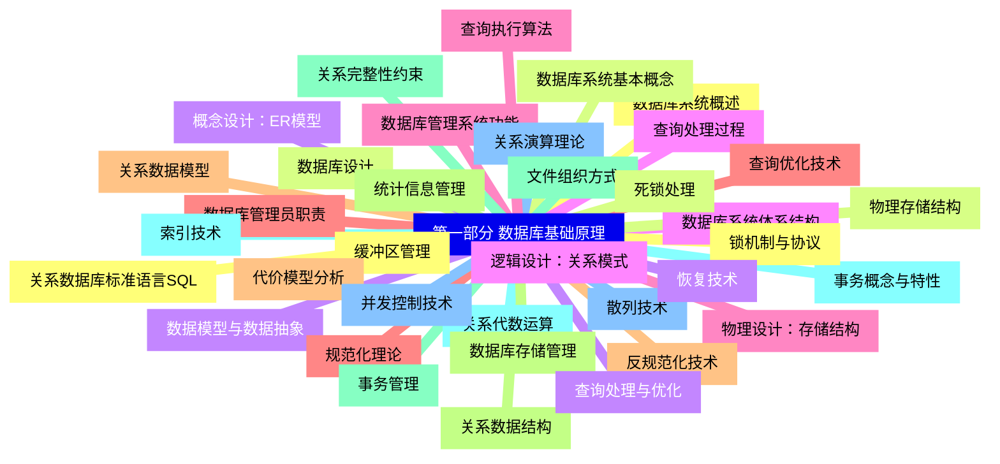
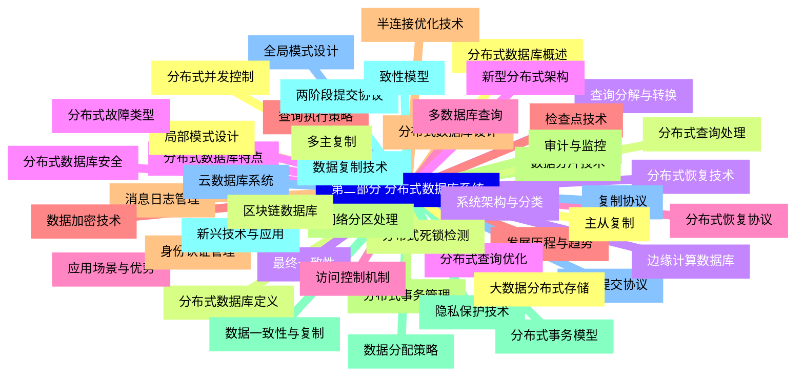


### 1 [第一部分 数据库基础原理](#1)
#### 1.1 [数据库系统概述](#1)
#### 1.2 [数据库系统基本概念](#1)
#### 1.3 [数据模型与数据抽象](#1)
#### 1.4 [数据库系统体系结构](#1)
#### 1.5 [数据库管理系统功能](#1)
#### 1.6 [数据库管理员职责](#1)
#### 1.7 [关系数据模型](#1)
#### 1.8 [关系数据结构](#1)
#### 1.9 [关系完整性约束](#1)
#### 1.10 [关系代数运算](#1)
#### 1.11 [关系演算理论](#1)
#### 1.12 [关系数据库标准语言SQL](#1)
#### 1.13 [数据库设计](#1)
#### 1.14 [概念设计：ER模型](#1)
#### 1.15 [逻辑设计：关系模式](#1)
#### 1.16 [物理设计：存储结构](#1)
#### 1.17 [规范化理论](#1)
#### 1.18 [反规范化技术](#1)
#### 1.19 [数据库存储管理](#1)
#### 1.20 [文件组织方式](#1)
#### 1.21 [索引技术](#1)
#### 1.22 [散列技术](#1)
#### 1.23 [缓冲区管理](#1)
#### 1.24 [物理存储结构](#1)
#### 1.25 [查询处理与优化](#1)
#### 1.26 [查询处理过程](#1)
#### 1.27 [查询执行算法](#1)
#### 1.28 [查询优化技术](#1)
#### 1.29 [代价模型分析](#1)
#### 1.30 [统计信息管理](#1)
#### 1.31 [事务管理](#1)
#### 1.32 [事务概念与特性](#1)
#### 1.33 [并发控制技术](#1)
#### 1.34 [锁机制与协议](#1)
#### 1.35 [死锁处理](#1)
#### 1.36 [恢复技术](#1)
### 2 [第二部分 分布式数据库系统](#2)
#### 2.1 [分布式数据库概述](#2)
#### 2.2 [分布式数据库定义](#2)
#### 2.3 [系统架构与分类](#2)
#### 2.4 [分布式数据库特点](#2)
#### 2.5 [应用场景与优势](#2)
#### 2.6 [发展历程与趋势](#2)
#### 2.7 [分布式数据库设计](#2)
#### 2.8 [数据分片技术](#2)
#### 2.9 [数据分配策略](#2)
#### 2.10 [数据复制技术](#2)
#### 2.11 [全局模式设计](#2)
#### 2.12 [局部模式设计](#2)
#### 2.13 [分布式查询处理](#2)
#### 2.14 [查询分解与转换](#2)
#### 2.15 [分布式查询优化](#2)
#### 2.16 [多数据库查询](#2)
#### 2.17 [查询执行策略](#2)
#### 2.18 [半连接优化技术](#2)
#### 2.19 [分布式事务管理](#2)
#### 2.20 [分布式事务模型](#2)
#### 2.21 [两阶段提交协议](#2)
#### 2.22 [阶段提交协议](#2)
#### 2.23 [分布式并发控制](#2)
#### 2.24 [分布式死锁检测](#2)
#### 2.25 [分布式恢复技术](#2)
#### 2.26 [分布式故障类型](#2)
#### 2.27 [分布式恢复协议](#2)
#### 2.28 [检查点技术](#2)
#### 2.29 [消息日志管理](#2)
#### 2.30 [网络分区处理](#2)
#### 2.31 [数据一致性与复制](#2)
#### 2.32 [致性模型](#2)
#### 2.33 [复制协议](#2)
#### 2.34 [主从复制](#2)
#### 2.35 [多主复制](#2)
#### 2.36 [最终一致性](#2)
#### 2.37 [分布式数据库安全](#2)
#### 2.38 [访问控制机制](#2)
#### 2.39 [数据加密技术](#2)
#### 2.40 [身份认证管理](#2)
#### 2.41 [审计与监控](#2)
#### 2.42 [隐私保护技术](#2)
#### 2.43 [新兴技术与应用](#2)
#### 2.44 [云数据库系统](#2)
#### 2.45 [大数据分布式存储](#2)
#### 2.46 [区块链数据库](#2)
#### 2.47 [边缘计算数据库](#2)
#### 2.48 [新型分布式架构](#2)




### 1 第一部分 数据库基础原理

---
### 1 第一部分 数据库基础原理
___
#### 1.1 数据库系统概述
___
#### 1.2 数据库系统基本概念
___
#### 1.3 数据模型与数据抽象
___
#### 1.4 数据库系统体系结构
___
#### 1.5 数据库管理系统功能
___
#### 1.6 数据库管理员职责
___
#### 1.7 关系数据模型
___
#### 1.8 关系数据结构
___
#### 1.9 关系完整性约束
___
#### 1.10 关系代数运算
___
#### 1.11 关系演算理论
___
#### 1.12 关系数据库标准语言SQL
___
#### 1.13 数据库设计
___
#### 1.14 概念设计：ER模型
___
#### 1.15 逻辑设计：关系模式
___
#### 1.16 物理设计：存储结构
___
#### 1.17 规范化理论
___
#### 1.18 反规范化技术
___
#### 1.19 数据库存储管理
___
#### 1.20 文件组织方式
___
#### 1.21 索引技术
___
#### 1.22 散列技术
___
#### 1.23 缓冲区管理
___
#### 1.24 物理存储结构
___
#### 1.25 查询处理与优化
___
#### 1.26 查询处理过程
___
#### 1.27 查询执行算法
___
#### 1.28 查询优化技术
___
#### 1.29 代价模型分析
___
#### 1.30 统计信息管理
___
#### 1.31 事务管理
___
#### 1.32 事务概念与特性
___
#### 1.33 并发控制技术
___
#### 1.34 锁机制与协议
___
#### 1.35 死锁处理
___
#### 1.36 恢复技术
### 2 第二部分 分布式数据库系统

---
### 2 第二部分 分布式数据库系统
___
#### 2.1 分布式数据库概述
___
#### 2.2 分布式数据库定义
___
#### 2.3 系统架构与分类
___
#### 2.4 分布式数据库特点
___
#### 2.5 应用场景与优势
___
#### 2.6 发展历程与趋势
___
#### 2.7 分布式数据库设计
___
#### 2.8 数据分片技术
___
#### 2.9 数据分配策略
___
#### 2.10 数据复制技术
___
#### 2.11 全局模式设计
___
#### 2.12 局部模式设计
___
#### 2.13 分布式查询处理
___
#### 2.14 查询分解与转换
___
#### 2.15 分布式查询优化
___
#### 2.16 多数据库查询
___
#### 2.17 查询执行策略
___
#### 2.18 半连接优化技术
___
#### 2.19 分布式事务管理
___
#### 2.20 分布式事务模型
___
#### 2.21 两阶段提交协议
___
#### 2.22 阶段提交协议
___
#### 2.23 分布式并发控制
___
#### 2.24 分布式死锁检测
___
#### 2.25 分布式恢复技术
___
#### 2.26 分布式故障类型
___
#### 2.27 分布式恢复协议
___
#### 2.28 检查点技术
___
#### 2.29 消息日志管理
___
#### 2.30 网络分区处理
___
#### 2.31 数据一致性与复制
___
#### 2.32 致性模型
___
#### 2.33 复制协议
___
#### 2.34 主从复制
___
#### 2.35 多主复制
___
#### 2.36 最终一致性
___
#### 2.37 分布式数据库安全
___
#### 2.38 访问控制机制
___
#### 2.39 数据加密技术
___
#### 2.40 身份认证管理
___
#### 2.41 审计与监控
___
#### 2.42 隐私保护技术
___
#### 2.43 新兴技术与应用
___
#### 2.44 云数据库系统
___
#### 2.45 大数据分布式存储
___
#### 2.46 区块链数据库
___
#### 2.47 边缘计算数据库
___
#### 2.48 新型分布式架构


### 1 第一部分 数据库基础原理{#1}

{}

<--->
{}
{}
{}
{}
{}
{}
{}
{}
{}
{}
{}
{}
{}
{}
{}
{}
{}
{}
{}
{}
{}
{}
{}
{}
{}
{}
{}
{}
{}
{}
{}
{}
{}
{}
{}
{}
{}
{}
{}
{}
{}
{}
{}
{}
{}
{}
{}
{}
{}
{}
{}
{}
{}
{}
{}
{}
{}
{}
{}
{}
{}
{}
{}
{}
{}
{}
{}
{}
{}
{}
{}
{}
{}

### 2 第二部分 分布式数据库系统{#2}

{}
{}
{}
{}
{}
{}
{}
{}
{}
{}
{}
{}
{}
{}
{}
{}
{}
{}
{}
{}
{}
{}
{}
{}
{}
{}
{}
{}
{}
{}
{}
{}
{}
{}
{}
{}
{}
{}
{}
{}
{}
{}
{}
{}
{}
{}
{}
{}
{}
{}
{}
{}
{}
{}
{}
{}
{}
{}
{}
{}
{}
{}
{}
{}
{}
{}
{}
{}
{}
{}
{}
{}
{}
{}
{}
{}
{}
{}
{}
{}
{}
{}
{}
{}
{}
{}
{}
{}
{}
{}
{}
{}
{}
{}
{}
{}
{}
<--->

{}
