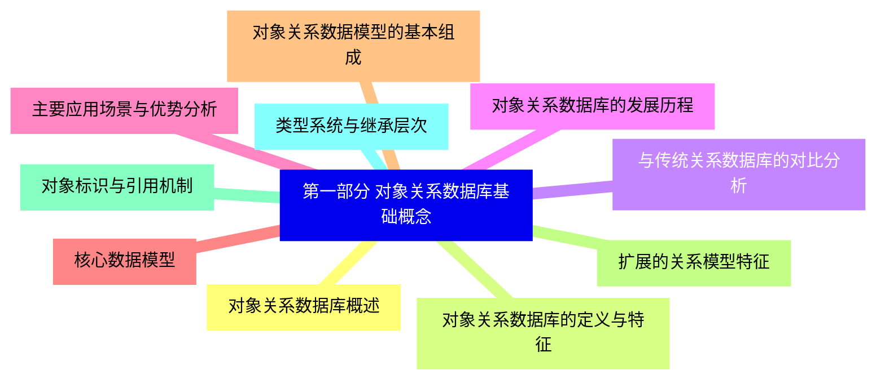
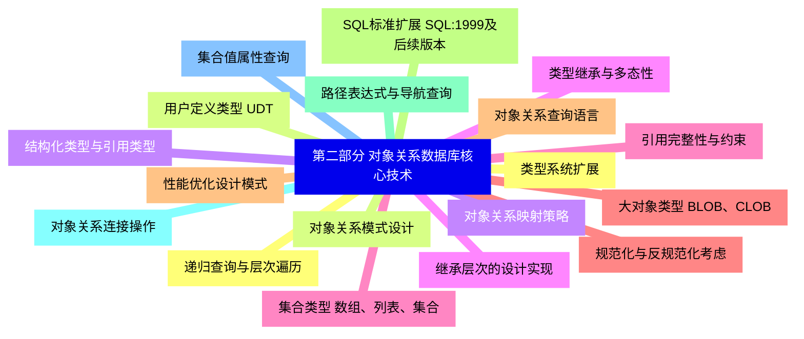
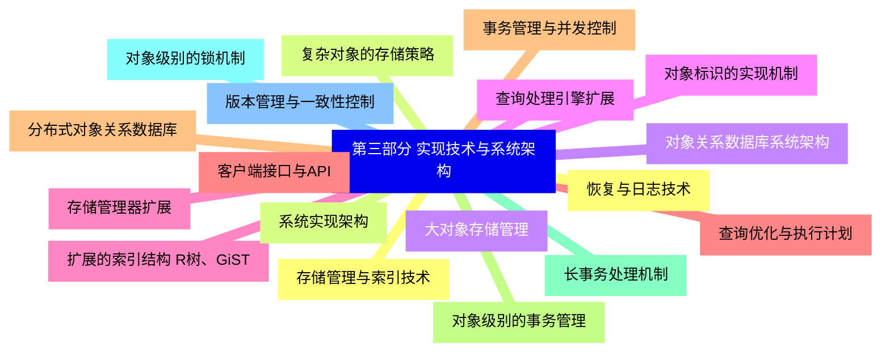
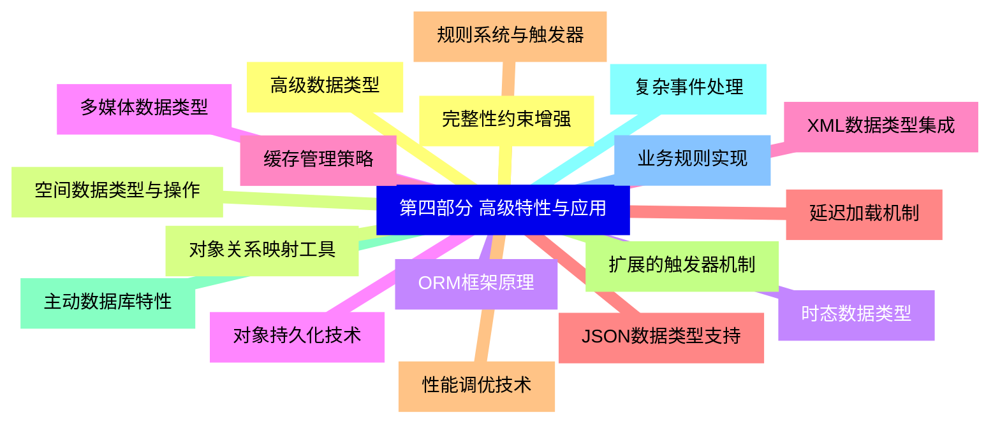
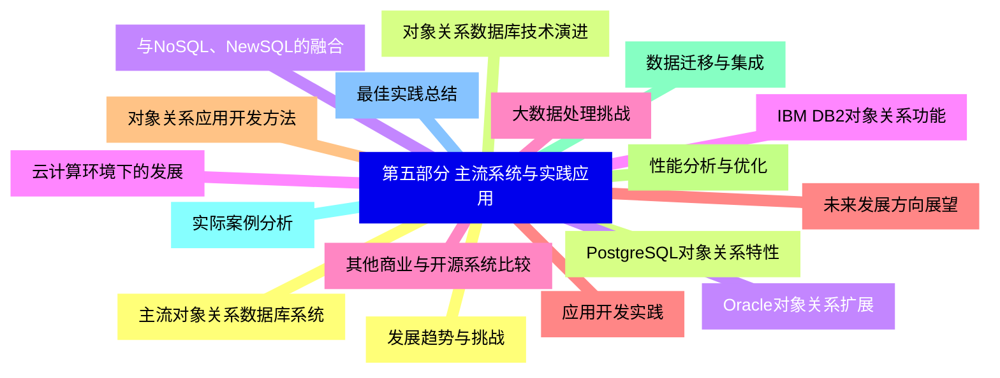


### 1 [第一部分 对象关系数据库基础概念](#1)
#### 1.1 [对象关系数据库概述](#1)
#### 1.2 [对象关系数据库的定义与特征](#1)
#### 1.3 [与传统关系数据库的对比分析](#1)
#### 1.4 [对象关系数据库的发展历程](#1)
#### 1.5 [主要应用场景与优势分析](#1)
#### 1.6 [核心数据模型](#1)
#### 1.7 [对象关系数据模型的基本组成](#1)
#### 1.8 [扩展的关系模型特征](#1)
#### 1.9 [对象标识与引用机制](#1)
#### 1.10 [类型系统与继承层次](#1)
### 2 [第二部分 对象关系数据库核心技术](#2)
#### 2.1 [类型系统扩展](#2)
#### 2.2 [用户定义类型 UDT](#2)
#### 2.3 [结构化类型与引用类型](#2)
#### 2.4 [类型继承与多态性](#2)
#### 2.5 [集合类型 数组、列表、集合](#2)
#### 2.6 [大对象类型 BLOB、CLOB](#2)
#### 2.7 [对象关系查询语言](#2)
#### 2.8 [SQL标准扩展 SQL:1999及后续版本](#2)
#### 2.9 [路径表达式与导航查询](#2)
#### 2.10 [对象关系连接操作](#2)
#### 2.11 [集合值属性查询](#2)
#### 2.12 [递归查询与层次遍历](#2)
#### 2.13 [对象关系模式设计](#2)
#### 2.14 [对象关系映射策略](#2)
#### 2.15 [继承层次的设计实现](#2)
#### 2.16 [引用完整性与约束](#2)
#### 2.17 [规范化与反规范化考虑](#2)
#### 2.18 [性能优化设计模式](#2)
### 3 [第三部分 实现技术与系统架构](#3)
#### 3.1 [存储管理与索引技术](#3)
#### 3.2 [复杂对象的存储策略](#3)
#### 3.3 [大对象存储管理](#3)
#### 3.4 [对象标识的实现机制](#3)
#### 3.5 [扩展的索引结构 R树、GiST](#3)
#### 3.6 [查询优化与执行计划](#3)
#### 3.7 [事务管理与并发控制](#3)
#### 3.8 [对象级别的事务管理](#3)
#### 3.9 [长事务处理机制](#3)
#### 3.10 [对象级别的锁机制](#3)
#### 3.11 [版本管理与一致性控制](#3)
#### 3.12 [恢复与日志技术](#3)
#### 3.13 [系统实现架构](#3)
#### 3.14 [对象关系数据库系统架构](#3)
#### 3.15 [查询处理引擎扩展](#3)
#### 3.16 [存储管理器扩展](#3)
#### 3.17 [客户端接口与API](#3)
#### 3.18 [分布式对象关系数据库](#3)
### 4 [第四部分 高级特性与应用](#4)
#### 4.1 [高级数据类型](#4)
#### 4.2 [空间数据类型与操作](#4)
#### 4.3 [时态数据类型](#4)
#### 4.4 [多媒体数据类型](#4)
#### 4.5 [XML数据类型集成](#4)
#### 4.6 [JSON数据类型支持](#4)
#### 4.7 [规则系统与触发器](#4)
#### 4.8 [扩展的触发器机制](#4)
#### 4.9 [主动数据库特性](#4)
#### 4.10 [复杂事件处理](#4)
#### 4.11 [业务规则实现](#4)
#### 4.12 [完整性约束增强](#4)
#### 4.13 [对象关系映射工具](#4)
#### 4.14 [ORM框架原理](#4)
#### 4.15 [对象持久化技术](#4)
#### 4.16 [缓存管理策略](#4)
#### 4.17 [延迟加载机制](#4)
#### 4.18 [性能调优技术](#4)
### 5 [第五部分 主流系统与实践应用](#5)
#### 5.1 [主流对象关系数据库系统](#5)
#### 5.2 [PostgreSQL对象关系特性](#5)
#### 5.3 [Oracle对象关系扩展](#5)
#### 5.4 [IBM DB2对象关系功能](#5)
#### 5.5 [其他商业与开源系统比较](#5)
#### 5.6 [应用开发实践](#5)
#### 5.7 [对象关系应用开发方法](#5)
#### 5.8 [性能分析与优化](#5)
#### 5.9 [数据迁移与集成](#5)
#### 5.10 [实际案例分析](#5)
#### 5.11 [最佳实践总结](#5)
#### 5.12 [发展趋势与挑战](#5)
#### 5.13 [对象关系数据库技术演进](#5)
#### 5.14 [与NoSQL、NewSQL的融合](#5)
#### 5.15 [云计算环境下的发展](#5)
#### 5.16 [大数据处理挑战](#5)
#### 5.17 [未来发展方向展望](#5)




### 1 第一部分 对象关系数据库基础概念

---
### 1 第一部分 对象关系数据库基础概念
___
#### 1.1 对象关系数据库概述
___
#### 1.2 对象关系数据库的定义与特征
___
#### 1.3 与传统关系数据库的对比分析
___
#### 1.4 对象关系数据库的发展历程
___
#### 1.5 主要应用场景与优势分析
___
#### 1.6 核心数据模型
___
#### 1.7 对象关系数据模型的基本组成
___
#### 1.8 扩展的关系模型特征
___
#### 1.9 对象标识与引用机制
___
#### 1.10 类型系统与继承层次
### 2 第二部分 对象关系数据库核心技术

---
### 2 第二部分 对象关系数据库核心技术
___
#### 2.1 类型系统扩展
___
#### 2.2 用户定义类型 UDT
___
#### 2.3 结构化类型与引用类型
___
#### 2.4 类型继承与多态性
___
#### 2.5 集合类型 数组、列表、集合
___
#### 2.6 大对象类型 BLOB、CLOB
___
#### 2.7 对象关系查询语言
___
#### 2.8 SQL标准扩展 SQL:1999及后续版本
___
#### 2.9 路径表达式与导航查询
___
#### 2.10 对象关系连接操作
___
#### 2.11 集合值属性查询
___
#### 2.12 递归查询与层次遍历
___
#### 2.13 对象关系模式设计
___
#### 2.14 对象关系映射策略
___
#### 2.15 继承层次的设计实现
___
#### 2.16 引用完整性与约束
___
#### 2.17 规范化与反规范化考虑
___
#### 2.18 性能优化设计模式
### 3 第三部分 实现技术与系统架构

---
### 3 第三部分 实现技术与系统架构
___
#### 3.1 存储管理与索引技术
___
#### 3.2 复杂对象的存储策略
___
#### 3.3 大对象存储管理
___
#### 3.4 对象标识的实现机制
___
#### 3.5 扩展的索引结构 R树、GiST
___
#### 3.6 查询优化与执行计划
___
#### 3.7 事务管理与并发控制
___
#### 3.8 对象级别的事务管理
___
#### 3.9 长事务处理机制
___
#### 3.10 对象级别的锁机制
___
#### 3.11 版本管理与一致性控制
___
#### 3.12 恢复与日志技术
___
#### 3.13 系统实现架构
___
#### 3.14 对象关系数据库系统架构
___
#### 3.15 查询处理引擎扩展
___
#### 3.16 存储管理器扩展
___
#### 3.17 客户端接口与API
___
#### 3.18 分布式对象关系数据库
### 4 第四部分 高级特性与应用

---
### 4 第四部分 高级特性与应用
___
#### 4.1 高级数据类型
___
#### 4.2 空间数据类型与操作
___
#### 4.3 时态数据类型
___
#### 4.4 多媒体数据类型
___
#### 4.5 XML数据类型集成
___
#### 4.6 JSON数据类型支持
___
#### 4.7 规则系统与触发器
___
#### 4.8 扩展的触发器机制
___
#### 4.9 主动数据库特性
___
#### 4.10 复杂事件处理
___
#### 4.11 业务规则实现
___
#### 4.12 完整性约束增强
___
#### 4.13 对象关系映射工具
___
#### 4.14 ORM框架原理
___
#### 4.15 对象持久化技术
___
#### 4.16 缓存管理策略
___
#### 4.17 延迟加载机制
___
#### 4.18 性能调优技术
### 5 第五部分 主流系统与实践应用

---
### 5 第五部分 主流系统与实践应用
___
#### 5.1 主流对象关系数据库系统
___
#### 5.2 PostgreSQL对象关系特性
___
#### 5.3 Oracle对象关系扩展
___
#### 5.4 IBM DB2对象关系功能
___
#### 5.5 其他商业与开源系统比较
___
#### 5.6 应用开发实践
___
#### 5.7 对象关系应用开发方法
___
#### 5.8 性能分析与优化
___
#### 5.9 数据迁移与集成
___
#### 5.10 实际案例分析
___
#### 5.11 最佳实践总结
___
#### 5.12 发展趋势与挑战
___
#### 5.13 对象关系数据库技术演进
___
#### 5.14 与NoSQL、NewSQL的融合
___
#### 5.15 云计算环境下的发展
___
#### 5.16 大数据处理挑战
___
#### 5.17 未来发展方向展望


### 1 第一部分 对象关系数据库基础概念{#1}

{}

<--->
{}
{}
{}
{}
{}
{}
{}
{}
{}
{}
{}
{}
{}
{}
{}
{}
{}
{}
{}
{}
{}

### 2 第二部分 对象关系数据库核心技术{#2}

{}
{}
{}
{}
{}
{}
{}
{}
{}
{}
{}
{}
{}
{}
{}
{}
{}
{}
{}
{}
{}
{}
{}
{}
{}
{}
{}
{}
{}
{}
{}
{}
{}
{}
{}
{}
{}
<--->

{}

### 3 第三部分 实现技术与系统架构{#3}

{}

<--->
{}
{}
{}
{}
{}
{}
{}
{}
{}
{}
{}
{}
{}
{}
{}
{}
{}
{}
{}
{}
{}
{}
{}
{}
{}
{}
{}
{}
{}
{}
{}
{}
{}
{}
{}
{}
{}

### 4 第四部分 高级特性与应用{#4}

{}
{}
{}
{}
{}
{}
{}
{}
{}
{}
{}
{}
{}
{}
{}
{}
{}
{}
{}
{}
{}
{}
{}
{}
{}
{}
{}
{}
{}
{}
{}
{}
{}
{}
{}
{}
{}
<--->

{}

### 5 第五部分 主流系统与实践应用{#5}

{}

<--->
{}
{}
{}
{}
{}
{}
{}
{}
{}
{}
{}
{}
{}
{}
{}
{}
{}
{}
{}
{}
{}
{}
{}
{}
{}
{}
{}
{}
{}
{}
{}
{}
{}
{}
{}
