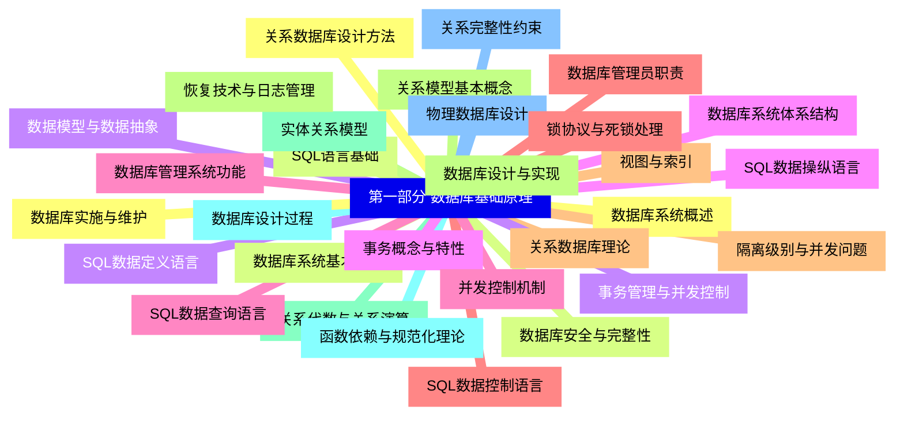
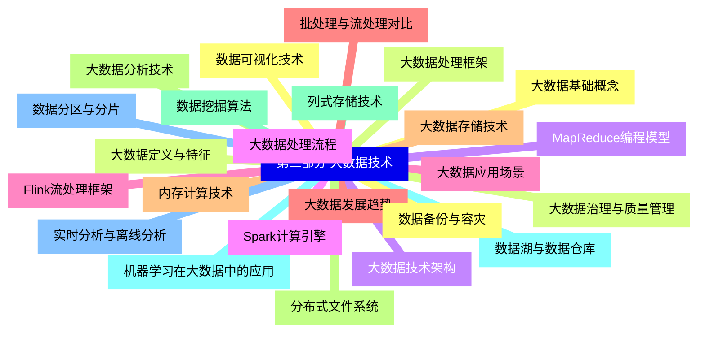
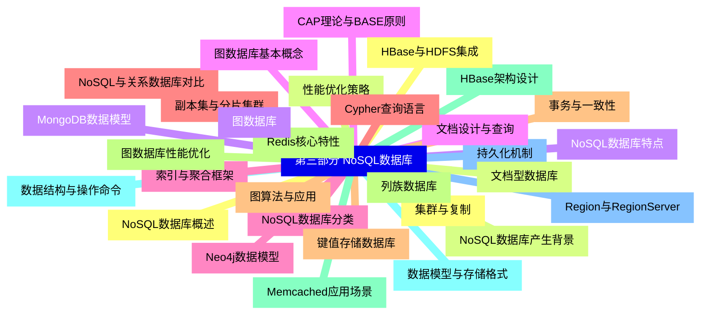
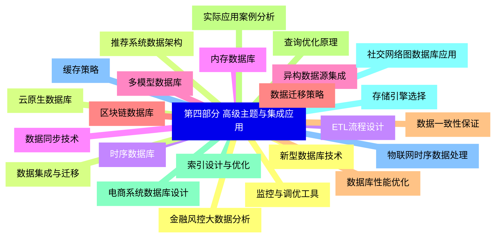


### 1 [第一部分 数据库基础原理](#1)
#### 1.1 [数据库系统概述](#1)
#### 1.2 [数据库系统基本概念](#1)
#### 1.3 [数据模型与数据抽象](#1)
#### 1.4 [数据库系统体系结构](#1)
#### 1.5 [数据库管理系统功能](#1)
#### 1.6 [数据库管理员职责](#1)
#### 1.7 [关系数据库理论](#1)
#### 1.8 [关系模型基本概念](#1)
#### 1.9 [关系代数与关系演算](#1)
#### 1.10 [函数依赖与规范化理论](#1)
#### 1.11 [关系完整性约束](#1)
#### 1.12 [关系数据库设计方法](#1)
#### 1.13 [SQL语言基础](#1)
#### 1.14 [SQL数据定义语言](#1)
#### 1.15 [SQL数据操纵语言](#1)
#### 1.16 [SQL数据查询语言](#1)
#### 1.17 [SQL数据控制语言](#1)
#### 1.18 [视图与索引](#1)
#### 1.19 [数据库设计与实现](#1)
#### 1.20 [实体关系模型](#1)
#### 1.21 [数据库设计过程](#1)
#### 1.22 [物理数据库设计](#1)
#### 1.23 [数据库实施与维护](#1)
#### 1.24 [数据库安全与完整性](#1)
#### 1.25 [事务管理与并发控制](#1)
#### 1.26 [事务概念与特性](#1)
#### 1.27 [并发控制机制](#1)
#### 1.28 [锁协议与死锁处理](#1)
#### 1.29 [隔离级别与并发问题](#1)
#### 1.30 [恢复技术与日志管理](#1)
### 2 [第二部分 大数据技术](#2)
#### 2.1 [大数据基础概念](#2)
#### 2.2 [大数据定义与特征](#2)
#### 2.3 [大数据技术架构](#2)
#### 2.4 [大数据处理流程](#2)
#### 2.5 [大数据应用场景](#2)
#### 2.6 [大数据发展趋势](#2)
#### 2.7 [大数据存储技术](#2)
#### 2.8 [分布式文件系统](#2)
#### 2.9 [列式存储技术](#2)
#### 2.10 [数据湖与数据仓库](#2)
#### 2.11 [数据分区与分片](#2)
#### 2.12 [数据备份与容灾](#2)
#### 2.13 [大数据处理框架](#2)
#### 2.14 [MapReduce编程模型](#2)
#### 2.15 [Spark计算引擎](#2)
#### 2.16 [Flink流处理框架](#2)
#### 2.17 [批处理与流处理对比](#2)
#### 2.18 [内存计算技术](#2)
#### 2.19 [大数据分析技术](#2)
#### 2.20 [数据挖掘算法](#2)
#### 2.21 [机器学习在大数据中的应用](#2)
#### 2.22 [实时分析与离线分析](#2)
#### 2.23 [数据可视化技术](#2)
#### 2.24 [大数据治理与质量管理](#2)
### 3 [第三部分 NoSQL数据库](#3)
#### 3.1 [NoSQL数据库概述](#3)
#### 3.2 [NoSQL数据库产生背景](#3)
#### 3.3 [NoSQL数据库特点](#3)
#### 3.4 [CAP理论与BASE原则](#3)
#### 3.5 [NoSQL数据库分类](#3)
#### 3.6 [NoSQL与关系数据库对比](#3)
#### 3.7 [键值存储数据库](#3)
#### 3.8 [Redis核心特性](#3)
#### 3.9 [Memcached应用场景](#3)
#### 3.10 [数据结构与操作命令](#3)
#### 3.11 [持久化机制](#3)
#### 3.12 [集群与复制](#3)
#### 3.13 [文档型数据库](#3)
#### 3.14 [MongoDB数据模型](#3)
#### 3.15 [文档设计与查询](#3)
#### 3.16 [索引与聚合框架](#3)
#### 3.17 [副本集与分片集群](#3)
#### 3.18 [事务与一致性](#3)
#### 3.19 [列族数据库](#3)
#### 3.20 [HBase架构设计](#3)
#### 3.21 [数据模型与存储格式](#3)
#### 3.22 [Region与RegionServer](#3)
#### 3.23 [HBase与HDFS集成](#3)
#### 3.24 [性能优化策略](#3)
#### 3.25 [图数据库](#3)
#### 3.26 [图数据库基本概念](#3)
#### 3.27 [Neo4j数据模型](#3)
#### 3.28 [Cypher查询语言](#3)
#### 3.29 [图算法与应用](#3)
#### 3.30 [图数据库性能优化](#3)
### 4 [第四部分 高级主题与集成应用](#4)
#### 4.1 [新型数据库技术](#4)
#### 4.2 [云原生数据库](#4)
#### 4.3 [时序数据库](#4)
#### 4.4 [内存数据库](#4)
#### 4.5 [多模型数据库](#4)
#### 4.6 [区块链数据库](#4)
#### 4.7 [数据库性能优化](#4)
#### 4.8 [查询优化原理](#4)
#### 4.9 [索引设计与优化](#4)
#### 4.10 [存储引擎选择](#4)
#### 4.11 [缓存策略](#4)
#### 4.12 [监控与调优工具](#4)
#### 4.13 [数据集成与迁移](#4)
#### 4.14 [ETL流程设计](#4)
#### 4.15 [数据同步技术](#4)
#### 4.16 [异构数据源集成](#4)
#### 4.17 [数据迁移策略](#4)
#### 4.18 [数据一致性保证](#4)
#### 4.19 [实际应用案例分析](#4)
#### 4.20 [电商系统数据库设计](#4)
#### 4.21 [社交网络图数据库应用](#4)
#### 4.22 [物联网时序数据处理](#4)
#### 4.23 [金融风控大数据分析](#4)
#### 4.24 [推荐系统数据架构](#4)




### 1 第一部分 数据库基础原理

---
### 1 第一部分 数据库基础原理
___
#### 1.1 数据库系统概述
___
#### 1.2 数据库系统基本概念
___
#### 1.3 数据模型与数据抽象
___
#### 1.4 数据库系统体系结构
___
#### 1.5 数据库管理系统功能
___
#### 1.6 数据库管理员职责
___
#### 1.7 关系数据库理论
___
#### 1.8 关系模型基本概念
___
#### 1.9 关系代数与关系演算
___
#### 1.10 函数依赖与规范化理论
___
#### 1.11 关系完整性约束
___
#### 1.12 关系数据库设计方法
___
#### 1.13 SQL语言基础
___
#### 1.14 SQL数据定义语言
___
#### 1.15 SQL数据操纵语言
___
#### 1.16 SQL数据查询语言
___
#### 1.17 SQL数据控制语言
___
#### 1.18 视图与索引
___
#### 1.19 数据库设计与实现
___
#### 1.20 实体关系模型
___
#### 1.21 数据库设计过程
___
#### 1.22 物理数据库设计
___
#### 1.23 数据库实施与维护
___
#### 1.24 数据库安全与完整性
___
#### 1.25 事务管理与并发控制
___
#### 1.26 事务概念与特性
___
#### 1.27 并发控制机制
___
#### 1.28 锁协议与死锁处理
___
#### 1.29 隔离级别与并发问题
___
#### 1.30 恢复技术与日志管理
### 2 第二部分 大数据技术

---
### 2 第二部分 大数据技术
___
#### 2.1 大数据基础概念
___
#### 2.2 大数据定义与特征
___
#### 2.3 大数据技术架构
___
#### 2.4 大数据处理流程
___
#### 2.5 大数据应用场景
___
#### 2.6 大数据发展趋势
___
#### 2.7 大数据存储技术
___
#### 2.8 分布式文件系统
___
#### 2.9 列式存储技术
___
#### 2.10 数据湖与数据仓库
___
#### 2.11 数据分区与分片
___
#### 2.12 数据备份与容灾
___
#### 2.13 大数据处理框架
___
#### 2.14 MapReduce编程模型
___
#### 2.15 Spark计算引擎
___
#### 2.16 Flink流处理框架
___
#### 2.17 批处理与流处理对比
___
#### 2.18 内存计算技术
___
#### 2.19 大数据分析技术
___
#### 2.20 数据挖掘算法
___
#### 2.21 机器学习在大数据中的应用
___
#### 2.22 实时分析与离线分析
___
#### 2.23 数据可视化技术
___
#### 2.24 大数据治理与质量管理
### 3 第三部分 NoSQL数据库

---
### 3 第三部分 NoSQL数据库
___
#### 3.1 NoSQL数据库概述
___
#### 3.2 NoSQL数据库产生背景
___
#### 3.3 NoSQL数据库特点
___
#### 3.4 CAP理论与BASE原则
___
#### 3.5 NoSQL数据库分类
___
#### 3.6 NoSQL与关系数据库对比
___
#### 3.7 键值存储数据库
___
#### 3.8 Redis核心特性
___
#### 3.9 Memcached应用场景
___
#### 3.10 数据结构与操作命令
___
#### 3.11 持久化机制
___
#### 3.12 集群与复制
___
#### 3.13 文档型数据库
___
#### 3.14 MongoDB数据模型
___
#### 3.15 文档设计与查询
___
#### 3.16 索引与聚合框架
___
#### 3.17 副本集与分片集群
___
#### 3.18 事务与一致性
___
#### 3.19 列族数据库
___
#### 3.20 HBase架构设计
___
#### 3.21 数据模型与存储格式
___
#### 3.22 Region与RegionServer
___
#### 3.23 HBase与HDFS集成
___
#### 3.24 性能优化策略
___
#### 3.25 图数据库
___
#### 3.26 图数据库基本概念
___
#### 3.27 Neo4j数据模型
___
#### 3.28 Cypher查询语言
___
#### 3.29 图算法与应用
___
#### 3.30 图数据库性能优化
### 4 第四部分 高级主题与集成应用

---
### 4 第四部分 高级主题与集成应用
___
#### 4.1 新型数据库技术
___
#### 4.2 云原生数据库
___
#### 4.3 时序数据库
___
#### 4.4 内存数据库
___
#### 4.5 多模型数据库
___
#### 4.6 区块链数据库
___
#### 4.7 数据库性能优化
___
#### 4.8 查询优化原理
___
#### 4.9 索引设计与优化
___
#### 4.10 存储引擎选择
___
#### 4.11 缓存策略
___
#### 4.12 监控与调优工具
___
#### 4.13 数据集成与迁移
___
#### 4.14 ETL流程设计
___
#### 4.15 数据同步技术
___
#### 4.16 异构数据源集成
___
#### 4.17 数据迁移策略
___
#### 4.18 数据一致性保证
___
#### 4.19 实际应用案例分析
___
#### 4.20 电商系统数据库设计
___
#### 4.21 社交网络图数据库应用
___
#### 4.22 物联网时序数据处理
___
#### 4.23 金融风控大数据分析
___
#### 4.24 推荐系统数据架构


### 1 第一部分 数据库基础原理{#1}

{}

<--->
{}
{}
{}
{}
{}
{}
{}
{}
{}
{}
{}
{}
{}
{}
{}
{}
{}
{}
{}
{}
{}
{}
{}
{}
{}
{}
{}
{}
{}
{}
{}
{}
{}
{}
{}
{}
{}
{}
{}
{}
{}
{}
{}
{}
{}
{}
{}
{}
{}
{}
{}
{}
{}
{}
{}
{}
{}
{}
{}
{}
{}

### 2 第二部分 大数据技术{#2}

{}
{}
{}
{}
{}
{}
{}
{}
{}
{}
{}
{}
{}
{}
{}
{}
{}
{}
{}
{}
{}
{}
{}
{}
{}
{}
{}
{}
{}
{}
{}
{}
{}
{}
{}
{}
{}
{}
{}
{}
{}
{}
{}
{}
{}
{}
{}
{}
{}
<--->

{}

### 3 第三部分 NoSQL数据库{#3}

{}

<--->
{}
{}
{}
{}
{}
{}
{}
{}
{}
{}
{}
{}
{}
{}
{}
{}
{}
{}
{}
{}
{}
{}
{}
{}
{}
{}
{}
{}
{}
{}
{}
{}
{}
{}
{}
{}
{}
{}
{}
{}
{}
{}
{}
{}
{}
{}
{}
{}
{}
{}
{}
{}
{}
{}
{}
{}
{}
{}
{}
{}
{}

### 4 第四部分 高级主题与集成应用{#4}

{}
{}
{}
{}
{}
{}
{}
{}
{}
{}
{}
{}
{}
{}
{}
{}
{}
{}
{}
{}
{}
{}
{}
{}
{}
{}
{}
{}
{}
{}
{}
{}
{}
{}
{}
{}
{}
{}
{}
{}
{}
{}
{}
{}
{}
{}
{}
{}
{}
<--->

{}
