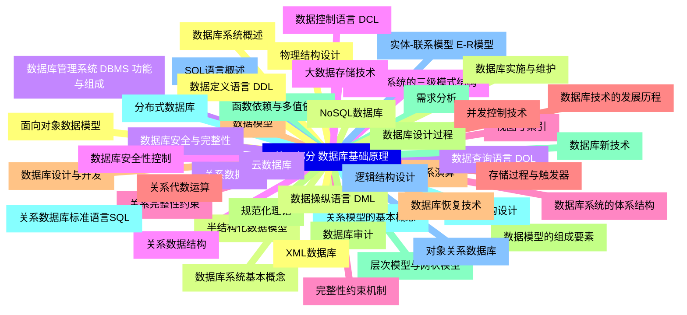
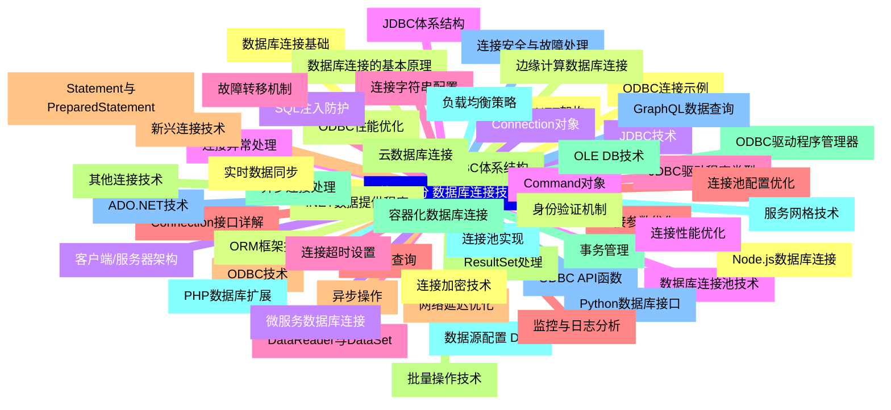


### 1 [第一部分 数据库基础原理](#1)
#### 1.1 [数据库系统概述](#1)
#### 1.2 [数据库系统基本概念](#1)
#### 1.3 [数据库管理系统 DBMS 功能与组成](#1)
#### 1.4 [数据库系统的三级模式结构](#1)
#### 1.5 [数据库系统的体系结构](#1)
#### 1.6 [数据库技术的发展历程](#1)
#### 1.7 [数据模型](#1)
#### 1.8 [数据模型的组成要素](#1)
#### 1.9 [层次模型与网状模型](#1)
#### 1.10 [关系模型的基本概念](#1)
#### 1.11 [实体-联系模型 E-R模型](#1)
#### 1.12 [面向对象数据模型](#1)
#### 1.13 [半结构化数据模型](#1)
#### 1.14 [关系数据库](#1)
#### 1.15 [关系数据结构](#1)
#### 1.16 [关系完整性约束](#1)
#### 1.17 [关系代数运算](#1)
#### 1.18 [关系演算](#1)
#### 1.19 [规范化理论](#1)
#### 1.20 [函数依赖与多值依赖](#1)
#### 1.21 [关系数据库标准语言SQL](#1)
#### 1.22 [SQL语言概述](#1)
#### 1.23 [数据定义语言 DDL](#1)
#### 1.24 [数据操纵语言 DML](#1)
#### 1.25 [数据查询语言 DQL](#1)
#### 1.26 [数据控制语言 DCL](#1)
#### 1.27 [视图与索引](#1)
#### 1.28 [存储过程与触发器](#1)
#### 1.29 [数据库设计与开发](#1)
#### 1.30 [数据库设计过程](#1)
#### 1.31 [需求分析](#1)
#### 1.32 [概念结构设计](#1)
#### 1.33 [逻辑结构设计](#1)
#### 1.34 [物理结构设计](#1)
#### 1.35 [数据库实施与维护](#1)
#### 1.36 [数据库安全与完整性](#1)
#### 1.37 [数据库安全性控制](#1)
#### 1.38 [完整性约束机制](#1)
#### 1.39 [并发控制技术](#1)
#### 1.40 [数据库恢复技术](#1)
#### 1.41 [数据库审计](#1)
#### 1.42 [数据库新技术](#1)
#### 1.43 [分布式数据库](#1)
#### 1.44 [对象关系数据库](#1)
#### 1.45 [XML数据库](#1)
#### 1.46 [NoSQL数据库](#1)
#### 1.47 [云数据库](#1)
#### 1.48 [大数据存储技术](#1)
### 2 [第二部分 数据库连接技术](#2)
#### 2.1 [数据库连接基础](#2)
#### 2.2 [数据库连接的基本原理](#2)
#### 2.3 [客户端/服务器架构](#2)
#### 2.4 [数据库连接池技术](#2)
#### 2.5 [连接字符串配置](#2)
#### 2.6 [连接参数优化](#2)
#### 2.7 [ODBC技术](#2)
#### 2.8 [ODBC体系结构](#2)
#### 2.9 [ODBC驱动程序管理器](#2)
#### 2.10 [数据源配置 DSN](#2)
#### 2.11 [ODBC API函数](#2)
#### 2.12 [ODBC连接示例](#2)
#### 2.13 [ODBC性能优化](#2)
#### 2.14 [JDBC技术](#2)
#### 2.15 [JDBC体系结构](#2)
#### 2.16 [JDBC驱动程序类型](#2)
#### 2.17 [Connection接口详解](#2)
#### 2.18 [Statement与PreparedStatement](#2)
#### 2.19 [ResultSet处理](#2)
#### 2.20 [事务管理](#2)
#### 2.21 [连接池实现](#2)
#### 2.22 [ADO.NET技术](#2)
#### 2.23 [ADO.NET架构](#2)
#### 2.24 [.NET数据提供程序](#2)
#### 2.25 [Connection对象](#2)
#### 2.26 [Command对象](#2)
#### 2.27 [DataReader与DataSet](#2)
#### 2.28 [参数化查询](#2)
#### 2.29 [异步操作](#2)
#### 2.30 [其他连接技术](#2)
#### 2.31 [OLE DB技术](#2)
#### 2.32 [PHP数据库扩展](#2)
#### 2.33 [Python数据库接口](#2)
#### 2.34 [Node.js数据库连接](#2)
#### 2.35 [ORM框架技术](#2)
#### 2.36 [微服务数据库连接](#2)
#### 2.37 [连接性能优化](#2)
#### 2.38 [连接超时设置](#2)
#### 2.39 [连接池配置优化](#2)
#### 2.40 [网络延迟优化](#2)
#### 2.41 [批量操作技术](#2)
#### 2.42 [异步连接处理](#2)
#### 2.43 [负载均衡策略](#2)
#### 2.44 [连接安全与故障处理](#2)
#### 2.45 [连接加密技术](#2)
#### 2.46 [身份验证机制](#2)
#### 2.47 [SQL注入防护](#2)
#### 2.48 [连接异常处理](#2)
#### 2.49 [故障转移机制](#2)
#### 2.50 [监控与日志分析](#2)
#### 2.51 [新兴连接技术](#2)
#### 2.52 [云数据库连接](#2)
#### 2.53 [容器化数据库连接](#2)
#### 2.54 [服务网格技术](#2)
#### 2.55 [GraphQL数据查询](#2)
#### 2.56 [实时数据同步](#2)
#### 2.57 [边缘计算数据库连接](#2)




### 1 第一部分 数据库基础原理

---
### 1 第一部分 数据库基础原理
___
#### 1.1 数据库系统概述
___
#### 1.2 数据库系统基本概念
___
#### 1.3 数据库管理系统 DBMS 功能与组成
___
#### 1.4 数据库系统的三级模式结构
___
#### 1.5 数据库系统的体系结构
___
#### 1.6 数据库技术的发展历程
___
#### 1.7 数据模型
___
#### 1.8 数据模型的组成要素
___
#### 1.9 层次模型与网状模型
___
#### 1.10 关系模型的基本概念
___
#### 1.11 实体-联系模型 E-R模型
___
#### 1.12 面向对象数据模型
___
#### 1.13 半结构化数据模型
___
#### 1.14 关系数据库
___
#### 1.15 关系数据结构
___
#### 1.16 关系完整性约束
___
#### 1.17 关系代数运算
___
#### 1.18 关系演算
___
#### 1.19 规范化理论
___
#### 1.20 函数依赖与多值依赖
___
#### 1.21 关系数据库标准语言SQL
___
#### 1.22 SQL语言概述
___
#### 1.23 数据定义语言 DDL
___
#### 1.24 数据操纵语言 DML
___
#### 1.25 数据查询语言 DQL
___
#### 1.26 数据控制语言 DCL
___
#### 1.27 视图与索引
___
#### 1.28 存储过程与触发器
___
#### 1.29 数据库设计与开发
___
#### 1.30 数据库设计过程
___
#### 1.31 需求分析
___
#### 1.32 概念结构设计
___
#### 1.33 逻辑结构设计
___
#### 1.34 物理结构设计
___
#### 1.35 数据库实施与维护
___
#### 1.36 数据库安全与完整性
___
#### 1.37 数据库安全性控制
___
#### 1.38 完整性约束机制
___
#### 1.39 并发控制技术
___
#### 1.40 数据库恢复技术
___
#### 1.41 数据库审计
___
#### 1.42 数据库新技术
___
#### 1.43 分布式数据库
___
#### 1.44 对象关系数据库
___
#### 1.45 XML数据库
___
#### 1.46 NoSQL数据库
___
#### 1.47 云数据库
___
#### 1.48 大数据存储技术
### 2 第二部分 数据库连接技术

---
### 2 第二部分 数据库连接技术
___
#### 2.1 数据库连接基础
___
#### 2.2 数据库连接的基本原理
___
#### 2.3 客户端/服务器架构
___
#### 2.4 数据库连接池技术
___
#### 2.5 连接字符串配置
___
#### 2.6 连接参数优化
___
#### 2.7 ODBC技术
___
#### 2.8 ODBC体系结构
___
#### 2.9 ODBC驱动程序管理器
___
#### 2.10 数据源配置 DSN
___
#### 2.11 ODBC API函数
___
#### 2.12 ODBC连接示例
___
#### 2.13 ODBC性能优化
___
#### 2.14 JDBC技术
___
#### 2.15 JDBC体系结构
___
#### 2.16 JDBC驱动程序类型
___
#### 2.17 Connection接口详解
___
#### 2.18 Statement与PreparedStatement
___
#### 2.19 ResultSet处理
___
#### 2.20 事务管理
___
#### 2.21 连接池实现
___
#### 2.22 ADO.NET技术
___
#### 2.23 ADO.NET架构
___
#### 2.24 .NET数据提供程序
___
#### 2.25 Connection对象
___
#### 2.26 Command对象
___
#### 2.27 DataReader与DataSet
___
#### 2.28 参数化查询
___
#### 2.29 异步操作
___
#### 2.30 其他连接技术
___
#### 2.31 OLE DB技术
___
#### 2.32 PHP数据库扩展
___
#### 2.33 Python数据库接口
___
#### 2.34 Node.js数据库连接
___
#### 2.35 ORM框架技术
___
#### 2.36 微服务数据库连接
___
#### 2.37 连接性能优化
___
#### 2.38 连接超时设置
___
#### 2.39 连接池配置优化
___
#### 2.40 网络延迟优化
___
#### 2.41 批量操作技术
___
#### 2.42 异步连接处理
___
#### 2.43 负载均衡策略
___
#### 2.44 连接安全与故障处理
___
#### 2.45 连接加密技术
___
#### 2.46 身份验证机制
___
#### 2.47 SQL注入防护
___
#### 2.48 连接异常处理
___
#### 2.49 故障转移机制
___
#### 2.50 监控与日志分析
___
#### 2.51 新兴连接技术
___
#### 2.52 云数据库连接
___
#### 2.53 容器化数据库连接
___
#### 2.54 服务网格技术
___
#### 2.55 GraphQL数据查询
___
#### 2.56 实时数据同步
___
#### 2.57 边缘计算数据库连接


### 1 第一部分 数据库基础原理{#1}

{}

<--->
{}
{}
{}
{}
{}
{}
{}
{}
{}
{}
{}
{}
{}
{}
{}
{}
{}
{}
{}
{}
{}
{}
{}
{}
{}
{}
{}
{}
{}
{}
{}
{}
{}
{}
{}
{}
{}
{}
{}
{}
{}
{}
{}
{}
{}
{}
{}
{}
{}
{}
{}
{}
{}
{}
{}
{}
{}
{}
{}
{}
{}
{}
{}
{}
{}
{}
{}
{}
{}
{}
{}
{}
{}
{}
{}
{}
{}
{}
{}
{}
{}
{}
{}
{}
{}
{}
{}
{}
{}
{}
{}
{}
{}
{}
{}
{}
{}

### 2 第二部分 数据库连接技术{#2}

{}
{}
{}
{}
{}
{}
{}
{}
{}
{}
{}
{}
{}
{}
{}
{}
{}
{}
{}
{}
{}
{}
{}
{}
{}
{}
{}
{}
{}
{}
{}
{}
{}
{}
{}
{}
{}
{}
{}
{}
{}
{}
{}
{}
{}
{}
{}
{}
{}
{}
{}
{}
{}
{}
{}
{}
{}
{}
{}
{}
{}
{}
{}
{}
{}
{}
{}
{}
{}
{}
{}
{}
{}
{}
{}
{}
{}
{}
{}
{}
{}
{}
{}
{}
{}
{}
{}
{}
{}
{}
{}
{}
{}
{}
{}
{}
{}
{}
{}
{}
{}
{}
{}
{}
{}
{}
{}
{}
{}
{}
{}
{}
{}
{}
{}
<--->

{}
