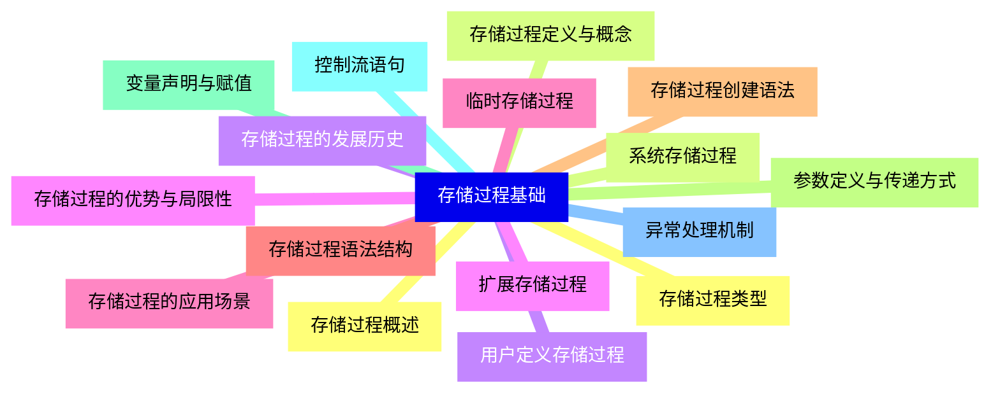
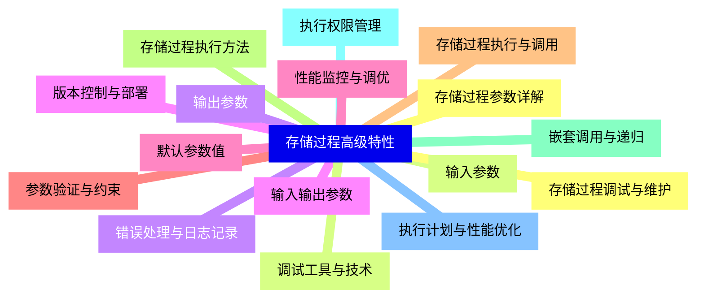
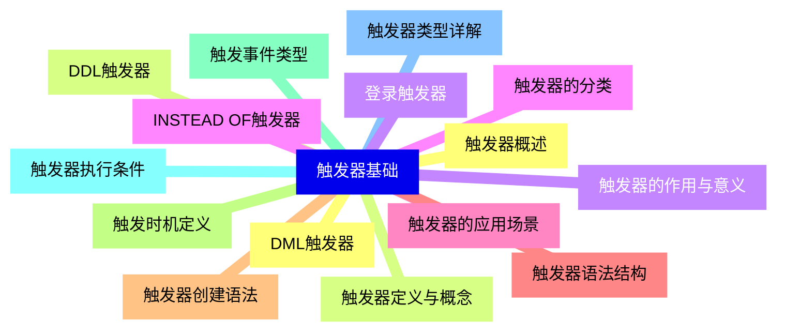
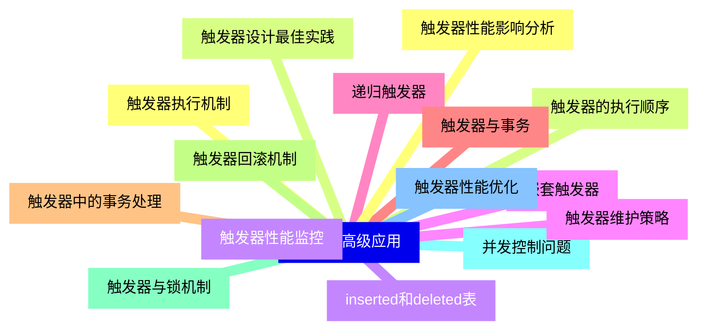
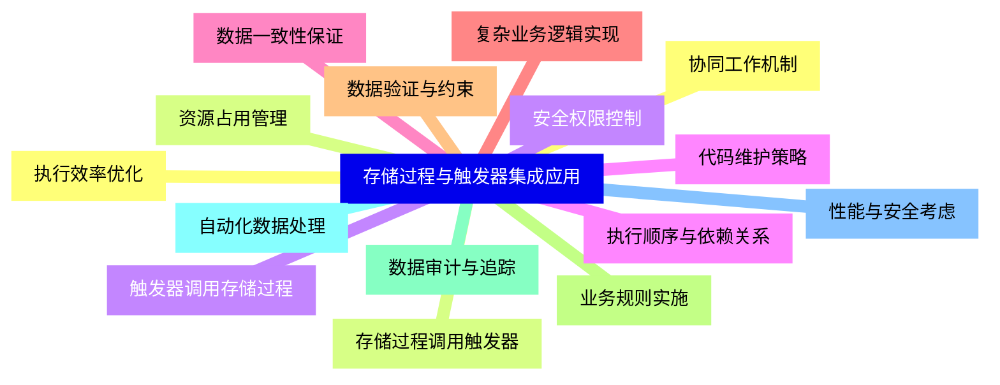
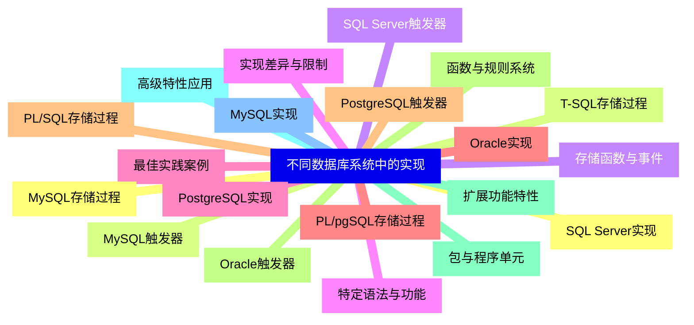
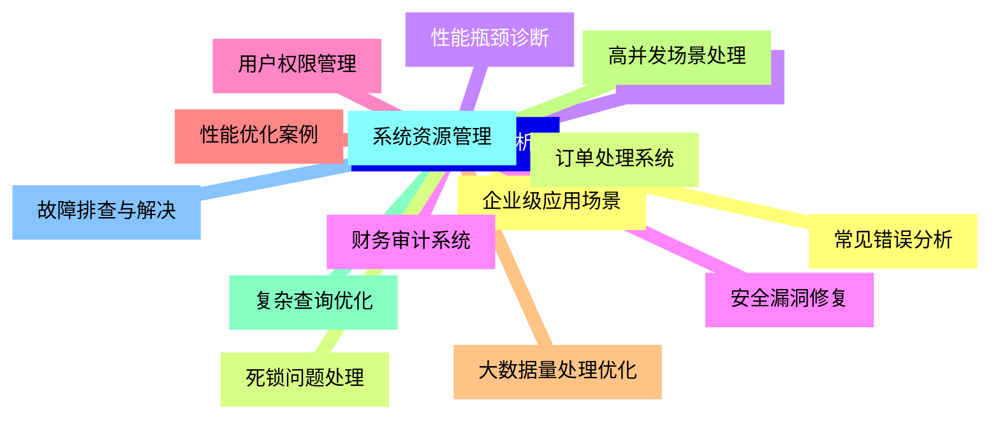
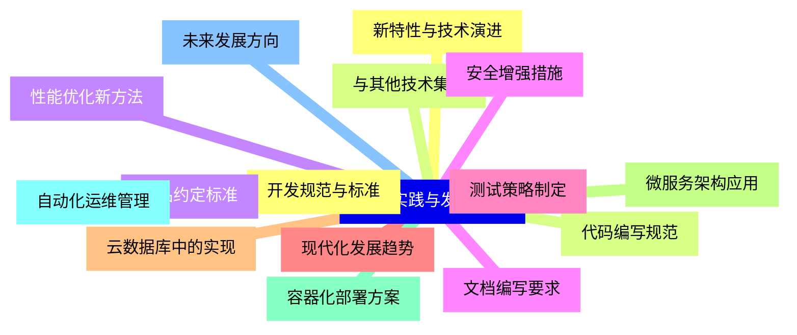


### 1 [存储过程基础](#1)
#### 1.1 [存储过程概述](#1)
#### 1.2 [存储过程定义与概念](#1)
#### 1.3 [存储过程的发展历史](#1)
#### 1.4 [存储过程的优势与局限性](#1)
#### 1.5 [存储过程的应用场景](#1)
#### 1.6 [存储过程语法结构](#1)
#### 1.7 [存储过程创建语法](#1)
#### 1.8 [参数定义与传递方式](#1)
#### 1.9 [变量声明与赋值](#1)
#### 1.10 [控制流语句](#1)
#### 1.11 [异常处理机制](#1)
#### 1.12 [存储过程类型](#1)
#### 1.13 [系统存储过程](#1)
#### 1.14 [用户定义存储过程](#1)
#### 1.15 [扩展存储过程](#1)
#### 1.16 [临时存储过程](#1)
### 2 [存储过程高级特性](#2)
#### 2.1 [存储过程参数详解](#2)
#### 2.2 [输入参数](#2)
#### 2.3 [输出参数](#2)
#### 2.4 [输入输出参数](#2)
#### 2.5 [默认参数值](#2)
#### 2.6 [参数验证与约束](#2)
#### 2.7 [存储过程执行与调用](#2)
#### 2.8 [存储过程执行方法](#2)
#### 2.9 [嵌套调用与递归](#2)
#### 2.10 [执行权限管理](#2)
#### 2.11 [执行计划与性能优化](#2)
#### 2.12 [存储过程调试与维护](#2)
#### 2.13 [调试工具与技术](#2)
#### 2.14 [错误处理与日志记录](#2)
#### 2.15 [版本控制与部署](#2)
#### 2.16 [性能监控与调优](#2)
### 3 [触发器基础](#3)
#### 3.1 [触发器概述](#3)
#### 3.2 [触发器定义与概念](#3)
#### 3.3 [触发器的作用与意义](#3)
#### 3.4 [触发器的分类](#3)
#### 3.5 [触发器的应用场景](#3)
#### 3.6 [触发器语法结构](#3)
#### 3.7 [触发器创建语法](#3)
#### 3.8 [触发时机定义](#3)
#### 3.9 [触发事件类型](#3)
#### 3.10 [触发器执行条件](#3)
#### 3.11 [触发器类型详解](#3)
#### 3.12 [DML触发器](#3)
#### 3.13 [DDL触发器](#3)
#### 3.14 [登录触发器](#3)
#### 3.15 [INSTEAD OF触发器](#3)
### 4 [触发器高级应用](#4)
#### 4.1 [触发器执行机制](#4)
#### 4.2 [触发器的执行顺序](#4)
#### 4.3 [inserted和deleted表](#4)
#### 4.4 [嵌套触发器](#4)
#### 4.5 [递归触发器](#4)
#### 4.6 [触发器与事务](#4)
#### 4.7 [触发器中的事务处理](#4)
#### 4.8 [触发器回滚机制](#4)
#### 4.9 [触发器与锁机制](#4)
#### 4.10 [并发控制问题](#4)
#### 4.11 [触发器性能优化](#4)
#### 4.12 [触发器性能影响分析](#4)
#### 4.13 [触发器设计最佳实践](#4)
#### 4.14 [触发器性能监控](#4)
#### 4.15 [触发器维护策略](#4)
### 5 [存储过程与触发器集成应用](#5)
#### 5.1 [协同工作机制](#5)
#### 5.2 [存储过程调用触发器](#5)
#### 5.3 [触发器调用存储过程](#5)
#### 5.4 [执行顺序与依赖关系](#5)
#### 5.5 [数据一致性保证](#5)
#### 5.6 [复杂业务逻辑实现](#5)
#### 5.7 [数据验证与约束](#5)
#### 5.8 [业务规则实施](#5)
#### 5.9 [数据审计与追踪](#5)
#### 5.10 [自动化数据处理](#5)
#### 5.11 [性能与安全考虑](#5)
#### 5.12 [执行效率优化](#5)
#### 5.13 [资源占用管理](#5)
#### 5.14 [安全权限控制](#5)
#### 5.15 [代码维护策略](#5)
### 6 [不同数据库系统中的实现](#6)
#### 6.1 [SQL Server实现](#6)
#### 6.2 [T-SQL存储过程](#6)
#### 6.3 [SQL Server触发器](#6)
#### 6.4 [特定语法与功能](#6)
#### 6.5 [最佳实践案例](#6)
#### 6.6 [Oracle实现](#6)
#### 6.7 [PL/SQL存储过程](#6)
#### 6.8 [Oracle触发器](#6)
#### 6.9 [包与程序单元](#6)
#### 6.10 [高级特性应用](#6)
#### 6.11 [MySQL实现](#6)
#### 6.12 [MySQL存储过程](#6)
#### 6.13 [MySQL触发器](#6)
#### 6.14 [存储函数与事件](#6)
#### 6.15 [实现差异与限制](#6)
#### 6.16 [PostgreSQL实现](#6)
#### 6.17 [PL/pgSQL存储过程](#6)
#### 6.18 [PostgreSQL触发器](#6)
#### 6.19 [函数与规则系统](#6)
#### 6.20 [扩展功能特性](#6)
### 7 [实际应用案例分析](#7)
#### 7.1 [企业级应用场景](#7)
#### 7.2 [订单处理系统](#7)
#### 7.3 [库存管理系统](#7)
#### 7.4 [财务审计系统](#7)
#### 7.5 [用户权限管理](#7)
#### 7.6 [性能优化案例](#7)
#### 7.7 [大数据量处理优化](#7)
#### 7.8 [高并发场景处理](#7)
#### 7.9 [复杂查询优化](#7)
#### 7.10 [系统资源管理](#7)
#### 7.11 [故障排查与解决](#7)
#### 7.12 [常见错误分析](#7)
#### 7.13 [死锁问题处理](#7)
#### 7.14 [性能瓶颈诊断](#7)
#### 7.15 [安全漏洞修复](#7)
### 8 [最佳实践与发展趋势](#8)
#### 8.1 [开发规范与标准](#8)
#### 8.2 [代码编写规范](#8)
#### 8.3 [命名约定标准](#8)
#### 8.4 [文档编写要求](#8)
#### 8.5 [测试策略制定](#8)
#### 8.6 [现代化发展趋势](#8)
#### 8.7 [云数据库中的实现](#8)
#### 8.8 [微服务架构应用](#8)
#### 8.9 [容器化部署方案](#8)
#### 8.10 [自动化运维管理](#8)
#### 8.11 [未来发展方向](#8)
#### 8.12 [新特性与技术演进](#8)
#### 8.13 [与其他技术集成](#8)
#### 8.14 [性能优化新方法](#8)
#### 8.15 [安全增强措施](#8)




### 1 存储过程基础

---
### 1 存储过程基础
___
#### 1.1 存储过程概述
___
#### 1.2 存储过程定义与概念
___
#### 1.3 存储过程的发展历史
___
#### 1.4 存储过程的优势与局限性
___
#### 1.5 存储过程的应用场景
___
#### 1.6 存储过程语法结构
___
#### 1.7 存储过程创建语法
___
#### 1.8 参数定义与传递方式
___
#### 1.9 变量声明与赋值
___
#### 1.10 控制流语句
___
#### 1.11 异常处理机制
___
#### 1.12 存储过程类型
___
#### 1.13 系统存储过程
___
#### 1.14 用户定义存储过程
___
#### 1.15 扩展存储过程
___
#### 1.16 临时存储过程
### 2 存储过程高级特性

---
### 2 存储过程高级特性
___
#### 2.1 存储过程参数详解
___
#### 2.2 输入参数
___
#### 2.3 输出参数
___
#### 2.4 输入输出参数
___
#### 2.5 默认参数值
___
#### 2.6 参数验证与约束
___
#### 2.7 存储过程执行与调用
___
#### 2.8 存储过程执行方法
___
#### 2.9 嵌套调用与递归
___
#### 2.10 执行权限管理
___
#### 2.11 执行计划与性能优化
___
#### 2.12 存储过程调试与维护
___
#### 2.13 调试工具与技术
___
#### 2.14 错误处理与日志记录
___
#### 2.15 版本控制与部署
___
#### 2.16 性能监控与调优
### 3 触发器基础

---
### 3 触发器基础
___
#### 3.1 触发器概述
___
#### 3.2 触发器定义与概念
___
#### 3.3 触发器的作用与意义
___
#### 3.4 触发器的分类
___
#### 3.5 触发器的应用场景
___
#### 3.6 触发器语法结构
___
#### 3.7 触发器创建语法
___
#### 3.8 触发时机定义
___
#### 3.9 触发事件类型
___
#### 3.10 触发器执行条件
___
#### 3.11 触发器类型详解
___
#### 3.12 DML触发器
___
#### 3.13 DDL触发器
___
#### 3.14 登录触发器
___
#### 3.15 INSTEAD OF触发器
### 4 触发器高级应用

---
### 4 触发器高级应用
___
#### 4.1 触发器执行机制
___
#### 4.2 触发器的执行顺序
___
#### 4.3 inserted和deleted表
___
#### 4.4 嵌套触发器
___
#### 4.5 递归触发器
___
#### 4.6 触发器与事务
___
#### 4.7 触发器中的事务处理
___
#### 4.8 触发器回滚机制
___
#### 4.9 触发器与锁机制
___
#### 4.10 并发控制问题
___
#### 4.11 触发器性能优化
___
#### 4.12 触发器性能影响分析
___
#### 4.13 触发器设计最佳实践
___
#### 4.14 触发器性能监控
___
#### 4.15 触发器维护策略
### 5 存储过程与触发器集成应用

---
### 5 存储过程与触发器集成应用
___
#### 5.1 协同工作机制
___
#### 5.2 存储过程调用触发器
___
#### 5.3 触发器调用存储过程
___
#### 5.4 执行顺序与依赖关系
___
#### 5.5 数据一致性保证
___
#### 5.6 复杂业务逻辑实现
___
#### 5.7 数据验证与约束
___
#### 5.8 业务规则实施
___
#### 5.9 数据审计与追踪
___
#### 5.10 自动化数据处理
___
#### 5.11 性能与安全考虑
___
#### 5.12 执行效率优化
___
#### 5.13 资源占用管理
___
#### 5.14 安全权限控制
___
#### 5.15 代码维护策略
### 6 不同数据库系统中的实现

---
### 6 不同数据库系统中的实现
___
#### 6.1 SQL Server实现
___
#### 6.2 T-SQL存储过程
___
#### 6.3 SQL Server触发器
___
#### 6.4 特定语法与功能
___
#### 6.5 最佳实践案例
___
#### 6.6 Oracle实现
___
#### 6.7 PL/SQL存储过程
___
#### 6.8 Oracle触发器
___
#### 6.9 包与程序单元
___
#### 6.10 高级特性应用
___
#### 6.11 MySQL实现
___
#### 6.12 MySQL存储过程
___
#### 6.13 MySQL触发器
___
#### 6.14 存储函数与事件
___
#### 6.15 实现差异与限制
___
#### 6.16 PostgreSQL实现
___
#### 6.17 PL/pgSQL存储过程
___
#### 6.18 PostgreSQL触发器
___
#### 6.19 函数与规则系统
___
#### 6.20 扩展功能特性
### 7 实际应用案例分析

---
### 7 实际应用案例分析
___
#### 7.1 企业级应用场景
___
#### 7.2 订单处理系统
___
#### 7.3 库存管理系统
___
#### 7.4 财务审计系统
___
#### 7.5 用户权限管理
___
#### 7.6 性能优化案例
___
#### 7.7 大数据量处理优化
___
#### 7.8 高并发场景处理
___
#### 7.9 复杂查询优化
___
#### 7.10 系统资源管理
___
#### 7.11 故障排查与解决
___
#### 7.12 常见错误分析
___
#### 7.13 死锁问题处理
___
#### 7.14 性能瓶颈诊断
___
#### 7.15 安全漏洞修复
### 8 最佳实践与发展趋势

---
### 8 最佳实践与发展趋势
___
#### 8.1 开发规范与标准
___
#### 8.2 代码编写规范
___
#### 8.3 命名约定标准
___
#### 8.4 文档编写要求
___
#### 8.5 测试策略制定
___
#### 8.6 现代化发展趋势
___
#### 8.7 云数据库中的实现
___
#### 8.8 微服务架构应用
___
#### 8.9 容器化部署方案
___
#### 8.10 自动化运维管理
___
#### 8.11 未来发展方向
___
#### 8.12 新特性与技术演进
___
#### 8.13 与其他技术集成
___
#### 8.14 性能优化新方法
___
#### 8.15 安全增强措施


### 1 存储过程基础{#1}

{}

<--->
{}
{}
{}
{}
{}
{}
{}
{}
{}
{}
{}
{}
{}
{}
{}
{}
{}
{}
{}
{}
{}
{}
{}
{}
{}
{}
{}
{}
{}
{}
{}
{}
{}

### 2 存储过程高级特性{#2}

{}
{}
{}
{}
{}
{}
{}
{}
{}
{}
{}
{}
{}
{}
{}
{}
{}
{}
{}
{}
{}
{}
{}
{}
{}
{}
{}
{}
{}
{}
{}
{}
{}
<--->

{}

### 3 触发器基础{#3}

{}

<--->
{}
{}
{}
{}
{}
{}
{}
{}
{}
{}
{}
{}
{}
{}
{}
{}
{}
{}
{}
{}
{}
{}
{}
{}
{}
{}
{}
{}
{}
{}
{}

### 4 触发器高级应用{#4}

{}
{}
{}
{}
{}
{}
{}
{}
{}
{}
{}
{}
{}
{}
{}
{}
{}
{}
{}
{}
{}
{}
{}
{}
{}
{}
{}
{}
{}
{}
{}
<--->

{}

### 5 存储过程与触发器集成应用{#5}

{}

<--->
{}
{}
{}
{}
{}
{}
{}
{}
{}
{}
{}
{}
{}
{}
{}
{}
{}
{}
{}
{}
{}
{}
{}
{}
{}
{}
{}
{}
{}
{}
{}

### 6 不同数据库系统中的实现{#6}

{}
{}
{}
{}
{}
{}
{}
{}
{}
{}
{}
{}
{}
{}
{}
{}
{}
{}
{}
{}
{}
{}
{}
{}
{}
{}
{}
{}
{}
{}
{}
{}
{}
{}
{}
{}
{}
{}
{}
{}
{}
<--->

{}

### 7 实际应用案例分析{#7}

{}

<--->
{}
{}
{}
{}
{}
{}
{}
{}
{}
{}
{}
{}
{}
{}
{}
{}
{}
{}
{}
{}
{}
{}
{}
{}
{}
{}
{}
{}
{}
{}
{}

### 8 最佳实践与发展趋势{#8}

{}
{}
{}
{}
{}
{}
{}
{}
{}
{}
{}
{}
{}
{}
{}
{}
{}
{}
{}
{}
{}
{}
{}
{}
{}
{}
{}
{}
{}
{}
{}
<--->

{}
