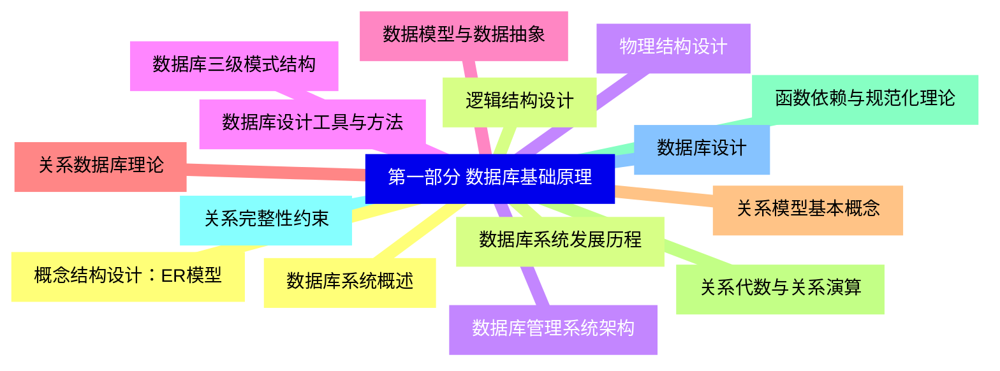
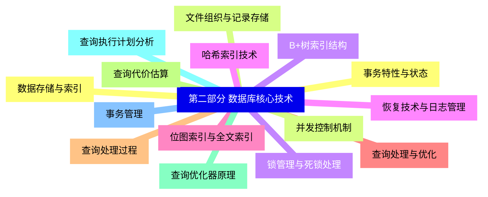
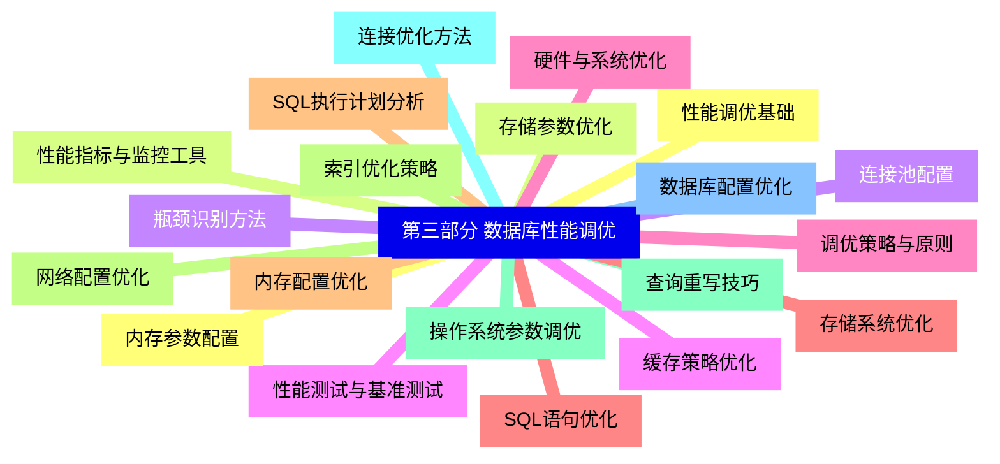
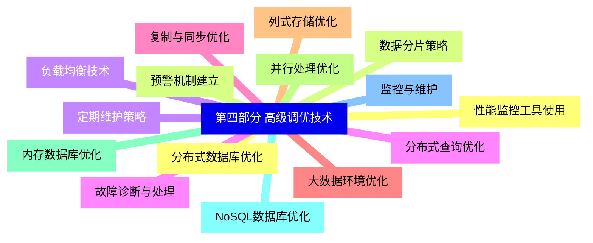
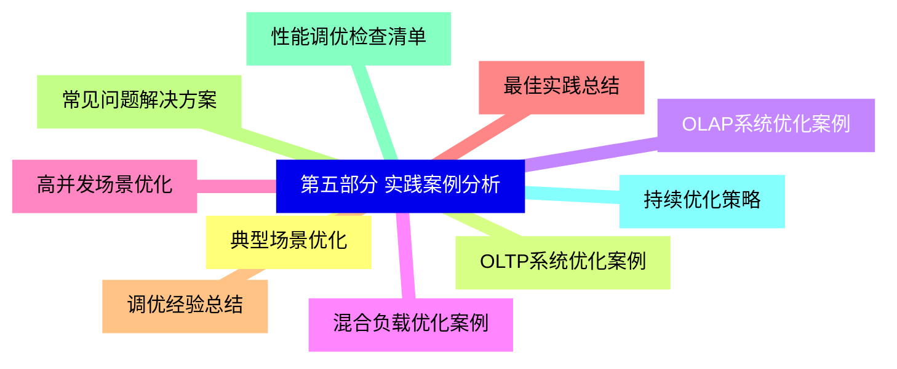


### 1 [第一部分 数据库基础原理](#1)
#### 1.1 [数据库系统概述](#1)
#### 1.2 [数据库系统发展历程](#1)
#### 1.3 [数据库管理系统架构](#1)
#### 1.4 [数据库三级模式结构](#1)
#### 1.5 [数据模型与数据抽象](#1)
#### 1.6 [关系数据库理论](#1)
#### 1.7 [关系模型基本概念](#1)
#### 1.8 [关系代数与关系演算](#1)
#### 1.9 [函数依赖与规范化理论](#1)
#### 1.10 [关系完整性约束](#1)
#### 1.11 [数据库设计](#1)
#### 1.12 [概念结构设计：ER模型](#1)
#### 1.13 [逻辑结构设计](#1)
#### 1.14 [物理结构设计](#1)
#### 1.15 [数据库设计工具与方法](#1)
### 2 [第二部分 数据库核心技术](#2)
#### 2.1 [数据存储与索引](#2)
#### 2.2 [文件组织与记录存储](#2)
#### 2.3 [B+树索引结构](#2)
#### 2.4 [哈希索引技术](#2)
#### 2.5 [位图索引与全文索引](#2)
#### 2.6 [查询处理与优化](#2)
#### 2.7 [查询处理过程](#2)
#### 2.8 [查询代价估算](#2)
#### 2.9 [查询优化器原理](#2)
#### 2.10 [查询执行计划分析](#2)
#### 2.11 [事务管理](#2)
#### 2.12 [事务特性与状态](#2)
#### 2.13 [并发控制机制](#2)
#### 2.14 [锁管理与死锁处理](#2)
#### 2.15 [恢复技术与日志管理](#2)
### 3 [第三部分 数据库性能调优](#3)
#### 3.1 [性能调优基础](#3)
#### 3.2 [性能指标与监控工具](#3)
#### 3.3 [瓶颈识别方法](#3)
#### 3.4 [性能测试与基准测试](#3)
#### 3.5 [调优策略与原则](#3)
#### 3.6 [SQL语句优化](#3)
#### 3.7 [SQL执行计划分析](#3)
#### 3.8 [索引优化策略](#3)
#### 3.9 [查询重写技巧](#3)
#### 3.10 [连接优化方法](#3)
#### 3.11 [数据库配置优化](#3)
#### 3.12 [内存参数配置](#3)
#### 3.13 [存储参数优化](#3)
#### 3.14 [连接池配置](#3)
#### 3.15 [缓存策略优化](#3)
#### 3.16 [硬件与系统优化](#3)
#### 3.17 [存储系统优化](#3)
#### 3.18 [内存配置优化](#3)
#### 3.19 [网络配置优化](#3)
#### 3.20 [操作系统参数调优](#3)
### 4 [第四部分 高级调优技术](#4)
#### 4.1 [分布式数据库优化](#4)
#### 4.2 [数据分片策略](#4)
#### 4.3 [负载均衡技术](#4)
#### 4.4 [分布式查询优化](#4)
#### 4.5 [复制与同步优化](#4)
#### 4.6 [大数据环境优化](#4)
#### 4.7 [列式存储优化](#4)
#### 4.8 [并行处理优化](#4)
#### 4.9 [内存数据库优化](#4)
#### 4.10 [NoSQL数据库优化](#4)
#### 4.11 [监控与维护](#4)
#### 4.12 [性能监控工具使用](#4)
#### 4.13 [预警机制建立](#4)
#### 4.14 [定期维护策略](#4)
#### 4.15 [故障诊断与处理](#4)
### 5 [第五部分 实践案例分析](#5)
#### 5.1 [典型场景优化](#5)
#### 5.2 [OLTP系统优化案例](#5)
#### 5.3 [OLAP系统优化案例](#5)
#### 5.4 [混合负载优化案例](#5)
#### 5.5 [高并发场景优化](#5)
#### 5.6 [最佳实践总结](#5)
#### 5.7 [调优经验总结](#5)
#### 5.8 [常见问题解决方案](#5)
#### 5.9 [性能调优检查清单](#5)
#### 5.10 [持续优化策略](#5)




### 1 第一部分 数据库基础原理

---
### 1 第一部分 数据库基础原理
___
#### 1.1 数据库系统概述
___
#### 1.2 数据库系统发展历程
___
#### 1.3 数据库管理系统架构
___
#### 1.4 数据库三级模式结构
___
#### 1.5 数据模型与数据抽象
___
#### 1.6 关系数据库理论
___
#### 1.7 关系模型基本概念
___
#### 1.8 关系代数与关系演算
___
#### 1.9 函数依赖与规范化理论
___
#### 1.10 关系完整性约束
___
#### 1.11 数据库设计
___
#### 1.12 概念结构设计：ER模型
___
#### 1.13 逻辑结构设计
___
#### 1.14 物理结构设计
___
#### 1.15 数据库设计工具与方法
### 2 第二部分 数据库核心技术

---
### 2 第二部分 数据库核心技术
___
#### 2.1 数据存储与索引
___
#### 2.2 文件组织与记录存储
___
#### 2.3 B+树索引结构
___
#### 2.4 哈希索引技术
___
#### 2.5 位图索引与全文索引
___
#### 2.6 查询处理与优化
___
#### 2.7 查询处理过程
___
#### 2.8 查询代价估算
___
#### 2.9 查询优化器原理
___
#### 2.10 查询执行计划分析
___
#### 2.11 事务管理
___
#### 2.12 事务特性与状态
___
#### 2.13 并发控制机制
___
#### 2.14 锁管理与死锁处理
___
#### 2.15 恢复技术与日志管理
### 3 第三部分 数据库性能调优

---
### 3 第三部分 数据库性能调优
___
#### 3.1 性能调优基础
___
#### 3.2 性能指标与监控工具
___
#### 3.3 瓶颈识别方法
___
#### 3.4 性能测试与基准测试
___
#### 3.5 调优策略与原则
___
#### 3.6 SQL语句优化
___
#### 3.7 SQL执行计划分析
___
#### 3.8 索引优化策略
___
#### 3.9 查询重写技巧
___
#### 3.10 连接优化方法
___
#### 3.11 数据库配置优化
___
#### 3.12 内存参数配置
___
#### 3.13 存储参数优化
___
#### 3.14 连接池配置
___
#### 3.15 缓存策略优化
___
#### 3.16 硬件与系统优化
___
#### 3.17 存储系统优化
___
#### 3.18 内存配置优化
___
#### 3.19 网络配置优化
___
#### 3.20 操作系统参数调优
### 4 第四部分 高级调优技术

---
### 4 第四部分 高级调优技术
___
#### 4.1 分布式数据库优化
___
#### 4.2 数据分片策略
___
#### 4.3 负载均衡技术
___
#### 4.4 分布式查询优化
___
#### 4.5 复制与同步优化
___
#### 4.6 大数据环境优化
___
#### 4.7 列式存储优化
___
#### 4.8 并行处理优化
___
#### 4.9 内存数据库优化
___
#### 4.10 NoSQL数据库优化
___
#### 4.11 监控与维护
___
#### 4.12 性能监控工具使用
___
#### 4.13 预警机制建立
___
#### 4.14 定期维护策略
___
#### 4.15 故障诊断与处理
### 5 第五部分 实践案例分析

---
### 5 第五部分 实践案例分析
___
#### 5.1 典型场景优化
___
#### 5.2 OLTP系统优化案例
___
#### 5.3 OLAP系统优化案例
___
#### 5.4 混合负载优化案例
___
#### 5.5 高并发场景优化
___
#### 5.6 最佳实践总结
___
#### 5.7 调优经验总结
___
#### 5.8 常见问题解决方案
___
#### 5.9 性能调优检查清单
___
#### 5.10 持续优化策略


### 1 第一部分 数据库基础原理{#1}

{}

<--->
{}
{}
{}
{}
{}
{}
{}
{}
{}
{}
{}
{}
{}
{}
{}
{}
{}
{}
{}
{}
{}
{}
{}
{}
{}
{}
{}
{}
{}
{}
{}

### 2 第二部分 数据库核心技术{#2}

{}
{}
{}
{}
{}
{}
{}
{}
{}
{}
{}
{}
{}
{}
{}
{}
{}
{}
{}
{}
{}
{}
{}
{}
{}
{}
{}
{}
{}
{}
{}
<--->

{}

### 3 第三部分 数据库性能调优{#3}

{}

<--->
{}
{}
{}
{}
{}
{}
{}
{}
{}
{}
{}
{}
{}
{}
{}
{}
{}
{}
{}
{}
{}
{}
{}
{}
{}
{}
{}
{}
{}
{}
{}
{}
{}
{}
{}
{}
{}
{}
{}
{}
{}

### 4 第四部分 高级调优技术{#4}

{}
{}
{}
{}
{}
{}
{}
{}
{}
{}
{}
{}
{}
{}
{}
{}
{}
{}
{}
{}
{}
{}
{}
{}
{}
{}
{}
{}
{}
{}
{}
<--->

{}

### 5 第五部分 实践案例分析{#5}

{}

<--->
{}
{}
{}
{}
{}
{}
{}
{}
{}
{}
{}
{}
{}
{}
{}
{}
{}
{}
{}
{}
{}
