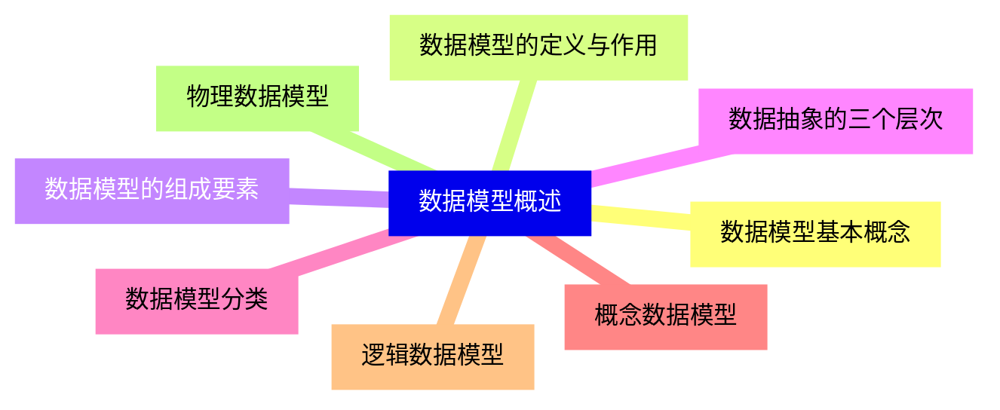
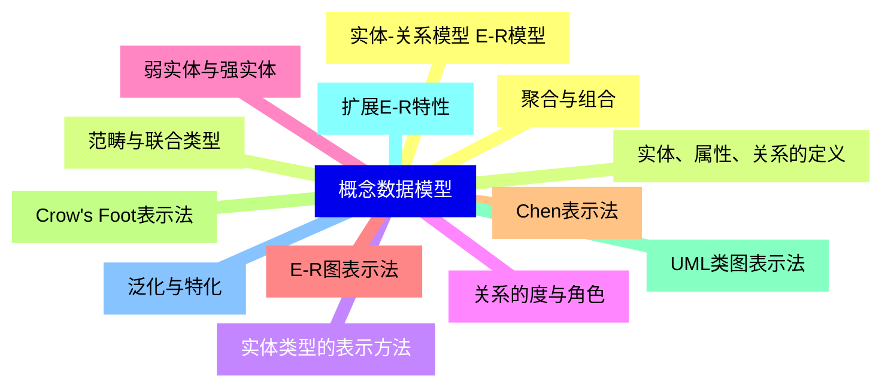
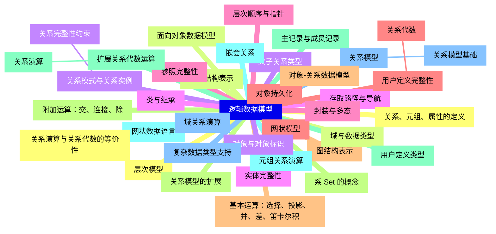
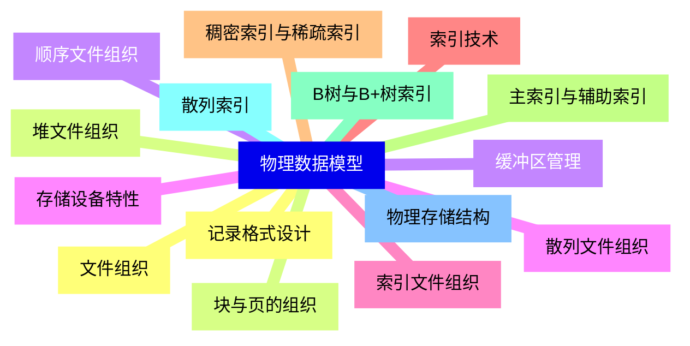
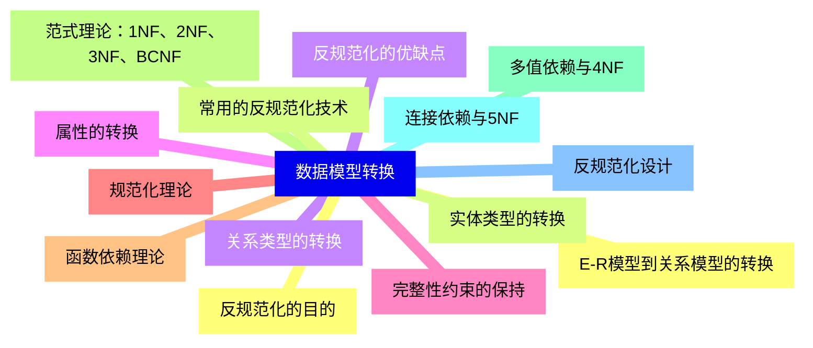
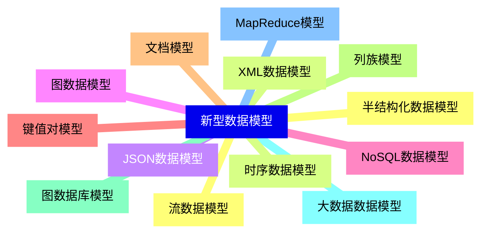
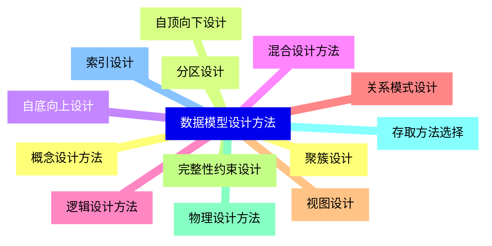
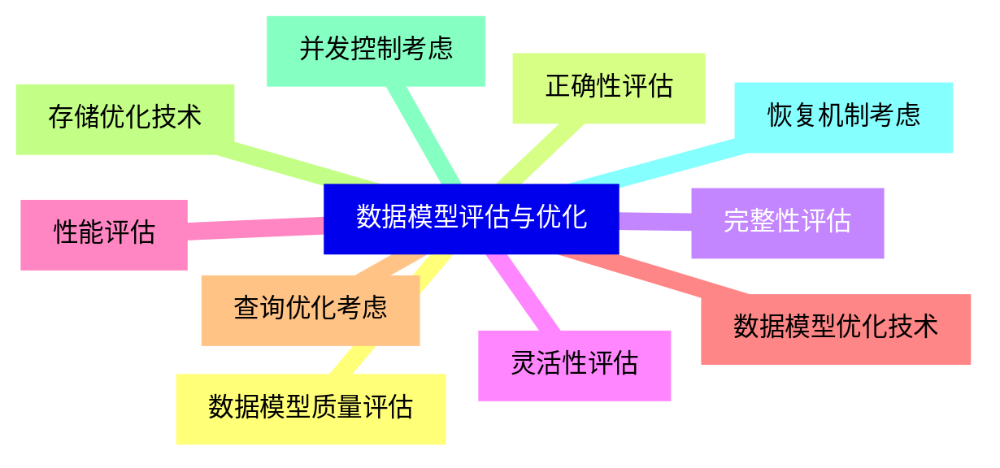
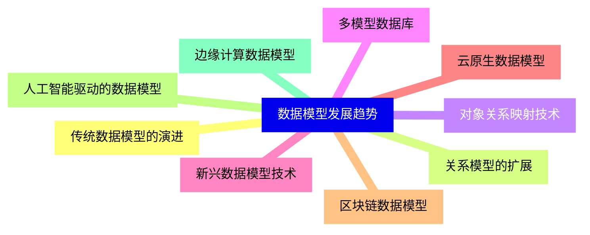


### 1 [数据模型概述](#1)
#### 1.1 [数据模型基本概念](#1)
#### 1.2 [数据模型的定义与作用](#1)
#### 1.3 [数据模型的组成要素](#1)
#### 1.4 [数据抽象的三个层次](#1)
#### 1.5 [数据模型分类](#1)
#### 1.6 [概念数据模型](#1)
#### 1.7 [逻辑数据模型](#1)
#### 1.8 [物理数据模型](#1)
### 2 [概念数据模型](#2)
#### 2.1 [实体-关系模型 E-R模型](#2)
#### 2.2 [实体、属性、关系的定义](#2)
#### 2.3 [实体类型的表示方法](#2)
#### 2.4 [关系的度与角色](#2)
#### 2.5 [弱实体与强实体](#2)
#### 2.6 [E-R图表示法](#2)
#### 2.7 [Chen表示法](#2)
#### 2.8 [Crow's Foot表示法](#2)
#### 2.9 [UML类图表示法](#2)
#### 2.10 [扩展E-R特性](#2)
#### 2.11 [泛化与特化](#2)
#### 2.12 [聚合与组合](#2)
#### 2.13 [范畴与联合类型](#2)
### 3 [逻辑数据模型](#3)
#### 3.1 [层次模型](#3)
#### 3.2 [树形结构表示](#3)
#### 3.3 [父子关系类型](#3)
#### 3.4 [存取路径与导航](#3)
#### 3.5 [层次顺序与指针](#3)
#### 3.6 [网状模型](#3)
#### 3.7 [图结构表示](#3)
#### 3.8 [系 Set 的概念](#3)
#### 3.9 [主记录与成员记录](#3)
#### 3.10 [网状数据语言](#3)
#### 3.11 [关系模型](#3)
##### 3.11.1 [关系模型基础](#3)
#### 3.12 [关系、元组、属性的定义](#3)
#### 3.13 [域与数据类型](#3)
#### 3.14 [关系模式与关系实例](#3)
##### 3.14.1 [关系完整性约束](#3)
#### 3.15 [实体完整性](#3)
#### 3.16 [参照完整性](#3)
#### 3.17 [用户定义完整性](#3)
##### 3.17.1 [关系代数](#3)
#### 3.18 [基本运算：选择、投影、并、差、笛卡尔积](#3)
#### 3.19 [附加运算：交、连接、除](#3)
#### 3.20 [扩展关系代数运算](#3)
##### 3.20.1 [关系演算](#3)
#### 3.21 [元组关系演算](#3)
#### 3.22 [域关系演算](#3)
#### 3.23 [关系演算与关系代数的等价性](#3)
#### 3.24 [面向对象数据模型](#3)
#### 3.25 [对象与对象标识](#3)
#### 3.26 [类与继承](#3)
#### 3.27 [封装与多态](#3)
#### 3.28 [对象持久化](#3)
#### 3.29 [对象-关系数据模型](#3)
#### 3.30 [关系模型的扩展](#3)
#### 3.31 [用户定义类型](#3)
#### 3.32 [嵌套关系](#3)
#### 3.33 [复杂数据类型支持](#3)
### 4 [物理数据模型](#4)
#### 4.1 [文件组织](#4)
#### 4.2 [堆文件组织](#4)
#### 4.3 [顺序文件组织](#4)
#### 4.4 [散列文件组织](#4)
#### 4.5 [索引文件组织](#4)
#### 4.6 [索引技术](#4)
#### 4.7 [稠密索引与稀疏索引](#4)
#### 4.8 [主索引与辅助索引](#4)
#### 4.9 [B树与B+树索引](#4)
#### 4.10 [散列索引](#4)
#### 4.11 [物理存储结构](#4)
#### 4.12 [记录格式设计](#4)
#### 4.13 [块与页的组织](#4)
#### 4.14 [缓冲区管理](#4)
#### 4.15 [存储设备特性](#4)
### 5 [数据模型转换](#5)
#### 5.1 [E-R模型到关系模型的转换](#5)
#### 5.2 [实体类型的转换](#5)
#### 5.3 [关系类型的转换](#5)
#### 5.4 [属性的转换](#5)
#### 5.5 [完整性约束的保持](#5)
#### 5.6 [规范化理论](#5)
#### 5.7 [函数依赖理论](#5)
#### 5.8 [范式理论：1NF、2NF、3NF、BCNF](#5)
#### 5.9 [多值依赖与4NF](#5)
#### 5.10 [连接依赖与5NF](#5)
#### 5.11 [反规范化设计](#5)
#### 5.12 [反规范化的目的](#5)
#### 5.13 [常用的反规范化技术](#5)
#### 5.14 [反规范化的优缺点](#5)
### 6 [新型数据模型](#6)
#### 6.1 [半结构化数据模型](#6)
#### 6.2 [XML数据模型](#6)
#### 6.3 [JSON数据模型](#6)
#### 6.4 [图数据模型](#6)
#### 6.5 [NoSQL数据模型](#6)
#### 6.6 [键值对模型](#6)
#### 6.7 [文档模型](#6)
#### 6.8 [列族模型](#6)
#### 6.9 [图数据库模型](#6)
#### 6.10 [大数据数据模型](#6)
#### 6.11 [MapReduce模型](#6)
#### 6.12 [流数据模型](#6)
#### 6.13 [时序数据模型](#6)
### 7 [数据模型设计方法](#7)
#### 7.1 [概念设计方法](#7)
#### 7.2 [自顶向下设计](#7)
#### 7.3 [自底向上设计](#7)
#### 7.4 [混合设计方法](#7)
#### 7.5 [逻辑设计方法](#7)
#### 7.6 [关系模式设计](#7)
#### 7.7 [视图设计](#7)
#### 7.8 [完整性约束设计](#7)
#### 7.9 [物理设计方法](#7)
#### 7.10 [存取方法选择](#7)
#### 7.11 [索引设计](#7)
#### 7.12 [聚簇设计](#7)
#### 7.13 [分区设计](#7)
### 8 [数据模型评估与优化](#8)
#### 8.1 [数据模型质量评估](#8)
#### 8.2 [正确性评估](#8)
#### 8.3 [完整性评估](#8)
#### 8.4 [灵活性评估](#8)
#### 8.5 [性能评估](#8)
#### 8.6 [数据模型优化技术](#8)
#### 8.7 [查询优化考虑](#8)
#### 8.8 [存储优化技术](#8)
#### 8.9 [并发控制考虑](#8)
#### 8.10 [恢复机制考虑](#8)
### 9 [数据模型发展趋势](#9)
#### 9.1 [传统数据模型的演进](#9)
#### 9.2 [关系模型的扩展](#9)
#### 9.3 [对象关系映射技术](#9)
#### 9.4 [多模型数据库](#9)
#### 9.5 [新兴数据模型技术](#9)
#### 9.6 [云原生数据模型](#9)
#### 9.7 [区块链数据模型](#9)
#### 9.8 [人工智能驱动的数据模型](#9)
#### 9.9 [边缘计算数据模型](#9)




### 1 数据模型概述

---
### 1 数据模型概述
___
#### 1.1 数据模型基本概念
___
#### 1.2 数据模型的定义与作用
___
#### 1.3 数据模型的组成要素
___
#### 1.4 数据抽象的三个层次
___
#### 1.5 数据模型分类
___
#### 1.6 概念数据模型
___
#### 1.7 逻辑数据模型
___
#### 1.8 物理数据模型
### 2 概念数据模型

---
### 2 概念数据模型
___
#### 2.1 实体-关系模型 E-R模型
___
#### 2.2 实体、属性、关系的定义
___
#### 2.3 实体类型的表示方法
___
#### 2.4 关系的度与角色
___
#### 2.5 弱实体与强实体
___
#### 2.6 E-R图表示法
___
#### 2.7 Chen表示法
___
#### 2.8 Crow's Foot表示法
___
#### 2.9 UML类图表示法
___
#### 2.10 扩展E-R特性
___
#### 2.11 泛化与特化
___
#### 2.12 聚合与组合
___
#### 2.13 范畴与联合类型
### 3 逻辑数据模型

---
### 3 逻辑数据模型
___
#### 3.1 层次模型
___
#### 3.2 树形结构表示
___
#### 3.3 父子关系类型
___
#### 3.4 存取路径与导航
___
#### 3.5 层次顺序与指针
___
#### 3.6 网状模型
___
#### 3.7 图结构表示
___
#### 3.8 系 Set 的概念
___
#### 3.9 主记录与成员记录
___
#### 3.10 网状数据语言
___
#### 3.11 关系模型
___
##### 3.11.1 关系模型基础
___
#### 3.12 关系、元组、属性的定义
___
#### 3.13 域与数据类型
___
#### 3.14 关系模式与关系实例
___
##### 3.14.1 关系完整性约束
___
#### 3.15 实体完整性
___
#### 3.16 参照完整性
___
#### 3.17 用户定义完整性
___
##### 3.17.1 关系代数
___
#### 3.18 基本运算：选择、投影、并、差、笛卡尔积
___
#### 3.19 附加运算：交、连接、除
___
#### 3.20 扩展关系代数运算
___
##### 3.20.1 关系演算
___
#### 3.21 元组关系演算
___
#### 3.22 域关系演算
___
#### 3.23 关系演算与关系代数的等价性
___
#### 3.24 面向对象数据模型
___
#### 3.25 对象与对象标识
___
#### 3.26 类与继承
___
#### 3.27 封装与多态
___
#### 3.28 对象持久化
___
#### 3.29 对象-关系数据模型
___
#### 3.30 关系模型的扩展
___
#### 3.31 用户定义类型
___
#### 3.32 嵌套关系
___
#### 3.33 复杂数据类型支持
### 4 物理数据模型

---
### 4 物理数据模型
___
#### 4.1 文件组织
___
#### 4.2 堆文件组织
___
#### 4.3 顺序文件组织
___
#### 4.4 散列文件组织
___
#### 4.5 索引文件组织
___
#### 4.6 索引技术
___
#### 4.7 稠密索引与稀疏索引
___
#### 4.8 主索引与辅助索引
___
#### 4.9 B树与B+树索引
___
#### 4.10 散列索引
___
#### 4.11 物理存储结构
___
#### 4.12 记录格式设计
___
#### 4.13 块与页的组织
___
#### 4.14 缓冲区管理
___
#### 4.15 存储设备特性
### 5 数据模型转换

---
### 5 数据模型转换
___
#### 5.1 E-R模型到关系模型的转换
___
#### 5.2 实体类型的转换
___
#### 5.3 关系类型的转换
___
#### 5.4 属性的转换
___
#### 5.5 完整性约束的保持
___
#### 5.6 规范化理论
___
#### 5.7 函数依赖理论
___
#### 5.8 范式理论：1NF、2NF、3NF、BCNF
___
#### 5.9 多值依赖与4NF
___
#### 5.10 连接依赖与5NF
___
#### 5.11 反规范化设计
___
#### 5.12 反规范化的目的
___
#### 5.13 常用的反规范化技术
___
#### 5.14 反规范化的优缺点
### 6 新型数据模型

---
### 6 新型数据模型
___
#### 6.1 半结构化数据模型
___
#### 6.2 XML数据模型
___
#### 6.3 JSON数据模型
___
#### 6.4 图数据模型
___
#### 6.5 NoSQL数据模型
___
#### 6.6 键值对模型
___
#### 6.7 文档模型
___
#### 6.8 列族模型
___
#### 6.9 图数据库模型
___
#### 6.10 大数据数据模型
___
#### 6.11 MapReduce模型
___
#### 6.12 流数据模型
___
#### 6.13 时序数据模型
### 7 数据模型设计方法

---
### 7 数据模型设计方法
___
#### 7.1 概念设计方法
___
#### 7.2 自顶向下设计
___
#### 7.3 自底向上设计
___
#### 7.4 混合设计方法
___
#### 7.5 逻辑设计方法
___
#### 7.6 关系模式设计
___
#### 7.7 视图设计
___
#### 7.8 完整性约束设计
___
#### 7.9 物理设计方法
___
#### 7.10 存取方法选择
___
#### 7.11 索引设计
___
#### 7.12 聚簇设计
___
#### 7.13 分区设计
### 8 数据模型评估与优化

---
### 8 数据模型评估与优化
___
#### 8.1 数据模型质量评估
___
#### 8.2 正确性评估
___
#### 8.3 完整性评估
___
#### 8.4 灵活性评估
___
#### 8.5 性能评估
___
#### 8.6 数据模型优化技术
___
#### 8.7 查询优化考虑
___
#### 8.8 存储优化技术
___
#### 8.9 并发控制考虑
___
#### 8.10 恢复机制考虑
### 9 数据模型发展趋势

---
### 9 数据模型发展趋势
___
#### 9.1 传统数据模型的演进
___
#### 9.2 关系模型的扩展
___
#### 9.3 对象关系映射技术
___
#### 9.4 多模型数据库
___
#### 9.5 新兴数据模型技术
___
#### 9.6 云原生数据模型
___
#### 9.7 区块链数据模型
___
#### 9.8 人工智能驱动的数据模型
___
#### 9.9 边缘计算数据模型


### 1 数据模型概述{#1}

{}

<--->
{}
{}
{}
{}
{}
{}
{}
{}
{}
{}
{}
{}
{}
{}
{}
{}
{}

### 2 概念数据模型{#2}

{}
{}
{}
{}
{}
{}
{}
{}
{}
{}
{}
{}
{}
{}
{}
{}
{}
{}
{}
{}
{}
{}
{}
{}
{}
{}
{}
<--->

{}

### 3 逻辑数据模型{#3}

{}

<--->
{}
{}
{}
{}
{}
{}
{}
{}
{}
{}
{}
{}
{}
{}
{}
{}
{}
{}
{}
{}
{}
{}
{}
{}
{}
{}
{}
{}
{}
{}
{}
{}
{}
{}
{}
{}
{}
{}
{}
{}
{}
{}
{}
{}
{}
{}
{}
{}
{}
{}
{}
{}
{}
{}
{}
{}
{}
{}
{}
{}
{}
{}
{}
{}
{}
{}
{}
{}
{}
{}
{}
{}
{}
{}
{}

### 4 物理数据模型{#4}

{}
{}
{}
{}
{}
{}
{}
{}
{}
{}
{}
{}
{}
{}
{}
{}
{}
{}
{}
{}
{}
{}
{}
{}
{}
{}
{}
{}
{}
{}
{}
<--->

{}

### 5 数据模型转换{#5}

{}

<--->
{}
{}
{}
{}
{}
{}
{}
{}
{}
{}
{}
{}
{}
{}
{}
{}
{}
{}
{}
{}
{}
{}
{}
{}
{}
{}
{}
{}
{}

### 6 新型数据模型{#6}

{}
{}
{}
{}
{}
{}
{}
{}
{}
{}
{}
{}
{}
{}
{}
{}
{}
{}
{}
{}
{}
{}
{}
{}
{}
{}
{}
<--->

{}

### 7 数据模型设计方法{#7}

{}

<--->
{}
{}
{}
{}
{}
{}
{}
{}
{}
{}
{}
{}
{}
{}
{}
{}
{}
{}
{}
{}
{}
{}
{}
{}
{}
{}
{}

### 8 数据模型评估与优化{#8}

{}
{}
{}
{}
{}
{}
{}
{}
{}
{}
{}
{}
{}
{}
{}
{}
{}
{}
{}
{}
{}
<--->

{}

### 9 数据模型发展趋势{#9}

{}

<--->
{}
{}
{}
{}
{}
{}
{}
{}
{}
{}
{}
{}
{}
{}
{}
{}
{}
{}
{}
