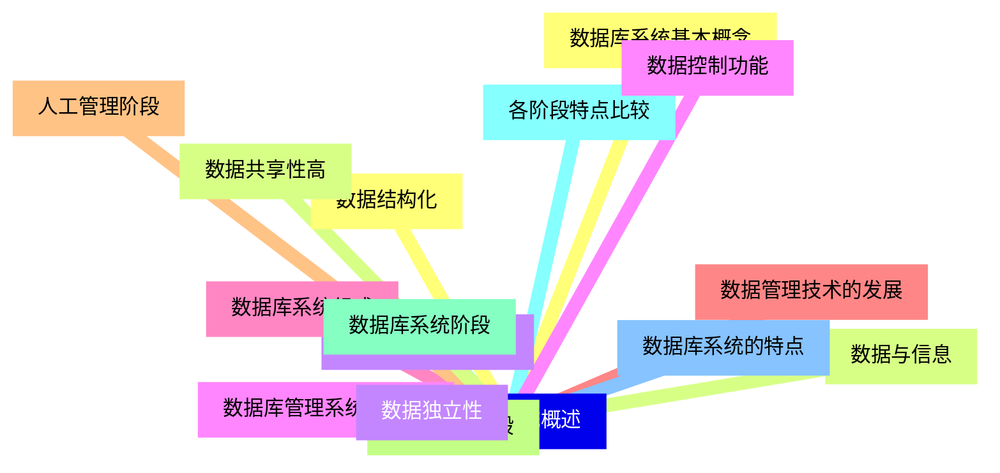
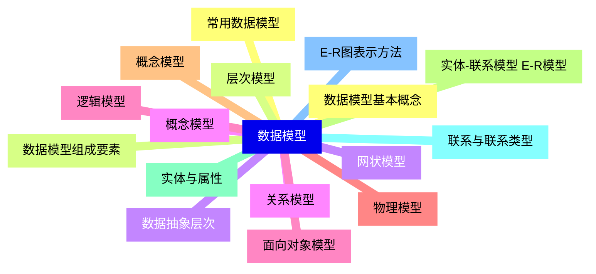
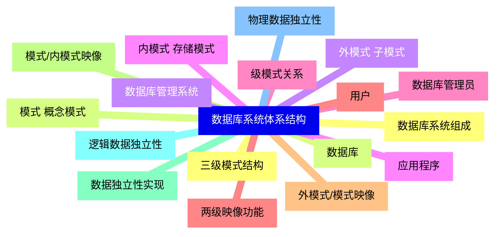
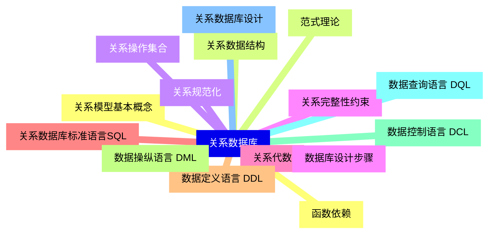
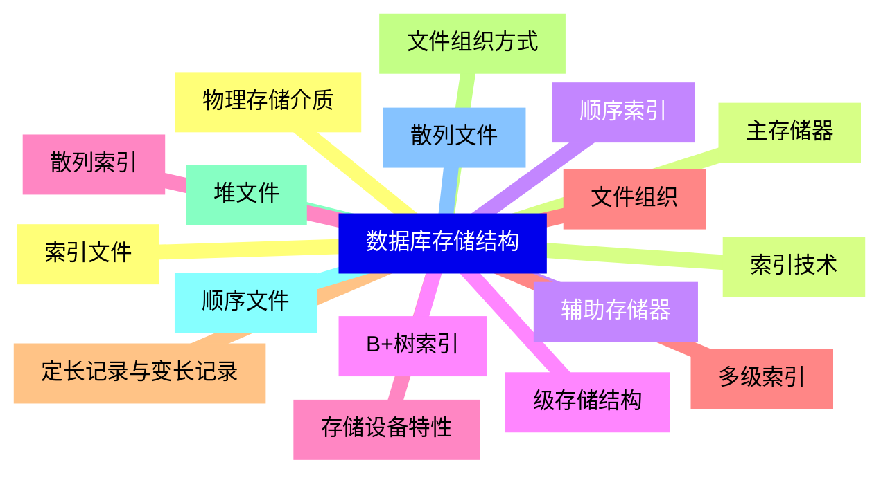
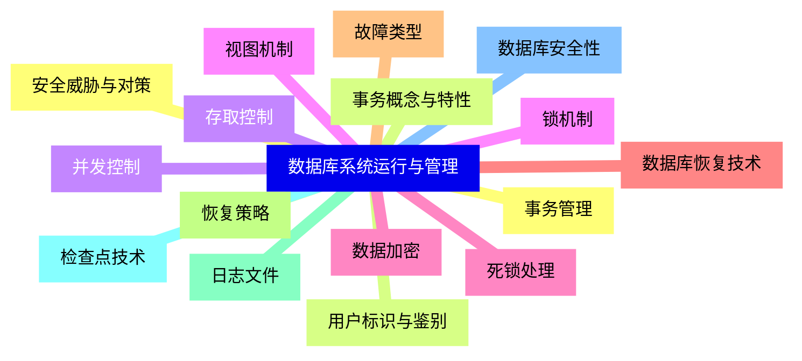
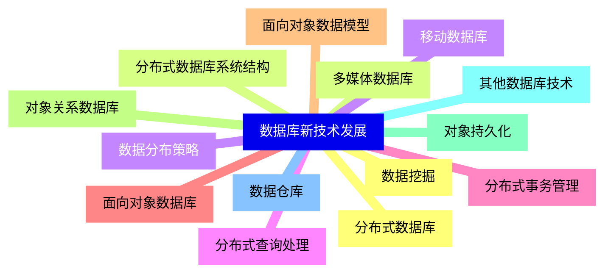


### 1 [数据库系统概述](#1)
#### 1.1 [数据库系统基本概念](#1)
#### 1.2 [数据与信息](#1)
#### 1.3 [数据库定义与特征](#1)
#### 1.4 [数据库管理系统 DBMS](#1)
#### 1.5 [数据库系统组成](#1)
#### 1.6 [数据管理技术的发展](#1)
#### 1.7 [人工管理阶段](#1)
#### 1.8 [文件系统阶段](#1)
#### 1.9 [数据库系统阶段](#1)
#### 1.10 [各阶段特点比较](#1)
#### 1.11 [数据库系统的特点](#1)
#### 1.12 [数据结构化](#1)
#### 1.13 [数据共享性高](#1)
#### 1.14 [数据独立性](#1)
#### 1.15 [数据控制功能](#1)
### 2 [数据模型](#2)
#### 2.1 [数据模型基本概念](#2)
#### 2.2 [数据模型组成要素](#2)
#### 2.3 [数据抽象层次](#2)
#### 2.4 [概念模型](#2)
#### 2.5 [逻辑模型](#2)
#### 2.6 [物理模型](#2)
#### 2.7 [概念模型](#2)
#### 2.8 [实体-联系模型 E-R模型](#2)
#### 2.9 [实体与属性](#2)
#### 2.10 [联系与联系类型](#2)
#### 2.11 [E-R图表示方法](#2)
#### 2.12 [常用数据模型](#2)
#### 2.13 [层次模型](#2)
#### 2.14 [网状模型](#2)
#### 2.15 [关系模型](#2)
#### 2.16 [面向对象模型](#2)
### 3 [数据库系统体系结构](#3)
#### 3.1 [三级模式结构](#3)
#### 3.2 [模式 概念模式](#3)
#### 3.3 [外模式 子模式](#3)
#### 3.4 [内模式 存储模式](#3)
#### 3.5 [级模式关系](#3)
#### 3.6 [两级映像功能](#3)
#### 3.7 [外模式/模式映像](#3)
#### 3.8 [模式/内模式映像](#3)
#### 3.9 [数据独立性实现](#3)
#### 3.10 [逻辑数据独立性](#3)
#### 3.11 [物理数据独立性](#3)
#### 3.12 [数据库系统组成](#3)
#### 3.13 [数据库](#3)
#### 3.14 [数据库管理系统](#3)
#### 3.15 [应用程序](#3)
#### 3.16 [数据库管理员](#3)
#### 3.17 [用户](#3)
### 4 [关系数据库](#4)
#### 4.1 [关系模型基本概念](#4)
#### 4.2 [关系数据结构](#4)
#### 4.3 [关系操作集合](#4)
#### 4.4 [关系完整性约束](#4)
#### 4.5 [关系代数](#4)
#### 4.6 [关系数据库标准语言SQL](#4)
#### 4.7 [数据定义语言 DDL](#4)
#### 4.8 [数据操纵语言 DML](#4)
#### 4.9 [数据控制语言 DCL](#4)
#### 4.10 [数据查询语言 DQL](#4)
#### 4.11 [关系数据库设计](#4)
#### 4.12 [函数依赖](#4)
#### 4.13 [范式理论](#4)
#### 4.14 [关系规范化](#4)
#### 4.15 [数据库设计步骤](#4)
### 5 [数据库存储结构](#5)
#### 5.1 [物理存储介质](#5)
#### 5.2 [主存储器](#5)
#### 5.3 [辅助存储器](#5)
#### 5.4 [级存储结构](#5)
#### 5.5 [存储设备特性](#5)
#### 5.6 [文件组织](#5)
#### 5.7 [定长记录与变长记录](#5)
#### 5.8 [文件组织方式](#5)
#### 5.9 [堆文件](#5)
#### 5.10 [顺序文件](#5)
#### 5.11 [散列文件](#5)
#### 5.12 [索引文件](#5)
#### 5.13 [索引技术](#5)
#### 5.14 [顺序索引](#5)
#### 5.15 [B+树索引](#5)
#### 5.16 [散列索引](#5)
#### 5.17 [多级索引](#5)
### 6 [数据库系统运行与管理](#6)
#### 6.1 [事务管理](#6)
#### 6.2 [事务概念与特性](#6)
#### 6.3 [并发控制](#6)
#### 6.4 [锁机制](#6)
#### 6.5 [死锁处理](#6)
#### 6.6 [数据库恢复技术](#6)
#### 6.7 [故障类型](#6)
#### 6.8 [恢复策略](#6)
#### 6.9 [日志文件](#6)
#### 6.10 [检查点技术](#6)
#### 6.11 [数据库安全性](#6)
#### 6.12 [安全威胁与对策](#6)
#### 6.13 [用户标识与鉴别](#6)
#### 6.14 [存取控制](#6)
#### 6.15 [视图机制](#6)
#### 6.16 [数据加密](#6)
### 7 [数据库新技术发展](#7)
#### 7.1 [分布式数据库](#7)
#### 7.2 [分布式数据库系统结构](#7)
#### 7.3 [数据分布策略](#7)
#### 7.4 [分布式查询处理](#7)
#### 7.5 [分布式事务管理](#7)
#### 7.6 [面向对象数据库](#7)
#### 7.7 [面向对象数据模型](#7)
#### 7.8 [对象关系数据库](#7)
#### 7.9 [对象持久化](#7)
#### 7.10 [其他数据库技术](#7)
#### 7.11 [数据仓库](#7)
#### 7.12 [数据挖掘](#7)
#### 7.13 [多媒体数据库](#7)
#### 7.14 [移动数据库](#7)




### 1 数据库系统概述

---
### 1 数据库系统概述
___
#### 1.1 数据库系统基本概念
___
#### 1.2 数据与信息
___
#### 1.3 数据库定义与特征
___
#### 1.4 数据库管理系统 DBMS
___
#### 1.5 数据库系统组成
___
#### 1.6 数据管理技术的发展
___
#### 1.7 人工管理阶段
___
#### 1.8 文件系统阶段
___
#### 1.9 数据库系统阶段
___
#### 1.10 各阶段特点比较
___
#### 1.11 数据库系统的特点
___
#### 1.12 数据结构化
___
#### 1.13 数据共享性高
___
#### 1.14 数据独立性
___
#### 1.15 数据控制功能
### 2 数据模型

---
### 2 数据模型
___
#### 2.1 数据模型基本概念
___
#### 2.2 数据模型组成要素
___
#### 2.3 数据抽象层次
___
#### 2.4 概念模型
___
#### 2.5 逻辑模型
___
#### 2.6 物理模型
___
#### 2.7 概念模型
___
#### 2.8 实体-联系模型 E-R模型
___
#### 2.9 实体与属性
___
#### 2.10 联系与联系类型
___
#### 2.11 E-R图表示方法
___
#### 2.12 常用数据模型
___
#### 2.13 层次模型
___
#### 2.14 网状模型
___
#### 2.15 关系模型
___
#### 2.16 面向对象模型
### 3 数据库系统体系结构

---
### 3 数据库系统体系结构
___
#### 3.1 三级模式结构
___
#### 3.2 模式 概念模式
___
#### 3.3 外模式 子模式
___
#### 3.4 内模式 存储模式
___
#### 3.5 级模式关系
___
#### 3.6 两级映像功能
___
#### 3.7 外模式/模式映像
___
#### 3.8 模式/内模式映像
___
#### 3.9 数据独立性实现
___
#### 3.10 逻辑数据独立性
___
#### 3.11 物理数据独立性
___
#### 3.12 数据库系统组成
___
#### 3.13 数据库
___
#### 3.14 数据库管理系统
___
#### 3.15 应用程序
___
#### 3.16 数据库管理员
___
#### 3.17 用户
### 4 关系数据库

---
### 4 关系数据库
___
#### 4.1 关系模型基本概念
___
#### 4.2 关系数据结构
___
#### 4.3 关系操作集合
___
#### 4.4 关系完整性约束
___
#### 4.5 关系代数
___
#### 4.6 关系数据库标准语言SQL
___
#### 4.7 数据定义语言 DDL
___
#### 4.8 数据操纵语言 DML
___
#### 4.9 数据控制语言 DCL
___
#### 4.10 数据查询语言 DQL
___
#### 4.11 关系数据库设计
___
#### 4.12 函数依赖
___
#### 4.13 范式理论
___
#### 4.14 关系规范化
___
#### 4.15 数据库设计步骤
### 5 数据库存储结构

---
### 5 数据库存储结构
___
#### 5.1 物理存储介质
___
#### 5.2 主存储器
___
#### 5.3 辅助存储器
___
#### 5.4 级存储结构
___
#### 5.5 存储设备特性
___
#### 5.6 文件组织
___
#### 5.7 定长记录与变长记录
___
#### 5.8 文件组织方式
___
#### 5.9 堆文件
___
#### 5.10 顺序文件
___
#### 5.11 散列文件
___
#### 5.12 索引文件
___
#### 5.13 索引技术
___
#### 5.14 顺序索引
___
#### 5.15 B+树索引
___
#### 5.16 散列索引
___
#### 5.17 多级索引
### 6 数据库系统运行与管理

---
### 6 数据库系统运行与管理
___
#### 6.1 事务管理
___
#### 6.2 事务概念与特性
___
#### 6.3 并发控制
___
#### 6.4 锁机制
___
#### 6.5 死锁处理
___
#### 6.6 数据库恢复技术
___
#### 6.7 故障类型
___
#### 6.8 恢复策略
___
#### 6.9 日志文件
___
#### 6.10 检查点技术
___
#### 6.11 数据库安全性
___
#### 6.12 安全威胁与对策
___
#### 6.13 用户标识与鉴别
___
#### 6.14 存取控制
___
#### 6.15 视图机制
___
#### 6.16 数据加密
### 7 数据库新技术发展

---
### 7 数据库新技术发展
___
#### 7.1 分布式数据库
___
#### 7.2 分布式数据库系统结构
___
#### 7.3 数据分布策略
___
#### 7.4 分布式查询处理
___
#### 7.5 分布式事务管理
___
#### 7.6 面向对象数据库
___
#### 7.7 面向对象数据模型
___
#### 7.8 对象关系数据库
___
#### 7.9 对象持久化
___
#### 7.10 其他数据库技术
___
#### 7.11 数据仓库
___
#### 7.12 数据挖掘
___
#### 7.13 多媒体数据库
___
#### 7.14 移动数据库


### 1 数据库系统概述{#1}

{}

<--->
{}
{}
{}
{}
{}
{}
{}
{}
{}
{}
{}
{}
{}
{}
{}
{}
{}
{}
{}
{}
{}
{}
{}
{}
{}
{}
{}
{}
{}
{}
{}

### 2 数据模型{#2}

{}
{}
{}
{}
{}
{}
{}
{}
{}
{}
{}
{}
{}
{}
{}
{}
{}
{}
{}
{}
{}
{}
{}
{}
{}
{}
{}
{}
{}
{}
{}
{}
{}
<--->

{}

### 3 数据库系统体系结构{#3}

{}

<--->
{}
{}
{}
{}
{}
{}
{}
{}
{}
{}
{}
{}
{}
{}
{}
{}
{}
{}
{}
{}
{}
{}
{}
{}
{}
{}
{}
{}
{}
{}
{}
{}
{}
{}
{}

### 4 关系数据库{#4}

{}
{}
{}
{}
{}
{}
{}
{}
{}
{}
{}
{}
{}
{}
{}
{}
{}
{}
{}
{}
{}
{}
{}
{}
{}
{}
{}
{}
{}
{}
{}
<--->

{}

### 5 数据库存储结构{#5}

{}

<--->
{}
{}
{}
{}
{}
{}
{}
{}
{}
{}
{}
{}
{}
{}
{}
{}
{}
{}
{}
{}
{}
{}
{}
{}
{}
{}
{}
{}
{}
{}
{}
{}
{}
{}
{}

### 6 数据库系统运行与管理{#6}

{}
{}
{}
{}
{}
{}
{}
{}
{}
{}
{}
{}
{}
{}
{}
{}
{}
{}
{}
{}
{}
{}
{}
{}
{}
{}
{}
{}
{}
{}
{}
{}
{}
<--->

{}

### 7 数据库新技术发展{#7}

{}

<--->
{}
{}
{}
{}
{}
{}
{}
{}
{}
{}
{}
{}
{}
{}
{}
{}
{}
{}
{}
{}
{}
{}
{}
{}
{}
{}
{}
{}
{}
