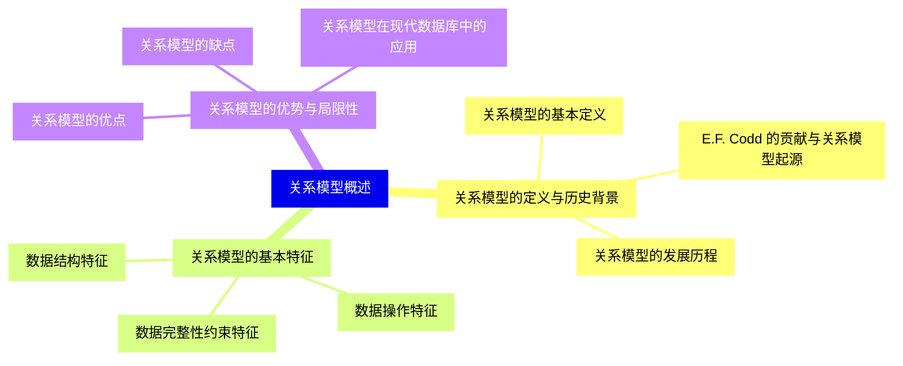
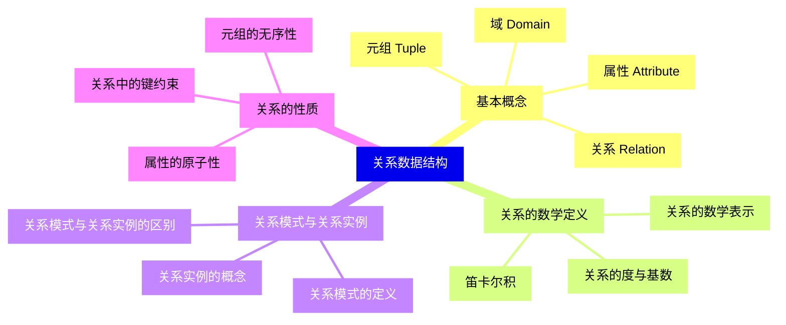
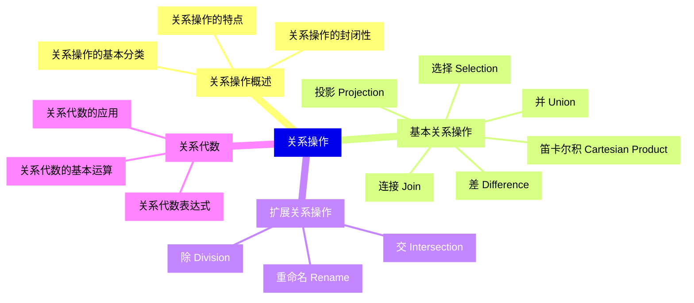
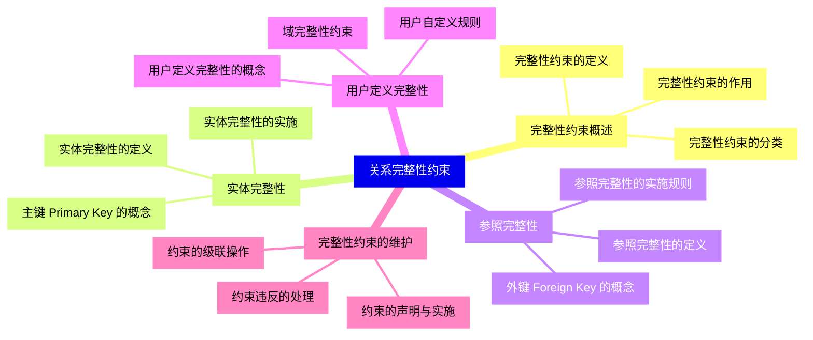
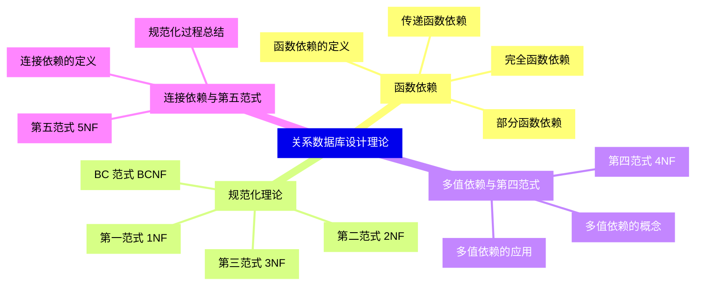
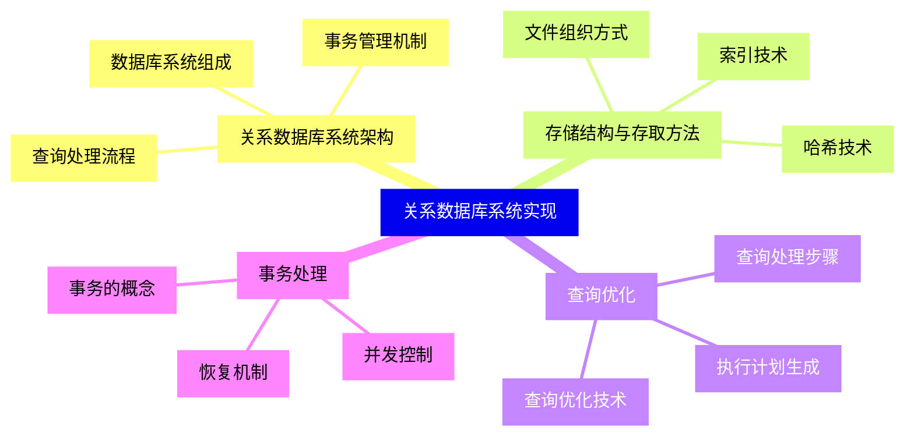
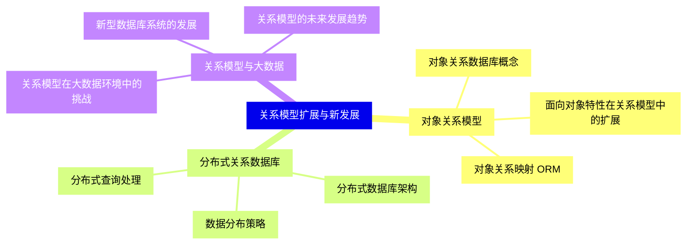

```mermaid
mindmap
    id5[关系数据库标准语言 SQL]
        id5-1[SQL 概述]
            id5-1-1[SQL 的发展历史]
            id5-1-2[SQL 的特点]
            id5-1-3[SQL 的标准化]
        id5-2[数据定义语言 DDL]
            id5-2-1[表的创建与删除]
            id5-2-2[表的修改]
            id5-2-3[索引的创建与管理]
        id5-3[数据操作语言 DML]
            id5-3-1[数据查询 SELECT]
            id5-3-2[数据插入 INSERT]
            id5-3-3[数据更新 UPDATE]
            id5-3-4[数据删除 DELETE]
        id5-4[数据控制语言 DCL]
            id5-4-1[权限管理]
            id5-4-2[事务控制]
            id5-4-3[完整性约束定义]
```

### 1 [关系模型概述](#1)
#### 1.1 [关系模型的定义与历史背景](#1)
##### 1.1.1 [关系模型的基本定义](#1)
##### 1.1.2 [E.F. Codd 的贡献与关系模型起源](#1)
##### 1.1.3 [关系模型的发展历程](#1)
#### 1.2 [关系模型的基本特征](#1)
##### 1.2.1 [数据结构特征](#1)
##### 1.2.2 [数据操作特征](#1)
##### 1.2.3 [数据完整性约束特征](#1)
#### 1.3 [关系模型的优势与局限性](#1)
##### 1.3.1 [关系模型的优点](#1)
##### 1.3.2 [关系模型的缺点](#1)
##### 1.3.3 [关系模型在现代数据库中的应用](#1)
### 2 [关系数据结构](#2)
#### 2.1 [基本概念](#2)
##### 2.1.1 [域 Domain](#2)
##### 2.1.2 [元组 Tuple](#2)
##### 2.1.3 [属性 Attribute](#2)
##### 2.1.4 [关系 Relation](#2)
#### 2.2 [关系的数学定义](#2)
##### 2.2.1 [笛卡尔积](#2)
##### 2.2.2 [关系的数学表示](#2)
##### 2.2.3 [关系的度与基数](#2)
#### 2.3 [关系模式与关系实例](#2)
##### 2.3.1 [关系模式的定义](#2)
##### 2.3.2 [关系实例的概念](#2)
##### 2.3.3 [关系模式与关系实例的区别](#2)
#### 2.4 [关系的性质](#2)
##### 2.4.1 [元组的无序性](#2)
##### 2.4.2 [属性的原子性](#2)
##### 2.4.3 [关系中的键约束](#2)
### 3 [关系操作](#3)
#### 3.1 [关系操作概述](#3)
##### 3.1.1 [关系操作的基本分类](#3)
##### 3.1.2 [关系操作的特点](#3)
##### 3.1.3 [关系操作的封闭性](#3)
#### 3.2 [基本关系操作](#3)
##### 3.2.1 [选择 Selection](#3)
##### 3.2.2 [投影 Projection](#3)
##### 3.2.3 [连接 Join](#3)
##### 3.2.4 [并 Union](#3)
##### 3.2.5 [差 Difference](#3)
##### 3.2.6 [笛卡尔积 Cartesian Product](#3)
#### 3.3 [扩展关系操作](#3)
##### 3.3.1 [交 Intersection](#3)
##### 3.3.2 [除 Division](#3)
##### 3.3.3 [重命名 Rename](#3)
#### 3.4 [关系代数](#3)
##### 3.4.1 [关系代数的基本运算](#3)
##### 3.4.2 [关系代数表达式](#3)
##### 3.4.3 [关系代数的应用](#3)
### 4 [关系完整性约束](#4)
#### 4.1 [完整性约束概述](#4)
##### 4.1.1 [完整性约束的定义](#4)
##### 4.1.2 [完整性约束的作用](#4)
##### 4.1.3 [完整性约束的分类](#4)
#### 4.2 [实体完整性](#4)
##### 4.2.1 [实体完整性的定义](#4)
##### 4.2.2 [主键 Primary Key 的概念](#4)
##### 4.2.3 [实体完整性的实施](#4)
#### 4.3 [参照完整性](#4)
##### 4.3.1 [参照完整性的定义](#4)
##### 4.3.2 [外键 Foreign Key 的概念](#4)
##### 4.3.3 [参照完整性的实施规则](#4)
#### 4.4 [用户定义完整性](#4)
##### 4.4.1 [用户定义完整性的概念](#4)
##### 4.4.2 [域完整性约束](#4)
##### 4.4.3 [用户自定义规则](#4)
#### 4.5 [完整性约束的维护](#4)
##### 4.5.1 [约束的声明与实施](#4)
##### 4.5.2 [约束违反的处理](#4)
##### 4.5.3 [约束的级联操作](#4)
### 5 [关系数据库标准语言 SQL](#5)
#### 5.1 [SQL 概述](#5)
##### 5.1.1 [SQL 的发展历史](#5)
##### 5.1.2 [SQL 的特点](#5)
##### 5.1.3 [SQL 的标准化](#5)
#### 5.2 [数据定义语言 DDL](#5)
##### 5.2.1 [表的创建与删除](#5)
##### 5.2.2 [表的修改](#5)
##### 5.2.3 [索引的创建与管理](#5)
#### 5.3 [数据操作语言 DML](#5)
##### 5.3.1 [数据查询 SELECT](#5)
##### 5.3.2 [数据插入 INSERT](#5)
##### 5.3.3 [数据更新 UPDATE](#5)
##### 5.3.4 [数据删除 DELETE](#5)
#### 5.4 [数据控制语言 DCL](#5)
##### 5.4.1 [权限管理](#5)
##### 5.4.2 [事务控制](#5)
##### 5.4.3 [完整性约束定义](#5)
### 6 [关系数据库设计理论](#6)
#### 6.1 [函数依赖](#6)
##### 6.1.1 [函数依赖的定义](#6)
##### 6.1.2 [完全函数依赖](#6)
##### 6.1.3 [部分函数依赖](#6)
##### 6.1.4 [传递函数依赖](#6)
#### 6.2 [规范化理论](#6)
##### 6.2.1 [第一范式 1NF](#6)
##### 6.2.2 [第二范式 2NF](#6)
##### 6.2.3 [第三范式 3NF](#6)
##### 6.2.4 [BC 范式 BCNF](#6)
#### 6.3 [多值依赖与第四范式](#6)
##### 6.3.1 [多值依赖的概念](#6)
##### 6.3.2 [第四范式 4NF](#6)
##### 6.3.3 [多值依赖的应用](#6)
#### 6.4 [连接依赖与第五范式](#6)
##### 6.4.1 [连接依赖的定义](#6)
##### 6.4.2 [第五范式 5NF](#6)
##### 6.4.3 [规范化过程总结](#6)
### 7 [关系数据库系统实现](#7)
#### 7.1 [关系数据库系统架构](#7)
##### 7.1.1 [数据库系统组成](#7)
##### 7.1.2 [查询处理流程](#7)
##### 7.1.3 [事务管理机制](#7)
#### 7.2 [存储结构与存取方法](#7)
##### 7.2.1 [文件组织方式](#7)
##### 7.2.2 [索引技术](#7)
##### 7.2.3 [哈希技术](#7)
#### 7.3 [查询优化](#7)
##### 7.3.1 [查询处理步骤](#7)
##### 7.3.2 [查询优化技术](#7)
##### 7.3.3 [执行计划生成](#7)
#### 7.4 [事务处理](#7)
##### 7.4.1 [事务的概念](#7)
##### 7.4.2 [并发控制](#7)
##### 7.4.3 [恢复机制](#7)
### 8 [关系模型扩展与新发展](#8)
#### 8.1 [对象关系模型](#8)
##### 8.1.1 [对象关系数据库概念](#8)
##### 8.1.2 [面向对象特性在关系模型中的扩展](#8)
##### 8.1.3 [对象关系映射 ORM](#8)
#### 8.2 [分布式关系数据库](#8)
##### 8.2.1 [分布式数据库架构](#8)
##### 8.2.2 [数据分布策略](#8)
##### 8.2.3 [分布式查询处理](#8)
#### 8.3 [关系模型与大数据](#8)
##### 8.3.1 [关系模型在大数据环境中的挑战](#8)
##### 8.3.2 [新型数据库系统的发展](#8)
##### 8.3.3 [关系模型的未来发展趋势](#8)




### 1 关系模型概述

---
### 1 关系模型概述
___
#### 1.1 关系模型的定义与历史背景
___
##### 1.1.1 关系模型的基本定义
___
##### 1.1.2 E.F. Codd 的贡献与关系模型起源
___
##### 1.1.3 关系模型的发展历程
___
#### 1.2 关系模型的基本特征
___
##### 1.2.1 数据结构特征
___
##### 1.2.2 数据操作特征
___
##### 1.2.3 数据完整性约束特征
___
#### 1.3 关系模型的优势与局限性
___
##### 1.3.1 关系模型的优点
___
##### 1.3.2 关系模型的缺点
___
##### 1.3.3 关系模型在现代数据库中的应用
### 2 关系数据结构

---
### 2 关系数据结构
___
#### 2.1 基本概念
___
##### 2.1.1 域 Domain
___
##### 2.1.2 元组 Tuple
___
##### 2.1.3 属性 Attribute
___
##### 2.1.4 关系 Relation
___
#### 2.2 关系的数学定义
___
##### 2.2.1 笛卡尔积
___
##### 2.2.2 关系的数学表示
___
##### 2.2.3 关系的度与基数
___
#### 2.3 关系模式与关系实例
___
##### 2.3.1 关系模式的定义
___
##### 2.3.2 关系实例的概念
___
##### 2.3.3 关系模式与关系实例的区别
___
#### 2.4 关系的性质
___
##### 2.4.1 元组的无序性
___
##### 2.4.2 属性的原子性
___
##### 2.4.3 关系中的键约束
### 3 关系操作

---
### 3 关系操作
___
#### 3.1 关系操作概述
___
##### 3.1.1 关系操作的基本分类
___
##### 3.1.2 关系操作的特点
___
##### 3.1.3 关系操作的封闭性
___
#### 3.2 基本关系操作
___
##### 3.2.1 选择 Selection
___
##### 3.2.2 投影 Projection
___
##### 3.2.3 连接 Join
___
##### 3.2.4 并 Union
___
##### 3.2.5 差 Difference
___
##### 3.2.6 笛卡尔积 Cartesian Product
___
#### 3.3 扩展关系操作
___
##### 3.3.1 交 Intersection
___
##### 3.3.2 除 Division
___
##### 3.3.3 重命名 Rename
___
#### 3.4 关系代数
___
##### 3.4.1 关系代数的基本运算
___
##### 3.4.2 关系代数表达式
___
##### 3.4.3 关系代数的应用
### 4 关系完整性约束

---
### 4 关系完整性约束
___
#### 4.1 完整性约束概述
___
##### 4.1.1 完整性约束的定义
___
##### 4.1.2 完整性约束的作用
___
##### 4.1.3 完整性约束的分类
___
#### 4.2 实体完整性
___
##### 4.2.1 实体完整性的定义
___
##### 4.2.2 主键 Primary Key 的概念
___
##### 4.2.3 实体完整性的实施
___
#### 4.3 参照完整性
___
##### 4.3.1 参照完整性的定义
___
##### 4.3.2 外键 Foreign Key 的概念
___
##### 4.3.3 参照完整性的实施规则
___
#### 4.4 用户定义完整性
___
##### 4.4.1 用户定义完整性的概念
___
##### 4.4.2 域完整性约束
___
##### 4.4.3 用户自定义规则
___
#### 4.5 完整性约束的维护
___
##### 4.5.1 约束的声明与实施
___
##### 4.5.2 约束违反的处理
___
##### 4.5.3 约束的级联操作
### 5 关系数据库标准语言 SQL

---
### 5 关系数据库标准语言 SQL
___
#### 5.1 SQL 概述
___
##### 5.1.1 SQL 的发展历史
___
##### 5.1.2 SQL 的特点
___
##### 5.1.3 SQL 的标准化
___
#### 5.2 数据定义语言 DDL
___
##### 5.2.1 表的创建与删除
___
##### 5.2.2 表的修改
___
##### 5.2.3 索引的创建与管理
___
#### 5.3 数据操作语言 DML
___
##### 5.3.1 数据查询 SELECT
___
##### 5.3.2 数据插入 INSERT
___
##### 5.3.3 数据更新 UPDATE
___
##### 5.3.4 数据删除 DELETE
___
#### 5.4 数据控制语言 DCL
___
##### 5.4.1 权限管理
___
##### 5.4.2 事务控制
___
##### 5.4.3 完整性约束定义
### 6 关系数据库设计理论

---
### 6 关系数据库设计理论
___
#### 6.1 函数依赖
___
##### 6.1.1 函数依赖的定义
___
##### 6.1.2 完全函数依赖
___
##### 6.1.3 部分函数依赖
___
##### 6.1.4 传递函数依赖
___
#### 6.2 规范化理论
___
##### 6.2.1 第一范式 1NF
___
##### 6.2.2 第二范式 2NF
___
##### 6.2.3 第三范式 3NF
___
##### 6.2.4 BC 范式 BCNF
___
#### 6.3 多值依赖与第四范式
___
##### 6.3.1 多值依赖的概念
___
##### 6.3.2 第四范式 4NF
___
##### 6.3.3 多值依赖的应用
___
#### 6.4 连接依赖与第五范式
___
##### 6.4.1 连接依赖的定义
___
##### 6.4.2 第五范式 5NF
___
##### 6.4.3 规范化过程总结
### 7 关系数据库系统实现

---
### 7 关系数据库系统实现
___
#### 7.1 关系数据库系统架构
___
##### 7.1.1 数据库系统组成
___
##### 7.1.2 查询处理流程
___
##### 7.1.3 事务管理机制
___
#### 7.2 存储结构与存取方法
___
##### 7.2.1 文件组织方式
___
##### 7.2.2 索引技术
___
##### 7.2.3 哈希技术
___
#### 7.3 查询优化
___
##### 7.3.1 查询处理步骤
___
##### 7.3.2 查询优化技术
___
##### 7.3.3 执行计划生成
___
#### 7.4 事务处理
___
##### 7.4.1 事务的概念
___
##### 7.4.2 并发控制
___
##### 7.4.3 恢复机制
### 8 关系模型扩展与新发展

---
### 8 关系模型扩展与新发展
___
#### 8.1 对象关系模型
___
##### 8.1.1 对象关系数据库概念
___
##### 8.1.2 面向对象特性在关系模型中的扩展
___
##### 8.1.3 对象关系映射 ORM
___
#### 8.2 分布式关系数据库
___
##### 8.2.1 分布式数据库架构
___
##### 8.2.2 数据分布策略
___
##### 8.2.3 分布式查询处理
___
#### 8.3 关系模型与大数据
___
##### 8.3.1 关系模型在大数据环境中的挑战
___
##### 8.3.2 新型数据库系统的发展
___
##### 8.3.3 关系模型的未来发展趋势


### 1 关系模型概述{#1}

{}

<--->
{}
{}
{}
{}
{}
{}
{}
{}
{}
{}
{}
{}
{}
{}
{}
{}
{}
{}
{}
{}
{}
{}
{}
{}
{}

### 2 关系数据结构{#2}

{}
{}
{}
{}
{}
{}
{}
{}
{}
{}
{}
{}
{}
{}
{}
{}
{}
{}
{}
{}
{}
{}
{}
{}
{}
{}
{}
{}
{}
{}
{}
{}
{}
{}
{}
<--->

{}

### 3 关系操作{#3}

{}

<--->
{}
{}
{}
{}
{}
{}
{}
{}
{}
{}
{}
{}
{}
{}
{}
{}
{}
{}
{}
{}
{}
{}
{}
{}
{}
{}
{}
{}
{}
{}
{}
{}
{}
{}
{}
{}
{}
{}
{}

### 4 关系完整性约束{#4}

{}
{}
{}
{}
{}
{}
{}
{}
{}
{}
{}
{}
{}
{}
{}
{}
{}
{}
{}
{}
{}
{}
{}
{}
{}
{}
{}
{}
{}
{}
{}
{}
{}
{}
{}
{}
{}
{}
{}
{}
{}
<--->

{}

### 5 关系数据库标准语言 SQL{#5}

{}

<--->
{}
{}
{}
{}
{}
{}
{}
{}
{}
{}
{}
{}
{}
{}
{}
{}
{}
{}
{}
{}
{}
{}
{}
{}
{}
{}
{}
{}
{}
{}
{}
{}
{}
{}
{}

### 6 关系数据库设计理论{#6}

{}
{}
{}
{}
{}
{}
{}
{}
{}
{}
{}
{}
{}
{}
{}
{}
{}
{}
{}
{}
{}
{}
{}
{}
{}
{}
{}
{}
{}
{}
{}
{}
{}
{}
{}
{}
{}
<--->

{}

### 7 关系数据库系统实现{#7}

{}

<--->
{}
{}
{}
{}
{}
{}
{}
{}
{}
{}
{}
{}
{}
{}
{}
{}
{}
{}
{}
{}
{}
{}
{}
{}
{}
{}
{}
{}
{}
{}
{}
{}
{}

### 8 关系模型扩展与新发展{#8}

{}
{}
{}
{}
{}
{}
{}
{}
{}
{}
{}
{}
{}
{}
{}
{}
{}
{}
{}
{}
{}
{}
{}
{}
{}
<--->

{}
