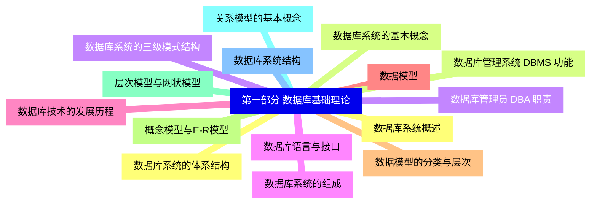
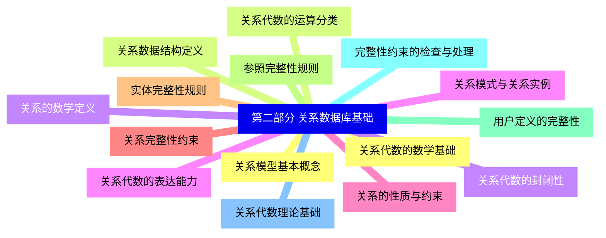
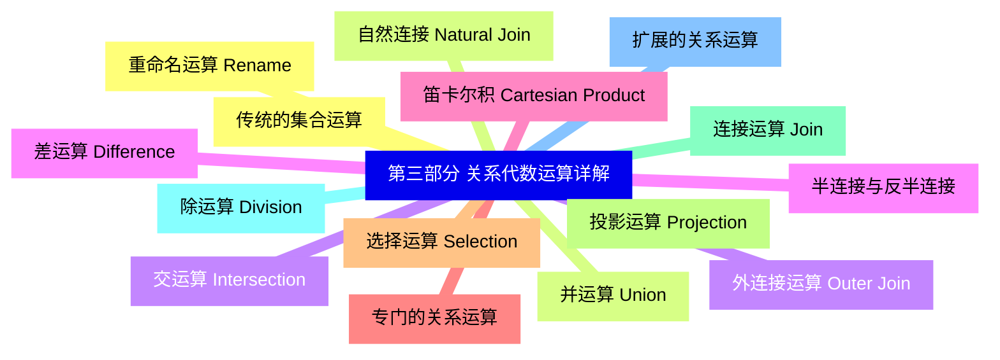
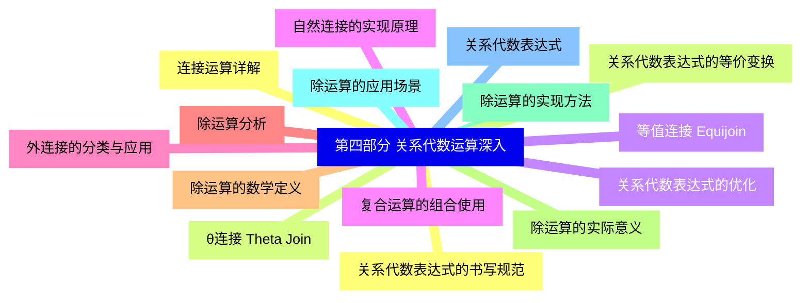
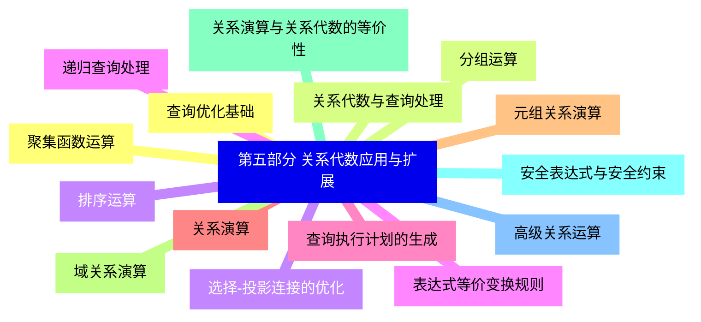
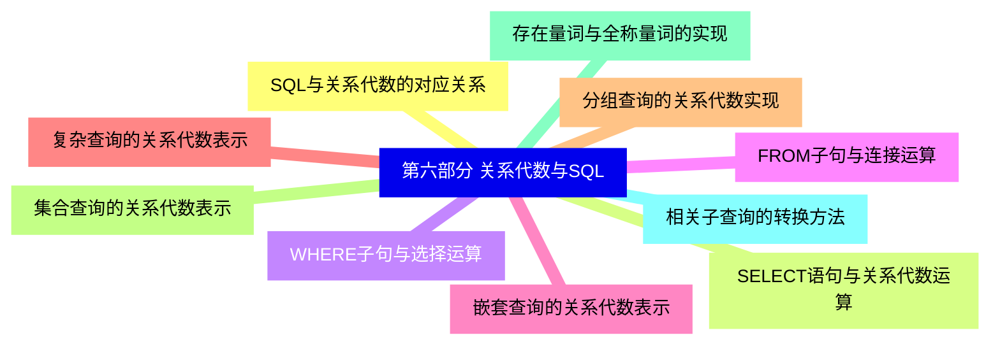
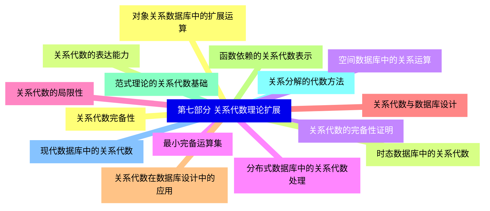


### 1 [第一部分 数据库基础理论](#1)
#### 1.1 [数据库系统概述](#1)
#### 1.2 [数据库系统的基本概念](#1)
#### 1.3 [数据库系统的三级模式结构](#1)
#### 1.4 [数据库系统的组成](#1)
#### 1.5 [数据库技术的发展历程](#1)
#### 1.6 [数据模型](#1)
#### 1.7 [数据模型的分类与层次](#1)
#### 1.8 [概念模型与E-R模型](#1)
#### 1.9 [层次模型与网状模型](#1)
#### 1.10 [关系模型的基本概念](#1)
#### 1.11 [数据库系统结构](#1)
#### 1.12 [数据库系统的体系结构](#1)
#### 1.13 [数据库管理系统 DBMS 功能](#1)
#### 1.14 [数据库管理员 DBA 职责](#1)
#### 1.15 [数据库语言与接口](#1)
### 2 [第二部分 关系数据库基础](#2)
#### 2.1 [关系模型基本概念](#2)
#### 2.2 [关系数据结构定义](#2)
#### 2.3 [关系的数学定义](#2)
#### 2.4 [关系模式与关系实例](#2)
#### 2.5 [关系的性质与约束](#2)
#### 2.6 [关系完整性约束](#2)
#### 2.7 [实体完整性规则](#2)
#### 2.8 [参照完整性规则](#2)
#### 2.9 [用户定义的完整性](#2)
#### 2.10 [完整性约束的检查与处理](#2)
#### 2.11 [关系代数理论基础](#2)
#### 2.12 [关系代数的数学基础](#2)
#### 2.13 [关系代数的运算分类](#2)
#### 2.14 [关系代数的封闭性](#2)
#### 2.15 [关系代数的表达能力](#2)
### 3 [第三部分 关系代数运算详解](#3)
#### 3.1 [传统的集合运算](#3)
#### 3.2 [并运算 Union](#3)
#### 3.3 [交运算 Intersection](#3)
#### 3.4 [差运算 Difference](#3)
#### 3.5 [笛卡尔积 Cartesian Product](#3)
#### 3.6 [专门的关系运算](#3)
#### 3.7 [选择运算 Selection](#3)
#### 3.8 [投影运算 Projection](#3)
#### 3.9 [连接运算 Join](#3)
#### 3.10 [除运算 Division](#3)
#### 3.11 [扩展的关系运算](#3)
#### 3.12 [重命名运算 Rename](#3)
#### 3.13 [自然连接 Natural Join](#3)
#### 3.14 [外连接运算 Outer Join](#3)
#### 3.15 [半连接与反半连接](#3)
### 4 [第四部分 关系代数运算深入](#4)
#### 4.1 [连接运算详解](#4)
#### 4.2 [θ连接 Theta Join](#4)
#### 4.3 [等值连接 Equijoin](#4)
#### 4.4 [自然连接的实现原理](#4)
#### 4.5 [外连接的分类与应用](#4)
#### 4.6 [除运算分析](#4)
#### 4.7 [除运算的数学定义](#4)
#### 4.8 [除运算的实际意义](#4)
#### 4.9 [除运算的实现方法](#4)
#### 4.10 [除运算的应用场景](#4)
#### 4.11 [关系代数表达式](#4)
#### 4.12 [关系代数表达式的书写规范](#4)
#### 4.13 [关系代数表达式的等价变换](#4)
#### 4.14 [关系代数表达式的优化](#4)
#### 4.15 [复合运算的组合使用](#4)
### 5 [第五部分 关系代数应用与扩展](#5)
#### 5.1 [查询优化基础](#5)
#### 5.2 [关系代数与查询处理](#5)
#### 5.3 [选择-投影连接的优化](#5)
#### 5.4 [表达式等价变换规则](#5)
#### 5.5 [查询执行计划的生成](#5)
#### 5.6 [关系演算](#5)
#### 5.7 [元组关系演算](#5)
#### 5.8 [域关系演算](#5)
#### 5.9 [关系演算与关系代数的等价性](#5)
#### 5.10 [安全表达式与安全约束](#5)
#### 5.11 [高级关系运算](#5)
#### 5.12 [聚集函数运算](#5)
#### 5.13 [分组运算](#5)
#### 5.14 [排序运算](#5)
#### 5.15 [递归查询处理](#5)
### 6 [第六部分 关系代数与SQL](#6)
#### 6.1 [SQL与关系代数的对应关系](#6)
#### 6.2 [SELECT语句与关系代数运算](#6)
#### 6.3 [WHERE子句与选择运算](#6)
#### 6.4 [FROM子句与连接运算](#6)
#### 6.5 [嵌套查询的关系代数表示](#6)
#### 6.6 [复杂查询的关系代数表示](#6)
#### 6.7 [分组查询的关系代数实现](#6)
#### 6.8 [集合查询的关系代数表示](#6)
#### 6.9 [存在量词与全称量词的实现](#6)
#### 6.10 [相关子查询的转换方法](#6)
### 7 [第七部分 关系代数理论扩展](#7)
#### 7.1 [关系代数完备性](#7)
#### 7.2 [关系代数的表达能力](#7)
#### 7.3 [关系代数的完备性证明](#7)
#### 7.4 [最小完备运算集](#7)
#### 7.5 [关系代数的局限性](#7)
#### 7.6 [关系代数与数据库设计](#7)
#### 7.7 [关系代数在数据库设计中的应用](#7)
#### 7.8 [函数依赖的关系代数表示](#7)
#### 7.9 [范式理论的关系代数基础](#7)
#### 7.10 [关系分解的代数方法](#7)
#### 7.11 [现代数据库中的关系代数](#7)
#### 7.12 [对象关系数据库中的扩展运算](#7)
#### 7.13 [时态数据库中的关系代数](#7)
#### 7.14 [空间数据库中的关系运算](#7)
#### 7.15 [分布式数据库中的关系代数处理](#7)




### 1 第一部分 数据库基础理论

---
### 1 第一部分 数据库基础理论
___
#### 1.1 数据库系统概述
___
#### 1.2 数据库系统的基本概念
___
#### 1.3 数据库系统的三级模式结构
___
#### 1.4 数据库系统的组成
___
#### 1.5 数据库技术的发展历程
___
#### 1.6 数据模型
___
#### 1.7 数据模型的分类与层次
___
#### 1.8 概念模型与E-R模型
___
#### 1.9 层次模型与网状模型
___
#### 1.10 关系模型的基本概念
___
#### 1.11 数据库系统结构
___
#### 1.12 数据库系统的体系结构
___
#### 1.13 数据库管理系统 DBMS 功能
___
#### 1.14 数据库管理员 DBA 职责
___
#### 1.15 数据库语言与接口
### 2 第二部分 关系数据库基础

---
### 2 第二部分 关系数据库基础
___
#### 2.1 关系模型基本概念
___
#### 2.2 关系数据结构定义
___
#### 2.3 关系的数学定义
___
#### 2.4 关系模式与关系实例
___
#### 2.5 关系的性质与约束
___
#### 2.6 关系完整性约束
___
#### 2.7 实体完整性规则
___
#### 2.8 参照完整性规则
___
#### 2.9 用户定义的完整性
___
#### 2.10 完整性约束的检查与处理
___
#### 2.11 关系代数理论基础
___
#### 2.12 关系代数的数学基础
___
#### 2.13 关系代数的运算分类
___
#### 2.14 关系代数的封闭性
___
#### 2.15 关系代数的表达能力
### 3 第三部分 关系代数运算详解

---
### 3 第三部分 关系代数运算详解
___
#### 3.1 传统的集合运算
___
#### 3.2 并运算 Union
___
#### 3.3 交运算 Intersection
___
#### 3.4 差运算 Difference
___
#### 3.5 笛卡尔积 Cartesian Product
___
#### 3.6 专门的关系运算
___
#### 3.7 选择运算 Selection
___
#### 3.8 投影运算 Projection
___
#### 3.9 连接运算 Join
___
#### 3.10 除运算 Division
___
#### 3.11 扩展的关系运算
___
#### 3.12 重命名运算 Rename
___
#### 3.13 自然连接 Natural Join
___
#### 3.14 外连接运算 Outer Join
___
#### 3.15 半连接与反半连接
### 4 第四部分 关系代数运算深入

---
### 4 第四部分 关系代数运算深入
___
#### 4.1 连接运算详解
___
#### 4.2 θ连接 Theta Join
___
#### 4.3 等值连接 Equijoin
___
#### 4.4 自然连接的实现原理
___
#### 4.5 外连接的分类与应用
___
#### 4.6 除运算分析
___
#### 4.7 除运算的数学定义
___
#### 4.8 除运算的实际意义
___
#### 4.9 除运算的实现方法
___
#### 4.10 除运算的应用场景
___
#### 4.11 关系代数表达式
___
#### 4.12 关系代数表达式的书写规范
___
#### 4.13 关系代数表达式的等价变换
___
#### 4.14 关系代数表达式的优化
___
#### 4.15 复合运算的组合使用
### 5 第五部分 关系代数应用与扩展

---
### 5 第五部分 关系代数应用与扩展
___
#### 5.1 查询优化基础
___
#### 5.2 关系代数与查询处理
___
#### 5.3 选择-投影连接的优化
___
#### 5.4 表达式等价变换规则
___
#### 5.5 查询执行计划的生成
___
#### 5.6 关系演算
___
#### 5.7 元组关系演算
___
#### 5.8 域关系演算
___
#### 5.9 关系演算与关系代数的等价性
___
#### 5.10 安全表达式与安全约束
___
#### 5.11 高级关系运算
___
#### 5.12 聚集函数运算
___
#### 5.13 分组运算
___
#### 5.14 排序运算
___
#### 5.15 递归查询处理
### 6 第六部分 关系代数与SQL

---
### 6 第六部分 关系代数与SQL
___
#### 6.1 SQL与关系代数的对应关系
___
#### 6.2 SELECT语句与关系代数运算
___
#### 6.3 WHERE子句与选择运算
___
#### 6.4 FROM子句与连接运算
___
#### 6.5 嵌套查询的关系代数表示
___
#### 6.6 复杂查询的关系代数表示
___
#### 6.7 分组查询的关系代数实现
___
#### 6.8 集合查询的关系代数表示
___
#### 6.9 存在量词与全称量词的实现
___
#### 6.10 相关子查询的转换方法
### 7 第七部分 关系代数理论扩展

---
### 7 第七部分 关系代数理论扩展
___
#### 7.1 关系代数完备性
___
#### 7.2 关系代数的表达能力
___
#### 7.3 关系代数的完备性证明
___
#### 7.4 最小完备运算集
___
#### 7.5 关系代数的局限性
___
#### 7.6 关系代数与数据库设计
___
#### 7.7 关系代数在数据库设计中的应用
___
#### 7.8 函数依赖的关系代数表示
___
#### 7.9 范式理论的关系代数基础
___
#### 7.10 关系分解的代数方法
___
#### 7.11 现代数据库中的关系代数
___
#### 7.12 对象关系数据库中的扩展运算
___
#### 7.13 时态数据库中的关系代数
___
#### 7.14 空间数据库中的关系运算
___
#### 7.15 分布式数据库中的关系代数处理


### 1 第一部分 数据库基础理论{#1}

{}

<--->
{}
{}
{}
{}
{}
{}
{}
{}
{}
{}
{}
{}
{}
{}
{}
{}
{}
{}
{}
{}
{}
{}
{}
{}
{}
{}
{}
{}
{}
{}
{}

### 2 第二部分 关系数据库基础{#2}

{}
{}
{}
{}
{}
{}
{}
{}
{}
{}
{}
{}
{}
{}
{}
{}
{}
{}
{}
{}
{}
{}
{}
{}
{}
{}
{}
{}
{}
{}
{}
<--->

{}

### 3 第三部分 关系代数运算详解{#3}

{}

<--->
{}
{}
{}
{}
{}
{}
{}
{}
{}
{}
{}
{}
{}
{}
{}
{}
{}
{}
{}
{}
{}
{}
{}
{}
{}
{}
{}
{}
{}
{}
{}

### 4 第四部分 关系代数运算深入{#4}

{}
{}
{}
{}
{}
{}
{}
{}
{}
{}
{}
{}
{}
{}
{}
{}
{}
{}
{}
{}
{}
{}
{}
{}
{}
{}
{}
{}
{}
{}
{}
<--->

{}

### 5 第五部分 关系代数应用与扩展{#5}

{}

<--->
{}
{}
{}
{}
{}
{}
{}
{}
{}
{}
{}
{}
{}
{}
{}
{}
{}
{}
{}
{}
{}
{}
{}
{}
{}
{}
{}
{}
{}
{}
{}

### 6 第六部分 关系代数与SQL{#6}

{}
{}
{}
{}
{}
{}
{}
{}
{}
{}
{}
{}
{}
{}
{}
{}
{}
{}
{}
{}
{}
<--->

{}

### 7 第七部分 关系代数理论扩展{#7}

{}

<--->
{}
{}
{}
{}
{}
{}
{}
{}
{}
{}
{}
{}
{}
{}
{}
{}
{}
{}
{}
{}
{}
{}
{}
{}
{}
{}
{}
{}
{}
{}
{}
