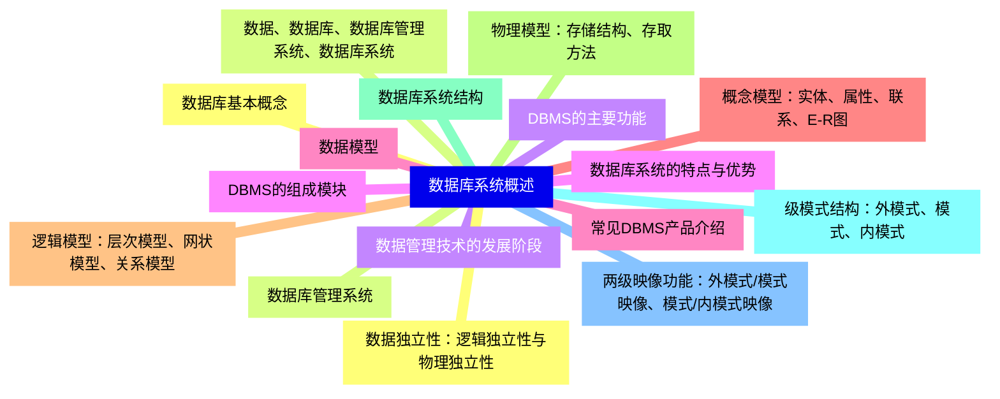
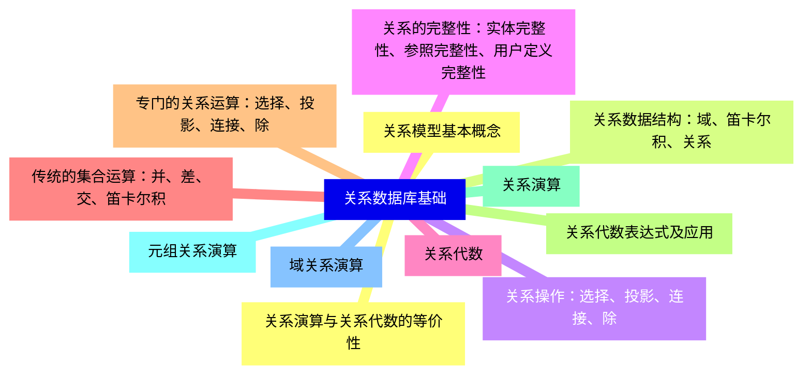
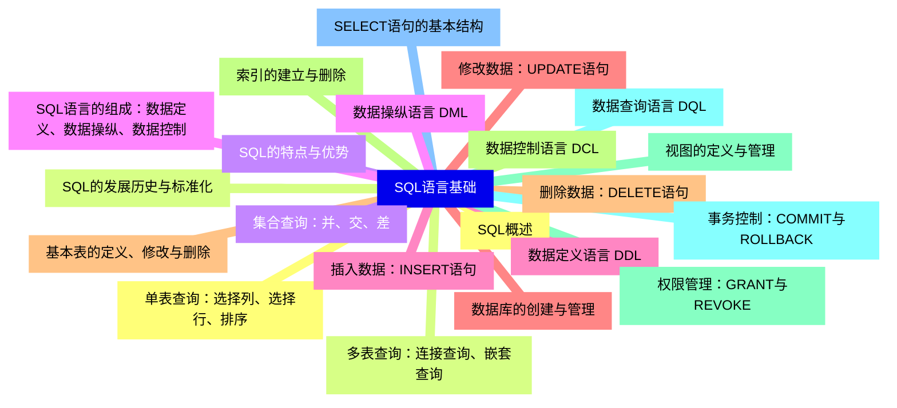
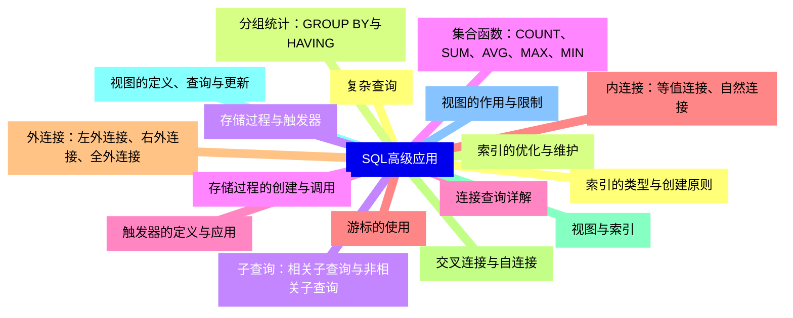
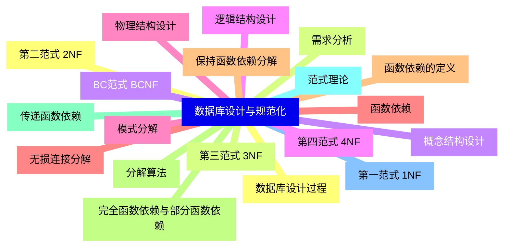
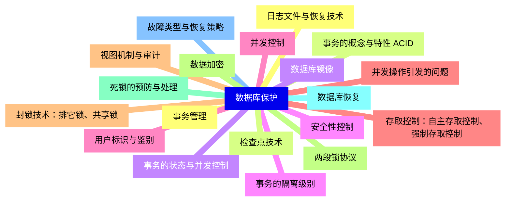
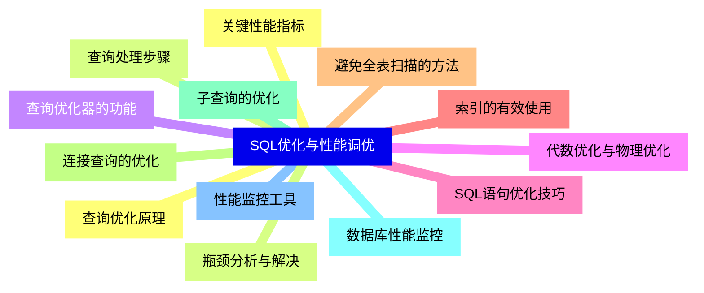
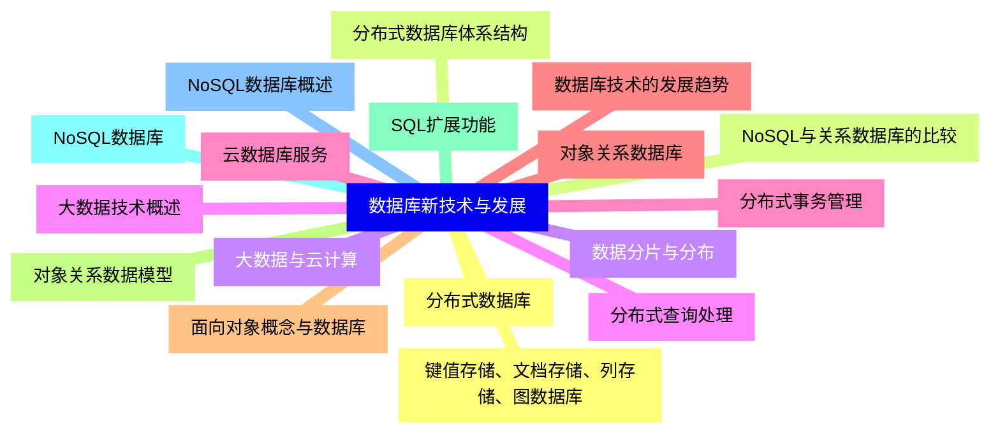


### 1 [数据库系统概述](#1)
#### 1.1 [数据库基本概念](#1)
#### 1.2 [数据、数据库、数据库管理系统、数据库系统](#1)
#### 1.3 [数据管理技术的发展阶段](#1)
#### 1.4 [数据库系统的特点与优势](#1)
#### 1.5 [数据模型](#1)
#### 1.6 [概念模型：实体、属性、联系、E-R图](#1)
#### 1.7 [逻辑模型：层次模型、网状模型、关系模型](#1)
#### 1.8 [物理模型：存储结构、存取方法](#1)
#### 1.9 [数据库系统结构](#1)
#### 1.10 [级模式结构：外模式、模式、内模式](#1)
#### 1.11 [两级映像功能：外模式/模式映像、模式/内模式映像](#1)
#### 1.12 [数据独立性：逻辑独立性与物理独立性](#1)
#### 1.13 [数据库管理系统](#1)
#### 1.14 [DBMS的主要功能](#1)
#### 1.15 [DBMS的组成模块](#1)
#### 1.16 [常见DBMS产品介绍](#1)
### 2 [关系数据库基础](#2)
#### 2.1 [关系模型基本概念](#2)
#### 2.2 [关系数据结构：域、笛卡尔积、关系](#2)
#### 2.3 [关系操作：选择、投影、连接、除](#2)
#### 2.4 [关系的完整性：实体完整性、参照完整性、用户定义完整性](#2)
#### 2.5 [关系代数](#2)
#### 2.6 [传统的集合运算：并、差、交、笛卡尔积](#2)
#### 2.7 [专门的关系运算：选择、投影、连接、除](#2)
#### 2.8 [关系代数表达式及应用](#2)
#### 2.9 [关系演算](#2)
#### 2.10 [元组关系演算](#2)
#### 2.11 [域关系演算](#2)
#### 2.12 [关系演算与关系代数的等价性](#2)
### 3 [SQL语言基础](#3)
#### 3.1 [SQL概述](#3)
#### 3.2 [SQL的发展历史与标准化](#3)
#### 3.3 [SQL的特点与优势](#3)
#### 3.4 [SQL语言的组成：数据定义、数据操纵、数据控制](#3)
#### 3.5 [数据定义语言 DDL](#3)
#### 3.6 [数据库的创建与管理](#3)
#### 3.7 [基本表的定义、修改与删除](#3)
#### 3.8 [索引的建立与删除](#3)
#### 3.9 [视图的定义与管理](#3)
#### 3.10 [数据查询语言 DQL](#3)
#### 3.11 [SELECT语句的基本结构](#3)
#### 3.12 [单表查询：选择列、选择行、排序](#3)
#### 3.13 [多表查询：连接查询、嵌套查询](#3)
#### 3.14 [集合查询：并、交、差](#3)
#### 3.15 [数据操纵语言 DML](#3)
#### 3.16 [插入数据：INSERT语句](#3)
#### 3.17 [修改数据：UPDATE语句](#3)
#### 3.18 [删除数据：DELETE语句](#3)
#### 3.19 [数据控制语言 DCL](#3)
#### 3.20 [权限管理：GRANT与REVOKE](#3)
#### 3.21 [事务控制：COMMIT与ROLLBACK](#3)
### 4 [SQL高级应用](#4)
#### 4.1 [复杂查询](#4)
#### 4.2 [分组统计：GROUP BY与HAVING](#4)
#### 4.3 [子查询：相关子查询与非相关子查询](#4)
#### 4.4 [集合函数：COUNT、SUM、AVG、MAX、MIN](#4)
#### 4.5 [连接查询详解](#4)
#### 4.6 [内连接：等值连接、自然连接](#4)
#### 4.7 [外连接：左外连接、右外连接、全外连接](#4)
#### 4.8 [交叉连接与自连接](#4)
#### 4.9 [视图与索引](#4)
#### 4.10 [视图的定义、查询与更新](#4)
#### 4.11 [视图的作用与限制](#4)
#### 4.12 [索引的类型与创建原则](#4)
#### 4.13 [索引的优化与维护](#4)
#### 4.14 [存储过程与触发器](#4)
#### 4.15 [存储过程的创建与调用](#4)
#### 4.16 [触发器的定义与应用](#4)
#### 4.17 [游标的使用](#4)
### 5 [数据库设计与规范化](#5)
#### 5.1 [数据库设计过程](#5)
#### 5.2 [需求分析](#5)
#### 5.3 [概念结构设计](#5)
#### 5.4 [逻辑结构设计](#5)
#### 5.5 [物理结构设计](#5)
#### 5.6 [函数依赖](#5)
#### 5.7 [函数依赖的定义](#5)
#### 5.8 [完全函数依赖与部分函数依赖](#5)
#### 5.9 [传递函数依赖](#5)
#### 5.10 [范式理论](#5)
#### 5.11 [第一范式 1NF](#5)
#### 5.12 [第二范式 2NF](#5)
#### 5.13 [第三范式 3NF](#5)
#### 5.14 [BC范式 BCNF](#5)
#### 5.15 [第四范式 4NF](#5)
#### 5.16 [模式分解](#5)
#### 5.17 [无损连接分解](#5)
#### 5.18 [保持函数依赖分解](#5)
#### 5.19 [分解算法](#5)
### 6 [数据库保护](#6)
#### 6.1 [事务管理](#6)
#### 6.2 [事务的概念与特性 ACID](#6)
#### 6.3 [事务的状态与并发控制](#6)
#### 6.4 [事务的隔离级别](#6)
#### 6.5 [并发控制](#6)
#### 6.6 [并发操作引发的问题](#6)
#### 6.7 [封锁技术：排它锁、共享锁](#6)
#### 6.8 [两段锁协议](#6)
#### 6.9 [死锁的预防与处理](#6)
#### 6.10 [数据库恢复](#6)
#### 6.11 [故障类型与恢复策略](#6)
#### 6.12 [日志文件与恢复技术](#6)
#### 6.13 [检查点技术](#6)
#### 6.14 [数据库镜像](#6)
#### 6.15 [安全性控制](#6)
#### 6.16 [用户标识与鉴别](#6)
#### 6.17 [存取控制：自主存取控制、强制存取控制](#6)
#### 6.18 [视图机制与审计](#6)
#### 6.19 [数据加密](#6)
### 7 [SQL优化与性能调优](#7)
#### 7.1 [查询优化原理](#7)
#### 7.2 [查询处理步骤](#7)
#### 7.3 [查询优化器的功能](#7)
#### 7.4 [代数优化与物理优化](#7)
#### 7.5 [SQL语句优化技巧](#7)
#### 7.6 [索引的有效使用](#7)
#### 7.7 [避免全表扫描的方法](#7)
#### 7.8 [连接查询的优化](#7)
#### 7.9 [子查询的优化](#7)
#### 7.10 [数据库性能监控](#7)
#### 7.11 [性能监控工具](#7)
#### 7.12 [关键性能指标](#7)
#### 7.13 [瓶颈分析与解决](#7)
### 8 [数据库新技术与发展](#8)
#### 8.1 [分布式数据库](#8)
#### 8.2 [分布式数据库体系结构](#8)
#### 8.3 [数据分片与分布](#8)
#### 8.4 [分布式查询处理](#8)
#### 8.5 [分布式事务管理](#8)
#### 8.6 [对象关系数据库](#8)
#### 8.7 [面向对象概念与数据库](#8)
#### 8.8 [对象关系数据模型](#8)
#### 8.9 [SQL扩展功能](#8)
#### 8.10 [NoSQL数据库](#8)
#### 8.11 [NoSQL数据库概述](#8)
#### 8.12 [键值存储、文档存储、列存储、图数据库](#8)
#### 8.13 [NoSQL与关系数据库的比较](#8)
#### 8.14 [大数据与云计算](#8)
#### 8.15 [大数据技术概述](#8)
#### 8.16 [云数据库服务](#8)
#### 8.17 [数据库技术的发展趋势](#8)




### 1 数据库系统概述

---
### 1 数据库系统概述
___
#### 1.1 数据库基本概念
___
#### 1.2 数据、数据库、数据库管理系统、数据库系统
___
#### 1.3 数据管理技术的发展阶段
___
#### 1.4 数据库系统的特点与优势
___
#### 1.5 数据模型
___
#### 1.6 概念模型：实体、属性、联系、E-R图
___
#### 1.7 逻辑模型：层次模型、网状模型、关系模型
___
#### 1.8 物理模型：存储结构、存取方法
___
#### 1.9 数据库系统结构
___
#### 1.10 级模式结构：外模式、模式、内模式
___
#### 1.11 两级映像功能：外模式/模式映像、模式/内模式映像
___
#### 1.12 数据独立性：逻辑独立性与物理独立性
___
#### 1.13 数据库管理系统
___
#### 1.14 DBMS的主要功能
___
#### 1.15 DBMS的组成模块
___
#### 1.16 常见DBMS产品介绍
### 2 关系数据库基础

---
### 2 关系数据库基础
___
#### 2.1 关系模型基本概念
___
#### 2.2 关系数据结构：域、笛卡尔积、关系
___
#### 2.3 关系操作：选择、投影、连接、除
___
#### 2.4 关系的完整性：实体完整性、参照完整性、用户定义完整性
___
#### 2.5 关系代数
___
#### 2.6 传统的集合运算：并、差、交、笛卡尔积
___
#### 2.7 专门的关系运算：选择、投影、连接、除
___
#### 2.8 关系代数表达式及应用
___
#### 2.9 关系演算
___
#### 2.10 元组关系演算
___
#### 2.11 域关系演算
___
#### 2.12 关系演算与关系代数的等价性
### 3 SQL语言基础

---
### 3 SQL语言基础
___
#### 3.1 SQL概述
___
#### 3.2 SQL的发展历史与标准化
___
#### 3.3 SQL的特点与优势
___
#### 3.4 SQL语言的组成：数据定义、数据操纵、数据控制
___
#### 3.5 数据定义语言 DDL
___
#### 3.6 数据库的创建与管理
___
#### 3.7 基本表的定义、修改与删除
___
#### 3.8 索引的建立与删除
___
#### 3.9 视图的定义与管理
___
#### 3.10 数据查询语言 DQL
___
#### 3.11 SELECT语句的基本结构
___
#### 3.12 单表查询：选择列、选择行、排序
___
#### 3.13 多表查询：连接查询、嵌套查询
___
#### 3.14 集合查询：并、交、差
___
#### 3.15 数据操纵语言 DML
___
#### 3.16 插入数据：INSERT语句
___
#### 3.17 修改数据：UPDATE语句
___
#### 3.18 删除数据：DELETE语句
___
#### 3.19 数据控制语言 DCL
___
#### 3.20 权限管理：GRANT与REVOKE
___
#### 3.21 事务控制：COMMIT与ROLLBACK
### 4 SQL高级应用

---
### 4 SQL高级应用
___
#### 4.1 复杂查询
___
#### 4.2 分组统计：GROUP BY与HAVING
___
#### 4.3 子查询：相关子查询与非相关子查询
___
#### 4.4 集合函数：COUNT、SUM、AVG、MAX、MIN
___
#### 4.5 连接查询详解
___
#### 4.6 内连接：等值连接、自然连接
___
#### 4.7 外连接：左外连接、右外连接、全外连接
___
#### 4.8 交叉连接与自连接
___
#### 4.9 视图与索引
___
#### 4.10 视图的定义、查询与更新
___
#### 4.11 视图的作用与限制
___
#### 4.12 索引的类型与创建原则
___
#### 4.13 索引的优化与维护
___
#### 4.14 存储过程与触发器
___
#### 4.15 存储过程的创建与调用
___
#### 4.16 触发器的定义与应用
___
#### 4.17 游标的使用
### 5 数据库设计与规范化

---
### 5 数据库设计与规范化
___
#### 5.1 数据库设计过程
___
#### 5.2 需求分析
___
#### 5.3 概念结构设计
___
#### 5.4 逻辑结构设计
___
#### 5.5 物理结构设计
___
#### 5.6 函数依赖
___
#### 5.7 函数依赖的定义
___
#### 5.8 完全函数依赖与部分函数依赖
___
#### 5.9 传递函数依赖
___
#### 5.10 范式理论
___
#### 5.11 第一范式 1NF
___
#### 5.12 第二范式 2NF
___
#### 5.13 第三范式 3NF
___
#### 5.14 BC范式 BCNF
___
#### 5.15 第四范式 4NF
___
#### 5.16 模式分解
___
#### 5.17 无损连接分解
___
#### 5.18 保持函数依赖分解
___
#### 5.19 分解算法
### 6 数据库保护

---
### 6 数据库保护
___
#### 6.1 事务管理
___
#### 6.2 事务的概念与特性 ACID
___
#### 6.3 事务的状态与并发控制
___
#### 6.4 事务的隔离级别
___
#### 6.5 并发控制
___
#### 6.6 并发操作引发的问题
___
#### 6.7 封锁技术：排它锁、共享锁
___
#### 6.8 两段锁协议
___
#### 6.9 死锁的预防与处理
___
#### 6.10 数据库恢复
___
#### 6.11 故障类型与恢复策略
___
#### 6.12 日志文件与恢复技术
___
#### 6.13 检查点技术
___
#### 6.14 数据库镜像
___
#### 6.15 安全性控制
___
#### 6.16 用户标识与鉴别
___
#### 6.17 存取控制：自主存取控制、强制存取控制
___
#### 6.18 视图机制与审计
___
#### 6.19 数据加密
### 7 SQL优化与性能调优

---
### 7 SQL优化与性能调优
___
#### 7.1 查询优化原理
___
#### 7.2 查询处理步骤
___
#### 7.3 查询优化器的功能
___
#### 7.4 代数优化与物理优化
___
#### 7.5 SQL语句优化技巧
___
#### 7.6 索引的有效使用
___
#### 7.7 避免全表扫描的方法
___
#### 7.8 连接查询的优化
___
#### 7.9 子查询的优化
___
#### 7.10 数据库性能监控
___
#### 7.11 性能监控工具
___
#### 7.12 关键性能指标
___
#### 7.13 瓶颈分析与解决
### 8 数据库新技术与发展

---
### 8 数据库新技术与发展
___
#### 8.1 分布式数据库
___
#### 8.2 分布式数据库体系结构
___
#### 8.3 数据分片与分布
___
#### 8.4 分布式查询处理
___
#### 8.5 分布式事务管理
___
#### 8.6 对象关系数据库
___
#### 8.7 面向对象概念与数据库
___
#### 8.8 对象关系数据模型
___
#### 8.9 SQL扩展功能
___
#### 8.10 NoSQL数据库
___
#### 8.11 NoSQL数据库概述
___
#### 8.12 键值存储、文档存储、列存储、图数据库
___
#### 8.13 NoSQL与关系数据库的比较
___
#### 8.14 大数据与云计算
___
#### 8.15 大数据技术概述
___
#### 8.16 云数据库服务
___
#### 8.17 数据库技术的发展趋势


### 1 数据库系统概述{#1}

{}

<--->
{}
{}
{}
{}
{}
{}
{}
{}
{}
{}
{}
{}
{}
{}
{}
{}
{}
{}
{}
{}
{}
{}
{}
{}
{}
{}
{}
{}
{}
{}
{}
{}
{}

### 2 关系数据库基础{#2}

{}
{}
{}
{}
{}
{}
{}
{}
{}
{}
{}
{}
{}
{}
{}
{}
{}
{}
{}
{}
{}
{}
{}
{}
{}
<--->

{}

### 3 SQL语言基础{#3}

{}

<--->
{}
{}
{}
{}
{}
{}
{}
{}
{}
{}
{}
{}
{}
{}
{}
{}
{}
{}
{}
{}
{}
{}
{}
{}
{}
{}
{}
{}
{}
{}
{}
{}
{}
{}
{}
{}
{}
{}
{}
{}
{}
{}
{}

### 4 SQL高级应用{#4}

{}
{}
{}
{}
{}
{}
{}
{}
{}
{}
{}
{}
{}
{}
{}
{}
{}
{}
{}
{}
{}
{}
{}
{}
{}
{}
{}
{}
{}
{}
{}
{}
{}
{}
{}
<--->

{}

### 5 数据库设计与规范化{#5}

{}

<--->
{}
{}
{}
{}
{}
{}
{}
{}
{}
{}
{}
{}
{}
{}
{}
{}
{}
{}
{}
{}
{}
{}
{}
{}
{}
{}
{}
{}
{}
{}
{}
{}
{}
{}
{}
{}
{}
{}
{}

### 6 数据库保护{#6}

{}
{}
{}
{}
{}
{}
{}
{}
{}
{}
{}
{}
{}
{}
{}
{}
{}
{}
{}
{}
{}
{}
{}
{}
{}
{}
{}
{}
{}
{}
{}
{}
{}
{}
{}
{}
{}
{}
{}
<--->

{}

### 7 SQL优化与性能调优{#7}

{}

<--->
{}
{}
{}
{}
{}
{}
{}
{}
{}
{}
{}
{}
{}
{}
{}
{}
{}
{}
{}
{}
{}
{}
{}
{}
{}
{}
{}

### 8 数据库新技术与发展{#8}

{}
{}
{}
{}
{}
{}
{}
{}
{}
{}
{}
{}
{}
{}
{}
{}
{}
{}
{}
{}
{}
{}
{}
{}
{}
{}
{}
{}
{}
{}
{}
{}
{}
{}
{}
<--->

{}
