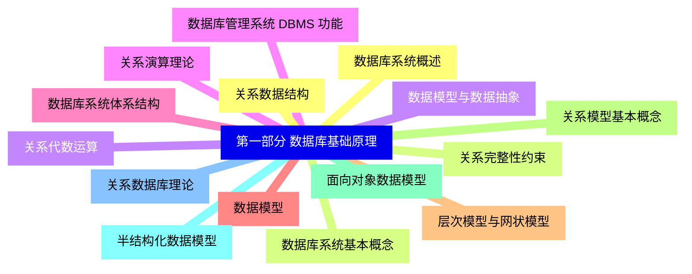
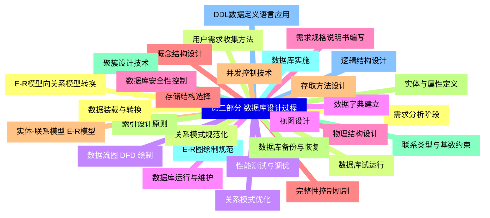
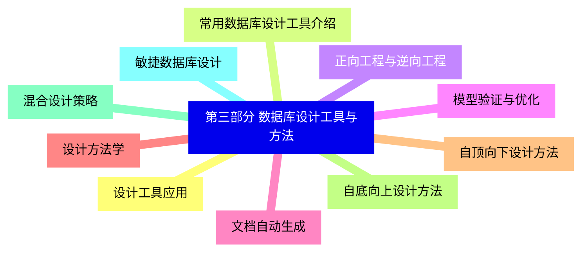
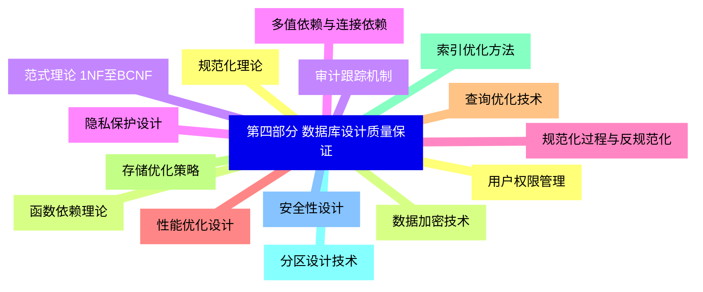
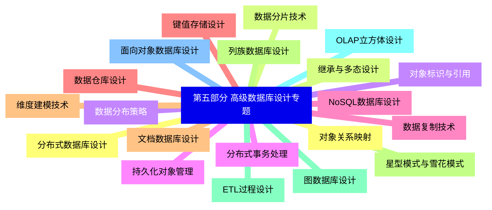


### 1 [第一部分 数据库基础原理](#1)
#### 1.1 [数据库系统概述](#1)
#### 1.2 [数据库系统基本概念](#1)
#### 1.3 [数据模型与数据抽象](#1)
#### 1.4 [数据库管理系统 DBMS 功能](#1)
#### 1.5 [数据库系统体系结构](#1)
#### 1.6 [数据模型](#1)
#### 1.7 [层次模型与网状模型](#1)
#### 1.8 [关系模型基本概念](#1)
#### 1.9 [面向对象数据模型](#1)
#### 1.10 [半结构化数据模型](#1)
#### 1.11 [关系数据库理论](#1)
#### 1.12 [关系数据结构](#1)
#### 1.13 [关系完整性约束](#1)
#### 1.14 [关系代数运算](#1)
#### 1.15 [关系演算理论](#1)
### 2 [第二部分 数据库设计过程](#2)
#### 2.1 [需求分析阶段](#2)
#### 2.2 [用户需求收集方法](#2)
#### 2.3 [数据流图 DFD 绘制](#2)
#### 2.4 [数据字典建立](#2)
#### 2.5 [需求规格说明书编写](#2)
#### 2.6 [概念结构设计](#2)
#### 2.7 [实体-联系模型 E-R模型](#2)
#### 2.8 [实体与属性定义](#2)
#### 2.9 [联系类型与基数约束](#2)
#### 2.10 [E-R图绘制规范](#2)
#### 2.11 [逻辑结构设计](#2)
#### 2.12 [E-R模型向关系模型转换](#2)
#### 2.13 [关系模式规范化](#2)
#### 2.14 [关系模式优化](#2)
#### 2.15 [视图设计](#2)
#### 2.16 [物理结构设计](#2)
#### 2.17 [存储结构选择](#2)
#### 2.18 [存取方法设计](#2)
#### 2.19 [索引设计原则](#2)
#### 2.20 [聚簇设计技术](#2)
#### 2.21 [数据库实施](#2)
#### 2.22 [DDL数据定义语言应用](#2)
#### 2.23 [数据装载与转换](#2)
#### 2.24 [数据库试运行](#2)
#### 2.25 [性能测试与调优](#2)
#### 2.26 [数据库运行与维护](#2)
#### 2.27 [数据库安全性控制](#2)
#### 2.28 [完整性控制机制](#2)
#### 2.29 [并发控制技术](#2)
#### 2.30 [数据库备份与恢复](#2)
### 3 [第三部分 数据库设计工具与方法](#3)
#### 3.1 [设计工具应用](#3)
#### 3.2 [常用数据库设计工具介绍](#3)
#### 3.3 [正向工程与逆向工程](#3)
#### 3.4 [模型验证与优化](#3)
#### 3.5 [文档自动生成](#3)
#### 3.6 [设计方法学](#3)
#### 3.7 [自顶向下设计方法](#3)
#### 3.8 [自底向上设计方法](#3)
#### 3.9 [混合设计策略](#3)
#### 3.10 [敏捷数据库设计](#3)
### 4 [第四部分 数据库设计质量保证](#4)
#### 4.1 [规范化理论](#4)
#### 4.2 [函数依赖理论](#4)
#### 4.3 [范式理论 1NF至BCNF](#4)
#### 4.4 [多值依赖与连接依赖](#4)
#### 4.5 [规范化过程与反规范化](#4)
#### 4.6 [性能优化设计](#4)
#### 4.7 [查询优化技术](#4)
#### 4.8 [存储优化策略](#4)
#### 4.9 [索引优化方法](#4)
#### 4.10 [分区设计技术](#4)
#### 4.11 [安全性设计](#4)
#### 4.12 [用户权限管理](#4)
#### 4.13 [数据加密技术](#4)
#### 4.14 [审计跟踪机制](#4)
#### 4.15 [隐私保护设计](#4)
### 5 [第五部分 高级数据库设计专题](#5)
#### 5.1 [分布式数据库设计](#5)
#### 5.2 [数据分片技术](#5)
#### 5.3 [数据分布策略](#5)
#### 5.4 [分布式事务处理](#5)
#### 5.5 [数据复制技术](#5)
#### 5.6 [数据仓库设计](#5)
#### 5.7 [维度建模技术](#5)
#### 5.8 [星型模式与雪花模式](#5)
#### 5.9 [ETL过程设计](#5)
#### 5.10 [OLAP立方体设计](#5)
#### 5.11 [面向对象数据库设计](#5)
#### 5.12 [对象关系映射](#5)
#### 5.13 [继承与多态设计](#5)
#### 5.14 [对象标识与引用](#5)
#### 5.15 [持久化对象管理](#5)
#### 5.16 [NoSQL数据库设计](#5)
#### 5.17 [键值存储设计](#5)
#### 5.18 [文档数据库设计](#5)
#### 5.19 [列族数据库设计](#5)
#### 5.20 [图数据库设计](#5)




### 1 第一部分 数据库基础原理

---
### 1 第一部分 数据库基础原理
___
#### 1.1 数据库系统概述
___
#### 1.2 数据库系统基本概念
___
#### 1.3 数据模型与数据抽象
___
#### 1.4 数据库管理系统 DBMS 功能
___
#### 1.5 数据库系统体系结构
___
#### 1.6 数据模型
___
#### 1.7 层次模型与网状模型
___
#### 1.8 关系模型基本概念
___
#### 1.9 面向对象数据模型
___
#### 1.10 半结构化数据模型
___
#### 1.11 关系数据库理论
___
#### 1.12 关系数据结构
___
#### 1.13 关系完整性约束
___
#### 1.14 关系代数运算
___
#### 1.15 关系演算理论
### 2 第二部分 数据库设计过程

---
### 2 第二部分 数据库设计过程
___
#### 2.1 需求分析阶段
___
#### 2.2 用户需求收集方法
___
#### 2.3 数据流图 DFD 绘制
___
#### 2.4 数据字典建立
___
#### 2.5 需求规格说明书编写
___
#### 2.6 概念结构设计
___
#### 2.7 实体-联系模型 E-R模型
___
#### 2.8 实体与属性定义
___
#### 2.9 联系类型与基数约束
___
#### 2.10 E-R图绘制规范
___
#### 2.11 逻辑结构设计
___
#### 2.12 E-R模型向关系模型转换
___
#### 2.13 关系模式规范化
___
#### 2.14 关系模式优化
___
#### 2.15 视图设计
___
#### 2.16 物理结构设计
___
#### 2.17 存储结构选择
___
#### 2.18 存取方法设计
___
#### 2.19 索引设计原则
___
#### 2.20 聚簇设计技术
___
#### 2.21 数据库实施
___
#### 2.22 DDL数据定义语言应用
___
#### 2.23 数据装载与转换
___
#### 2.24 数据库试运行
___
#### 2.25 性能测试与调优
___
#### 2.26 数据库运行与维护
___
#### 2.27 数据库安全性控制
___
#### 2.28 完整性控制机制
___
#### 2.29 并发控制技术
___
#### 2.30 数据库备份与恢复
### 3 第三部分 数据库设计工具与方法

---
### 3 第三部分 数据库设计工具与方法
___
#### 3.1 设计工具应用
___
#### 3.2 常用数据库设计工具介绍
___
#### 3.3 正向工程与逆向工程
___
#### 3.4 模型验证与优化
___
#### 3.5 文档自动生成
___
#### 3.6 设计方法学
___
#### 3.7 自顶向下设计方法
___
#### 3.8 自底向上设计方法
___
#### 3.9 混合设计策略
___
#### 3.10 敏捷数据库设计
### 4 第四部分 数据库设计质量保证

---
### 4 第四部分 数据库设计质量保证
___
#### 4.1 规范化理论
___
#### 4.2 函数依赖理论
___
#### 4.3 范式理论 1NF至BCNF
___
#### 4.4 多值依赖与连接依赖
___
#### 4.5 规范化过程与反规范化
___
#### 4.6 性能优化设计
___
#### 4.7 查询优化技术
___
#### 4.8 存储优化策略
___
#### 4.9 索引优化方法
___
#### 4.10 分区设计技术
___
#### 4.11 安全性设计
___
#### 4.12 用户权限管理
___
#### 4.13 数据加密技术
___
#### 4.14 审计跟踪机制
___
#### 4.15 隐私保护设计
### 5 第五部分 高级数据库设计专题

---
### 5 第五部分 高级数据库设计专题
___
#### 5.1 分布式数据库设计
___
#### 5.2 数据分片技术
___
#### 5.3 数据分布策略
___
#### 5.4 分布式事务处理
___
#### 5.5 数据复制技术
___
#### 5.6 数据仓库设计
___
#### 5.7 维度建模技术
___
#### 5.8 星型模式与雪花模式
___
#### 5.9 ETL过程设计
___
#### 5.10 OLAP立方体设计
___
#### 5.11 面向对象数据库设计
___
#### 5.12 对象关系映射
___
#### 5.13 继承与多态设计
___
#### 5.14 对象标识与引用
___
#### 5.15 持久化对象管理
___
#### 5.16 NoSQL数据库设计
___
#### 5.17 键值存储设计
___
#### 5.18 文档数据库设计
___
#### 5.19 列族数据库设计
___
#### 5.20 图数据库设计


### 1 第一部分 数据库基础原理{#1}

{}

<--->
{}
{}
{}
{}
{}
{}
{}
{}
{}
{}
{}
{}
{}
{}
{}
{}
{}
{}
{}
{}
{}
{}
{}
{}
{}
{}
{}
{}
{}
{}
{}

### 2 第二部分 数据库设计过程{#2}

{}
{}
{}
{}
{}
{}
{}
{}
{}
{}
{}
{}
{}
{}
{}
{}
{}
{}
{}
{}
{}
{}
{}
{}
{}
{}
{}
{}
{}
{}
{}
{}
{}
{}
{}
{}
{}
{}
{}
{}
{}
{}
{}
{}
{}
{}
{}
{}
{}
{}
{}
{}
{}
{}
{}
{}
{}
{}
{}
{}
{}
<--->

{}

### 3 第三部分 数据库设计工具与方法{#3}

{}

<--->
{}
{}
{}
{}
{}
{}
{}
{}
{}
{}
{}
{}
{}
{}
{}
{}
{}
{}
{}
{}
{}

### 4 第四部分 数据库设计质量保证{#4}

{}
{}
{}
{}
{}
{}
{}
{}
{}
{}
{}
{}
{}
{}
{}
{}
{}
{}
{}
{}
{}
{}
{}
{}
{}
{}
{}
{}
{}
{}
{}
<--->

{}

### 5 第五部分 高级数据库设计专题{#5}

{}

<--->
{}
{}
{}
{}
{}
{}
{}
{}
{}
{}
{}
{}
{}
{}
{}
{}
{}
{}
{}
{}
{}
{}
{}
{}
{}
{}
{}
{}
{}
{}
{}
{}
{}
{}
{}
{}
{}
{}
{}
{}
{}
