
### 1 [实体-联系模型概述](#1)
#### 1.1 [基本概念](#1)
#### 1.2 [实体-联系模型的定义与起源](#1)
#### 1.3 [数据建模的重要性](#1)
#### 1.4 [E-R模型在数据库设计中的作用](#1)
#### 1.5 [模型的基本组成元素](#1)
#### 1.6 [发展历史](#1)
#### 1.7 [E-R模型的提出背景](#1)
#### 1.8 [模型的发展与演变](#1)
#### 1.9 [现代E-R模型的扩展](#1)
#### 1.10 [与其他数据模型的比较](#1)
### 2 [实体](#2)
#### 2.1 [实体的定义与特性](#2)
#### 2.2 [实体的基本概念](#2)
#### 2.3 [实体的属性与特征](#2)
#### 2.4 [实体的唯一标识符](#2)
#### 2.5 [实体的实例与类型](#2)
#### 2.6 [实体类型](#2)
#### 2.7 [强实体与弱实体](#2)
#### 2.8 [关联实体](#2)
#### 2.9 [子类型与超类型实体](#2)
#### 2.10 [复合实体](#2)
#### 2.11 [实体集](#2)
#### 2.12 [实体集的定义](#2)
#### 2.13 [实体集的表示方法](#2)
#### 2.14 [实体集的操作](#2)
#### 2.15 [实体集的约束](#2)
### 3 [属性](#3)
#### 3.1 [属性的基本概念](#3)
#### 3.2 [属性的定义与作用](#3)
#### 3.3 [属性与实体的关系](#3)
#### 3.4 [属性的数据类型](#3)
#### 3.5 [属性的值域](#3)
#### 3.6 [属性分类](#3)
#### 3.7 [简单属性与复合属性](#3)
#### 3.8 [单值属性与多值属性](#3)
#### 3.9 [派生属性](#3)
#### 3.10 [空值属性](#3)
#### 3.11 [键属性](#3)
#### 3.12 [候选键](#3)
#### 3.13 [主键](#3)
#### 3.14 [外键](#3)
#### 3.15 [超键](#3)
### 4 [联系](#4)
#### 4.1 [联系的基本概念](#4)
#### 4.2 [联系的定义](#4)
#### 4.3 [联系的度](#4)
#### 4.4 [联系的实例](#4)
#### 4.5 [联系集](#4)
#### 4.6 [联系的基数约束](#4)
#### 4.7 [对一联系](#4)
#### 4.8 [对多联系](#4)
#### 4.9 [多对多联系](#4)
#### 4.10 [基数约束的表示方法](#4)
#### 4.11 [参与约束](#4)
#### 4.12 [全参与](#4)
#### 4.13 [部分参与](#4)
#### 4.14 [参与度的计算](#4)
#### 4.15 [参与约束的应用](#4)
### 5 [E-R图表示法](#5)
#### 5.1 [基本符号](#5)
#### 5.2 [实体表示法](#5)
#### 5.3 [属性表示法](#5)
#### 5.4 [联系表示法](#5)
#### 5.5 [键的表示](#5)
#### 5.6 [扩展E-R图](#5)
#### 5.7 [弱实体的表示](#5)
#### 5.8 [子类型的表示](#5)
#### 5.9 [多值属性的表示](#5)
#### 5.10 [派生属性的表示](#5)
#### 5.11 [绘图规范](#5)
#### 5.12 [E-R图的布局原则](#5)
#### 5.13 [命名的规范](#5)
#### 5.14 [符号的使用规则](#5)
#### 5.15 [图的文档化](#5)
### 6 [高级E-R概念](#6)
#### 6.1 [特殊化与泛化](#6)
#### 6.2 [特殊化的概念](#6)
#### 6.3 [泛化的概念](#6)
#### 6.4 [继承机制](#6)
#### 6.5 [约束条件](#6)
#### 6.6 [聚合](#6)
#### 6.7 [聚合的概念](#6)
#### 6.8 [聚合的表示](#6)
#### 6.9 [聚合的应用场景](#6)
#### 6.10 [聚合与组合的区别](#6)
#### 6.11 [范畴](#6)
#### 6.12 [范畴的定义](#6)
#### 6.13 [范畴的表示方法](#6)
#### 6.14 [范畴与继承的关系](#6)
#### 6.15 [范畴的应用实例](#6)
### 7 [E-R模型到关系模式的转换](#7)
#### 7.1 [基本转换规则](#7)
#### 7.2 [强实体的转换](#7)
#### 7.3 [弱实体的转换](#7)
#### 7.4 [属性的转换](#7)
#### 7.5 [联系的转换](#7)
#### 7.6 [复杂结构的转换](#7)
#### 7.7 [多值属性的处理](#7)
#### 7.8 [复合属性的分解](#7)
#### 7.9 [继承层次的处理](#7)
#### 7.10 [聚合的转换](#7)
#### 7.11 [完整性约束的保持](#7)
#### 7.12 [主键约束的转换](#7)
#### 7.13 [外键约束的转换](#7)
#### 7.14 [参与约束的实现](#7)
#### 7.15 [基数约束的维护](#7)
### 8 [E-R模型设计方法](#8)
#### 8.1 [需求分析](#8)
#### 8.2 [数据需求收集](#8)
#### 8.3 [用户视图分析](#8)
#### 8.4 [业务规则识别](#8)
#### 8.5 [约束条件确定](#8)
#### 8.6 [概念设计](#8)
#### 8.7 [实体识别](#8)
#### 8.8 [属性分配](#8)
#### 8.9 [联系建立](#8)
#### 8.10 [模型优化](#8)
#### 8.11 [设计质量评估](#8)
#### 8.12 [模型的一致性检查](#8)
#### 8.13 [冗余性分析](#8)
#### 8.14 [可扩展性评估](#8)
#### 8.15 [性能考虑](#8)
### 9 [E-R模型的应用](#9)
#### 9.1 [实际案例分析](#9)
#### 9.2 [企业信息系统的E-R建模](#9)
#### 9.3 [电子商务系统的E-R设计](#9)
#### 9.4 [学校管理系统的E-R模型](#9)
#### 9.5 [医院信息系统的E-R建模](#9)
#### 9.6 [工具支持](#9)
#### 9.7 [常用E-R建模工具介绍](#9)
#### 9.8 [自动化设计工具](#9)
#### 9.9 [模型验证工具](#9)
#### 9.10 [文档生成工具](#9)
#### 9.11 [最佳实践](#9)
#### 9.12 [命名规范](#9)
#### 9.13 [设计模式](#9)
#### 9.14 [错误避免](#9)
#### 9.15 [维护策略](#9)
### 10 [E-R模型的扩展与变体](#10)
#### 10.1 [扩展E-R模型](#10)
#### 10.2 [EER模型的概念](#10)
#### 10.3 [扩展特性](#10)
#### 10.4 [应用场景](#10)
#### 10.5 [与其他模型的集成](#10)
#### 10.6 [面向对象E-R模型](#10)
#### 10.7 [面向对象概念引入](#10)
#### 10.8 [对象标识](#10)
#### 10.9 [方法封装](#10)
#### 10.10 [继承机制](#10)
#### 10.11 [其他变体模型](#10)
#### 10.12 [时间E-R模型](#10)
#### 10.13 [空间E-R模型](#10)
#### 10.14 [模糊E-R模型](#10)
#### 10.15 [分布式E-R模型](#10)
### 11 [附录](#11)
#### 11.1 [术语表](#11)
#### 11.2 [常用符号对照表](#11)
#### 11.3 [参考文献](#11)
#### 11.4 [索引](#11)




### 1 实体-联系模型概述

---
### 1 实体-联系模型概述
___
#### 1.1 基本概念
___
#### 1.2 实体-联系模型的定义与起源
___
#### 1.3 数据建模的重要性
___
#### 1.4 E-R模型在数据库设计中的作用
___
#### 1.5 模型的基本组成元素
___
#### 1.6 发展历史
___
#### 1.7 E-R模型的提出背景
___
#### 1.8 模型的发展与演变
___
#### 1.9 现代E-R模型的扩展
___
#### 1.10 与其他数据模型的比较
### 2 实体

---
### 2 实体
___
#### 2.1 实体的定义与特性
___
#### 2.2 实体的基本概念
___
#### 2.3 实体的属性与特征
___
#### 2.4 实体的唯一标识符
___
#### 2.5 实体的实例与类型
___
#### 2.6 实体类型
___
#### 2.7 强实体与弱实体
___
#### 2.8 关联实体
___
#### 2.9 子类型与超类型实体
___
#### 2.10 复合实体
___
#### 2.11 实体集
___
#### 2.12 实体集的定义
___
#### 2.13 实体集的表示方法
___
#### 2.14 实体集的操作
___
#### 2.15 实体集的约束
### 3 属性

---
### 3 属性
___
#### 3.1 属性的基本概念
___
#### 3.2 属性的定义与作用
___
#### 3.3 属性与实体的关系
___
#### 3.4 属性的数据类型
___
#### 3.5 属性的值域
___
#### 3.6 属性分类
___
#### 3.7 简单属性与复合属性
___
#### 3.8 单值属性与多值属性
___
#### 3.9 派生属性
___
#### 3.10 空值属性
___
#### 3.11 键属性
___
#### 3.12 候选键
___
#### 3.13 主键
___
#### 3.14 外键
___
#### 3.15 超键
### 4 联系

---
### 4 联系
___
#### 4.1 联系的基本概念
___
#### 4.2 联系的定义
___
#### 4.3 联系的度
___
#### 4.4 联系的实例
___
#### 4.5 联系集
___
#### 4.6 联系的基数约束
___
#### 4.7 对一联系
___
#### 4.8 对多联系
___
#### 4.9 多对多联系
___
#### 4.10 基数约束的表示方法
___
#### 4.11 参与约束
___
#### 4.12 全参与
___
#### 4.13 部分参与
___
#### 4.14 参与度的计算
___
#### 4.15 参与约束的应用
### 5 E-R图表示法

---
### 5 E-R图表示法
___
#### 5.1 基本符号
___
#### 5.2 实体表示法
___
#### 5.3 属性表示法
___
#### 5.4 联系表示法
___
#### 5.5 键的表示
___
#### 5.6 扩展E-R图
___
#### 5.7 弱实体的表示
___
#### 5.8 子类型的表示
___
#### 5.9 多值属性的表示
___
#### 5.10 派生属性的表示
___
#### 5.11 绘图规范
___
#### 5.12 E-R图的布局原则
___
#### 5.13 命名的规范
___
#### 5.14 符号的使用规则
___
#### 5.15 图的文档化
### 6 高级E-R概念

---
### 6 高级E-R概念
___
#### 6.1 特殊化与泛化
___
#### 6.2 特殊化的概念
___
#### 6.3 泛化的概念
___
#### 6.4 继承机制
___
#### 6.5 约束条件
___
#### 6.6 聚合
___
#### 6.7 聚合的概念
___
#### 6.8 聚合的表示
___
#### 6.9 聚合的应用场景
___
#### 6.10 聚合与组合的区别
___
#### 6.11 范畴
___
#### 6.12 范畴的定义
___
#### 6.13 范畴的表示方法
___
#### 6.14 范畴与继承的关系
___
#### 6.15 范畴的应用实例
### 7 E-R模型到关系模式的转换

---
### 7 E-R模型到关系模式的转换
___
#### 7.1 基本转换规则
___
#### 7.2 强实体的转换
___
#### 7.3 弱实体的转换
___
#### 7.4 属性的转换
___
#### 7.5 联系的转换
___
#### 7.6 复杂结构的转换
___
#### 7.7 多值属性的处理
___
#### 7.8 复合属性的分解
___
#### 7.9 继承层次的处理
___
#### 7.10 聚合的转换
___
#### 7.11 完整性约束的保持
___
#### 7.12 主键约束的转换
___
#### 7.13 外键约束的转换
___
#### 7.14 参与约束的实现
___
#### 7.15 基数约束的维护
### 8 E-R模型设计方法

---
### 8 E-R模型设计方法
___
#### 8.1 需求分析
___
#### 8.2 数据需求收集
___
#### 8.3 用户视图分析
___
#### 8.4 业务规则识别
___
#### 8.5 约束条件确定
___
#### 8.6 概念设计
___
#### 8.7 实体识别
___
#### 8.8 属性分配
___
#### 8.9 联系建立
___
#### 8.10 模型优化
___
#### 8.11 设计质量评估
___
#### 8.12 模型的一致性检查
___
#### 8.13 冗余性分析
___
#### 8.14 可扩展性评估
___
#### 8.15 性能考虑
### 9 E-R模型的应用

---
### 9 E-R模型的应用
___
#### 9.1 实际案例分析
___
#### 9.2 企业信息系统的E-R建模
___
#### 9.3 电子商务系统的E-R设计
___
#### 9.4 学校管理系统的E-R模型
___
#### 9.5 医院信息系统的E-R建模
___
#### 9.6 工具支持
___
#### 9.7 常用E-R建模工具介绍
___
#### 9.8 自动化设计工具
___
#### 9.9 模型验证工具
___
#### 9.10 文档生成工具
___
#### 9.11 最佳实践
___
#### 9.12 命名规范
___
#### 9.13 设计模式
___
#### 9.14 错误避免
___
#### 9.15 维护策略
### 10 E-R模型的扩展与变体

---
### 10 E-R模型的扩展与变体
___
#### 10.1 扩展E-R模型
___
#### 10.2 EER模型的概念
___
#### 10.3 扩展特性
___
#### 10.4 应用场景
___
#### 10.5 与其他模型的集成
___
#### 10.6 面向对象E-R模型
___
#### 10.7 面向对象概念引入
___
#### 10.8 对象标识
___
#### 10.9 方法封装
___
#### 10.10 继承机制
___
#### 10.11 其他变体模型
___
#### 10.12 时间E-R模型
___
#### 10.13 空间E-R模型
___
#### 10.14 模糊E-R模型
___
#### 10.15 分布式E-R模型
### 11 附录

---
### 11 附录
___
#### 11.1 术语表
___
#### 11.2 常用符号对照表
___
#### 11.3 参考文献
___
#### 11.4 索引


### 1 实体-联系模型概述{#1}

{}
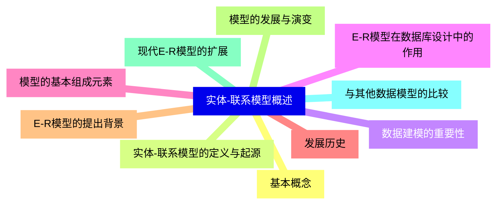

<--->
{}
{}
{}
{}
{}
{}
{}
{}
{}
{}
{}
{}
{}
{}
{}
{}
{}
{}
{}
{}
{}

### 2 实体{#2}

{}
{}
{}
{}
{}
{}
{}
{}
{}
{}
{}
{}
{}
{}
{}
{}
{}
{}
{}
{}
{}
{}
{}
{}
{}
{}
{}
{}
{}
{}
{}
<--->
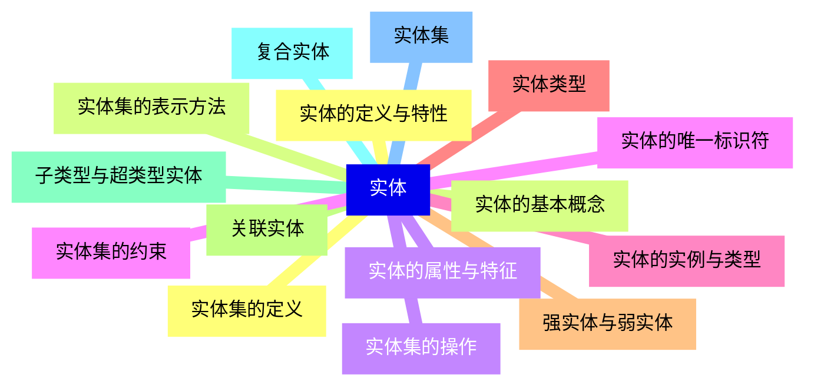

{}

### 3 属性{#3}

{}
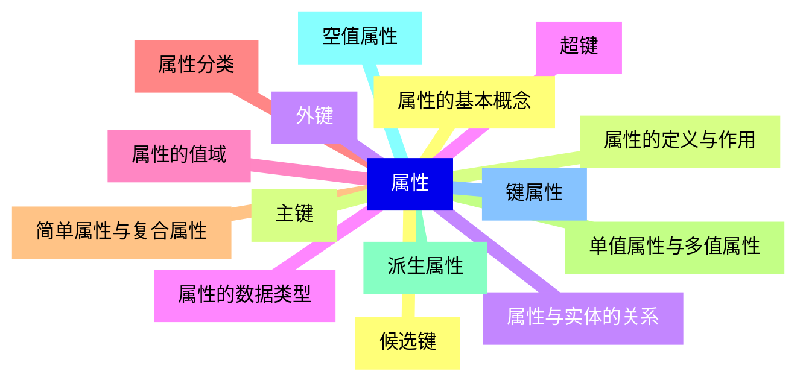

<--->
{}
{}
{}
{}
{}
{}
{}
{}
{}
{}
{}
{}
{}
{}
{}
{}
{}
{}
{}
{}
{}
{}
{}
{}
{}
{}
{}
{}
{}
{}
{}

### 4 联系{#4}

{}
{}
{}
{}
{}
{}
{}
{}
{}
{}
{}
{}
{}
{}
{}
{}
{}
{}
{}
{}
{}
{}
{}
{}
{}
{}
{}
{}
{}
{}
{}
<--->
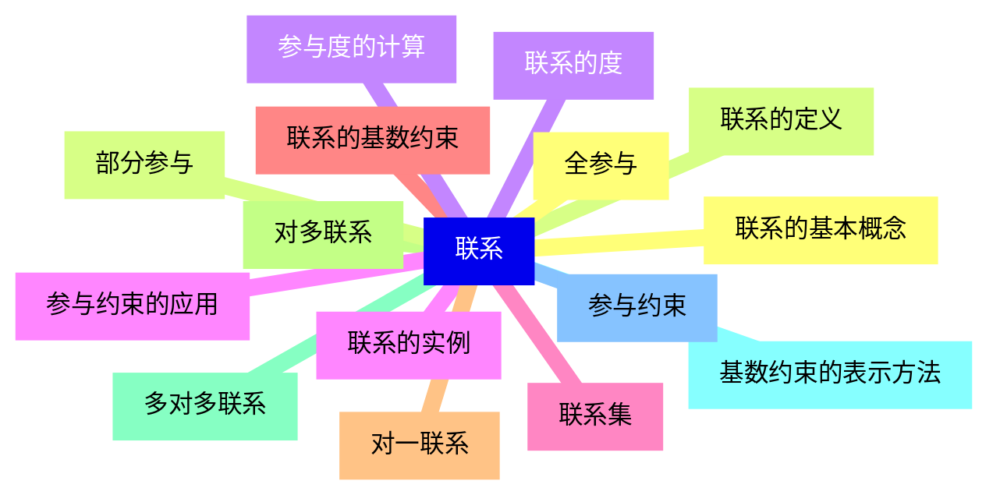

{}

### 5 E-R图表示法{#5}

{}
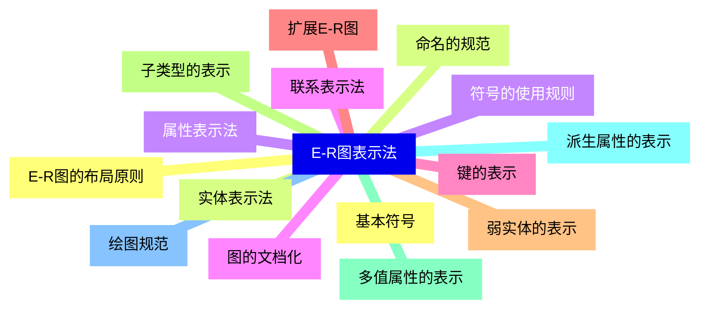

<--->
{}
{}
{}
{}
{}
{}
{}
{}
{}
{}
{}
{}
{}
{}
{}
{}
{}
{}
{}
{}
{}
{}
{}
{}
{}
{}
{}
{}
{}
{}
{}

### 6 高级E-R概念{#6}

{}
{}
{}
{}
{}
{}
{}
{}
{}
{}
{}
{}
{}
{}
{}
{}
{}
{}
{}
{}
{}
{}
{}
{}
{}
{}
{}
{}
{}
{}
{}
<--->
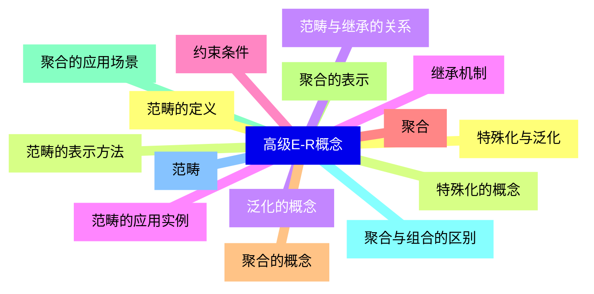

{}

### 7 E-R模型到关系模式的转换{#7}

{}
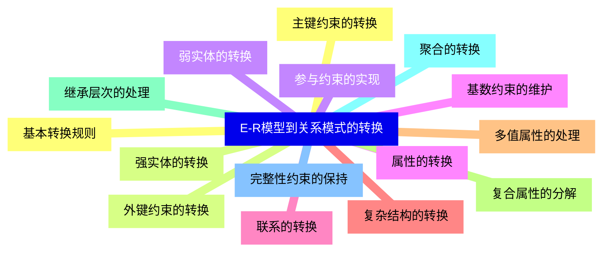

<--->
{}
{}
{}
{}
{}
{}
{}
{}
{}
{}
{}
{}
{}
{}
{}
{}
{}
{}
{}
{}
{}
{}
{}
{}
{}
{}
{}
{}
{}
{}
{}

### 8 E-R模型设计方法{#8}

{}
{}
{}
{}
{}
{}
{}
{}
{}
{}
{}
{}
{}
{}
{}
{}
{}
{}
{}
{}
{}
{}
{}
{}
{}
{}
{}
{}
{}
{}
{}
<--->
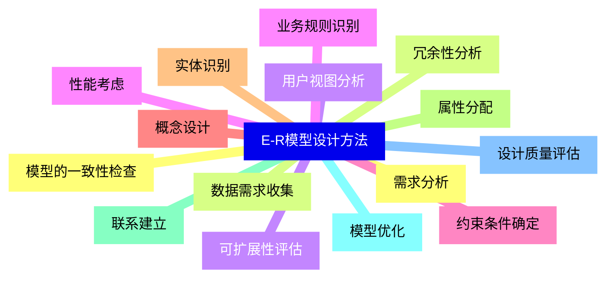

{}

### 9 E-R模型的应用{#9}

{}
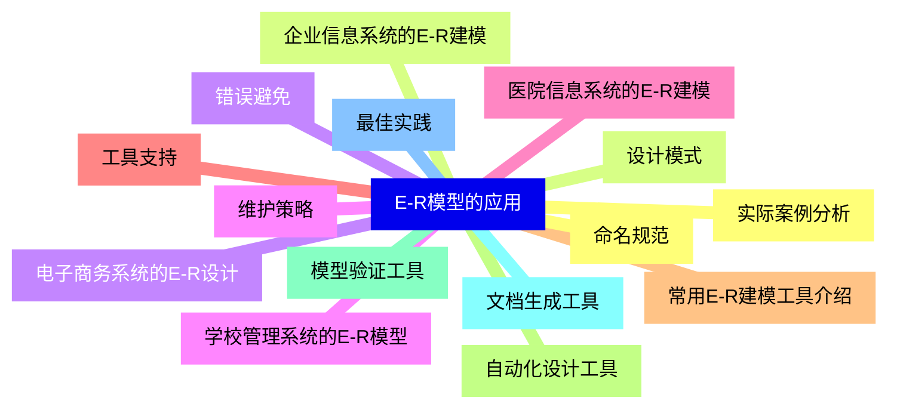

<--->
{}
{}
{}
{}
{}
{}
{}
{}
{}
{}
{}
{}
{}
{}
{}
{}
{}
{}
{}
{}
{}
{}
{}
{}
{}
{}
{}
{}
{}
{}
{}

### 10 E-R模型的扩展与变体{#10}

{}
{}
{}
{}
{}
{}
{}
{}
{}
{}
{}
{}
{}
{}
{}
{}
{}
{}
{}
{}
{}
{}
{}
{}
{}
{}
{}
{}
{}
{}
{}
<--->
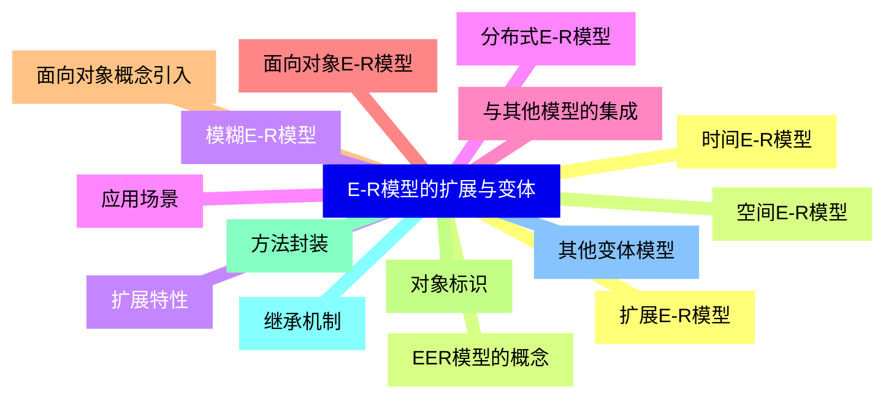

{}

### 11 附录{#11}

{}
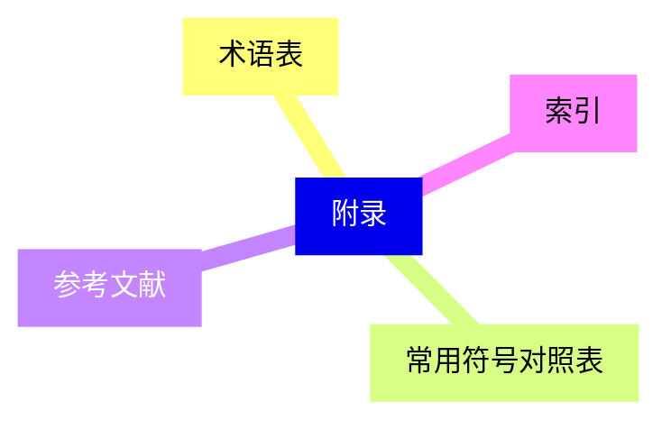

<--->
{}
{}
{}
{}
{}
{}
{}
{}
{}
