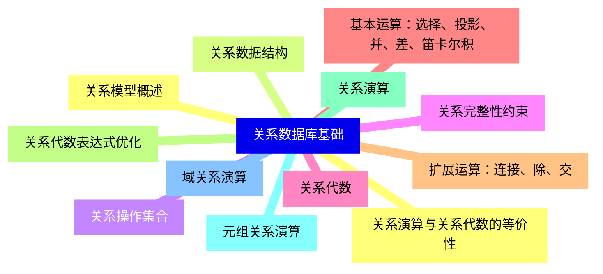
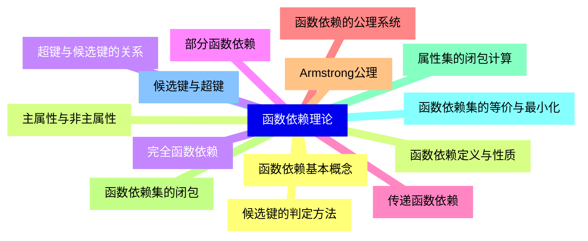
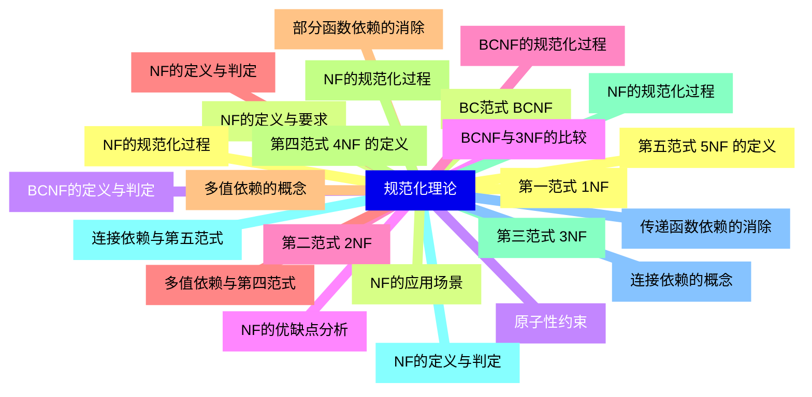
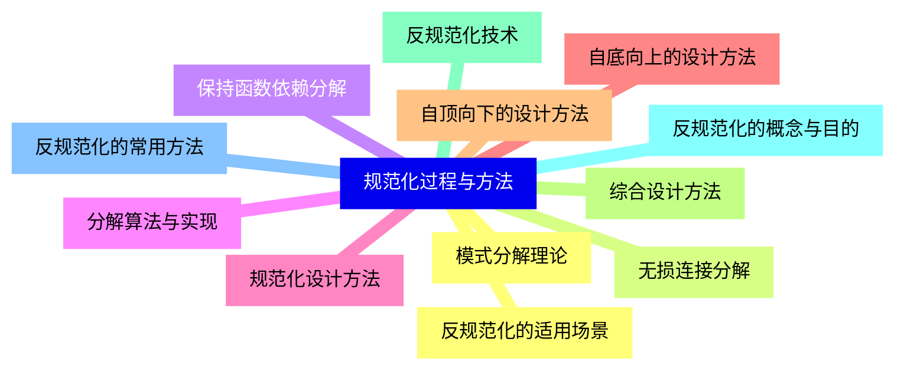
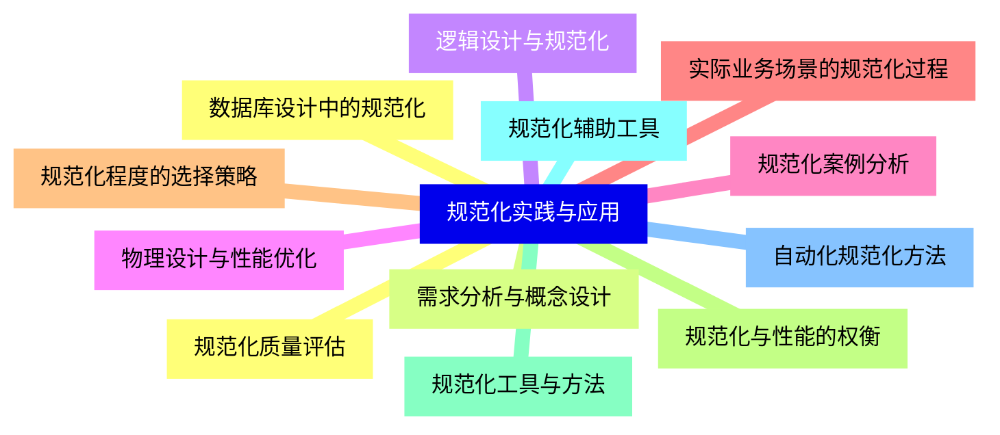
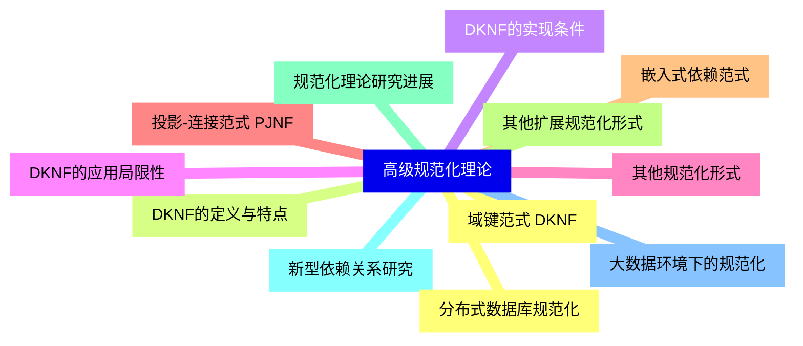
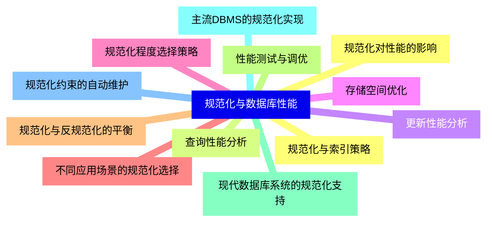
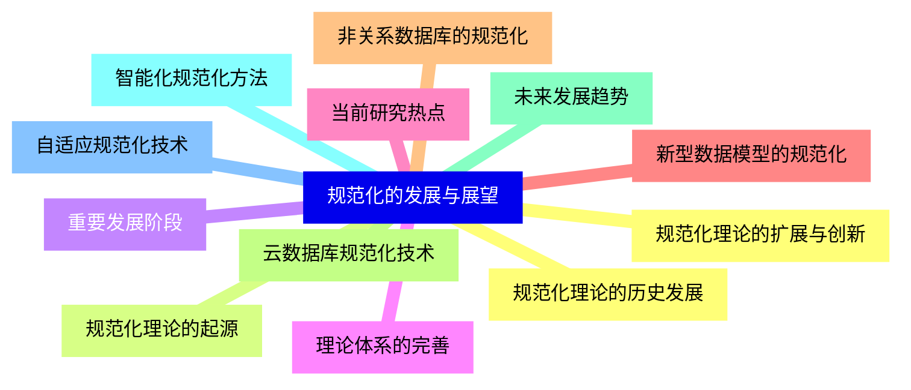


### 1 [关系数据库基础](#1)
#### 1.1 [关系模型概述](#1)
#### 1.2 [关系数据结构](#1)
#### 1.3 [关系操作集合](#1)
#### 1.4 [关系完整性约束](#1)
#### 1.5 [关系代数](#1)
#### 1.6 [基本运算：选择、投影、并、差、笛卡尔积](#1)
#### 1.7 [扩展运算：连接、除、交](#1)
#### 1.8 [关系代数表达式优化](#1)
#### 1.9 [关系演算](#1)
#### 1.10 [元组关系演算](#1)
#### 1.11 [域关系演算](#1)
#### 1.12 [关系演算与关系代数的等价性](#1)
### 2 [函数依赖理论](#2)
#### 2.1 [函数依赖基本概念](#2)
#### 2.2 [函数依赖定义与性质](#2)
#### 2.3 [完全函数依赖](#2)
#### 2.4 [部分函数依赖](#2)
#### 2.5 [传递函数依赖](#2)
#### 2.6 [函数依赖的公理系统](#2)
#### 2.7 [Armstrong公理](#2)
#### 2.8 [函数依赖集的闭包](#2)
#### 2.9 [属性集的闭包计算](#2)
#### 2.10 [函数依赖集的等价与最小化](#2)
#### 2.11 [候选键与超键](#2)
#### 2.12 [候选键的判定方法](#2)
#### 2.13 [主属性与非主属性](#2)
#### 2.14 [超键与候选键的关系](#2)
### 3 [规范化理论](#3)
#### 3.1 [第一范式 1NF](#3)
#### 3.2 [NF的定义与要求](#3)
#### 3.3 [原子性约束](#3)
#### 3.4 [NF的优缺点分析](#3)
#### 3.5 [第二范式 2NF](#3)
#### 3.6 [NF的定义与判定](#3)
#### 3.7 [部分函数依赖的消除](#3)
#### 3.8 [NF的规范化过程](#3)
#### 3.9 [第三范式 3NF](#3)
#### 3.10 [NF的定义与判定](#3)
#### 3.11 [传递函数依赖的消除](#3)
#### 3.12 [NF的规范化过程](#3)
#### 3.13 [BC范式 BCNF](#3)
#### 3.14 [BCNF的定义与判定](#3)
#### 3.15 [BCNF与3NF的比较](#3)
#### 3.16 [BCNF的规范化过程](#3)
#### 3.17 [多值依赖与第四范式](#3)
#### 3.18 [多值依赖的概念](#3)
#### 3.19 [第四范式 4NF 的定义](#3)
#### 3.20 [NF的规范化过程](#3)
#### 3.21 [连接依赖与第五范式](#3)
#### 3.22 [连接依赖的概念](#3)
#### 3.23 [第五范式 5NF 的定义](#3)
#### 3.24 [NF的应用场景](#3)
### 4 [规范化过程与方法](#4)
#### 4.1 [模式分解理论](#4)
#### 4.2 [无损连接分解](#4)
#### 4.3 [保持函数依赖分解](#4)
#### 4.4 [分解算法与实现](#4)
#### 4.5 [规范化设计方法](#4)
#### 4.6 [自底向上的设计方法](#4)
#### 4.7 [自顶向下的设计方法](#4)
#### 4.8 [综合设计方法](#4)
#### 4.9 [反规范化技术](#4)
#### 4.10 [反规范化的概念与目的](#4)
#### 4.11 [反规范化的常用方法](#4)
#### 4.12 [反规范化的适用场景](#4)
### 5 [规范化实践与应用](#5)
#### 5.1 [数据库设计中的规范化](#5)
#### 5.2 [需求分析与概念设计](#5)
#### 5.3 [逻辑设计与规范化](#5)
#### 5.4 [物理设计与性能优化](#5)
#### 5.5 [规范化案例分析](#5)
#### 5.6 [实际业务场景的规范化过程](#5)
#### 5.7 [规范化程度的选择策略](#5)
#### 5.8 [规范化与性能的权衡](#5)
#### 5.9 [规范化工具与方法](#5)
#### 5.10 [规范化辅助工具](#5)
#### 5.11 [自动化规范化方法](#5)
#### 5.12 [规范化质量评估](#5)
### 6 [高级规范化理论](#6)
#### 6.1 [域键范式 DKNF](#6)
#### 6.2 [DKNF的定义与特点](#6)
#### 6.3 [DKNF的实现条件](#6)
#### 6.4 [DKNF的应用局限性](#6)
#### 6.5 [其他规范化形式](#6)
#### 6.6 [投影-连接范式 PJNF](#6)
#### 6.7 [嵌入式依赖范式](#6)
#### 6.8 [其他扩展规范化形式](#6)
#### 6.9 [规范化理论研究进展](#6)
#### 6.10 [新型依赖关系研究](#6)
#### 6.11 [大数据环境下的规范化](#6)
#### 6.12 [分布式数据库规范化](#6)
### 7 [规范化与数据库性能](#7)
#### 7.1 [规范化对性能的影响](#7)
#### 7.2 [查询性能分析](#7)
#### 7.3 [更新性能分析](#7)
#### 7.4 [存储空间优化](#7)
#### 7.5 [规范化程度选择策略](#7)
#### 7.6 [不同应用场景的规范化选择](#7)
#### 7.7 [规范化与反规范化的平衡](#7)
#### 7.8 [性能测试与调优](#7)
#### 7.9 [现代数据库系统的规范化支持](#7)
#### 7.10 [主流DBMS的规范化实现](#7)
#### 7.11 [规范化约束的自动维护](#7)
#### 7.12 [规范化与索引策略](#7)
### 8 [规范化的发展与展望](#8)
#### 8.1 [规范化理论的历史发展](#8)
#### 8.2 [规范化理论的起源](#8)
#### 8.3 [重要发展阶段](#8)
#### 8.4 [理论体系的完善](#8)
#### 8.5 [当前研究热点](#8)
#### 8.6 [新型数据模型的规范化](#8)
#### 8.7 [非关系数据库的规范化](#8)
#### 8.8 [云数据库规范化技术](#8)
#### 8.9 [未来发展趋势](#8)
#### 8.10 [智能化规范化方法](#8)
#### 8.11 [自适应规范化技术](#8)
#### 8.12 [规范化理论的扩展与创新](#8)




### 1 关系数据库基础

---
### 1 关系数据库基础
___
#### 1.1 关系模型概述
___
#### 1.2 关系数据结构
___
#### 1.3 关系操作集合
___
#### 1.4 关系完整性约束
___
#### 1.5 关系代数
___
#### 1.6 基本运算：选择、投影、并、差、笛卡尔积
___
#### 1.7 扩展运算：连接、除、交
___
#### 1.8 关系代数表达式优化
___
#### 1.9 关系演算
___
#### 1.10 元组关系演算
___
#### 1.11 域关系演算
___
#### 1.12 关系演算与关系代数的等价性
### 2 函数依赖理论

---
### 2 函数依赖理论
___
#### 2.1 函数依赖基本概念
___
#### 2.2 函数依赖定义与性质
___
#### 2.3 完全函数依赖
___
#### 2.4 部分函数依赖
___
#### 2.5 传递函数依赖
___
#### 2.6 函数依赖的公理系统
___
#### 2.7 Armstrong公理
___
#### 2.8 函数依赖集的闭包
___
#### 2.9 属性集的闭包计算
___
#### 2.10 函数依赖集的等价与最小化
___
#### 2.11 候选键与超键
___
#### 2.12 候选键的判定方法
___
#### 2.13 主属性与非主属性
___
#### 2.14 超键与候选键的关系
### 3 规范化理论

---
### 3 规范化理论
___
#### 3.1 第一范式 1NF
___
#### 3.2 NF的定义与要求
___
#### 3.3 原子性约束
___
#### 3.4 NF的优缺点分析
___
#### 3.5 第二范式 2NF
___
#### 3.6 NF的定义与判定
___
#### 3.7 部分函数依赖的消除
___
#### 3.8 NF的规范化过程
___
#### 3.9 第三范式 3NF
___
#### 3.10 NF的定义与判定
___
#### 3.11 传递函数依赖的消除
___
#### 3.12 NF的规范化过程
___
#### 3.13 BC范式 BCNF
___
#### 3.14 BCNF的定义与判定
___
#### 3.15 BCNF与3NF的比较
___
#### 3.16 BCNF的规范化过程
___
#### 3.17 多值依赖与第四范式
___
#### 3.18 多值依赖的概念
___
#### 3.19 第四范式 4NF 的定义
___
#### 3.20 NF的规范化过程
___
#### 3.21 连接依赖与第五范式
___
#### 3.22 连接依赖的概念
___
#### 3.23 第五范式 5NF 的定义
___
#### 3.24 NF的应用场景
### 4 规范化过程与方法

---
### 4 规范化过程与方法
___
#### 4.1 模式分解理论
___
#### 4.2 无损连接分解
___
#### 4.3 保持函数依赖分解
___
#### 4.4 分解算法与实现
___
#### 4.5 规范化设计方法
___
#### 4.6 自底向上的设计方法
___
#### 4.7 自顶向下的设计方法
___
#### 4.8 综合设计方法
___
#### 4.9 反规范化技术
___
#### 4.10 反规范化的概念与目的
___
#### 4.11 反规范化的常用方法
___
#### 4.12 反规范化的适用场景
### 5 规范化实践与应用

---
### 5 规范化实践与应用
___
#### 5.1 数据库设计中的规范化
___
#### 5.2 需求分析与概念设计
___
#### 5.3 逻辑设计与规范化
___
#### 5.4 物理设计与性能优化
___
#### 5.5 规范化案例分析
___
#### 5.6 实际业务场景的规范化过程
___
#### 5.7 规范化程度的选择策略
___
#### 5.8 规范化与性能的权衡
___
#### 5.9 规范化工具与方法
___
#### 5.10 规范化辅助工具
___
#### 5.11 自动化规范化方法
___
#### 5.12 规范化质量评估
### 6 高级规范化理论

---
### 6 高级规范化理论
___
#### 6.1 域键范式 DKNF
___
#### 6.2 DKNF的定义与特点
___
#### 6.3 DKNF的实现条件
___
#### 6.4 DKNF的应用局限性
___
#### 6.5 其他规范化形式
___
#### 6.6 投影-连接范式 PJNF
___
#### 6.7 嵌入式依赖范式
___
#### 6.8 其他扩展规范化形式
___
#### 6.9 规范化理论研究进展
___
#### 6.10 新型依赖关系研究
___
#### 6.11 大数据环境下的规范化
___
#### 6.12 分布式数据库规范化
### 7 规范化与数据库性能

---
### 7 规范化与数据库性能
___
#### 7.1 规范化对性能的影响
___
#### 7.2 查询性能分析
___
#### 7.3 更新性能分析
___
#### 7.4 存储空间优化
___
#### 7.5 规范化程度选择策略
___
#### 7.6 不同应用场景的规范化选择
___
#### 7.7 规范化与反规范化的平衡
___
#### 7.8 性能测试与调优
___
#### 7.9 现代数据库系统的规范化支持
___
#### 7.10 主流DBMS的规范化实现
___
#### 7.11 规范化约束的自动维护
___
#### 7.12 规范化与索引策略
### 8 规范化的发展与展望

---
### 8 规范化的发展与展望
___
#### 8.1 规范化理论的历史发展
___
#### 8.2 规范化理论的起源
___
#### 8.3 重要发展阶段
___
#### 8.4 理论体系的完善
___
#### 8.5 当前研究热点
___
#### 8.6 新型数据模型的规范化
___
#### 8.7 非关系数据库的规范化
___
#### 8.8 云数据库规范化技术
___
#### 8.9 未来发展趋势
___
#### 8.10 智能化规范化方法
___
#### 8.11 自适应规范化技术
___
#### 8.12 规范化理论的扩展与创新


### 1 关系数据库基础{#1}

{}

<--->
{}
{}
{}
{}
{}
{}
{}
{}
{}
{}
{}
{}
{}
{}
{}
{}
{}
{}
{}
{}
{}
{}
{}
{}
{}

### 2 函数依赖理论{#2}

{}
{}
{}
{}
{}
{}
{}
{}
{}
{}
{}
{}
{}
{}
{}
{}
{}
{}
{}
{}
{}
{}
{}
{}
{}
{}
{}
{}
{}
<--->

{}

### 3 规范化理论{#3}

{}

<--->
{}
{}
{}
{}
{}
{}
{}
{}
{}
{}
{}
{}
{}
{}
{}
{}
{}
{}
{}
{}
{}
{}
{}
{}
{}
{}
{}
{}
{}
{}
{}
{}
{}
{}
{}
{}
{}
{}
{}
{}
{}
{}
{}
{}
{}
{}
{}
{}
{}

### 4 规范化过程与方法{#4}

{}
{}
{}
{}
{}
{}
{}
{}
{}
{}
{}
{}
{}
{}
{}
{}
{}
{}
{}
{}
{}
{}
{}
{}
{}
<--->

{}

### 5 规范化实践与应用{#5}

{}

<--->
{}
{}
{}
{}
{}
{}
{}
{}
{}
{}
{}
{}
{}
{}
{}
{}
{}
{}
{}
{}
{}
{}
{}
{}
{}

### 6 高级规范化理论{#6}

{}
{}
{}
{}
{}
{}
{}
{}
{}
{}
{}
{}
{}
{}
{}
{}
{}
{}
{}
{}
{}
{}
{}
{}
{}
<--->

{}

### 7 规范化与数据库性能{#7}

{}

<--->
{}
{}
{}
{}
{}
{}
{}
{}
{}
{}
{}
{}
{}
{}
{}
{}
{}
{}
{}
{}
{}
{}
{}
{}
{}

### 8 规范化的发展与展望{#8}

{}
{}
{}
{}
{}
{}
{}
{}
{}
{}
{}
{}
{}
{}
{}
{}
{}
{}
{}
{}
{}
{}
{}
{}
{}
<--->

{}
