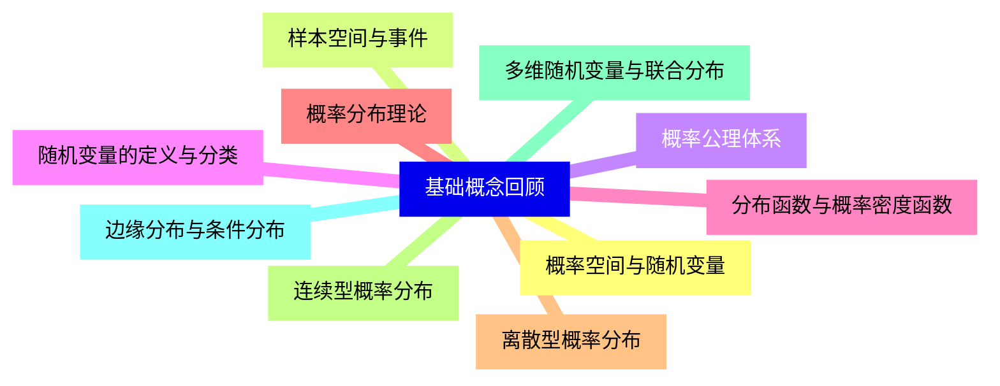
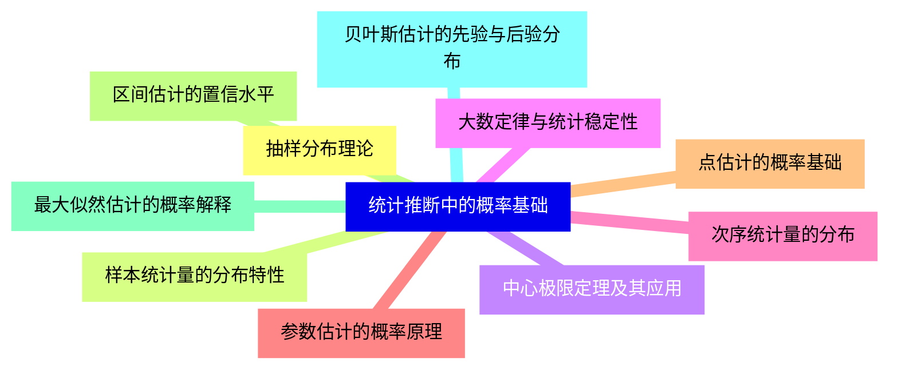
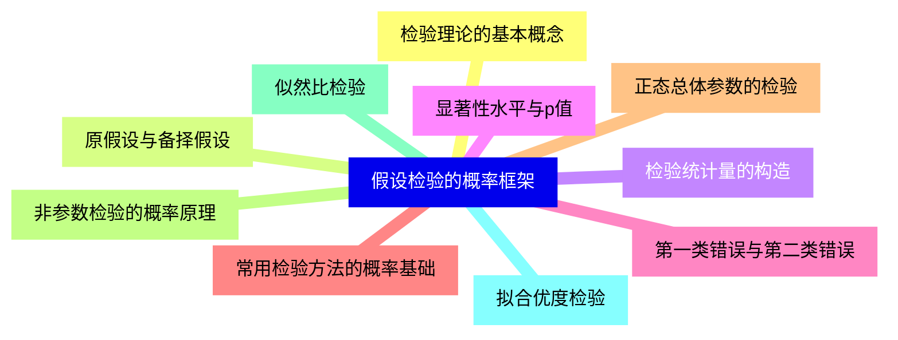
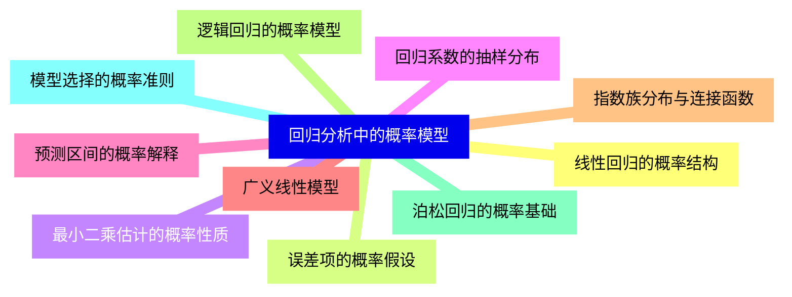
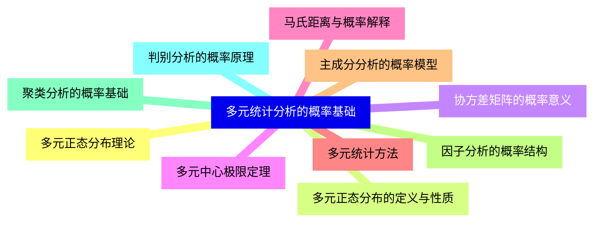
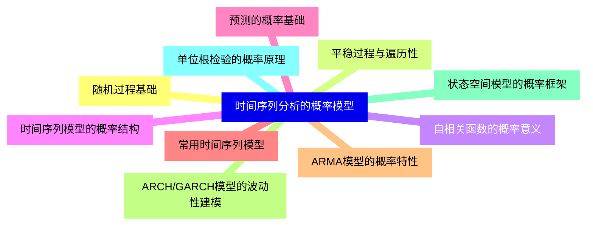
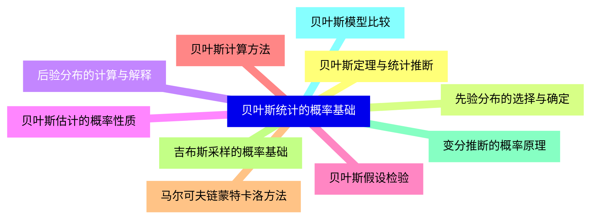
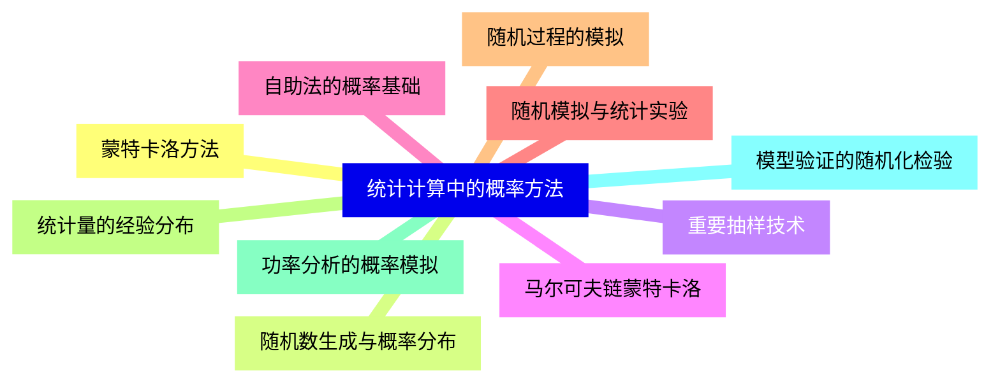
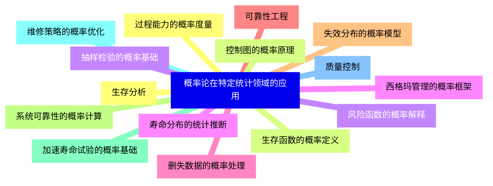
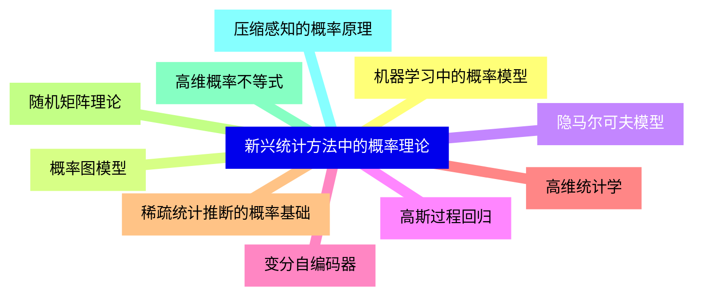


### 1 [基础概念回顾](#1)
#### 1.1 [概率空间与随机变量](#1)
#### 1.2 [样本空间与事件](#1)
#### 1.3 [概率公理体系](#1)
#### 1.4 [随机变量的定义与分类](#1)
#### 1.5 [分布函数与概率密度函数](#1)
#### 1.6 [概率分布理论](#1)
#### 1.7 [离散型概率分布](#1)
#### 1.8 [连续型概率分布](#1)
#### 1.9 [多维随机变量与联合分布](#1)
#### 1.10 [边缘分布与条件分布](#1)
### 2 [统计推断中的概率基础](#2)
#### 2.1 [抽样分布理论](#2)
#### 2.2 [样本统计量的分布特性](#2)
#### 2.3 [中心极限定理及其应用](#2)
#### 2.4 [大数定律与统计稳定性](#2)
#### 2.5 [次序统计量的分布](#2)
#### 2.6 [参数估计的概率原理](#2)
#### 2.7 [点估计的概率基础](#2)
#### 2.8 [区间估计的置信水平](#2)
#### 2.9 [最大似然估计的概率解释](#2)
#### 2.10 [贝叶斯估计的先验与后验分布](#2)
### 3 [假设检验的概率框架](#3)
#### 3.1 [检验理论的基本概念](#3)
#### 3.2 [原假设与备择假设](#3)
#### 3.3 [检验统计量的构造](#3)
#### 3.4 [显著性水平与p值](#3)
#### 3.5 [第一类错误与第二类错误](#3)
#### 3.6 [常用检验方法的概率基础](#3)
#### 3.7 [正态总体参数的检验](#3)
#### 3.8 [非参数检验的概率原理](#3)
#### 3.9 [似然比检验](#3)
#### 3.10 [拟合优度检验](#3)
### 4 [回归分析中的概率模型](#4)
#### 4.1 [线性回归的概率结构](#4)
#### 4.2 [误差项的概率假设](#4)
#### 4.3 [最小二乘估计的概率性质](#4)
#### 4.4 [回归系数的抽样分布](#4)
#### 4.5 [预测区间的概率解释](#4)
#### 4.6 [广义线性模型](#4)
#### 4.7 [指数族分布与连接函数](#4)
#### 4.8 [逻辑回归的概率模型](#4)
#### 4.9 [泊松回归的概率基础](#4)
#### 4.10 [模型选择的概率准则](#4)
### 5 [多元统计分析的概率基础](#5)
#### 5.1 [多元正态分布理论](#5)
#### 5.2 [多元正态分布的定义与性质](#5)
#### 5.3 [协方差矩阵的概率意义](#5)
#### 5.4 [多元中心极限定理](#5)
#### 5.5 [马氏距离与概率解释](#5)
#### 5.6 [多元统计方法](#5)
#### 5.7 [主成分分析的概率模型](#5)
#### 5.8 [因子分析的概率结构](#5)
#### 5.9 [聚类分析的概率基础](#5)
#### 5.10 [判别分析的概率原理](#5)
### 6 [时间序列分析的概率模型](#6)
#### 6.1 [随机过程基础](#6)
#### 6.2 [平稳过程与遍历性](#6)
#### 6.3 [自相关函数的概率意义](#6)
#### 6.4 [时间序列模型的概率结构](#6)
#### 6.5 [预测的概率基础](#6)
#### 6.6 [常用时间序列模型](#6)
#### 6.7 [ARMA模型的概率特性](#6)
#### 6.8 [ARCH/GARCH模型的波动性建模](#6)
#### 6.9 [状态空间模型的概率框架](#6)
#### 6.10 [单位根检验的概率原理](#6)
### 7 [贝叶斯统计的概率基础](#7)
#### 7.1 [贝叶斯定理与统计推断](#7)
#### 7.2 [先验分布的选择与确定](#7)
#### 7.3 [后验分布的计算与解释](#7)
#### 7.4 [贝叶斯估计的概率性质](#7)
#### 7.5 [贝叶斯假设检验](#7)
#### 7.6 [贝叶斯计算方法](#7)
#### 7.7 [马尔可夫链蒙特卡洛方法](#7)
#### 7.8 [吉布斯采样的概率基础](#7)
#### 7.9 [变分推断的概率原理](#7)
#### 7.10 [贝叶斯模型比较](#7)
### 8 [统计计算中的概率方法](#8)
#### 8.1 [蒙特卡洛方法](#8)
#### 8.2 [随机数生成与概率分布](#8)
#### 8.3 [重要抽样技术](#8)
#### 8.4 [马尔可夫链蒙特卡洛](#8)
#### 8.5 [自助法的概率基础](#8)
#### 8.6 [随机模拟与统计实验](#8)
#### 8.7 [随机过程的模拟](#8)
#### 8.8 [统计量的经验分布](#8)
#### 8.9 [功率分析的概率模拟](#8)
#### 8.10 [模型验证的随机化检验](#8)
### 9 [概率论在特定统计领域的应用](#9)
#### 9.1 [生存分析](#9)
#### 9.2 [生存函数的概率定义](#9)
#### 9.3 [风险函数的概率解释](#9)
#### 9.4 [寿命分布的统计推断](#9)
#### 9.5 [删失数据的概率处理](#9)
#### 9.6 [可靠性工程](#9)
#### 9.7 [失效分布的概率模型](#9)
#### 9.8 [系统可靠性的概率计算](#9)
#### 9.9 [加速寿命试验的概率基础](#9)
#### 9.10 [维修策略的概率优化](#9)
#### 9.11 [质量控制](#9)
#### 9.12 [过程能力的概率度量](#9)
#### 9.13 [控制图的概率原理](#9)
#### 9.14 [抽样检验的概率基础](#9)
#### 9.15 [西格玛管理的概率框架](#9)
### 10 [新兴统计方法中的概率理论](#10)
#### 10.1 [机器学习中的概率模型](#10)
#### 10.2 [概率图模型](#10)
#### 10.3 [隐马尔可夫模型](#10)
#### 10.4 [高斯过程回归](#10)
#### 10.5 [变分自编码器](#10)
#### 10.6 [高维统计学](#10)
#### 10.7 [稀疏统计推断的概率基础](#10)
#### 10.8 [随机矩阵理论](#10)
#### 10.9 [高维概率不等式](#10)
#### 10.10 [压缩感知的概率原理](#10)




### 1 基础概念回顾

---
### 1 基础概念回顾
___
#### 1.1 概率空间与随机变量
___
#### 1.2 样本空间与事件
___
#### 1.3 概率公理体系
___
#### 1.4 随机变量的定义与分类
___
#### 1.5 分布函数与概率密度函数
___
#### 1.6 概率分布理论
___
#### 1.7 离散型概率分布
___
#### 1.8 连续型概率分布
___
#### 1.9 多维随机变量与联合分布
___
#### 1.10 边缘分布与条件分布
### 2 统计推断中的概率基础

---
### 2 统计推断中的概率基础
___
#### 2.1 抽样分布理论
___
#### 2.2 样本统计量的分布特性
___
#### 2.3 中心极限定理及其应用
___
#### 2.4 大数定律与统计稳定性
___
#### 2.5 次序统计量的分布
___
#### 2.6 参数估计的概率原理
___
#### 2.7 点估计的概率基础
___
#### 2.8 区间估计的置信水平
___
#### 2.9 最大似然估计的概率解释
___
#### 2.10 贝叶斯估计的先验与后验分布
### 3 假设检验的概率框架

---
### 3 假设检验的概率框架
___
#### 3.1 检验理论的基本概念
___
#### 3.2 原假设与备择假设
___
#### 3.3 检验统计量的构造
___
#### 3.4 显著性水平与p值
___
#### 3.5 第一类错误与第二类错误
___
#### 3.6 常用检验方法的概率基础
___
#### 3.7 正态总体参数的检验
___
#### 3.8 非参数检验的概率原理
___
#### 3.9 似然比检验
___
#### 3.10 拟合优度检验
### 4 回归分析中的概率模型

---
### 4 回归分析中的概率模型
___
#### 4.1 线性回归的概率结构
___
#### 4.2 误差项的概率假设
___
#### 4.3 最小二乘估计的概率性质
___
#### 4.4 回归系数的抽样分布
___
#### 4.5 预测区间的概率解释
___
#### 4.6 广义线性模型
___
#### 4.7 指数族分布与连接函数
___
#### 4.8 逻辑回归的概率模型
___
#### 4.9 泊松回归的概率基础
___
#### 4.10 模型选择的概率准则
### 5 多元统计分析的概率基础

---
### 5 多元统计分析的概率基础
___
#### 5.1 多元正态分布理论
___
#### 5.2 多元正态分布的定义与性质
___
#### 5.3 协方差矩阵的概率意义
___
#### 5.4 多元中心极限定理
___
#### 5.5 马氏距离与概率解释
___
#### 5.6 多元统计方法
___
#### 5.7 主成分分析的概率模型
___
#### 5.8 因子分析的概率结构
___
#### 5.9 聚类分析的概率基础
___
#### 5.10 判别分析的概率原理
### 6 时间序列分析的概率模型

---
### 6 时间序列分析的概率模型
___
#### 6.1 随机过程基础
___
#### 6.2 平稳过程与遍历性
___
#### 6.3 自相关函数的概率意义
___
#### 6.4 时间序列模型的概率结构
___
#### 6.5 预测的概率基础
___
#### 6.6 常用时间序列模型
___
#### 6.7 ARMA模型的概率特性
___
#### 6.8 ARCH/GARCH模型的波动性建模
___
#### 6.9 状态空间模型的概率框架
___
#### 6.10 单位根检验的概率原理
### 7 贝叶斯统计的概率基础

---
### 7 贝叶斯统计的概率基础
___
#### 7.1 贝叶斯定理与统计推断
___
#### 7.2 先验分布的选择与确定
___
#### 7.3 后验分布的计算与解释
___
#### 7.4 贝叶斯估计的概率性质
___
#### 7.5 贝叶斯假设检验
___
#### 7.6 贝叶斯计算方法
___
#### 7.7 马尔可夫链蒙特卡洛方法
___
#### 7.8 吉布斯采样的概率基础
___
#### 7.9 变分推断的概率原理
___
#### 7.10 贝叶斯模型比较
### 8 统计计算中的概率方法

---
### 8 统计计算中的概率方法
___
#### 8.1 蒙特卡洛方法
___
#### 8.2 随机数生成与概率分布
___
#### 8.3 重要抽样技术
___
#### 8.4 马尔可夫链蒙特卡洛
___
#### 8.5 自助法的概率基础
___
#### 8.6 随机模拟与统计实验
___
#### 8.7 随机过程的模拟
___
#### 8.8 统计量的经验分布
___
#### 8.9 功率分析的概率模拟
___
#### 8.10 模型验证的随机化检验
### 9 概率论在特定统计领域的应用

---
### 9 概率论在特定统计领域的应用
___
#### 9.1 生存分析
___
#### 9.2 生存函数的概率定义
___
#### 9.3 风险函数的概率解释
___
#### 9.4 寿命分布的统计推断
___
#### 9.5 删失数据的概率处理
___
#### 9.6 可靠性工程
___
#### 9.7 失效分布的概率模型
___
#### 9.8 系统可靠性的概率计算
___
#### 9.9 加速寿命试验的概率基础
___
#### 9.10 维修策略的概率优化
___
#### 9.11 质量控制
___
#### 9.12 过程能力的概率度量
___
#### 9.13 控制图的概率原理
___
#### 9.14 抽样检验的概率基础
___
#### 9.15 西格玛管理的概率框架
### 10 新兴统计方法中的概率理论

---
### 10 新兴统计方法中的概率理论
___
#### 10.1 机器学习中的概率模型
___
#### 10.2 概率图模型
___
#### 10.3 隐马尔可夫模型
___
#### 10.4 高斯过程回归
___
#### 10.5 变分自编码器
___
#### 10.6 高维统计学
___
#### 10.7 稀疏统计推断的概率基础
___
#### 10.8 随机矩阵理论
___
#### 10.9 高维概率不等式
___
#### 10.10 压缩感知的概率原理


### 1 基础概念回顾{#1}

{}

<--->
{}
{}
{}
{}
{}
{}
{}
{}
{}
{}
{}
{}
{}
{}
{}
{}
{}
{}
{}
{}
{}

### 2 统计推断中的概率基础{#2}

{}
{}
{}
{}
{}
{}
{}
{}
{}
{}
{}
{}
{}
{}
{}
{}
{}
{}
{}
{}
{}
<--->

{}

### 3 假设检验的概率框架{#3}

{}

<--->
{}
{}
{}
{}
{}
{}
{}
{}
{}
{}
{}
{}
{}
{}
{}
{}
{}
{}
{}
{}
{}

### 4 回归分析中的概率模型{#4}

{}
{}
{}
{}
{}
{}
{}
{}
{}
{}
{}
{}
{}
{}
{}
{}
{}
{}
{}
{}
{}
<--->

{}

### 5 多元统计分析的概率基础{#5}

{}

<--->
{}
{}
{}
{}
{}
{}
{}
{}
{}
{}
{}
{}
{}
{}
{}
{}
{}
{}
{}
{}
{}

### 6 时间序列分析的概率模型{#6}

{}
{}
{}
{}
{}
{}
{}
{}
{}
{}
{}
{}
{}
{}
{}
{}
{}
{}
{}
{}
{}
<--->

{}

### 7 贝叶斯统计的概率基础{#7}

{}

<--->
{}
{}
{}
{}
{}
{}
{}
{}
{}
{}
{}
{}
{}
{}
{}
{}
{}
{}
{}
{}
{}

### 8 统计计算中的概率方法{#8}

{}
{}
{}
{}
{}
{}
{}
{}
{}
{}
{}
{}
{}
{}
{}
{}
{}
{}
{}
{}
{}
<--->

{}

### 9 概率论在特定统计领域的应用{#9}

{}

<--->
{}
{}
{}
{}
{}
{}
{}
{}
{}
{}
{}
{}
{}
{}
{}
{}
{}
{}
{}
{}
{}
{}
{}
{}
{}
{}
{}
{}
{}
{}
{}

### 10 新兴统计方法中的概率理论{#10}

{}
{}
{}
{}
{}
{}
{}
{}
{}
{}
{}
{}
{}
{}
{}
{}
{}
{}
{}
{}
{}
<--->

{}
