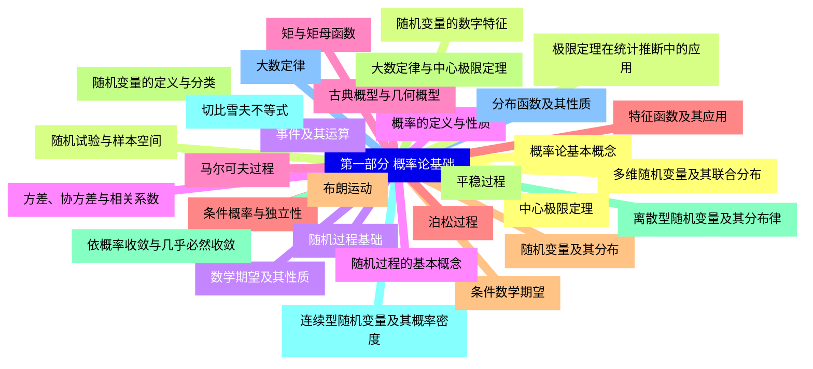
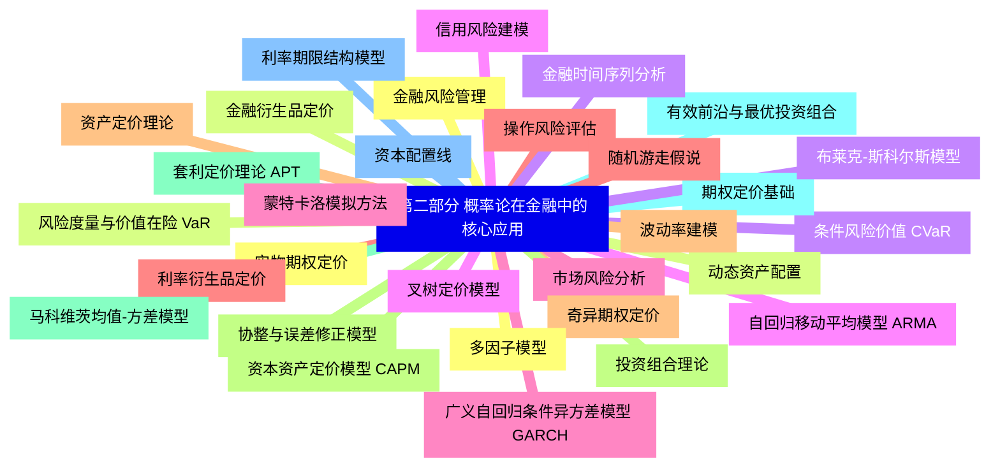
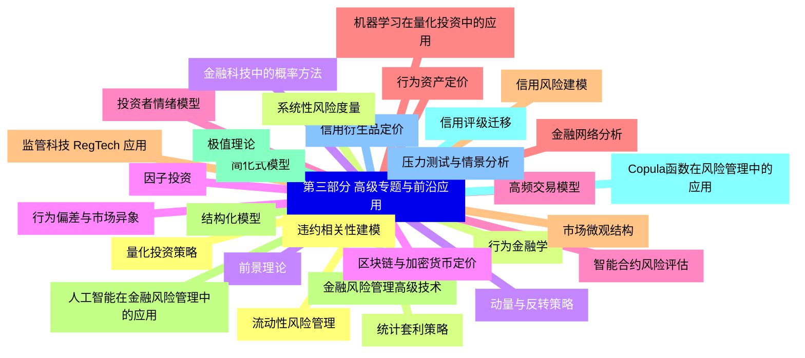


### 1 [第一部分 概率论基础](#1)
#### 1.1 [概率论基本概念](#1)
#### 1.2 [随机试验与样本空间](#1)
#### 1.3 [事件及其运算](#1)
#### 1.4 [概率的定义与性质](#1)
#### 1.5 [古典概型与几何概型](#1)
#### 1.6 [条件概率与独立性](#1)
#### 1.7 [随机变量及其分布](#1)
#### 1.8 [随机变量的定义与分类](#1)
#### 1.9 [离散型随机变量及其分布律](#1)
#### 1.10 [连续型随机变量及其概率密度](#1)
#### 1.11 [分布函数及其性质](#1)
#### 1.12 [多维随机变量及其联合分布](#1)
#### 1.13 [随机变量的数字特征](#1)
#### 1.14 [数学期望及其性质](#1)
#### 1.15 [方差、协方差与相关系数](#1)
#### 1.16 [矩与矩母函数](#1)
#### 1.17 [特征函数及其应用](#1)
#### 1.18 [条件数学期望](#1)
#### 1.19 [大数定律与中心极限定理](#1)
#### 1.20 [依概率收敛与几乎必然收敛](#1)
#### 1.21 [切比雪夫不等式](#1)
#### 1.22 [大数定律](#1)
#### 1.23 [中心极限定理](#1)
#### 1.24 [极限定理在统计推断中的应用](#1)
#### 1.25 [随机过程基础](#1)
#### 1.26 [随机过程的基本概念](#1)
#### 1.27 [马尔可夫过程](#1)
#### 1.28 [泊松过程](#1)
#### 1.29 [布朗运动](#1)
#### 1.30 [平稳过程](#1)
### 2 [第二部分 概率论在金融中的核心应用](#2)
#### 2.1 [金融风险管理](#2)
#### 2.2 [风险度量与价值在险 VaR](#2)
#### 2.3 [条件风险价值 CVaR](#2)
#### 2.4 [信用风险建模](#2)
#### 2.5 [市场风险分析](#2)
#### 2.6 [操作风险评估](#2)
#### 2.7 [资产定价理论](#2)
#### 2.8 [资本资产定价模型 CAPM](#2)
#### 2.9 [套利定价理论 APT](#2)
#### 2.10 [期权定价基础](#2)
#### 2.11 [利率期限结构模型](#2)
#### 2.12 [实物期权定价](#2)
#### 2.13 [金融衍生品定价](#2)
#### 2.14 [布莱克-斯科尔斯模型](#2)
#### 2.15 [叉树定价模型](#2)
#### 2.16 [蒙特卡洛模拟方法](#2)
#### 2.17 [利率衍生品定价](#2)
#### 2.18 [奇异期权定价](#2)
#### 2.19 [投资组合理论](#2)
#### 2.20 [马科维茨均值-方差模型](#2)
#### 2.21 [有效前沿与最优投资组合](#2)
#### 2.22 [资本配置线](#2)
#### 2.23 [多因子模型](#2)
#### 2.24 [动态资产配置](#2)
#### 2.25 [金融时间序列分析](#2)
#### 2.26 [自回归移动平均模型 ARMA](#2)
#### 2.27 [广义自回归条件异方差模型 GARCH](#2)
#### 2.28 [随机游走假说](#2)
#### 2.29 [波动率建模](#2)
#### 2.30 [协整与误差修正模型](#2)
### 3 [第三部分 高级专题与前沿应用](#3)
#### 3.1 [量化投资策略](#3)
#### 3.2 [统计套利策略](#3)
#### 3.3 [动量与反转策略](#3)
#### 3.4 [因子投资](#3)
#### 3.5 [高频交易模型](#3)
#### 3.6 [机器学习在量化投资中的应用](#3)
#### 3.7 [信用风险建模](#3)
#### 3.8 [结构化模型](#3)
#### 3.9 [简化式模型](#3)
#### 3.10 [信用评级迁移](#3)
#### 3.11 [信用衍生品定价](#3)
#### 3.12 [违约相关性建模](#3)
#### 3.13 [行为金融学](#3)
#### 3.14 [前景理论](#3)
#### 3.15 [行为偏差与市场异象](#3)
#### 3.16 [投资者情绪模型](#3)
#### 3.17 [行为资产定价](#3)
#### 3.18 [市场微观结构](#3)
#### 3.19 [金融风险管理高级技术](#3)
#### 3.20 [极值理论](#3)
#### 3.21 [Copula函数在风险管理中的应用](#3)
#### 3.22 [压力测试与情景分析](#3)
#### 3.23 [流动性风险管理](#3)
#### 3.24 [系统性风险度量](#3)
#### 3.25 [金融科技中的概率方法](#3)
#### 3.26 [区块链与加密货币定价](#3)
#### 3.27 [智能合约风险评估](#3)
#### 3.28 [金融网络分析](#3)
#### 3.29 [监管科技 RegTech 应用](#3)
#### 3.30 [人工智能在金融风险管理中的应用](#3)




### 1 第一部分 概率论基础

---
### 1 第一部分 概率论基础
___
#### 1.1 概率论基本概念
___
#### 1.2 随机试验与样本空间
___
#### 1.3 事件及其运算
___
#### 1.4 概率的定义与性质
___
#### 1.5 古典概型与几何概型
___
#### 1.6 条件概率与独立性
___
#### 1.7 随机变量及其分布
___
#### 1.8 随机变量的定义与分类
___
#### 1.9 离散型随机变量及其分布律
___
#### 1.10 连续型随机变量及其概率密度
___
#### 1.11 分布函数及其性质
___
#### 1.12 多维随机变量及其联合分布
___
#### 1.13 随机变量的数字特征
___
#### 1.14 数学期望及其性质
___
#### 1.15 方差、协方差与相关系数
___
#### 1.16 矩与矩母函数
___
#### 1.17 特征函数及其应用
___
#### 1.18 条件数学期望
___
#### 1.19 大数定律与中心极限定理
___
#### 1.20 依概率收敛与几乎必然收敛
___
#### 1.21 切比雪夫不等式
___
#### 1.22 大数定律
___
#### 1.23 中心极限定理
___
#### 1.24 极限定理在统计推断中的应用
___
#### 1.25 随机过程基础
___
#### 1.26 随机过程的基本概念
___
#### 1.27 马尔可夫过程
___
#### 1.28 泊松过程
___
#### 1.29 布朗运动
___
#### 1.30 平稳过程
### 2 第二部分 概率论在金融中的核心应用

---
### 2 第二部分 概率论在金融中的核心应用
___
#### 2.1 金融风险管理
___
#### 2.2 风险度量与价值在险 VaR
___
#### 2.3 条件风险价值 CVaR
___
#### 2.4 信用风险建模
___
#### 2.5 市场风险分析
___
#### 2.6 操作风险评估
___
#### 2.7 资产定价理论
___
#### 2.8 资本资产定价模型 CAPM
___
#### 2.9 套利定价理论 APT
___
#### 2.10 期权定价基础
___
#### 2.11 利率期限结构模型
___
#### 2.12 实物期权定价
___
#### 2.13 金融衍生品定价
___
#### 2.14 布莱克-斯科尔斯模型
___
#### 2.15 叉树定价模型
___
#### 2.16 蒙特卡洛模拟方法
___
#### 2.17 利率衍生品定价
___
#### 2.18 奇异期权定价
___
#### 2.19 投资组合理论
___
#### 2.20 马科维茨均值-方差模型
___
#### 2.21 有效前沿与最优投资组合
___
#### 2.22 资本配置线
___
#### 2.23 多因子模型
___
#### 2.24 动态资产配置
___
#### 2.25 金融时间序列分析
___
#### 2.26 自回归移动平均模型 ARMA
___
#### 2.27 广义自回归条件异方差模型 GARCH
___
#### 2.28 随机游走假说
___
#### 2.29 波动率建模
___
#### 2.30 协整与误差修正模型
### 3 第三部分 高级专题与前沿应用

---
### 3 第三部分 高级专题与前沿应用
___
#### 3.1 量化投资策略
___
#### 3.2 统计套利策略
___
#### 3.3 动量与反转策略
___
#### 3.4 因子投资
___
#### 3.5 高频交易模型
___
#### 3.6 机器学习在量化投资中的应用
___
#### 3.7 信用风险建模
___
#### 3.8 结构化模型
___
#### 3.9 简化式模型
___
#### 3.10 信用评级迁移
___
#### 3.11 信用衍生品定价
___
#### 3.12 违约相关性建模
___
#### 3.13 行为金融学
___
#### 3.14 前景理论
___
#### 3.15 行为偏差与市场异象
___
#### 3.16 投资者情绪模型
___
#### 3.17 行为资产定价
___
#### 3.18 市场微观结构
___
#### 3.19 金融风险管理高级技术
___
#### 3.20 极值理论
___
#### 3.21 Copula函数在风险管理中的应用
___
#### 3.22 压力测试与情景分析
___
#### 3.23 流动性风险管理
___
#### 3.24 系统性风险度量
___
#### 3.25 金融科技中的概率方法
___
#### 3.26 区块链与加密货币定价
___
#### 3.27 智能合约风险评估
___
#### 3.28 金融网络分析
___
#### 3.29 监管科技 RegTech 应用
___
#### 3.30 人工智能在金融风险管理中的应用


### 1 第一部分 概率论基础{#1}

{}

<--->
{}
{}
{}
{}
{}
{}
{}
{}
{}
{}
{}
{}
{}
{}
{}
{}
{}
{}
{}
{}
{}
{}
{}
{}
{}
{}
{}
{}
{}
{}
{}
{}
{}
{}
{}
{}
{}
{}
{}
{}
{}
{}
{}
{}
{}
{}
{}
{}
{}
{}
{}
{}
{}
{}
{}
{}
{}
{}
{}
{}
{}

### 2 第二部分 概率论在金融中的核心应用{#2}

{}
{}
{}
{}
{}
{}
{}
{}
{}
{}
{}
{}
{}
{}
{}
{}
{}
{}
{}
{}
{}
{}
{}
{}
{}
{}
{}
{}
{}
{}
{}
{}
{}
{}
{}
{}
{}
{}
{}
{}
{}
{}
{}
{}
{}
{}
{}
{}
{}
{}
{}
{}
{}
{}
{}
{}
{}
{}
{}
{}
{}
<--->

{}

### 3 第三部分 高级专题与前沿应用{#3}

{}

<--->
{}
{}
{}
{}
{}
{}
{}
{}
{}
{}
{}
{}
{}
{}
{}
{}
{}
{}
{}
{}
{}
{}
{}
{}
{}
{}
{}
{}
{}
{}
{}
{}
{}
{}
{}
{}
{}
{}
{}
{}
{}
{}
{}
{}
{}
{}
{}
{}
{}
{}
{}
{}
{}
{}
{}
{}
{}
{}
{}
{}
{}
