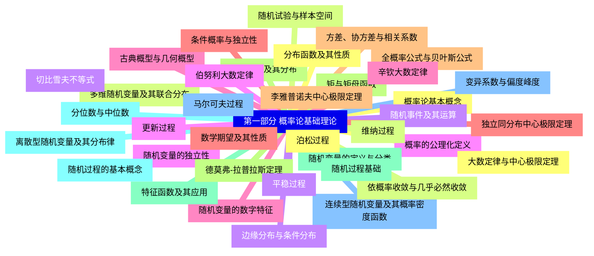
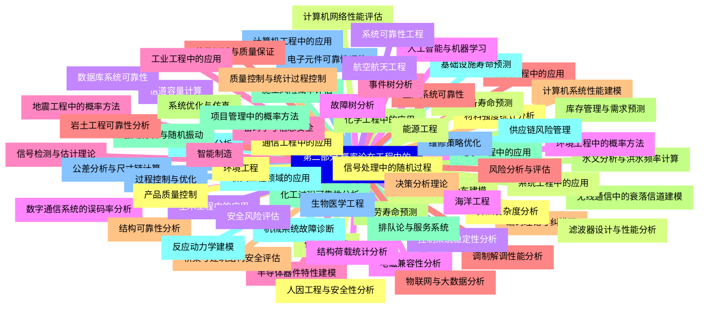


### 1 [第一部分 概率论基础理论](#1)
#### 1.1 [概率论基本概念](#1)
#### 1.2 [随机试验与样本空间](#1)
#### 1.3 [随机事件及其运算](#1)
#### 1.4 [概率的公理化定义](#1)
#### 1.5 [古典概型与几何概型](#1)
#### 1.6 [条件概率与独立性](#1)
#### 1.7 [全概率公式与贝叶斯公式](#1)
#### 1.8 [随机变量及其分布](#1)
#### 1.9 [随机变量的定义与分类](#1)
#### 1.10 [离散型随机变量及其分布律](#1)
#### 1.11 [连续型随机变量及其概率密度函数](#1)
#### 1.12 [分布函数及其性质](#1)
#### 1.13 [多维随机变量及其联合分布](#1)
#### 1.14 [边缘分布与条件分布](#1)
#### 1.15 [随机变量的独立性](#1)
#### 1.16 [随机变量的数字特征](#1)
#### 1.17 [数学期望及其性质](#1)
#### 1.18 [方差、协方差与相关系数](#1)
#### 1.19 [矩与矩母函数](#1)
#### 1.20 [特征函数及其应用](#1)
#### 1.21 [分位数与中位数](#1)
#### 1.22 [变异系数与偏度峰度](#1)
#### 1.23 [大数定律与中心极限定理](#1)
#### 1.24 [依概率收敛与几乎必然收敛](#1)
#### 1.25 [切比雪夫不等式](#1)
#### 1.26 [伯努利大数定律](#1)
#### 1.27 [辛钦大数定律](#1)
#### 1.28 [独立同分布中心极限定理](#1)
#### 1.29 [李雅普诺夫中心极限定理](#1)
#### 1.30 [德莫弗-拉普拉斯定理](#1)
#### 1.31 [随机过程基础](#1)
#### 1.32 [随机过程的基本概念](#1)
#### 1.33 [马尔可夫过程](#1)
#### 1.34 [泊松过程](#1)
#### 1.35 [维纳过程](#1)
#### 1.36 [平稳过程](#1)
#### 1.37 [更新过程](#1)
### 2 [第二部分 概率论在工程中的应用](#2)
#### 2.1 [通信工程中的应用](#2)
#### 2.2 [信息论与熵](#2)
#### 2.3 [信道容量计算](#2)
#### 2.4 [数字通信系统的误码率分析](#2)
#### 2.5 [信号检测与估计理论](#2)
#### 2.6 [调制解调性能分析](#2)
#### 2.7 [编码理论与纠错码](#2)
#### 2.8 [无线通信中的衰落信道建模](#2)
#### 2.9 [电子工程中的应用](#2)
#### 2.10 [电路噪声分析](#2)
#### 2.11 [电子元件可靠性评估](#2)
#### 2.12 [信号处理中的随机过程](#2)
#### 2.13 [滤波器设计与性能分析](#2)
#### 2.14 [控制系统稳定性分析](#2)
#### 2.15 [电磁兼容性分析](#2)
#### 2.16 [半导体器件特性建模](#2)
#### 2.17 [机械工程中的应用](#2)
#### 2.18 [结构可靠性分析](#2)
#### 2.19 [疲劳寿命预测](#2)
#### 2.20 [振动分析与随机振动](#2)
#### 2.21 [机械系统故障诊断](#2)
#### 2.22 [公差分析与尺寸链计算](#2)
#### 2.23 [材料强度统计分析](#2)
#### 2.24 [机械零件寿命分布建模](#2)
#### 2.25 [土木工程中的应用](#2)
#### 2.26 [结构荷载统计分析](#2)
#### 2.27 [地震工程中的概率方法](#2)
#### 2.28 [岩土工程可靠性分析](#2)
#### 2.29 [桥梁与建筑结构安全评估](#2)
#### 2.30 [水文分析与洪水频率计算](#2)
#### 2.31 [施工风险概率评估](#2)
#### 2.32 [基础设施寿命预测](#2)
#### 2.33 [计算机工程中的应用](#2)
#### 2.34 [算法复杂度分析](#2)
#### 2.35 [计算机网络性能评估](#2)
#### 2.36 [数据库系统可靠性](#2)
#### 2.37 [人工智能与机器学习](#2)
#### 2.38 [密码学与信息安全](#2)
#### 2.39 [软件测试与质量保证](#2)
#### 2.40 [计算机系统性能建模](#2)
#### 2.41 [化学工程中的应用](#2)
#### 2.42 [化工过程可靠性分析](#2)
#### 2.43 [反应动力学建模](#2)
#### 2.44 [过程控制与优化](#2)
#### 2.45 [产品质量控制](#2)
#### 2.46 [化工设备寿命预测](#2)
#### 2.47 [安全风险评估](#2)
#### 2.48 [环境工程中的概率方法](#2)
#### 2.49 [工业工程中的应用](#2)
#### 2.50 [生产系统可靠性](#2)
#### 2.51 [质量控制与统计过程控制](#2)
#### 2.52 [库存管理与需求预测](#2)
#### 2.53 [排队论与服务系统](#2)
#### 2.54 [供应链风险管理](#2)
#### 2.55 [维修策略优化](#2)
#### 2.56 [人因工程与安全性分析](#2)
#### 2.57 [系统工程中的应用](#2)
#### 2.58 [系统可靠性工程](#2)
#### 2.59 [故障树分析](#2)
#### 2.60 [事件树分析](#2)
#### 2.61 [风险分析与评估](#2)
#### 2.62 [决策分析理论](#2)
#### 2.63 [系统优化与仿真](#2)
#### 2.64 [项目管理中的概率方法](#2)
#### 2.65 [新兴工程领域的应用](#2)
#### 2.66 [生物医学工程](#2)
#### 2.67 [环境工程](#2)
#### 2.68 [能源工程](#2)
#### 2.69 [航空航天工程](#2)
#### 2.70 [海洋工程](#2)
#### 2.71 [智能制造](#2)
#### 2.72 [物联网与大数据分析](#2)




### 1 第一部分 概率论基础理论

---
### 1 第一部分 概率论基础理论
___
#### 1.1 概率论基本概念
___
#### 1.2 随机试验与样本空间
___
#### 1.3 随机事件及其运算
___
#### 1.4 概率的公理化定义
___
#### 1.5 古典概型与几何概型
___
#### 1.6 条件概率与独立性
___
#### 1.7 全概率公式与贝叶斯公式
___
#### 1.8 随机变量及其分布
___
#### 1.9 随机变量的定义与分类
___
#### 1.10 离散型随机变量及其分布律
___
#### 1.11 连续型随机变量及其概率密度函数
___
#### 1.12 分布函数及其性质
___
#### 1.13 多维随机变量及其联合分布
___
#### 1.14 边缘分布与条件分布
___
#### 1.15 随机变量的独立性
___
#### 1.16 随机变量的数字特征
___
#### 1.17 数学期望及其性质
___
#### 1.18 方差、协方差与相关系数
___
#### 1.19 矩与矩母函数
___
#### 1.20 特征函数及其应用
___
#### 1.21 分位数与中位数
___
#### 1.22 变异系数与偏度峰度
___
#### 1.23 大数定律与中心极限定理
___
#### 1.24 依概率收敛与几乎必然收敛
___
#### 1.25 切比雪夫不等式
___
#### 1.26 伯努利大数定律
___
#### 1.27 辛钦大数定律
___
#### 1.28 独立同分布中心极限定理
___
#### 1.29 李雅普诺夫中心极限定理
___
#### 1.30 德莫弗-拉普拉斯定理
___
#### 1.31 随机过程基础
___
#### 1.32 随机过程的基本概念
___
#### 1.33 马尔可夫过程
___
#### 1.34 泊松过程
___
#### 1.35 维纳过程
___
#### 1.36 平稳过程
___
#### 1.37 更新过程
### 2 第二部分 概率论在工程中的应用

---
### 2 第二部分 概率论在工程中的应用
___
#### 2.1 通信工程中的应用
___
#### 2.2 信息论与熵
___
#### 2.3 信道容量计算
___
#### 2.4 数字通信系统的误码率分析
___
#### 2.5 信号检测与估计理论
___
#### 2.6 调制解调性能分析
___
#### 2.7 编码理论与纠错码
___
#### 2.8 无线通信中的衰落信道建模
___
#### 2.9 电子工程中的应用
___
#### 2.10 电路噪声分析
___
#### 2.11 电子元件可靠性评估
___
#### 2.12 信号处理中的随机过程
___
#### 2.13 滤波器设计与性能分析
___
#### 2.14 控制系统稳定性分析
___
#### 2.15 电磁兼容性分析
___
#### 2.16 半导体器件特性建模
___
#### 2.17 机械工程中的应用
___
#### 2.18 结构可靠性分析
___
#### 2.19 疲劳寿命预测
___
#### 2.20 振动分析与随机振动
___
#### 2.21 机械系统故障诊断
___
#### 2.22 公差分析与尺寸链计算
___
#### 2.23 材料强度统计分析
___
#### 2.24 机械零件寿命分布建模
___
#### 2.25 土木工程中的应用
___
#### 2.26 结构荷载统计分析
___
#### 2.27 地震工程中的概率方法
___
#### 2.28 岩土工程可靠性分析
___
#### 2.29 桥梁与建筑结构安全评估
___
#### 2.30 水文分析与洪水频率计算
___
#### 2.31 施工风险概率评估
___
#### 2.32 基础设施寿命预测
___
#### 2.33 计算机工程中的应用
___
#### 2.34 算法复杂度分析
___
#### 2.35 计算机网络性能评估
___
#### 2.36 数据库系统可靠性
___
#### 2.37 人工智能与机器学习
___
#### 2.38 密码学与信息安全
___
#### 2.39 软件测试与质量保证
___
#### 2.40 计算机系统性能建模
___
#### 2.41 化学工程中的应用
___
#### 2.42 化工过程可靠性分析
___
#### 2.43 反应动力学建模
___
#### 2.44 过程控制与优化
___
#### 2.45 产品质量控制
___
#### 2.46 化工设备寿命预测
___
#### 2.47 安全风险评估
___
#### 2.48 环境工程中的概率方法
___
#### 2.49 工业工程中的应用
___
#### 2.50 生产系统可靠性
___
#### 2.51 质量控制与统计过程控制
___
#### 2.52 库存管理与需求预测
___
#### 2.53 排队论与服务系统
___
#### 2.54 供应链风险管理
___
#### 2.55 维修策略优化
___
#### 2.56 人因工程与安全性分析
___
#### 2.57 系统工程中的应用
___
#### 2.58 系统可靠性工程
___
#### 2.59 故障树分析
___
#### 2.60 事件树分析
___
#### 2.61 风险分析与评估
___
#### 2.62 决策分析理论
___
#### 2.63 系统优化与仿真
___
#### 2.64 项目管理中的概率方法
___
#### 2.65 新兴工程领域的应用
___
#### 2.66 生物医学工程
___
#### 2.67 环境工程
___
#### 2.68 能源工程
___
#### 2.69 航空航天工程
___
#### 2.70 海洋工程
___
#### 2.71 智能制造
___
#### 2.72 物联网与大数据分析


### 1 第一部分 概率论基础理论{#1}

{}

<--->
{}
{}
{}
{}
{}
{}
{}
{}
{}
{}
{}
{}
{}
{}
{}
{}
{}
{}
{}
{}
{}
{}
{}
{}
{}
{}
{}
{}
{}
{}
{}
{}
{}
{}
{}
{}
{}
{}
{}
{}
{}
{}
{}
{}
{}
{}
{}
{}
{}
{}
{}
{}
{}
{}
{}
{}
{}
{}
{}
{}
{}
{}
{}
{}
{}
{}
{}
{}
{}
{}
{}
{}
{}
{}
{}

### 2 第二部分 概率论在工程中的应用{#2}

{}
{}
{}
{}
{}
{}
{}
{}
{}
{}
{}
{}
{}
{}
{}
{}
{}
{}
{}
{}
{}
{}
{}
{}
{}
{}
{}
{}
{}
{}
{}
{}
{}
{}
{}
{}
{}
{}
{}
{}
{}
{}
{}
{}
{}
{}
{}
{}
{}
{}
{}
{}
{}
{}
{}
{}
{}
{}
{}
{}
{}
{}
{}
{}
{}
{}
{}
{}
{}
{}
{}
{}
{}
{}
{}
{}
{}
{}
{}
{}
{}
{}
{}
{}
{}
{}
{}
{}
{}
{}
{}
{}
{}
{}
{}
{}
{}
{}
{}
{}
{}
{}
{}
{}
{}
{}
{}
{}
{}
{}
{}
{}
{}
{}
{}
{}
{}
{}
{}
{}
{}
{}
{}
{}
{}
{}
{}
{}
{}
{}
{}
{}
{}
{}
{}
{}
{}
{}
{}
{}
{}
{}
{}
{}
{}
<--->

{}
