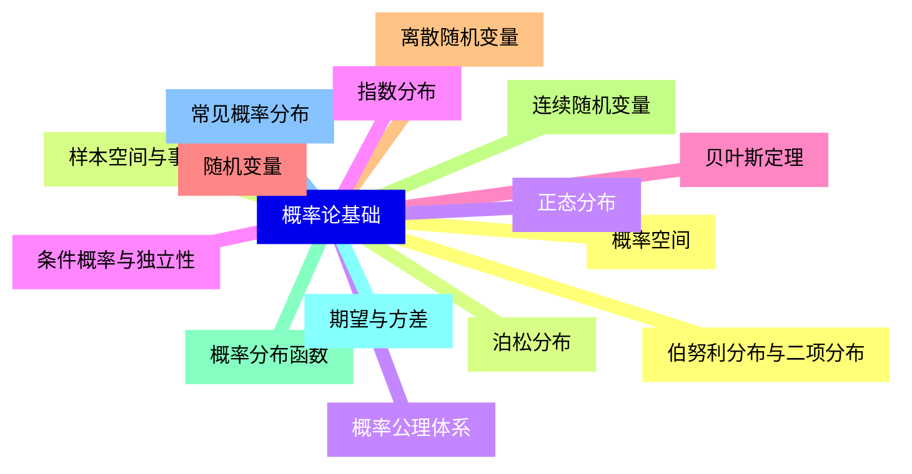
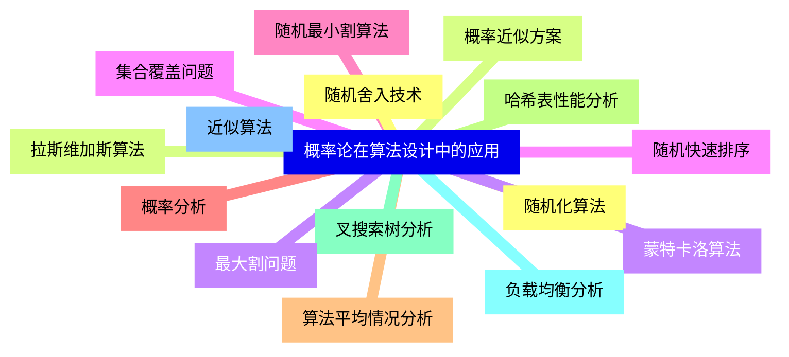
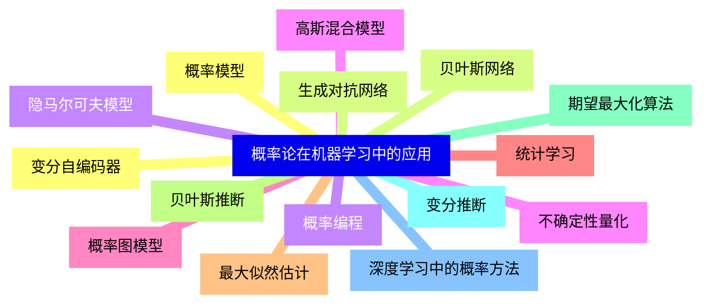
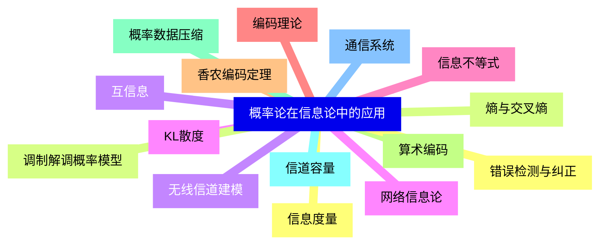
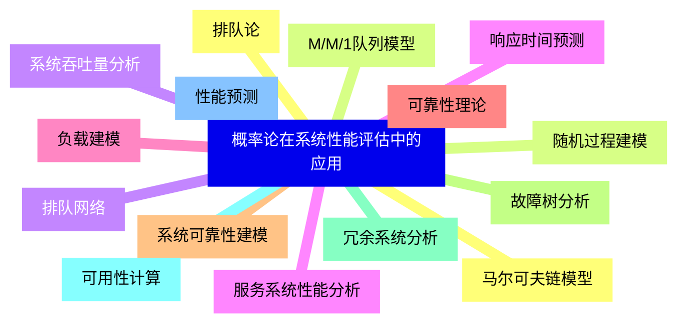
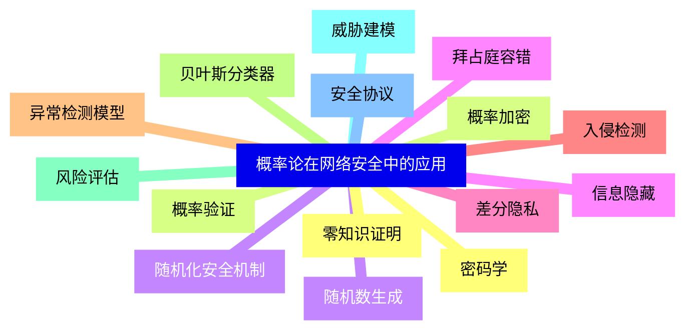
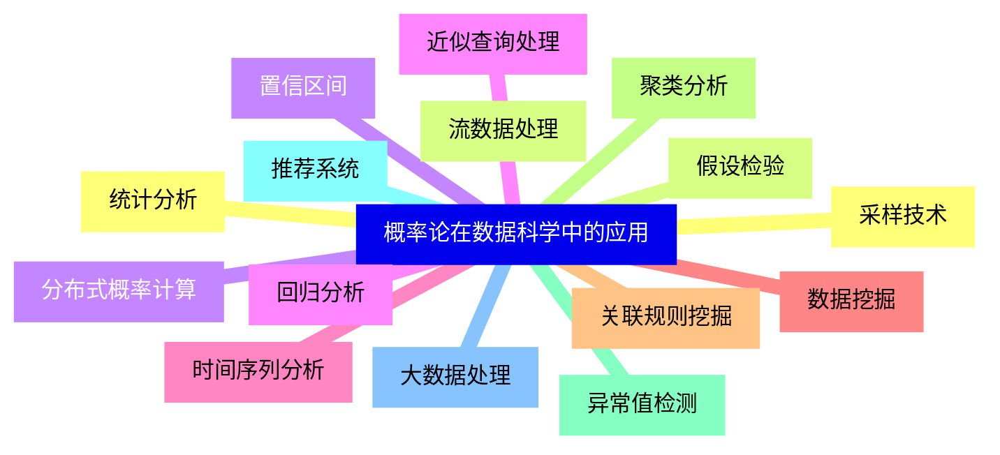
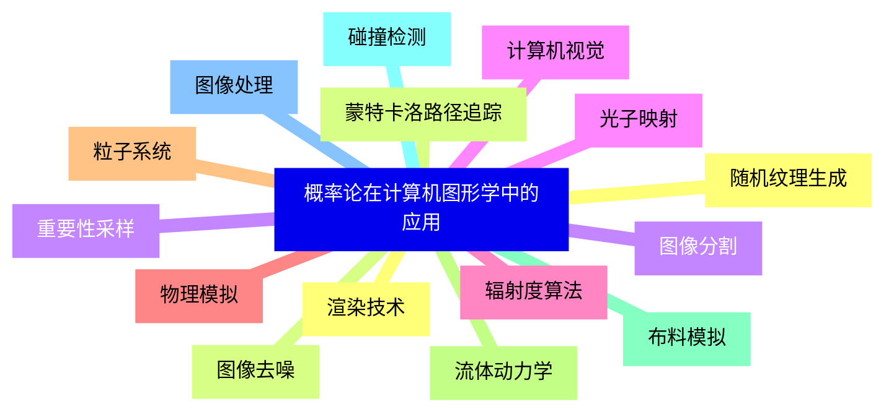
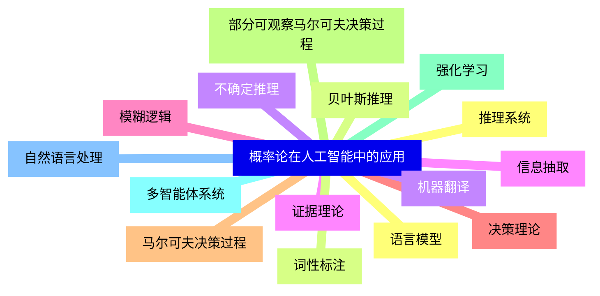
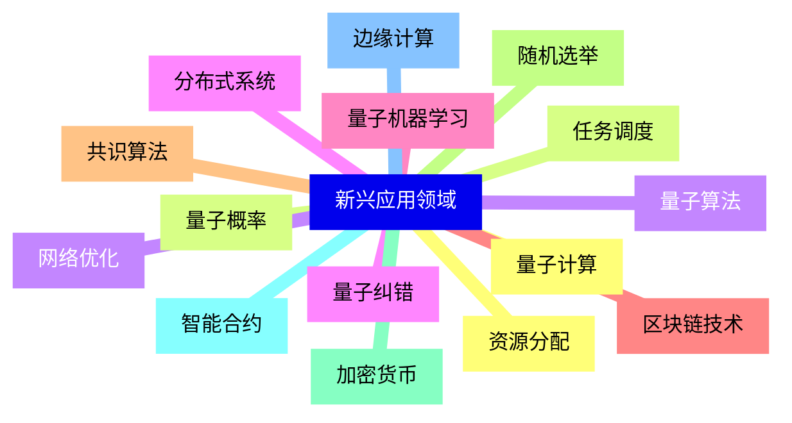


### 1 [概率论基础](#1)
#### 1.1 [概率空间](#1)
#### 1.2 [样本空间与事件](#1)
#### 1.3 [概率公理体系](#1)
#### 1.4 [条件概率与独立性](#1)
#### 1.5 [贝叶斯定理](#1)
#### 1.6 [随机变量](#1)
#### 1.7 [离散随机变量](#1)
#### 1.8 [连续随机变量](#1)
#### 1.9 [概率分布函数](#1)
#### 1.10 [期望与方差](#1)
#### 1.11 [常见概率分布](#1)
#### 1.12 [伯努利分布与二项分布](#1)
#### 1.13 [泊松分布](#1)
#### 1.14 [正态分布](#1)
#### 1.15 [指数分布](#1)
### 2 [概率论在算法设计中的应用](#2)
#### 2.1 [随机化算法](#2)
#### 2.2 [拉斯维加斯算法](#2)
#### 2.3 [蒙特卡洛算法](#2)
#### 2.4 [随机快速排序](#2)
#### 2.5 [随机最小割算法](#2)
#### 2.6 [概率分析](#2)
#### 2.7 [算法平均情况分析](#2)
#### 2.8 [哈希表性能分析](#2)
#### 2.9 [叉搜索树分析](#2)
#### 2.10 [负载均衡分析](#2)
#### 2.11 [近似算法](#2)
#### 2.12 [随机舍入技术](#2)
#### 2.13 [概率近似方案](#2)
#### 2.14 [最大割问题](#2)
#### 2.15 [集合覆盖问题](#2)
### 3 [概率论在机器学习中的应用](#3)
#### 3.1 [概率模型](#3)
#### 3.2 [贝叶斯网络](#3)
#### 3.3 [隐马尔可夫模型](#3)
#### 3.4 [高斯混合模型](#3)
#### 3.5 [概率图模型](#3)
#### 3.6 [统计学习](#3)
#### 3.7 [最大似然估计](#3)
#### 3.8 [贝叶斯推断](#3)
#### 3.9 [期望最大化算法](#3)
#### 3.10 [变分推断](#3)
#### 3.11 [深度学习中的概率方法](#3)
#### 3.12 [变分自编码器](#3)
#### 3.13 [生成对抗网络](#3)
#### 3.14 [概率编程](#3)
#### 3.15 [不确定性量化](#3)
### 4 [概率论在信息论中的应用](#4)
#### 4.1 [信息度量](#4)
#### 4.2 [熵与交叉熵](#4)
#### 4.3 [互信息](#4)
#### 4.4 [KL散度](#4)
#### 4.5 [信息不等式](#4)
#### 4.6 [编码理论](#4)
#### 4.7 [香农编码定理](#4)
#### 4.8 [算术编码](#4)
#### 4.9 [概率数据压缩](#4)
#### 4.10 [信道容量](#4)
#### 4.11 [通信系统](#4)
#### 4.12 [错误检测与纠正](#4)
#### 4.13 [调制解调概率模型](#4)
#### 4.14 [无线信道建模](#4)
#### 4.15 [网络信息论](#4)
### 5 [概率论在系统性能评估中的应用](#5)
#### 5.1 [排队论](#5)
#### 5.2 [M/M/1队列模型](#5)
#### 5.3 [排队网络](#5)
#### 5.4 [服务系统性能分析](#5)
#### 5.5 [负载建模](#5)
#### 5.6 [可靠性理论](#5)
#### 5.7 [系统可靠性建模](#5)
#### 5.8 [故障树分析](#5)
#### 5.9 [冗余系统分析](#5)
#### 5.10 [可用性计算](#5)
#### 5.11 [性能预测](#5)
#### 5.12 [马尔可夫链模型](#5)
#### 5.13 [随机过程建模](#5)
#### 5.14 [系统吞吐量分析](#5)
#### 5.15 [响应时间预测](#5)
### 6 [概率论在网络安全中的应用](#6)
#### 6.1 [密码学](#6)
#### 6.2 [概率加密](#6)
#### 6.3 [随机数生成](#6)
#### 6.4 [信息隐藏](#6)
#### 6.5 [差分隐私](#6)
#### 6.6 [入侵检测](#6)
#### 6.7 [异常检测模型](#6)
#### 6.8 [贝叶斯分类器](#6)
#### 6.9 [风险评估](#6)
#### 6.10 [威胁建模](#6)
#### 6.11 [安全协议](#6)
#### 6.12 [零知识证明](#6)
#### 6.13 [概率验证](#6)
#### 6.14 [随机化安全机制](#6)
#### 6.15 [拜占庭容错](#6)
### 7 [概率论在数据科学中的应用](#7)
#### 7.1 [统计分析](#7)
#### 7.2 [假设检验](#7)
#### 7.3 [置信区间](#7)
#### 7.4 [回归分析](#7)
#### 7.5 [时间序列分析](#7)
#### 7.6 [数据挖掘](#7)
#### 7.7 [关联规则挖掘](#7)
#### 7.8 [聚类分析](#7)
#### 7.9 [异常值检测](#7)
#### 7.10 [推荐系统](#7)
#### 7.11 [大数据处理](#7)
#### 7.12 [采样技术](#7)
#### 7.13 [流数据处理](#7)
#### 7.14 [分布式概率计算](#7)
#### 7.15 [近似查询处理](#7)
### 8 [概率论在计算机图形学中的应用](#8)
#### 8.1 [渲染技术](#8)
#### 8.2 [蒙特卡洛路径追踪](#8)
#### 8.3 [重要性采样](#8)
#### 8.4 [光子映射](#8)
#### 8.5 [辐射度算法](#8)
#### 8.6 [物理模拟](#8)
#### 8.7 [粒子系统](#8)
#### 8.8 [流体动力学](#8)
#### 8.9 [布料模拟](#8)
#### 8.10 [碰撞检测](#8)
#### 8.11 [图像处理](#8)
#### 8.12 [随机纹理生成](#8)
#### 8.13 [图像去噪](#8)
#### 8.14 [图像分割](#8)
#### 8.15 [计算机视觉](#8)
### 9 [概率论在人工智能中的应用](#9)
#### 9.1 [推理系统](#9)
#### 9.2 [贝叶斯推理](#9)
#### 9.3 [不确定推理](#9)
#### 9.4 [证据理论](#9)
#### 9.5 [模糊逻辑](#9)
#### 9.6 [决策理论](#9)
#### 9.7 [马尔可夫决策过程](#9)
#### 9.8 [部分可观察马尔可夫决策过程](#9)
#### 9.9 [强化学习](#9)
#### 9.10 [多智能体系统](#9)
#### 9.11 [自然语言处理](#9)
#### 9.12 [语言模型](#9)
#### 9.13 [词性标注](#9)
#### 9.14 [机器翻译](#9)
#### 9.15 [信息抽取](#9)
### 10 [新兴应用领域](#10)
#### 10.1 [量子计算](#10)
#### 10.2 [量子概率](#10)
#### 10.3 [量子算法](#10)
#### 10.4 [量子纠错](#10)
#### 10.5 [量子机器学习](#10)
#### 10.6 [区块链技术](#10)
#### 10.7 [共识算法](#10)
#### 10.8 [随机选举](#10)
#### 10.9 [加密货币](#10)
#### 10.10 [智能合约](#10)
#### 10.11 [边缘计算](#10)
#### 10.12 [资源分配](#10)
#### 10.13 [任务调度](#10)
#### 10.14 [网络优化](#10)
#### 10.15 [分布式系统](#10)




### 1 概率论基础

---
### 1 概率论基础
___
#### 1.1 概率空间
___
#### 1.2 样本空间与事件
___
#### 1.3 概率公理体系
___
#### 1.4 条件概率与独立性
___
#### 1.5 贝叶斯定理
___
#### 1.6 随机变量
___
#### 1.7 离散随机变量
___
#### 1.8 连续随机变量
___
#### 1.9 概率分布函数
___
#### 1.10 期望与方差
___
#### 1.11 常见概率分布
___
#### 1.12 伯努利分布与二项分布
___
#### 1.13 泊松分布
___
#### 1.14 正态分布
___
#### 1.15 指数分布
### 2 概率论在算法设计中的应用

---
### 2 概率论在算法设计中的应用
___
#### 2.1 随机化算法
___
#### 2.2 拉斯维加斯算法
___
#### 2.3 蒙特卡洛算法
___
#### 2.4 随机快速排序
___
#### 2.5 随机最小割算法
___
#### 2.6 概率分析
___
#### 2.7 算法平均情况分析
___
#### 2.8 哈希表性能分析
___
#### 2.9 叉搜索树分析
___
#### 2.10 负载均衡分析
___
#### 2.11 近似算法
___
#### 2.12 随机舍入技术
___
#### 2.13 概率近似方案
___
#### 2.14 最大割问题
___
#### 2.15 集合覆盖问题
### 3 概率论在机器学习中的应用

---
### 3 概率论在机器学习中的应用
___
#### 3.1 概率模型
___
#### 3.2 贝叶斯网络
___
#### 3.3 隐马尔可夫模型
___
#### 3.4 高斯混合模型
___
#### 3.5 概率图模型
___
#### 3.6 统计学习
___
#### 3.7 最大似然估计
___
#### 3.8 贝叶斯推断
___
#### 3.9 期望最大化算法
___
#### 3.10 变分推断
___
#### 3.11 深度学习中的概率方法
___
#### 3.12 变分自编码器
___
#### 3.13 生成对抗网络
___
#### 3.14 概率编程
___
#### 3.15 不确定性量化
### 4 概率论在信息论中的应用

---
### 4 概率论在信息论中的应用
___
#### 4.1 信息度量
___
#### 4.2 熵与交叉熵
___
#### 4.3 互信息
___
#### 4.4 KL散度
___
#### 4.5 信息不等式
___
#### 4.6 编码理论
___
#### 4.7 香农编码定理
___
#### 4.8 算术编码
___
#### 4.9 概率数据压缩
___
#### 4.10 信道容量
___
#### 4.11 通信系统
___
#### 4.12 错误检测与纠正
___
#### 4.13 调制解调概率模型
___
#### 4.14 无线信道建模
___
#### 4.15 网络信息论
### 5 概率论在系统性能评估中的应用

---
### 5 概率论在系统性能评估中的应用
___
#### 5.1 排队论
___
#### 5.2 M/M/1队列模型
___
#### 5.3 排队网络
___
#### 5.4 服务系统性能分析
___
#### 5.5 负载建模
___
#### 5.6 可靠性理论
___
#### 5.7 系统可靠性建模
___
#### 5.8 故障树分析
___
#### 5.9 冗余系统分析
___
#### 5.10 可用性计算
___
#### 5.11 性能预测
___
#### 5.12 马尔可夫链模型
___
#### 5.13 随机过程建模
___
#### 5.14 系统吞吐量分析
___
#### 5.15 响应时间预测
### 6 概率论在网络安全中的应用

---
### 6 概率论在网络安全中的应用
___
#### 6.1 密码学
___
#### 6.2 概率加密
___
#### 6.3 随机数生成
___
#### 6.4 信息隐藏
___
#### 6.5 差分隐私
___
#### 6.6 入侵检测
___
#### 6.7 异常检测模型
___
#### 6.8 贝叶斯分类器
___
#### 6.9 风险评估
___
#### 6.10 威胁建模
___
#### 6.11 安全协议
___
#### 6.12 零知识证明
___
#### 6.13 概率验证
___
#### 6.14 随机化安全机制
___
#### 6.15 拜占庭容错
### 7 概率论在数据科学中的应用

---
### 7 概率论在数据科学中的应用
___
#### 7.1 统计分析
___
#### 7.2 假设检验
___
#### 7.3 置信区间
___
#### 7.4 回归分析
___
#### 7.5 时间序列分析
___
#### 7.6 数据挖掘
___
#### 7.7 关联规则挖掘
___
#### 7.8 聚类分析
___
#### 7.9 异常值检测
___
#### 7.10 推荐系统
___
#### 7.11 大数据处理
___
#### 7.12 采样技术
___
#### 7.13 流数据处理
___
#### 7.14 分布式概率计算
___
#### 7.15 近似查询处理
### 8 概率论在计算机图形学中的应用

---
### 8 概率论在计算机图形学中的应用
___
#### 8.1 渲染技术
___
#### 8.2 蒙特卡洛路径追踪
___
#### 8.3 重要性采样
___
#### 8.4 光子映射
___
#### 8.5 辐射度算法
___
#### 8.6 物理模拟
___
#### 8.7 粒子系统
___
#### 8.8 流体动力学
___
#### 8.9 布料模拟
___
#### 8.10 碰撞检测
___
#### 8.11 图像处理
___
#### 8.12 随机纹理生成
___
#### 8.13 图像去噪
___
#### 8.14 图像分割
___
#### 8.15 计算机视觉
### 9 概率论在人工智能中的应用

---
### 9 概率论在人工智能中的应用
___
#### 9.1 推理系统
___
#### 9.2 贝叶斯推理
___
#### 9.3 不确定推理
___
#### 9.4 证据理论
___
#### 9.5 模糊逻辑
___
#### 9.6 决策理论
___
#### 9.7 马尔可夫决策过程
___
#### 9.8 部分可观察马尔可夫决策过程
___
#### 9.9 强化学习
___
#### 9.10 多智能体系统
___
#### 9.11 自然语言处理
___
#### 9.12 语言模型
___
#### 9.13 词性标注
___
#### 9.14 机器翻译
___
#### 9.15 信息抽取
### 10 新兴应用领域

---
### 10 新兴应用领域
___
#### 10.1 量子计算
___
#### 10.2 量子概率
___
#### 10.3 量子算法
___
#### 10.4 量子纠错
___
#### 10.5 量子机器学习
___
#### 10.6 区块链技术
___
#### 10.7 共识算法
___
#### 10.8 随机选举
___
#### 10.9 加密货币
___
#### 10.10 智能合约
___
#### 10.11 边缘计算
___
#### 10.12 资源分配
___
#### 10.13 任务调度
___
#### 10.14 网络优化
___
#### 10.15 分布式系统


### 1 概率论基础{#1}

{}

<--->
{}
{}
{}
{}
{}
{}
{}
{}
{}
{}
{}
{}
{}
{}
{}
{}
{}
{}
{}
{}
{}
{}
{}
{}
{}
{}
{}
{}
{}
{}
{}

### 2 概率论在算法设计中的应用{#2}

{}
{}
{}
{}
{}
{}
{}
{}
{}
{}
{}
{}
{}
{}
{}
{}
{}
{}
{}
{}
{}
{}
{}
{}
{}
{}
{}
{}
{}
{}
{}
<--->

{}

### 3 概率论在机器学习中的应用{#3}

{}

<--->
{}
{}
{}
{}
{}
{}
{}
{}
{}
{}
{}
{}
{}
{}
{}
{}
{}
{}
{}
{}
{}
{}
{}
{}
{}
{}
{}
{}
{}
{}
{}

### 4 概率论在信息论中的应用{#4}

{}
{}
{}
{}
{}
{}
{}
{}
{}
{}
{}
{}
{}
{}
{}
{}
{}
{}
{}
{}
{}
{}
{}
{}
{}
{}
{}
{}
{}
{}
{}
<--->

{}

### 5 概率论在系统性能评估中的应用{#5}

{}

<--->
{}
{}
{}
{}
{}
{}
{}
{}
{}
{}
{}
{}
{}
{}
{}
{}
{}
{}
{}
{}
{}
{}
{}
{}
{}
{}
{}
{}
{}
{}
{}

### 6 概率论在网络安全中的应用{#6}

{}
{}
{}
{}
{}
{}
{}
{}
{}
{}
{}
{}
{}
{}
{}
{}
{}
{}
{}
{}
{}
{}
{}
{}
{}
{}
{}
{}
{}
{}
{}
<--->

{}

### 7 概率论在数据科学中的应用{#7}

{}

<--->
{}
{}
{}
{}
{}
{}
{}
{}
{}
{}
{}
{}
{}
{}
{}
{}
{}
{}
{}
{}
{}
{}
{}
{}
{}
{}
{}
{}
{}
{}
{}

### 8 概率论在计算机图形学中的应用{#8}

{}
{}
{}
{}
{}
{}
{}
{}
{}
{}
{}
{}
{}
{}
{}
{}
{}
{}
{}
{}
{}
{}
{}
{}
{}
{}
{}
{}
{}
{}
{}
<--->

{}

### 9 概率论在人工智能中的应用{#9}

{}

<--->
{}
{}
{}
{}
{}
{}
{}
{}
{}
{}
{}
{}
{}
{}
{}
{}
{}
{}
{}
{}
{}
{}
{}
{}
{}
{}
{}
{}
{}
{}
{}

### 10 新兴应用领域{#10}

{}
{}
{}
{}
{}
{}
{}
{}
{}
{}
{}
{}
{}
{}
{}
{}
{}
{}
{}
{}
{}
{}
{}
{}
{}
{}
{}
{}
{}
{}
{}
<--->

{}
