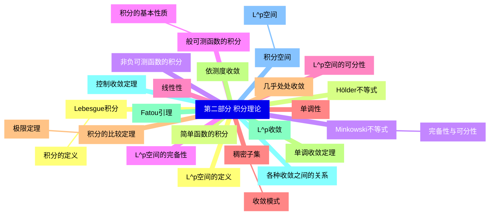
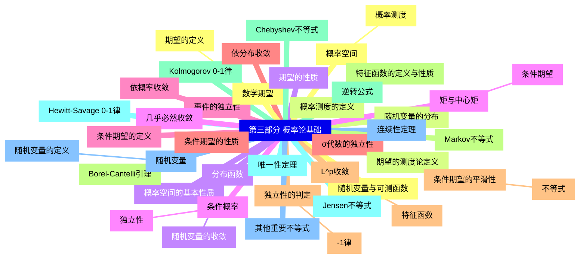
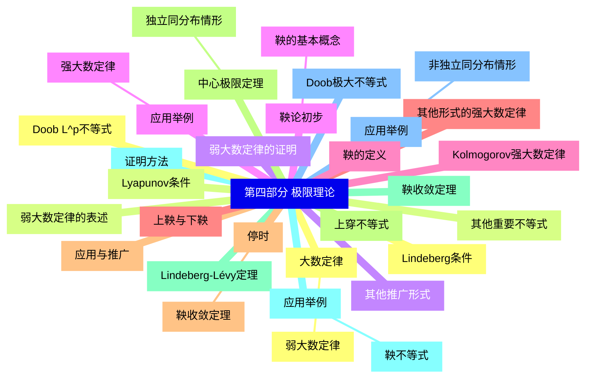
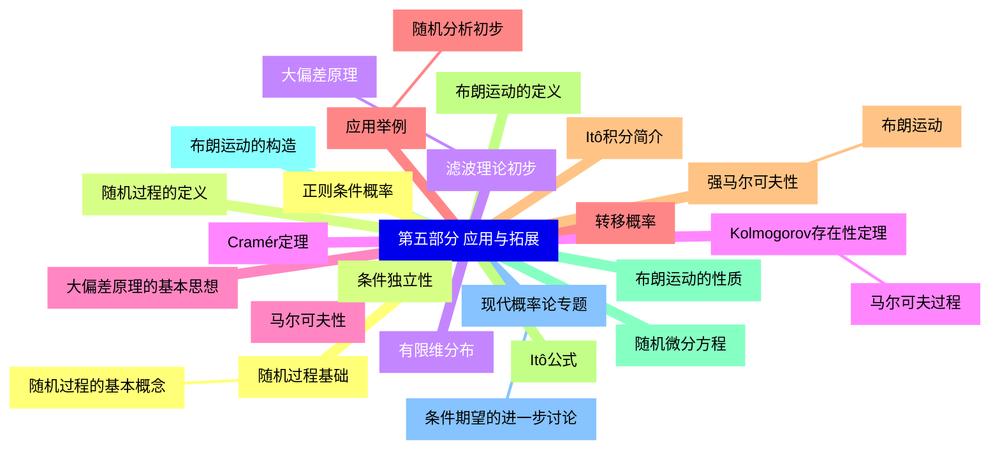


### 1 [第一部分 测度论基础](#1)
#### 1.1 [集合与σ-代数](#1)
##### 1.1.1 [集合论基础](#1)
#### 1.2 [集合的基本运算](#1)
#### 1.3 [集合的极限与上下极限](#1)
#### 1.4 [集合的示性函数](#1)
##### 1.4.1 [σ-代数](#1)
#### 1.5 [σ代数的定义与性质](#1)
#### 1.6 [生成σ代数](#1)
#### 1.7 [Borel σ代数](#1)
#### 1.8 [乘积σ代数](#1)
##### 1.8.1 [单调类定理](#1)
#### 1.9 [π-λ定理](#1)
#### 1.10 [单调类定理](#1)
#### 1.11 [应用举例](#1)
#### 1.12 [测度理论](#1)
##### 1.12.1 [测度的定义与性质](#1)
#### 1.13 [测度的公理化定义](#1)
#### 1.14 [测度的基本性质](#1)
#### 1.15 [有限测度与σ有限测度](#1)
##### 1.15.1 [外测度与Carathéodory扩张定理](#1)
#### 1.16 [外测度的构造](#1)
#### 1.17 [Carathéodory条件](#1)
#### 1.18 [测度扩张定理](#1)
##### 1.18.1 [重要的测度实例](#1)
#### 1.19 [Lebesgue测度](#1)
#### 1.20 [计数测度](#1)
#### 1.21 [Dirac测度](#1)
#### 1.22 [乘积测度](#1)
#### 1.23 [可测函数](#1)
##### 1.23.1 [可测函数的定义](#1)
#### 1.24 [可测函数的等价定义](#1)
#### 1.25 [简单函数及其逼近](#1)
##### 1.25.1 [可测函数的运算](#1)
#### 1.26 [可测函数的代数运算](#1)
#### 1.27 [可测函数的极限运算](#1)
#### 1.28 [可测函数的复合](#1)
##### 1.28.1 [可测函数序列](#1)
#### 1.29 [几乎处处收敛](#1)
#### 1.30 [依测度收敛](#1)
#### 1.31 [Egorov定理](#1)
#### 1.32 [Lusin定理](#1)
### 2 [第二部分 积分理论](#2)
#### 2.1 [Lebesgue积分](#2)
##### 2.1.1 [积分的定义](#2)
#### 2.2 [简单函数的积分](#2)
#### 2.3 [非负可测函数的积分](#2)
#### 2.4 [般可测函数的积分](#2)
##### 2.4.1 [积分的基本性质](#2)
#### 2.5 [线性性](#2)
#### 2.6 [单调性](#2)
#### 2.7 [积分的比较定理](#2)
##### 2.7.1 [极限定理](#2)
#### 2.8 [单调收敛定理](#2)
#### 2.9 [Fatou引理](#2)
#### 2.10 [控制收敛定理](#2)
#### 2.11 [积分空间](#2)
##### 2.11.1 [L^p空间](#2)
#### 2.12 [L^p空间的定义](#2)
#### 2.13 [Hölder不等式](#2)
#### 2.14 [Minkowski不等式](#2)
##### 2.14.1 [完备性与可分性](#2)
#### 2.15 [L^p空间的完备性](#2)
#### 2.16 [L^p空间的可分性](#2)
#### 2.17 [稠密子集](#2)
##### 2.17.1 [收敛模式](#2)
#### 2.18 [几乎处处收敛](#2)
#### 2.19 [依测度收敛](#2)
#### 2.20 [L^p收敛](#2)
#### 2.21 [各种收敛之间的关系](#2)
### 3 [第三部分 概率论基础](#3)
#### 3.1 [概率空间](#3)
##### 3.1.1 [概率测度](#3)
#### 3.2 [概率测度的定义](#3)
#### 3.3 [概率空间的基本性质](#3)
#### 3.4 [条件概率](#3)
##### 3.4.1 [独立性](#3)
#### 3.5 [事件的独立性](#3)
#### 3.6 [σ代数的独立性](#3)
#### 3.7 [独立性的判定](#3)
##### 3.7.1 [-1律](#3)
#### 3.8 [Borel-Cantelli引理](#3)
#### 3.9 [Kolmogorov 0-1律](#3)
#### 3.10 [Hewitt-Savage 0-1律](#3)
#### 3.11 [随机变量](#3)
##### 3.11.1 [随机变量的定义](#3)
#### 3.12 [随机变量与可测函数](#3)
#### 3.13 [随机变量的分布](#3)
#### 3.14 [分布函数](#3)
##### 3.14.1 [随机变量的收敛](#3)
#### 3.15 [几乎必然收敛](#3)
#### 3.16 [依概率收敛](#3)
#### 3.17 [依分布收敛](#3)
#### 3.18 [L^p收敛](#3)
##### 3.18.1 [特征函数](#3)
#### 3.19 [特征函数的定义与性质](#3)
#### 3.20 [逆转公式](#3)
#### 3.21 [唯一性定理](#3)
#### 3.22 [连续性定理](#3)
#### 3.23 [数学期望](#3)
##### 3.23.1 [期望的定义](#3)
#### 3.24 [期望的测度论定义](#3)
#### 3.25 [期望的性质](#3)
#### 3.26 [矩与中心矩](#3)
##### 3.26.1 [条件期望](#3)
#### 3.27 [条件期望的定义](#3)
#### 3.28 [条件期望的性质](#3)
#### 3.29 [条件期望的平滑性](#3)
##### 3.29.1 [不等式](#3)
#### 3.30 [Markov不等式](#3)
#### 3.31 [Chebyshev不等式](#3)
#### 3.32 [Jensen不等式](#3)
#### 3.33 [其他重要不等式](#3)
### 4 [第四部分 极限理论](#4)
#### 4.1 [大数定律](#4)
##### 4.1.1 [弱大数定律](#4)
#### 4.2 [弱大数定律的表述](#4)
#### 4.3 [弱大数定律的证明](#4)
#### 4.4 [应用举例](#4)
##### 4.4.1 [强大数定律](#4)
#### 4.5 [Kolmogorov强大数定律](#4)
#### 4.6 [其他形式的强大数定律](#4)
#### 4.7 [应用与推广](#4)
#### 4.8 [中心极限定理](#4)
##### 4.8.1 [独立同分布情形](#4)
#### 4.9 [Lindeberg-Lévy定理](#4)
#### 4.10 [证明方法](#4)
#### 4.11 [应用举例](#4)
##### 4.11.1 [非独立同分布情形](#4)
#### 4.12 [Lindeberg条件](#4)
#### 4.13 [Lyapunov条件](#4)
#### 4.14 [其他推广形式](#4)
#### 4.15 [鞅论初步](#4)
##### 4.15.1 [鞅的基本概念](#4)
#### 4.16 [鞅的定义](#4)
#### 4.17 [上鞅与下鞅](#4)
#### 4.18 [停时](#4)
##### 4.18.1 [鞅收敛定理](#4)
#### 4.19 [上穿不等式](#4)
#### 4.20 [鞅收敛定理](#4)
#### 4.21 [应用举例](#4)
##### 4.21.1 [鞅不等式](#4)
#### 4.22 [Doob极大不等式](#4)
#### 4.23 [Doob L^p不等式](#4)
#### 4.24 [其他重要不等式](#4)
### 5 [第五部分 应用与拓展](#5)
#### 5.1 [随机过程基础](#5)
##### 5.1.1 [随机过程的基本概念](#5)
#### 5.2 [随机过程的定义](#5)
#### 5.3 [有限维分布](#5)
#### 5.4 [Kolmogorov存在性定理](#5)
##### 5.4.1 [马尔可夫过程](#5)
#### 5.5 [马尔可夫性](#5)
#### 5.6 [转移概率](#5)
#### 5.7 [强马尔可夫性](#5)
##### 5.7.1 [布朗运动](#5)
#### 5.8 [布朗运动的定义](#5)
#### 5.9 [布朗运动的性质](#5)
#### 5.10 [布朗运动的构造](#5)
#### 5.11 [现代概率论专题](#5)
##### 5.11.1 [条件期望的进一步讨论](#5)
#### 5.12 [正则条件概率](#5)
#### 5.13 [条件独立性](#5)
#### 5.14 [滤波理论初步](#5)
##### 5.14.1 [大偏差原理](#5)
#### 5.15 [Cramér定理](#5)
#### 5.16 [大偏差原理的基本思想](#5)
#### 5.17 [应用举例](#5)
##### 5.17.1 [随机分析初步](#5)
#### 5.18 [Itô积分简介](#5)
#### 5.19 [Itô公式](#5)
#### 5.20 [随机微分方程](#5)





### 1 第一部分 测度论基础


---
### 1 第一部分 测度论基础
___
#### 1.1 集合与σ-代数
___
##### 1.1.1 集合论基础
___
#### 1.2 集合的基本运算
___
#### 1.3 集合的极限与上下极限
___
#### 1.4 集合的示性函数
___
##### 1.4.1 σ-代数
___
#### 1.5 σ代数的定义与性质
___
#### 1.6 生成σ代数
___
#### 1.7 Borel σ代数
___
#### 1.8 乘积σ代数
___
##### 1.8.1 单调类定理
___
#### 1.9 π-λ定理
___
#### 1.10 单调类定理
___
#### 1.11 应用举例
___
#### 1.12 测度理论
___
##### 1.12.1 测度的定义与性质
___
#### 1.13 测度的公理化定义
___
#### 1.14 测度的基本性质
___
#### 1.15 有限测度与σ有限测度
___
##### 1.15.1 外测度与Carathéodory扩张定理
___
#### 1.16 外测度的构造
___
#### 1.17 Carathéodory条件
___
#### 1.18 测度扩张定理
___
##### 1.18.1 重要的测度实例
___
#### 1.19 Lebesgue测度
___
#### 1.20 计数测度
___
#### 1.21 Dirac测度
___
#### 1.22 乘积测度
___
#### 1.23 可测函数
___
##### 1.23.1 可测函数的定义
___
#### 1.24 可测函数的等价定义
___
#### 1.25 简单函数及其逼近
___
##### 1.25.1 可测函数的运算
___
#### 1.26 可测函数的代数运算
___
#### 1.27 可测函数的极限运算
___
#### 1.28 可测函数的复合
___
##### 1.28.1 可测函数序列
___
#### 1.29 几乎处处收敛
___
#### 1.30 依测度收敛
___
#### 1.31 Egorov定理
___
#### 1.32 Lusin定理
### 2 第二部分 积分理论


---
### 2 第二部分 积分理论
___
#### 2.1 Lebesgue积分
___
##### 2.1.1 积分的定义
___
#### 2.2 简单函数的积分
___
#### 2.3 非负可测函数的积分
___
#### 2.4 般可测函数的积分
___
##### 2.4.1 积分的基本性质
___
#### 2.5 线性性
___
#### 2.6 单调性
___
#### 2.7 积分的比较定理
___
##### 2.7.1 极限定理
___
#### 2.8 单调收敛定理
___
#### 2.9 Fatou引理
___
#### 2.10 控制收敛定理
___
#### 2.11 积分空间
___
##### 2.11.1 L^p空间
___
#### 2.12 L^p空间的定义
___
#### 2.13 Hölder不等式
___
#### 2.14 Minkowski不等式
___
##### 2.14.1 完备性与可分性
___
#### 2.15 L^p空间的完备性
___
#### 2.16 L^p空间的可分性
___
#### 2.17 稠密子集
___
##### 2.17.1 收敛模式
___
#### 2.18 几乎处处收敛
___
#### 2.19 依测度收敛
___
#### 2.20 L^p收敛
___
#### 2.21 各种收敛之间的关系
### 3 第三部分 概率论基础


---
### 3 第三部分 概率论基础
___
#### 3.1 概率空间
___
##### 3.1.1 概率测度
___
#### 3.2 概率测度的定义
___
#### 3.3 概率空间的基本性质
___
#### 3.4 条件概率
___
##### 3.4.1 独立性
___
#### 3.5 事件的独立性
___
#### 3.6 σ代数的独立性
___
#### 3.7 独立性的判定
___
##### 3.7.1 -1律
___
#### 3.8 Borel-Cantelli引理
___
#### 3.9 Kolmogorov 0-1律
___
#### 3.10 Hewitt-Savage 0-1律
___
#### 3.11 随机变量
___
##### 3.11.1 随机变量的定义
___
#### 3.12 随机变量与可测函数
___
#### 3.13 随机变量的分布
___
#### 3.14 分布函数
___
##### 3.14.1 随机变量的收敛
___
#### 3.15 几乎必然收敛
___
#### 3.16 依概率收敛
___
#### 3.17 依分布收敛
___
#### 3.18 L^p收敛
___
##### 3.18.1 特征函数
___
#### 3.19 特征函数的定义与性质
___
#### 3.20 逆转公式
___
#### 3.21 唯一性定理
___
#### 3.22 连续性定理
___
#### 3.23 数学期望
___
##### 3.23.1 期望的定义
___
#### 3.24 期望的测度论定义
___
#### 3.25 期望的性质
___
#### 3.26 矩与中心矩
___
##### 3.26.1 条件期望
___
#### 3.27 条件期望的定义
___
#### 3.28 条件期望的性质
___
#### 3.29 条件期望的平滑性
___
##### 3.29.1 不等式
___
#### 3.30 Markov不等式
___
#### 3.31 Chebyshev不等式
___
#### 3.32 Jensen不等式
___
#### 3.33 其他重要不等式
### 4 第四部分 极限理论


---
### 4 第四部分 极限理论
___
#### 4.1 大数定律
___
##### 4.1.1 弱大数定律
___
#### 4.2 弱大数定律的表述
___
#### 4.3 弱大数定律的证明
___
#### 4.4 应用举例
___
##### 4.4.1 强大数定律
___
#### 4.5 Kolmogorov强大数定律
___
#### 4.6 其他形式的强大数定律
___
#### 4.7 应用与推广
___
#### 4.8 中心极限定理
___
##### 4.8.1 独立同分布情形
___
#### 4.9 Lindeberg-Lévy定理
___
#### 4.10 证明方法
___
#### 4.11 应用举例
___
##### 4.11.1 非独立同分布情形
___
#### 4.12 Lindeberg条件
___
#### 4.13 Lyapunov条件
___
#### 4.14 其他推广形式
___
#### 4.15 鞅论初步
___
##### 4.15.1 鞅的基本概念
___
#### 4.16 鞅的定义
___
#### 4.17 上鞅与下鞅
___
#### 4.18 停时
___
##### 4.18.1 鞅收敛定理
___
#### 4.19 上穿不等式
___
#### 4.20 鞅收敛定理
___
#### 4.21 应用举例
___
##### 4.21.1 鞅不等式
___
#### 4.22 Doob极大不等式
___
#### 4.23 Doob L^p不等式
___
#### 4.24 其他重要不等式
### 5 第五部分 应用与拓展


---
### 5 第五部分 应用与拓展
___
#### 5.1 随机过程基础
___
##### 5.1.1 随机过程的基本概念
___
#### 5.2 随机过程的定义
___
#### 5.3 有限维分布
___
#### 5.4 Kolmogorov存在性定理
___
##### 5.4.1 马尔可夫过程
___
#### 5.5 马尔可夫性
___
#### 5.6 转移概率
___
#### 5.7 强马尔可夫性
___
##### 5.7.1 布朗运动
___
#### 5.8 布朗运动的定义
___
#### 5.9 布朗运动的性质
___
#### 5.10 布朗运动的构造
___
#### 5.11 现代概率论专题
___
##### 5.11.1 条件期望的进一步讨论
___
#### 5.12 正则条件概率
___
#### 5.13 条件独立性
___
#### 5.14 滤波理论初步
___
##### 5.14.1 大偏差原理
___
#### 5.15 Cramér定理
___
#### 5.16 大偏差原理的基本思想
___
#### 5.17 应用举例
___
##### 5.17.1 随机分析初步
___
#### 5.18 Itô积分简介
___
#### 5.19 Itô公式
___
#### 5.20 随机微分方程



### 1 第一部分 测度论基础{#1}


{}
```mermaid
mindmap
    id1[第一部分 测度论基础]
        id1-1[集合与σ-代数]
            id1-1-1[集合论基础]
        id1-2[集合的基本运算]
        id1-3[集合的极限与上下极限]
        id1-4[集合的示性函数]
            id1-4-1[σ-代数]
        id1-5[σ代数的定义与性质]
        id1-6[生成σ代数]
        id1-7[Borel σ代数]
        id1-8[乘积σ代数]
            id1-8-1[单调类定理]
        id1-9[π-λ定理]
        id1-10[单调类定理]
        id1-11[应用举例]
        id1-12[测度理论]
            id1-12-1[测度的定义与性质]
        id1-13[测度的公理化定义]
        id1-14[测度的基本性质]
        id1-15[有限测度与σ有限测度]
            id1-15-1[外测度与Carathéodory扩张定理]
        id1-16[外测度的构造]
        id1-17[Carathéodory条件]
        id1-18[测度扩张定理]
            id1-18-1[重要的测度实例]
        id1-19[Lebesgue测度]
        id1-20[计数测度]
        id1-21[Dirac测度]
        id1-22[乘积测度]
        id1-23[可测函数]
            id1-23-1[可测函数的定义]
        id1-24[可测函数的等价定义]
        id1-25[简单函数及其逼近]
            id1-25-1[可测函数的运算]
        id1-26[可测函数的代数运算]
        id1-27[可测函数的极限运算]
        id1-28[可测函数的复合]
            id1-28-1[可测函数序列]
        id1-29[几乎处处收敛]
        id1-30[依测度收敛]
        id1-31[Egorov定理]
        id1-32[Lusin定理]
```

<--->
{}
{}
{}
{}
{}
{}
{}
{}
{}
{}
{}
{}
{}
{}
{}
{}
{}
{}
{}
{}
{}
{}
{}
{}
{}
{}
{}
{}
{}
{}
{}
{}
{}
{}
{}
{}
{}
{}
{}
{}
{}
{}
{}
{}
{}
{}
{}
{}
{}
{}
{}
{}
{}
{}
{}
{}
{}
{}
{}
{}
{}
{}
{}
{}
{}
{}
{}
{}
{}
{}
{}
{}
{}
{}
{}
{}
{}
{}
{}
{}
{}
{}
{}

### 2 第二部分 积分理论{#2}


{}
{}
{}
{}
{}
{}
{}
{}
{}
{}
{}
{}
{}
{}
{}
{}
{}
{}
{}
{}
{}
{}
{}
{}
{}
{}
{}
{}
{}
{}
{}
{}
{}
{}
{}
{}
{}
{}
{}
{}
{}
{}
{}
{}
{}
{}
{}
{}
{}
{}
{}
{}
{}
{}
{}
<--->


{}

### 3 第三部分 概率论基础{#3}


{}


<--->
{}
{}
{}
{}
{}
{}
{}
{}
{}
{}
{}
{}
{}
{}
{}
{}
{}
{}
{}
{}
{}
{}
{}
{}
{}
{}
{}
{}
{}
{}
{}
{}
{}
{}
{}
{}
{}
{}
{}
{}
{}
{}
{}
{}
{}
{}
{}
{}
{}
{}
{}
{}
{}
{}
{}
{}
{}
{}
{}
{}
{}
{}
{}
{}
{}
{}
{}
{}
{}
{}
{}
{}
{}
{}
{}
{}
{}
{}
{}
{}
{}
{}
{}
{}
{}

### 4 第四部分 极限理论{#4}


{}
{}
{}
{}
{}
{}
{}
{}
{}
{}
{}
{}
{}
{}
{}
{}
{}
{}
{}
{}
{}
{}
{}
{}
{}
{}
{}
{}
{}
{}
{}
{}
{}
{}
{}
{}
{}
{}
{}
{}
{}
{}
{}
{}
{}
{}
{}
{}
{}
{}
{}
{}
{}
{}
{}
{}
{}
{}
{}
{}
{}
{}
{}
<--->


{}

### 5 第五部分 应用与拓展{#5}


{}


<--->
{}
{}
{}
{}
{}
{}
{}
{}
{}
{}
{}
{}
{}
{}
{}
{}
{}
{}
{}
{}
{}
{}
{}
{}
{}
{}
{}
{}
{}
{}
{}
{}
{}
{}
{}
{}
{}
{}
{}
{}
{}
{}
{}
{}
{}
{}
{}
{}
{}
{}
{}
{}
{}
