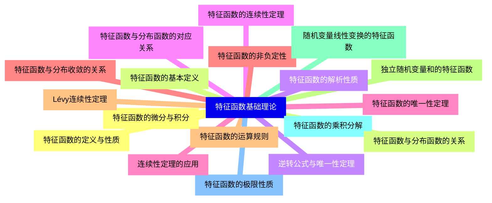
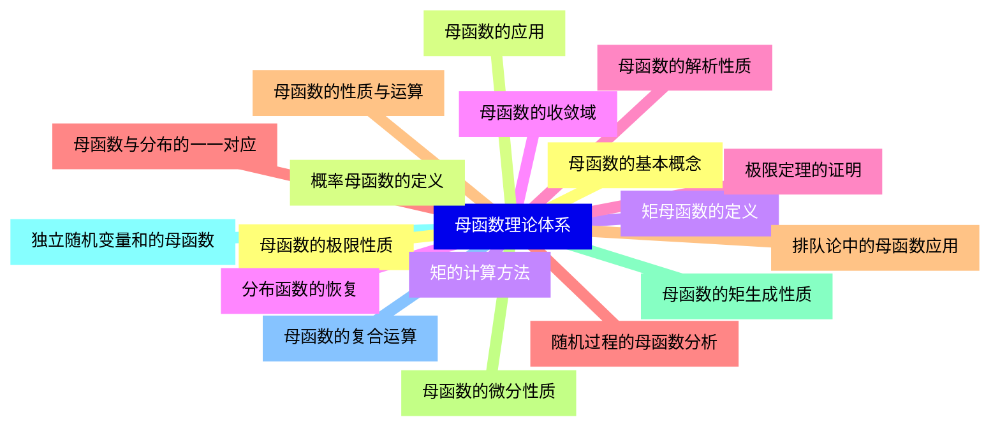
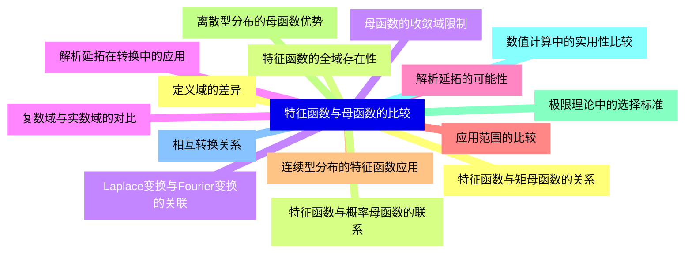
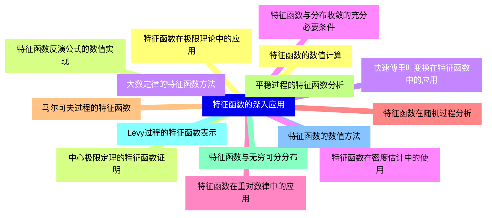
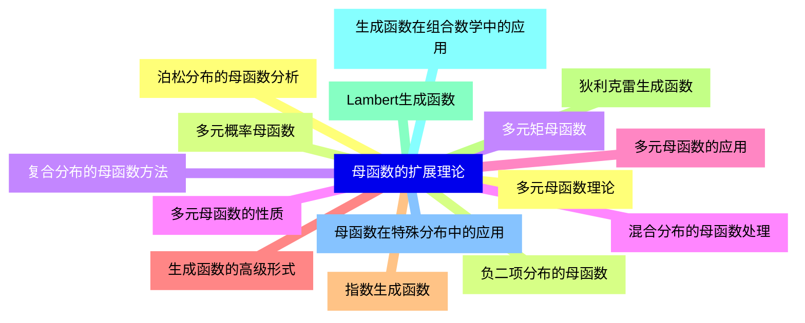
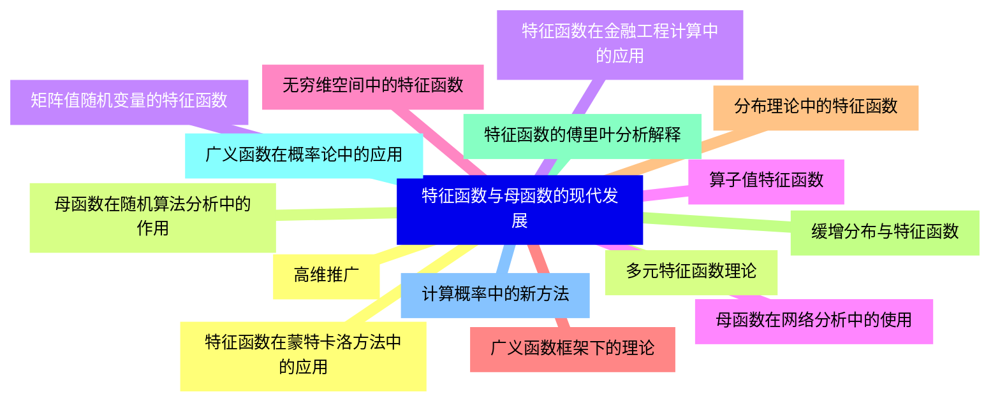
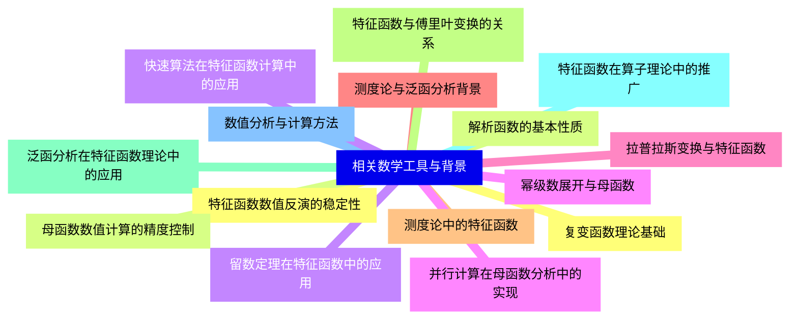


### 1 [特征函数基础理论](#1)
#### 1.1 [特征函数的定义与性质](#1)
#### 1.2 [特征函数的基本定义](#1)
#### 1.3 [特征函数的解析性质](#1)
#### 1.4 [特征函数的连续性定理](#1)
#### 1.5 [特征函数的唯一性定理](#1)
#### 1.6 [特征函数的非负定性](#1)
#### 1.7 [特征函数的运算规则](#1)
#### 1.8 [独立随机变量和的特征函数](#1)
#### 1.9 [随机变量线性变换的特征函数](#1)
#### 1.10 [特征函数的乘积分解](#1)
#### 1.11 [特征函数的极限性质](#1)
#### 1.12 [特征函数的微分与积分](#1)
#### 1.13 [特征函数与分布函数的关系](#1)
#### 1.14 [逆转公式与唯一性定理](#1)
#### 1.15 [特征函数与分布函数的对应关系](#1)
#### 1.16 [连续性定理的应用](#1)
#### 1.17 [特征函数与分布收敛的关系](#1)
#### 1.18 [Lévy连续性定理](#1)
### 2 [母函数理论体系](#2)
#### 2.1 [母函数的基本概念](#2)
#### 2.2 [概率母函数的定义](#2)
#### 2.3 [矩母函数的定义](#2)
#### 2.4 [母函数的收敛域](#2)
#### 2.5 [母函数的解析性质](#2)
#### 2.6 [母函数与分布的一一对应](#2)
#### 2.7 [母函数的性质与运算](#2)
#### 2.8 [母函数的微分性质](#2)
#### 2.9 [母函数的矩生成性质](#2)
#### 2.10 [独立随机变量和的母函数](#2)
#### 2.11 [母函数的复合运算](#2)
#### 2.12 [母函数的极限性质](#2)
#### 2.13 [母函数的应用](#2)
#### 2.14 [矩的计算方法](#2)
#### 2.15 [分布函数的恢复](#2)
#### 2.16 [极限定理的证明](#2)
#### 2.17 [随机过程的母函数分析](#2)
#### 2.18 [排队论中的母函数应用](#2)
### 3 [特征函数与母函数的比较](#3)
#### 3.1 [定义域的差异](#3)
#### 3.2 [特征函数的全域存在性](#3)
#### 3.3 [母函数的收敛域限制](#3)
#### 3.4 [复数域与实数域的对比](#3)
#### 3.5 [解析延拓的可能性](#3)
#### 3.6 [应用范围的比较](#3)
#### 3.7 [连续型分布的特征函数应用](#3)
#### 3.8 [离散型分布的母函数优势](#3)
#### 3.9 [极限理论中的选择标准](#3)
#### 3.10 [数值计算中的实用性比较](#3)
#### 3.11 [相互转换关系](#3)
#### 3.12 [特征函数与矩母函数的关系](#3)
#### 3.13 [特征函数与概率母函数的联系](#3)
#### 3.14 [Laplace变换与Fourier变换的关联](#3)
#### 3.15 [解析延拓在转换中的应用](#3)
### 4 [特征函数的深入应用](#4)
#### 4.1 [特征函数在极限理论中的应用](#4)
#### 4.2 [中心极限定理的特征函数证明](#4)
#### 4.3 [大数定律的特征函数方法](#4)
#### 4.4 [特征函数与分布收敛的充分必要条件](#4)
#### 4.5 [特征函数在重对数律中的应用](#4)
#### 4.6 [特征函数在随机过程分析](#4)
#### 4.7 [马尔可夫过程的特征函数](#4)
#### 4.8 [平稳过程的特征函数分析](#4)
#### 4.9 [特征函数与无穷可分分布](#4)
#### 4.10 [Lévy过程的特征函数表示](#4)
#### 4.11 [特征函数的数值方法](#4)
#### 4.12 [特征函数的数值计算](#4)
#### 4.13 [特征函数反演公式的数值实现](#4)
#### 4.14 [快速傅里叶变换在特征函数中的应用](#4)
#### 4.15 [特征函数在密度估计中的使用](#4)
### 5 [母函数的扩展理论](#5)
#### 5.1 [多元母函数理论](#5)
#### 5.2 [多元概率母函数](#5)
#### 5.3 [多元矩母函数](#5)
#### 5.4 [多元母函数的性质](#5)
#### 5.5 [多元母函数的应用](#5)
#### 5.6 [生成函数的高级形式](#5)
#### 5.7 [指数生成函数](#5)
#### 5.8 [狄利克雷生成函数](#5)
#### 5.9 [Lambert生成函数](#5)
#### 5.10 [生成函数在组合数学中的应用](#5)
#### 5.11 [母函数在特殊分布中的应用](#5)
#### 5.12 [泊松分布的母函数分析](#5)
#### 5.13 [负二项分布的母函数](#5)
#### 5.14 [复合分布的母函数方法](#5)
#### 5.15 [混合分布的母函数处理](#5)
### 6 [特征函数与母函数的现代发展](#6)
#### 6.1 [高维推广](#6)
#### 6.2 [多元特征函数理论](#6)
#### 6.3 [矩阵值随机变量的特征函数](#6)
#### 6.4 [算子值特征函数](#6)
#### 6.5 [无穷维空间中的特征函数](#6)
#### 6.6 [广义函数框架下的理论](#6)
#### 6.7 [分布理论中的特征函数](#6)
#### 6.8 [缓增分布与特征函数](#6)
#### 6.9 [特征函数的傅里叶分析解释](#6)
#### 6.10 [广义函数在概率论中的应用](#6)
#### 6.11 [计算概率中的新方法](#6)
#### 6.12 [特征函数在蒙特卡洛方法中的应用](#6)
#### 6.13 [母函数在随机算法分析中的作用](#6)
#### 6.14 [特征函数在金融工程计算中的应用](#6)
#### 6.15 [母函数在网络分析中的使用](#6)
### 7 [相关数学工具与背景](#7)
#### 7.1 [复变函数理论基础](#7)
#### 7.2 [解析函数的基本性质](#7)
#### 7.3 [留数定理在特征函数中的应用](#7)
#### 7.4 [幂级数展开与母函数](#7)
#### 7.5 [拉普拉斯变换与特征函数](#7)
#### 7.6 [测度论与泛函分析背景](#7)
#### 7.7 [测度论中的特征函数](#7)
#### 7.8 [特征函数与傅里叶变换的关系](#7)
#### 7.9 [泛函分析在特征函数理论中的应用](#7)
#### 7.10 [特征函数在算子理论中的推广](#7)
#### 7.11 [数值分析与计算方法](#7)
#### 7.12 [特征函数数值反演的稳定性](#7)
#### 7.13 [母函数数值计算的精度控制](#7)
#### 7.14 [快速算法在特征函数计算中的应用](#7)
#### 7.15 [并行计算在母函数分析中的实现](#7)




### 1 特征函数基础理论

---
### 1 特征函数基础理论
___
#### 1.1 特征函数的定义与性质
___
#### 1.2 特征函数的基本定义
___
#### 1.3 特征函数的解析性质
___
#### 1.4 特征函数的连续性定理
___
#### 1.5 特征函数的唯一性定理
___
#### 1.6 特征函数的非负定性
___
#### 1.7 特征函数的运算规则
___
#### 1.8 独立随机变量和的特征函数
___
#### 1.9 随机变量线性变换的特征函数
___
#### 1.10 特征函数的乘积分解
___
#### 1.11 特征函数的极限性质
___
#### 1.12 特征函数的微分与积分
___
#### 1.13 特征函数与分布函数的关系
___
#### 1.14 逆转公式与唯一性定理
___
#### 1.15 特征函数与分布函数的对应关系
___
#### 1.16 连续性定理的应用
___
#### 1.17 特征函数与分布收敛的关系
___
#### 1.18 Lévy连续性定理
### 2 母函数理论体系

---
### 2 母函数理论体系
___
#### 2.1 母函数的基本概念
___
#### 2.2 概率母函数的定义
___
#### 2.3 矩母函数的定义
___
#### 2.4 母函数的收敛域
___
#### 2.5 母函数的解析性质
___
#### 2.6 母函数与分布的一一对应
___
#### 2.7 母函数的性质与运算
___
#### 2.8 母函数的微分性质
___
#### 2.9 母函数的矩生成性质
___
#### 2.10 独立随机变量和的母函数
___
#### 2.11 母函数的复合运算
___
#### 2.12 母函数的极限性质
___
#### 2.13 母函数的应用
___
#### 2.14 矩的计算方法
___
#### 2.15 分布函数的恢复
___
#### 2.16 极限定理的证明
___
#### 2.17 随机过程的母函数分析
___
#### 2.18 排队论中的母函数应用
### 3 特征函数与母函数的比较

---
### 3 特征函数与母函数的比较
___
#### 3.1 定义域的差异
___
#### 3.2 特征函数的全域存在性
___
#### 3.3 母函数的收敛域限制
___
#### 3.4 复数域与实数域的对比
___
#### 3.5 解析延拓的可能性
___
#### 3.6 应用范围的比较
___
#### 3.7 连续型分布的特征函数应用
___
#### 3.8 离散型分布的母函数优势
___
#### 3.9 极限理论中的选择标准
___
#### 3.10 数值计算中的实用性比较
___
#### 3.11 相互转换关系
___
#### 3.12 特征函数与矩母函数的关系
___
#### 3.13 特征函数与概率母函数的联系
___
#### 3.14 Laplace变换与Fourier变换的关联
___
#### 3.15 解析延拓在转换中的应用
### 4 特征函数的深入应用

---
### 4 特征函数的深入应用
___
#### 4.1 特征函数在极限理论中的应用
___
#### 4.2 中心极限定理的特征函数证明
___
#### 4.3 大数定律的特征函数方法
___
#### 4.4 特征函数与分布收敛的充分必要条件
___
#### 4.5 特征函数在重对数律中的应用
___
#### 4.6 特征函数在随机过程分析
___
#### 4.7 马尔可夫过程的特征函数
___
#### 4.8 平稳过程的特征函数分析
___
#### 4.9 特征函数与无穷可分分布
___
#### 4.10 Lévy过程的特征函数表示
___
#### 4.11 特征函数的数值方法
___
#### 4.12 特征函数的数值计算
___
#### 4.13 特征函数反演公式的数值实现
___
#### 4.14 快速傅里叶变换在特征函数中的应用
___
#### 4.15 特征函数在密度估计中的使用
### 5 母函数的扩展理论

---
### 5 母函数的扩展理论
___
#### 5.1 多元母函数理论
___
#### 5.2 多元概率母函数
___
#### 5.3 多元矩母函数
___
#### 5.4 多元母函数的性质
___
#### 5.5 多元母函数的应用
___
#### 5.6 生成函数的高级形式
___
#### 5.7 指数生成函数
___
#### 5.8 狄利克雷生成函数
___
#### 5.9 Lambert生成函数
___
#### 5.10 生成函数在组合数学中的应用
___
#### 5.11 母函数在特殊分布中的应用
___
#### 5.12 泊松分布的母函数分析
___
#### 5.13 负二项分布的母函数
___
#### 5.14 复合分布的母函数方法
___
#### 5.15 混合分布的母函数处理
### 6 特征函数与母函数的现代发展

---
### 6 特征函数与母函数的现代发展
___
#### 6.1 高维推广
___
#### 6.2 多元特征函数理论
___
#### 6.3 矩阵值随机变量的特征函数
___
#### 6.4 算子值特征函数
___
#### 6.5 无穷维空间中的特征函数
___
#### 6.6 广义函数框架下的理论
___
#### 6.7 分布理论中的特征函数
___
#### 6.8 缓增分布与特征函数
___
#### 6.9 特征函数的傅里叶分析解释
___
#### 6.10 广义函数在概率论中的应用
___
#### 6.11 计算概率中的新方法
___
#### 6.12 特征函数在蒙特卡洛方法中的应用
___
#### 6.13 母函数在随机算法分析中的作用
___
#### 6.14 特征函数在金融工程计算中的应用
___
#### 6.15 母函数在网络分析中的使用
### 7 相关数学工具与背景

---
### 7 相关数学工具与背景
___
#### 7.1 复变函数理论基础
___
#### 7.2 解析函数的基本性质
___
#### 7.3 留数定理在特征函数中的应用
___
#### 7.4 幂级数展开与母函数
___
#### 7.5 拉普拉斯变换与特征函数
___
#### 7.6 测度论与泛函分析背景
___
#### 7.7 测度论中的特征函数
___
#### 7.8 特征函数与傅里叶变换的关系
___
#### 7.9 泛函分析在特征函数理论中的应用
___
#### 7.10 特征函数在算子理论中的推广
___
#### 7.11 数值分析与计算方法
___
#### 7.12 特征函数数值反演的稳定性
___
#### 7.13 母函数数值计算的精度控制
___
#### 7.14 快速算法在特征函数计算中的应用
___
#### 7.15 并行计算在母函数分析中的实现


### 1 特征函数基础理论{#1}

{}

<--->
{}
{}
{}
{}
{}
{}
{}
{}
{}
{}
{}
{}
{}
{}
{}
{}
{}
{}
{}
{}
{}
{}
{}
{}
{}
{}
{}
{}
{}
{}
{}
{}
{}
{}
{}
{}
{}

### 2 母函数理论体系{#2}

{}
{}
{}
{}
{}
{}
{}
{}
{}
{}
{}
{}
{}
{}
{}
{}
{}
{}
{}
{}
{}
{}
{}
{}
{}
{}
{}
{}
{}
{}
{}
{}
{}
{}
{}
{}
{}
<--->

{}

### 3 特征函数与母函数的比较{#3}

{}

<--->
{}
{}
{}
{}
{}
{}
{}
{}
{}
{}
{}
{}
{}
{}
{}
{}
{}
{}
{}
{}
{}
{}
{}
{}
{}
{}
{}
{}
{}
{}
{}

### 4 特征函数的深入应用{#4}

{}
{}
{}
{}
{}
{}
{}
{}
{}
{}
{}
{}
{}
{}
{}
{}
{}
{}
{}
{}
{}
{}
{}
{}
{}
{}
{}
{}
{}
{}
{}
<--->

{}

### 5 母函数的扩展理论{#5}

{}

<--->
{}
{}
{}
{}
{}
{}
{}
{}
{}
{}
{}
{}
{}
{}
{}
{}
{}
{}
{}
{}
{}
{}
{}
{}
{}
{}
{}
{}
{}
{}
{}

### 6 特征函数与母函数的现代发展{#6}

{}
{}
{}
{}
{}
{}
{}
{}
{}
{}
{}
{}
{}
{}
{}
{}
{}
{}
{}
{}
{}
{}
{}
{}
{}
{}
{}
{}
{}
{}
{}
<--->

{}

### 7 相关数学工具与背景{#7}

{}

<--->
{}
{}
{}
{}
{}
{}
{}
{}
{}
{}
{}
{}
{}
{}
{}
{}
{}
{}
{}
{}
{}
{}
{}
{}
{}
{}
{}
{}
{}
{}
{}
