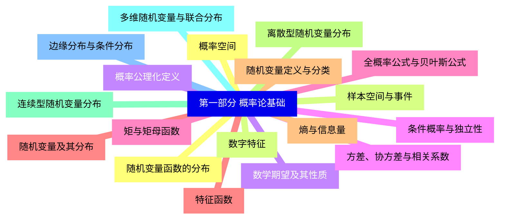
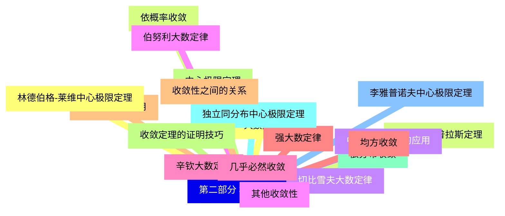
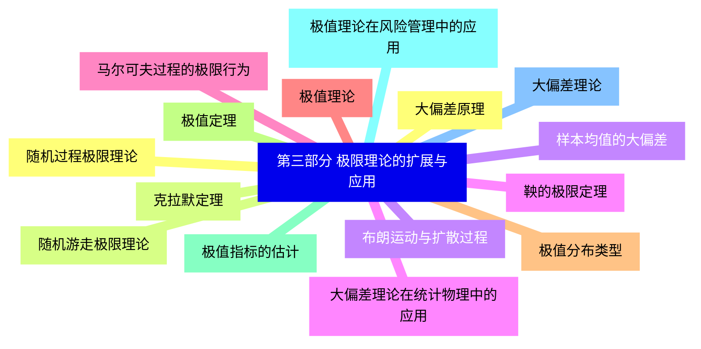
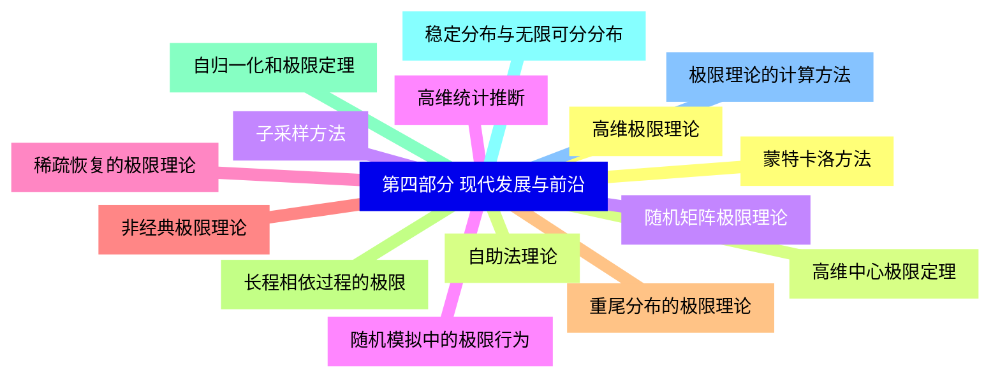


### 1 [第一部分 概率论基础](#1)
#### 1.1 [概率空间](#1)
#### 1.2 [样本空间与事件](#1)
#### 1.3 [概率公理化定义](#1)
#### 1.4 [条件概率与独立性](#1)
#### 1.5 [全概率公式与贝叶斯公式](#1)
#### 1.6 [随机变量及其分布](#1)
#### 1.7 [随机变量定义与分类](#1)
#### 1.8 [离散型随机变量分布](#1)
#### 1.9 [连续型随机变量分布](#1)
#### 1.10 [多维随机变量与联合分布](#1)
#### 1.11 [边缘分布与条件分布](#1)
#### 1.12 [随机变量函数的分布](#1)
#### 1.13 [数字特征](#1)
#### 1.14 [数学期望及其性质](#1)
#### 1.15 [方差、协方差与相关系数](#1)
#### 1.16 [矩与矩母函数](#1)
#### 1.17 [特征函数](#1)
#### 1.18 [熵与信息量](#1)
### 2 [第二部分 极限理论基础](#2)
#### 2.1 [大数定律](#2)
#### 2.2 [依概率收敛](#2)
#### 2.3 [切比雪夫大数定律](#2)
#### 2.4 [伯努利大数定律](#2)
#### 2.5 [辛钦大数定律](#2)
#### 2.6 [强大数定律](#2)
#### 2.7 [大数定律的应用](#2)
#### 2.8 [中心极限定理](#2)
#### 2.9 [依分布收敛](#2)
#### 2.10 [独立同分布中心极限定理](#2)
#### 2.11 [李雅普诺夫中心极限定理](#2)
#### 2.12 [林德伯格-莱维中心极限定理](#2)
#### 2.13 [德莫弗-拉普拉斯定理](#2)
#### 2.14 [中心极限定理的应用](#2)
#### 2.15 [其他收敛性](#2)
#### 2.16 [几乎必然收敛](#2)
#### 2.17 [均方收敛](#2)
#### 2.18 [收敛性之间的关系](#2)
#### 2.19 [收敛定理的证明技巧](#2)
### 3 [第三部分 极限理论的扩展与应用](#3)
#### 3.1 [随机过程极限理论](#3)
#### 3.2 [随机游走极限理论](#3)
#### 3.3 [布朗运动与扩散过程](#3)
#### 3.4 [鞅的极限定理](#3)
#### 3.5 [马尔可夫过程的极限行为](#3)
#### 3.6 [极值理论](#3)
#### 3.7 [极值分布类型](#3)
#### 3.8 [极值定理](#3)
#### 3.9 [极值指标的估计](#3)
#### 3.10 [极值理论在风险管理中的应用](#3)
#### 3.11 [大偏差理论](#3)
#### 3.12 [大偏差原理](#3)
#### 3.13 [克拉默定理](#3)
#### 3.14 [样本均值的大偏差](#3)
#### 3.15 [大偏差理论在统计物理中的应用](#3)
### 4 [第四部分 现代发展与前沿](#4)
#### 4.1 [高维极限理论](#4)
#### 4.2 [高维中心极限定理](#4)
#### 4.3 [随机矩阵极限理论](#4)
#### 4.4 [高维统计推断](#4)
#### 4.5 [稀疏恢复的极限理论](#4)
#### 4.6 [非经典极限理论](#4)
#### 4.7 [重尾分布的极限理论](#4)
#### 4.8 [长程相依过程的极限](#4)
#### 4.9 [自归一化和极限定理](#4)
#### 4.10 [稳定分布与无限可分分布](#4)
#### 4.11 [极限理论的计算方法](#4)
#### 4.12 [蒙特卡洛方法](#4)
#### 4.13 [自助法理论](#4)
#### 4.14 [子采样方法](#4)
#### 4.15 [随机模拟中的极限行为](#4)




### 1 第一部分 概率论基础

---
### 1 第一部分 概率论基础
___
#### 1.1 概率空间
___
#### 1.2 样本空间与事件
___
#### 1.3 概率公理化定义
___
#### 1.4 条件概率与独立性
___
#### 1.5 全概率公式与贝叶斯公式
___
#### 1.6 随机变量及其分布
___
#### 1.7 随机变量定义与分类
___
#### 1.8 离散型随机变量分布
___
#### 1.9 连续型随机变量分布
___
#### 1.10 多维随机变量与联合分布
___
#### 1.11 边缘分布与条件分布
___
#### 1.12 随机变量函数的分布
___
#### 1.13 数字特征
___
#### 1.14 数学期望及其性质
___
#### 1.15 方差、协方差与相关系数
___
#### 1.16 矩与矩母函数
___
#### 1.17 特征函数
___
#### 1.18 熵与信息量
### 2 第二部分 极限理论基础

---
### 2 第二部分 极限理论基础
___
#### 2.1 大数定律
___
#### 2.2 依概率收敛
___
#### 2.3 切比雪夫大数定律
___
#### 2.4 伯努利大数定律
___
#### 2.5 辛钦大数定律
___
#### 2.6 强大数定律
___
#### 2.7 大数定律的应用
___
#### 2.8 中心极限定理
___
#### 2.9 依分布收敛
___
#### 2.10 独立同分布中心极限定理
___
#### 2.11 李雅普诺夫中心极限定理
___
#### 2.12 林德伯格-莱维中心极限定理
___
#### 2.13 德莫弗-拉普拉斯定理
___
#### 2.14 中心极限定理的应用
___
#### 2.15 其他收敛性
___
#### 2.16 几乎必然收敛
___
#### 2.17 均方收敛
___
#### 2.18 收敛性之间的关系
___
#### 2.19 收敛定理的证明技巧
### 3 第三部分 极限理论的扩展与应用

---
### 3 第三部分 极限理论的扩展与应用
___
#### 3.1 随机过程极限理论
___
#### 3.2 随机游走极限理论
___
#### 3.3 布朗运动与扩散过程
___
#### 3.4 鞅的极限定理
___
#### 3.5 马尔可夫过程的极限行为
___
#### 3.6 极值理论
___
#### 3.7 极值分布类型
___
#### 3.8 极值定理
___
#### 3.9 极值指标的估计
___
#### 3.10 极值理论在风险管理中的应用
___
#### 3.11 大偏差理论
___
#### 3.12 大偏差原理
___
#### 3.13 克拉默定理
___
#### 3.14 样本均值的大偏差
___
#### 3.15 大偏差理论在统计物理中的应用
### 4 第四部分 现代发展与前沿

---
### 4 第四部分 现代发展与前沿
___
#### 4.1 高维极限理论
___
#### 4.2 高维中心极限定理
___
#### 4.3 随机矩阵极限理论
___
#### 4.4 高维统计推断
___
#### 4.5 稀疏恢复的极限理论
___
#### 4.6 非经典极限理论
___
#### 4.7 重尾分布的极限理论
___
#### 4.8 长程相依过程的极限
___
#### 4.9 自归一化和极限定理
___
#### 4.10 稳定分布与无限可分分布
___
#### 4.11 极限理论的计算方法
___
#### 4.12 蒙特卡洛方法
___
#### 4.13 自助法理论
___
#### 4.14 子采样方法
___
#### 4.15 随机模拟中的极限行为


### 1 第一部分 概率论基础{#1}

{}

<--->
{}
{}
{}
{}
{}
{}
{}
{}
{}
{}
{}
{}
{}
{}
{}
{}
{}
{}
{}
{}
{}
{}
{}
{}
{}
{}
{}
{}
{}
{}
{}
{}
{}
{}
{}
{}
{}

### 2 第二部分 极限理论基础{#2}

{}
{}
{}
{}
{}
{}
{}
{}
{}
{}
{}
{}
{}
{}
{}
{}
{}
{}
{}
{}
{}
{}
{}
{}
{}
{}
{}
{}
{}
{}
{}
{}
{}
{}
{}
{}
{}
{}
{}
<--->

{}

### 3 第三部分 极限理论的扩展与应用{#3}

{}

<--->
{}
{}
{}
{}
{}
{}
{}
{}
{}
{}
{}
{}
{}
{}
{}
{}
{}
{}
{}
{}
{}
{}
{}
{}
{}
{}
{}
{}
{}
{}
{}

### 4 第四部分 现代发展与前沿{#4}

{}
{}
{}
{}
{}
{}
{}
{}
{}
{}
{}
{}
{}
{}
{}
{}
{}
{}
{}
{}
{}
{}
{}
{}
{}
{}
{}
{}
{}
{}
{}
<--->

{}
