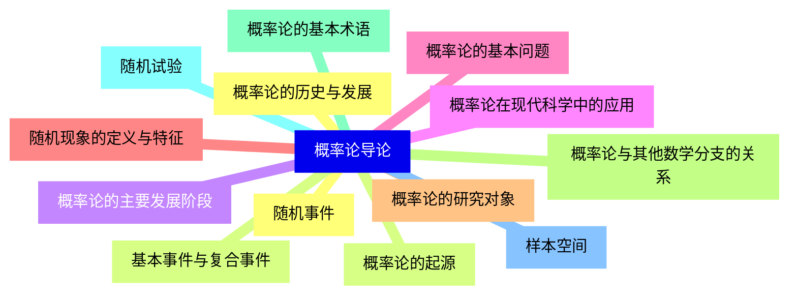
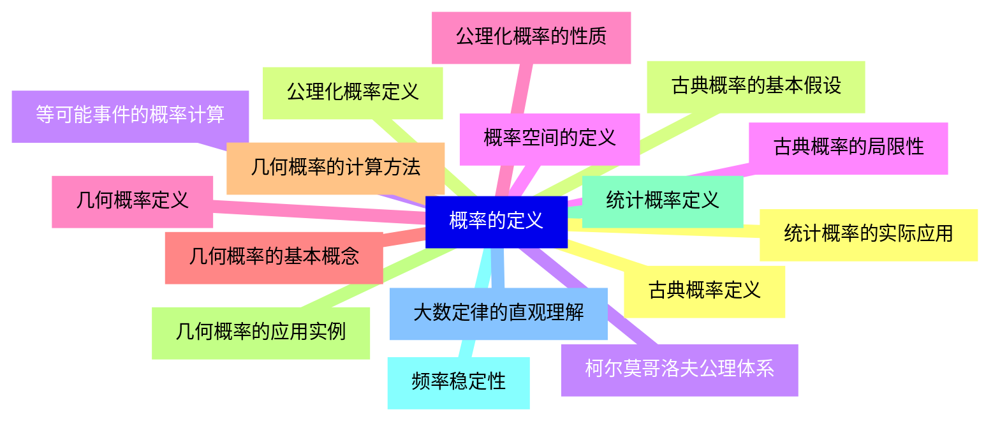
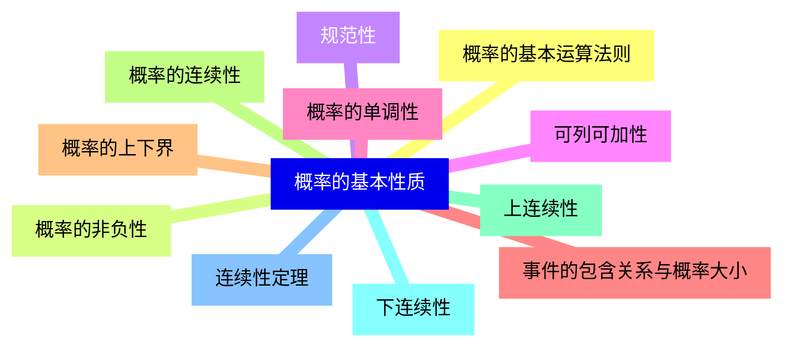
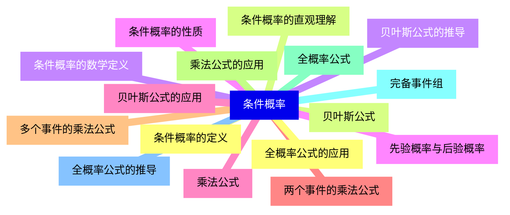
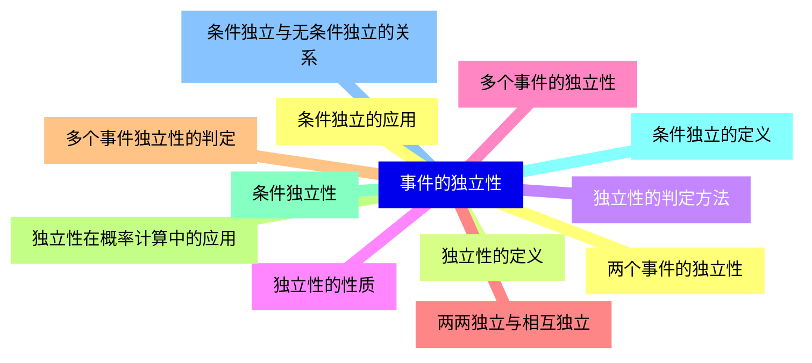
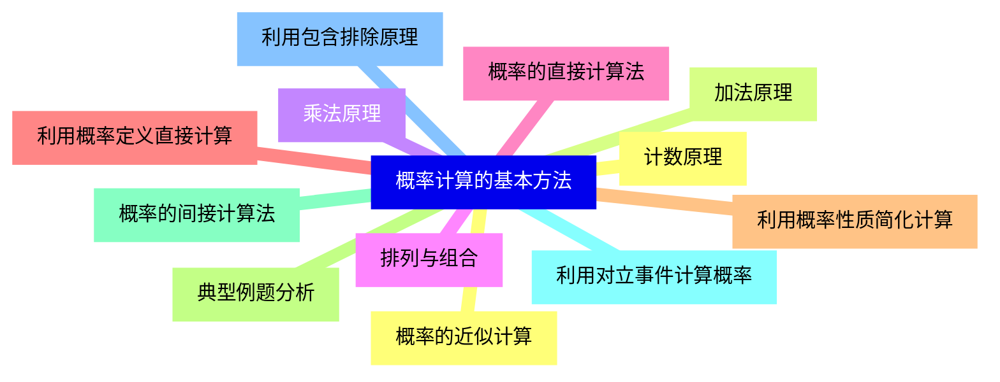
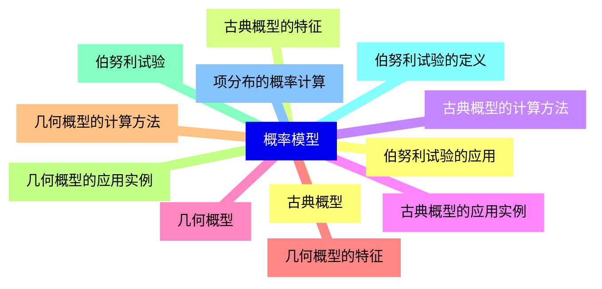
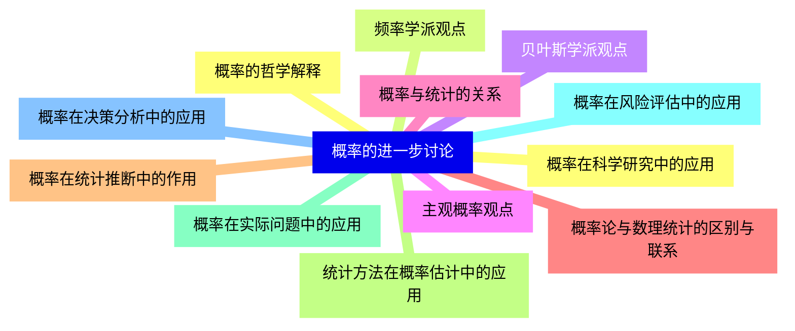


### 1 [概率论导论](#1)
#### 1.1 [概率论的历史与发展](#1)
#### 1.2 [概率论的起源](#1)
#### 1.3 [概率论的主要发展阶段](#1)
#### 1.4 [概率论在现代科学中的应用](#1)
#### 1.5 [概率论的基本问题](#1)
#### 1.6 [随机现象的定义与特征](#1)
#### 1.7 [概率论的研究对象](#1)
#### 1.8 [概率论与其他数学分支的关系](#1)
#### 1.9 [概率论的基本术语](#1)
#### 1.10 [随机试验](#1)
#### 1.11 [样本空间](#1)
#### 1.12 [随机事件](#1)
#### 1.13 [基本事件与复合事件](#1)
### 2 [概率的定义](#2)
#### 2.1 [古典概率定义](#2)
#### 2.2 [古典概率的基本假设](#2)
#### 2.3 [等可能事件的概率计算](#2)
#### 2.4 [古典概率的局限性](#2)
#### 2.5 [几何概率定义](#2)
#### 2.6 [几何概率的基本概念](#2)
#### 2.7 [几何概率的计算方法](#2)
#### 2.8 [几何概率的应用实例](#2)
#### 2.9 [统计概率定义](#2)
#### 2.10 [频率稳定性](#2)
#### 2.11 [大数定律的直观理解](#2)
#### 2.12 [统计概率的实际应用](#2)
#### 2.13 [公理化概率定义](#2)
#### 2.14 [柯尔莫哥洛夫公理体系](#2)
#### 2.15 [概率空间的定义](#2)
#### 2.16 [公理化概率的性质](#2)
### 3 [概率的基本性质](#3)
#### 3.1 [概率的基本运算法则](#3)
#### 3.2 [概率的非负性](#3)
#### 3.3 [规范性](#3)
#### 3.4 [可列可加性](#3)
#### 3.5 [概率的单调性](#3)
#### 3.6 [事件的包含关系与概率大小](#3)
#### 3.7 [概率的上下界](#3)
#### 3.8 [概率的连续性](#3)
#### 3.9 [上连续性](#3)
#### 3.10 [下连续性](#3)
#### 3.11 [连续性定理](#3)
### 4 [条件概率](#4)
#### 4.1 [条件概率的定义](#4)
#### 4.2 [条件概率的直观理解](#4)
#### 4.3 [条件概率的数学定义](#4)
#### 4.4 [条件概率的性质](#4)
#### 4.5 [乘法公式](#4)
#### 4.6 [两个事件的乘法公式](#4)
#### 4.7 [多个事件的乘法公式](#4)
#### 4.8 [乘法公式的应用](#4)
#### 4.9 [全概率公式](#4)
#### 4.10 [完备事件组](#4)
#### 4.11 [全概率公式的推导](#4)
#### 4.12 [全概率公式的应用](#4)
#### 4.13 [贝叶斯公式](#4)
#### 4.14 [贝叶斯公式的推导](#4)
#### 4.15 [先验概率与后验概率](#4)
#### 4.16 [贝叶斯公式的应用](#4)
### 5 [事件的独立性](#5)
#### 5.1 [两个事件的独立性](#5)
#### 5.2 [独立性的定义](#5)
#### 5.3 [独立性的判定方法](#5)
#### 5.4 [独立性的性质](#5)
#### 5.5 [多个事件的独立性](#5)
#### 5.6 [两两独立与相互独立](#5)
#### 5.7 [多个事件独立性的判定](#5)
#### 5.8 [独立性在概率计算中的应用](#5)
#### 5.9 [条件独立性](#5)
#### 5.10 [条件独立的定义](#5)
#### 5.11 [条件独立与无条件独立的关系](#5)
#### 5.12 [条件独立的应用](#5)
### 6 [概率计算的基本方法](#6)
#### 6.1 [计数原理](#6)
#### 6.2 [加法原理](#6)
#### 6.3 [乘法原理](#6)
#### 6.4 [排列与组合](#6)
#### 6.5 [概率的直接计算法](#6)
#### 6.6 [利用概率定义直接计算](#6)
#### 6.7 [利用概率性质简化计算](#6)
#### 6.8 [典型例题分析](#6)
#### 6.9 [概率的间接计算法](#6)
#### 6.10 [利用对立事件计算概率](#6)
#### 6.11 [利用包含排除原理](#6)
#### 6.12 [概率的近似计算](#6)
### 7 [概率模型](#7)
#### 7.1 [古典概型](#7)
#### 7.2 [古典概型的特征](#7)
#### 7.3 [古典概型的计算方法](#7)
#### 7.4 [古典概型的应用实例](#7)
#### 7.5 [几何概型](#7)
#### 7.6 [几何概型的特征](#7)
#### 7.7 [几何概型的计算方法](#7)
#### 7.8 [几何概型的应用实例](#7)
#### 7.9 [伯努利试验](#7)
#### 7.10 [伯努利试验的定义](#7)
#### 7.11 [项分布的概率计算](#7)
#### 7.12 [伯努利试验的应用](#7)
### 8 [概率的进一步讨论](#8)
#### 8.1 [概率的哲学解释](#8)
#### 8.2 [频率学派观点](#8)
#### 8.3 [贝叶斯学派观点](#8)
#### 8.4 [主观概率观点](#8)
#### 8.5 [概率与统计的关系](#8)
#### 8.6 [概率论与数理统计的区别与联系](#8)
#### 8.7 [概率在统计推断中的作用](#8)
#### 8.8 [统计方法在概率估计中的应用](#8)
#### 8.9 [概率在实际问题中的应用](#8)
#### 8.10 [概率在风险评估中的应用](#8)
#### 8.11 [概率在决策分析中的应用](#8)
#### 8.12 [概率在科学研究中的应用](#8)




### 1 概率论导论

---
### 1 概率论导论
___
#### 1.1 概率论的历史与发展
___
#### 1.2 概率论的起源
___
#### 1.3 概率论的主要发展阶段
___
#### 1.4 概率论在现代科学中的应用
___
#### 1.5 概率论的基本问题
___
#### 1.6 随机现象的定义与特征
___
#### 1.7 概率论的研究对象
___
#### 1.8 概率论与其他数学分支的关系
___
#### 1.9 概率论的基本术语
___
#### 1.10 随机试验
___
#### 1.11 样本空间
___
#### 1.12 随机事件
___
#### 1.13 基本事件与复合事件
### 2 概率的定义

---
### 2 概率的定义
___
#### 2.1 古典概率定义
___
#### 2.2 古典概率的基本假设
___
#### 2.3 等可能事件的概率计算
___
#### 2.4 古典概率的局限性
___
#### 2.5 几何概率定义
___
#### 2.6 几何概率的基本概念
___
#### 2.7 几何概率的计算方法
___
#### 2.8 几何概率的应用实例
___
#### 2.9 统计概率定义
___
#### 2.10 频率稳定性
___
#### 2.11 大数定律的直观理解
___
#### 2.12 统计概率的实际应用
___
#### 2.13 公理化概率定义
___
#### 2.14 柯尔莫哥洛夫公理体系
___
#### 2.15 概率空间的定义
___
#### 2.16 公理化概率的性质
### 3 概率的基本性质

---
### 3 概率的基本性质
___
#### 3.1 概率的基本运算法则
___
#### 3.2 概率的非负性
___
#### 3.3 规范性
___
#### 3.4 可列可加性
___
#### 3.5 概率的单调性
___
#### 3.6 事件的包含关系与概率大小
___
#### 3.7 概率的上下界
___
#### 3.8 概率的连续性
___
#### 3.9 上连续性
___
#### 3.10 下连续性
___
#### 3.11 连续性定理
### 4 条件概率

---
### 4 条件概率
___
#### 4.1 条件概率的定义
___
#### 4.2 条件概率的直观理解
___
#### 4.3 条件概率的数学定义
___
#### 4.4 条件概率的性质
___
#### 4.5 乘法公式
___
#### 4.6 两个事件的乘法公式
___
#### 4.7 多个事件的乘法公式
___
#### 4.8 乘法公式的应用
___
#### 4.9 全概率公式
___
#### 4.10 完备事件组
___
#### 4.11 全概率公式的推导
___
#### 4.12 全概率公式的应用
___
#### 4.13 贝叶斯公式
___
#### 4.14 贝叶斯公式的推导
___
#### 4.15 先验概率与后验概率
___
#### 4.16 贝叶斯公式的应用
### 5 事件的独立性

---
### 5 事件的独立性
___
#### 5.1 两个事件的独立性
___
#### 5.2 独立性的定义
___
#### 5.3 独立性的判定方法
___
#### 5.4 独立性的性质
___
#### 5.5 多个事件的独立性
___
#### 5.6 两两独立与相互独立
___
#### 5.7 多个事件独立性的判定
___
#### 5.8 独立性在概率计算中的应用
___
#### 5.9 条件独立性
___
#### 5.10 条件独立的定义
___
#### 5.11 条件独立与无条件独立的关系
___
#### 5.12 条件独立的应用
### 6 概率计算的基本方法

---
### 6 概率计算的基本方法
___
#### 6.1 计数原理
___
#### 6.2 加法原理
___
#### 6.3 乘法原理
___
#### 6.4 排列与组合
___
#### 6.5 概率的直接计算法
___
#### 6.6 利用概率定义直接计算
___
#### 6.7 利用概率性质简化计算
___
#### 6.8 典型例题分析
___
#### 6.9 概率的间接计算法
___
#### 6.10 利用对立事件计算概率
___
#### 6.11 利用包含排除原理
___
#### 6.12 概率的近似计算
### 7 概率模型

---
### 7 概率模型
___
#### 7.1 古典概型
___
#### 7.2 古典概型的特征
___
#### 7.3 古典概型的计算方法
___
#### 7.4 古典概型的应用实例
___
#### 7.5 几何概型
___
#### 7.6 几何概型的特征
___
#### 7.7 几何概型的计算方法
___
#### 7.8 几何概型的应用实例
___
#### 7.9 伯努利试验
___
#### 7.10 伯努利试验的定义
___
#### 7.11 项分布的概率计算
___
#### 7.12 伯努利试验的应用
### 8 概率的进一步讨论

---
### 8 概率的进一步讨论
___
#### 8.1 概率的哲学解释
___
#### 8.2 频率学派观点
___
#### 8.3 贝叶斯学派观点
___
#### 8.4 主观概率观点
___
#### 8.5 概率与统计的关系
___
#### 8.6 概率论与数理统计的区别与联系
___
#### 8.7 概率在统计推断中的作用
___
#### 8.8 统计方法在概率估计中的应用
___
#### 8.9 概率在实际问题中的应用
___
#### 8.10 概率在风险评估中的应用
___
#### 8.11 概率在决策分析中的应用
___
#### 8.12 概率在科学研究中的应用


### 1 概率论导论{#1}

{}

<--->
{}
{}
{}
{}
{}
{}
{}
{}
{}
{}
{}
{}
{}
{}
{}
{}
{}
{}
{}
{}
{}
{}
{}
{}
{}
{}
{}

### 2 概率的定义{#2}

{}
{}
{}
{}
{}
{}
{}
{}
{}
{}
{}
{}
{}
{}
{}
{}
{}
{}
{}
{}
{}
{}
{}
{}
{}
{}
{}
{}
{}
{}
{}
{}
{}
<--->

{}

### 3 概率的基本性质{#3}

{}

<--->
{}
{}
{}
{}
{}
{}
{}
{}
{}
{}
{}
{}
{}
{}
{}
{}
{}
{}
{}
{}
{}
{}
{}

### 4 条件概率{#4}

{}
{}
{}
{}
{}
{}
{}
{}
{}
{}
{}
{}
{}
{}
{}
{}
{}
{}
{}
{}
{}
{}
{}
{}
{}
{}
{}
{}
{}
{}
{}
{}
{}
<--->

{}

### 5 事件的独立性{#5}

{}

<--->
{}
{}
{}
{}
{}
{}
{}
{}
{}
{}
{}
{}
{}
{}
{}
{}
{}
{}
{}
{}
{}
{}
{}
{}
{}

### 6 概率计算的基本方法{#6}

{}
{}
{}
{}
{}
{}
{}
{}
{}
{}
{}
{}
{}
{}
{}
{}
{}
{}
{}
{}
{}
{}
{}
{}
{}
<--->

{}

### 7 概率模型{#7}

{}

<--->
{}
{}
{}
{}
{}
{}
{}
{}
{}
{}
{}
{}
{}
{}
{}
{}
{}
{}
{}
{}
{}
{}
{}
{}
{}

### 8 概率的进一步讨论{#8}

{}
{}
{}
{}
{}
{}
{}
{}
{}
{}
{}
{}
{}
{}
{}
{}
{}
{}
{}
{}
{}
{}
{}
{}
{}
<--->

{}
