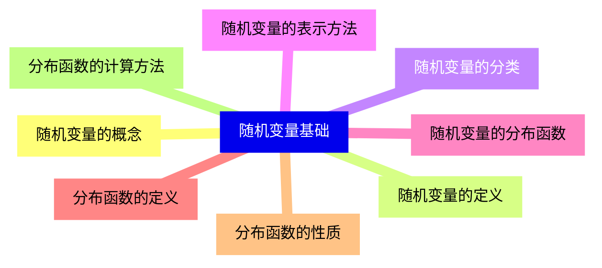
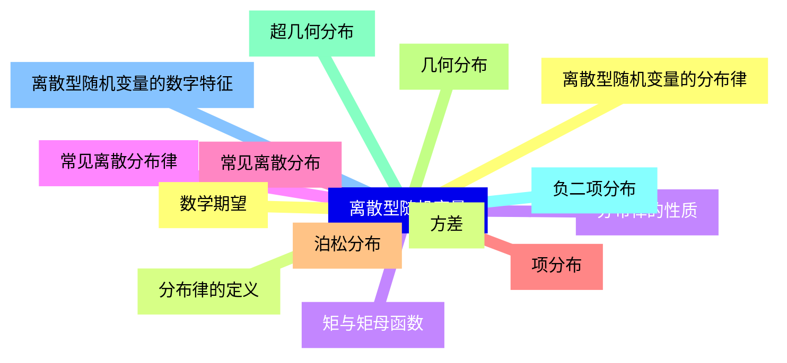
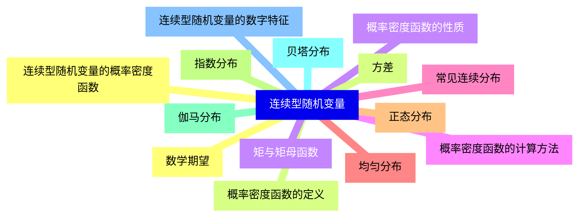
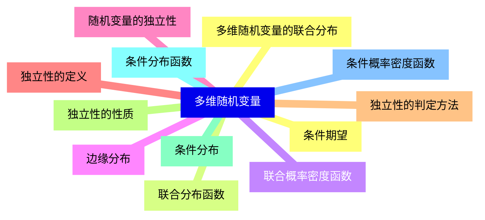
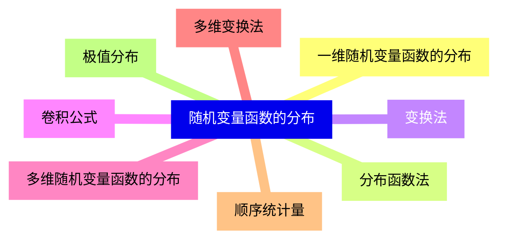
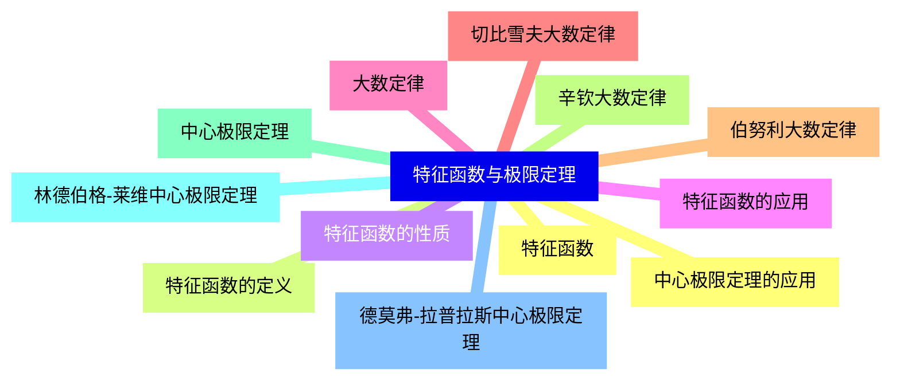


### 1 [随机变量基础](#1)
#### 1.1 [随机变量的概念](#1)
#### 1.2 [随机变量的定义](#1)
#### 1.3 [随机变量的分类](#1)
#### 1.4 [随机变量的表示方法](#1)
#### 1.5 [随机变量的分布函数](#1)
#### 1.6 [分布函数的定义](#1)
#### 1.7 [分布函数的性质](#1)
#### 1.8 [分布函数的计算方法](#1)
### 2 [离散型随机变量](#2)
#### 2.1 [离散型随机变量的分布律](#2)
#### 2.2 [分布律的定义](#2)
#### 2.3 [分布律的性质](#2)
#### 2.4 [常见离散分布律](#2)
#### 2.5 [常见离散分布](#2)
#### 2.6 [项分布](#2)
#### 2.7 [泊松分布](#2)
#### 2.8 [几何分布](#2)
#### 2.9 [超几何分布](#2)
#### 2.10 [负二项分布](#2)
#### 2.11 [离散型随机变量的数字特征](#2)
#### 2.12 [数学期望](#2)
#### 2.13 [方差](#2)
#### 2.14 [矩与矩母函数](#2)
### 3 [连续型随机变量](#3)
#### 3.1 [连续型随机变量的概率密度函数](#3)
#### 3.2 [概率密度函数的定义](#3)
#### 3.3 [概率密度函数的性质](#3)
#### 3.4 [概率密度函数的计算方法](#3)
#### 3.5 [常见连续分布](#3)
#### 3.6 [均匀分布](#3)
#### 3.7 [正态分布](#3)
#### 3.8 [指数分布](#3)
#### 3.9 [伽马分布](#3)
#### 3.10 [贝塔分布](#3)
#### 3.11 [连续型随机变量的数字特征](#3)
#### 3.12 [数学期望](#3)
#### 3.13 [方差](#3)
#### 3.14 [矩与矩母函数](#3)
### 4 [多维随机变量](#4)
#### 4.1 [多维随机变量的联合分布](#4)
#### 4.2 [联合分布函数](#4)
#### 4.3 [联合概率密度函数](#4)
#### 4.4 [边缘分布](#4)
#### 4.5 [随机变量的独立性](#4)
#### 4.6 [独立性的定义](#4)
#### 4.7 [独立性的判定方法](#4)
#### 4.8 [独立性的性质](#4)
#### 4.9 [条件分布](#4)
#### 4.10 [条件分布函数](#4)
#### 4.11 [条件概率密度函数](#4)
#### 4.12 [条件期望](#4)
### 5 [随机变量函数的分布](#5)
#### 5.1 [一维随机变量函数的分布](#5)
#### 5.2 [分布函数法](#5)
#### 5.3 [变换法](#5)
#### 5.4 [卷积公式](#5)
#### 5.5 [多维随机变量函数的分布](#5)
#### 5.6 [多维变换法](#5)
#### 5.7 [顺序统计量](#5)
#### 5.8 [极值分布](#5)
### 6 [特征函数与极限定理](#6)
#### 6.1 [特征函数](#6)
#### 6.2 [特征函数的定义](#6)
#### 6.3 [特征函数的性质](#6)
#### 6.4 [特征函数的应用](#6)
#### 6.5 [大数定律](#6)
#### 6.6 [切比雪夫大数定律](#6)
#### 6.7 [伯努利大数定律](#6)
#### 6.8 [辛钦大数定律](#6)
#### 6.9 [中心极限定理](#6)
#### 6.10 [林德伯格-莱维中心极限定理](#6)
#### 6.11 [德莫弗-拉普拉斯中心极限定理](#6)
#### 6.12 [中心极限定理的应用](#6)




### 1 随机变量基础

---
### 1 随机变量基础
___
#### 1.1 随机变量的概念
___
#### 1.2 随机变量的定义
___
#### 1.3 随机变量的分类
___
#### 1.4 随机变量的表示方法
___
#### 1.5 随机变量的分布函数
___
#### 1.6 分布函数的定义
___
#### 1.7 分布函数的性质
___
#### 1.8 分布函数的计算方法
### 2 离散型随机变量

---
### 2 离散型随机变量
___
#### 2.1 离散型随机变量的分布律
___
#### 2.2 分布律的定义
___
#### 2.3 分布律的性质
___
#### 2.4 常见离散分布律
___
#### 2.5 常见离散分布
___
#### 2.6 项分布
___
#### 2.7 泊松分布
___
#### 2.8 几何分布
___
#### 2.9 超几何分布
___
#### 2.10 负二项分布
___
#### 2.11 离散型随机变量的数字特征
___
#### 2.12 数学期望
___
#### 2.13 方差
___
#### 2.14 矩与矩母函数
### 3 连续型随机变量

---
### 3 连续型随机变量
___
#### 3.1 连续型随机变量的概率密度函数
___
#### 3.2 概率密度函数的定义
___
#### 3.3 概率密度函数的性质
___
#### 3.4 概率密度函数的计算方法
___
#### 3.5 常见连续分布
___
#### 3.6 均匀分布
___
#### 3.7 正态分布
___
#### 3.8 指数分布
___
#### 3.9 伽马分布
___
#### 3.10 贝塔分布
___
#### 3.11 连续型随机变量的数字特征
___
#### 3.12 数学期望
___
#### 3.13 方差
___
#### 3.14 矩与矩母函数
### 4 多维随机变量

---
### 4 多维随机变量
___
#### 4.1 多维随机变量的联合分布
___
#### 4.2 联合分布函数
___
#### 4.3 联合概率密度函数
___
#### 4.4 边缘分布
___
#### 4.5 随机变量的独立性
___
#### 4.6 独立性的定义
___
#### 4.7 独立性的判定方法
___
#### 4.8 独立性的性质
___
#### 4.9 条件分布
___
#### 4.10 条件分布函数
___
#### 4.11 条件概率密度函数
___
#### 4.12 条件期望
### 5 随机变量函数的分布

---
### 5 随机变量函数的分布
___
#### 5.1 一维随机变量函数的分布
___
#### 5.2 分布函数法
___
#### 5.3 变换法
___
#### 5.4 卷积公式
___
#### 5.5 多维随机变量函数的分布
___
#### 5.6 多维变换法
___
#### 5.7 顺序统计量
___
#### 5.8 极值分布
### 6 特征函数与极限定理

---
### 6 特征函数与极限定理
___
#### 6.1 特征函数
___
#### 6.2 特征函数的定义
___
#### 6.3 特征函数的性质
___
#### 6.4 特征函数的应用
___
#### 6.5 大数定律
___
#### 6.6 切比雪夫大数定律
___
#### 6.7 伯努利大数定律
___
#### 6.8 辛钦大数定律
___
#### 6.9 中心极限定理
___
#### 6.10 林德伯格-莱维中心极限定理
___
#### 6.11 德莫弗-拉普拉斯中心极限定理
___
#### 6.12 中心极限定理的应用


### 1 随机变量基础{#1}

{}

<--->
{}
{}
{}
{}
{}
{}
{}
{}
{}
{}
{}
{}
{}
{}
{}
{}
{}

### 2 离散型随机变量{#2}

{}
{}
{}
{}
{}
{}
{}
{}
{}
{}
{}
{}
{}
{}
{}
{}
{}
{}
{}
{}
{}
{}
{}
{}
{}
{}
{}
{}
{}
<--->

{}

### 3 连续型随机变量{#3}

{}

<--->
{}
{}
{}
{}
{}
{}
{}
{}
{}
{}
{}
{}
{}
{}
{}
{}
{}
{}
{}
{}
{}
{}
{}
{}
{}
{}
{}
{}
{}

### 4 多维随机变量{#4}

{}
{}
{}
{}
{}
{}
{}
{}
{}
{}
{}
{}
{}
{}
{}
{}
{}
{}
{}
{}
{}
{}
{}
{}
{}
<--->

{}

### 5 随机变量函数的分布{#5}

{}

<--->
{}
{}
{}
{}
{}
{}
{}
{}
{}
{}
{}
{}
{}
{}
{}
{}
{}

### 6 特征函数与极限定理{#6}

{}
{}
{}
{}
{}
{}
{}
{}
{}
{}
{}
{}
{}
{}
{}
{}
{}
{}
{}
{}
{}
{}
{}
{}
{}
<--->

{}
