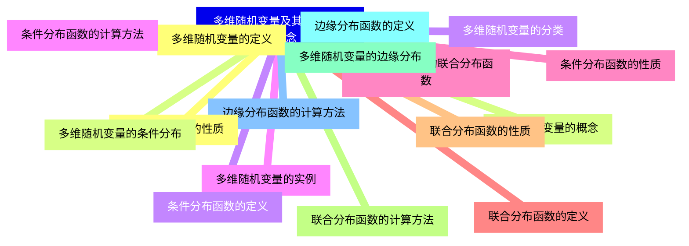
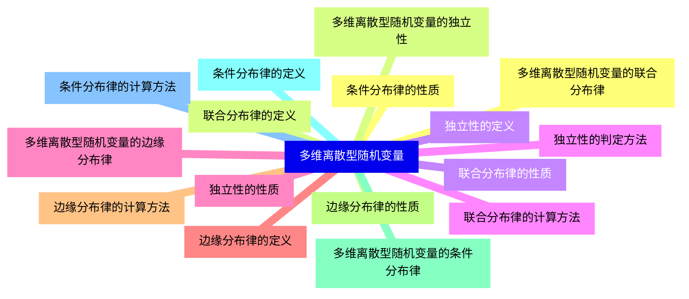
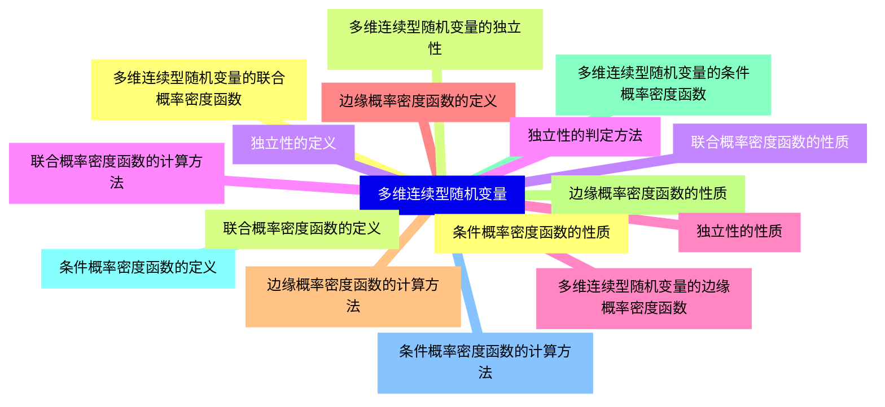
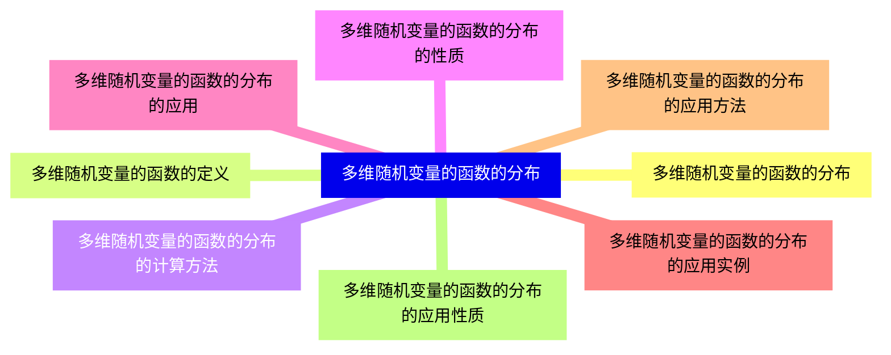
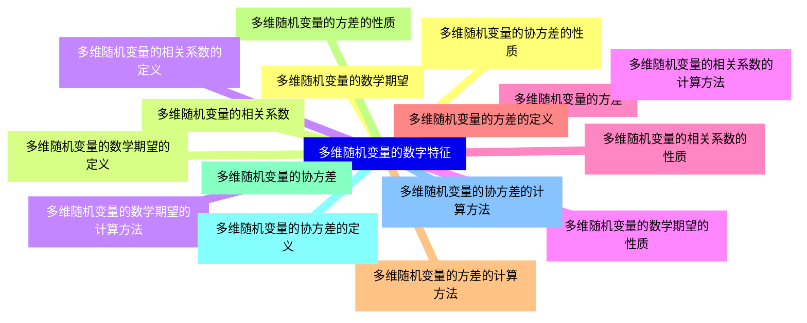
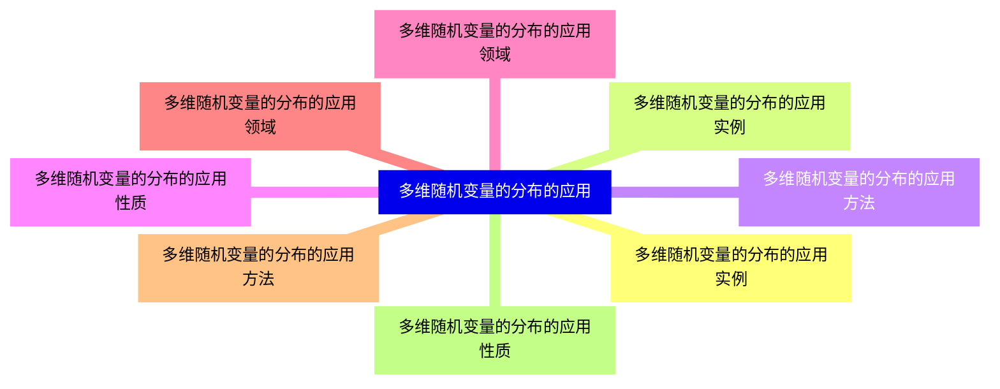


### 1 [多维随机变量及其分布的基本概念](#1)
#### 1.1 [多维随机变量的定义](#1)
#### 1.2 [多维随机变量的概念](#1)
#### 1.3 [多维随机变量的分类](#1)
#### 1.4 [多维随机变量的实例](#1)
#### 1.5 [多维随机变量的联合分布函数](#1)
#### 1.6 [联合分布函数的定义](#1)
#### 1.7 [联合分布函数的性质](#1)
#### 1.8 [联合分布函数的计算方法](#1)
#### 1.9 [多维随机变量的边缘分布](#1)
#### 1.10 [边缘分布函数的定义](#1)
#### 1.11 [边缘分布函数的计算方法](#1)
#### 1.12 [边缘分布函数的性质](#1)
#### 1.13 [多维随机变量的条件分布](#1)
#### 1.14 [条件分布函数的定义](#1)
#### 1.15 [条件分布函数的计算方法](#1)
#### 1.16 [条件分布函数的性质](#1)
### 2 [多维离散型随机变量](#2)
#### 2.1 [多维离散型随机变量的联合分布律](#2)
#### 2.2 [联合分布律的定义](#2)
#### 2.3 [联合分布律的性质](#2)
#### 2.4 [联合分布律的计算方法](#2)
#### 2.5 [多维离散型随机变量的边缘分布律](#2)
#### 2.6 [边缘分布律的定义](#2)
#### 2.7 [边缘分布律的计算方法](#2)
#### 2.8 [边缘分布律的性质](#2)
#### 2.9 [多维离散型随机变量的条件分布律](#2)
#### 2.10 [条件分布律的定义](#2)
#### 2.11 [条件分布律的计算方法](#2)
#### 2.12 [条件分布律的性质](#2)
#### 2.13 [多维离散型随机变量的独立性](#2)
#### 2.14 [独立性的定义](#2)
#### 2.15 [独立性的判定方法](#2)
#### 2.16 [独立性的性质](#2)
### 3 [多维连续型随机变量](#3)
#### 3.1 [多维连续型随机变量的联合概率密度函数](#3)
#### 3.2 [联合概率密度函数的定义](#3)
#### 3.3 [联合概率密度函数的性质](#3)
#### 3.4 [联合概率密度函数的计算方法](#3)
#### 3.5 [多维连续型随机变量的边缘概率密度函数](#3)
#### 3.6 [边缘概率密度函数的定义](#3)
#### 3.7 [边缘概率密度函数的计算方法](#3)
#### 3.8 [边缘概率密度函数的性质](#3)
#### 3.9 [多维连续型随机变量的条件概率密度函数](#3)
#### 3.10 [条件概率密度函数的定义](#3)
#### 3.11 [条件概率密度函数的计算方法](#3)
#### 3.12 [条件概率密度函数的性质](#3)
#### 3.13 [多维连续型随机变量的独立性](#3)
#### 3.14 [独立性的定义](#3)
#### 3.15 [独立性的判定方法](#3)
#### 3.16 [独立性的性质](#3)
### 4 [多维随机变量的函数的分布](#4)
#### 4.1 [多维随机变量的函数的分布](#4)
#### 4.2 [多维随机变量的函数的定义](#4)
#### 4.3 [多维随机变量的函数的分布的计算方法](#4)
#### 4.4 [多维随机变量的函数的分布的性质](#4)
#### 4.5 [多维随机变量的函数的分布的应用](#4)
#### 4.6 [多维随机变量的函数的分布的应用实例](#4)
#### 4.7 [多维随机变量的函数的分布的应用方法](#4)
#### 4.8 [多维随机变量的函数的分布的应用性质](#4)
### 5 [多维随机变量的数字特征](#5)
#### 5.1 [多维随机变量的数学期望](#5)
#### 5.2 [多维随机变量的数学期望的定义](#5)
#### 5.3 [多维随机变量的数学期望的计算方法](#5)
#### 5.4 [多维随机变量的数学期望的性质](#5)
#### 5.5 [多维随机变量的方差](#5)
#### 5.6 [多维随机变量的方差的定义](#5)
#### 5.7 [多维随机变量的方差的计算方法](#5)
#### 5.8 [多维随机变量的方差的性质](#5)
#### 5.9 [多维随机变量的协方差](#5)
#### 5.10 [多维随机变量的协方差的定义](#5)
#### 5.11 [多维随机变量的协方差的计算方法](#5)
#### 5.12 [多维随机变量的协方差的性质](#5)
#### 5.13 [多维随机变量的相关系数](#5)
#### 5.14 [多维随机变量的相关系数的定义](#5)
#### 5.15 [多维随机变量的相关系数的计算方法](#5)
#### 5.16 [多维随机变量的相关系数的性质](#5)
### 6 [多维随机变量的分布的应用](#6)
#### 6.1 [多维随机变量的分布的应用实例](#6)
#### 6.2 [多维随机变量的分布的应用实例](#6)
#### 6.3 [多维随机变量的分布的应用方法](#6)
#### 6.4 [多维随机变量的分布的应用性质](#6)
#### 6.5 [多维随机变量的分布的应用领域](#6)
#### 6.6 [多维随机变量的分布的应用领域](#6)
#### 6.7 [多维随机变量的分布的应用方法](#6)
#### 6.8 [多维随机变量的分布的应用性质](#6)




### 1 多维随机变量及其分布的基本概念

---
### 1 多维随机变量及其分布的基本概念
___
#### 1.1 多维随机变量的定义
___
#### 1.2 多维随机变量的概念
___
#### 1.3 多维随机变量的分类
___
#### 1.4 多维随机变量的实例
___
#### 1.5 多维随机变量的联合分布函数
___
#### 1.6 联合分布函数的定义
___
#### 1.7 联合分布函数的性质
___
#### 1.8 联合分布函数的计算方法
___
#### 1.9 多维随机变量的边缘分布
___
#### 1.10 边缘分布函数的定义
___
#### 1.11 边缘分布函数的计算方法
___
#### 1.12 边缘分布函数的性质
___
#### 1.13 多维随机变量的条件分布
___
#### 1.14 条件分布函数的定义
___
#### 1.15 条件分布函数的计算方法
___
#### 1.16 条件分布函数的性质
### 2 多维离散型随机变量

---
### 2 多维离散型随机变量
___
#### 2.1 多维离散型随机变量的联合分布律
___
#### 2.2 联合分布律的定义
___
#### 2.3 联合分布律的性质
___
#### 2.4 联合分布律的计算方法
___
#### 2.5 多维离散型随机变量的边缘分布律
___
#### 2.6 边缘分布律的定义
___
#### 2.7 边缘分布律的计算方法
___
#### 2.8 边缘分布律的性质
___
#### 2.9 多维离散型随机变量的条件分布律
___
#### 2.10 条件分布律的定义
___
#### 2.11 条件分布律的计算方法
___
#### 2.12 条件分布律的性质
___
#### 2.13 多维离散型随机变量的独立性
___
#### 2.14 独立性的定义
___
#### 2.15 独立性的判定方法
___
#### 2.16 独立性的性质
### 3 多维连续型随机变量

---
### 3 多维连续型随机变量
___
#### 3.1 多维连续型随机变量的联合概率密度函数
___
#### 3.2 联合概率密度函数的定义
___
#### 3.3 联合概率密度函数的性质
___
#### 3.4 联合概率密度函数的计算方法
___
#### 3.5 多维连续型随机变量的边缘概率密度函数
___
#### 3.6 边缘概率密度函数的定义
___
#### 3.7 边缘概率密度函数的计算方法
___
#### 3.8 边缘概率密度函数的性质
___
#### 3.9 多维连续型随机变量的条件概率密度函数
___
#### 3.10 条件概率密度函数的定义
___
#### 3.11 条件概率密度函数的计算方法
___
#### 3.12 条件概率密度函数的性质
___
#### 3.13 多维连续型随机变量的独立性
___
#### 3.14 独立性的定义
___
#### 3.15 独立性的判定方法
___
#### 3.16 独立性的性质
### 4 多维随机变量的函数的分布

---
### 4 多维随机变量的函数的分布
___
#### 4.1 多维随机变量的函数的分布
___
#### 4.2 多维随机变量的函数的定义
___
#### 4.3 多维随机变量的函数的分布的计算方法
___
#### 4.4 多维随机变量的函数的分布的性质
___
#### 4.5 多维随机变量的函数的分布的应用
___
#### 4.6 多维随机变量的函数的分布的应用实例
___
#### 4.7 多维随机变量的函数的分布的应用方法
___
#### 4.8 多维随机变量的函数的分布的应用性质
### 5 多维随机变量的数字特征

---
### 5 多维随机变量的数字特征
___
#### 5.1 多维随机变量的数学期望
___
#### 5.2 多维随机变量的数学期望的定义
___
#### 5.3 多维随机变量的数学期望的计算方法
___
#### 5.4 多维随机变量的数学期望的性质
___
#### 5.5 多维随机变量的方差
___
#### 5.6 多维随机变量的方差的定义
___
#### 5.7 多维随机变量的方差的计算方法
___
#### 5.8 多维随机变量的方差的性质
___
#### 5.9 多维随机变量的协方差
___
#### 5.10 多维随机变量的协方差的定义
___
#### 5.11 多维随机变量的协方差的计算方法
___
#### 5.12 多维随机变量的协方差的性质
___
#### 5.13 多维随机变量的相关系数
___
#### 5.14 多维随机变量的相关系数的定义
___
#### 5.15 多维随机变量的相关系数的计算方法
___
#### 5.16 多维随机变量的相关系数的性质
### 6 多维随机变量的分布的应用

---
### 6 多维随机变量的分布的应用
___
#### 6.1 多维随机变量的分布的应用实例
___
#### 6.2 多维随机变量的分布的应用实例
___
#### 6.3 多维随机变量的分布的应用方法
___
#### 6.4 多维随机变量的分布的应用性质
___
#### 6.5 多维随机变量的分布的应用领域
___
#### 6.6 多维随机变量的分布的应用领域
___
#### 6.7 多维随机变量的分布的应用方法
___
#### 6.8 多维随机变量的分布的应用性质


### 1 多维随机变量及其分布的基本概念{#1}

{}

<--->
{}
{}
{}
{}
{}
{}
{}
{}
{}
{}
{}
{}
{}
{}
{}
{}
{}
{}
{}
{}
{}
{}
{}
{}
{}
{}
{}
{}
{}
{}
{}
{}
{}

### 2 多维离散型随机变量{#2}

{}
{}
{}
{}
{}
{}
{}
{}
{}
{}
{}
{}
{}
{}
{}
{}
{}
{}
{}
{}
{}
{}
{}
{}
{}
{}
{}
{}
{}
{}
{}
{}
{}
<--->

{}

### 3 多维连续型随机变量{#3}

{}

<--->
{}
{}
{}
{}
{}
{}
{}
{}
{}
{}
{}
{}
{}
{}
{}
{}
{}
{}
{}
{}
{}
{}
{}
{}
{}
{}
{}
{}
{}
{}
{}
{}
{}

### 4 多维随机变量的函数的分布{#4}

{}
{}
{}
{}
{}
{}
{}
{}
{}
{}
{}
{}
{}
{}
{}
{}
{}
<--->

{}

### 5 多维随机变量的数字特征{#5}

{}

<--->
{}
{}
{}
{}
{}
{}
{}
{}
{}
{}
{}
{}
{}
{}
{}
{}
{}
{}
{}
{}
{}
{}
{}
{}
{}
{}
{}
{}
{}
{}
{}
{}
{}

### 6 多维随机变量的分布的应用{#6}

{}
{}
{}
{}
{}
{}
{}
{}
{}
{}
{}
{}
{}
{}
{}
{}
{}
<--->

{}
