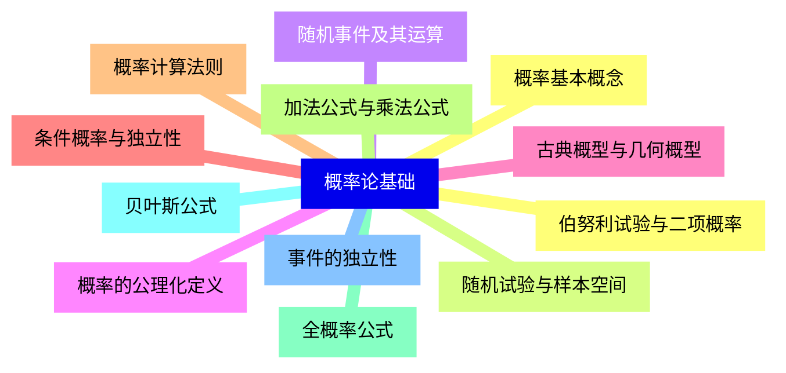
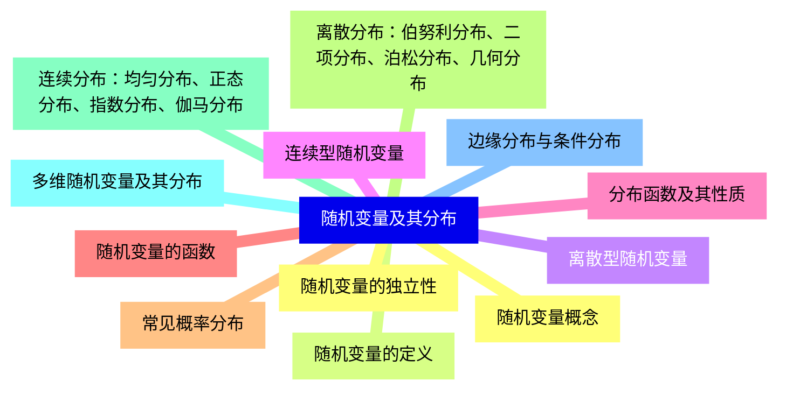
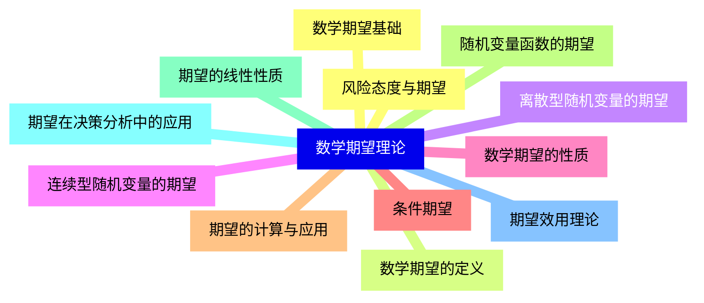
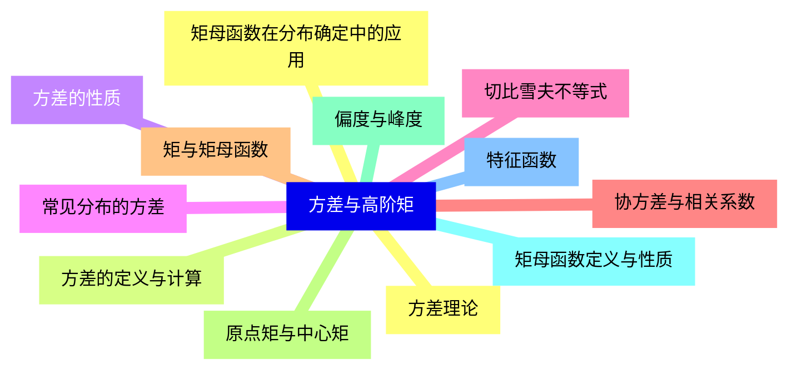
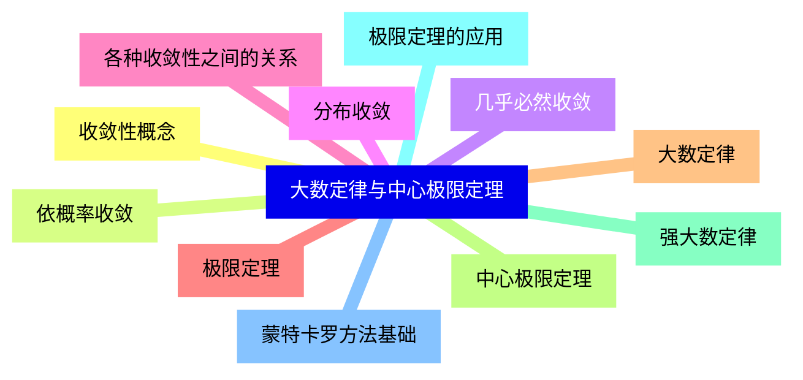
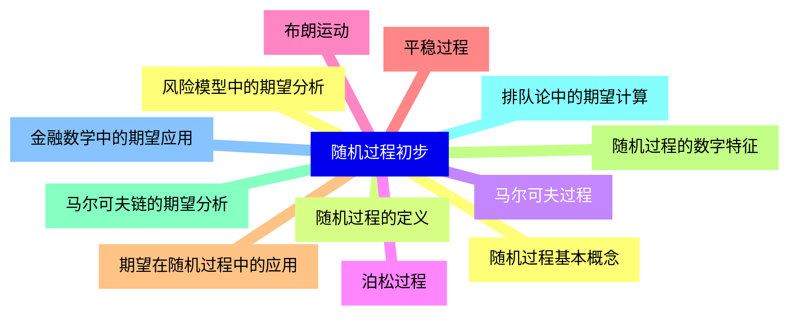
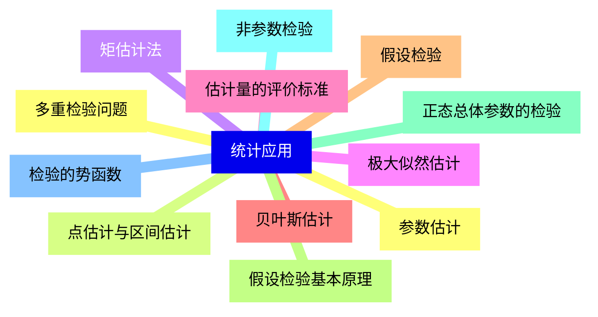
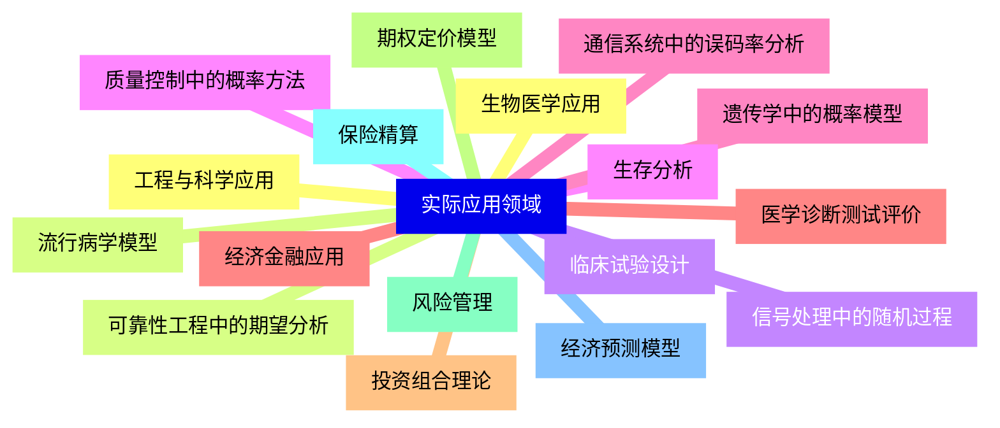


### 1 [概率论基础](#1)
#### 1.1 [概率基本概念](#1)
#### 1.2 [随机试验与样本空间](#1)
#### 1.3 [随机事件及其运算](#1)
#### 1.4 [概率的公理化定义](#1)
#### 1.5 [古典概型与几何概型](#1)
#### 1.6 [条件概率与独立性](#1)
#### 1.7 [概率计算法则](#1)
#### 1.8 [加法公式与乘法公式](#1)
#### 1.9 [全概率公式](#1)
#### 1.10 [贝叶斯公式](#1)
#### 1.11 [事件的独立性](#1)
#### 1.12 [伯努利试验与二项概率](#1)
### 2 [随机变量及其分布](#2)
#### 2.1 [随机变量概念](#2)
#### 2.2 [随机变量的定义](#2)
#### 2.3 [离散型随机变量](#2)
#### 2.4 [连续型随机变量](#2)
#### 2.5 [分布函数及其性质](#2)
#### 2.6 [随机变量的函数](#2)
#### 2.7 [常见概率分布](#2)
#### 2.8 [离散分布：伯努利分布、二项分布、泊松分布、几何分布](#2)
#### 2.9 [连续分布：均匀分布、正态分布、指数分布、伽马分布](#2)
#### 2.10 [多维随机变量及其分布](#2)
#### 2.11 [边缘分布与条件分布](#2)
#### 2.12 [随机变量的独立性](#2)
### 3 [数学期望理论](#3)
#### 3.1 [数学期望基础](#3)
#### 3.2 [数学期望的定义](#3)
#### 3.3 [离散型随机变量的期望](#3)
#### 3.4 [连续型随机变量的期望](#3)
#### 3.5 [数学期望的性质](#3)
#### 3.6 [条件期望](#3)
#### 3.7 [期望的计算与应用](#3)
#### 3.8 [随机变量函数的期望](#3)
#### 3.9 [期望的线性性质](#3)
#### 3.10 [期望在决策分析中的应用](#3)
#### 3.11 [期望效用理论](#3)
#### 3.12 [风险态度与期望](#3)
### 4 [方差与高阶矩](#4)
#### 4.1 [方差理论](#4)
#### 4.2 [方差的定义与计算](#4)
#### 4.3 [方差的性质](#4)
#### 4.4 [常见分布的方差](#4)
#### 4.5 [切比雪夫不等式](#4)
#### 4.6 [协方差与相关系数](#4)
#### 4.7 [矩与矩母函数](#4)
#### 4.8 [原点矩与中心矩](#4)
#### 4.9 [偏度与峰度](#4)
#### 4.10 [矩母函数定义与性质](#4)
#### 4.11 [特征函数](#4)
#### 4.12 [矩母函数在分布确定中的应用](#4)
### 5 [大数定律与中心极限定理](#5)
#### 5.1 [收敛性概念](#5)
#### 5.2 [依概率收敛](#5)
#### 5.3 [几乎必然收敛](#5)
#### 5.4 [分布收敛](#5)
#### 5.5 [各种收敛性之间的关系](#5)
#### 5.6 [极限定理](#5)
#### 5.7 [大数定律](#5)
#### 5.8 [中心极限定理](#5)
#### 5.9 [强大数定律](#5)
#### 5.10 [极限定理的应用](#5)
#### 5.11 [蒙特卡罗方法基础](#5)
### 6 [随机过程初步](#6)
#### 6.1 [随机过程基本概念](#6)
#### 6.2 [随机过程的定义](#6)
#### 6.3 [马尔可夫过程](#6)
#### 6.4 [泊松过程](#6)
#### 6.5 [布朗运动](#6)
#### 6.6 [平稳过程](#6)
#### 6.7 [期望在随机过程中的应用](#6)
#### 6.8 [随机过程的数字特征](#6)
#### 6.9 [马尔可夫链的期望分析](#6)
#### 6.10 [排队论中的期望计算](#6)
#### 6.11 [金融数学中的期望应用](#6)
#### 6.12 [风险模型中的期望分析](#6)
### 7 [统计应用](#7)
#### 7.1 [参数估计](#7)
#### 7.2 [点估计与区间估计](#7)
#### 7.3 [矩估计法](#7)
#### 7.4 [极大似然估计](#7)
#### 7.5 [估计量的评价标准](#7)
#### 7.6 [贝叶斯估计](#7)
#### 7.7 [假设检验](#7)
#### 7.8 [假设检验基本原理](#7)
#### 7.9 [正态总体参数的检验](#7)
#### 7.10 [非参数检验](#7)
#### 7.11 [检验的势函数](#7)
#### 7.12 [多重检验问题](#7)
### 8 [实际应用领域](#8)
#### 8.1 [工程与科学应用](#8)
#### 8.2 [可靠性工程中的期望分析](#8)
#### 8.3 [信号处理中的随机过程](#8)
#### 8.4 [质量控制中的概率方法](#8)
#### 8.5 [通信系统中的误码率分析](#8)
#### 8.6 [经济金融应用](#8)
#### 8.7 [投资组合理论](#8)
#### 8.8 [期权定价模型](#8)
#### 8.9 [风险管理](#8)
#### 8.10 [保险精算](#8)
#### 8.11 [经济预测模型](#8)
#### 8.12 [生物医学应用](#8)
#### 8.13 [流行病学模型](#8)
#### 8.14 [临床试验设计](#8)
#### 8.15 [生存分析](#8)
#### 8.16 [遗传学中的概率模型](#8)
#### 8.17 [医学诊断测试评价](#8)




### 1 概率论基础

---
### 1 概率论基础
___
#### 1.1 概率基本概念
___
#### 1.2 随机试验与样本空间
___
#### 1.3 随机事件及其运算
___
#### 1.4 概率的公理化定义
___
#### 1.5 古典概型与几何概型
___
#### 1.6 条件概率与独立性
___
#### 1.7 概率计算法则
___
#### 1.8 加法公式与乘法公式
___
#### 1.9 全概率公式
___
#### 1.10 贝叶斯公式
___
#### 1.11 事件的独立性
___
#### 1.12 伯努利试验与二项概率
### 2 随机变量及其分布

---
### 2 随机变量及其分布
___
#### 2.1 随机变量概念
___
#### 2.2 随机变量的定义
___
#### 2.3 离散型随机变量
___
#### 2.4 连续型随机变量
___
#### 2.5 分布函数及其性质
___
#### 2.6 随机变量的函数
___
#### 2.7 常见概率分布
___
#### 2.8 离散分布：伯努利分布、二项分布、泊松分布、几何分布
___
#### 2.9 连续分布：均匀分布、正态分布、指数分布、伽马分布
___
#### 2.10 多维随机变量及其分布
___
#### 2.11 边缘分布与条件分布
___
#### 2.12 随机变量的独立性
### 3 数学期望理论

---
### 3 数学期望理论
___
#### 3.1 数学期望基础
___
#### 3.2 数学期望的定义
___
#### 3.3 离散型随机变量的期望
___
#### 3.4 连续型随机变量的期望
___
#### 3.5 数学期望的性质
___
#### 3.6 条件期望
___
#### 3.7 期望的计算与应用
___
#### 3.8 随机变量函数的期望
___
#### 3.9 期望的线性性质
___
#### 3.10 期望在决策分析中的应用
___
#### 3.11 期望效用理论
___
#### 3.12 风险态度与期望
### 4 方差与高阶矩

---
### 4 方差与高阶矩
___
#### 4.1 方差理论
___
#### 4.2 方差的定义与计算
___
#### 4.3 方差的性质
___
#### 4.4 常见分布的方差
___
#### 4.5 切比雪夫不等式
___
#### 4.6 协方差与相关系数
___
#### 4.7 矩与矩母函数
___
#### 4.8 原点矩与中心矩
___
#### 4.9 偏度与峰度
___
#### 4.10 矩母函数定义与性质
___
#### 4.11 特征函数
___
#### 4.12 矩母函数在分布确定中的应用
### 5 大数定律与中心极限定理

---
### 5 大数定律与中心极限定理
___
#### 5.1 收敛性概念
___
#### 5.2 依概率收敛
___
#### 5.3 几乎必然收敛
___
#### 5.4 分布收敛
___
#### 5.5 各种收敛性之间的关系
___
#### 5.6 极限定理
___
#### 5.7 大数定律
___
#### 5.8 中心极限定理
___
#### 5.9 强大数定律
___
#### 5.10 极限定理的应用
___
#### 5.11 蒙特卡罗方法基础
### 6 随机过程初步

---
### 6 随机过程初步
___
#### 6.1 随机过程基本概念
___
#### 6.2 随机过程的定义
___
#### 6.3 马尔可夫过程
___
#### 6.4 泊松过程
___
#### 6.5 布朗运动
___
#### 6.6 平稳过程
___
#### 6.7 期望在随机过程中的应用
___
#### 6.8 随机过程的数字特征
___
#### 6.9 马尔可夫链的期望分析
___
#### 6.10 排队论中的期望计算
___
#### 6.11 金融数学中的期望应用
___
#### 6.12 风险模型中的期望分析
### 7 统计应用

---
### 7 统计应用
___
#### 7.1 参数估计
___
#### 7.2 点估计与区间估计
___
#### 7.3 矩估计法
___
#### 7.4 极大似然估计
___
#### 7.5 估计量的评价标准
___
#### 7.6 贝叶斯估计
___
#### 7.7 假设检验
___
#### 7.8 假设检验基本原理
___
#### 7.9 正态总体参数的检验
___
#### 7.10 非参数检验
___
#### 7.11 检验的势函数
___
#### 7.12 多重检验问题
### 8 实际应用领域

---
### 8 实际应用领域
___
#### 8.1 工程与科学应用
___
#### 8.2 可靠性工程中的期望分析
___
#### 8.3 信号处理中的随机过程
___
#### 8.4 质量控制中的概率方法
___
#### 8.5 通信系统中的误码率分析
___
#### 8.6 经济金融应用
___
#### 8.7 投资组合理论
___
#### 8.8 期权定价模型
___
#### 8.9 风险管理
___
#### 8.10 保险精算
___
#### 8.11 经济预测模型
___
#### 8.12 生物医学应用
___
#### 8.13 流行病学模型
___
#### 8.14 临床试验设计
___
#### 8.15 生存分析
___
#### 8.16 遗传学中的概率模型
___
#### 8.17 医学诊断测试评价


### 1 概率论基础{#1}

{}

<--->
{}
{}
{}
{}
{}
{}
{}
{}
{}
{}
{}
{}
{}
{}
{}
{}
{}
{}
{}
{}
{}
{}
{}
{}
{}

### 2 随机变量及其分布{#2}

{}
{}
{}
{}
{}
{}
{}
{}
{}
{}
{}
{}
{}
{}
{}
{}
{}
{}
{}
{}
{}
{}
{}
{}
{}
<--->

{}

### 3 数学期望理论{#3}

{}

<--->
{}
{}
{}
{}
{}
{}
{}
{}
{}
{}
{}
{}
{}
{}
{}
{}
{}
{}
{}
{}
{}
{}
{}
{}
{}

### 4 方差与高阶矩{#4}

{}
{}
{}
{}
{}
{}
{}
{}
{}
{}
{}
{}
{}
{}
{}
{}
{}
{}
{}
{}
{}
{}
{}
{}
{}
<--->

{}

### 5 大数定律与中心极限定理{#5}

{}

<--->
{}
{}
{}
{}
{}
{}
{}
{}
{}
{}
{}
{}
{}
{}
{}
{}
{}
{}
{}
{}
{}
{}
{}

### 6 随机过程初步{#6}

{}
{}
{}
{}
{}
{}
{}
{}
{}
{}
{}
{}
{}
{}
{}
{}
{}
{}
{}
{}
{}
{}
{}
{}
{}
<--->

{}

### 7 统计应用{#7}

{}

<--->
{}
{}
{}
{}
{}
{}
{}
{}
{}
{}
{}
{}
{}
{}
{}
{}
{}
{}
{}
{}
{}
{}
{}
{}
{}

### 8 实际应用领域{#8}

{}
{}
{}
{}
{}
{}
{}
{}
{}
{}
{}
{}
{}
{}
{}
{}
{}
{}
{}
{}
{}
{}
{}
{}
{}
{}
{}
{}
{}
{}
{}
{}
{}
{}
{}
<--->

{}
