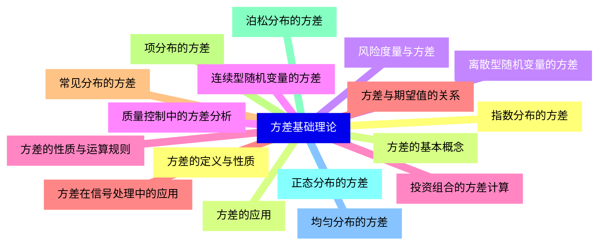
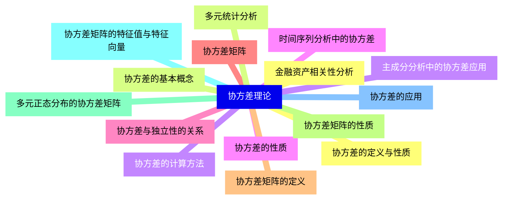
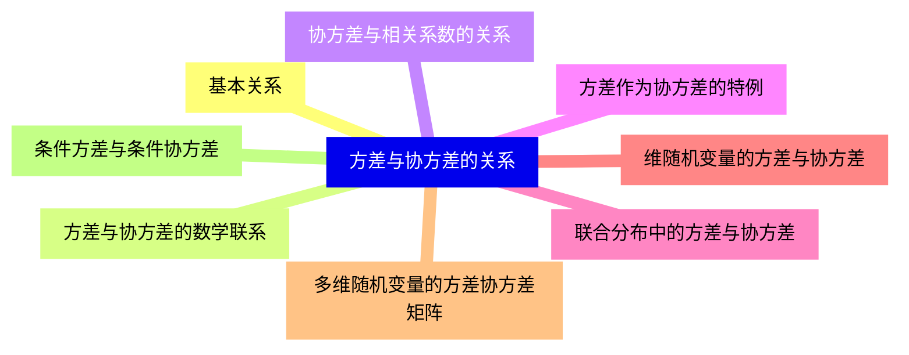
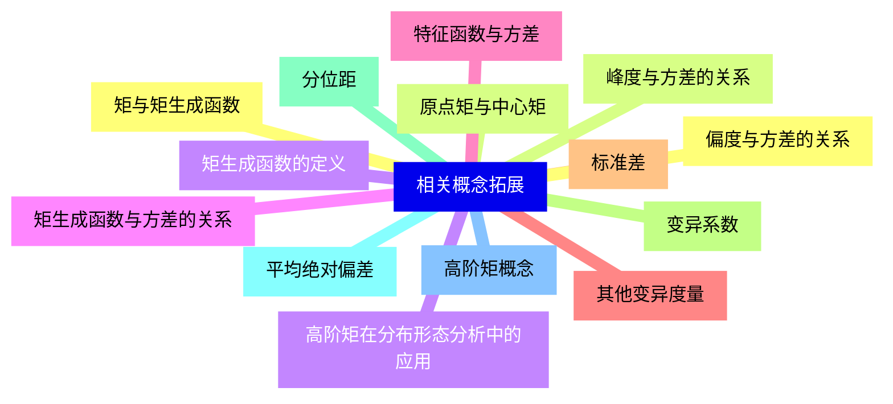
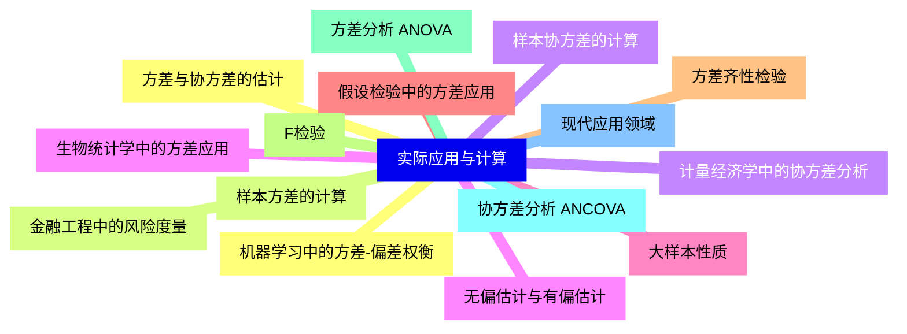


### 1 [方差基础理论](#1)
#### 1.1 [方差的定义与性质](#1)
#### 1.2 [方差的基本概念](#1)
#### 1.3 [离散型随机变量的方差](#1)
#### 1.4 [连续型随机变量的方差](#1)
#### 1.5 [方差的性质与运算规则](#1)
#### 1.6 [方差与期望值的关系](#1)
#### 1.7 [常见分布的方差](#1)
#### 1.8 [项分布的方差](#1)
#### 1.9 [泊松分布的方差](#1)
#### 1.10 [正态分布的方差](#1)
#### 1.11 [均匀分布的方差](#1)
#### 1.12 [指数分布的方差](#1)
#### 1.13 [方差的应用](#1)
#### 1.14 [风险度量与方差](#1)
#### 1.15 [质量控制中的方差分析](#1)
#### 1.16 [投资组合的方差计算](#1)
#### 1.17 [方差在信号处理中的应用](#1)
### 2 [协方差理论](#2)
#### 2.1 [协方差的定义与性质](#2)
#### 2.2 [协方差的基本概念](#2)
#### 2.3 [协方差的计算方法](#2)
#### 2.4 [协方差的性质](#2)
#### 2.5 [协方差与独立性的关系](#2)
#### 2.6 [协方差矩阵](#2)
#### 2.7 [协方差矩阵的定义](#2)
#### 2.8 [协方差矩阵的性质](#2)
#### 2.9 [多元正态分布的协方差矩阵](#2)
#### 2.10 [协方差矩阵的特征值与特征向量](#2)
#### 2.11 [协方差的应用](#2)
#### 2.12 [金融资产相关性分析](#2)
#### 2.13 [多元统计分析](#2)
#### 2.14 [主成分分析中的协方差应用](#2)
#### 2.15 [时间序列分析中的协方差](#2)
### 3 [方差与协方差的关系](#3)
#### 3.1 [基本关系](#3)
#### 3.2 [方差与协方差的数学联系](#3)
#### 3.3 [协方差与相关系数的关系](#3)
#### 3.4 [方差作为协方差的特例](#3)
#### 3.5 [联合分布中的方差与协方差](#3)
#### 3.6 [维随机变量的方差与协方差](#3)
#### 3.7 [多维随机变量的方差协方差矩阵](#3)
#### 3.8 [条件方差与条件协方差](#3)
### 4 [相关概念拓展](#4)
#### 4.1 [矩与矩生成函数](#4)
#### 4.2 [原点矩与中心矩](#4)
#### 4.3 [矩生成函数的定义](#4)
#### 4.4 [矩生成函数与方差的关系](#4)
#### 4.5 [特征函数与方差](#4)
#### 4.6 [其他变异度量](#4)
#### 4.7 [标准差](#4)
#### 4.8 [变异系数](#4)
#### 4.9 [分位距](#4)
#### 4.10 [平均绝对偏差](#4)
#### 4.11 [高阶矩概念](#4)
#### 4.12 [偏度与方差的关系](#4)
#### 4.13 [峰度与方差的关系](#4)
#### 4.14 [高阶矩在分布形态分析中的应用](#4)
### 5 [实际应用与计算](#5)
#### 5.1 [方差与协方差的估计](#5)
#### 5.2 [样本方差的计算](#5)
#### 5.3 [样本协方差的计算](#5)
#### 5.4 [无偏估计与有偏估计](#5)
#### 5.5 [大样本性质](#5)
#### 5.6 [假设检验中的方差应用](#5)
#### 5.7 [方差齐性检验](#5)
#### 5.8 [F检验](#5)
#### 5.9 [方差分析 ANOVA](#5)
#### 5.10 [协方差分析 ANCOVA](#5)
#### 5.11 [现代应用领域](#5)
#### 5.12 [机器学习中的方差-偏差权衡](#5)
#### 5.13 [金融工程中的风险度量](#5)
#### 5.14 [计量经济学中的协方差分析](#5)
#### 5.15 [生物统计学中的方差应用](#5)




### 1 方差基础理论

---
### 1 方差基础理论
___
#### 1.1 方差的定义与性质
___
#### 1.2 方差的基本概念
___
#### 1.3 离散型随机变量的方差
___
#### 1.4 连续型随机变量的方差
___
#### 1.5 方差的性质与运算规则
___
#### 1.6 方差与期望值的关系
___
#### 1.7 常见分布的方差
___
#### 1.8 项分布的方差
___
#### 1.9 泊松分布的方差
___
#### 1.10 正态分布的方差
___
#### 1.11 均匀分布的方差
___
#### 1.12 指数分布的方差
___
#### 1.13 方差的应用
___
#### 1.14 风险度量与方差
___
#### 1.15 质量控制中的方差分析
___
#### 1.16 投资组合的方差计算
___
#### 1.17 方差在信号处理中的应用
### 2 协方差理论

---
### 2 协方差理论
___
#### 2.1 协方差的定义与性质
___
#### 2.2 协方差的基本概念
___
#### 2.3 协方差的计算方法
___
#### 2.4 协方差的性质
___
#### 2.5 协方差与独立性的关系
___
#### 2.6 协方差矩阵
___
#### 2.7 协方差矩阵的定义
___
#### 2.8 协方差矩阵的性质
___
#### 2.9 多元正态分布的协方差矩阵
___
#### 2.10 协方差矩阵的特征值与特征向量
___
#### 2.11 协方差的应用
___
#### 2.12 金融资产相关性分析
___
#### 2.13 多元统计分析
___
#### 2.14 主成分分析中的协方差应用
___
#### 2.15 时间序列分析中的协方差
### 3 方差与协方差的关系

---
### 3 方差与协方差的关系
___
#### 3.1 基本关系
___
#### 3.2 方差与协方差的数学联系
___
#### 3.3 协方差与相关系数的关系
___
#### 3.4 方差作为协方差的特例
___
#### 3.5 联合分布中的方差与协方差
___
#### 3.6 维随机变量的方差与协方差
___
#### 3.7 多维随机变量的方差协方差矩阵
___
#### 3.8 条件方差与条件协方差
### 4 相关概念拓展

---
### 4 相关概念拓展
___
#### 4.1 矩与矩生成函数
___
#### 4.2 原点矩与中心矩
___
#### 4.3 矩生成函数的定义
___
#### 4.4 矩生成函数与方差的关系
___
#### 4.5 特征函数与方差
___
#### 4.6 其他变异度量
___
#### 4.7 标准差
___
#### 4.8 变异系数
___
#### 4.9 分位距
___
#### 4.10 平均绝对偏差
___
#### 4.11 高阶矩概念
___
#### 4.12 偏度与方差的关系
___
#### 4.13 峰度与方差的关系
___
#### 4.14 高阶矩在分布形态分析中的应用
### 5 实际应用与计算

---
### 5 实际应用与计算
___
#### 5.1 方差与协方差的估计
___
#### 5.2 样本方差的计算
___
#### 5.3 样本协方差的计算
___
#### 5.4 无偏估计与有偏估计
___
#### 5.5 大样本性质
___
#### 5.6 假设检验中的方差应用
___
#### 5.7 方差齐性检验
___
#### 5.8 F检验
___
#### 5.9 方差分析 ANOVA
___
#### 5.10 协方差分析 ANCOVA
___
#### 5.11 现代应用领域
___
#### 5.12 机器学习中的方差-偏差权衡
___
#### 5.13 金融工程中的风险度量
___
#### 5.14 计量经济学中的协方差分析
___
#### 5.15 生物统计学中的方差应用


### 1 方差基础理论{#1}

{}

<--->
{}
{}
{}
{}
{}
{}
{}
{}
{}
{}
{}
{}
{}
{}
{}
{}
{}
{}
{}
{}
{}
{}
{}
{}
{}
{}
{}
{}
{}
{}
{}
{}
{}
{}
{}

### 2 协方差理论{#2}

{}
{}
{}
{}
{}
{}
{}
{}
{}
{}
{}
{}
{}
{}
{}
{}
{}
{}
{}
{}
{}
{}
{}
{}
{}
{}
{}
{}
{}
{}
{}
<--->

{}

### 3 方差与协方差的关系{#3}

{}

<--->
{}
{}
{}
{}
{}
{}
{}
{}
{}
{}
{}
{}
{}
{}
{}
{}
{}

### 4 相关概念拓展{#4}

{}
{}
{}
{}
{}
{}
{}
{}
{}
{}
{}
{}
{}
{}
{}
{}
{}
{}
{}
{}
{}
{}
{}
{}
{}
{}
{}
{}
{}
<--->

{}

### 5 实际应用与计算{#5}

{}

<--->
{}
{}
{}
{}
{}
{}
{}
{}
{}
{}
{}
{}
{}
{}
{}
{}
{}
{}
{}
{}
{}
{}
{}
{}
{}
{}
{}
{}
{}
{}
{}
