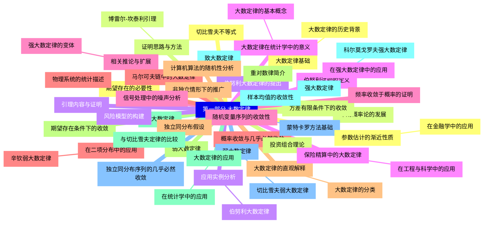
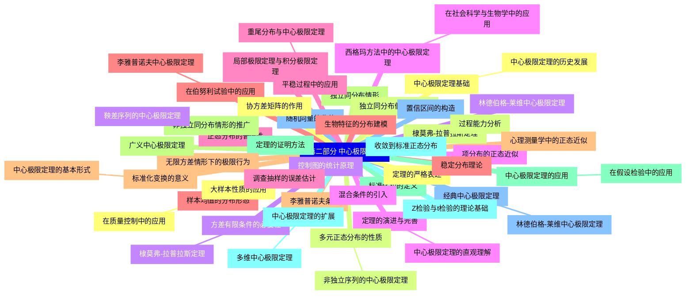
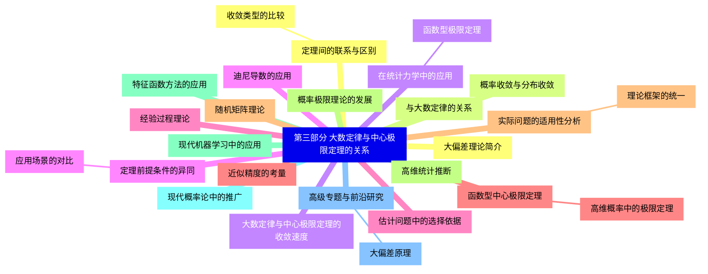


### 1 [第一部分 大数定律](#1)
#### 1.1 [大数定律基础](#1)
##### 1.1.1 [大数定律的历史背景](#1)
#### 1.2 [早期概率论的发展](#1)
#### 1.3 [伯努利大数定律的提出](#1)
#### 1.4 [大数定律在统计学中的意义](#1)
##### 1.4.1 [大数定律的基本概念](#1)
#### 1.5 [随机变量序列的收敛性](#1)
#### 1.6 [概率收敛与几乎必然收敛](#1)
#### 1.7 [大数定律的直观解释](#1)
##### 1.7.1 [大数定律的分类](#1)
#### 1.8 [弱大数定律](#1)
#### 1.9 [强大数定律](#1)
#### 1.10 [致大数定律](#1)
#### 1.11 [弱大数定律](#1)
##### 1.11.1 [切比雪夫弱大数定律](#1)
#### 1.12 [切比雪夫不等式](#1)
#### 1.13 [方差有限条件下的收敛](#1)
#### 1.14 [应用实例分析](#1)
##### 1.14.1 [伯努利大数定律](#1)
#### 1.15 [伯努利试验的定义](#1)
#### 1.16 [频率收敛于概率的证明](#1)
#### 1.17 [在二项分布中的应用](#1)
##### 1.17.1 [辛钦弱大数定律](#1)
#### 1.18 [独立同分布假设](#1)
#### 1.19 [期望存在条件下的收敛](#1)
#### 1.20 [与切比雪夫定律的比较](#1)
#### 1.21 [强大数定律](#1)
##### 1.21.1 [科尔莫戈罗夫强大数定律](#1)
#### 1.22 [独立同分布序列的几乎必然收敛](#1)
#### 1.23 [期望存在的必要性](#1)
#### 1.24 [证明思路与方法](#1)
##### 1.24.1 [博雷尔-坎泰利引理](#1)
#### 1.25 [引理内容与证明](#1)
#### 1.26 [在强大数定律中的应用](#1)
#### 1.27 [相关推论与扩展](#1)
##### 1.27.1 [强大数定律的变体](#1)
#### 1.28 [马尔可夫链中的大数定律](#1)
#### 1.29 [非独立情形下的推广](#1)
#### 1.30 [重对数律简介](#1)
#### 1.31 [大数定律的应用](#1)
##### 1.31.1 [在统计学中的应用](#1)
#### 1.32 [样本均值的收敛性](#1)
#### 1.33 [蒙特卡罗方法基础](#1)
#### 1.34 [参数估计的渐近性质](#1)
##### 1.34.1 [在金融学中的应用](#1)
#### 1.35 [投资组合理论](#1)
#### 1.36 [风险模型的构建](#1)
#### 1.37 [保险精算中的大数定律](#1)
##### 1.37.1 [在工程与科学中的应用](#1)
#### 1.38 [信号处理中的噪声分析](#1)
#### 1.39 [物理系统的统计描述](#1)
#### 1.40 [计算机算法的随机性分析](#1)
### 2 [第二部分 中心极限定理](#2)
#### 2.1 [中心极限定理基础](#2)
##### 2.1.1 [中心极限定理的历史发展](#2)
#### 2.2 [棣莫弗-拉普拉斯定理](#2)
#### 2.3 [林德伯格-莱维中心极限定理](#2)
#### 2.4 [定理的演进与完善](#2)
##### 2.4.1 [中心极限定理的直观理解](#2)
#### 2.5 [正态分布的普遍性](#2)
#### 2.6 [样本均值的分布形态](#2)
#### 2.7 [标准化变换的意义](#2)
##### 2.7.1 [中心极限定理的基本形式](#2)
#### 2.8 [独立同分布情形](#2)
#### 2.9 [标准化和的定义](#2)
#### 2.10 [收敛到标准正态分布](#2)
#### 2.11 [经典中心极限定理](#2)
##### 2.11.1 [林德伯格-莱维中心极限定理](#2)
#### 2.12 [定理的严格表述](#2)
#### 2.13 [独立同分布假设的作用](#2)
#### 2.14 [方差有限条件的必要性](#2)
##### 2.14.1 [棣莫弗-拉普拉斯定理](#2)
#### 2.15 [项分布的正态近似](#2)
#### 2.16 [局部极限定理与积分极限定理](#2)
#### 2.17 [在伯努利试验中的应用](#2)
##### 2.17.1 [李雅普诺夫中心极限定理](#2)
#### 2.18 [李雅普诺夫条件](#2)
#### 2.19 [非独立同分布情形的推广](#2)
#### 2.20 [定理的证明方法](#2)
#### 2.21 [中心极限定理的扩展](#2)
##### 2.21.1 [多维中心极限定理](#2)
#### 2.22 [随机向量的收敛](#2)
#### 2.23 [协方差矩阵的作用](#2)
#### 2.24 [多元正态分布的性质](#2)
##### 2.24.1 [非独立序列的中心极限定理](#2)
#### 2.25 [鞅差序列的中心极限定理](#2)
#### 2.26 [混合条件的引入](#2)
#### 2.27 [平稳过程中的应用](#2)
##### 2.27.1 [重尾分布与中心极限定理](#2)
#### 2.28 [稳定分布理论](#2)
#### 2.29 [无限方差情形下的极限行为](#2)
#### 2.30 [广义中心极限定理](#2)
#### 2.31 [中心极限定理的应用](#2)
##### 2.31.1 [在假设检验中的应用](#2)
#### 2.32 [Z检验与t检验的理论基础](#2)
#### 2.33 [置信区间的构造](#2)
#### 2.34 [大样本性质的应用](#2)
##### 2.34.1 [在质量控制中的应用](#2)
#### 2.35 [过程能力分析](#2)
#### 2.36 [控制图的统计原理](#2)
#### 2.37 [西格玛方法中的中心极限定理](#2)
##### 2.37.1 [在社会科学与生物学中的应用](#2)
#### 2.38 [调查抽样的误差估计](#2)
#### 2.39 [生物特征的分布建模](#2)
#### 2.40 [心理测量学中的正态近似](#2)
### 3 [第三部分 大数定律与中心极限定理的关系](#3)
#### 3.1 [定理间的联系与区别](#3)
##### 3.1.1 [收敛类型的比较](#3)
#### 3.2 [概率收敛与分布收敛](#3)
#### 3.3 [大数定律与中心极限定理的收敛速度](#3)
#### 3.4 [定理前提条件的异同](#3)
##### 3.4.1 [应用场景的对比](#3)
#### 3.5 [估计问题中的选择依据](#3)
#### 3.6 [近似精度的考量](#3)
#### 3.7 [实际问题的适用性分析](#3)
##### 3.7.1 [理论框架的统一](#3)
#### 3.8 [概率极限理论的发展](#3)
#### 3.9 [特征函数方法的应用](#3)
#### 3.10 [现代概率论中的推广](#3)
#### 3.11 [高级专题与前沿研究](#3)
##### 3.11.1 [大偏差原理](#3)
#### 3.12 [大偏差理论简介](#3)
#### 3.13 [与大数定律的关系](#3)
#### 3.14 [在统计力学中的应用](#3)
##### 3.14.1 [函数型极限定理](#3)
#### 3.15 [迪尼导数的应用](#3)
#### 3.16 [经验过程理论](#3)
#### 3.17 [函数型中心极限定理](#3)
##### 3.17.1 [高维概率中的极限定理](#3)
#### 3.18 [随机矩阵理论](#3)
#### 3.19 [高维统计推断](#3)
#### 3.20 [现代机器学习中的应用](#3)




### 1 第一部分 大数定律

---
### 1 第一部分 大数定律
___
#### 1.1 大数定律基础
___
##### 1.1.1 大数定律的历史背景
___
#### 1.2 早期概率论的发展
___
#### 1.3 伯努利大数定律的提出
___
#### 1.4 大数定律在统计学中的意义
___
##### 1.4.1 大数定律的基本概念
___
#### 1.5 随机变量序列的收敛性
___
#### 1.6 概率收敛与几乎必然收敛
___
#### 1.7 大数定律的直观解释
___
##### 1.7.1 大数定律的分类
___
#### 1.8 弱大数定律
___
#### 1.9 强大数定律
___
#### 1.10 致大数定律
___
#### 1.11 弱大数定律
___
##### 1.11.1 切比雪夫弱大数定律
___
#### 1.12 切比雪夫不等式
___
#### 1.13 方差有限条件下的收敛
___
#### 1.14 应用实例分析
___
##### 1.14.1 伯努利大数定律
___
#### 1.15 伯努利试验的定义
___
#### 1.16 频率收敛于概率的证明
___
#### 1.17 在二项分布中的应用
___
##### 1.17.1 辛钦弱大数定律
___
#### 1.18 独立同分布假设
___
#### 1.19 期望存在条件下的收敛
___
#### 1.20 与切比雪夫定律的比较
___
#### 1.21 强大数定律
___
##### 1.21.1 科尔莫戈罗夫强大数定律
___
#### 1.22 独立同分布序列的几乎必然收敛
___
#### 1.23 期望存在的必要性
___
#### 1.24 证明思路与方法
___
##### 1.24.1 博雷尔-坎泰利引理
___
#### 1.25 引理内容与证明
___
#### 1.26 在强大数定律中的应用
___
#### 1.27 相关推论与扩展
___
##### 1.27.1 强大数定律的变体
___
#### 1.28 马尔可夫链中的大数定律
___
#### 1.29 非独立情形下的推广
___
#### 1.30 重对数律简介
___
#### 1.31 大数定律的应用
___
##### 1.31.1 在统计学中的应用
___
#### 1.32 样本均值的收敛性
___
#### 1.33 蒙特卡罗方法基础
___
#### 1.34 参数估计的渐近性质
___
##### 1.34.1 在金融学中的应用
___
#### 1.35 投资组合理论
___
#### 1.36 风险模型的构建
___
#### 1.37 保险精算中的大数定律
___
##### 1.37.1 在工程与科学中的应用
___
#### 1.38 信号处理中的噪声分析
___
#### 1.39 物理系统的统计描述
___
#### 1.40 计算机算法的随机性分析
### 2 第二部分 中心极限定理

---
### 2 第二部分 中心极限定理
___
#### 2.1 中心极限定理基础
___
##### 2.1.1 中心极限定理的历史发展
___
#### 2.2 棣莫弗-拉普拉斯定理
___
#### 2.3 林德伯格-莱维中心极限定理
___
#### 2.4 定理的演进与完善
___
##### 2.4.1 中心极限定理的直观理解
___
#### 2.5 正态分布的普遍性
___
#### 2.6 样本均值的分布形态
___
#### 2.7 标准化变换的意义
___
##### 2.7.1 中心极限定理的基本形式
___
#### 2.8 独立同分布情形
___
#### 2.9 标准化和的定义
___
#### 2.10 收敛到标准正态分布
___
#### 2.11 经典中心极限定理
___
##### 2.11.1 林德伯格-莱维中心极限定理
___
#### 2.12 定理的严格表述
___
#### 2.13 独立同分布假设的作用
___
#### 2.14 方差有限条件的必要性
___
##### 2.14.1 棣莫弗-拉普拉斯定理
___
#### 2.15 项分布的正态近似
___
#### 2.16 局部极限定理与积分极限定理
___
#### 2.17 在伯努利试验中的应用
___
##### 2.17.1 李雅普诺夫中心极限定理
___
#### 2.18 李雅普诺夫条件
___
#### 2.19 非独立同分布情形的推广
___
#### 2.20 定理的证明方法
___
#### 2.21 中心极限定理的扩展
___
##### 2.21.1 多维中心极限定理
___
#### 2.22 随机向量的收敛
___
#### 2.23 协方差矩阵的作用
___
#### 2.24 多元正态分布的性质
___
##### 2.24.1 非独立序列的中心极限定理
___
#### 2.25 鞅差序列的中心极限定理
___
#### 2.26 混合条件的引入
___
#### 2.27 平稳过程中的应用
___
##### 2.27.1 重尾分布与中心极限定理
___
#### 2.28 稳定分布理论
___
#### 2.29 无限方差情形下的极限行为
___
#### 2.30 广义中心极限定理
___
#### 2.31 中心极限定理的应用
___
##### 2.31.1 在假设检验中的应用
___
#### 2.32 Z检验与t检验的理论基础
___
#### 2.33 置信区间的构造
___
#### 2.34 大样本性质的应用
___
##### 2.34.1 在质量控制中的应用
___
#### 2.35 过程能力分析
___
#### 2.36 控制图的统计原理
___
#### 2.37 西格玛方法中的中心极限定理
___
##### 2.37.1 在社会科学与生物学中的应用
___
#### 2.38 调查抽样的误差估计
___
#### 2.39 生物特征的分布建模
___
#### 2.40 心理测量学中的正态近似
### 3 第三部分 大数定律与中心极限定理的关系

---
### 3 第三部分 大数定律与中心极限定理的关系
___
#### 3.1 定理间的联系与区别
___
##### 3.1.1 收敛类型的比较
___
#### 3.2 概率收敛与分布收敛
___
#### 3.3 大数定律与中心极限定理的收敛速度
___
#### 3.4 定理前提条件的异同
___
##### 3.4.1 应用场景的对比
___
#### 3.5 估计问题中的选择依据
___
#### 3.6 近似精度的考量
___
#### 3.7 实际问题的适用性分析
___
##### 3.7.1 理论框架的统一
___
#### 3.8 概率极限理论的发展
___
#### 3.9 特征函数方法的应用
___
#### 3.10 现代概率论中的推广
___
#### 3.11 高级专题与前沿研究
___
##### 3.11.1 大偏差原理
___
#### 3.12 大偏差理论简介
___
#### 3.13 与大数定律的关系
___
#### 3.14 在统计力学中的应用
___
##### 3.14.1 函数型极限定理
___
#### 3.15 迪尼导数的应用
___
#### 3.16 经验过程理论
___
#### 3.17 函数型中心极限定理
___
##### 3.17.1 高维概率中的极限定理
___
#### 3.18 随机矩阵理论
___
#### 3.19 高维统计推断
___
#### 3.20 现代机器学习中的应用


### 1 第一部分 大数定律{#1}

{}

<--->
{}
{}
{}
{}
{}
{}
{}
{}
{}
{}
{}
{}
{}
{}
{}
{}
{}
{}
{}
{}
{}
{}
{}
{}
{}
{}
{}
{}
{}
{}
{}
{}
{}
{}
{}
{}
{}
{}
{}
{}
{}
{}
{}
{}
{}
{}
{}
{}
{}
{}
{}
{}
{}
{}
{}
{}
{}
{}
{}
{}
{}
{}
{}
{}
{}
{}
{}
{}
{}
{}
{}
{}
{}
{}
{}
{}
{}
{}
{}
{}
{}
{}
{}
{}
{}
{}
{}
{}
{}
{}
{}
{}
{}
{}
{}
{}
{}
{}
{}
{}
{}
{}
{}
{}
{}

### 2 第二部分 中心极限定理{#2}

{}
{}
{}
{}
{}
{}
{}
{}
{}
{}
{}
{}
{}
{}
{}
{}
{}
{}
{}
{}
{}
{}
{}
{}
{}
{}
{}
{}
{}
{}
{}
{}
{}
{}
{}
{}
{}
{}
{}
{}
{}
{}
{}
{}
{}
{}
{}
{}
{}
{}
{}
{}
{}
{}
{}
{}
{}
{}
{}
{}
{}
{}
{}
{}
{}
{}
{}
{}
{}
{}
{}
{}
{}
{}
{}
{}
{}
{}
{}
{}
{}
{}
{}
{}
{}
{}
{}
{}
{}
{}
{}
{}
{}
{}
{}
{}
{}
{}
{}
{}
{}
{}
{}
{}
{}
<--->

{}

### 3 第三部分 大数定律与中心极限定理的关系{#3}

{}

<--->
{}
{}
{}
{}
{}
{}
{}
{}
{}
{}
{}
{}
{}
{}
{}
{}
{}
{}
{}
{}
{}
{}
{}
{}
{}
{}
{}
{}
{}
{}
{}
{}
{}
{}
{}
{}
{}
{}
{}
{}
{}
{}
{}
{}
{}
{}
{}
{}
{}
{}
{}
{}
{}
