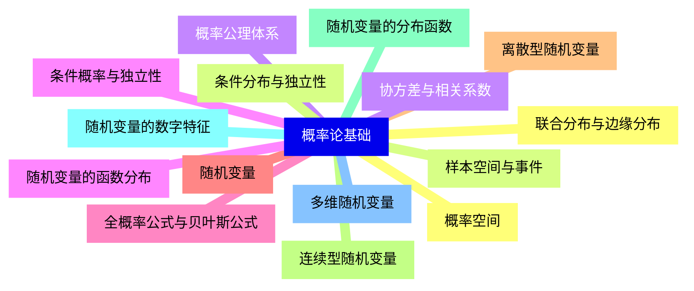
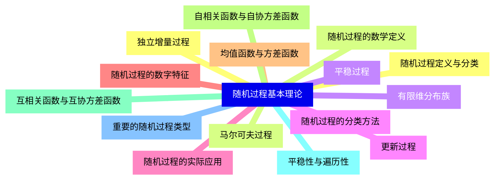
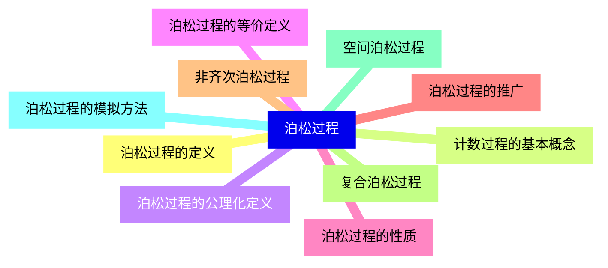
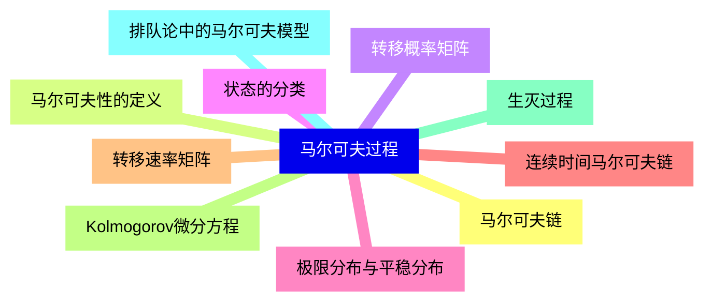
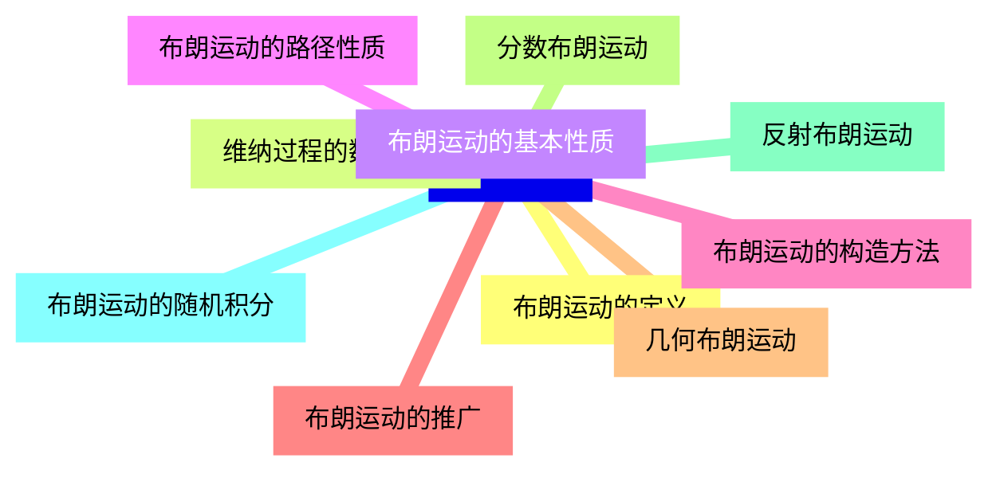
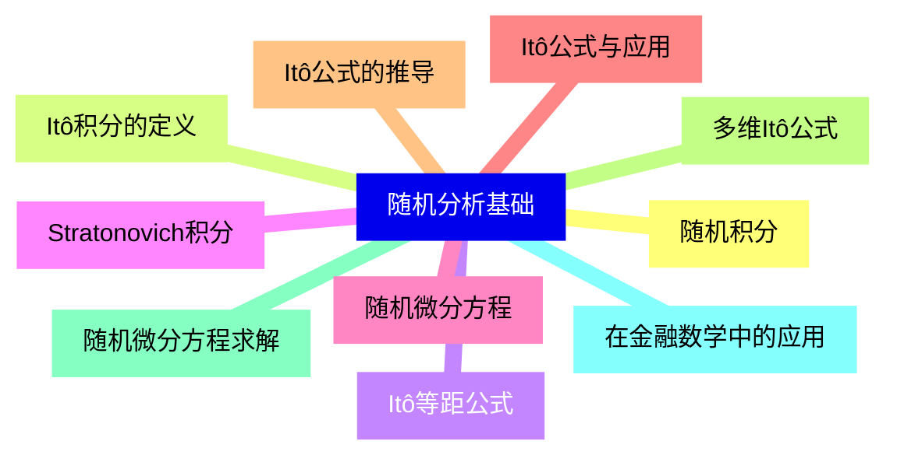
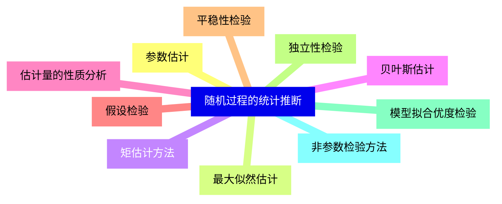
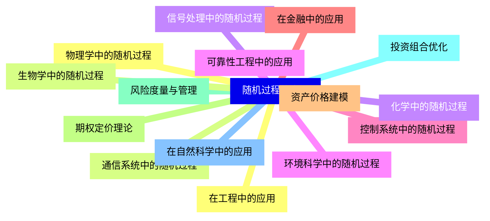


### 1 [概率论基础](#1)
#### 1.1 [概率空间](#1)
#### 1.2 [样本空间与事件](#1)
#### 1.3 [概率公理体系](#1)
#### 1.4 [条件概率与独立性](#1)
#### 1.5 [全概率公式与贝叶斯公式](#1)
#### 1.6 [随机变量](#1)
#### 1.7 [离散型随机变量](#1)
#### 1.8 [连续型随机变量](#1)
#### 1.9 [随机变量的分布函数](#1)
#### 1.10 [随机变量的数字特征](#1)
#### 1.11 [多维随机变量](#1)
#### 1.12 [联合分布与边缘分布](#1)
#### 1.13 [条件分布与独立性](#1)
#### 1.14 [协方差与相关系数](#1)
#### 1.15 [随机变量的函数分布](#1)
### 2 [随机过程基本理论](#2)
#### 2.1 [随机过程定义与分类](#2)
#### 2.2 [随机过程的数学定义](#2)
#### 2.3 [有限维分布族](#2)
#### 2.4 [随机过程的分类方法](#2)
#### 2.5 [随机过程的实际应用](#2)
#### 2.6 [随机过程的数字特征](#2)
#### 2.7 [均值函数与方差函数](#2)
#### 2.8 [自相关函数与自协方差函数](#2)
#### 2.9 [互相关函数与互协方差函数](#2)
#### 2.10 [平稳性与遍历性](#2)
#### 2.11 [重要的随机过程类型](#2)
#### 2.12 [独立增量过程](#2)
#### 2.13 [马尔可夫过程](#2)
#### 2.14 [平稳过程](#2)
#### 2.15 [更新过程](#2)
### 3 [泊松过程](#3)
#### 3.1 [泊松过程的定义](#3)
#### 3.2 [计数过程的基本概念](#3)
#### 3.3 [泊松过程的公理化定义](#3)
#### 3.4 [泊松过程的等价定义](#3)
#### 3.5 [泊松过程的性质](#3)
#### 3.6 [泊松过程的推广](#3)
#### 3.7 [非齐次泊松过程](#3)
#### 3.8 [复合泊松过程](#3)
#### 3.9 [空间泊松过程](#3)
#### 3.10 [泊松过程的模拟方法](#3)
### 4 [马尔可夫过程](#4)
#### 4.1 [马尔可夫链](#4)
#### 4.2 [马尔可夫性的定义](#4)
#### 4.3 [转移概率矩阵](#4)
#### 4.4 [状态的分类](#4)
#### 4.5 [极限分布与平稳分布](#4)
#### 4.6 [连续时间马尔可夫链](#4)
#### 4.7 [转移速率矩阵](#4)
#### 4.8 [Kolmogorov微分方程](#4)
#### 4.9 [生灭过程](#4)
#### 4.10 [排队论中的马尔可夫模型](#4)
### 5 [布朗运动](#5)
#### 5.1 [布朗运动的定义](#5)
#### 5.2 [维纳过程的数学定义](#5)
#### 5.3 [布朗运动的基本性质](#5)
#### 5.4 [布朗运动的路径性质](#5)
#### 5.5 [布朗运动的构造方法](#5)
#### 5.6 [布朗运动的推广](#5)
#### 5.7 [几何布朗运动](#5)
#### 5.8 [分数布朗运动](#5)
#### 5.9 [反射布朗运动](#5)
#### 5.10 [布朗运动的随机积分](#5)
### 6 [随机分析基础](#6)
#### 6.1 [随机积分](#6)
#### 6.2 [Itô积分的定义](#6)
#### 6.3 [Itô等距公式](#6)
#### 6.4 [Stratonovich积分](#6)
#### 6.5 [随机微分方程](#6)
#### 6.6 [Itô公式与应用](#6)
#### 6.7 [Itô公式的推导](#6)
#### 6.8 [多维Itô公式](#6)
#### 6.9 [随机微分方程求解](#6)
#### 6.10 [在金融数学中的应用](#6)
### 7 [随机过程的统计推断](#7)
#### 7.1 [参数估计](#7)
#### 7.2 [最大似然估计](#7)
#### 7.3 [矩估计方法](#7)
#### 7.4 [贝叶斯估计](#7)
#### 7.5 [估计量的性质分析](#7)
#### 7.6 [假设检验](#7)
#### 7.7 [平稳性检验](#7)
#### 7.8 [独立性检验](#7)
#### 7.9 [模型拟合优度检验](#7)
#### 7.10 [非参数检验方法](#7)
### 8 [随机过程的应用](#8)
#### 8.1 [在工程中的应用](#8)
#### 8.2 [通信系统中的随机过程](#8)
#### 8.3 [信号处理中的随机过程](#8)
#### 8.4 [可靠性工程中的应用](#8)
#### 8.5 [控制系统中的随机过程](#8)
#### 8.6 [在金融中的应用](#8)
#### 8.7 [资产价格建模](#8)
#### 8.8 [期权定价理论](#8)
#### 8.9 [风险度量与管理](#8)
#### 8.10 [投资组合优化](#8)
#### 8.11 [在自然科学中的应用](#8)
#### 8.12 [物理学中的随机过程](#8)
#### 8.13 [生物学中的随机过程](#8)
#### 8.14 [化学中的随机过程](#8)
#### 8.15 [环境科学中的随机过程](#8)




### 1 概率论基础

---
### 1 概率论基础
___
#### 1.1 概率空间
___
#### 1.2 样本空间与事件
___
#### 1.3 概率公理体系
___
#### 1.4 条件概率与独立性
___
#### 1.5 全概率公式与贝叶斯公式
___
#### 1.6 随机变量
___
#### 1.7 离散型随机变量
___
#### 1.8 连续型随机变量
___
#### 1.9 随机变量的分布函数
___
#### 1.10 随机变量的数字特征
___
#### 1.11 多维随机变量
___
#### 1.12 联合分布与边缘分布
___
#### 1.13 条件分布与独立性
___
#### 1.14 协方差与相关系数
___
#### 1.15 随机变量的函数分布
### 2 随机过程基本理论

---
### 2 随机过程基本理论
___
#### 2.1 随机过程定义与分类
___
#### 2.2 随机过程的数学定义
___
#### 2.3 有限维分布族
___
#### 2.4 随机过程的分类方法
___
#### 2.5 随机过程的实际应用
___
#### 2.6 随机过程的数字特征
___
#### 2.7 均值函数与方差函数
___
#### 2.8 自相关函数与自协方差函数
___
#### 2.9 互相关函数与互协方差函数
___
#### 2.10 平稳性与遍历性
___
#### 2.11 重要的随机过程类型
___
#### 2.12 独立增量过程
___
#### 2.13 马尔可夫过程
___
#### 2.14 平稳过程
___
#### 2.15 更新过程
### 3 泊松过程

---
### 3 泊松过程
___
#### 3.1 泊松过程的定义
___
#### 3.2 计数过程的基本概念
___
#### 3.3 泊松过程的公理化定义
___
#### 3.4 泊松过程的等价定义
___
#### 3.5 泊松过程的性质
___
#### 3.6 泊松过程的推广
___
#### 3.7 非齐次泊松过程
___
#### 3.8 复合泊松过程
___
#### 3.9 空间泊松过程
___
#### 3.10 泊松过程的模拟方法
### 4 马尔可夫过程

---
### 4 马尔可夫过程
___
#### 4.1 马尔可夫链
___
#### 4.2 马尔可夫性的定义
___
#### 4.3 转移概率矩阵
___
#### 4.4 状态的分类
___
#### 4.5 极限分布与平稳分布
___
#### 4.6 连续时间马尔可夫链
___
#### 4.7 转移速率矩阵
___
#### 4.8 Kolmogorov微分方程
___
#### 4.9 生灭过程
___
#### 4.10 排队论中的马尔可夫模型
### 5 布朗运动

---
### 5 布朗运动
___
#### 5.1 布朗运动的定义
___
#### 5.2 维纳过程的数学定义
___
#### 5.3 布朗运动的基本性质
___
#### 5.4 布朗运动的路径性质
___
#### 5.5 布朗运动的构造方法
___
#### 5.6 布朗运动的推广
___
#### 5.7 几何布朗运动
___
#### 5.8 分数布朗运动
___
#### 5.9 反射布朗运动
___
#### 5.10 布朗运动的随机积分
### 6 随机分析基础

---
### 6 随机分析基础
___
#### 6.1 随机积分
___
#### 6.2 Itô积分的定义
___
#### 6.3 Itô等距公式
___
#### 6.4 Stratonovich积分
___
#### 6.5 随机微分方程
___
#### 6.6 Itô公式与应用
___
#### 6.7 Itô公式的推导
___
#### 6.8 多维Itô公式
___
#### 6.9 随机微分方程求解
___
#### 6.10 在金融数学中的应用
### 7 随机过程的统计推断

---
### 7 随机过程的统计推断
___
#### 7.1 参数估计
___
#### 7.2 最大似然估计
___
#### 7.3 矩估计方法
___
#### 7.4 贝叶斯估计
___
#### 7.5 估计量的性质分析
___
#### 7.6 假设检验
___
#### 7.7 平稳性检验
___
#### 7.8 独立性检验
___
#### 7.9 模型拟合优度检验
___
#### 7.10 非参数检验方法
### 8 随机过程的应用

---
### 8 随机过程的应用
___
#### 8.1 在工程中的应用
___
#### 8.2 通信系统中的随机过程
___
#### 8.3 信号处理中的随机过程
___
#### 8.4 可靠性工程中的应用
___
#### 8.5 控制系统中的随机过程
___
#### 8.6 在金融中的应用
___
#### 8.7 资产价格建模
___
#### 8.8 期权定价理论
___
#### 8.9 风险度量与管理
___
#### 8.10 投资组合优化
___
#### 8.11 在自然科学中的应用
___
#### 8.12 物理学中的随机过程
___
#### 8.13 生物学中的随机过程
___
#### 8.14 化学中的随机过程
___
#### 8.15 环境科学中的随机过程


### 1 概率论基础{#1}

{}

<--->
{}
{}
{}
{}
{}
{}
{}
{}
{}
{}
{}
{}
{}
{}
{}
{}
{}
{}
{}
{}
{}
{}
{}
{}
{}
{}
{}
{}
{}
{}
{}

### 2 随机过程基本理论{#2}

{}
{}
{}
{}
{}
{}
{}
{}
{}
{}
{}
{}
{}
{}
{}
{}
{}
{}
{}
{}
{}
{}
{}
{}
{}
{}
{}
{}
{}
{}
{}
<--->

{}

### 3 泊松过程{#3}

{}

<--->
{}
{}
{}
{}
{}
{}
{}
{}
{}
{}
{}
{}
{}
{}
{}
{}
{}
{}
{}
{}
{}

### 4 马尔可夫过程{#4}

{}
{}
{}
{}
{}
{}
{}
{}
{}
{}
{}
{}
{}
{}
{}
{}
{}
{}
{}
{}
{}
<--->

{}

### 5 布朗运动{#5}

{}

<--->
{}
{}
{}
{}
{}
{}
{}
{}
{}
{}
{}
{}
{}
{}
{}
{}
{}
{}
{}
{}
{}

### 6 随机分析基础{#6}

{}
{}
{}
{}
{}
{}
{}
{}
{}
{}
{}
{}
{}
{}
{}
{}
{}
{}
{}
{}
{}
<--->

{}

### 7 随机过程的统计推断{#7}

{}

<--->
{}
{}
{}
{}
{}
{}
{}
{}
{}
{}
{}
{}
{}
{}
{}
{}
{}
{}
{}
{}
{}

### 8 随机过程的应用{#8}

{}
{}
{}
{}
{}
{}
{}
{}
{}
{}
{}
{}
{}
{}
{}
{}
{}
{}
{}
{}
{}
{}
{}
{}
{}
{}
{}
{}
{}
{}
{}
<--->

{}
