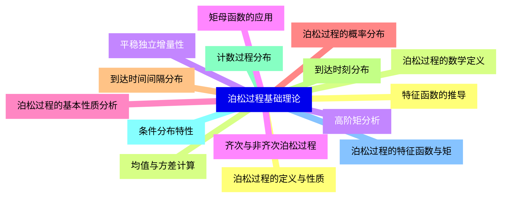
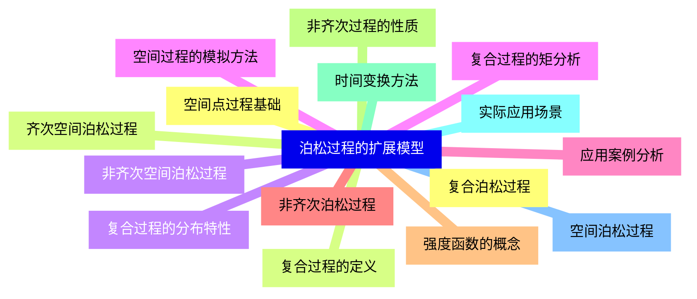
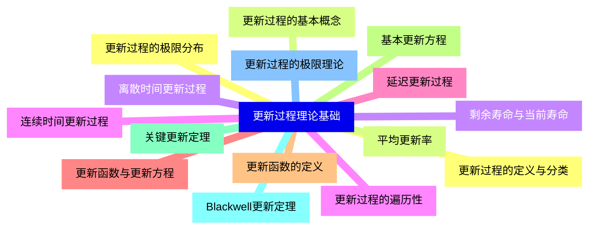
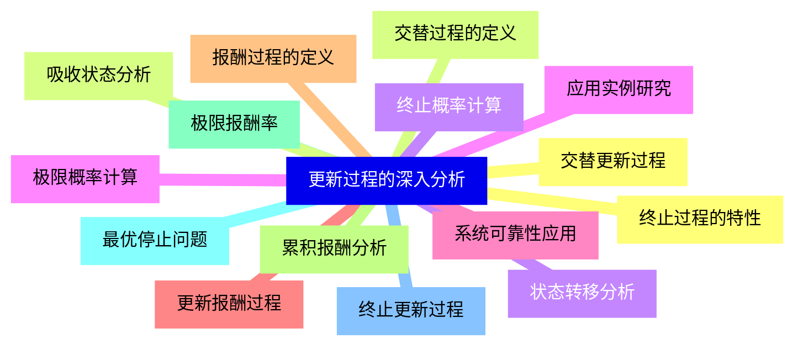
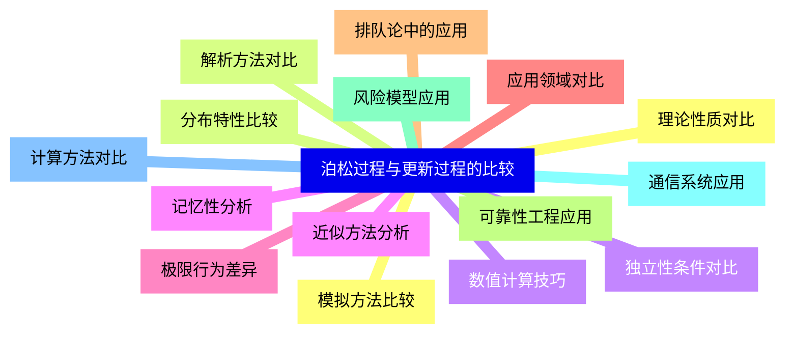
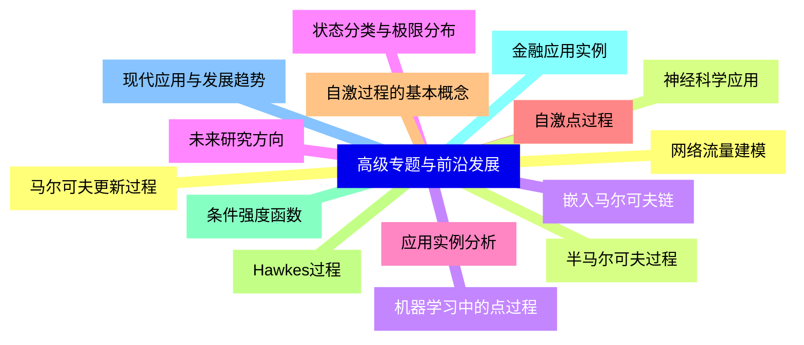


### 1 [泊松过程基础理论](#1)
#### 1.1 [泊松过程的定义与性质](#1)
#### 1.2 [泊松过程的数学定义](#1)
#### 1.3 [平稳独立增量性](#1)
#### 1.4 [齐次与非齐次泊松过程](#1)
#### 1.5 [泊松过程的基本性质分析](#1)
#### 1.6 [泊松过程的概率分布](#1)
#### 1.7 [到达时间间隔分布](#1)
#### 1.8 [到达时刻分布](#1)
#### 1.9 [计数过程分布](#1)
#### 1.10 [条件分布特性](#1)
#### 1.11 [泊松过程的特征函数与矩](#1)
#### 1.12 [特征函数的推导](#1)
#### 1.13 [均值与方差计算](#1)
#### 1.14 [高阶矩分析](#1)
#### 1.15 [矩母函数的应用](#1)
### 2 [泊松过程的扩展模型](#2)
#### 2.1 [复合泊松过程](#2)
#### 2.2 [复合过程的定义](#2)
#### 2.3 [复合过程的分布特性](#2)
#### 2.4 [复合过程的矩分析](#2)
#### 2.5 [应用案例分析](#2)
#### 2.6 [非齐次泊松过程](#2)
#### 2.7 [强度函数的概念](#2)
#### 2.8 [非齐次过程的性质](#2)
#### 2.9 [时间变换方法](#2)
#### 2.10 [实际应用场景](#2)
#### 2.11 [空间泊松过程](#2)
#### 2.12 [空间点过程基础](#2)
#### 2.13 [齐次空间泊松过程](#2)
#### 2.14 [非齐次空间泊松过程](#2)
#### 2.15 [空间过程的模拟方法](#2)
### 3 [更新过程理论基础](#3)
#### 3.1 [更新过程的定义与分类](#3)
#### 3.2 [更新过程的基本概念](#3)
#### 3.3 [离散时间更新过程](#3)
#### 3.4 [连续时间更新过程](#3)
#### 3.5 [延迟更新过程](#3)
#### 3.6 [更新函数与更新方程](#3)
#### 3.7 [更新函数的定义](#3)
#### 3.8 [基本更新方程](#3)
#### 3.9 [关键更新定理](#3)
#### 3.10 [Blackwell更新定理](#3)
#### 3.11 [更新过程的极限理论](#3)
#### 3.12 [更新过程的极限分布](#3)
#### 3.13 [平均更新率](#3)
#### 3.14 [剩余寿命与当前寿命](#3)
#### 3.15 [更新过程的遍历性](#3)
### 4 [更新过程的深入分析](#4)
#### 4.1 [交替更新过程](#4)
#### 4.2 [交替过程的定义](#4)
#### 4.3 [状态转移分析](#4)
#### 4.4 [极限概率计算](#4)
#### 4.5 [系统可靠性应用](#4)
#### 4.6 [更新报酬过程](#4)
#### 4.7 [报酬过程的定义](#4)
#### 4.8 [累积报酬分析](#4)
#### 4.9 [极限报酬率](#4)
#### 4.10 [最优停止问题](#4)
#### 4.11 [终止更新过程](#4)
#### 4.12 [终止过程的特性](#4)
#### 4.13 [吸收状态分析](#4)
#### 4.14 [终止概率计算](#4)
#### 4.15 [应用实例研究](#4)
### 5 [泊松过程与更新过程的比较](#5)
#### 5.1 [理论性质对比](#5)
#### 5.2 [分布特性比较](#5)
#### 5.3 [独立性条件对比](#5)
#### 5.4 [记忆性分析](#5)
#### 5.5 [极限行为差异](#5)
#### 5.6 [应用领域对比](#5)
#### 5.7 [排队论中的应用](#5)
#### 5.8 [可靠性工程应用](#5)
#### 5.9 [风险模型应用](#5)
#### 5.10 [通信系统应用](#5)
#### 5.11 [计算方法对比](#5)
#### 5.12 [模拟方法比较](#5)
#### 5.13 [解析方法对比](#5)
#### 5.14 [数值计算技巧](#5)
#### 5.15 [近似方法分析](#5)
### 6 [高级专题与前沿发展](#6)
#### 6.1 [马尔可夫更新过程](#6)
#### 6.2 [半马尔可夫过程](#6)
#### 6.3 [嵌入马尔可夫链](#6)
#### 6.4 [状态分类与极限分布](#6)
#### 6.5 [应用实例分析](#6)
#### 6.6 [自激点过程](#6)
#### 6.7 [自激过程的基本概念](#6)
#### 6.8 [Hawkes过程](#6)
#### 6.9 [条件强度函数](#6)
#### 6.10 [金融应用实例](#6)
#### 6.11 [现代应用与发展趋势](#6)
#### 6.12 [网络流量建模](#6)
#### 6.13 [神经科学应用](#6)
#### 6.14 [机器学习中的点过程](#6)
#### 6.15 [未来研究方向](#6)




### 1 泊松过程基础理论

---
### 1 泊松过程基础理论
___
#### 1.1 泊松过程的定义与性质
___
#### 1.2 泊松过程的数学定义
___
#### 1.3 平稳独立增量性
___
#### 1.4 齐次与非齐次泊松过程
___
#### 1.5 泊松过程的基本性质分析
___
#### 1.6 泊松过程的概率分布
___
#### 1.7 到达时间间隔分布
___
#### 1.8 到达时刻分布
___
#### 1.9 计数过程分布
___
#### 1.10 条件分布特性
___
#### 1.11 泊松过程的特征函数与矩
___
#### 1.12 特征函数的推导
___
#### 1.13 均值与方差计算
___
#### 1.14 高阶矩分析
___
#### 1.15 矩母函数的应用
### 2 泊松过程的扩展模型

---
### 2 泊松过程的扩展模型
___
#### 2.1 复合泊松过程
___
#### 2.2 复合过程的定义
___
#### 2.3 复合过程的分布特性
___
#### 2.4 复合过程的矩分析
___
#### 2.5 应用案例分析
___
#### 2.6 非齐次泊松过程
___
#### 2.7 强度函数的概念
___
#### 2.8 非齐次过程的性质
___
#### 2.9 时间变换方法
___
#### 2.10 实际应用场景
___
#### 2.11 空间泊松过程
___
#### 2.12 空间点过程基础
___
#### 2.13 齐次空间泊松过程
___
#### 2.14 非齐次空间泊松过程
___
#### 2.15 空间过程的模拟方法
### 3 更新过程理论基础

---
### 3 更新过程理论基础
___
#### 3.1 更新过程的定义与分类
___
#### 3.2 更新过程的基本概念
___
#### 3.3 离散时间更新过程
___
#### 3.4 连续时间更新过程
___
#### 3.5 延迟更新过程
___
#### 3.6 更新函数与更新方程
___
#### 3.7 更新函数的定义
___
#### 3.8 基本更新方程
___
#### 3.9 关键更新定理
___
#### 3.10 Blackwell更新定理
___
#### 3.11 更新过程的极限理论
___
#### 3.12 更新过程的极限分布
___
#### 3.13 平均更新率
___
#### 3.14 剩余寿命与当前寿命
___
#### 3.15 更新过程的遍历性
### 4 更新过程的深入分析

---
### 4 更新过程的深入分析
___
#### 4.1 交替更新过程
___
#### 4.2 交替过程的定义
___
#### 4.3 状态转移分析
___
#### 4.4 极限概率计算
___
#### 4.5 系统可靠性应用
___
#### 4.6 更新报酬过程
___
#### 4.7 报酬过程的定义
___
#### 4.8 累积报酬分析
___
#### 4.9 极限报酬率
___
#### 4.10 最优停止问题
___
#### 4.11 终止更新过程
___
#### 4.12 终止过程的特性
___
#### 4.13 吸收状态分析
___
#### 4.14 终止概率计算
___
#### 4.15 应用实例研究
### 5 泊松过程与更新过程的比较

---
### 5 泊松过程与更新过程的比较
___
#### 5.1 理论性质对比
___
#### 5.2 分布特性比较
___
#### 5.3 独立性条件对比
___
#### 5.4 记忆性分析
___
#### 5.5 极限行为差异
___
#### 5.6 应用领域对比
___
#### 5.7 排队论中的应用
___
#### 5.8 可靠性工程应用
___
#### 5.9 风险模型应用
___
#### 5.10 通信系统应用
___
#### 5.11 计算方法对比
___
#### 5.12 模拟方法比较
___
#### 5.13 解析方法对比
___
#### 5.14 数值计算技巧
___
#### 5.15 近似方法分析
### 6 高级专题与前沿发展

---
### 6 高级专题与前沿发展
___
#### 6.1 马尔可夫更新过程
___
#### 6.2 半马尔可夫过程
___
#### 6.3 嵌入马尔可夫链
___
#### 6.4 状态分类与极限分布
___
#### 6.5 应用实例分析
___
#### 6.6 自激点过程
___
#### 6.7 自激过程的基本概念
___
#### 6.8 Hawkes过程
___
#### 6.9 条件强度函数
___
#### 6.10 金融应用实例
___
#### 6.11 现代应用与发展趋势
___
#### 6.12 网络流量建模
___
#### 6.13 神经科学应用
___
#### 6.14 机器学习中的点过程
___
#### 6.15 未来研究方向


### 1 泊松过程基础理论{#1}

{}

<--->
{}
{}
{}
{}
{}
{}
{}
{}
{}
{}
{}
{}
{}
{}
{}
{}
{}
{}
{}
{}
{}
{}
{}
{}
{}
{}
{}
{}
{}
{}
{}

### 2 泊松过程的扩展模型{#2}

{}
{}
{}
{}
{}
{}
{}
{}
{}
{}
{}
{}
{}
{}
{}
{}
{}
{}
{}
{}
{}
{}
{}
{}
{}
{}
{}
{}
{}
{}
{}
<--->

{}

### 3 更新过程理论基础{#3}

{}

<--->
{}
{}
{}
{}
{}
{}
{}
{}
{}
{}
{}
{}
{}
{}
{}
{}
{}
{}
{}
{}
{}
{}
{}
{}
{}
{}
{}
{}
{}
{}
{}

### 4 更新过程的深入分析{#4}

{}
{}
{}
{}
{}
{}
{}
{}
{}
{}
{}
{}
{}
{}
{}
{}
{}
{}
{}
{}
{}
{}
{}
{}
{}
{}
{}
{}
{}
{}
{}
<--->

{}

### 5 泊松过程与更新过程的比较{#5}

{}

<--->
{}
{}
{}
{}
{}
{}
{}
{}
{}
{}
{}
{}
{}
{}
{}
{}
{}
{}
{}
{}
{}
{}
{}
{}
{}
{}
{}
{}
{}
{}
{}

### 6 高级专题与前沿发展{#6}

{}
{}
{}
{}
{}
{}
{}
{}
{}
{}
{}
{}
{}
{}
{}
{}
{}
{}
{}
{}
{}
{}
{}
{}
{}
{}
{}
{}
{}
{}
{}
<--->

{}
