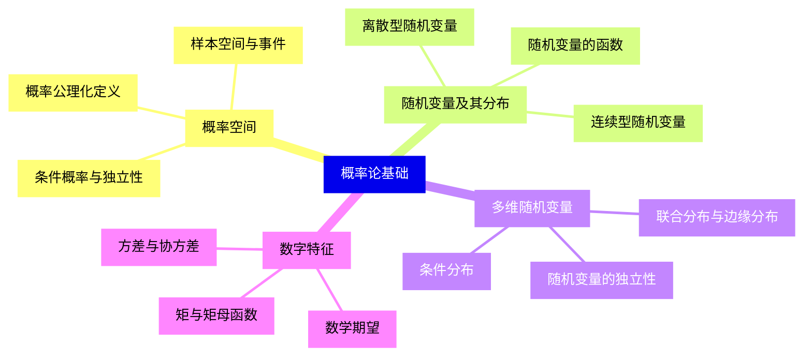
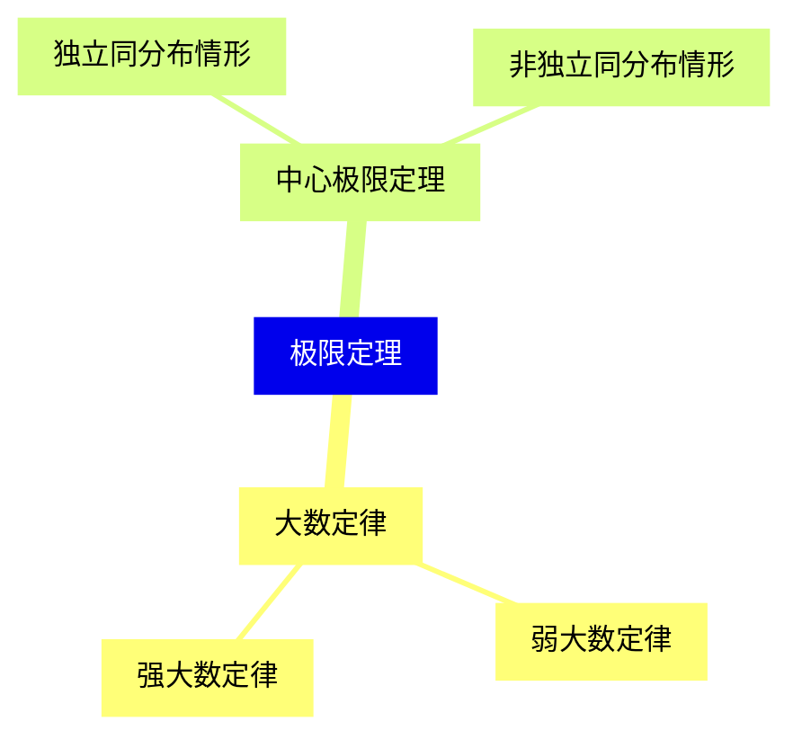
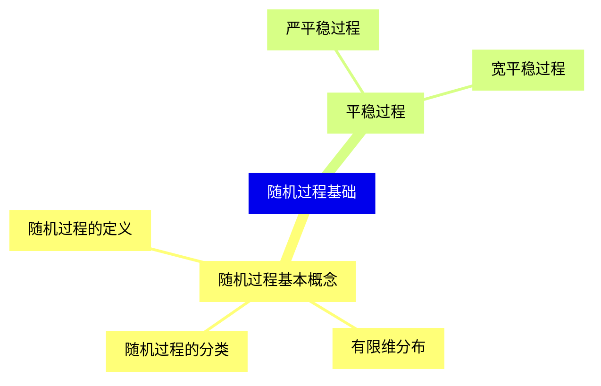
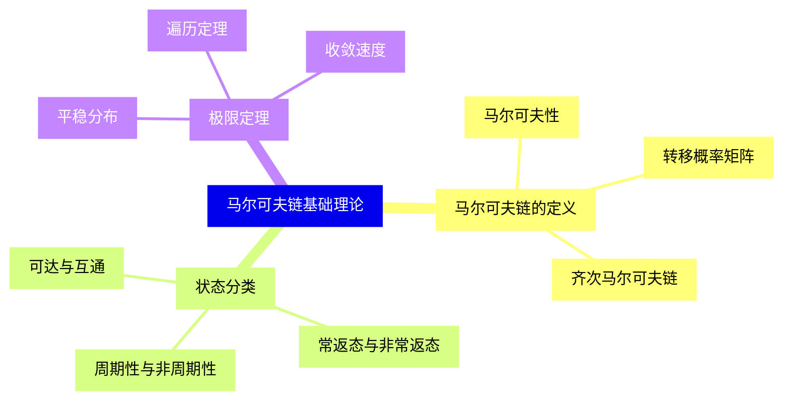
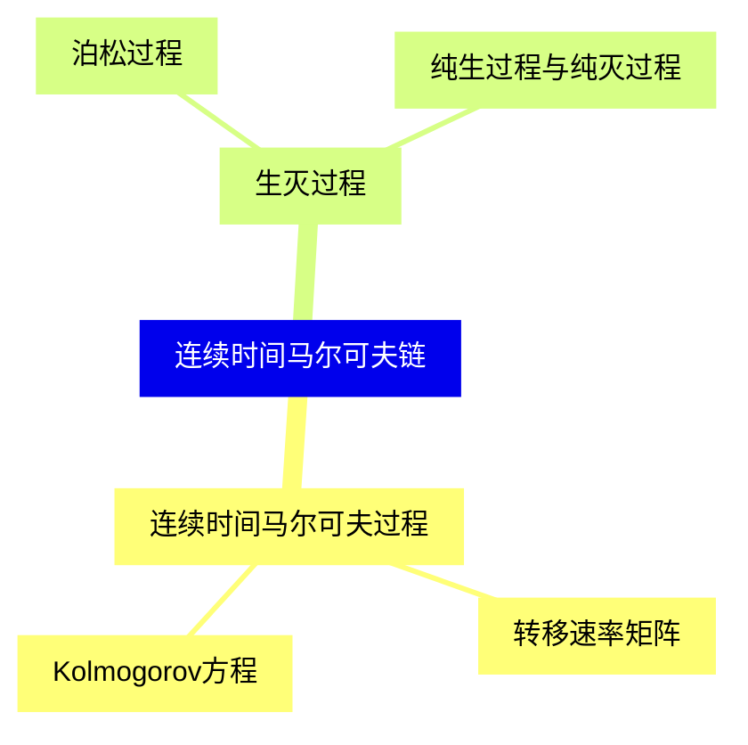
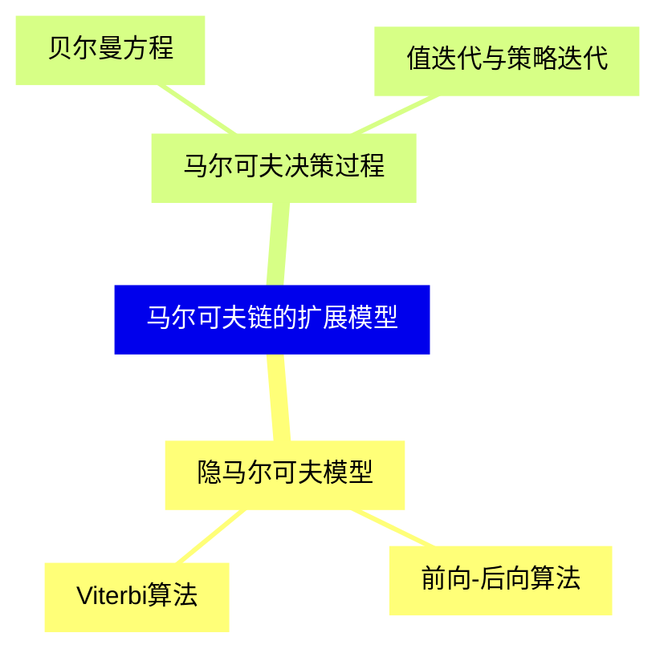
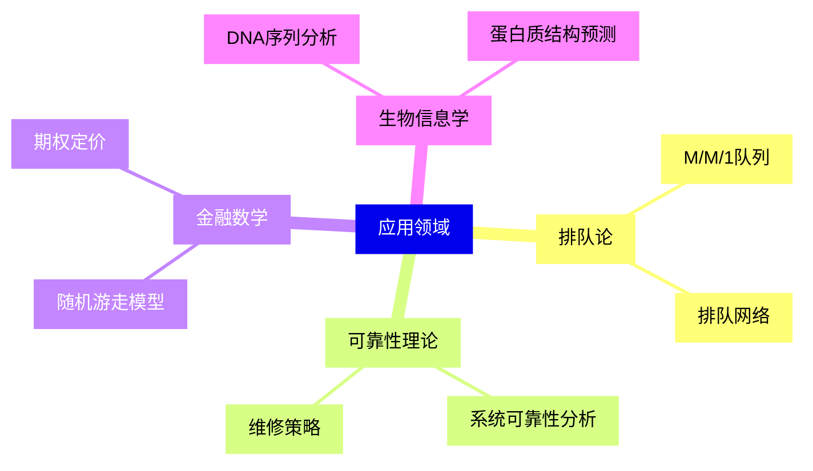
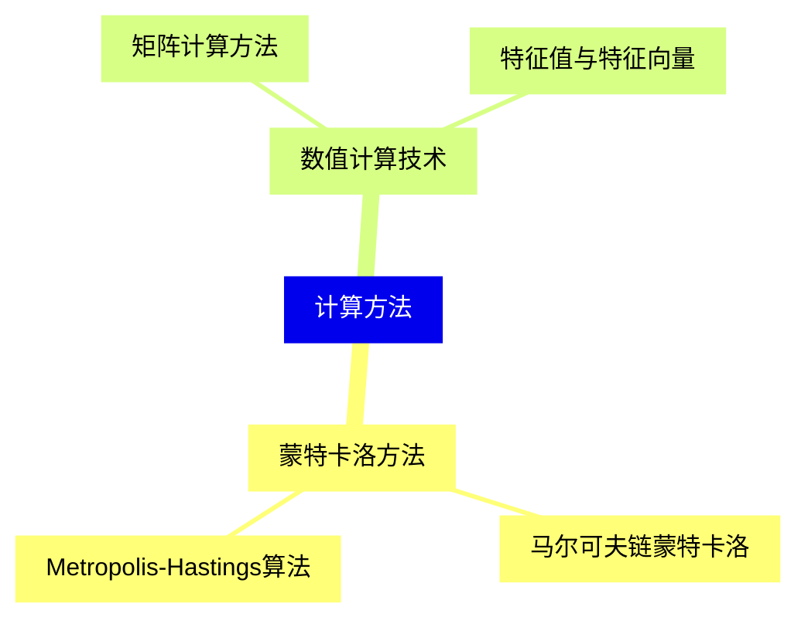


### 1 [概率论基础](#1)
#### 1.1 [概率空间](#1)
##### 1.1.1 [样本空间与事件](#1)
##### 1.1.2 [概率公理化定义](#1)
##### 1.1.3 [条件概率与独立性](#1)
#### 1.2 [随机变量及其分布](#1)
##### 1.2.1 [离散型随机变量](#1)
##### 1.2.2 [连续型随机变量](#1)
##### 1.2.3 [随机变量的函数](#1)
#### 1.3 [多维随机变量](#1)
##### 1.3.1 [联合分布与边缘分布](#1)
##### 1.3.2 [条件分布](#1)
##### 1.3.3 [随机变量的独立性](#1)
#### 1.4 [数字特征](#1)
##### 1.4.1 [数学期望](#1)
##### 1.4.2 [方差与协方差](#1)
##### 1.4.3 [矩与矩母函数](#1)
### 2 [极限定理](#2)
#### 2.1 [大数定律](#2)
##### 2.1.1 [弱大数定律](#2)
##### 2.1.2 [强大数定律](#2)
#### 2.2 [中心极限定理](#2)
##### 2.2.1 [独立同分布情形](#2)
##### 2.2.2 [非独立同分布情形](#2)
### 3 [随机过程基础](#3)
#### 3.1 [随机过程基本概念](#3)
##### 3.1.1 [随机过程的定义](#3)
##### 3.1.2 [有限维分布](#3)
##### 3.1.3 [随机过程的分类](#3)
#### 3.2 [平稳过程](#3)
##### 3.2.1 [严平稳过程](#3)
##### 3.2.2 [宽平稳过程](#3)
### 4 [马尔可夫链基础理论](#4)
#### 4.1 [马尔可夫链的定义](#4)
##### 4.1.1 [马尔可夫性](#4)
##### 4.1.2 [转移概率矩阵](#4)
##### 4.1.3 [齐次马尔可夫链](#4)
#### 4.2 [状态分类](#4)
##### 4.2.1 [可达与互通](#4)
##### 4.2.2 [常返态与非常返态](#4)
##### 4.2.3 [周期性与非周期性](#4)
#### 4.3 [极限定理](#4)
##### 4.3.1 [平稳分布](#4)
##### 4.3.2 [遍历定理](#4)
##### 4.3.3 [收敛速度](#4)
### 5 [连续时间马尔可夫链](#5)
#### 5.1 [连续时间马尔可夫过程](#5)
##### 5.1.1 [转移速率矩阵](#5)
##### 5.1.2 [Kolmogorov方程](#5)
#### 5.2 [生灭过程](#5)
##### 5.2.1 [泊松过程](#5)
##### 5.2.2 [纯生过程与纯灭过程](#5)
### 6 [马尔可夫链的扩展模型](#6)
#### 6.1 [隐马尔可夫模型](#6)
##### 6.1.1 [前向-后向算法](#6)
##### 6.1.2 [Viterbi算法](#6)
#### 6.2 [马尔可夫决策过程](#6)
##### 6.2.1 [贝尔曼方程](#6)
##### 6.2.2 [值迭代与策略迭代](#6)
### 7 [应用领域](#7)
#### 7.1 [排队论](#7)
##### 7.1.1 [M/M/1队列](#7)
##### 7.1.2 [排队网络](#7)
#### 7.2 [可靠性理论](#7)
##### 7.2.1 [系统可靠性分析](#7)
##### 7.2.2 [维修策略](#7)
#### 7.3 [金融数学](#7)
##### 7.3.1 [随机游走模型](#7)
##### 7.3.2 [期权定价](#7)
#### 7.4 [生物信息学](#7)
##### 7.4.1 [DNA序列分析](#7)
##### 7.4.2 [蛋白质结构预测](#7)
### 8 [计算方法](#8)
#### 8.1 [蒙特卡洛方法](#8)
##### 8.1.1 [马尔可夫链蒙特卡洛](#8)
##### 8.1.2 [Metropolis-Hastings算法](#8)
#### 8.2 [数值计算技术](#8)
##### 8.2.1 [矩阵计算方法](#8)
##### 8.2.2 [特征值与特征向量](#8)




### 1 概率论基础

---
### 1 概率论基础
___
#### 1.1 概率空间
___
##### 1.1.1 样本空间与事件
___
##### 1.1.2 概率公理化定义
___
##### 1.1.3 条件概率与独立性
___
#### 1.2 随机变量及其分布
___
##### 1.2.1 离散型随机变量
___
##### 1.2.2 连续型随机变量
___
##### 1.2.3 随机变量的函数
___
#### 1.3 多维随机变量
___
##### 1.3.1 联合分布与边缘分布
___
##### 1.3.2 条件分布
___
##### 1.3.3 随机变量的独立性
___
#### 1.4 数字特征
___
##### 1.4.1 数学期望
___
##### 1.4.2 方差与协方差
___
##### 1.4.3 矩与矩母函数
### 2 极限定理

---
### 2 极限定理
___
#### 2.1 大数定律
___
##### 2.1.1 弱大数定律
___
##### 2.1.2 强大数定律
___
#### 2.2 中心极限定理
___
##### 2.2.1 独立同分布情形
___
##### 2.2.2 非独立同分布情形
### 3 随机过程基础

---
### 3 随机过程基础
___
#### 3.1 随机过程基本概念
___
##### 3.1.1 随机过程的定义
___
##### 3.1.2 有限维分布
___
##### 3.1.3 随机过程的分类
___
#### 3.2 平稳过程
___
##### 3.2.1 严平稳过程
___
##### 3.2.2 宽平稳过程
### 4 马尔可夫链基础理论

---
### 4 马尔可夫链基础理论
___
#### 4.1 马尔可夫链的定义
___
##### 4.1.1 马尔可夫性
___
##### 4.1.2 转移概率矩阵
___
##### 4.1.3 齐次马尔可夫链
___
#### 4.2 状态分类
___
##### 4.2.1 可达与互通
___
##### 4.2.2 常返态与非常返态
___
##### 4.2.3 周期性与非周期性
___
#### 4.3 极限定理
___
##### 4.3.1 平稳分布
___
##### 4.3.2 遍历定理
___
##### 4.3.3 收敛速度
### 5 连续时间马尔可夫链

---
### 5 连续时间马尔可夫链
___
#### 5.1 连续时间马尔可夫过程
___
##### 5.1.1 转移速率矩阵
___
##### 5.1.2 Kolmogorov方程
___
#### 5.2 生灭过程
___
##### 5.2.1 泊松过程
___
##### 5.2.2 纯生过程与纯灭过程
### 6 马尔可夫链的扩展模型

---
### 6 马尔可夫链的扩展模型
___
#### 6.1 隐马尔可夫模型
___
##### 6.1.1 前向-后向算法
___
##### 6.1.2 Viterbi算法
___
#### 6.2 马尔可夫决策过程
___
##### 6.2.1 贝尔曼方程
___
##### 6.2.2 值迭代与策略迭代
### 7 应用领域

---
### 7 应用领域
___
#### 7.1 排队论
___
##### 7.1.1 M/M/1队列
___
##### 7.1.2 排队网络
___
#### 7.2 可靠性理论
___
##### 7.2.1 系统可靠性分析
___
##### 7.2.2 维修策略
___
#### 7.3 金融数学
___
##### 7.3.1 随机游走模型
___
##### 7.3.2 期权定价
___
#### 7.4 生物信息学
___
##### 7.4.1 DNA序列分析
___
##### 7.4.2 蛋白质结构预测
### 8 计算方法

---
### 8 计算方法
___
#### 8.1 蒙特卡洛方法
___
##### 8.1.1 马尔可夫链蒙特卡洛
___
##### 8.1.2 Metropolis-Hastings算法
___
#### 8.2 数值计算技术
___
##### 8.2.1 矩阵计算方法
___
##### 8.2.2 特征值与特征向量


### 1 概率论基础{#1}

{}

<--->
{}
{}
{}
{}
{}
{}
{}
{}
{}
{}
{}
{}
{}
{}
{}
{}
{}
{}
{}
{}
{}
{}
{}
{}
{}
{}
{}
{}
{}
{}
{}
{}
{}

### 2 极限定理{#2}

{}
{}
{}
{}
{}
{}
{}
{}
{}
{}
{}
{}
{}
<--->

{}

### 3 随机过程基础{#3}

{}

<--->
{}
{}
{}
{}
{}
{}
{}
{}
{}
{}
{}
{}
{}
{}
{}

### 4 马尔可夫链基础理论{#4}

{}
{}
{}
{}
{}
{}
{}
{}
{}
{}
{}
{}
{}
{}
{}
{}
{}
{}
{}
{}
{}
{}
{}
{}
{}
<--->

{}

### 5 连续时间马尔可夫链{#5}

{}

<--->
{}
{}
{}
{}
{}
{}
{}
{}
{}
{}
{}
{}
{}

### 6 马尔可夫链的扩展模型{#6}

{}
{}
{}
{}
{}
{}
{}
{}
{}
{}
{}
{}
{}
<--->

{}

### 7 应用领域{#7}

{}

<--->
{}
{}
{}
{}
{}
{}
{}
{}
{}
{}
{}
{}
{}
{}
{}
{}
{}
{}
{}
{}
{}
{}
{}
{}
{}

### 8 计算方法{#8}

{}
{}
{}
{}
{}
{}
{}
{}
{}
{}
{}
{}
{}
<--->

{}
