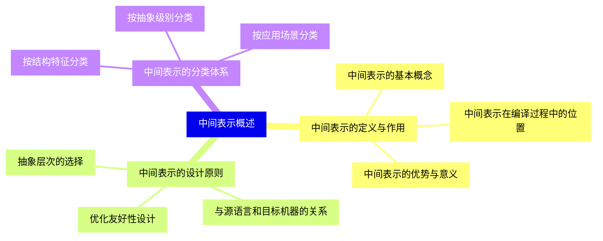
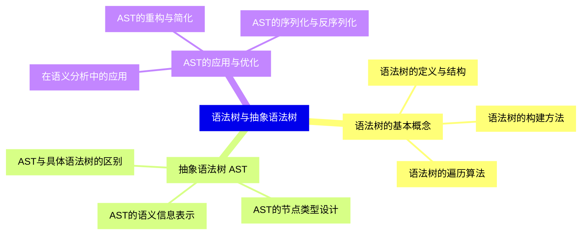
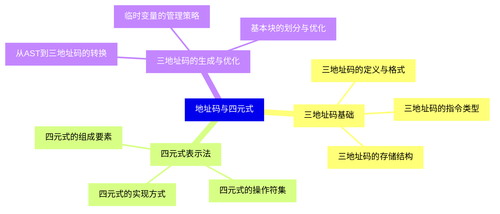
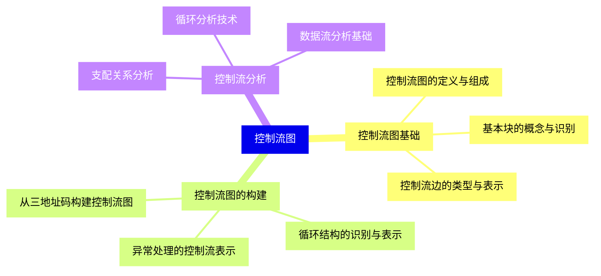
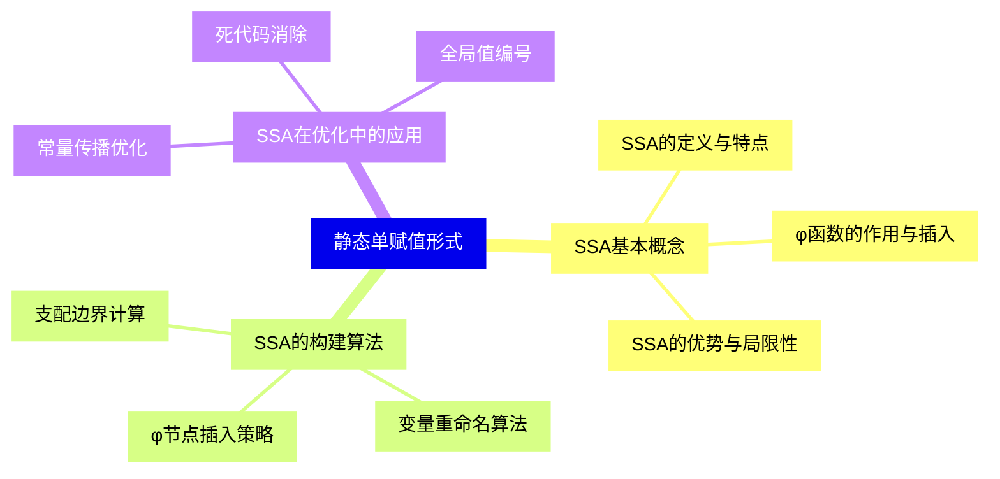
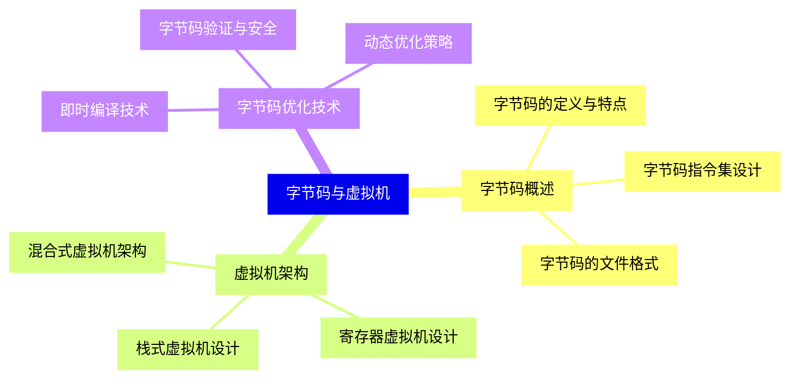
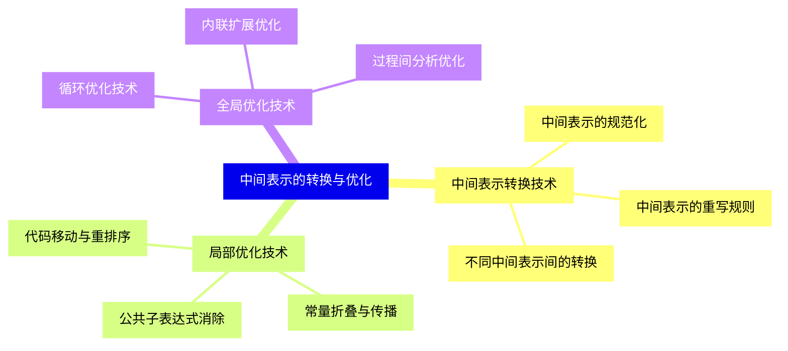
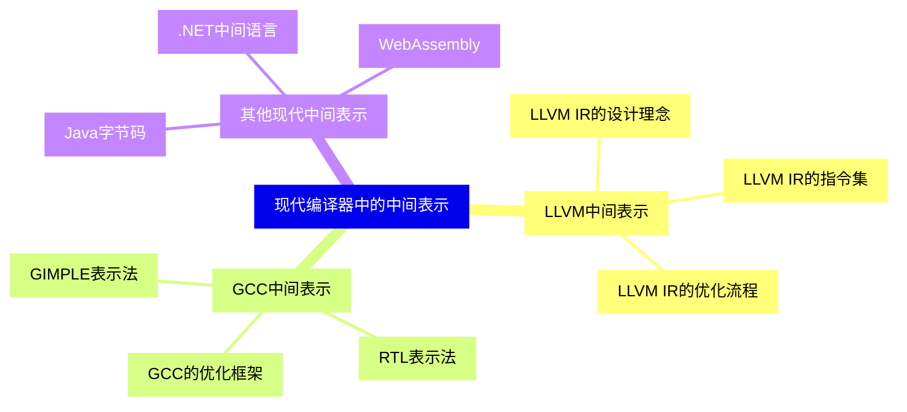
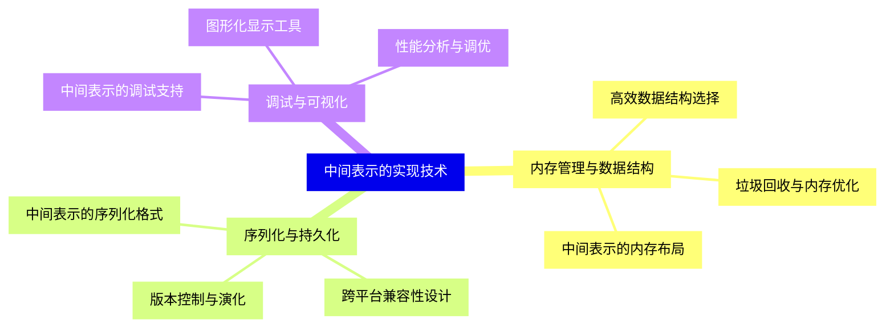
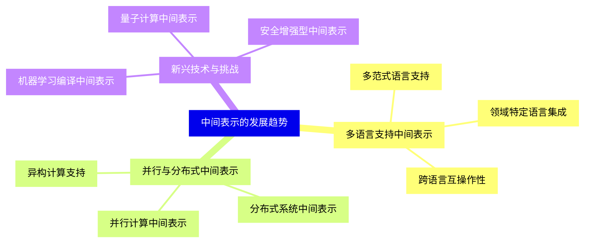


### 1 [中间表示概述](#1)
#### 1.1 [中间表示的定义与作用](#1)
##### 1.1.1 [中间表示的基本概念](#1)
##### 1.1.2 [中间表示在编译过程中的位置](#1)
##### 1.1.3 [中间表示的优势与意义](#1)
#### 1.2 [中间表示的设计原则](#1)
##### 1.2.1 [抽象层次的选择](#1)
##### 1.2.2 [与源语言和目标机器的关系](#1)
##### 1.2.3 [优化友好性设计](#1)
#### 1.3 [中间表示的分类体系](#1)
##### 1.3.1 [按结构特征分类](#1)
##### 1.3.2 [按抽象级别分类](#1)
##### 1.3.3 [按应用场景分类](#1)
### 2 [语法树与抽象语法树](#2)
#### 2.1 [语法树的基本概念](#2)
##### 2.1.1 [语法树的定义与结构](#2)
##### 2.1.2 [语法树的构建方法](#2)
##### 2.1.3 [语法树的遍历算法](#2)
#### 2.2 [抽象语法树 AST](#2)
##### 2.2.1 [AST与具体语法树的区别](#2)
##### 2.2.2 [AST的节点类型设计](#2)
##### 2.2.3 [AST的语义信息表示](#2)
#### 2.3 [AST的应用与优化](#2)
##### 2.3.1 [在语义分析中的应用](#2)
##### 2.3.2 [AST的重构与简化](#2)
##### 2.3.3 [AST的序列化与反序列化](#2)
### 3 [地址码与四元式](#3)
#### 3.1 [三地址码基础](#3)
##### 3.1.1 [三地址码的定义与格式](#3)
##### 3.1.2 [三地址码的指令类型](#3)
##### 3.1.3 [三地址码的存储结构](#3)
#### 3.2 [四元式表示法](#3)
##### 3.2.1 [四元式的组成要素](#3)
##### 3.2.2 [四元式的操作符集](#3)
##### 3.2.3 [四元式的实现方式](#3)
#### 3.3 [三地址码的生成与优化](#3)
##### 3.3.1 [从AST到三地址码的转换](#3)
##### 3.3.2 [临时变量的管理策略](#3)
##### 3.3.3 [基本块的划分与优化](#3)
### 4 [控制流图](#4)
#### 4.1 [控制流图基础](#4)
##### 4.1.1 [控制流图的定义与组成](#4)
##### 4.1.2 [基本块的概念与识别](#4)
##### 4.1.3 [控制流边的类型与表示](#4)
#### 4.2 [控制流图的构建](#4)
##### 4.2.1 [从三地址码构建控制流图](#4)
##### 4.2.2 [循环结构的识别与表示](#4)
##### 4.2.3 [异常处理的控制流表示](#4)
#### 4.3 [控制流分析](#4)
##### 4.3.1 [支配关系分析](#4)
##### 4.3.2 [循环分析技术](#4)
##### 4.3.3 [数据流分析基础](#4)
### 5 [静态单赋值形式](#5)
#### 5.1 [SSA基本概念](#5)
##### 5.1.1 [SSA的定义与特点](#5)
##### 5.1.2 [φ函数的作用与插入](#5)
##### 5.1.3 [SSA的优势与局限性](#5)
#### 5.2 [SSA的构建算法](#5)
##### 5.2.1 [支配边界计算](#5)
##### 5.2.2 [变量重命名算法](#5)
##### 5.2.3 [φ节点插入策略](#5)
#### 5.3 [SSA在优化中的应用](#5)
##### 5.3.1 [常量传播优化](#5)
##### 5.3.2 [死代码消除](#5)
##### 5.3.3 [全局值编号](#5)
### 6 [字节码与虚拟机](#6)
#### 6.1 [字节码概述](#6)
##### 6.1.1 [字节码的定义与特点](#6)
##### 6.1.2 [字节码指令集设计](#6)
##### 6.1.3 [字节码的文件格式](#6)
#### 6.2 [虚拟机架构](#6)
##### 6.2.1 [栈式虚拟机设计](#6)
##### 6.2.2 [寄存器虚拟机设计](#6)
##### 6.2.3 [混合式虚拟机架构](#6)
#### 6.3 [字节码优化技术](#6)
##### 6.3.1 [即时编译技术](#6)
##### 6.3.2 [字节码验证与安全](#6)
##### 6.3.3 [动态优化策略](#6)
### 7 [中间表示的转换与优化](#7)
#### 7.1 [中间表示转换技术](#7)
##### 7.1.1 [不同中间表示间的转换](#7)
##### 7.1.2 [中间表示的规范化](#7)
##### 7.1.3 [中间表示的重写规则](#7)
#### 7.2 [局部优化技术](#7)
##### 7.2.1 [公共子表达式消除](#7)
##### 7.2.2 [常量折叠与传播](#7)
##### 7.2.3 [代码移动与重排序](#7)
#### 7.3 [全局优化技术](#7)
##### 7.3.1 [循环优化技术](#7)
##### 7.3.2 [内联扩展优化](#7)
##### 7.3.3 [过程间分析优化](#7)
### 8 [现代编译器中的中间表示](#8)
#### 8.1 [LLVM中间表示](#8)
##### 8.1.1 [LLVM IR的设计理念](#8)
##### 8.1.2 [LLVM IR的指令集](#8)
##### 8.1.3 [LLVM IR的优化流程](#8)
#### 8.2 [GCC中间表示](#8)
##### 8.2.1 [GIMPLE表示法](#8)
##### 8.2.2 [RTL表示法](#8)
##### 8.2.3 [GCC的优化框架](#8)
#### 8.3 [其他现代中间表示](#8)
##### 8.3.1 [Java字节码](#8)
##### 8.3.2 [.NET中间语言](#8)
##### 8.3.3 [WebAssembly](#8)
### 9 [中间表示的实现技术](#9)
#### 9.1 [内存管理与数据结构](#9)
##### 9.1.1 [中间表示的内存布局](#9)
##### 9.1.2 [高效数据结构选择](#9)
##### 9.1.3 [垃圾回收与内存优化](#9)
#### 9.2 [序列化与持久化](#9)
##### 9.2.1 [中间表示的序列化格式](#9)
##### 9.2.2 [跨平台兼容性设计](#9)
##### 9.2.3 [版本控制与演化](#9)
#### 9.3 [调试与可视化](#9)
##### 9.3.1 [中间表示的调试支持](#9)
##### 9.3.2 [图形化显示工具](#9)
##### 9.3.3 [性能分析与调优](#9)
### 10 [中间表示的发展趋势](#10)
#### 10.1 [多语言支持中间表示](#10)
##### 10.1.1 [多范式语言支持](#10)
##### 10.1.2 [领域特定语言集成](#10)
##### 10.1.3 [跨语言互操作性](#10)
#### 10.2 [并行与分布式中间表示](#10)
##### 10.2.1 [并行计算中间表示](#10)
##### 10.2.2 [分布式系统中间表示](#10)
##### 10.2.3 [异构计算支持](#10)
#### 10.3 [新兴技术与挑战](#10)
##### 10.3.1 [机器学习编译中间表示](#10)
##### 10.3.2 [量子计算中间表示](#10)
##### 10.3.3 [安全增强型中间表示](#10)




### 1 中间表示概述

---
### 1 中间表示概述
___
#### 1.1 中间表示的定义与作用
___
##### 1.1.1 中间表示的基本概念
___
##### 1.1.2 中间表示在编译过程中的位置
___
##### 1.1.3 中间表示的优势与意义
___
#### 1.2 中间表示的设计原则
___
##### 1.2.1 抽象层次的选择
___
##### 1.2.2 与源语言和目标机器的关系
___
##### 1.2.3 优化友好性设计
___
#### 1.3 中间表示的分类体系
___
##### 1.3.1 按结构特征分类
___
##### 1.3.2 按抽象级别分类
___
##### 1.3.3 按应用场景分类
### 2 语法树与抽象语法树

---
### 2 语法树与抽象语法树
___
#### 2.1 语法树的基本概念
___
##### 2.1.1 语法树的定义与结构
___
##### 2.1.2 语法树的构建方法
___
##### 2.1.3 语法树的遍历算法
___
#### 2.2 抽象语法树 AST
___
##### 2.2.1 AST与具体语法树的区别
___
##### 2.2.2 AST的节点类型设计
___
##### 2.2.3 AST的语义信息表示
___
#### 2.3 AST的应用与优化
___
##### 2.3.1 在语义分析中的应用
___
##### 2.3.2 AST的重构与简化
___
##### 2.3.3 AST的序列化与反序列化
### 3 地址码与四元式

---
### 3 地址码与四元式
___
#### 3.1 三地址码基础
___
##### 3.1.1 三地址码的定义与格式
___
##### 3.1.2 三地址码的指令类型
___
##### 3.1.3 三地址码的存储结构
___
#### 3.2 四元式表示法
___
##### 3.2.1 四元式的组成要素
___
##### 3.2.2 四元式的操作符集
___
##### 3.2.3 四元式的实现方式
___
#### 3.3 三地址码的生成与优化
___
##### 3.3.1 从AST到三地址码的转换
___
##### 3.3.2 临时变量的管理策略
___
##### 3.3.3 基本块的划分与优化
### 4 控制流图

---
### 4 控制流图
___
#### 4.1 控制流图基础
___
##### 4.1.1 控制流图的定义与组成
___
##### 4.1.2 基本块的概念与识别
___
##### 4.1.3 控制流边的类型与表示
___
#### 4.2 控制流图的构建
___
##### 4.2.1 从三地址码构建控制流图
___
##### 4.2.2 循环结构的识别与表示
___
##### 4.2.3 异常处理的控制流表示
___
#### 4.3 控制流分析
___
##### 4.3.1 支配关系分析
___
##### 4.3.2 循环分析技术
___
##### 4.3.3 数据流分析基础
### 5 静态单赋值形式

---
### 5 静态单赋值形式
___
#### 5.1 SSA基本概念
___
##### 5.1.1 SSA的定义与特点
___
##### 5.1.2 φ函数的作用与插入
___
##### 5.1.3 SSA的优势与局限性
___
#### 5.2 SSA的构建算法
___
##### 5.2.1 支配边界计算
___
##### 5.2.2 变量重命名算法
___
##### 5.2.3 φ节点插入策略
___
#### 5.3 SSA在优化中的应用
___
##### 5.3.1 常量传播优化
___
##### 5.3.2 死代码消除
___
##### 5.3.3 全局值编号
### 6 字节码与虚拟机

---
### 6 字节码与虚拟机
___
#### 6.1 字节码概述
___
##### 6.1.1 字节码的定义与特点
___
##### 6.1.2 字节码指令集设计
___
##### 6.1.3 字节码的文件格式
___
#### 6.2 虚拟机架构
___
##### 6.2.1 栈式虚拟机设计
___
##### 6.2.2 寄存器虚拟机设计
___
##### 6.2.3 混合式虚拟机架构
___
#### 6.3 字节码优化技术
___
##### 6.3.1 即时编译技术
___
##### 6.3.2 字节码验证与安全
___
##### 6.3.3 动态优化策略
### 7 中间表示的转换与优化

---
### 7 中间表示的转换与优化
___
#### 7.1 中间表示转换技术
___
##### 7.1.1 不同中间表示间的转换
___
##### 7.1.2 中间表示的规范化
___
##### 7.1.3 中间表示的重写规则
___
#### 7.2 局部优化技术
___
##### 7.2.1 公共子表达式消除
___
##### 7.2.2 常量折叠与传播
___
##### 7.2.3 代码移动与重排序
___
#### 7.3 全局优化技术
___
##### 7.3.1 循环优化技术
___
##### 7.3.2 内联扩展优化
___
##### 7.3.3 过程间分析优化
### 8 现代编译器中的中间表示

---
### 8 现代编译器中的中间表示
___
#### 8.1 LLVM中间表示
___
##### 8.1.1 LLVM IR的设计理念
___
##### 8.1.2 LLVM IR的指令集
___
##### 8.1.3 LLVM IR的优化流程
___
#### 8.2 GCC中间表示
___
##### 8.2.1 GIMPLE表示法
___
##### 8.2.2 RTL表示法
___
##### 8.2.3 GCC的优化框架
___
#### 8.3 其他现代中间表示
___
##### 8.3.1 Java字节码
___
##### 8.3.2 .NET中间语言
___
##### 8.3.3 WebAssembly
### 9 中间表示的实现技术

---
### 9 中间表示的实现技术
___
#### 9.1 内存管理与数据结构
___
##### 9.1.1 中间表示的内存布局
___
##### 9.1.2 高效数据结构选择
___
##### 9.1.3 垃圾回收与内存优化
___
#### 9.2 序列化与持久化
___
##### 9.2.1 中间表示的序列化格式
___
##### 9.2.2 跨平台兼容性设计
___
##### 9.2.3 版本控制与演化
___
#### 9.3 调试与可视化
___
##### 9.3.1 中间表示的调试支持
___
##### 9.3.2 图形化显示工具
___
##### 9.3.3 性能分析与调优
### 10 中间表示的发展趋势

---
### 10 中间表示的发展趋势
___
#### 10.1 多语言支持中间表示
___
##### 10.1.1 多范式语言支持
___
##### 10.1.2 领域特定语言集成
___
##### 10.1.3 跨语言互操作性
___
#### 10.2 并行与分布式中间表示
___
##### 10.2.1 并行计算中间表示
___
##### 10.2.2 分布式系统中间表示
___
##### 10.2.3 异构计算支持
___
#### 10.3 新兴技术与挑战
___
##### 10.3.1 机器学习编译中间表示
___
##### 10.3.2 量子计算中间表示
___
##### 10.3.3 安全增强型中间表示


### 1 中间表示概述{#1}

{}

<--->
{}
{}
{}
{}
{}
{}
{}
{}
{}
{}
{}
{}
{}
{}
{}
{}
{}
{}
{}
{}
{}
{}
{}
{}
{}

### 2 语法树与抽象语法树{#2}

{}
{}
{}
{}
{}
{}
{}
{}
{}
{}
{}
{}
{}
{}
{}
{}
{}
{}
{}
{}
{}
{}
{}
{}
{}
<--->

{}

### 3 地址码与四元式{#3}

{}

<--->
{}
{}
{}
{}
{}
{}
{}
{}
{}
{}
{}
{}
{}
{}
{}
{}
{}
{}
{}
{}
{}
{}
{}
{}
{}

### 4 控制流图{#4}

{}
{}
{}
{}
{}
{}
{}
{}
{}
{}
{}
{}
{}
{}
{}
{}
{}
{}
{}
{}
{}
{}
{}
{}
{}
<--->

{}

### 5 静态单赋值形式{#5}

{}

<--->
{}
{}
{}
{}
{}
{}
{}
{}
{}
{}
{}
{}
{}
{}
{}
{}
{}
{}
{}
{}
{}
{}
{}
{}
{}

### 6 字节码与虚拟机{#6}

{}
{}
{}
{}
{}
{}
{}
{}
{}
{}
{}
{}
{}
{}
{}
{}
{}
{}
{}
{}
{}
{}
{}
{}
{}
<--->

{}

### 7 中间表示的转换与优化{#7}

{}

<--->
{}
{}
{}
{}
{}
{}
{}
{}
{}
{}
{}
{}
{}
{}
{}
{}
{}
{}
{}
{}
{}
{}
{}
{}
{}

### 8 现代编译器中的中间表示{#8}

{}
{}
{}
{}
{}
{}
{}
{}
{}
{}
{}
{}
{}
{}
{}
{}
{}
{}
{}
{}
{}
{}
{}
{}
{}
<--->

{}

### 9 中间表示的实现技术{#9}

{}

<--->
{}
{}
{}
{}
{}
{}
{}
{}
{}
{}
{}
{}
{}
{}
{}
{}
{}
{}
{}
{}
{}
{}
{}
{}
{}

### 10 中间表示的发展趋势{#10}

{}
{}
{}
{}
{}
{}
{}
{}
{}
{}
{}
{}
{}
{}
{}
{}
{}
{}
{}
{}
{}
{}
{}
{}
{}
<--->

{}
