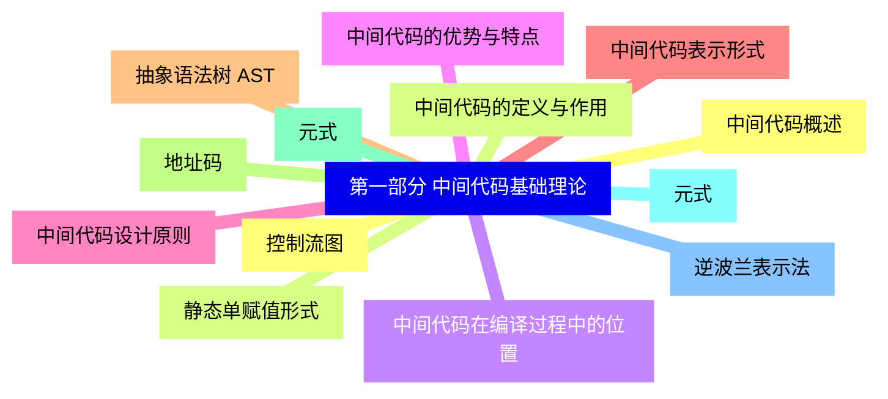
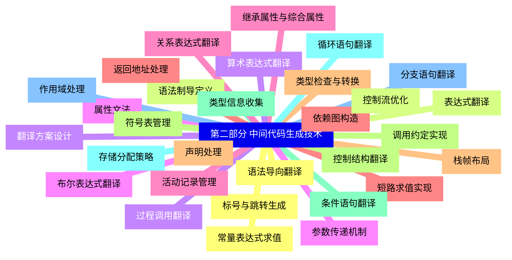
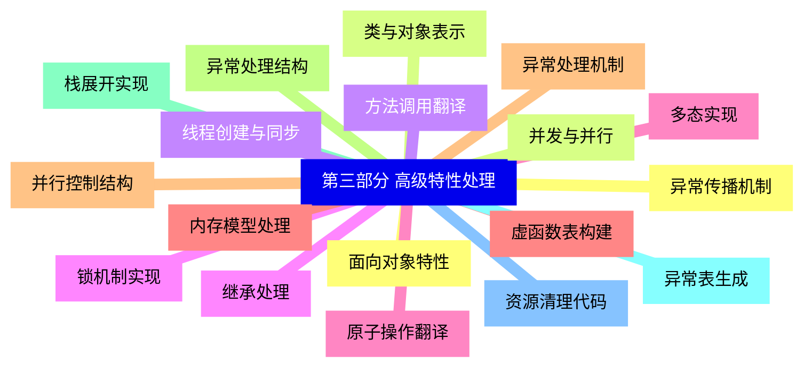
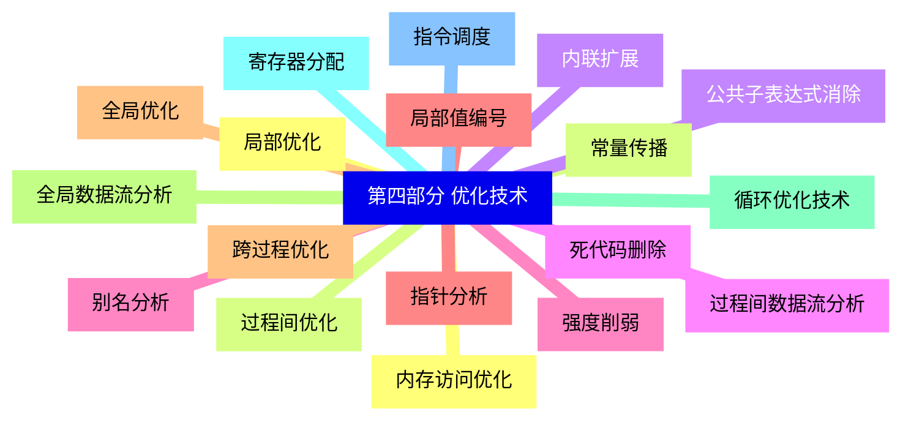
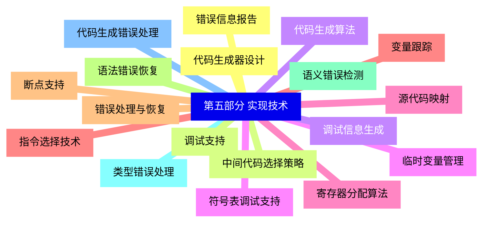
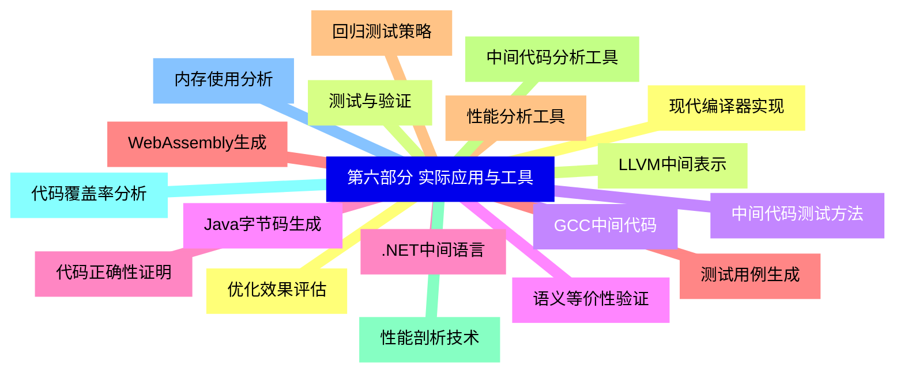


### 1 [第一部分 中间代码基础理论](#1)
#### 1.1 [中间代码概述](#1)
#### 1.2 [中间代码的定义与作用](#1)
#### 1.3 [中间代码在编译过程中的位置](#1)
#### 1.4 [中间代码的优势与特点](#1)
#### 1.5 [中间代码设计原则](#1)
#### 1.6 [中间代码表示形式](#1)
#### 1.7 [抽象语法树 AST](#1)
#### 1.8 [地址码](#1)
#### 1.9 [元式](#1)
#### 1.10 [元式](#1)
#### 1.11 [逆波兰表示法](#1)
#### 1.12 [控制流图](#1)
#### 1.13 [静态单赋值形式](#1)
### 2 [第二部分 中间代码生成技术](#2)
#### 2.1 [语法导向翻译](#2)
#### 2.2 [语法制导定义](#2)
#### 2.3 [翻译方案设计](#2)
#### 2.4 [属性文法](#2)
#### 2.5 [继承属性与综合属性](#2)
#### 2.6 [依赖图构造](#2)
#### 2.7 [声明处理](#2)
#### 2.8 [符号表管理](#2)
#### 2.9 [类型信息收集](#2)
#### 2.10 [存储分配策略](#2)
#### 2.11 [作用域处理](#2)
#### 2.12 [常量表达式求值](#2)
#### 2.13 [表达式翻译](#2)
#### 2.14 [算术表达式翻译](#2)
#### 2.15 [布尔表达式翻译](#2)
#### 2.16 [关系表达式翻译](#2)
#### 2.17 [短路求值实现](#2)
#### 2.18 [类型检查与转换](#2)
#### 2.19 [控制结构翻译](#2)
#### 2.20 [条件语句翻译](#2)
#### 2.21 [循环语句翻译](#2)
#### 2.22 [分支语句翻译](#2)
#### 2.23 [标号与跳转生成](#2)
#### 2.24 [控制流优化](#2)
#### 2.25 [过程调用翻译](#2)
#### 2.26 [参数传递机制](#2)
#### 2.27 [活动记录管理](#2)
#### 2.28 [返回地址处理](#2)
#### 2.29 [栈帧布局](#2)
#### 2.30 [调用约定实现](#2)
### 3 [第三部分 高级特性处理](#3)
#### 3.1 [面向对象特性](#3)
#### 3.2 [类与对象表示](#3)
#### 3.3 [方法调用翻译](#3)
#### 3.4 [继承处理](#3)
#### 3.5 [多态实现](#3)
#### 3.6 [虚函数表构建](#3)
#### 3.7 [异常处理机制](#3)
#### 3.8 [异常处理结构](#3)
#### 3.9 [栈展开实现](#3)
#### 3.10 [异常表生成](#3)
#### 3.11 [资源清理代码](#3)
#### 3.12 [异常传播机制](#3)
#### 3.13 [并发与并行](#3)
#### 3.14 [线程创建与同步](#3)
#### 3.15 [锁机制实现](#3)
#### 3.16 [原子操作翻译](#3)
#### 3.17 [内存模型处理](#3)
#### 3.18 [并行控制结构](#3)
### 4 [第四部分 优化技术](#4)
#### 4.1 [局部优化](#4)
#### 4.2 [常量传播](#4)
#### 4.3 [公共子表达式消除](#4)
#### 4.4 [死代码删除](#4)
#### 4.5 [强度削弱](#4)
#### 4.6 [局部值编号](#4)
#### 4.7 [全局优化](#4)
#### 4.8 [全局数据流分析](#4)
#### 4.9 [循环优化技术](#4)
#### 4.10 [寄存器分配](#4)
#### 4.11 [指令调度](#4)
#### 4.12 [内存访问优化](#4)
#### 4.13 [过程间优化](#4)
#### 4.14 [内联扩展](#4)
#### 4.15 [过程间数据流分析](#4)
#### 4.16 [别名分析](#4)
#### 4.17 [指针分析](#4)
#### 4.18 [跨过程优化](#4)
### 5 [第五部分 实现技术](#5)
#### 5.1 [代码生成器设计](#5)
#### 5.2 [中间代码选择策略](#5)
#### 5.3 [代码生成算法](#5)
#### 5.4 [临时变量管理](#5)
#### 5.5 [寄存器分配算法](#5)
#### 5.6 [指令选择技术](#5)
#### 5.7 [错误处理与恢复](#5)
#### 5.8 [语法错误恢复](#5)
#### 5.9 [语义错误检测](#5)
#### 5.10 [类型错误处理](#5)
#### 5.11 [代码生成错误处理](#5)
#### 5.12 [错误信息报告](#5)
#### 5.13 [调试支持](#5)
#### 5.14 [调试信息生成](#5)
#### 5.15 [符号表调试支持](#5)
#### 5.16 [源代码映射](#5)
#### 5.17 [变量跟踪](#5)
#### 5.18 [断点支持](#5)
### 6 [第六部分 实际应用与工具](#6)
#### 6.1 [现代编译器实现](#6)
#### 6.2 [LLVM中间表示](#6)
#### 6.3 [GCC中间代码](#6)
#### 6.4 [Java字节码生成](#6)
#### 6.5 [.NET中间语言](#6)
#### 6.6 [WebAssembly生成](#6)
#### 6.7 [性能分析工具](#6)
#### 6.8 [中间代码分析工具](#6)
#### 6.9 [性能剖析技术](#6)
#### 6.10 [代码覆盖率分析](#6)
#### 6.11 [内存使用分析](#6)
#### 6.12 [优化效果评估](#6)
#### 6.13 [测试与验证](#6)
#### 6.14 [中间代码测试方法](#6)
#### 6.15 [语义等价性验证](#6)
#### 6.16 [代码正确性证明](#6)
#### 6.17 [测试用例生成](#6)
#### 6.18 [回归测试策略](#6)




### 1 第一部分 中间代码基础理论

---
### 1 第一部分 中间代码基础理论
___
#### 1.1 中间代码概述
___
#### 1.2 中间代码的定义与作用
___
#### 1.3 中间代码在编译过程中的位置
___
#### 1.4 中间代码的优势与特点
___
#### 1.5 中间代码设计原则
___
#### 1.6 中间代码表示形式
___
#### 1.7 抽象语法树 AST
___
#### 1.8 地址码
___
#### 1.9 元式
___
#### 1.10 元式
___
#### 1.11 逆波兰表示法
___
#### 1.12 控制流图
___
#### 1.13 静态单赋值形式
### 2 第二部分 中间代码生成技术

---
### 2 第二部分 中间代码生成技术
___
#### 2.1 语法导向翻译
___
#### 2.2 语法制导定义
___
#### 2.3 翻译方案设计
___
#### 2.4 属性文法
___
#### 2.5 继承属性与综合属性
___
#### 2.6 依赖图构造
___
#### 2.7 声明处理
___
#### 2.8 符号表管理
___
#### 2.9 类型信息收集
___
#### 2.10 存储分配策略
___
#### 2.11 作用域处理
___
#### 2.12 常量表达式求值
___
#### 2.13 表达式翻译
___
#### 2.14 算术表达式翻译
___
#### 2.15 布尔表达式翻译
___
#### 2.16 关系表达式翻译
___
#### 2.17 短路求值实现
___
#### 2.18 类型检查与转换
___
#### 2.19 控制结构翻译
___
#### 2.20 条件语句翻译
___
#### 2.21 循环语句翻译
___
#### 2.22 分支语句翻译
___
#### 2.23 标号与跳转生成
___
#### 2.24 控制流优化
___
#### 2.25 过程调用翻译
___
#### 2.26 参数传递机制
___
#### 2.27 活动记录管理
___
#### 2.28 返回地址处理
___
#### 2.29 栈帧布局
___
#### 2.30 调用约定实现
### 3 第三部分 高级特性处理

---
### 3 第三部分 高级特性处理
___
#### 3.1 面向对象特性
___
#### 3.2 类与对象表示
___
#### 3.3 方法调用翻译
___
#### 3.4 继承处理
___
#### 3.5 多态实现
___
#### 3.6 虚函数表构建
___
#### 3.7 异常处理机制
___
#### 3.8 异常处理结构
___
#### 3.9 栈展开实现
___
#### 3.10 异常表生成
___
#### 3.11 资源清理代码
___
#### 3.12 异常传播机制
___
#### 3.13 并发与并行
___
#### 3.14 线程创建与同步
___
#### 3.15 锁机制实现
___
#### 3.16 原子操作翻译
___
#### 3.17 内存模型处理
___
#### 3.18 并行控制结构
### 4 第四部分 优化技术

---
### 4 第四部分 优化技术
___
#### 4.1 局部优化
___
#### 4.2 常量传播
___
#### 4.3 公共子表达式消除
___
#### 4.4 死代码删除
___
#### 4.5 强度削弱
___
#### 4.6 局部值编号
___
#### 4.7 全局优化
___
#### 4.8 全局数据流分析
___
#### 4.9 循环优化技术
___
#### 4.10 寄存器分配
___
#### 4.11 指令调度
___
#### 4.12 内存访问优化
___
#### 4.13 过程间优化
___
#### 4.14 内联扩展
___
#### 4.15 过程间数据流分析
___
#### 4.16 别名分析
___
#### 4.17 指针分析
___
#### 4.18 跨过程优化
### 5 第五部分 实现技术

---
### 5 第五部分 实现技术
___
#### 5.1 代码生成器设计
___
#### 5.2 中间代码选择策略
___
#### 5.3 代码生成算法
___
#### 5.4 临时变量管理
___
#### 5.5 寄存器分配算法
___
#### 5.6 指令选择技术
___
#### 5.7 错误处理与恢复
___
#### 5.8 语法错误恢复
___
#### 5.9 语义错误检测
___
#### 5.10 类型错误处理
___
#### 5.11 代码生成错误处理
___
#### 5.12 错误信息报告
___
#### 5.13 调试支持
___
#### 5.14 调试信息生成
___
#### 5.15 符号表调试支持
___
#### 5.16 源代码映射
___
#### 5.17 变量跟踪
___
#### 5.18 断点支持
### 6 第六部分 实际应用与工具

---
### 6 第六部分 实际应用与工具
___
#### 6.1 现代编译器实现
___
#### 6.2 LLVM中间表示
___
#### 6.3 GCC中间代码
___
#### 6.4 Java字节码生成
___
#### 6.5 .NET中间语言
___
#### 6.6 WebAssembly生成
___
#### 6.7 性能分析工具
___
#### 6.8 中间代码分析工具
___
#### 6.9 性能剖析技术
___
#### 6.10 代码覆盖率分析
___
#### 6.11 内存使用分析
___
#### 6.12 优化效果评估
___
#### 6.13 测试与验证
___
#### 6.14 中间代码测试方法
___
#### 6.15 语义等价性验证
___
#### 6.16 代码正确性证明
___
#### 6.17 测试用例生成
___
#### 6.18 回归测试策略


### 1 第一部分 中间代码基础理论{#1}

{}

<--->
{}
{}
{}
{}
{}
{}
{}
{}
{}
{}
{}
{}
{}
{}
{}
{}
{}
{}
{}
{}
{}
{}
{}
{}
{}
{}
{}

### 2 第二部分 中间代码生成技术{#2}

{}
{}
{}
{}
{}
{}
{}
{}
{}
{}
{}
{}
{}
{}
{}
{}
{}
{}
{}
{}
{}
{}
{}
{}
{}
{}
{}
{}
{}
{}
{}
{}
{}
{}
{}
{}
{}
{}
{}
{}
{}
{}
{}
{}
{}
{}
{}
{}
{}
{}
{}
{}
{}
{}
{}
{}
{}
{}
{}
{}
{}
<--->

{}

### 3 第三部分 高级特性处理{#3}

{}

<--->
{}
{}
{}
{}
{}
{}
{}
{}
{}
{}
{}
{}
{}
{}
{}
{}
{}
{}
{}
{}
{}
{}
{}
{}
{}
{}
{}
{}
{}
{}
{}
{}
{}
{}
{}
{}
{}

### 4 第四部分 优化技术{#4}

{}
{}
{}
{}
{}
{}
{}
{}
{}
{}
{}
{}
{}
{}
{}
{}
{}
{}
{}
{}
{}
{}
{}
{}
{}
{}
{}
{}
{}
{}
{}
{}
{}
{}
{}
{}
{}
<--->

{}

### 5 第五部分 实现技术{#5}

{}

<--->
{}
{}
{}
{}
{}
{}
{}
{}
{}
{}
{}
{}
{}
{}
{}
{}
{}
{}
{}
{}
{}
{}
{}
{}
{}
{}
{}
{}
{}
{}
{}
{}
{}
{}
{}
{}
{}

### 6 第六部分 实际应用与工具{#6}

{}
{}
{}
{}
{}
{}
{}
{}
{}
{}
{}
{}
{}
{}
{}
{}
{}
{}
{}
{}
{}
{}
{}
{}
{}
{}
{}
{}
{}
{}
{}
{}
{}
{}
{}
{}
{}
<--->

{}
